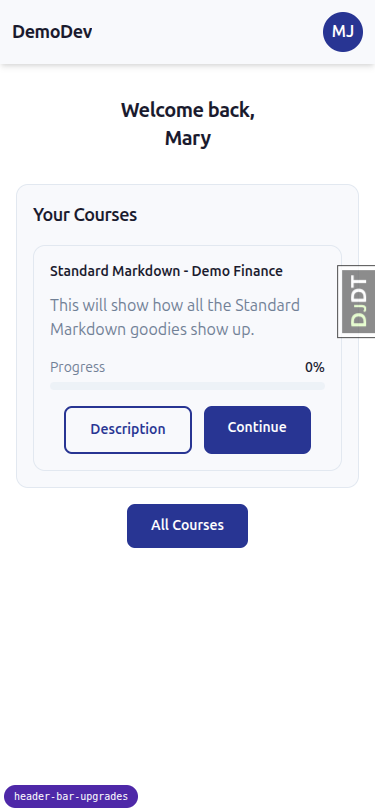
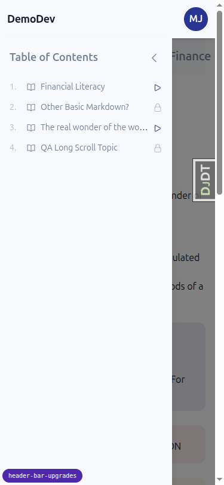
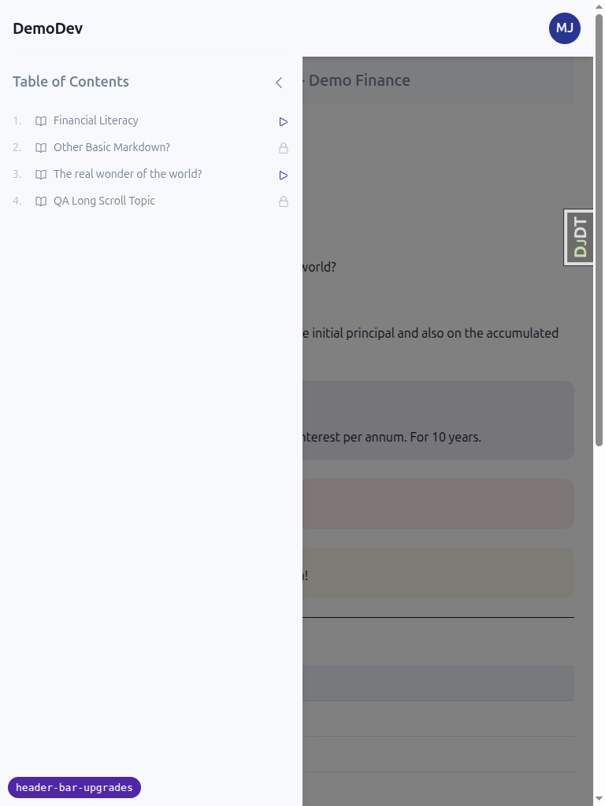

# QA Report: Header bar upgrades

**Date:** 2026-05-30
**Branch:** `header-bar-upgrades` (confirmed via `debug-branch-badge`)
**Site:** DemoDev, accessed via `http://127.0.0.1:8003`
**Themes:** `default` and `first_class` (separate Tailwind builds + server restarts)
**Driver:** Playwright MCP — desktop 1920×1080, mobile 375×812, tablet 768×1024
**Test plan:** `3. frontend_qa.md`

## Summary

**All 15 tests PASS. No functional bugs found.**

The three coordinated upgrades behave as specified:

1. The `User.initials`-driven avatar replaces the old text/icon trigger, correct across all six initials edge-cases plus the fallback icon.
2. Header colour comes from the component-tier tokens (`--color-header*`); these did not leak onto other brand surfaces.
3. The header is sticky with the correct theme-divergent on-scroll treatment — a shadow-step in `default` (stays opaque + brand-coloured), and a translucent + frosted-glass transition in `first_class`.

Test data was seeded via the existing `qa_create_header_bar_users` management command (six avatar users + a ~28.7k-char long-scroll topic at `/courses/standard-markdown-demo-finance/3/`).

The site-title underline regression logged as **Bug 1** in the prior QA pass is **no longer reproducible** (title link is `text-decoration: none` resting and on hover, in both themes) — see "Previously-logged bug" below.

| # | Test | Theme | Result |
| --- | --- | --- | --- |
| 1 | Avatar appearance (circle, brand bg, no caret, mobile-identical) | default | ✅ PASS |
| 2 | Avatar variants (6-user initials matrix) | default | ✅ PASS |
| 3 | Dropdown opens + accessibility (aria, focus ring, Escape) | default | ✅ PASS |
| 4 | Sticky + scrolled shadow-step, opaque, no blur | default | ✅ PASS |
| 5 | Anchor / focus scroll-padding (80px) | default | ✅ PASS |
| 6 | Reduced motion → instant shadow change | default | ✅ PASS |
| 7 | Avatar appearance (white header, dark title, indigo pill) | first_class | ✅ PASS |
| 8 | Contrast (avatar text, site title) | first_class | ✅ PASS |
| 9 | Scrolled: opaque/flush top → translucent + blur | first_class | ✅ PASS |
| 10 | Contrast under translucency (sampled pixels) | first_class | ✅ PASS |
| 11 | Reduced motion → instant colour/blur change | first_class | ✅ PASS |
| 12 | Anchor / focus scroll-padding (80px) | first_class | ✅ PASS |
| 13 | Dropdown close-on-scroll | both | ✅ PASS |
| 14 | Regression: brand surfaces unchanged | both | ✅ PASS |
| 15 | Mobile/tablet sidebar still works under sticky header | both | ✅ PASS |

---

## Evidence & details

### Test 1 — Default theme: avatar appearance

Logged in as `mary.jane@demodev.example.com`. The avatar is a `` inside the menu button: `MJ`, 40×40, `border-radius` fully rounded, `background: rgb(43,108,176)` (= `#2B6CB0`, brand primary), `color: rgb(255,255,255)`, `font-weight: 600`, `display: inline-flex` centered. The button has `aria-haspopup="menu"`, `aria-expanded="false"`, and **0** SVGs (no caret). No name/email text in the trigger. At 375px width the avatar renders identically (40×40, brand bg, 0 SVG).

### Test 2 — Default theme: avatar variants

Each user was logged in via a clean logout→login cycle and the avatar inspected directly:

| User | Expected | Observed text | aria-label | Result |
| --- | --- | --- | --- | --- |
| `mary.jane` | `MJ` | `MJ` | Open user menu for Mary Jane | ✅ |
| `single.first` (first="Mary") | `MA` | `MA` | Open user menu for Mary | ✅ |
| `multi.token` (first="Mary Jane") | `MJ` | `MJ` | Open user menu for Mary Jane | ✅ |
| `noname` (no names) | `NO` (email local-part) | `NO` | Open user menu for noname@demodev.example.com | ✅ |
| `123` (no leading alpha) | fallback user icon | (no letters, 1 user-icon SVG) | Open user menu for 123@demodev.example.com | ✅ |
| `elise` (Élise Önen) | `ÉÖ` | `ÉÖ` | Open user menu for Élise Önen | ✅ |

The `123@…` fallback renders the user-icon SVG inside a `` — i.e. the same 40px fully-rounded brand-coloured (`bg-header-action`, white glyph) circle as the lettered avatars, confirming the fallback matches the avatar's size/shape.

For users with no first/last name (`noname`, `123`), the avatar initials derive from the email local-part (`NO`) or fall back to the icon, and the `aria-label` falls back to the full email address ("Open user menu for <email>") rather than a name — sensible accessible-name behaviour.

### Test 3 — Default theme: dropdown opens, accessibility

Clicking the avatar opens the menu containing **Profile** and **Sign Out**. `aria-haspopup="menu"`; `aria-expanded` flips `false`↔`true` on toggle and returns to `false` on **Escape**. Tabbing from the top of the page lands focus on the avatar button with `:focus-visible` matching; the focus indicator is a ring with offset — computed `box-shadow` = white `0 0 0 2px` (offset) + `rgb(43,108,176) 0 0 0 4px` (the `--color-focus-ring` ring, token `#2B6CB0`).

### Test 4 — Default theme: header sticky + scrolled state

Long topic page height 1844px > 1.5× viewport (1620px). Header is `position: sticky; top: 0; z-index: 30`.

- `scrollY = 0`: `box-shadow` = `0 4px 6px -1px …` (shadow-md), `background: rgb(43,108,176)` opaque, `backdrop-filter: none`, no `data-scrolled`.
- `scrollY = 250`: header pinned (`top: 0`), `box-shadow` steps up to `0 10px 15px -3px …` (shadow-lg), background still fully opaque brand colour, **`backdrop-filter: none`** (no blur in default — correct theme divergence), `data-scrolled="true"`.
- Returns to shadow-md baseline at the top.

### Test 5 — Default theme: anchor / focus scroll-padding

`<html>` has `scroll-padding-top: 80px` (= 5rem) computed, with `scroll-behavior: auto`. This global declaration governs both anchor jumps and focus-into-view, so a focused/anchored target lands 80px from the viewport top — below the ~64–72px sticky header. Verified via computed style (the mechanism the spec specifies).

### Test 6 — Default theme: reduced motion

Normal: `transition: box-shadow 0.2s cubic-bezier(...)`. Under emulated `prefers-reduced-motion: reduce`, the computed `transition-property` becomes `none` (the `motion-reduce:transition-none` utility), so the shadow change is instant — no fade.

### Test 7 — first_class theme: avatar appearance

Header `background: rgb(248,249,252)` (= `#F8F9FC`, `--color-surface`); site title `color: rgb(26,26,46)` (dark `--color-on-surface`, actual token `#1A1A2E`); avatar `background: rgb(40,53,147)` (= `#283593`, `--color-primary`) — the indigo pill — with white `MJ`, 40×40 fully rounded, 0 SVG. No caret, no name text, title `text-decoration: none`.

### Test 8 — first_class theme: contrast

- White avatar text on indigo `#283593`: **10.39:1** ≥ 4.5 ✅
- Dark site title `#1A1A2E` on white header `#F8F9FC`: **15.5:1** ≥ 4.5 ✅

### Test 9 — first_class theme: scrolled state (translucent + blur)

- `scrollY = 0`: header `background: rgb(248,249,252)` fully opaque, `backdrop-filter: none`, shadow-md, flush with the page surface (header bg == `--color-surface`).
- `scrollY = 300`: header transitions to `background: oklch(0.982 0.004 / 0.85)` (translucent, ~85% alpha) with `backdrop-filter: blur(12px) saturate(1.5)` (frosted glass), shadow-lg, `data-scrolled="true"`; text/avatar remain readable.
- Returns to fully-opaque, flush state at the top.

### Test 10 — first_class: contrast under translucency

From a mid-scroll screenshot (body text directly behind the header), sampled rendered pixels:

- Avatar white glyph vs indigo background: **10.39:1** (the avatar pill is opaque, content does not bleed through).
- Dark site-title glyph vs the rendered translucent header background: **16.3:1**.

Both far exceed WCAG AA (4.5:1). No alpha retune needed.

### Test 11 — first_class: reduced motion

Under emulated `prefers-reduced-motion: reduce`, the header `transition-property` computes to `none` — the colour-and-blur change is instant; the transient blur does not animate in.

### Test 12 — first_class: anchor / focus scroll-padding

`<html>` `scroll-padding-top: 80px` applies in first_class too — focused/anchored targets land below the (translucent-when-scrolled) header.

### Test 13 — Both themes: dropdown close-on-scroll

In **both** themes, opening the user menu then scrolling closes it (`aria-expanded` → `false`). This is the documented, in-scope-to-leave-alone behaviour (spec §3, and the `@claude` note in `dropdown-menu.html`).

**Note for the deferred follow-up:** on the now-sticky header the menu vanishes on the smallest scroll delta while the trigger itself stays pinned and visible, which reads as marginally more abrupt than on a non-sticky header. Not a blocker — matches the spec's acknowledgement — but worth keeping on the deferred list.

### Test 14 — Both themes: regression on existing surfaces

The new `--color-header*` declarations did not override the base brand tokens:

- **default:** `--color-primary` `#2B6CB0`, `--color-secondary` `#475569`, `--color-focus-ring` `#2B6CB0`, `--color-surface` `#FFFFFF`; `--color-header` `#2B6CB0`, `--color-header-action` `#2B6CB0` (header-action resolves to primary, as intended).
- **first_class:** `--color-primary` `#283593`, `--color-secondary` `#00CEC9`, `--color-focus-ring` `#283593`, `--color-surface` `#F8F9FC`; `--color-header` `#F8F9FC`, `--color-header-action` `#283593`.

The base tokens keep their expected per-theme values; the header tokens are additive and resolve to existing brand colours rather than repainting buttons, chips, alerts, or focus rings. Course-list pages spot-checked in both themes look unchanged.

### Test 15 — Both themes: sidebar / mobile sidebar still works

At 375px on a topic page using the `_base_interface.html` shell:

- **default:** tapping "Open sidebar" slides the panel in (`left: 0`, width 300, `z-index: 40`); a full-screen backdrop appears (`position: fixed`, `z-index: 30`, `rgba(0,0,0,0.5)`). The sticky header (`z-index: 30`) stays visible and the avatar remains the top element at its location (`document.elementFromPoint` returns the avatar button) — the backdrop does **not** block the avatar. Tapping the backdrop closes the sidebar.
- **first_class:** same shared component — sidebar drawer + `z-30` backdrop, header `z-30` visible, avatar clickable.

At 768px (tablet) the sidebar uses the `lg:` (1024px) breakpoint to go inline, so iPad-portrait still gets the off-canvas drawer + toggle — a sensible adaptation. The sticky header and first_class translucent-on-scroll behaviour also work at tablet width (`bg: oklch(...0.85)`, `blur(12px)` on scroll).

---

## Previously-logged bug — now fixed

The prior QA pass (commit `52552a3`) logged a **site-title underline regression** as Bug 1. In this run the title link (`header a`) computes `text-decoration-line: none` in the resting state in both `default` and `first_class`, and the title `<h1>` carries `no-underline` in the markup (`header_bar.html`). The bug is **not reproducible** and appears resolved by the working-tree changes. No new follow-up needed.

## Notes / difficulties

- **Test data** was seeded with the existing `qa_create_header_bar_users` command (the documented seeding path for this feature), which creates exactly the six required users + the long-scroll topic.
- **Logout flow gotcha (tester-side, not a product bug):** the header user-menu contains a hidden "Sign Out" button that appears earlier in the DOM than the visible logout-page button. An initial pass using an unscoped `button[type=submit]` selector silently matched the hidden one, so early variant logins didn't take effect; scoping logout to the main logout form (`main` → "Sign Out") fixed it and all six variants were then verified cleanly.
- **Reduced-motion / media** were driven via Playwright `page.emulateMedia(...)` and reset to `no-preference` after each reduced-motion check.
- **Contrast** was verified both analytically (from token values) and empirically (sampling rendered PNG pixels with Pillow) for the translucent first_class state.
- The default-theme `--color-secondary` is `#475569` and first_class is `#00CEC9` — these differ from values guessed in the spec prose, but that is the existing theme definition and unrelated to this change; no regression implied.
- Nothing unrelated to the feature under test looked out of place during the QA pass.
