# Frontend QA Report — Public browsing for unauthenticated users

**Feature:** `home_page` (anonymous public browsing + deferred-login intent + SEO)
**Site under test:** DemoDev (dev server pins `FORCE_SITE_NAME = "DemoDev"`)
**Base URL:** `http://127.0.0.1:8571`
**Viewports:** Desktop 1920×1080, Mobile 375×812, Tablet 768×1024
**Tooling:** Playwright MCP (interactive), Mailpit (`:8025`) for email verification, `fls:qa-data-helper` for data setup.

## Summary

Every workflow in the test plan was executed, including the signup-based deferred-login
flows (Workflows 5–7) using fresh, never-used emails and real email verification via
Mailpit. **All functional workflows pass.** Two SEO defects were found, both in
Workflow 9 (discoverability). They are already recorded in `todo.md`; this run confirms
they are still present.

| # | Workflow | Result |
|---|----------|--------|
| 1 | Anonymous home page | ✅ Pass |
| 2 | Authenticated dashboard (regression) | ✅ Pass |
| 3 | Anonymous catalogue + access badges | ✅ Pass |
| 4 | Anonymous course detail (free + gated, incl. §3 crash regression) | ✅ Pass |
| 5 | Deferred login: free enrol completes intent (login **and** signup) | ✅ Pass |
| 6 | Deferred login: apply lands on application form (login **and** signup) + returning applicant | ✅ Pass |
| 7 | New-user signup that must complete registration forms (critical) | ✅ Pass |
| 8 | Open-redirect rejection | ✅ Pass |
| 9 | SEO / discoverability | ⚠️ 2 bugs (see below) |
| 10 | Tenant isolation for anonymous visitors (spot check) | ✅ Pass |

---

## Bugs

### Bug 1 (High) — JSON-LD emitted as `application/json`, not `application/ld+json`

**Test:** Workflow 9, items 3 (Course JSON-LD) and 4 (Catalogue JSON-LD).

**Expected:** A JSON-LD structured-data block, i.e. `<script type="application/ld+json">`.
Search engines only recognise structured data delivered with the `application/ld+json`
MIME type; anything else is ignored.

**Actual:** The JSON-LD **content is correct** on every page (valid JSON, right
`@type`, absolute URLs, correct `isAccessibleForFree`), but both blocks are emitted with
`type="application/json"`. There is **zero** `application/ld+json` on either page, so
crawlers will not parse this structured data at all — defeating the purpose of the feature.

```
detail  → <script id="course-jsonld"    type="application/json">   (application/ld+json: 0)
catalogue → <script id="catalogue-jsonld" type="application/json">  (application/ld+json: 0)
```

Free course block (content correct, type wrong):
```json
{"@context":"https://schema.org","@type":"Course","name":"QA Free Course (Access Types)",
 "description":"Learn the fundamentals of access types in this free, open course.",
 "url":"http://127.0.0.1:8571/courses/qa-free-course-access-types/detail/",
 "isAccessibleForFree":true}
```

**Root cause:** The templates render the block with Django's built-in `json_script`
filter, which always outputs `type="application/json"`:
- `freedom_ls/student_interface/templates/student_interface/course_detail.html:17` — `{{ json_ld|json_script:"course-jsonld" }}`
- `freedom_ls/student_interface/templates/student_interface/all_courses.html:10` — `{{ catalogue_json_ld|json_script:"catalogue-jsonld" }}`

`json_script` cannot emit `application/ld+json`, so a custom render (e.g. a dedicated
template tag / manual `<script>` with the type set and the payload safely escaped) is needed.


---

### Bug 2 (Medium) — `sitemap.xml` `<loc>` URLs drop the port / disagree with the request host

**Test:** Workflow 9, item 5 ("a `<loc>` per course — all using the current host").

**Expected:** The sitemap URLs use the current host, i.e. `http://127.0.0.1:8571/...`,
consistent with the JSON-LD `url` values and the `robots.txt` `Sitemap:` reference.

**Actual:** The three URL-emitting surfaces of this feature disagree on the host:

```
sitemap.xml   <loc> → http://127.0.0.1/courses/...        ← no port
robots.txt   Sitemap → http://127.0.0.1:8571/sitemap.xml  ← request host (with port)
JSON-LD        url   → http://127.0.0.1:8571/courses/...   ← request host (with port)
```

Because the sitemap `<loc>` entries drop the port, a crawler following the sitemap in
this environment would resolve the URLs against port 80, not the running server.

**Root cause:** `robots.txt` and the JSON-LD both build absolute URLs from the live
request (`config/views.py:15` uses `request.build_absolute_uri(...)`). The sitemap,
however, goes through Django's `django.contrib.sitemaps` framework
(`config/sitemaps.py`, wired in `config/urls.py`), which derives the host from the
current `Site`. The Sites framework resolves the current site by stripping the port from
the request host (`127.0.0.1:8571` → `127.0.0.1`) and matching a `Site` whose domain is
`127.0.0.1`, so the emitted `<loc>` host has no port.

Note: this is most visible in dev (non-standard port). In production, where the canonical
`Site` domain and the request host agree, it is likely benign — but it is a real
inconsistency (the feature builds canonical URLs two different ways) and fails the
"current host" assertion of Workflow 9.5, so it is worth reconciling (build the sitemap
URLs from the request, or ensure the sitemap and the request agree on host).

---

## Passing workflows — evidence & notes

### Workflow 1 — Anonymous home page ✅
Logged-out `/` returns 200 (no login redirect). Shows the anonymous hero
("Teach the way your learners need." + subtext) with a single **Browse all courses** CTA
and an **Available courses** list. **No** "Welcome back", In Progress, Learning History,
Recommended, or "sign in to see this" placeholders. Header shows **Login** and **Sign up**,
each carrying `?next=/`. **Browse all courses** navigates to `/courses/`.

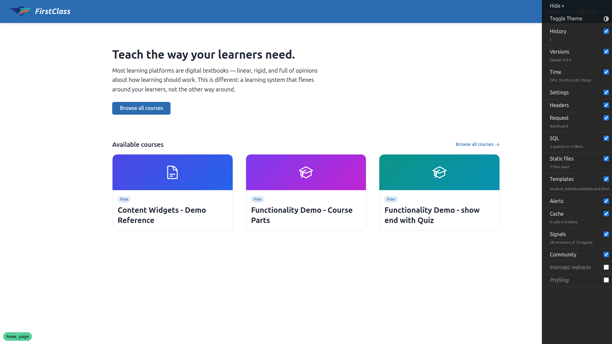

### Workflow 2 — Authenticated dashboard (regression) ✅
Logged in as `demodev@email.com`, `/` shows the normal dashboard: greeting
("Welcome back, …"), In Progress, Available (with "Not registered" eyebrows retained for
the authenticated view), user menu in the header — and **not** the anonymous hero.

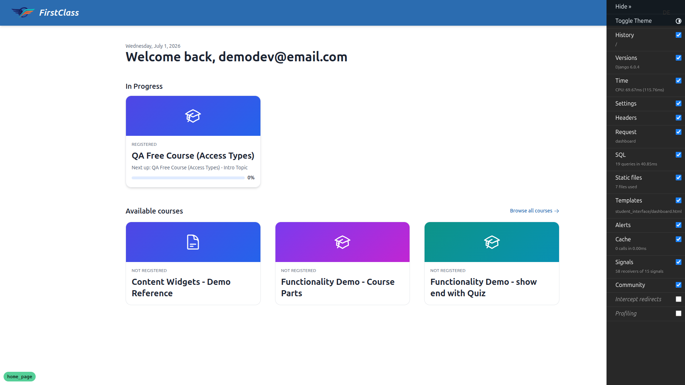

### Workflow 3 — Anonymous catalogue + access badges ✅
`/courses/` loads (200, no redirect) and lists every DemoDev course. The free course shows
a **Free** badge; the gated course shows a **By application** badge. No "Not registered"
eyebrow appears for the anonymous viewer. Title is `All Courses — DemoDev`.


### Workflow 4 — Anonymous course detail, free + gated ✅
**Free:** loads 200; hero stats strip (Lessons / Enrolment), CTA reads **Enrol for free**
pointing at `/courses/qa-free-course-access-types/access/` (not a `login?next=` link); the
enrolment signal reads **Free · open**; ToC items render **Locked** (no clickable links).
**Gated (the §3 crash regression):** loads cleanly — **no 500** — CTA reads **Apply now**
pointing at `/applications/apply/qa-application-gated-course-access-types/`; enrolment
signal reads **By application**.


### Workflow 5 — Deferred login: free enrol completes intent ✅
**Via login:** clicking **Enrol for free** while logged out redirects to
`/accounts/login/?next=…/access/`; after logging in as `demodev@email.com` the browser
lands **inside the course** (`/courses/qa-free-course-access-types/1/`), enrolled — no
intermediate "you need to enrol" page. The dashboard subsequently shows the course under
**In Progress**, confirming enrolment.
**Via signup:** covered by Workflow 7 (fresh signup with the same `next` also lands inside
the course, enrolled).


### Workflow 6 — Deferred login: apply lands on the application form ✅
**Via login:** **Apply now** (logged out) → `/accounts/login/?next=…/apply/…` → after login
lands on the **apply confirmation form** (`Submit application` button), **not**
auto-submitted.
**Returning applicant:** after submitting, revisiting the gated detail page shows the CTA
now reading **View my application**, pointing at the application **status** page
(`/applications/status/<uuid>/`), not "Apply now".
**Via signup:** a brand-new signup with `next=…/apply/…` also lands on the apply form
(authenticated, not auto-submitted) after email verification and completing registration.


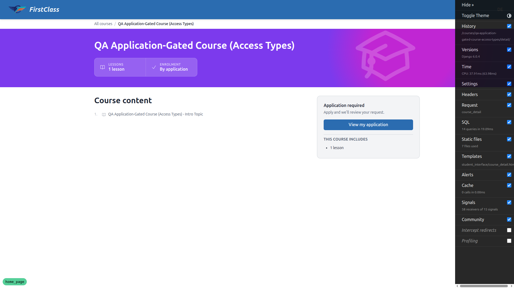
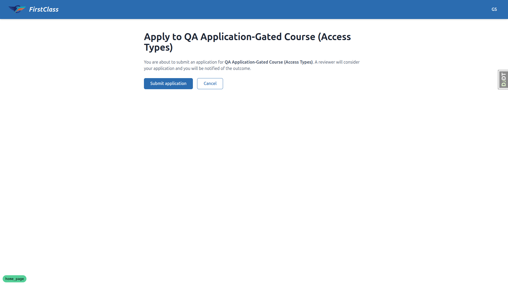

### Workflow 7 — New-user signup that must complete registration forms (critical) ✅
Preconditions set up via `fls:qa-data-helper`: DemoDev `allow_signups=True` and
`additional_registration_forms=['…PhoneNumberForm']` (renders a required `phone_number`
field). Full chain with a fresh email (`qa-newuser-wf7@email.com`):
1. **Enrol for free** (logged out) → login with `next=…/qa-free-course-access-types/access/`.
2. Chose **Sign up**, registered, accepted Terms + Privacy.
3. Verified the email via the Mailpit link (host correct: `127.0.0.1:8571`).
4. Redirected to **Complete your registration**, URL carrying the original
   `next=…/qa-free-course-access-types/access/`.
5. Submitted the `phone_number` form → landed **inside the free course**
   (`/courses/qa-free-course-access-types/1/`), enrolled. **Not** dumped on the generic
   dashboard — the original intent survived the signup → verify → complete-registration →
   destination chain.

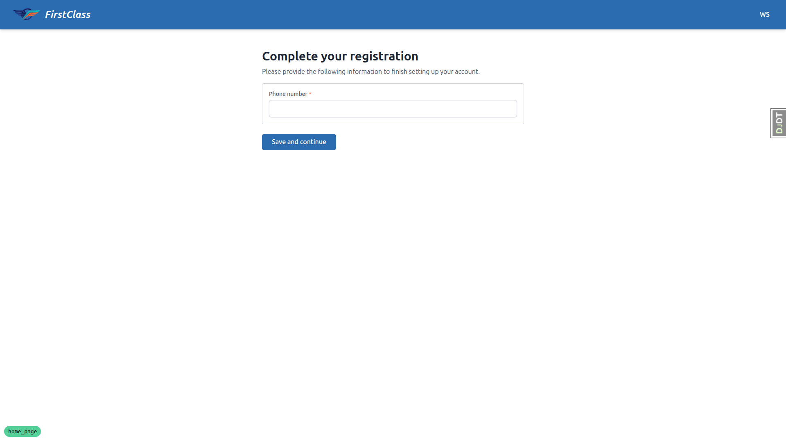
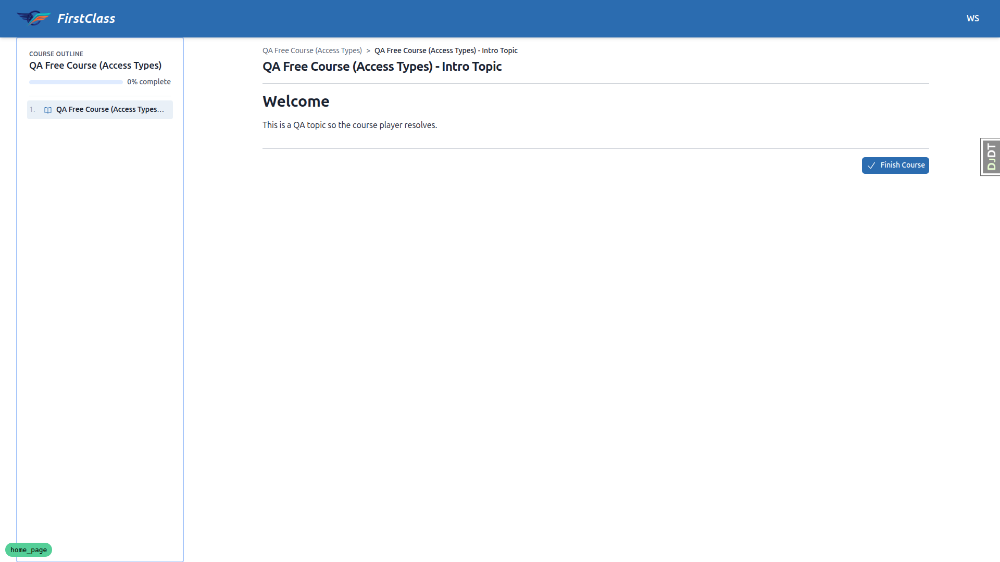

### Workflow 8 — Open-redirect rejection ✅
Visiting `/accounts/login/?next=https://evil.example/` and logging in as
`demodev@email.com` lands on `/` (the default post-login destination). The off-host `next`
is ignored — no redirect to `evil.example`. (The signup link on that login page also
dropped the off-host `next` entirely.)

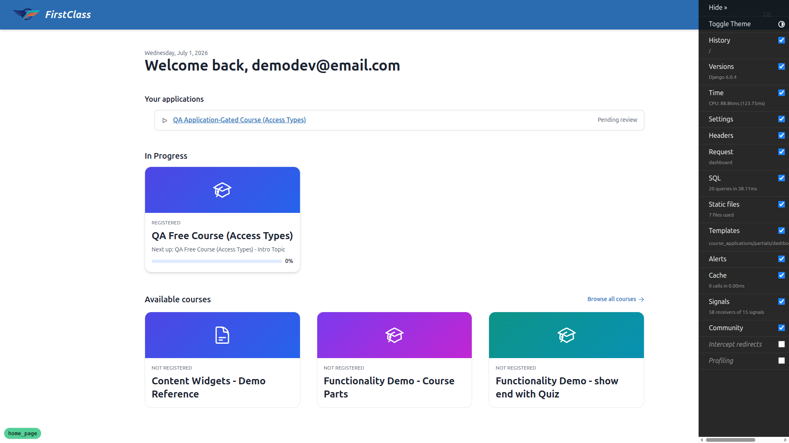

### Workflow 9 — SEO / discoverability ⚠️
- **Catalogue title/description:** `<title>All Courses — DemoDev</title>` and a
  descriptive, non-generic `<meta name="description">` ("Browse all available courses on
  DemoDev…"). ✅
- **Detail title/description:** `<title>` is the course title; `<meta name="description">`
  reflects the course description ("Learn the fundamentals of access types in this free,
  open course."). ✅
- **Course JSON-LD content:** `@type: Course`, `name`, absolute `url`, `isAccessibleForFree`
  `true` (free) / `false` (gated); `provider`/`image`/`author` absent. ✅ — but see **Bug 1** for the `type` attribute.
- **Catalogue JSON-LD content:** `@type: ItemList` with each course's absolute detail URL. ✅ — same **Bug 1** `type` defect.
- **sitemap.xml:** 200, valid XML, `Content-Type: application/xml`; contains the catalogue
  URL and a `<loc>` per course. ✅ content — but see **Bug 2** (host/port).
- **robots.txt:** 200, `Content-Type: text/plain`, does **not** `Disallow: /courses/` (it
  `Allow: /courses/`), and references this host's `sitemap.xml`. ✅

### Workflow 10 — Tenant isolation for anonymous visitors (spot check) ✅
The catalogue, `sitemap.xml`, and the JSON-LD `ItemList` all list **only** the 7 DemoDev
courses (the demo courses + the two QA access-type slugs). No courses from any other site
in the database appear in any of these surfaces.

---

## Responsive testing (mobile 375×812 / tablet 768×1024)

- **Mobile:** anonymous home, catalogue, and free detail all stack into a single readable
  column. The header keeps **Login / Sign up** inline (no hamburger needed for two links);
  the CTA button is full-width; course cards and access badges render cleanly; touch
  targets are adequately sized.
- **Tablet:** gets the **desktop** navigation (logo + Login/Sign up inline). Catalogue
  cards render as wide single-column rows; the detail hero, stats strip, CTA card and ToC
  render at a reasonable width. No overflow/overlap.

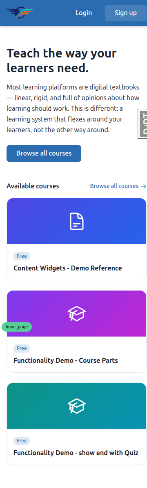
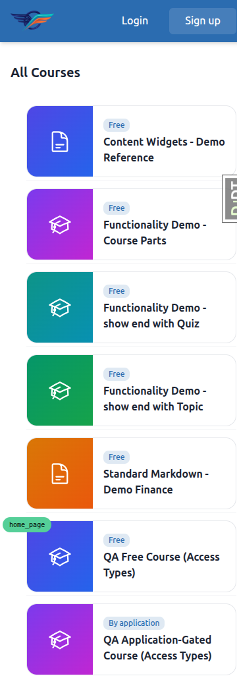
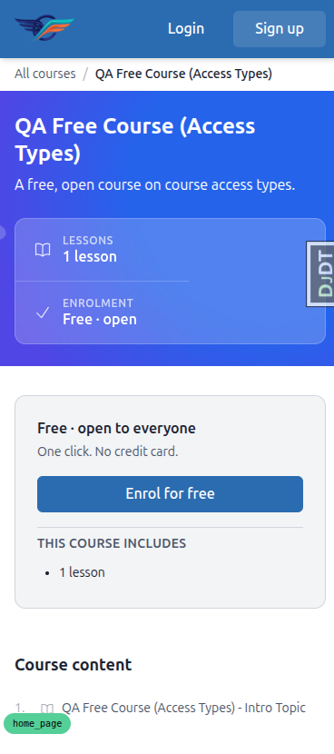
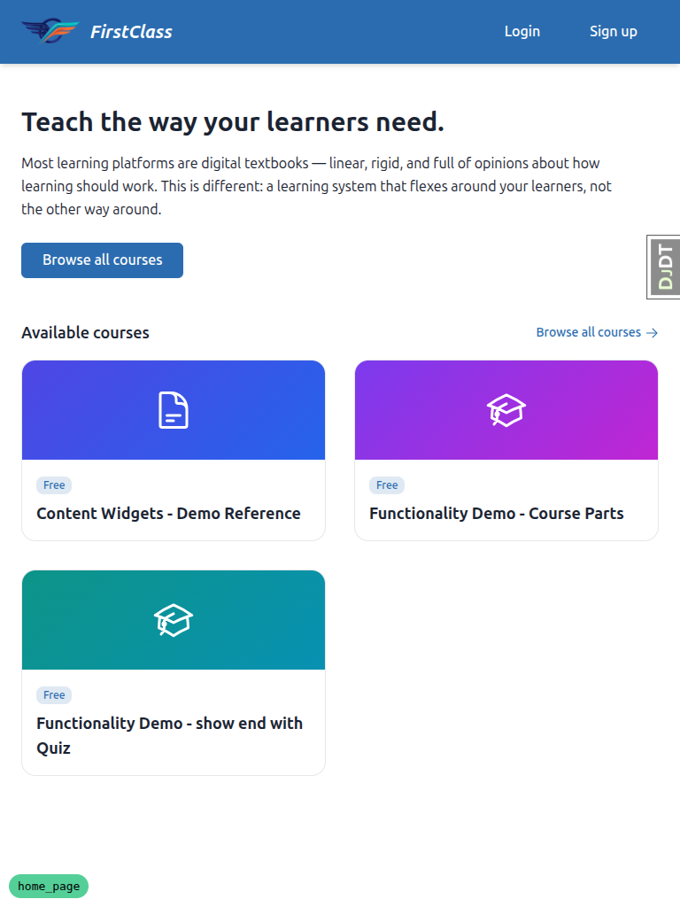
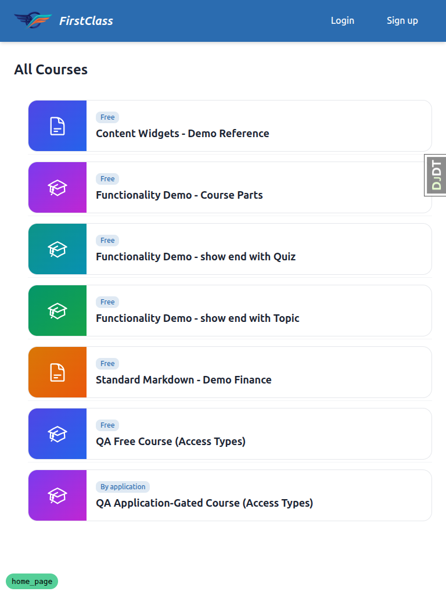
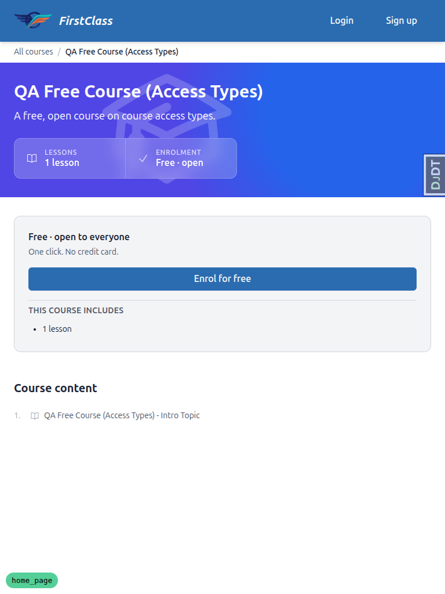

---

## Other observations (tangential — not feature bugs)

- **Course detail "About this course" / "What you'll learn" sections did not render** for
  the two QA access-type courses. This is a **data limitation** — those courses were
  created minimally (only a description/subtitle were added for the SEO test) and have no
  "about"/objectives content — not a code defect. All other detail sections rendered.
- **Django Debug Toolbar overlaps page content at the mobile viewport** by default
  (`data-default-show="true"` in dev). This is a dev-only tooling artifact, not a product
  issue; it was collapsed for the mobile/tablet screenshots.
- **Site display/brand name is "FirstClass"** in the header while the tenant is DemoDev
  (the `— DemoDev` title suffix confirms the site). This appears intentional (brand name ≠
  site name) and did not affect any test.

---

## Notes on execution

- No test was skipped. Missing data (an additional registration form on DemoDev, a
  course-specific description for the free course) was created via the `fls:qa-data-helper`
  agent, not by hand.
- The registration-form gate exempts staff/superusers, so Workflow 7 was exercised with a
  fresh, non-staff signup (as the plan requires) rather than `demodev@email.com`.
- Email verification is mandatory in dev; verification links were retrieved from Mailpit
  (`http://localhost:8025`). All verification links used the correct host (`127.0.0.1:8571`).
