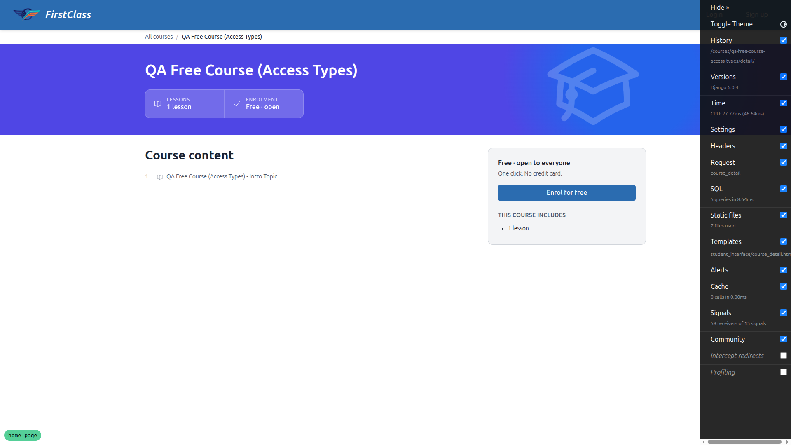
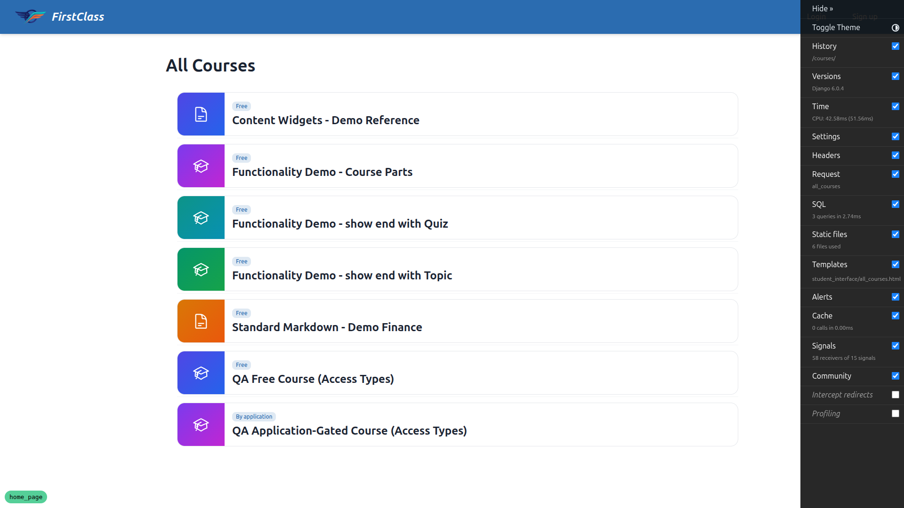
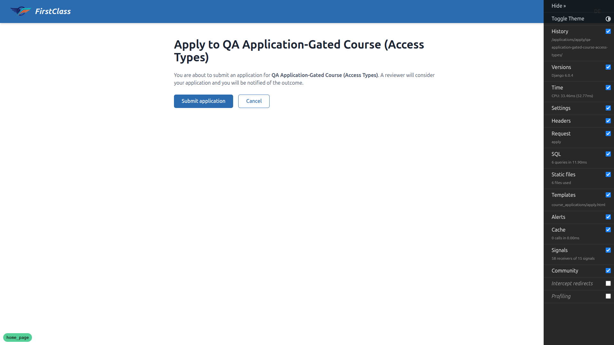
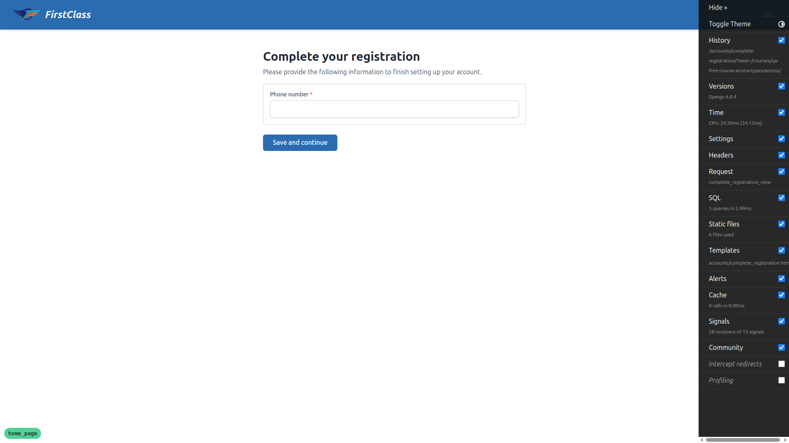
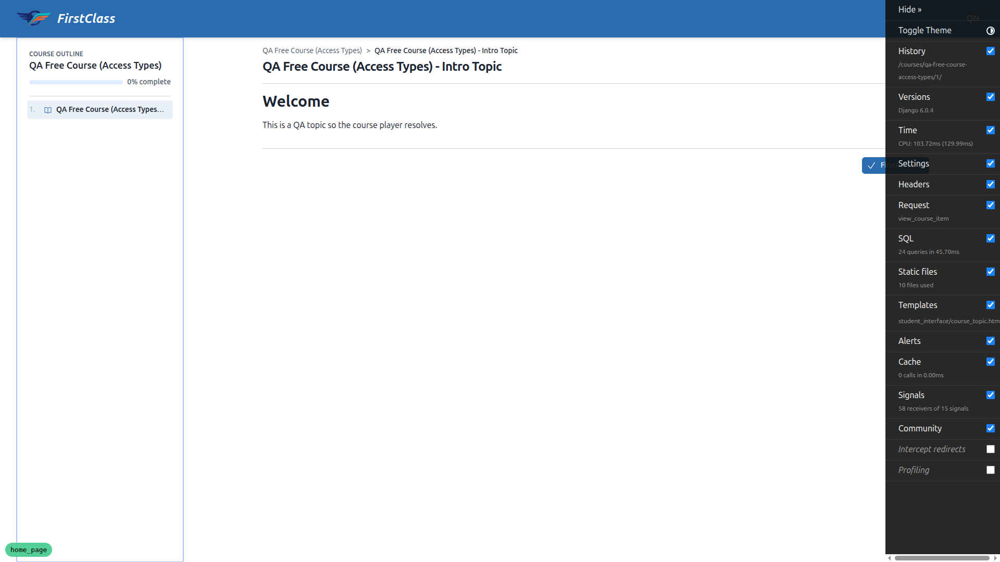
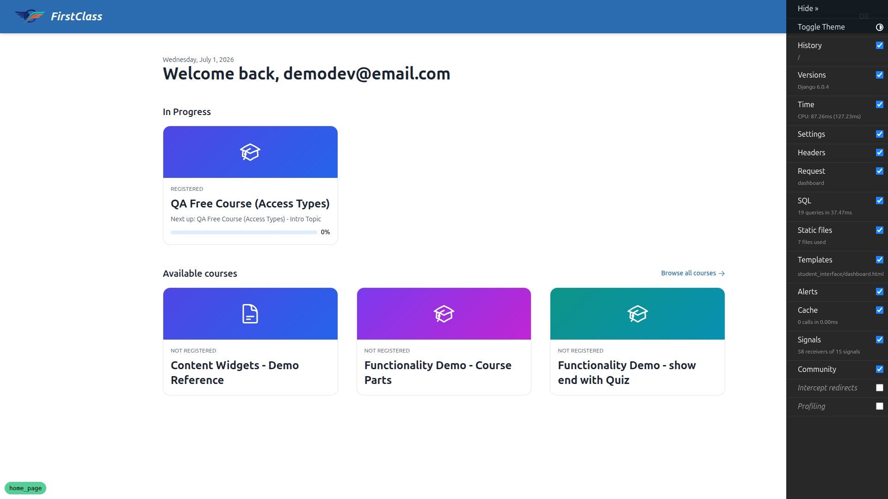
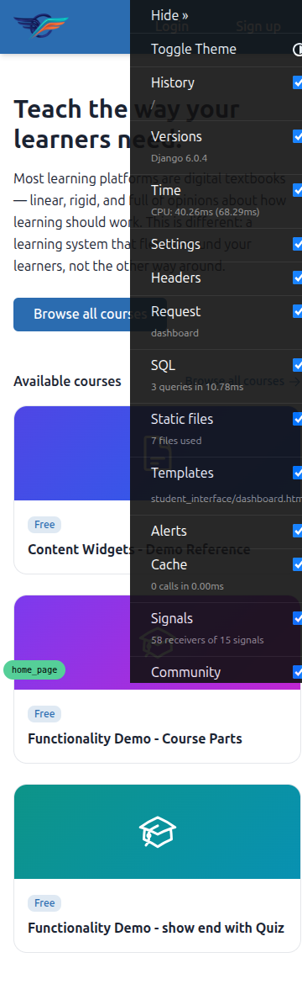
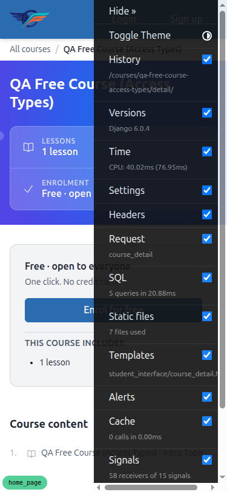
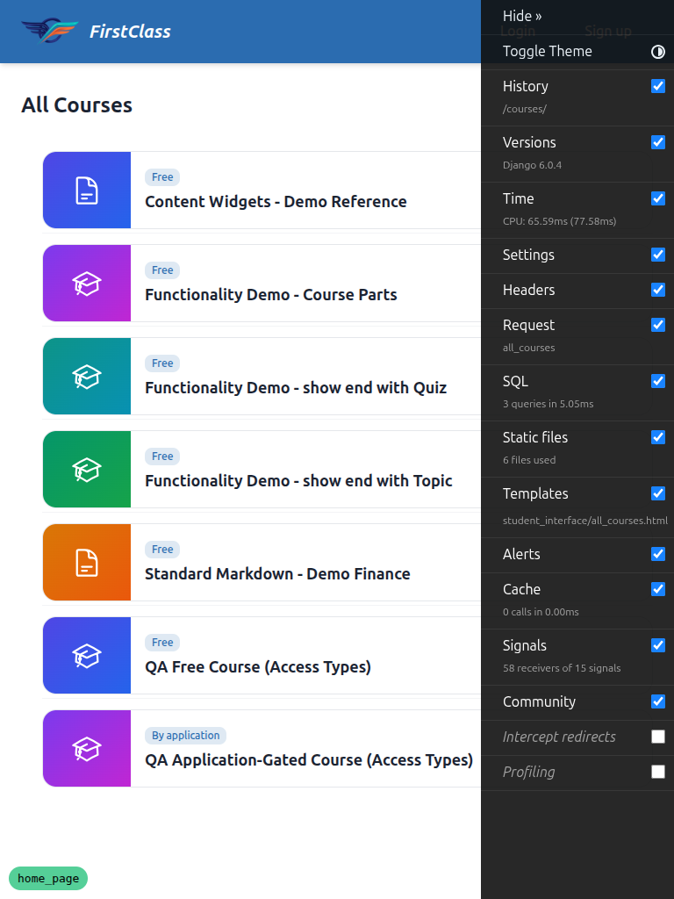
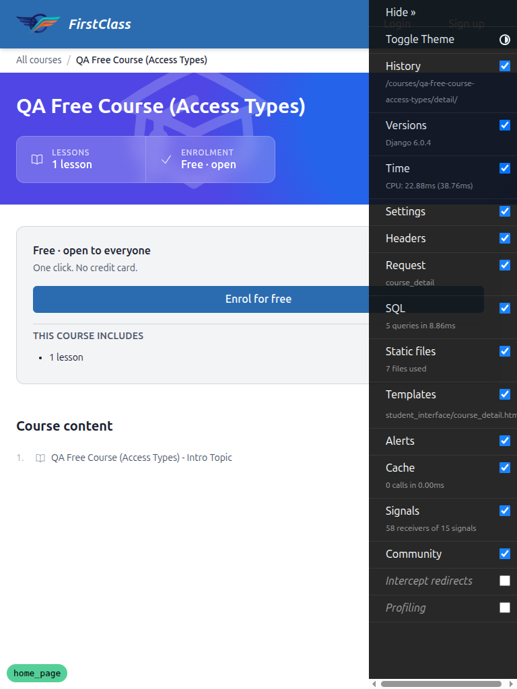

# QA Report — Public browsing for unauthenticated users (`home_page`)

**Date:** 2026-07-01
**Branch:** `home_page`
**Site under test:** DemoDev (`FORCE_SITE_NAME`), served on `http://127.0.0.1:8222`
**Tooling:** Playwright MCP (desktop 1920×1080, mobile 375×812, tablet 768×1024)
**Test plan:** `3. frontend_qa.md`

Test data was provisioned by the `fls:qa-data-helper` agent: the `qa-free-course-access-types`
and `qa-application-gated-course-access-types` courses, the verified `demodev@email.com`
account, and a DemoDev `SiteSignupPolicy` requiring one additional registration form
(`phone_number`).

## Summary

All 10 workflows were executed. The core feature — anonymous browsing, access badges,
deferred-login intent survival (including the full new-user signup → email verification →
complete-registration → land-in-course chain), and open-redirect rejection — **works
correctly**. Two defects were found, both in **Workflow 9 (SEO / discoverability)**:

| # | Severity | Title |
|---|----------|-------|
| 1 | High | JSON-LD blocks use `type="application/json"` instead of `application/ld+json` |
| 2 | Medium | `sitemap.xml` URLs drop the port / don't use the current host |

Everything else passed. Details below.

---

## Bug 1 (High) — JSON-LD emitted as `application/json`, not `application/ld+json`

**Test:** Workflow 9, items 3 (Course JSON-LD) and 4 (Catalogue JSON-LD).

**Expected:** A JSON-LD structured-data block, i.e. `<script type="application/ld+json">`,
on both the course detail page (`@type: Course`) and the catalogue (`@type: ItemList`).
Search engines only recognise structured data delivered with the `application/ld+json`
MIME type.

**Actual:** Both blocks are emitted with `type="application/json"`. There is **zero**
`application/ld+json` on either page:

```
id="catalogue-jsonld" type="application/json"
id="course-jsonld"    type="application/json"
application/ld+json present — catalogue: 0, detail: 0
```

The JSON *content* is otherwise correct and complete:
- Detail (`course-jsonld`): `@context` schema.org, `@type: Course`, `name`, `description`,
  absolute `url`, `isAccessibleForFree: true` (free) / `false` (gated), and
  `provider`/`image`/`author` correctly absent.
- Catalogue (`catalogue-jsonld`): `@type: ItemList` with each course's absolute detail URL.

Because the type attribute is `application/json`, crawlers will not parse these as
structured data, which defeats the SEO goal of the block. This is a one-line fix in the
templates that render `#course-jsonld` and `#catalogue-jsonld`.



---

## Bug 2 (Medium) — `sitemap.xml` `<loc>` URLs omit the port (don't use the current host)

**Test:** Workflow 9, item 5 — "containing the catalogue URL and a `<loc>` per course —
all using the current host."

**Expected:** Sitemap `<loc>` values use the current host, i.e. `http://127.0.0.1:8222/…`
(consistent with the JSON-LD URLs and the robots.txt sitemap reference).

**Actual:** The sitemap uses the Django Sites-framework domain (no port), so its URLs are
inconsistent with the rest of the feature:

```
sitemap first loc : <loc>http://127.0.0.1/courses/</loc>      ← no :8222
robots sitemap ref: Sitemap: http://127.0.0.1:8222/sitemap.xml ← has :8222
detail JSON-LD url: "url": "http://127.0.0.1:8222/courses/…"   ← has :8222
```

The catalogue detail URLs are correct, only the host/port differs. In this dev setup the
sitemap URLs resolve to port 80 (nothing listening), so they are effectively broken; more
generally the feature builds canonical URLs two different ways (JSON-LD via the request
host, sitemap via `Site.domain`), which will drift wherever `Site.domain` isn't kept exactly
in sync with the served host. Content of the sitemap is otherwise correct: HTTP 200, valid
`application/xml`, the catalogue URL plus one `<loc>` per DemoDev course, and **only**
DemoDev courses (supports Workflow 10).

---

## Passing workflows

### Workflow 1 — Anonymous home page ✅
`/` loads 200 (no login redirect). Shows the anonymous hero ("Teach the way your learners
need." + subtext) with a single "Browse all courses" CTA, and an "Available courses"
section. No "Welcome back", In Progress, Learning History, Recommended, or placeholder
sections. Header **Login** (`/accounts/login/?next=/`) and **Sign up**
(`/accounts/signup/?next=/`) both carry `?next=/`. "Browse all courses" → `/courses/`.


### Workflow 2 — Authenticated dashboard unchanged ✅
Logged in as `demodev@email.com`, `/` shows the normal dashboard: "Welcome back,
demodev@email.com", In Progress, and Available panels. No anonymous hero. (Learning History
is conditionally absent — this account has no completed courses.)


### Workflow 3 — Anonymous catalogue + access badges ✅
`/courses/` loads 200 and lists all 7 DemoDev courses. The free course shows a **"Free"**
badge; the gated course shows a **"By application"** badge. No "Not registered" eyebrow
anywhere for the anonymous viewer. Course titles link to their detail pages.


### Workflow 4 — Anonymous course detail, free + gated ✅
- **Free** (`qa-free-course-access-types`): loads 200; title, breadcrumb, stats strip
  (Lessons / Enrolment "Free · open"), and table of contents render. CTA reads
  **"Enrol for free"** and points at `/courses/qa-free-course-access-types/access/`
  (not a login link). ToC item is **Locked** (no clickable item link).
- **Gated** (`qa-application-gated-course-access-types`): loads cleanly **200 — no 500**
  (the §3 regression holds). CTA reads **"Apply now"** →
  `/applications/apply/qa-application-gated-course-access-types/`; enrolment signal reads
  **"By application"**.


### Workflow 5 — Deferred login: free enrol completes intent ✅
Anonymous "Enrol for free" → login with `?next=…/access/`. After logging in as
`demodev@email.com`, landed **inside the course** (`/courses/qa-free-course-access-types/1/`,
"Intro Topic"), enrolled, with no intermediate "you need to enrol" page. The signup link on
the login page preserved the `next`. The via-signup path is validated by Workflow 7.


### Workflow 6 — Deferred login: apply lands on the application form ✅
Anonymous "Apply now" → login with `?next=…/apply/…`. After authenticating, landed on the
**apply confirmation form** ("Apply to QA Application-Gated Course…", "Submit application"
button). The application was **not** auto-submitted.


### Workflow 7 — New-user signup that must complete registration forms ✅ (critical)
Full chain walked with a brand-new email (`qa-newuser-wf7-1@email.com`):
"Enrol for free" → login → **Sign up** (next preserved) → submit signup → email verification
(confirmation link captured via Mailpit, correct `127.0.0.1:8222` host) → **Complete your
registration** page (URL still carried `next=…/qa-free-course-access-types/access/`) → filled
the required `phone_number` → **landed inside the free course**, enrolled. The original intent
survived the entire signup → verify → complete-registration → destination chain; the user was
**not** dumped on the generic dashboard.



### Workflow 8 — Open-redirect rejection ✅
Visited `/accounts/login/?next=https://evil.example/` and logged in as `demodev@email.com`.
Landed on `/` (default post-login destination); the off-host `next` was ignored.


### Workflow 9 — SEO / discoverability ⚠️ (2 bugs above; rest pass)
Passing parts:
- Catalogue `<title>` "All Courses — DemoDev" and a descriptive, non-generic
  `<meta name="description">`.
- Detail `<title>` is the course title; `<meta name="description">` reflects the course
  description.
- JSON-LD **content** correct on both pages (see Bug 1 for the type-attribute defect).
- `robots.txt`: 200, `text/plain`, does **not** `Disallow: /courses/` (it `Allow`s it), and
  references this host's `sitemap.xml` (with port).
- `sitemap.xml`: 200, valid XML, catalogue + one `<loc>` per course (see Bug 2 for the
  host/port defect).

### Workflow 10 — Tenant isolation for anonymous visitors ✅ (spot check)
The catalogue, `sitemap.xml`, and JSON-LD URLs list **only** the 7 DemoDev courses (the
5 demo courses + the 2 QA access-type courses). No courses from any other site appeared.

---

## Responsive checks (mobile 375×812, tablet 768×1024)

No horizontal overflow on the anonymous home, catalogue, or course detail at either size.
The header Login/Sign up remain visible (no hamburger needed for the two-button anonymous
nav). Cards stack to a single column on mobile; the detail CTA is full-width (~293×40px, a
usable touch target). Tablet renders the wider multi-column catalogue grid and the detail
two-column layout without crowding.





> Note: the dark panel on the right of the mobile/tablet screenshots is the expanded Django
> Debug Toolbar (a dev-only overlay), not part of the page under test.

---

## Non-blocking observations (not feature bugs)

- **Anonymous home `<title>` is "Dashboard".** The home view renders
  `student_interface/dashboard.html` for both anonymous and authenticated visitors, so the
  logged-out landing page is titled "Dashboard", which reads oddly for a public value-prop
  page. Not covered by an explicit test step; flagged as a minor polish item.
- **"What you'll learn" section and the Level/Duration stats never appeared** on any DemoDev
  course (only "About this course", Lessons, and Enrolment render). This is because no
  DemoDev course carries learning-outcome / level / duration data — the sections are
  conditionally rendered, not broken. Worth knowing that Workflow 4's "all render" wording
  assumes a course populated with that metadata.

---

## Notes / difficulties

- Test data did not exist at the start of the run; it was created via the `fls:qa-data-helper`
  agent (per the QA process), then all data-dependent workflows were re-attempted successfully.
- `demodev@email.com` is a **superuser** and is therefore exempt from the registration-completion
  gate, so it was used for the login-based flows (WF5/WF6/WF8) and a fresh non-staff signup was
  used for the gate-exercising WF7.
- Email verification was completed by reading the confirmation link from Mailpit
  (`http://localhost:8025`), which captures dev SMTP.
