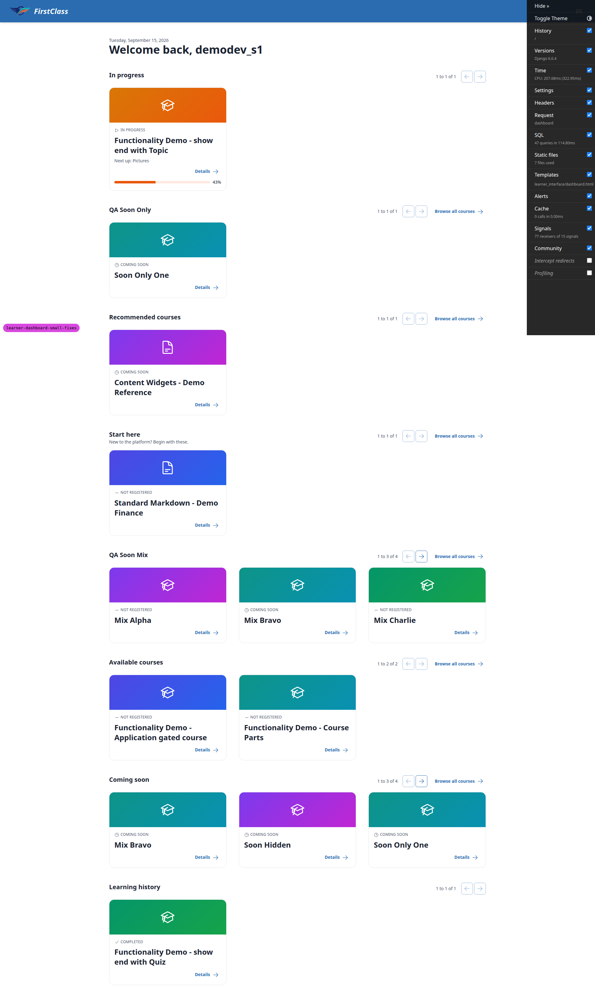
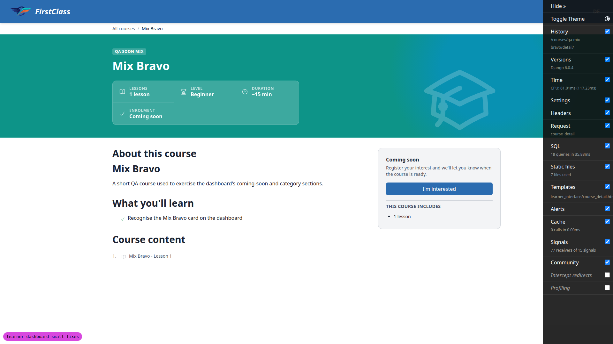
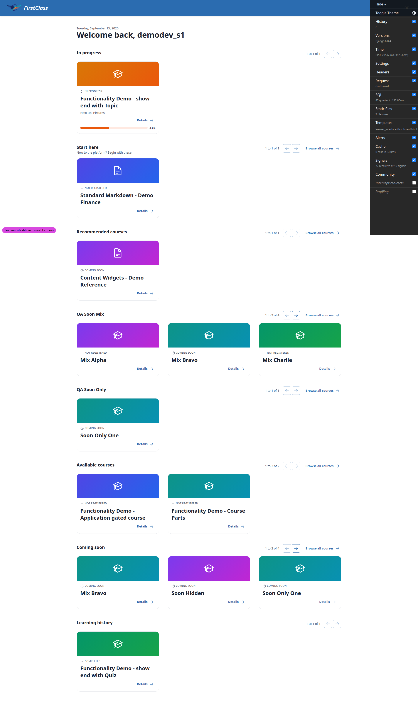
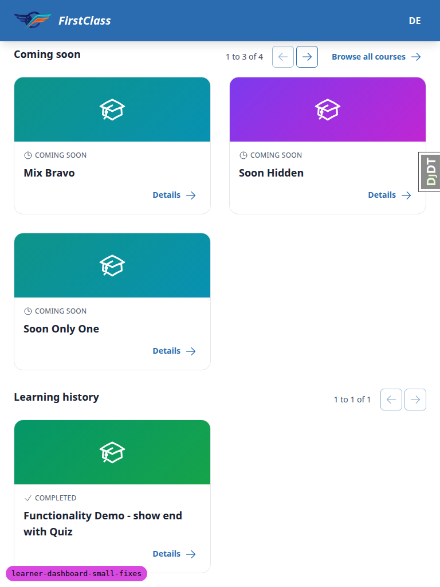
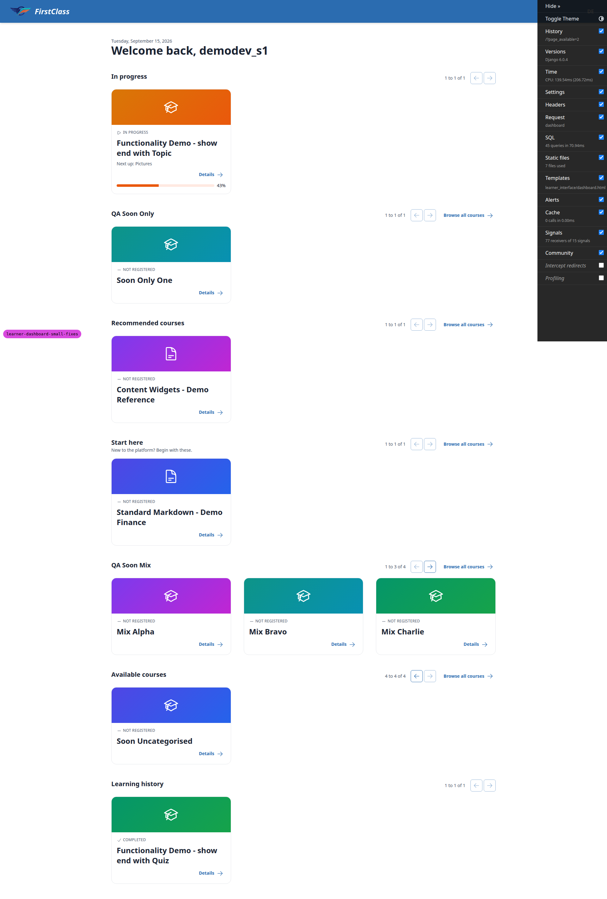
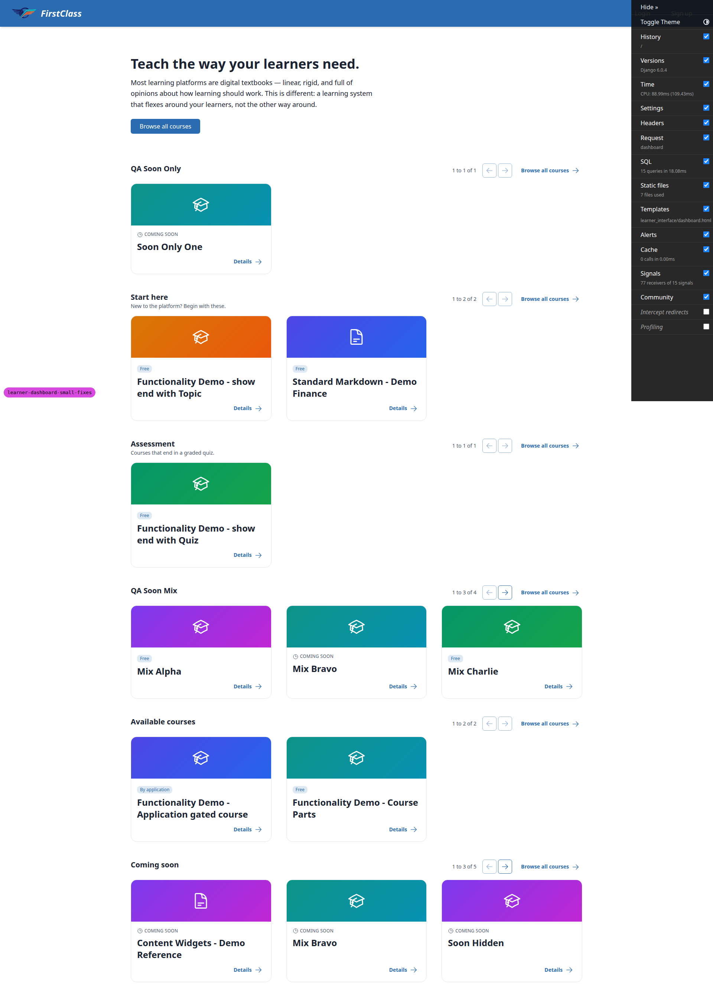
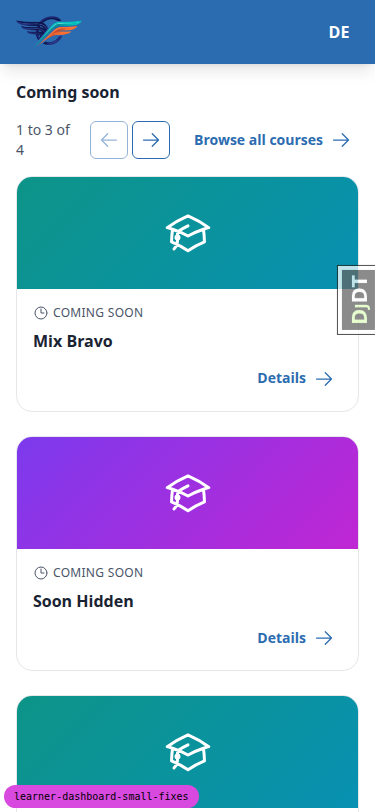

# Frontend QA report: learner dashboard small fixes

## Intro

This run tests two changes to the learner dashboard on branch `learner-dashboard-small-fixes`:

1. A coming-soon course whose dashboard category is itself shown on the dashboard now renders in
   **both** that category's section and in **Coming soon**, interleaved alphabetically with the
   published courses in its category rather than appended to one end.
2. **Recommended courses** and **Coming soon** now carry the **Browse all courses** button that
   every category section and **Available courses** already had.

**Headline verdict:** both changes work as specified across every scenario in the test plan
(interleave order, no triple-rendering, hidden-category isolation, ordering control, the visibility
preview, the anonymous visitor, htmx fragment paths, keyboard/focus, and mobile/tablet layout). One
bug was found, but it is pre-existing, out of this branch's diff, and unrelated to either change: the
dashboard's per-section pagination never pushes its page parameter into the browser URL, so paging a
second section can silently reset a first section's page if a stale link from it is later followed.
See bug B1.

## Methodology

Testing was driven manually through the Playwright MCP tools against a dev server on port 8776, on
branch `learner-dashboard-small-fixes`. Two personas were used: the seeded learner
`demodev_s1@email.com` (signed in, for most of the run) and a signed-out anonymous visitor (§8).
Screenshots were collected into `screenshots/` beside this report; every screenshot referenced below
exists at that path.

The dev database was empty at the start of the run — the first page load returned an HTTP 500
(`FORCE_SITE_NAME='DemoDev' does not match any Site`) because migrations were applied but no data
existed. The database was seeded during the run (demo content, superuser, and the QA fixtures
required by the test plan's §0.2) before §1 testing began.

## Diff scoping

Scoping class: **FULL**. Changed files that triggered it:

- `freedom_ls/learner_interface/views.py`
- `freedom_ls/learner_interface/tests/test_dashboard_grouping.py`
- `freedom_ls/learner_interface/tests/test_dashboard_pagination.py`
- `freedom_ls/learner_interface/tests/test_dashboard_view.py`
- `spec_dd/2. in progress/learner-dashboard-small-fixes/*.md`

Nothing was skipped. The scoping record's `skipped` field is explicitly `"nothing"` — every section
of the test plan (§1 through §9, all three viewports where the plan calls for them) was run in full.

## Smoke gate

Outcome: **pass**. Pages loaded before the detailed run began:

- `http://127.0.0.1:8776/` — dashboard, logged in as `demodev_s1@email.com`
- `http://127.0.0.1:8776/courses/` — all-courses catalogue

## Results by test-plan section

| Section | Verdict | Summary |
|---|---|---|
| §1 Coming-soon course in category + Coming soon | PASS | Correct alphabetical interleave, exactly two renders |
| §2 The repeated card explains itself | PASS | Identical card content in both sections; express-interest lives only on detail page |
| §3 No course renders three times | PASS | Available courses never picks up a coming-soon course |
| §4 Category of only coming-soon courses | PASS | New section renders and its `order` genuinely controls page position |
| §5 Two sections paging independently | FAIL (bug B1) | Visual isolation correct; URL push missing, filed as B1 |
| §6 Browse all courses button | PASS | Present where expected, absent where not, identical styling everywhere |
| §7 Visibility preview | PASS | No duplication with the preview on or off |
| §8 Anonymous visitor | PASS | Same behaviour signed out, badge/label slot correct |
| §9 Adversarial / failure branches | PASS | 404 isolation, fragment path, keyboard/focus, narrow viewport, repeat-render stability all correct |

### §1 — A coming-soon course renders in its category and in Coming soon

QA Soon Mix's page one renders **Mix Alpha, Mix Bravo, Mix Charlie** left to right, position text
"1 to 3 of 4" (1.1). Mix Bravo — the coming-soon course — sits **second**, in its correct alphabetical
place between two published cards, confirming the pool is a merged, ordered queryset rather than a
Python concatenation that would have bunched it at either end. Coming soon's page one holds **Mix
Bravo, Soon Hidden, Soon Only One** (1.2). Mix Bravo renders exactly twice across the whole page —
once per section, not three times and not once (1.3). No other course duplicates: Mix Alpha and Mix
Charlie render once each, Mix Delta sits on page 2 of QA Soon Mix, and Soon Only One's two renders are
§4.3's expected behaviour rather than a defect (1.4). At mobile width (375px) the same three-card
order held in QA Soon Mix and Coming soon still held Mix Bravo, Soon Hidden, Soon Only One, stacked to
a single column (1.1, mobile).

### §2 — The repeated card explains itself

Mix Bravo's card inside QA Soon Mix reads exactly "COMING SOON" (eyebrow, with clock icon), "Mix
Bravo", "Details" — zero enrol/apply/register/interest buttons, no Free or By-application badge
(2.1). The same card in Coming soon is content-identical: same eyebrow text, same title href
(`/courses/qa-mix-bravo/detail/`), same Details href, no buttons in either (2.2) — confirming
`course_card.html` branches only on `course.listing_status`, not on which section it is rendered in.
Clicking the title from either section lands on the same detail URL (2.3). That detail page carries
the coming-soon acquisition copy ("Coming soon — Register your interest and we'll let you know when
the course is ready."), an ENROLMENT field reading "Coming soon", and the only call to action is
"I'm interested" — the express-interest affordance lives here, not on either card (2.4). Mix Alpha,
sitting next to Mix Bravo in the same section, is an ordinary published card ("NOT REGISTERED"
eyebrow, title, Details) with no coming-soon styling leaking onto it (2.5). One wording note: the
plan expected Mix Alpha to show its access badge while signed in; `course_card.html` in fact only
shows the access badge to anonymous visitors and shows the status eyebrow to signed-in learners —
documented pre-existing card behaviour, unaffected by this change, and the badge itself is confirmed
signed-out in §8.4.

### §3 — No course renders three times

Available courses holds only "Functionality Demo - Application gated course" and "Functionality Demo
- Course Parts" ("1 to 2 of 2") — Soon Uncategorised and Soon Hidden are both absent (3.1). Both are
present in Coming soon instead: Soon Hidden on page 1, Soon Uncategorised on page 2 (3.2). No section
headed "Reference" appears anywhere; the full heading list on the page is In progress, QA Soon Only,
Recommended courses, Start here, QA Soon Mix, Available courses, Coming soon, Learning history (3.3).
Both courses render exactly once each, not on Available courses as well as Coming soon (3.4).

### §4 — A category of only coming-soon courses now renders, and can lead the page

QA Soon Only renders with the single card Soon Only One ("1 to 1 of 1") — before this change the
category rendered no section at all (4.1). With `order=0` it sits above Recommended courses, directly
under In progress, leading the discovery part of the page — an accepted, site-controllable consequence
(4.2). Soon Only One also appears in Coming soon, for two renders total (4.3). Raising the category's
`order` to 60 moved it below Recommended courses (new heading order: In progress, Start here,
Recommended courses, QA Soon Mix, QA Soon Only, Available courses, Coming soon, Learning history), with
Start here taking the lead slot (4.4). Setting `order` back to 0 restored QA Soon Only to the lead
position; the seed command's idempotent reset printed `reset qa-soon-only.order: 60 -> 0` and the
setting was left at 0 as the plan requires (4.5).

### §5 — Two sections holding the same course, paging independently

Mix Bravo starts on page 1 of both QA Soon Mix and Coming soon (5.1). Clicking next on QA Soon Mix
correctly swaps only that section, with no full page reload, to "4 to 4 of 4" (Mix Delta), while
Coming soon stays on "1 to 3 of 4" — section isolation is correct — **but** the browser URL never
gains `page_qa-soon-mix`; it stays at `/` (5.2, **FAIL**). Paging Coming soon as well leaves both
sections holding their own correct positions visually, but the URL still carries neither parameter,
and the freshly swapped Coming-soon fragment's own Previous link is rebuilt to `/` instead of
`/?page_qa-soon-mix=2` — following it would silently reset QA Soon Mix (5.3, **FAIL**). Navigating
directly to `/?page_qa-soon-mix=2&page_coming-soon=2` brings both sections back on the named pages
with correct cross-referencing hrefs, confirming the server-side `section_page_href` logic is correct
and only the URL push is missing (5.4). Hand-editing to
`/?page_qa-soon-mix=99&page_coming-soon=0` renders a normal page with no error: 99 clamps to the last
page, 0 clamps to page one (5.5). Both mobile and tablet reruns of the pagination swap (5.2) behaved
the same — correct visual isolation, same missing URL push — confirming this is viewport-independent.
These two failures are the sole manifestations of bug **B1**, detailed below.

### §6 — Browse all courses on Recommended courses and Coming soon

Recommended courses now carries a Browse all courses button in its header row beside the pagination —
new (6.1). Coming soon carries it too — also new (6.2). QA Soon Mix, QA Soon Only, Start here, and
Available courses still carry it, unchanged (6.3). In progress has no button, correctly, since it
holds the learner's own courses (6.4), and neither does Learning history (6.5). Clicking it under
Coming soon lands on `/courses/`, the full unfiltered 13-course catalogue — not pre-filtered to
coming-soon — with the five coming-soon courses appearing badged "Coming soon" as plain detail links
(6.6). Clicking it under Recommended courses lands on the same unfiltered catalogue (6.7). All six
buttons across the page are pixel-identical: same text, same href, same classes
(`btn btn-link btn-sm whitespace-nowrap`), same trailing arrow icon, same position in the header row —
the two new instances are indistinguishable from the four pre-existing ones (6.8). At tablet width
(768px) the Coming soon header stays a single row (heading, position text, arrows, button, ending at
x=744 inside 768px), with Learning history visible directly below carrying no button — the two
behaviours side by side in one screenshot.

### §7 — The visibility preview still shows each course exactly once

With `OVERRIDE_COURSE_VISIBILITY_TO_VISIBLE = True` set and the dev server auto-reloaded (one
`ERR_CONNECTION_REFUSED` during the restart, recovered on retry) (7.1), every expectation held: no
Coming soon section at all; Mix Bravo present exactly once in QA Soon Mix, still second between Mix
Alpha and Mix Charlie; Soon Hidden present exactly once in Available courses (page 1); Soon
Uncategorised present exactly once in Available courses (page 2, "4 to 4 of 4"); Soon Only One present
exactly once in QA Soon Only; zero "COMING SOON" labels anywhere (7.2). A programmatic duplicate scan
across every section's card titles with the preview on returned an empty list — no course rendered
twice, which is the regression this change could most easily have caused (7.3). The setting was
returned to `False` (confirmed by an empty `git diff` on `config/settings_dev.py`), and §1's picture
returned intact: Coming soon held Mix Bravo, Soon Hidden, Soon Only One again; Available courses held
only the two demo courses again (7.4).

### §8 — Anonymous visitor

Signed out, the dashboard renders QA Soon Only, Start here, Assessment, QA Soon Mix, Available
courses and Coming soon; In progress, Learning history and Recommended courses are all correctly
absent (8.1). Mix Bravo appears in both QA Soon Mix (second, between Mix Alpha and Mix Charlie) and
Coming soon — the duplication is not login-gated (8.2). Browse all courses renders under Coming soon,
and under every other discovery section (8.3). Mix Bravo's card reads "COMING SOON / Mix Bravo /
Details" with no Free badge, while Mix Alpha's card in the same section reads "Free / Mix Alpha /
Details" — the anonymous access badge still renders on published cards, and the coming-soon label
correctly takes that slot on the coming-soon card instead (8.4).

### §9 — Adversarial and failure branches

A request naming the hidden category's section (`HX-Target: section-page-reference-demo`) returns 404
with zero occurrences of "Soon Hidden" in the body — a hidden category's section cannot be fetched
directly and its coming-soon course does not leak (9.1). The same request against
`section-page-qa-soon-mix` returns 200 with Mix Bravo present, card order `qa-mix-alpha`,
`qa-mix-bravo`, `qa-mix-charlie` matching the full-page path exactly, and exactly one "Coming soon"
label — the single-section htmx render path got the fix too, not only the full-page path (9.2). A
nonexistent section slug (`section-page-no-such-thing`) returns 404 (9.3). Tabbing through Coming soon
reaches the Next arrow, then the new Browse all courses link, then the card links, each with a visible
focus ring; the disabled Previous arrow is correctly excluded from the tab order by design; pressing
Enter on the Browse all courses link navigates to `/courses/` — adding the control did not strand the
pagination arrows (9.4). Pressing Enter on the focused Next arrow pages the section to "4 to 4 of 4",
disables the arrow, and moves focus to the section heading — the documented last-page behaviour, with
the Browse all courses link not stealing focus (9.5). Three successive same-session reloads, and three
anonymous reloads, all returned identical section ordering — Mix Bravo stays second in QA Soon Mix and
does not shuffle (9.7).

At 375px, the QA Soon Mix and Coming soon headers wrap (h2 on its own row, controls on a second row
below the `sm` breakpoint) rather than overflow; the header row measures x=16, width=343, right=359
inside the 375px viewport, and `document.scrollWidth` equals `window.innerWidth`, so there is no
horizontal scroll; both the 38x38px pagination arrows and the Browse all courses link stay fully
visible and reachable (9.6, mobile). At 768px the same header collapses back to a single row (heading
left, position text, arrows, and the button all on the right, ending at x=744), the card grid becomes
two 344px columns, and there is again no horizontal scroll (9.6, tablet). Paging a section at both
375px and 768px reproduces the same visual isolation (and the same missing URL push — see B1) as at
desktop width.

Two checks outside the numbered test plan were made opportunistically during the mobile and tablet
passes, unaffected by either change: the mobile header collapses to a compact bar (logo + avatar menu,
no hamburger) with a dropdown that fits inside the viewport, and the tablet header keeps the desktop
layout (logo, "FirstClass" wordmark, avatar menu) without crowding.

## B1 — Section paging never pushes its page parameter to the URL, so paging one section silently resets another

**Manifestations:**

- 5.2, desktop
- 5.3, desktop
- 5.2, mobile
- 5.2, tablet

**Expected** (per test plan §5.2/§5.3): clicking next on a section's pagination makes the browser URL
gain that section's page parameter (`page_qa-soon-mix`), and after paging a second section the URL
carries both parameters, so the page's paging state is shareable, reloadable and self-consistent.

**Actual:** `c-course-section-pagination` carries `hx-get`/`hx-target` but no `hx-push-url`, so the
browser URL stays at `/` no matter how many sections are paged. Because `section_page_href` rebuilds
each swapped fragment's links from the request's query string, and that request only ever carries the
one section's own parameter, the freshly swapped section's links omit every other section's page.
Reproduced: page QA Soon Mix to page 2, then page Coming soon to page 2; both sections display
correctly, but Coming soon's Previous link is now `/` instead of `/?page_qa-soon-mix=2`, so following
it would silently reset QA Soon Mix to page 1. Navigating directly to
`/?page_qa-soon-mix=2&page_coming-soon=2` works perfectly, and each section's links then carry the
other's parameter correctly — confirming the server side is correct and only the URL push is missing.

**Framing:** pre-existing and out of this diff's scope. This branch changed only
`freedom_ls/learner_interface/views.py` (`_discovery_pools` and `_browse_all_url`); it touched no
pagination code or template. The behaviour is unchanged from `main`. It surfaced in this run only
because this is the first test plan to page two overlapping sections in sequence.

## Bug status

**UNRESOLVED** — Section paging never pushes its page parameter to the URL, so paging one section silently resets another (reason: triaged to the red lane — pre-existing behaviour unchanged by this branch, so it is not a regression in the feature under test, and adding `hx-push-url` to the shared `c-course-section-pagination` component is a product decision about whether dashboard paging belongs in browser history. No fix was attempted and nothing was reverted.)

## General notes

- **The test plan's `/dashboard/` URL is wrong.** §0, §1 and §8 all instruct opening
  `http://127.0.0.1:<PORT>/dashboard/`. That path 404s. The learner dashboard is served at `/`
  (`freedom_ls/learner_interface/urls.py:8`, `name="dashboard"`). Every dashboard check in this run
  was driven against `/` instead. This is a defect in the test plan document, not in the application
  — a future run of this plan should fix the plan rather than trip over the 404 again.
- The per-branch dev database had migrations applied but no data at all when this run started; `/`
  returned an HTTP 500 (`FORCE_SITE_NAME='DemoDev' does not match any Site`). This was fixed during
  the run by running `create_demo_data --yes`, `content_save demo_content DemoDev`, and
  `qa_create_rich_dashboard_learner` before §1 testing began.
- Cosmetic, not filed as a bug: at 375px the section position text ("1 to 3 of 4") wraps onto two
  lines in every section that now carries a Browse all courses button (Coming soon, QA Soon Mix),
  and stays on one line in sections that do not (In progress, Learning history). Measured: the
  wrapped spans are 58px wide by 40px tall (2 lines); the unwrapped ones are 65px wide by 20px tall
  (1 line). Nothing overflows, nothing becomes unreachable, there is no horizontal scroll, and the
  result matches the category sections that have always had the button — which is the same
  consistency §6.8 checks for. Recorded as an observation only.
- Nothing in the test plan was skipped: all of §1 through §9, across every viewport the plan calls
  for (desktop, mobile at ~375px, tablet at ~768px), was executed in this run.

status: ok
reason: 1 bug — 0 fixed, 1 unresolved (red lane, pre-existing and outside this branch's diff); 55 tests recorded across desktop/mobile/tablet, report rendered, screenshots verified
