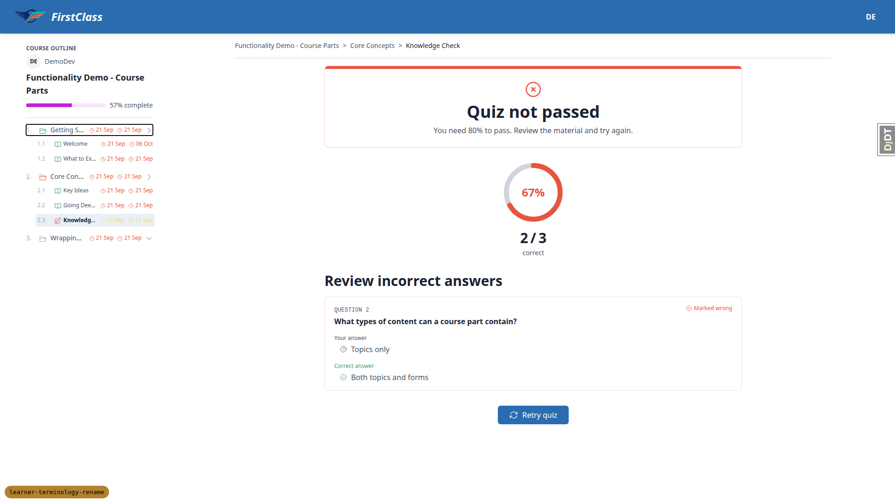

# QA Report — `learner-terminology-rename`

## Verdict

**No bugs were found.** This branch performs a pure `student` → `learner` terminology rename — app labels, Python package names, template/static directory names, URL namespaces, model names, admin lookup strings — across 336 changed files, with no intended behaviour change. Every one of the 71 recorded test executions is therefore a regression test, and every one that ran to completion (69) came back `pass`. The remaining 2 are recorded `skip`, not `fail` — both are blocked by pre-existing dev-only settings that are byte-identical to `main` and outside this branch's diff, and in both cases the underlying renamed code path was verified directly instead (see §6). The rename appears complete and behaviour-preserving: the old `student_*` names are gone (404/absent everywhere probed) and the new `learner_*` names resolve correctly, render populated data, and preserve layout, permissions and data isolation.

There is one item that needs a **user decision**, not a bug fix — see "Working tree changes" in §7.

## 1. Methodology

- Screenshots were collected into `spec_dd/2. in progress/learner-terminology-rename/screenshots/` (31 PNG files). Every `screenshot_path` referenced by a test record in this report is a bare basename that exists in that directory, verified before this report was written; they are linked here as `screenshots/<basename>.png`, i.e. relative to this report file. 28 of the 71 test records carry a screenshot.
- An image-size compression pass ran over the screenshot set and found nothing over the 1MB threshold — the largest file was 308K, so no screenshot needed downsizing or was excluded.
- Test data was created exclusively via the `fls-dev:qa-data-helper` agent (two rounds), never by hand.
- Every assertion about whether something is a regression (as opposed to pre-existing behaviour) was checked against `main` using `git show`, rather than judged from the rendered page alone.
- The literal string `student` was searched for with a case-insensitive regex over the **full rendered HTML** (not just visible text) on every page visited — covering `data-testid` attributes, CSS class names, HTMX URLs and inline JS, not only prose.
- The smoke gate (§3) passed, so the **full test matrix ran** — no workflow, viewport pass, or step was skipped on account of a failed smoke check.
- **Coverage is complete:** all 59 test IDs in the plan (1.1–1.12, 2.1–2.12, 3.1–3.10, 4.1–4.3, 5.1–5.6, 6.1–6.12, 7.1–7.4) have a desktop record — none missing. The record count of 71 exceeds 59 because of the mobile/tablet viewport repeats (1.2, 1.7, 1.10, 2.2, 2.3, 2.5) plus one `MOBILE-org-switcher` record, filed under Workflow 2. By viewport: 60 desktop, 6 mobile, 5 tablet. Test `1.8` legitimately appears twice on desktop — once auditing the dashboard's assets, once re-verified on the course player — this is a deliberate double-check, not a duplicate or a discrepancy.

## 2. Diff scoping

**Class: `FULL`.**

336 files changed vs `main`. `FULL` was triggered by changes touching templates/static/`.html`/`.css`/`.js` paths, for example:
- `freedom_ls/learner_interface/templates/learner_interface/dashboard.html`
- `freedom_ls/learner_interface/static/learner_interface/js/alpine-components.js`
- `freedom_ls/base/templates/cotton/data-table.html`
- `freedom_ls/educator_interface/templates/educator_interface/partials/course_progress_panel.html`
- `freedom_ls/reports/static/reports/print.css`
- `freedom_ls/course_applications/templates/course_applications/apply.html`
- plus ~180 `.py` files across `learner_interface` / `learner_management` / `learner_progress` / `qa_helpers` / `reports`

**Nothing was skipped for scoping reasons.** Desktop, mobile and tablet passes all ran in full.

## 3. Smoke gate

**Outcome: pass.** Two pages were loaded before committing to the full matrix:
- `http://127.0.0.1:8940/` — learner dashboard, logged in as `demodev_s1`
- `http://127.0.0.1:8940/courses/functionality-demo-course-parts/detail/` — the primary changed surface, `learner_interface` course detail

Both loaded correctly, so the full 7-workflow matrix proceeded without any steps being skipped for smoke-gate reasons.

## 4. Results by workflow

71 test executions total across the 7 workflows: **69 pass, 2 skip, 0 fail** (60 desktop, 6 mobile, 5 tablet). (Some test IDs — 1.2, 1.7, 1.10, 2.2, 2.3, 2.5 — were run at more than one viewport, and 1.8 was deliberately checked twice on desktop, which is why the record count exceeds the 59 distinct test-plan items.)

### Workflow 1 — Learner interface (18 records: 18 pass, 0 skip)

| Test | Viewport | Status | Notes |
|---|---|---|---|
| 1.1 | desktop | pass | Anonymous hero renders fully styled (Login/Sign up, course listing). Zero `student` matches. [screenshot](screenshots/page-2026-08-22T12-01-22-604Z.png) |
| 1.2 | desktop | pass | Dashboard renders all 4 sections (In Progress, Recommended, Available, Learning History) with working progress bars. [screenshot](screenshots/page-2026-08-22T12-18-56-708Z.png) |
| 1.2 | mobile | pass | 375×812 stacks to one column, no horizontal overflow, zero `student` matches. [screenshot](screenshots/page-2026-08-22T12-33-35-394Z.png) |
| 1.2 | tablet | pass | 768×1024, card grid adapts to two columns, fully styled, no overflow. [screenshot](screenshots/page-2026-08-22T12-35-55-629Z.png) |
| 1.3 | desktop | pass | `/courses/` lists 5 courses, fully styled, zero `student` matches. [screenshot](screenshots/page-2026-08-22T12-04-41-719Z.png) |
| 1.4 | desktop | pass | Course detail renders title/description/meta/CTA/content list. Zero `student` matches. |
| 1.5 | desktop | pass | Course player TOC, progress bar, breadcrumbs, Next action all render as pre-rename. [screenshot](screenshots/page-2026-08-22T12-05-15-523Z.png) |
| 1.6 | desktop | pass | Topic completion works (43%→57%, next item unlocks). **Plan-wording caveat:** this is a plain `POST` form, not HTMX — verified byte-identical to `main`, so this is a plan inaccuracy, not a regression (see §7). |
| 1.7 | desktop | pass | Persistent sidebar at 1920×1080, drawer toggle correctly hidden (`lg:hidden`). Alpine liveness confirmed via collapse-toggle interaction; all expected Alpine roots register, confirming the moved `learner_interface` JS loads. |
| 1.7 | mobile | pass | Drawer toggle visible and 44×48px (meets touch-target min); opens as bottom-sheet dialog, Escape closes it. [screenshot](screenshots/page-2026-08-22T12-34-02-786Z.png) |
| 1.7 | tablet | pass | 768×1024 correctly takes the drawer pattern (below the `lg:` 1024px breakpoint); full outline with untruncated titles. [screenshot](screenshots/page-2026-08-22T12-35-38-988Z.png) |
| 1.8 | desktop | pass | Dashboard asset audit: `/static/learner_interface/js/alpine-components.js` → 200; `/static/student_interface/...` → 404 (correctly gone). All 13 page assets 200. **Re-checked again on the course player** (second desktop record, deliberate double-check, not a duplicate): served from cache (304), zero requests to any `student_interface` path, console fully clean. |
| 1.9 | desktop | pass | Full quiz flow (start → fill with live answered-counter → confirm dialog → submit → complete) works end to end. |
| 1.10 | desktop | pass | **`learner_selected` key check — passed.** "Your answer: Topics only" rendered populated (not blank) next to "Correct answer". [screenshot](screenshots/page-2026-08-22T12-22-23-047Z.png) |
| 1.10 | mobile | pass | Form-complete page fits at 375×812, no horizontal overflow, score ring and Continue button intact. [screenshot](screenshots/page-2026-08-22T12-34-48-339Z.png) |
| 1.11 | desktop | pass | Course completed to 100%; finish page renders trophy, congratulations copy, Course Summary panel, dates. [screenshot](screenshots/page-2026-08-22T12-24-24-159Z.png) |
| 1.12 | desktop | pass | Completed course correctly moves from In Progress to Learning History on the dashboard. |

### Workflow 2 — Educator interface (18 records: 18 pass, 0 skip)

| Test | Viewport | Status | Notes |
|---|---|---|---|
| 2.1 | desktop | pass | `/educator/` redirects into the default org cohorts list. Zero `student` matches. |
| 2.2 | desktop | pass | Cohorts list header reads "Active Learners" (not "Active Students"); counts populated per row. [screenshot](screenshots/page-2026-08-22T12-09-28-578Z.png) |
| 2.2 | mobile | pass | Header collapses to logo+avatar; "Active Learners" wraps across two lines and stays legible. [screenshot](screenshots/page-2026-08-22T12-32-19-346Z.png) |
| 2.2 | tablet | pass | Drawer nav (hamburger) per the `lg:` breakpoint; all 3 columns fit, no overflow. [screenshot](screenshots/page-2026-08-22T12-36-26-174Z.png) |
| 2.3 | desktop | pass | Cohort Details tab: Details/Course Registrations/Learners panels all populated over HTMX with a working paginator. [screenshot](screenshots/page-2026-08-22T12-09-58-958Z.png) |
| 2.3 | tablet | pass | 768×1024: panels stack and remain usable; Learners panel's rightmost column clips but the panel has its own horizontal scroller (data-density artefact, not a rename regression). [screenshot](screenshots/page-2026-08-22T12-36-46-544Z.png) |
| 2.4 | desktop | pass | Details tab issues `hx-get` to `.../__panels/learners` (200, 6 rows); no request anywhere to `.../__panels/students`. Sort/page links also target `learners`. |
| 2.5 | desktop | pass | Course Progress matrix: learners as rows, row-header column reads exactly "Learner", part-grouped columns, completion dates and quiz scores render. |
| 2.5 | mobile | pass | Widest table in the app does not break the page (`scrollWidth` exactly 375); scrolls inside its own container. Row-header still "Learner". [screenshot](screenshots/page-2026-08-22T12-33-16-613Z.png) |
| 2.5 | tablet | pass | Same containment behaviour at 768×1024 (`scrollWidth` exactly 768). [screenshot](screenshots/page-2026-08-22T12-37-08-501Z.png) |
| 2.6 | desktop | pass | Pagination line reads exactly "Learners 1-20 of 25" (not "Students"); row-header "Learner". [screenshot](screenshots/page-2026-08-22T12-11-31-591Z.png) |
| 2.7 | desktop | pass | HTMX page-2 swap moves to "Learners 21-25 of 25"; column selection (registration, item count) preserved across the swap. |
| 2.8 | desktop | pass | **Cross-preservation test — passed.** Paging columns to page 2 did *not* silently reset the learner paginator back to page 1; `page=learner_page.number` round-trips correctly. [screenshot](screenshots/page-2026-08-22T12-30-24-739Z.png) |
| 2.9 | desktop | pass | Empty cohort reads exactly "No learners are currently enrolled in this cohort" — verified as a pure word-swap vs. `main`'s identical line. Plan pointed at the wrong tab (Details, not Course Progress) — see §7. [screenshot](screenshots/page-2026-08-22T12-12-47-351Z.png) |
| 2.10 | desktop | pass | Courses list header reads "Active Learners"; full header set and counts populated. [screenshot](screenshots/page-2026-08-22T12-13-19-161Z.png) |
| 2.11 | desktop | pass | "Interested Learners" drill-down panel titled correctly, populated with First/Last/Email/Interested columns. [screenshot](screenshots/page-2026-08-22T12-30-38-817Z.png) |
| 2.12 | desktop | pass | Cohort/Direct registration panels render with all columns intact and populated. [screenshot](screenshots/page-2026-08-22T12-13-39-712Z.png) |
| MOBILE-org-switcher | mobile | pass | Org-switcher (one of the two mobile-specific components called out by the plan): nav drawer → "Switch organisation" dropdown lists all 4 orgs correctly. [screenshot](screenshots/page-2026-08-22T12-32-48-549Z.png) |

### Workflow 3 — Django admin (10 records: 10 pass, 0 skip)

| Test | Viewport | Status | Notes |
|---|---|---|---|
| 3.1 | desktop | pass | Admin app list: exactly 2 learner sections, 0 student sections. **Plan inaccuracy noted:** headings read `Freedom_Ls_Learner_Management` / `Freedom_Ls_Learner_Progress`, not "Learner management" — verified this is pre-existing `label.title()` formatting unchanged in kind from `main`, only the word changed (see §7). |
| 3.2 | desktop | pass | Learner deadlines changelist renders with 7 rows (seeded via qa-data-helper); columns populated. [screenshot](screenshots/page-2026-08-22T12-27-51-676Z.png) |
| 3.3 | desktop | pass | Every display column populated (not blank/raw repr) — `get_user_name`/`get_course_name` traverse the renamed relation path successfully. |
| 3.4 | desktop | pass | **Most likely silent break — passed.** `search_fields` resolves through `learner_course_registration__user__first_name` / `__last_name` / `__collection__title`; matching and negative-control (`zzznomatch` → 0) searches both correct. No `FieldError`. Verified against `main`: clean `student_course_registration` → `learner_course_registration` swap at the same line numbers. (Side note: no `__user__email` field — pre-existing gap, not a rename bug, see §7.) |
| 3.5 | desktop | pass | "By collection" changelist filter narrows correctly through the renamed `learner_course_registration__collection` path; distribution matches seeded data exactly. |
| 3.6 | desktop | pass | Autocomplete on "Add learner deadline" returns options (not empty) — `app_label`/`model_name`/`field_name` all renamed and resolve correctly. |
| 3.7 | desktop | pass | New learner deadline saves, round-trips every field exactly on reopen. Uniqueness constraint (one whole-course deadline per registration) correctly rejected a duplicate — survived the rename intact. |
| 3.8 | desktop | pass | Deadline-override inline heading reads exactly "User Deadline Overrides". **Plan inaccuracy noted:** the plan pointed at the Cohort change page, but the inline actually lives on `CohortCourseRegistrationAdmin` — checked there instead (see §7). [screenshot](screenshots/page-2026-08-22T12-08-30-232Z.png) |
| 3.9 | desktop | pass | All 4 Learner progress changelists render 200 with populated rows/columns (topicprogress 35, formprogress 11, courseprogress 12, questionanswer 15). |
| 3.10 | desktop | pass | Full renamed admin URL space sweeps 200; old `freedom_ls_student_management`/`freedom_ls_student_progress` URLs both correctly 404. |

### Workflow 4 — URLs reversed by name (3 records: 3 pass, 0 skip)

| Test | Viewport | Status | Notes |
|---|---|---|---|
| 4.1 | desktop | pass | `/sitemap.xml` 200, valid urlset, 6 `<url>` entries via `learner_interface:*` reverses. Zero `student` matches. |
| 4.2 | desktop | pass | `/robots.txt` 200, correct body including the sitemap link. Zero `student` matches. |
| 4.3 | desktop | pass | Swept every in-app anchor on the logged-in learner dashboard and course pages — all 200, no `NoReverseMatch`/`TemplateDoesNotExist`, header user-menu dropdown works. |

### Workflow 5 — Cross-app seams (6 records: 5 pass, 1 skip)

| Test | Viewport | Status | Notes |
|---|---|---|---|
| 5.1 | desktop | pass | "Enrol for free" CTA reverses `initiate_course_access` correctly across the `COURSE_ACCESS_BACKEND` seam; registration and forward into player both work. |
| 5.2 | desktop | **skip** | **Not exercisable in the dev config** — apply-CTA branch masked by `OVERRIDE_COURSE_ACCESS_TO_FREE = True` (identical to `main`, not in diff). Underlying path verified directly instead: see §6. |
| 5.3 | desktop | pass | Apply page reached by direct URL; its back control reverses correctly to `learner_interface:course_detail`. **Plan inaccuracy:** button reads "Cancel" not "Back to course" — label unchanged from `main` (see §7). |
| 5.4 | desktop | pass | Application submission → status page renders "pending review"; "Back to dashboard" reverses `learner_interface:dashboard` correctly. |
| 5.5 | desktop | pass | HTMX express-interest endpoint returns 200, swapped partial correctly reflects "Interested / Remove interest" state. |
| 5.6 | desktop | pass | Renamed `LearnerDeadline` reaches the UI: course-level hard deadline and item-level `UserCohortDeadlineOverride` rows both render correctly, colour-coded, against the right items. [screenshot](screenshots/page-2026-08-22T12-19-26-027Z.png) |

### Workflow 6 — Failure / permission / adversarial (12 records: 11 pass, 1 skip)

| Test | Viewport | Status | Notes |
|---|---|---|---|
| 6.1 | desktop | **skip** | **Not exercisable in the dev config** — visibility gate masked by `OVERRIDE_COURSE_VISIBILITY_TO_VISIBLE = True` (identical to `main`, not in diff). Underlying path verified directly instead: see §6. |
| 6.2 | desktop | pass | Logged-out course-access hit correctly 302s to login with a `?next=` chain that resolves back into the player after sign-in. |
| 6.3 | desktop | pass | Hand-crafted old panel/tab URLs (`.../__panels/students`, `.../__tabs/students`) both 404 — old keys not registered anywhere. |
| 6.4 | desktop | pass | Zero-permission user gets 404 (not a leak) on every educator surface including the HTMX learners panel URL — renamed permission strings fail closed. |
| 6.5 | desktop | pass | Guardian-scoped user sees exactly the one cohort they're granted; direct-URL probes for 4 other cohorts all 404, nothing leaked. |
| 6.6 | desktop | pass | Second learner enrolled in the same course sees 0% / no deadline badges / no leakage of the first learner's identifier — per-learner isolation intact. |
| 6.7 | desktop | pass | Bare course URL resolves to the learner's resume index (item 4), not item 1 and not a 404. |
| 6.8 | desktop | pass | Double-POST of an already-submitted form: both 200, no 500, exactly one `FormProgress` row in the DB — no duplicate created. |
| 6.9 | desktop | pass | Client-side (HTML5 required) and server-side (HTTP 422 per the HTMX convention, inline re-render) validation both verified. |
| 6.10 | desktop | pass | Full end-to-end password reset via Mailpit email, new password accepted, sign-in succeeds. Zero `student` matches in page chain or email body. |
| 6.11 | desktop | pass | Signup with an already-used email: correct anti-enumeration behaviour (generic verify page, no duplicate `User` row, notice mailed to the real owner). |
| 6.12 | desktop | pass | **Catch-all — passed.** Regex-scanned raw rendered HTML of 10 surfaces (including full markup, not just text) for `/student/gi` — zero hits everywhere except deliberate 404 probes echoing the requested path. |

### Workflow 7 — Tooling and theme (4 records: 4 pass, 0 skip)

| Test | Viewport | Status | Notes |
|---|---|---|---|
| 7.1 | desktop | pass | `manage.py help [qa_helpers]` lists all 4 renamed commands under new `*_learner*` names; no `*_student*` names remain. |
| 7.2 | desktop | pass | All renamed QA commands ran against DemoDev; zero `student` matches across 15 captured outputs. 3 non-zero exits, all unrelated to the rename (missing required args / pre-existing `--site-name` inconsistency). |
| 7.3 | desktop | pass | `npm run tailwind_build` exits 0; dashboard/listing/player all fully styled after build from the moved `learner_interface` template directory. 2 unrelated pre-existing warnings, neither caused by this change. |
| 7.4 | desktop | pass | Compared against pre-rename screenshots from `spec_dd/3. done/2026-08-21_09:09_organisations/screenshots`: identical layout/chrome throughout; the only difference is the intended "Active Students" → "Active Learners" header word swap. No layout or styling regression. |

## 5. The four highest-risk checks

The plan singled these four out as the reason browser QA was mandatory (rather than a text-only grep sweep). All four passed.

**3.4 — Admin `search_fields` (the single most likely silent break).** `LearnerDeadlineAdmin.search_fields` resolves through `learner_course_registration__user__first_name`, `__last_name`, `__collection__title`. Searching for names visible in the unfiltered list returned exactly the expected row counts (`demodev_s1` → 4, `Eve` → 3, `Middle` → 3, `Course Parts` → 4), and the negative control `zzznomatch` correctly returned 0, with no `FieldError`/`Cannot resolve keyword`. Verified against `main` as a clean field-name swap at the same line numbers.

**1.10 — The `learner_selected` render-time dict key.** Deliberately answered a quiz question wrong; the form-complete page's "Review incorrect answers" section rendered a **populated** "Your answer: Topics only" block alongside "Correct answer: Both topics and forms" — confirming the render-time `learner_selected` dict key and the template agree, not an empty box.

**2.4 / 6.3 — HTMX panel URL keys.** The renamed panel key is live and the old one is fully retired: `.../__panels/learners` returns 200 with real rows, and a hand-crafted `.../__panels/students` (plus `.../__tabs/students`) both return 404. (No screenshot was captured for these two checks — verified via response status/network inspection.)

**1.8 — Static asset paths.** `/static/learner_interface/js/alpine-components.js` serves 200 (and 304 on the course player, from cache); a direct probe of the old `/static/student_interface/js/alpine-components.js` path correctly returns 404. No asset URL anywhere on the pages visited references `student_interface`. (No screenshot was captured for this check — verified via network log inspection.)

## Bug status

No bugs were found during this QA run — all 69 executed (non-skipped) test records returned `pass` with no defects observed, so no fix loop was run.

## 6. Skipped / not exercisable

Two test-plan items are recorded `skip`, not `pass` or `fail`. Both are blocked by dev-environment settings that are byte-identical to `main` and are not part of this branch's diff at all — they are not data gaps and not evidence of anything broken by the rename.

**6.1** — As a learner confirmed *not* registered for a hidden course, `/courses/qa-hidden-visibility/detail/` returns 200 instead of the expected 404. Root cause: `config/settings_dev.py:118` sets `OVERRIDE_COURSE_VISIBILITY_TO_VISIBLE = True`, which makes `raise_404_if_hidden_unregistered()` return early for every course. Verified identical on `main`; `settings_dev.py` is untouched by this branch's diff. **Verification performed instead:** confirmed `course_access/visibility.py` imports `is_registered_for_course` from `freedom_ls.learner_management.utils` (import resolves, module confirmed present under its renamed path), that `is_registered_for_course(user, course)` correctly returns `False` for this user/course, and that with the override patched off, `raise_404_if_hidden_unregistered()` raises `Http404` as designed. The renamed gate itself is intact.

**5.2** — The application-gated course renders an "Enrol for free" CTA instead of the expected "Apply" CTA. Root cause: `config/settings_dev.py:119` sets `OVERRIDE_COURSE_ACCESS_TO_FREE = True`, applied in `VisibilityEnforcingBackend.get_access` (`course_access/backends.py:367`), which substitutes the canonical free decision for the inner backend's decision. Identical to `main`, not in the diff. **Verification performed instead:** called the inner `ApplicationCourseAccessBackend` directly for this course/user and confirmed it returns `CourseAccessDecision(cta_label="Apply now", cta_url="/applications/apply/qa-application-gated-course-access-types/", can_self_register=False)` — the application-gated branch itself is intact and unaffected by the rename. (The apply page reached by direct URL was then exercised end-to-end in tests 5.3/5.4, both pass.)

## 7. General notes

### Working tree changes — needs a user decision

The `fls-dev:qa-data-helper` agent added new **untracked, uncommitted** source files to satisfy test-data gaps this plan required:
- `freedom_ls/qa_helpers/management/commands/qa_create_learner_deadlines.py` — creates `LearnerDeadline` rows; no existing `qa_` command wrote this model, and without it tests 3.2–3.7 could not have run at all.
- `freedom_ls/qa_helpers/management/commands/qa_create_column_pagination_scenario.py` — creates a 22-learner cohort on an 18-item course so both matrix paginators are simultaneously live, which test 2.8 required.
- 5 new files under `.claude/agent-memory/fls-dev-qa-data-helper/`, plus a modification to that directory's `MEMORY.md`.

Both new management commands live in the `qa_helpers` app (where such fixtures belong) and neither touches application code, but **a decision is needed on whether to keep and commit them or discard them** — they are currently untracked/uncommitted in the working tree.

### Dev database state

The dev database was materially changed by this run and is no longer in its pre-QA fixture state:
- `demodev_s1` completed `functionality-demo-course-parts` end to end (now 100%, in Learning History), and has a submitted application plus quiz attempts.
- `demodev_s2` was enrolled in that same course, and **its password is now `QaReset2026!pass`** rather than its email address, because test 6.10 ran the password reset flow to completion.
- `demodev_visibility_learner` has registered interest in `content-widgets-demo-reference`.
- A new `LearnerDeadline` exists for `demodev_s2`.

Re-run the setup/fixture commands before any further QA that depends on the original fixture state.

### Plan inaccuracies (verified pre-existing, not regressions)

Four places where the test plan predicted something the code does not actually do — each independently verified against `main` as pre-existing, not something this branch changed:
1. **1.6** — the plan calls the topic mark-complete action an HTMX round trip; it is a plain `POST` form, identical to `main`.
2. **3.1** — the plan expects admin section headings reading "Learner management" / "Learner progress"; Django derives `label.title()` from the prefixed app labels, so they read `Freedom_Ls_Learner_Management` / `Freedom_Ls_Learner_Progress`, exactly as `main` read `Freedom_Ls_Student_Management`.
3. **3.8** — the plan points at the Cohort change page for the deadline-override inline; that inline is actually registered on `CohortCourseRegistrationAdmin`, so it was checked there instead.
4. **2.9** — the plan points at the Details tab for the renamed empty-state copy; the renamed copy ("No learners are currently enrolled in this cohort.") actually lives on the Course Progress tab, while the Details tab shows the generic, unchanged `data-table` empty message ("Nothing to see").

Also **5.3** calls the apply-page back control "Back to course" in the plan; it is labelled "Cancel" — unchanged from `main` — though it targets the correct `learner_interface:course_detail` URL, which is what the test actually exercises.

### Pre-existing gap (not caused by this branch)

`LearnerDeadlineAdmin.search_fields` contains only `learner_course_registration__user__first_name`, `__user__last_name` and `__collection__title` — there is no `__user__email` entry, so searching the Learner deadlines changelist for a full email address returns 0 rows. Test 3.4 passes only because the search fragment `demodev_s1` happens to match that user's `first_name`. `main` had the identical three-field list under `student_course_registration__`, so this branch neither introduced nor worsened the gap. Worth logging separately if the team wants the email search field added, but it is out of scope for this rename.

---

status: ok
reason: report rendered, 0 bugs documented, 71 test records recorded (69 pass, 2 skip, 0 fail; 60 desktop / 6 mobile / 5 tablet), all 28 referenced screenshots verified present alongside the report
