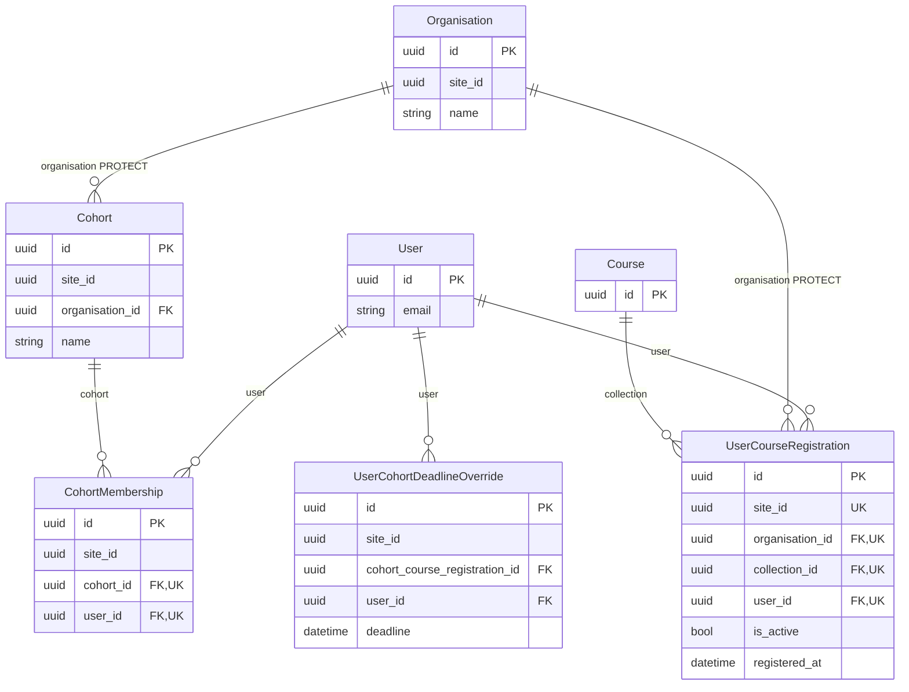
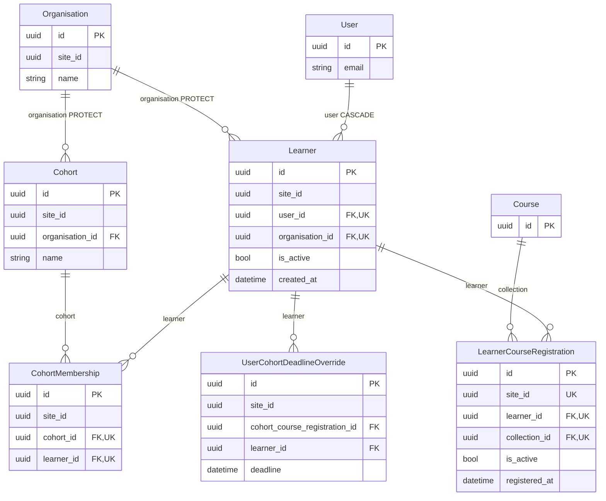

# Spec: Learners associated with organisations

Follow-on from the shipped Organisation layer (`spec_dd/3. done/2026-08-21_09:09_organisations`) and
the merged terminology rename (`spec_dd/3. done/2026-08-22_15:42_learner-terminology-rename`).

---

## 1. Summary

Introduce an explicit **`Learner`** model: a row recording that an `accounts.User` is associated with
an `Organisation`. A user may be a Learner of several organisations on the same Site.

**Enrolment records hang off `Learner`.** `CohortMembership` and the model today called
`UserCourseRegistration` stop pointing at a `User` and point at a `Learner` instead. An enrolment
that is not backed by an organisation association becomes unrepresentable — the schema enforces it,
so there is no check to write, no signal to keep in sync, and nothing to bypass.

Today "who belongs to this organisation" is derived, never stored. `users_visible_to`
(`freedom_ls/learner_management/queries.py:196-218`) answers it by unioning "members of cohorts in
this organisation" with "holders of a `UserCourseRegistration` in this organisation". There is no way
to say a person is one of an organisation's learners *before* an enrolment exists.

This cut ships:

- the `Learner` model in `freedom_ls/learner_management/`;
- `CohortMembership.user` → `learner`, and `UserCourseRegistration` → **`LearnerCourseRegistration`**
  with its `user` and `organisation` fields replaced by a single `learner` FK;
- `UserCohortDeadlineOverride.user` → `learner`, so the app has one notion of "a learner in a cohort";
- `ensure_learner(user, organisation)`, an idempotent helper with exactly two callers;
- the course-content access gate re-expressed through `Learner`, and honouring `Learner.is_active`;
- `learners_visible_to` **replacing** `users_visible_to`, and the educator interface's **Users**
  section becoming a **Learners** section that lists `Learner` rows;
- the educator interface's **Interested Learners** panel removed, making `CourseInterest` admin-only;
- a regenerated `learner_management` migration;
- a `LearnerAdmin`, which is this cut's only roster-curation surface, and a first
  `CourseInterestAdmin` to receive the removed panel's job;
- QA seed data for the three states that only exist because of this cut.

### 1.1 Scope: data structures, plus display

This cut builds the **data layer** and shows what it produces. It deliberately adds **no roster
management functionality to the educator interface** and **no new capability to `panel_framework`**.
Curating a roster by hand — adding a learner, marking one removed — happens in the Django admin only.
The educator-facing add and remove flows belong to the educator-interface build-out, a separate spec.

**There is no production data anywhere.** FLS has no live installs. The development database is
dropped and recreated, migrations are run, and the QA seed commands repopulate it. Nothing in this cut
backfills, repairs, reconciles or migrates existing rows, because there are no existing rows worth
protecting.

**This is a refactor of two shipped models, not an additive cut.** §12 measures it — of the order of
100 lines of real production code, plus test and QA-scaffolding churn, and §12 says what has to be
re-measured. That cost is stated up front so the size is not a surprise.

### 1.2 This reverses a stated non-goal of the Organisation cut

The Organisation cut said: "**No organisation membership object.** A learner's organisation comes
from their registrations" (`spec_dd/3. done/2026-08-21_09:09_organisations/1. spec.md:1079`).

That call was made to avoid Docebo's multi-branch cleanup pain, which came from several branch admins
editing one shared, mutable *profile* — not from multi-org membership as such. FLS already avoids
that trigger: profile fields live on the one Site-wide `accounts.User`, and Organisation is
explicitly not a profile-ownership boundary. **The reversal is deliberate**, and is recorded here so
nobody re-litigates it from the old document.

---

## 2. Why this matters

**"Who belongs to this organisation" becomes a stored fact instead of a derived one.** An educator
running an organisation has no way to say "this person is one of ours" until the person enrols in
something. Pre-building a cohort's intake, or tracking someone who has been told they will join, is
not expressible today. A `Learner` row makes it expressible.

**And it makes the association impossible to skip.** The alternative design — deriving `Learner` rows
from a `post_save` receiver on each enrolment model — leaves the association a best-effort side
effect that `bulk_create`, `queryset.update()` and `loaddata` silently bypass, and leaves two places
that both claim to know a person's organisation. Pointing the enrolment records at `Learner` removes
the second place. There is one fact, one row, and one way to write it.

---

## 3. Data model

All three models live in **`freedom_ls/learner_management/models.py`**.

Only the models this cut touches are shown, plus the `Organisation`, `Cohort` and `Course` they hang
off. Every other model in `learner_management` is unchanged.

**Before**



There is no row anywhere saying "this user belongs to this organisation". The association is derived
by `users_visible_to` from the two enrolment tables, and a `UserCourseRegistration` can name any
`(user, organisation)` pair at all.

**After**



`Learner` is the only path from a `User` to an enrolment, so an enrolment with no organisation
association cannot be written. `UserCourseRegistration` is renamed to `LearnerCourseRegistration` and
loses its `organisation` FK — `learner.organisation` is now the single source of that fact. The one
relationship the schema still cannot express is
`CohortMembership.learner.organisation == CohortMembership.cohort.organisation`; see §3.3.

### 3.1 `Learner`

| Field | Definition | Why |
|---|---|---|
| `user` | FK `settings.AUTH_USER_MODEL`, `on_delete=CASCADE` | Matches every existing user FK in the app. No `related_name`: the default reverse query name `learner` is what §6's queries rely on |
| `organisation` | FK `freedom_ls_organisations.Organisation`, `on_delete=PROTECT` | Matches `Cohort.organisation` (`models.py:17-20`), and backs up the admin's refusal to delete organisations |
| `is_active` | `BooleanField(default=True)` | Roster state. `False` means "removed from this organisation", never "deleted". It also suspends content access held through this organisation, without touching a single record — see §5.1 and §7.3 |
| `created_at` | `DateTimeField(auto_now_add=True)` | |

```python
class Learner(SiteAwareModel):
    class Meta:
        constraints = [
            models.UniqueConstraint(
                fields=["user", "organisation"],
                name="unique_learner_per_organisation",
            )
        ]

    def __str__(self) -> str:
        return f"{self.user} - {self.organisation}"
```

Four fields, one constraint, no index, no choices. `SiteAwareModel` supplies `id` and `site`.

**`__str__` is not decoration here.** §7.2 puts `Learner` behind `autocomplete_fields` on three admin
surfaces, and a Django autocomplete widget renders each option as `str(obj)` — without it, the only
roster-curation surface this cut ships offers a dropdown reading `Learner object (…)`. Every other
model in `learner_management/models.py` defines one. Naming the organisation alongside the person is
what makes two rows for the same user distinguishable in that dropdown.

### 3.2 The two enrolment models

```python
class CohortMembership(SiteAwareModel):
    cohort = models.ForeignKey(Cohort, on_delete=models.CASCADE)
    learner = models.ForeignKey(Learner, on_delete=models.CASCADE)

    class Meta:
        constraints = [
            models.UniqueConstraint(
                fields=["learner", "cohort"],
                name="unique_learner_cohort_membership",
            )
        ]


class LearnerCourseRegistration(SiteAwareModel):
    learner = models.ForeignKey(Learner, on_delete=models.CASCADE)
    collection = models.ForeignKey(
        "freedom_ls_content_engine.Course",
        on_delete=models.CASCADE,
        related_name="learner_registrations",
    )
    is_active = models.BooleanField(default=True)
    registered_at = models.DateTimeField(auto_now_add=True)

    class Meta:
        constraints = [
            models.UniqueConstraint(
                fields=["site_id", "learner", "collection"],
                name="unique_learner_course_registration",
            )
        ]
```

**Both constraints are exactly equivalent to today's**, because a `Learner` *is* a
(user, organisation) pair: `("site_id", "organisation", "collection", "user")` collapses to
`("site_id", "learner", "collection")`, and `("user", "cohort")` to `("learner", "cohort")`. Nothing
is loosened.

**`UserCourseRegistration.organisation` is dropped.** `learner.organisation` is the organisation. A
denormalised copy could only ever drift from it, and keeping one would preserve exactly the bypass
this design closes.

**The model is renamed to `LearnerCourseRegistration`**, and `related_name="user_registrations"` to
`learner_registrations`. The model no longer has a `user` field, so the old names describe something
that is not there, in the one place the change is most visible.

**`UserCohortDeadlineOverride.user` becomes `learner`** (`models.py:237`). Its `clean()` already joins
`CohortMembership.objects.filter(user=…)` (`models.py:266-267`); leaving it behind would give one app
two different notions of "a learner in a cohort" and turn that join into a needless `learner__user=`
hop. It is a small model in the same app and the same migration.

`RecommendedCourse.user` (`models.py:293`) stays a `User` FK. A recommendation is not an enrolment and
carries no organisation. See §11.

### 3.3 The one invariant the schema cannot express

A membership's `learner.organisation` must equal its `cohort.organisation`. Django has no composite
foreign key, so this is enforced twice, cheaply:

- `CohortMembership.clean()` raises a `ValidationError` when they differ;
- `CohortMembershipInline.formfield_for_foreignkey` offers only learners from the cohort's
  organisation, so the admin cannot construct the invalid state in the first place.

That is the only validation code in the design.

### 3.4 The decisions inside the table

**The `Learner` constraint omits `site`, following `CohortMembership`.** `CohortMembership` declares
its constraint with no site column because `cohort` already pins exactly one Site. `organisation`
pins exactly one Site for the same reason, so `(user, organisation)` is already unique site-wide.
Omitting it also sidesteps `ConstraintValidationFormMixin` (`site_aware_models/forms.py:20-58`): both
`user` and `organisation` are rendered by the admin form, so neither lands in `ModelForm`'s validation
exclusion set and the constraint is checked at clean time with no mixin.

**No `indexes`.** Django already indexes the `organisation` FK column, which is what §6's join uses.
A composite `(organisation, is_active)` index adds little at a scale of 2–5 organisations per Site,
and it is a one-line migration whenever profiling wants one.

**No `source`, and no `added_by`.** Nothing would read either. The Django admin — the only place a
row is created by hand — already records who created it and when, in `django_admin_log`.

**No `pending`/`invited` status.** Those states exist in other products to drive self-registration or
SSO flows this cut is not building.

**`is_active` is filtered explicitly at every call site, never in a manager.** The default manager
slot is already occupied by `SiteAwareManager`, which overrides `get_queryset()` to filter by site;
and a manager hiding `is_active=False` rows would make `ensure_learner`'s lookup miss every removed
learner, so re-adding one would attempt an INSERT and hit the unique constraint. Django's own
guidance agrees that a default manager "should not override `get_queryset()` to filter out any rows",
and no filtering default manager exists anywhere in `freedom_ls/`.

### 3.5 App placement

**`learner_management`, not a new app and not `organisations`.** `learner_management` already depends
on both `organisations` and `accounts` (`docs/app_structure.md:81`, `:84`), so `Learner` adds **zero
new edges**. Regenerate `docs/app_structure.md` with `/ds:app_map` regardless — it verifies the claim.

**`accounts` must never gain a runtime dependency on `learner_management`.** That edge is test-only
today (`docs/app_structure.md:116`, dashed). Nearly every app depends on `accounts`, so wiring Learner
creation into the signup flow itself would create a cycle through most of the codebase. Signup alone
creates no enrolment, so nothing needs this — but it is the direction a naive implementation reaches
for.

### 3.6 The call sites that simply follow the fields

Three surfaces carry no design decision at all: they filter on, traverse, or annotate the fields
being renamed, and the change is mechanical. They are listed because none of them is reachable from
§5, §6 or §7, so a reader working only from those sections would miss them — and none of them fails
at type-check time. A stale field name here raises a `FieldError` on the query, or an
`AttributeError` on the render, and the affected paths are not the ones a smoke test walks.

**`learner_management/deadline_utils.py` is the largest of the three.** It reaches all three changed
models:

| Site | Change |
|---|---|
| `:25` | the `_DeadlineType` alias names `UserCohortDeadlineOverride` — unchanged, the model keeps its name |
| `:60`, `:210` | `CohortMembership.objects.filter(user=user)` → `learner__user=user` |
| `:76`, `:220` | `UserCourseRegistration.objects.filter(user=user, …)` → `LearnerCourseRegistration.objects.filter(learner__user=user, …)` |
| `:102`, `:129`, `:236` | `UserCohortDeadlineOverride.objects.filter(…, user=user)` → `learner__user=user` |
| `:159`, `:352` | `reg: UserCourseRegistration` annotations → `LearnerCourseRegistration` |

Every one of these is keyed on a **user**, not on a learner, and must stay that way: a deadline
belongs to a person studying a course, and a person holding two `Learner` rows for the same course
should see the same deadline through either. `learner__user=user` preserves today's answer exactly;
`learner=learner` would silently narrow it. **`deadline_utils.py` does not gain a
`learner__is_active` condition** — §5.1's access gate already decides whether the person may open the
content at all, and duplicating the condition here would put a second copy of the gate in a third
place, which is the thing §5.1 exists to reduce.

**Two `__str__` methods read the renamed field.** `LearnerDeadline.__str__` (`models.py:223`) uses
`reg.user`, and `UserCohortDeadlineOverride.__str__` (`:287`) uses `self.user`. `LearnerDeadline`
needs no schema change, but its FK target is renamed to `LearnerCourseRegistration` and its `__str__`
hops through `reg.learner.user`.

`reports/indexes.py:180-185` is the third, and is already accounted for in §12.

---

## 4. `ensure_learner`, and its two callers

```python
def ensure_learner(user: User, organisation: Organisation) -> Learner:
    learner, _ = Learner._base_manager.update_or_create(
        site=organisation.site,
        user=user,
        organisation=organisation,
        defaults={"is_active": True},
    )
    return learner
```

Idempotent, and it reactivates a row that was previously removed: a fresh enrolment is a live signal
of re-association. `update_or_create` expresses create-or-reactivate in one call, writes only the
fields named in `defaults`, and wraps itself in `transaction.atomic()` with a row lock.

**`_base_manager`, not `objects`.** `SiteAwareManager.get_queryset()`
(`freedom_ls/site_aware_models/models.py:43-50`) ANDs the ambient thread-local site onto every lookup
when a request exists, and the organisation being handled is not always the Site the current request
is for. This is the established repo pattern, with its reasoning written out at
`freedom_ls/organisations/signals.py:26-34` and a regression test at
`freedom_ls/organisations/tests/test_signals.py:46-60`. Copy both.

**Pass `site=organisation.site` explicitly.** `_set_site_from_request()` only populates `site` when a
thread-local request exists and `site_id` is already falsy.

The helper has exactly two callers.

### 4.1 Self-registration on the default organisation

`initiate_course_access` (`freedom_ls/learner_interface/views.py:510-568`) is the only user-facing
self-service enrolment path in the codebase. It already resolves the Site's default Organisation
(`views.py:557-560`), because no organisation is in scope for a self-service registration. It now
ensures the `Learner` first and registers that learner:

```python
learner = ensure_learner(request.user, get_default_organisation(cast(Site, get_cached_site(request))))
LearnerCourseRegistration.objects.get_or_create(
    learner=learner,
    collection=course,
    defaults={"is_active": True},
)
```

Two visible steps at the one site that needs them. A single-organisation FLS install — everything on
the default Organisation — therefore behaves exactly as it does today, and FLS still works out of the
box. The existing comment explaining why the default organisation is used stays; it is still the
reason.

### 4.2 `LearnerFactory`

`SiteAwareFactory` overrides `_create` (`site_aware_models/factories.py:38-48`), so factory_boy's
`django_get_or_create` never fires. `LearnerFactory` delegates to the same helper production uses:

```python
class LearnerFactory(SiteAwareFactory):
    user = factory.SubFactory(UserFactory)
    organisation = factory.SubFactory(OrganisationFactory)

    @classmethod
    def _create(
        cls,
        model_class: type[django_models.Model],
        *args: object,
        **kwargs: object,
    ) -> django_models.Model:
        return ensure_learner(kwargs["user"], kwargs["organisation"])
```

The signature matches the `_create` it overrides (`site_aware_models/factories.py:39-48`) — the repo
requires type hints on every function, and a bare override would fail pre-commit. `SiteAwareFactory`
declares `site = factory.LazyFunction(_get_current_site)`, so `site` arrives in `kwargs` and is
deliberately dropped: `ensure_learner` derives it from `organisation.site`, which is the same value
by construction and the correct one when no request is ambient.

**Its idempotence is load-bearing** — see §9.

Nothing else calls `ensure_learner`. The admin creates `Learner` rows through the ordinary add form.

---

## 5. Authorisation

This cut changes exactly one authorisation surface — the gate deciding whether a person may open
course content — and adds no role-based one.

### 5.1 The content-access gate

Course content is gated by a single predicate: *does this person hold an active enrolment for this
course*. This cut moves it onto `Learner`, and it has no choice — the predicate is written three
times, and every copy filters on `UserCourseRegistration.user` or `cohort__cohortmembership__user`,
both of which this cut deletes.

| Copy | Shape |
|---|---|
| `is_registered_for_course` (`learner_management/utils.py:67-91`) | per-row `bool` |
| `is_registered_for_course_expression` (`learner_management/queries.py:21-55`) | `Exists() \| Exists()`, consumed by `filter_visible` |
| `get_course_registrations` (`learner_interface/utils.py:262-270`) | the dashboard's "my courses", feeding `get_current_courses` and `get_completed_courses` |

**The gate becomes "an active enrolment held by an active learner".** `Learner.is_active=False`
revokes access to course content held through that organisation.

```python
direct = LearnerCourseRegistration.objects.filter(
    learner__user=user, learner__is_active=True, collection=course, is_active=True
).exists()
if direct:
    return True
return CohortCourseRegistration.objects.filter(
    cohort__cohortmembership__learner__user=user,
    cohort__cohortmembership__learner__is_active=True,
    collection=course,
    is_active=True,
).exists()
```

`is_registered_for_course_expression` takes the identical pair of conditions inside each of its two
`Exists()` subqueries. The two must keep agreeing; the docstring at `queries.py:24-26` already says so,
and §10 adds a test that asserts it rather than trusting it.

**Both cohort conditions must live in one `filter()` call.** Django applies several conditions on a
multi-valued relation within a single `filter()` to the *same* joined row; split across two calls they
are free to match different rows, so a cohort holding the removed learner *and* any other active
learner would grant access. `CohortMembership` is unique on `(learner, cohort)`, not on `cohort`, so a
cohort has many memberships and this is reachable rather than theoretical. §10 pins it with a test —
a comment restating the ORM would not survive review.

**The third copy is collapsed, not extended.** `get_course_registrations` hand-rolls the same union a
third time, in a third app. It is rewritten to reuse the expression that already exists:

```python
def get_course_registrations(user: RequestUser) -> list[Course]:
    """Get all courses a user is registered for (directly or via cohort)."""
    return list(
        Course.objects.annotate(
            _is_registered=is_registered_for_course_expression(user)
        ).filter(_is_registered=True)
    )
```

Three copies become two. `learner_interface → learner_management` is an existing edge
(`docs/app_structure.md:76`), so this adds none, and `.distinct()` goes with it — `Exists()`
subqueries introduce no join to deduplicate. Leaving this copy alone would let the dashboard keep
listing courses whose content now redirects away.

**`course_access` is unchanged.** Every consumer reaches the gate through these helpers and never
touches a registration field: `course_access/backends.py:198`, `:341`, `:358`, `:407`,
`course_access/visibility.py:34`, `course_applications/backends.py:90`, and the four
`raise_404_if_hidden_unregistered` call sites. The backend seam absorbs the whole change, exactly as
the `CohortRoster` bundle boundary does in §12.

#### 5.1.1 A removed learner and a free course

A removed learner now passes `can_self_register`, so they reach `initiate_course_access`
(`learner_interface/views.py:510-570`), where §4.1's `ensure_learner` call reactivates or creates
their `Learner` **on the Site's default organisation** and registers against it. The resulting
behaviour, written down so it is not discovered in QA:

- Removal from an organisation revokes access to everything held **through that organisation**,
  immediately.
- Cohort-enrolled and organisation-registered courses have no self-service path, so for those the
  revocation is absolute.
- A freely self-registerable course can be re-entered by the learner themselves, on the default
  organisation — which is precisely what any member of the public may do. §7.4 already accepts that
  reactivation; this is the same round-trip seen from the access side.
- When re-entry lands on a different organisation from the one they were removed from, the learner
  holds two registrations for one course. The unique constraint is `(site_id, learner, collection)`,
  so that is legal, and `organisation_for_learner_course` already defines which one the player's
  co-branding chip follows.

Incidentally: today's `get_or_create(user=…, collection=…)` lookup omits `organisation` while the
constraint includes it, so it can return a row from another organisation. §4.1's replacement keys on
`learner`, which matches the new constraint exactly. That is a side effect of the refactor, not a fix
this cut sets out to make, and it needs no separate work.

### 5.2 Role-based permissions

**This cut adds no role-based authorisation surface at all.** The detail below exists because the
build-out will reach for a route that fails silently.

`_filter_perms_for_content_type` (`freedom_ls/role_based_permissions/utils.py:123-137`) keeps a
permission only when `app_label == ct.app_label` and the codename exists for that content type, and
`sync_user_object_permissions` applies that filter before assigning (`utils.py:168-169`). So a role
with `assignment_scope=SCOPE_OBJECT` assigned on an `Organisation` can only ever carry
`freedom_ls_organisations.*` codenames. `freedom_ls_learner_management.add_learner` would be dropped
before `assign_perm` is called, `has_perm` would return `False` forever, and
`validate_role_permissions` — which only checks registry membership — would still pass. The
constraint is already documented at `freedom_ls/role_based_permissions/roles.py:63-69`. The same
filter applies to `SCOPE_SITE` assignments, so `site_admin`'s four existing `*_cohort` grants
(`roles.py:24-27`) are already dead strings. Do not copy that pattern believing it grants anything.

So: **no role gains a permission.** Django creates `view_learner`/`add_learner`/`change_learner`/
`delete_learner` on `post_migrate`, and `LearnerAdmin` checks them the ordinary model-level way for
staff. `registry.py` is FLS's inventory of permissions **used in role assignments** — uncommented
means in use (`registry.py:51-56`), and everything else is commented out (`:57-84`). Add the four
`*_learner` codenames **commented out**, in that block's style. Listing an unused permission as
ACTIVE is precisely what invites someone to grant it and hit the landmine above.

**The four existing `*_usercourseregistration` entries (`registry.py:61-64`) are renamed too.** A
codename embeds the content type's `model` string, so renaming the model to `LearnerCourseRegistration`
makes `freedom_ls_learner_management.view_usercourseregistration` name a permission that no longer
exists. They stay commented out; only the strings and their human labels change. The
`*_usercohortdeadlineoverride` entries (`:77-80`) are untouched — that model keeps its name, only its
field changes.

Roster reads in the educator interface go through the queries in §6, which already gate on
`user.has_perm("freedom_ls_organisations.view_organisation", organisation)` — the same check
`cohorts_visible_to` uses (`queries.py:154-156`).

**Notes for the educator-interface build-out:**

- Gate roster writes on that narrow `view_organisation` check, **not** on
  `organisations_accessible_to` (`queries.py:105-127`), which is a **union** of role-holders and
  per-cohort-grant holders — using it for writes would hand a cohort-only educator write powers over
  the whole organisation's roster.
- Derive any per-object check from the queryset rather than reimplementing it, the convention stated
  at `can_view_cohort` (`queries.py:186-193`): expressed through the queryset "so a per-object check
  can never disagree with the queryset that populates a list or a dropdown".

---

## 6. Educator interface

### 6.1 `learners_visible_to`

The replacement for `users_visible_to` in `queries.py`, returning `Learner` rows:

```python
def learners_visible_to(user: RequestUser, organisation: Organisation) -> QuerySet[Learner]:
    if not user.is_authenticated:
        return Learner.objects.none()

    visible = Q(cohortmembership__cohort__in=cohorts_visible_to(user, organisation))
    if cast("User", user).has_perm(
        "freedom_ls_organisations.view_organisation", organisation
    ):
        visible |= Q(organisation=organisation)
    return Learner.objects.filter(visible, is_active=True).distinct()
```

**`is_active=True` sits outside the two branches, not inside one of them.** Written into the
organisation branch it would only hide a removed learner who holds no cohort membership — the cohort
branch would keep listing anyone still in a visible cohort, which is most removed learners, since
§7.3 leaves the membership row in place on purpose. One condition, applied to every path, is what
makes "removed learners do not appear in the Learners list" a fact rather than a near-miss.

**This is the Learners list only.** The Cohorts section's progress panel (`views.py:357-380`) reads
`CohortMembership` directly and is not routed through this query, so a removed learner still appears
in their cohort's progress table with their history intact. That is the correct reading of §7.3 —
the membership is real and the progress is real — and it is not a leak: the panel is already gated
on `cohorts_visible_to`. Deciding whether that table should mark them removed belongs with the
remove-a-learner action in the educator-interface build-out (§13).

**`users_visible_to` is deleted, not rewritten.** It has exactly two production callers —
`educator_interface/views.py:165` (`UserDataTable.get_queryset`) and `:864`
(`UserConfig.authorise_instance`) — and §6.2 replaces both with `learners_visible_to`. Rewriting it
would leave a `User`-returning function with no caller in the tree and seven tests maintaining it,
which is the "don't build functionality that is not explicitly requested" rule read backwards. Its
name, its two branches and its `.distinct()` all move into `learners_visible_to` above; anything the
educator-interface build-out later needs in `User` terms is one `.values("user_id")` away and can be
added when something asks for it.

The docstring that moves across is rewritten in one respect: the second branch is no longer "learners
who hold an individual registration in the organisation and belong to no cohort at all" but "learners
associated with the organisation" — a direct fact. **The paragraph explaining why that branch is
gated on an organisation role is carried over exactly as it is**; that constraint is about the
educator's authorisation level, not about how the association is stored, so `Learner` does not touch
it. `.distinct()` is carried over for the same reason it exists now — two join paths.

**The registration branch disappears**, because the schema now guarantees every enrolment has a
`Learner`. Visibility for an organisation-role holder is one condition: an active `Learner` row.
`is_active=False` means "removed from this organisation" and hides them from the educator list; they
stay visible and editable in the admin, which is where the flag is set back.

`organisation_for_learner_course` and `latest_registration` answer a different question ("which
organisation is this course being studied through") and are not superseded, but both traverse the
changed fields and need updating (`queries.py:58-102`). `is_registered_for_course_expression`, at the
top of the same file (`queries.py:21-55`), is the content gate and is covered by §5.1.

**A sub-decision, separable from the gate:** `organisation_for_learner_course`'s cohort branch also
takes `learner__is_active=True`, so the course player's co-branding chip cannot name an organisation
the learner has been removed from. It gates nothing — strike this one condition, without touching
§5.1, if the chip should keep naming the historical organisation instead.

### 6.2 The Users section becomes the Learners section

**Educators browse Learners, not Users.** The educator interface has exactly three sections, held in
a dict keyed by `url_name` (`educator_interface/views.py:1147-1149`): Cohorts, Users, Courses. The
Users section is repurposed rather than a fourth added — two overlapping people-lists in one interface
would be confusing.

| Today | After |
|---|---|
| `UserConfig.url_name = "users"` (`views.py:852`) | `"learners"` |
| `UserConfig.menu_label = "Users"` (`views.py:853`) | `"Learners"` |
| `UserConfig.model = User` (`views.py:854`) | `Learner` |
| `UserConfig` / `UserDataTable` / `UserInstanceView` / `UserDetailsPanel` / `UserCohortsPanel` | `Learner…` equivalents |

**`model` becomes `Learner`, and this is what pays for the refactor.** `UserDataTable.get_queryset`
(`views.py:154-181`) currently wraps `users_visible_to` in two `Prefetch`es that re-scope
`cohortmembership_set` and `usercourseregistration_set` to the organisation, with a comment
explaining that a learner studying through two organisations would otherwise list both. **A `Learner`
is already organisation-scoped, so its memberships and registrations cannot belong to another
organisation.** Both `Prefetch`es are deleted, not rewritten, along with the hazard they guarded. The
queryset becomes `learners_visible_to(request.user, organisation)` with ordinary
`select_related("user")` and `prefetch_related`, ordered by `user__first_name`, `user__last_name`.

Consequent changes in the section:

- `LearnerDataTable.search_fields` becomes `["user__first_name", "user__last_name", "user__email"]`.
- Column `text_attr`/`attr` values become `user.first_name`, `user.last_name`, `user.email`.
- `LearnerDetailsPanel.fields` becomes `["user.first_name", "user.last_name", "user.email"]`.
  `InstanceDetailsPanel._resolve_field` (`panel_framework/panels.py:98-114`) already traverses
  dot-notation paths — its docstring names `"user.email"` as the example — so this needs no
  `panel_framework` change, which is what keeps §14's "`panel_framework` is unchanged" criterion
  reachable.
- `LearnerCohortsPanel.get_filters` becomes `{"cohortmembership__learner": self.instance}`.
- `LearnerConfig.authorise_instance` (`views.py:860-868`) switches to `learners_visible_to`.

**This is a rename plus a model swap. No actions are added.**

**The `users/` path segment appears in seven places in `views.py`, not one**, and the literal is
hard-coded at every one — it is never derived from `url_name`. Missing any leaves a dead link, and
four of them are in data tables belonging to *other* sections:

| Line | Site | Disposition |
|---|---|---|
| `:191`, `:200` | `UserDataTable.get_columns` — first/last name links (`"users/{pk}"`) | `"learners/{pk}"` — the row *is* the learner |
| `:633` | `CohortCourseProgressPanel`'s row builder — `path_string=f"users/{user.pk}"` inside a `reverse()` | `f"learners/{membership.learner_id}"` |
| `:1031`, `:1039` | `CourseLearnerRegistrationDataTable.get_columns` (`"users/{user.pk}"`) | `"learners/{learner.pk}"` |
| `:1083`, `:1091` | `CourseInterestDataTable.get_columns` (`"users/{user.pk}"`) | the whole data table is **removed** — see §6.5 |

Plus `educator_interface/tests/test_organisation_isolation.py:159`, which builds `f"users/{pk}"` by
hand. The two sites in other sections that survive now link to a `Learner` pk, not a `User` pk, so
each needs its row's learner rather than its user — and both rows have one, because a cohort
membership and a course registration each hang off a `Learner` after this cut. **`CourseInterest`
does not**, which is why §6.5 removes that panel instead of relinking it: `CourseInterest` keeps its
plain `User` FK (§13), so a person can express interest without ever being a learner of any
organisation, and there is no learner pk to point at.

A `grep -rn 'users/' freedom_ls/` after the change should return nothing but the unrelated docstring
in `qa_helpers/management/commands/qa_create_incomplete_registration_learner.py:15`, where the match
is the prose "superusers/staff are exempt from the gate".

Also renamed: the cell template
`educator_interface/templates/educator_interface/data-table-cells/user_courses.html`, whose loop
`` reads a reverse accessor that no longer
exists on the object.

**Three more sites in `views.py` traverse the changed fields without containing the string `users/`,
so the grep above will not find them:**

| Site | Change |
|---|---|
| `CohortCourseProgressPanel._paginate_learners` (`:357-380`) | `Subquery(CourseProgress.objects.filter(user=OuterRef("user")…))` → `OuterRef("learner__user")`; `select_related("user")` → `select_related("learner__user")`; `order_by("progress", "user__email")` → `"learner__user__email"` |
| `CohortCourseProgressPanel._build_rows` (`:606`) | `user = membership.user` → `membership.learner.user`, which the `select_related` above already loaded |
| `CourseLearnerRegistrationDataTable.get_queryset` (`:1010-1021`) | `.filter(organisation=organisation)` → `learner__organisation=organisation`; `select_related("user", "collection")` → `("learner__user", "collection")`; `order_by("user__first_name", …)` → `"learner__user__first_name"`. Its comment about registrations not leaking across organisations stays true and stays put |

**`CourseDataTable` (`:871-921`) needs care rather than a rename.** It annotates
`direct_learner_count=Count("user_registrations", filter=Q(user_registrations__is_active=True))`,
which follows the renamed `related_name` to `learner_registrations`; and
`_annotate_total_learner_count` (`:897-916`) unions `m.user_id` from prefetched cohort memberships
with `reg.user_id` from prefetched direct registrations to reach a count of **unique people**.
Switching both to `learner_id` would change the answer: one person holding a `Learner` row in two
organisations contributes two ids and is counted twice. Both must become `learner__user_id` —
`m.learner.user_id` and `reg.learner.user_id` — with `select_related("learner")` added to the two
`prefetch_related` querysets so the hop costs no extra query. Today's number is the one to preserve.

**No new URL patterns.** `educator_interface/urls.py` is two `re_path`s — `root` and a catch-all
`organisations/<organisation_slug>/<path_string>` — and everything else is a `path_string` walked by
`panel_framework`. Links are built with `reverse("educator_interface:interface", kwargs=…)`.
Inventing new URL names here would be fighting the routing design.

**`test_config_authorisation.py` does need an edit.** It enumerates `interface_config` rather than
`urlpatterns`, so the new `url_name` flows through automatically — but its `_seed_instance` dispatcher
(`:40-61`) branches on `config.model is User`, and `model` is now `Learner`. That branch becomes a
`LearnerFactory`, which is simpler than what it does today (build a cohort, a user, and a membership).

### 6.3 No roster actions in the educator interface

**Neither `LearnerConfig.get_actions` nor `LearnerInstanceView.get_actions` is added.** Two
constraints made this the right call, and the build-out spec inherits both:

**`FormPanelAction` is `ModelForm`-typed end to end** (`panel_framework/actions.py:41-67`):
`form_class: Callable[..., forms.ModelForm]`, and `get_form` calls
`self.form_class(data, instance=instance)`. An exact-email lookup form is a plain `forms.Form`, which
rejects `instance=` and would fail mypy in pre-commit. Fitting one in means widening
`panel_framework`'s annotations or shoehorning a `ModelForm` that never saves — both changes to
`panel_framework`, and this cut makes none.

**Neither `get_actions` hook can see the organisation.** `ListViewConfig.get_actions(request)` is
called with a bare `HttpRequest()` by `test_config_authorisation._config_path_strings` (`:64-99`), so
it must not touch `request.organisation`; and `InstanceView.get_actions(self)` takes no request at
all. `CohortInstanceView.get_actions` sidesteps this by reading the organisation off its own instance
(`views.py:776-790`). A `Learner` instance *does* carry an organisation, so a future action could
copy that pattern — which is another thing the model swap buys. Record it; do not build it here.

### 6.4 Copy

The Learners section says "learner" consistently, and the pass audits for "user" leaking through
where "learner" is meant. Per the `brand-guidelines` skill
(`.claude/skills/brand-guidelines/SKILL.md:177`): "learners", not "students". Scope is small — the
menu label, the section heading, and the column headers.

### 6.5 The Interested Learners panel moves to the admin

The Course section's **Interested Learners** panel lists `CourseInterest` rows and links each name
into the people section. `CourseInterest` keeps its plain `User` FK (§13), so after this cut those
links have no `Learner` pk to point at — and the deeper reason is that the panel does not belong in
an organisation-scoped interface at all: interest is expressed against a Site-wide course by anyone
browsing, with no organisation in scope, so an organisation-scoped panel implies a scoping it has
never had.

**Removed from `educator_interface/views.py`:** `CourseInterestDataTable` (`:1068-1104`),
`CourseInterestPanel` (`:1107-1112`), the `"interest": CourseInterestPanel` entry in
`CourseInstanceView.panels` (`:1120`), and the now-unused
`from freedom_ls.course_interest.models import CourseInterest` import (`:33`).

**Kept:** the `interest_count` annotation (`:887`) and its column (`:945`) on the Courses list. A
count names nobody, needs no link, and is the signal an educator actually acts on.

**Added: `freedom_ls/course_interest/admin.py`**, which does not exist today — the app ships no
admin at all, so "admin-only" is not currently true of `CourseInterest` and this cut has to make it
so. Per the `fls-dev:admin-interface` skill it subclasses `SiteAwareModelAdmin` (`CourseInterest` is
a `SiteAwareModel`); `list_display` and `search_fields` cover the user and the course, and
`list_select_related` covers both FKs. Nothing more — this is a read surface.

**This removes an app-graph edge.** `educator_interface --> course_interest`
(`docs/app_structure.md:63`) exists only because of that import. The `/ds:app_map` regeneration §8
already requires will show the edge gone; §14's "no new edges" criterion is about additions, and a
removal is not a regression.

**Tests.** `educator_interface/tests/test_course_visibility_and_interest.py`'s Task 5.2 block
(`:100-151`) tests the panel and goes with it, including
`test_interest_panel_is_wired_into_course_instance_view`. The Task 5.1 block (`:15-97`) tests the
count column and stays. A test that the Course instance view no longer exposes an `"interest"` panel
replaces the deleted wiring test, and `course_interest` gains an admin test for the new
`CourseInterestAdmin`.

---

## 7. The admin

The Django admin is this cut's only roster-curation surface: the only place a `Learner` is created by
hand, and the only place one is marked removed.

### 7.1 `LearnerAdmin`

`freedom_ls/learner_management/admin.py`, registered on `Learner`.

**Base class `SiteAwareModelAdmin`**, not `GuardedSiteAwareModelAdmin`. The `fls-dev:admin-interface`
skill makes a site-aware base mandatory; the guarded variant is for models carrying per-object
guardian grants, which `Learner` does not. Every other model in this app's admin uses
`SiteAwareModelAdmin` (`admin.py:64`, `:111`, `:127`, `:168`, `:205`, `:250`); only `CohortAdmin`
(`:41`) is guarded.

- `has_delete_permission` returns `False`, copying `OrganisationAdmin` (`organisations/admin.py:22-25`).
- `list_display`: the user, the organisation, `is_active`, `created_at`.
- `list_filter` on `organisation` and `is_active`.
- `created_at` is readonly.
- `search_fields` on the user's names and email, so the enrolment admins' `autocomplete_fields` work.

No `save_model` override and no form mixin — there is nothing to stamp and nothing to un-exclude.

### 7.2 The existing admins follow the FKs

- `CohortMembershipInline` (`admin.py:22-26`) swaps `user` for `learner` in `fields` and
  `autocomplete_fields`, and gains the `formfield_for_foreignkey` from §3.3.
- `LearnerCourseRegistrationAdmin` (`admin.py:63-89`) loses `organisation` from its fieldset and
  `autocomplete_fields`; `list_select_related`, `search_fields` and the `get_user_name` display
  (`:83-88`) hop through `learner__user`.
- `LearnerDeadlineAdmin` (`admin.py:176-193`) needs the same hop through
  `learner_course_registration__learner__user`, in `list_select_related`, `search_fields` and the
  `get_user_name` display (`:191-193`). `LearnerDeadline` itself needs no schema change — it is the
  only model with an FK into the changed models — though its FK target is renamed and its `__str__`
  follows the field (§3.6).
- **`UserCohortDeadlineOverride`'s two admin surfaces follow its renamed field**, which §3.2 changes
  and §7 would otherwise leave behind: `UserCohortDeadlineOverrideInline` (`admin.py:100-107`) swaps
  `user` for `learner` in `fields` and `autocomplete_fields`, and `UserCohortDeadlineOverrideAdmin`
  (`:204-245`) hops through `learner__user` in `list_select_related`, `search_fields`,
  `autocomplete_fields` and the `get_user_name` display (`:232-234`). Both rely on
  `LearnerAdmin.search_fields` from §7.1, which is the third autocomplete surface §3.1's `__str__`
  has to render for.
- The inline offers every learner on the Site, not only those in the cohort. That is left alone:
  `UserCohortDeadlineOverride.clean()` already refuses an override for a non-member
  (`models.py:266-272`), and after this cut that check reads `CohortMembership.objects.filter(learner=…)`,
  which enforces the organisation match transitively. §3.3's `formfield_for_foreignkey` narrowing is
  reserved for `CohortMembershipInline`, where no such `clean()` backstop exists.

### 7.3 Removal is soft, never cascades, and suspends access

Removal sets `is_active = False`. It **never** cascades to `LearnerCourseRegistration`,
`CohortMembership`, or any progress model.

**Records never cascade; entitlement does.** Deactivating a `Learner` leaves every registration,
membership and progress row exactly as it was — that is the Moodle failure being avoided, and it is
about destroying history. What removal changes is entitlement: §5.1's gate stops returning `True`, so
the learner cannot open content held through that organisation. Data preserved, access suspended.
Reactivation restores access with nothing to rebuild, precisely because nothing was destroyed.

Cascading here destroys learning history — it is the failure Moodle's cohort sync is best known for.
FLS avoids it by writing no cascade code: the enrolment models keep their own `is_active` flags and
their own lifecycles. One test pins it, so a future contributor who adds a receiver here trips it.

**No hard delete on `Learner`**, following the discipline the Organisation cut applied to
`Organisation` itself, and enforced by `LearnerAdmin.has_delete_permission`. This also sidesteps a
compliance question: "delete this learner" from Organisation A is meaningless when the same person
also studies with Organisation B on the same Site.

### 7.4 Reactivation

A deactivated learner disappears from the educator interface's Learners list — there is no "show
removed" filter there. They remain in the admin, which is where `is_active` is flipped back.
`ensure_learner` reactivating rather than inserting is what makes that round-trip produce one row
instead of a constraint violation — which also means a self-service registration on the default
organisation silently un-removes them. That is correct, since they are studying again, but it is
worth a line in the model docstring. Both flips move content access with them, because §5.1's gate
reads this same flag: deactivating suspends access, reactivating restores it.

---

## 8. Migration and rollout

**No backfill, no repair command, no data migration.** There is no production data anywhere. The
development database is dropped and recreated; migrations run against an empty schema; the QA seed
commands (§9) repopulate it.

**Regenerate `learner_management`'s `0001_initial`**, following the precedent the terminology rename
set for these three apps. There is exactly one migration file today, and the field swap is destructive
against a schema no install has ever carried in production. `freedom_ls/reports/migrations/0001_initial.py:15`
depends on `("freedom_ls_learner_management", "0001_initial")` — the name is unchanged and the
dependency is on `Cohort`, which this cut does not touch, so the dependency still resolves. Confirm
that is still the only external dependency before regenerating.

**The four `*_learner` permissions do not exist during migration.** Django creates default permissions
on `post_migrate`; nothing in the migration may reference them.

**Upgrade notes** must say:

- Recreate the database and run `migrate`. There is no backfill, and an install carrying data it wants
  to keep is not supported by this release.
- `UserCourseRegistration` is now `LearnerCourseRegistration`. Its `user` and `organisation` fields
  are replaced by `learner`; reach the person as `registration.learner.user` and the organisation as
  `registration.learner.organisation`. `Course.user_registrations` is now `Course.learner_registrations`.
- `CohortMembership.user` and `UserCohortDeadlineOverride.user` are now `learner`.
- Creating either enrolment record requires a `Learner`. Use `ensure_learner(user, organisation)`.
- **Behaviour change:** deactivating a `Learner` now revokes that person's access to course content
  held through that organisation. Registrations, memberships and progress rows are untouched — only
  the gate changes — and reactivating restores access.
- `is_registered_for_course`, `is_registered_for_course_expression` and `get_course_registrations`
  keep their names and signatures but now require an active `Learner`. A downstream project that
  reimplemented any of them must add the same condition.
- The educator interface path `organisations/<slug>/users/…` is now `organisations/<slug>/learners/…`,
  the section is labelled "Learners", and it lists `Learner` rows — so the instance pk in that path is
  a `Learner` pk, not a `User` pk.
- **`users_visible_to` is removed.** Use `learners_visible_to(user, organisation)`, which returns
  `Learner` rows. A project that needs the people instead can wrap it:
  `User.objects.filter(pk__in=learners_visible_to(u, o).values("user_id"))`.
- **The educator interface's Interested Learners panel is removed.** `CourseInterest` is now read in
  the Django admin, via the new `CourseInterestAdmin`. The Courses list keeps its interest count.
- The `course.registered` webhook payload is unchanged. Its `user_id` and `user_email` are now
  resolved through `self.learner.user` inside `LearnerCourseRegistration.save()`.

Regenerate `docs/app_structure.md` with `/ds:app_map`. No **new** edges are expected — that is what
the regeneration verifies — but one edge disappears: §6.5 removes `educator_interface`'s only import
from `course_interest`.

---

## 9. Factories and QA data

**`LearnerFactory`** as in §4.2. `CohortMembershipFactory` and `LearnerCourseRegistrationFactory` each
take `learner = factory.SubFactory(LearnerFactory)` in place of their `user` and `organisation`
declarations.

**Test call sites are rewritten mechanically**: `user=u, organisation=o` becomes
`learner__user=u, learner__organisation=o`, using factory_boy's built-in `__` traversal into a
`SubFactory`. **`LearnerFactory`'s idempotence is what makes this work** — many tests build both a
cohort membership and a registration for the same person, and without it the second call would hit
`unique_learner_per_organisation`.

**No back-compat `user=` / `organisation=` shim on the enrolment factories.** A shim would let test
code keep thinking in terms of the fields this design removes.

**QA data.** Extend `qa_helpers/management/commands/qa_create_organisation_scenarios.py` rather than
adding a new command — it already owns the organisation cast, is already idempotent, and its existing
personas map straight onto the three new states:

| State | Persona |
|---|---|
| A learner in two organisations at once | Cara Learner (`cohort.learner@example.com`) — give her a Northside enrolment alongside her RPAS one |
| A learner with no enrolment | Nell Unregistered (`no.reg.learner@example.com`) — already an account with nothing attached. Give her a `Learner` in RPAS Training |
| A removed learner | A `Learner(is_active=False)` for a user with no enrolment at all |

The removed learner is written directly, not through `ensure_learner` — `is_active=False` is exactly
what `ensure_learner` will not produce. Set `site` explicitly from the organisation, as everything
else in that command does. Note that the command runs inside its own `_site_context` (`:118-140`), so
a thread-local request *is* ambient there; that is fine for `ensure_learner`, which uses
`_base_manager`.

**With the database recreated and no backfill, this seed is the only source of `Learner` rows** — QA
cannot proceed without it. **19 of the 31 `qa_*` commands** create one of the changed models and must
be updated. pytest never collects them, so a missed one surfaces only at runtime.

---

## 10. Testing

All new tests are **unmarked (portable)** — the models, helper, queries and admin are pure FLS
contract with no dependence on FLS's branding or `demo_content/`. Do not reach for `fls_internal`.
**No new playwright test**: this cut adds no new interaction to the educator interface.

Every DB test takes `mock_site_context`. Use factories, never `.objects.create()`. Use `reverse()` for
URLs and `client.force_login(user)`. No conditionals or loops in test bodies; `pytest-randomly` is on,
so tests must pass in any order.

**`learner_management/tests/test_learner.py`**
- the unique constraint rejects a second `Learner` for the same user and organisation
- the same user may hold `Learner` rows in two organisations
- a `Learner` takes its `site` from its organisation

**`learner_management/tests/test_ensure_learner.py`**
- calling twice creates one row and returns the same row
- reactivates a removed learner
- **finds the existing row when a different site is ambient** — the `_base_manager` regression test,
  following `organisations/tests/test_signals.py:46-60`

**`learner_management/tests/test_enrolment_models.py`**
- a `CohortMembership` whose learner belongs to a different organisation than the cohort is rejected
  by `clean()`
- the two unique constraints still reject the duplicates they reject today — this is the replacement
  for `test_organisation_constraints.py`, whose "one user, one course, two organisations" case now
  reads as "one learner per organisation, one registration each"
- **deactivating a `Learner` leaves every `LearnerCourseRegistration`, `CohortMembership` and progress
  row untouched** — the non-cascade invariant (§7.3). The same test asserts `is_registered_for_course`
  now returns `False`, so records-preserved and access-suspended are pinned together

**`learner_management/tests/test_queries.py`** (extend)
- a learner with no enrolment is visible to an organisation-role holder
- a learner whose row is `is_active=False` is not
- **a removed learner who is still a member of a visible cohort is not either** — the condition
  applies to both branches, and putting it inside the organisation branch would pass every other
  test on this list while failing this one
- a learner in another organisation is not visible — the "two organisations, a role on one only,
  assert the other returns nothing" guarantee
- a cohort-only educator does not see individually associated learners — must keep passing unchanged
- `TestUsersVisibleTo`'s seven tests are **deleted with the function** (§6.1). Each is read first and
  re-expressed against `learners_visible_to` where it still says something the four cases above do
  not — the anonymous-user and no-permission cases in particular have no equivalent above and must
  survive the move

**`learner_management/tests/test_learner_admin.py`**
- the admin refuses a delete
- an admin-created `Learner` takes its `site` from the organisation
- `CohortMembershipInline`'s learner field offers only learners from the cohort's organisation

**`learner_interface/tests/`** (extend)
- self-registration creates the `Learner` on the default organisation and the registration against it
- self-registering twice creates one `Learner` and one registration
- self-registration reactivates a removed learner on the default organisation

**`learner_management/tests/` — deadlines** (extend the existing deadline tests, §3.6)
- a learner's effective deadline is unchanged by the refactor, through both the cohort-override and
  the individual-registration path
- **a person holding two `Learner` rows for the same course still resolves one deadline per
  registration** — the `learner__user=` versus `learner=` distinction, which is the only way this
  mechanical change can go wrong silently

**`course_interest/tests/test_admin.py`** (new, §6.5)
- `CourseInterestAdmin` is registered and site-scoped

**`educator_interface/tests/`** (§6.5)
- `test_course_visibility_and_interest.py`'s Task 5.2 block is deleted; a replacement asserts
  `CourseInstanceView.panels` has no `"interest"` key
- the Courses list still renders its interest count — the Task 5.1 block passes unchanged
- the cohort progress panel's learner rows still link and still order by email, now through
  `learner__user` (§6.2)

**`educator_interface/tests/test_learner_section.py`**
- the section is reachable at `organisations/<slug>/learners` and its menu label is "Learners"
- `organisations/<slug>/users` no longer resolves
- a learner with no enrolment appears in the list
- a learner whose row is `is_active=False` does not
- **a learner in two organisations shows only the current organisation's cohorts and courses** — the
  guarantee the deleted `Prefetch`es used to provide, now structural

**`learner_management/tests/test_utils.py` and `test_queries.py`** (extend — the content gate)
- a learner whose `Learner` is `is_active=False` is not registered, even though the
  `LearnerCourseRegistration` itself is still active
- the same through the cohort branch
- **a cohort holding the user's inactive learner alongside a second, active learner grants the user
  nothing** — the single-`filter()` guarantee, which splitting into two `filter()` calls would break
- `is_registered_for_course` and `is_registered_for_course_expression` agree over the same fixtures
- reactivating the learner restores access

**`learner_interface/tests/`** (extend — the content gate)
- a removed learner's dashboard lists the course in neither current nor completed
- a removed learner is redirected off `view_course_item` and `course_home` to the course detail page
- a hidden course a removed learner was registered for 404s again and drops out of `filter_visible` —
  the per-row gate and the queryset must not disagree
- a removed learner self-registering for a free course regains access on the default organisation
  (§5.1.1), asserted deliberately rather than discovered

**Hygiene the reviewer will check.** Mock only at system boundaries. `assert response.status_code == 200`
alone is an anti-pattern — always assert the behaviour. Add one `django_assert_max_num_queries` test
for the Learners list so its cost does not grow with row count (precedent: `test_queries.py:496-526`).

`test_config_authorisation.py` must be **run and seen to pass** — it sweeps every enumerated path for
the renamed section, so it is the fastest proof the rename is complete.

---

## 11. Decisions

1. **Enrolment records point at `Learner`, not at `User`.** An enrolment with no organisation
   association is unrepresentable, so there is no check to write and nothing to bypass. (§1, §3)
2. **`UserCourseRegistration` becomes `LearnerCourseRegistration`, and loses its `organisation`
   field.** `learner.organisation` is the organisation; a denormalised copy could only drift. (§3.2)
3. **`UserCohortDeadlineOverride` moves too**, so the app has one notion of "a learner in a cohort".
   `RecommendedCourse` does not: a recommendation is not an enrolment. (§3.2)
4. **Both unique constraints are preserved exactly**, expressed through `learner` instead of
   `(user, organisation)`. Nothing is loosened. (§3.2)
5. **One invariant needs code**: a membership's learner and cohort must share an organisation,
   enforced in `clean()` and by scoping the admin inline's field. (§3.3)
6. **`ensure_learner` has two callers**: self-registration on the default organisation, and
   `LearnerFactory`. No signals. (§4)
7. **`_base_manager` in `ensure_learner`**, the established repo pattern, with a regression test. (§4)
8. **Self-registration keeps working out of the box.** It already lands on the default Organisation;
   it now ensures the `Learner` there first. (§4.1)
9. **Educator visibility is one condition: an active `Learner` row.** The registration branch
   disappears because the schema guarantees every enrolment has a learner. (§6.1)
10. **`users_visible_to` is deleted rather than rewritten.** `learners_visible_to` takes both its
    callers, so rewriting it would leave a function with no caller and seven tests maintaining it.
    (§6.1)
11. **The Interested Learners panel is removed and `CourseInterest` becomes admin-only.** Its rows
    have no `Learner` to link to, and interest is expressed with no organisation in scope, so an
    organisation-scoped panel implies a scoping it never had. The Courses list keeps the count.
    (§6.5)
12. **The Learners section lists `Learner`, not `User`** — which deletes the two organisation-scoping
    `Prefetch`es and the cross-organisation leakage hazard they guarded. (§6.2)
13. **This cut is data structures plus display.** No roster-management functionality in the educator
    interface, and no new capability in `panel_framework`. Curation is admin-only. (§1.1, §6.3, §12)
14. **Four fields on `Learner`, no provenance.** The admin already logs who created each row. (§3.4)
15. **`is_active` is filtered explicitly, never in a manager.** A filtering default manager would
    break `ensure_learner`'s lookup and collide with `SiteAwareManager`. (§3.4)
16. **Removal is soft and never cascades**, achieved by writing no cascade code and pinned by a test.
    (§7.3)
17. **No *role* gains a permission, and the `*_learner` codenames go into `registry.py` commented
    out.** The naive route is silently broken by guardian's content-type filter. (§5.2)
18. **Regenerate `0001_initial`.** No production data, one migration file, and the only external
    dependency is on `Cohort`, which is unchanged. (§8)
19. **`Learner` lives in `learner_management`** — zero new app-graph edges. (§3.5)
20. **`deadline_utils.py` follows the fields by user, not by learner.** Every filter there becomes
    `learner__user=user`, so a person holding two `Learner` rows sees the same deadline through
    either — and it gains no `is_active` condition, because §5.1 already decides access. (§3.6)
21. **Content access is gated on an active `Learner`.** The predicate behind the content gate moves
    onto `Learner` — it must, since it filters on fields this cut deletes — and takes
    `learner__is_active` with it, so removal suspends access without touching a record. Its three
    copies become two, and `course_access` needs no change. This supersedes the earlier "no gating
    beyond the FK" non-goal. (§5.1, §7.3)

---

## 12. Cost

Measured against the current tree, not estimated.

| Category | Files | Lines |
|---|---:|---:|
| Real production code | 10 | **73** |
| Shipped scaffolding (`factories.py`, `create_demo_data.py`, 19 `qa_helpers` commands) | 21 | 158 |
| pytest tests | 43 | 330 |
| Comments only (`role_based_permissions`) | 2 | 9 |
| **Total** | **76** | **570** |

**These figures predate §3.6 and §6.5 and are now low.** `learner_management/deadline_utils.py`
(roughly 12 lines across five call sites), the three further `educator_interface/views.py` sites and
`CourseDataTable` (§6.2), the two `UserCohortDeadlineOverride` admin surfaces (§7.2), and the new
`course_interest/admin.py` all land in "real production code"; §6.5 also *removes* about 50 lines
from `educator_interface/views.py` and about 50 from its tests. Re-measure before quoting any total.

85% of it is test and QA-scaffolding churn, and most of that funnels through the factory changes in
§9. The parts that need care:

1. **`queries.py:196-218`** — `users_visible_to` is the gate the whole educator interface hangs off,
   and both branches currently reverse-traverse from `User`. It is replaced by `learners_visible_to`
   and deleted (§6.1), so the risk is a caller or a test left pointing at it rather than a wrong
   rewrite.
2. **`educator_interface/views.py:168-176`, `:213`, and
   `templates/educator_interface/data-table-cells/user_courses.html:1`** — the `User`-side reverse
   accessors `cohortmembership_set` and `usercourseregistration_set` vanish, and two references to
   them are *strings* (a column config `"relation_set"` and a template loop), so they fail silently
   rather than raising. §6.2 deletes most of this rather than rewriting it.
3. **`learner_interface/views.py:552`** — the single self-registration write path (§4.1).
4. **`learner_management/utils.py:67`, `learner_management/queries.py:21` and
   `learner_interface/utils.py:262`** — the three copies of the content gate (§5.1). Each filters on
   fields this cut deletes, and the middle one is a `Q` expression whose per-row twin has to keep
   agreeing with it. `course_access` itself needs no change: it reaches the gate only through these
   helpers.
5. **`learner_management/deadline_utils.py`** — five filters keyed on `user`, reachable from no other
   section of this spec, and every one of them must become `learner__user=` rather than `learner=`
   (§3.6). Getting this wrong narrows a deadline lookup silently and no type checker sees it.
6. **`educator_interface/views.py:897-916`** — `_annotate_total_learner_count` counts *unique people*
   by unioning two sets of user ids. `learner_id` is not a drop-in for `user_id` here; it
   double-counts anyone holding two `Learner` rows (§6.2).

The content gate adds three files to the first row of the table above — two of them in apps already
counted — and roughly 17 further lines. Re-measure before quoting the total.

Easy to miss: `reports/indexes.py:180-185` is a 3-line change, and because `CohortRoster` is a plain
dict of `User` keyed by id, `gather.py`, `report_data.py`, `tasks.py` and every report template need
**zero** changes — the bundle boundary is doing its job. `LearnerDeadline` is the only model with an
FK into the changed models and needs no schema change. The `course.registered` webhook payload keys
(`user_id`, `user_email`) are a public contract declared at `base/webhook_event_types.py:21-27` and
rendered by `webhooks/presets.py:57`; keep them, and resolve them through `self.learner.user`.

---

## 13. Non-goals for this cut

Stated explicitly so they are deferrals, not gaps.

**Deferred to the educator-interface build-out.** This cut's job is to make these buildable.

- **No add-a-learner action.** When built it must be an **exact-email lookup on this Site that never
  creates an account** — the duplicate-account trap is the most consistently reported sharp edge
  across every vendor researched. The lookup helper belongs in `freedom_ls/accounts/utils.py`, which
  adds zero new edges and keeps `accounts` free of any dependency on `learner_management` (§3.5). It
  must **not** reuse `DataTable.search_fields`, which filters the visible queryset and so only finds
  people already visible. And it must **say nothing about other Sites**: `accounts/models.py:68` makes
  `User.email` globally unique while `UserManager.get_queryset` site-filters, so the message must be
  identical whether the email is free or held on a sibling Site — otherwise it is a cross-tenant
  existence disclosure.
- **No remove-a-learner action.** When built, any refusal should follow `reports/views.py:79-106`
  (pre-check for the friendly message, re-check inside `transaction.atomic()`) and return **422** per
  the repo-wide "HTTP 422 for HTMX validation errors" rule, with renderable HTML in the body because
  `base/static/base/js/alpine-components.js:9-14` swaps 422 bodies. Confirmation follows
  `panel_framework/partials/delete_confirmation.html`; **never `hx-confirm`**, which appears nowhere
  in the tree.
- **No changes to `panel_framework` of any kind**, including the `ModelForm`-typing and
  `get_actions`-has-no-organisation obstacles catalogued in §6.3.

**Deferred with no current owner:**

- **No provenance fields.** `source` and `added_by` can be added whenever something reads them.
- **No learner-facing changes.** A learner studying through two organisations still sees one merged
  course list, with the existing per-course organisation logo as the only cue.
- **No per-organisation content scoping.** The gate asks whether *any* active `Learner` of this
  person backs an active enrolment for the course; it never asks which organisation the current
  request is "for". Someone studying one course through two organisations is unaffected by removal
  from one of them while the other enrolment stands.
- **No suspension surface outside the admin.** `Learner.is_active` is flipped in the Django admin
  only. There is no educator-facing suspend action, no learner-facing explanation of why a course
  disappeared, and no notification. Those belong with the remove-a-learner action in the
  educator-interface build-out.
- **No hard delete, no merge.** Same reasoning as `Organisation` itself.
- **No bulk add/remove and no CSV import.** Every product that has these has them because branches
  hold hundreds of users; FLS expects 2–5 organisations per Site.
- **No typeahead / autocomplete** in the educator interface. None exists there today.
- **No "show removed learners" filter** in the educator interface. The admin shows them.
- **No `pending`/`invited` states.**
- **No row-level actions in `panel_framework`.** The standing TODO at
  `educator_interface/views.py:104-112` stays in place.
- **No self-registration via an organisation-specific signup URL, no SSO attribute mapping, no invite
  links.**
- **No cross-organisation admin view.** "Show me this person across every organisation" is a real
  want, but it must be an explicitly authorised site-level capability if it is ever built — never a
  side effect of holding two organisation roles at once. That is how Canvas's long-standing
  cross-account visibility leak happened.
- **No fix to the cross-content-type permission sync**, and no custom `manage_organisation_learners`
  permission on `Organisation`. `site_admin`'s existing dead `*_cohort` grants are left as they are.
- **`RecommendedCourse` keeps its `User` FK.** It is a recommendation, not an enrolment, and carries
  no organisation.
- **Not wired into `course_interest` or `course_applications`.** Neither creates an enrolment today,
  and `course_applications` has no acceptance transition yet (`course_applications/models.py:23-28`).
  When acceptance ships it will need `ensure_learner`; note it there, don't pre-build it. §6.5
  *removes* the educator interface's `CourseInterest` panel, which is the opposite of wiring:
  `CourseInterest` keeps its plain `User` FK and gains no relationship to `Learner`.
- **No organisation key added to the `course.registered` webhook payload.** Nothing asked for one, and
  the payload is a public contract.

---

## 14. Success criteria

**Data and migration**

1. `Learner` exists in `learner_management` with exactly four declared fields and one unique
   constraint on `(user, organisation)`.
2. Neither `CohortMembership` nor `LearnerCourseRegistration` has a `user` or `organisation` field;
   both have a `learner` FK, and `UserCohortDeadlineOverride` does too.
3. Both enrolment unique constraints reject exactly the duplicates they reject today.
4. `makemigrations --check` is clean after `migrate`, and `reports`' migration dependency still
   resolves against the regenerated `0001_initial`.
5. `docs/app_structure.md`, regenerated, shows no new edges for `learner_management`. The one
   difference is a removal: `educator_interface --> course_interest` is gone (§6.5).
6. `accounts` still has no runtime dependency on `learner_management`.

**Behaviour**

7. Creating a `CohortMembership` or `LearnerCourseRegistration` without a `Learner` is impossible —
   there is no field to omit it in.
8. A `CohortMembership` whose learner's organisation differs from its cohort's is rejected by
   `clean()`, and the admin inline never offers such a learner.
9. Self-registration on the default organisation creates the `Learner` and the registration, and is
   idempotent across repeat attempts.
10. `ensure_learner` finds an existing row when a different Site is ambient.
11. `ensure_learner` reactivates a removed learner.
12. The `course.registered` webhook payload keys and values are unchanged.

**Authorisation**

13. No role gains a permission. The four `*_learner` codenames appear in `registry.py` **commented
    out**, alongside the other unused entries, and the four `*_usercourseregistration` entries are
    renamed to `*_learnercourseregistration`. `validate_role_permissions` passes.

**Educator interface**

14. The section is labelled "Learners", reached at `organisations/<slug>/learners`, and lists
    `Learner` rows; `organisations/<slug>/users` no longer resolves.
15. All seven `users/` path sites in `educator_interface/views.py` are resolved — five relinked to
    `learners/`, two removed with the interest panel — plus `test_organisation_isolation.py:159`.
    `grep -rn 'users/' freedom_ls/` returns only the unrelated docstring in
    `qa_create_incomplete_registration_learner.py:15`, where the match is the prose
    "superusers/staff".
16. `test_config_authorisation.py` passes, with `_seed_instance` seeding a `LearnerFactory`.
17. A learner with no enrolment appears in the list.
18. A learner whose row is `is_active=False` does not appear — including one who still holds a
    membership in a visible cohort.
19. A cohort-only educator still sees cohort members and no one else.
20. A learner in two organisations shows only the current organisation's cohorts and courses — with
    no `Prefetch` scoping doing the work.
21. No screen in the Learners section says "user" where it means "learner".
22. **No `PanelAction` is added, and `panel_framework` is unchanged** — `git diff` touches no file
    under `freedom_ls/panel_framework/`. `LearnerDetailsPanel` uses dotted `fields` paths, which
    `InstanceDetailsPanel` already resolves.
23. `users_visible_to` no longer exists anywhere in the tree, tests included.
24. `CourseInstanceView.panels` has no `"interest"` key, `CourseInterestDataTable` and
    `CourseInterestPanel` are gone, and the Courses list still shows its interest count.

**Admin**

25. `LearnerAdmin` subclasses `SiteAwareModelAdmin`, and `Learner` cannot be hard-deleted from it.
26. `Learner.__str__` names both the person and the organisation, so the three autocomplete surfaces
    that offer learners render readable options.
27. `freedom_ls/course_interest/admin.py` exists, registers `CourseInterest` on
    `SiteAwareModelAdmin`, and is the only place interest rows are now read.
28. Every admin surface for `UserCohortDeadlineOverride` and `LearnerDeadline` resolves a person
    through `learner__user`.
29. Deactivating a learner leaves every `LearnerCourseRegistration`, `CohortMembership` and progress
    row untouched.

**Quality**

30. No `post_save` receiver, no `signals.py`, and no `ready()` are added to `learner_management`.
31. No management command is added, and no data migration.
32. All new tests are unmarked; no new `playwright` test. The full suite passes.
33. All 19 affected `qa_*` commands run successfully against a freshly migrated database.
34. QA seed data contains a learner in two organisations, a learner with no enrolment, and a removed
    learner.
35. Upgrade notes cover the database recreation, the model and field renames, the `ensure_learner`
    requirement, and the `users/` → `learners/` path change.
36. No comment or docstring added by this cut cites a section number of this document
    (`code-comments` skill, "Never cite spec / plan / research section numbers").

**Content access**

37. Content access is decided by "an active enrolment held by an active `Learner`", for both the
    direct and the cohort branch.
38. Deactivating a `Learner` revokes access to course content held through that organisation while
    leaving every `LearnerCourseRegistration`, `CohortMembership` and progress row untouched.
39. `filter_visible` and the per-row gate never disagree for the same learner and course.
40. Two copies of the gate predicate remain, not three, and `git diff` touches no file under
    `freedom_ls/course_access/`.

**Call sites that follow the fields**

41. `learner_management/deadline_utils.py` filters on `learner__user=`, never on `learner=`, at every
    one of its five sites, and gains no `is_active` condition.
42. A person holding two `Learner` rows for one course resolves the same effective deadline as
    before this cut.
43. `educator_interface`'s `total_learner_count` counts unique **people**, unchanged by the refactor
    — a person holding two `Learner` rows on one course counts once.
44. The cohort progress panel orders, links and renders its learner rows through `learner__user`,
    with no extra query per row.
45. `LearnerDeadline.__str__` and `UserCohortDeadlineOverride.__str__` both render without raising.

---

## 15. Research

In this directory:

- `research_multi_org_learner_modelling.md` — Canvas `UserAccountAssociation`, Moodle Workplace
  tenants, Open edX, Docebo/Absorb/TalentLMS branches, Brightspace, Cornerstone, SuccessFactors
- `research_learner_lifecycle.md` — creation triggers, manual roster management, removal semantics,
  status fields, the auto-created-row trap
- `research_codebase_impact.md` — line-referenced map of what `Learner` touches in FLS
- `research_migration_and_autocreation.md` — the backfill, and signals vs explicit calls vs rebuild
- `research_cross_org_identity_ux.md` — shared profiles, visibility leakage, the invisible learner,
  duplicate accounts, GDPR, naming
- `PREREQUISITE_learner-terminology-rename.md` — the old→new table

**Those five research files were written pre-rename and quote `student_*` paths, app labels, line
numbers and migration filenames that no longer exist.** Apply the old→new table before trusting any
path or import they cite. Where this spec quotes a `path:line`, that citation was verified against the
current tree; where it disagrees with the research files, this spec is correct.

They also argue for a provenance field, a backfill and a rebuild command, all of which assume
production data to protect. FLS has none, and the FK design removes the drift those tools would
repair.

Prior cuts whose conventions this one follows:

- `spec_dd/3. done/2026-08-21_09:09_organisations/` — document structure and the dependency-edge
  discipline
- `spec_dd/3. done/2026-08-22_15:42_learner-terminology-rename/` — the upgrade-notes translation-table
  format, and the precedent for regenerating this app's migration history
