# Frontend QA report: Learners associated with organisations

This report covers manual frontend QA of the "Learners associated with organisations" feature,
executing the test plan in `3. frontend_qa.md` against the working branch.

## Methodology

Testing was performed manually through the Playwright MCP against a dev server running on port
8220. Every check was run at desktop (1920x1080), and the checks that probe responsive layout and
navigation were additionally run at mobile (375x812) and tablet (768x1024). Screenshots were
collected into `spec_dd/2. in progress/learners-associated-with-organisations/screenshots/`, and
every image referenced below has been confirmed to exist alongside this report.

The branch database (`db_learners_associated_with_organisations`) was already migrated (100
migrations applied) and already seeded with every persona, organisation, cohort and course the
plan requires. Because of that, the plan's destructive `dropdb`/`createdb` step in its Setup
section was deliberately **not** performed — recreating the database would have discarded a known-
good, already-seeded fixture for no benefit.

## Diff scoping

Scoping class: **FULL**. This was triggered by a changed `.html` template under `templates/`
(`freedom_ls/educator_interface/templates/educator_interface/data-table-cells/learner_courses.html`),
alongside changes to `educator_interface/views.py`, `learner_interface/views.py`,
`learner_management/models.py`, `learner_management/admin.py`, `learner_management/queries.py`,
`course_interest/admin.py`, `reports/indexes.py`, `role_based_permissions/registry.py`, and roughly
80 further test/factory/QA-helper files.

Nothing was skipped as a result of this scoping: the full desktop pass, the full mobile pass and
the full tablet pass all ran.

## Smoke gate

**PASS.** The gate loaded `http://127.0.0.1:8220/` and
`http://127.0.0.1:8220/educator/organisations/rpas-training/learners` successfully before the
detailed test pass began. No failure URL or failure reason was recorded.

## Results by section

### 1. The section is now Learners, and lists Learners

| Test ID | Verdict | Notes |
|---|---|---|
| 1.1 | PASS | Left menu reads Cohorts / Learners / Courses; a regex search for Users/Students/Student on the cohorts page found no matches. |
| 1.2 | PASS | The Learners menu item resolves to `/educator/organisations/rpas-training/learners`. |
| 1.3 | PASS | `/educator/organisations/rpas-training/users` returns HTTP 404 — gone, not redirected. |
| 1.4 | PASS | All five columns (First Name, Last Name, Email, Cohorts, Registered Courses) render real values; no blanks, no `Learner object (…)`. |
| 1.5 | PASS | Nell Unregistered appears in the list with Cohorts `-` and Registered Courses `-` — the headline new capability. |
| 1.6 | PASS | Nell's detail page at `/learners/6b6e1ef6-…` shows her first name, last name and email; her Cohorts panel shows "Nothing to see". |
| 1.7 | PASS | The URL pk (`6b6e1ef6-4949-4284-97f6-5f7b89f84917`) matches Nell's `Learner.id`, not her `User` pk (integer `82`) — the section unambiguously lists Learners. |

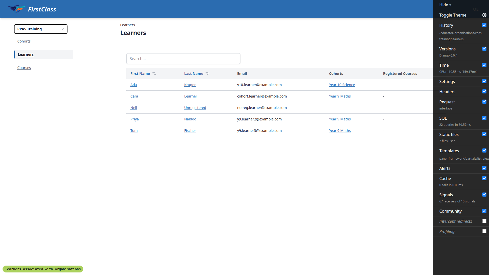

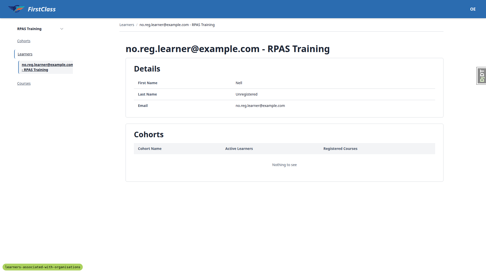

### 2. Cross-organisation isolation

| Test ID | Verdict | Notes |
|---|---|---|
| 2.1 | PASS | On the RPAS list, Cara Learner shows Cohorts "Year 9 Maths" only and Registered Courses `-`; her Northside individual registration does not leak in. |
| 2.2 | PASS | On the Northside list, Cara shows Cohorts `-` and Registered Courses "Functionality Demo - show end with Topic" — exactly inverted from the RPAS row. |
| 2.3 | PASS | Two rows, one person, no leakage in either direction; the structural scoping correctly replaces the deleted `Prefetch`es. |
| 2.4 | PASS | Northside list = Cara, Neo Dlamini, Nina Botha, Sol only. RPAS list = Ada, Cara, Nell, Priya, Tom only. No Southgate learner appears on either list. |
| 2.5 | PASS | Sam Singleton (RPAS-only) gets HTTP 404 on `/educator/organisations/northside/learners` and loads `/rpas-training/learners` fine. |

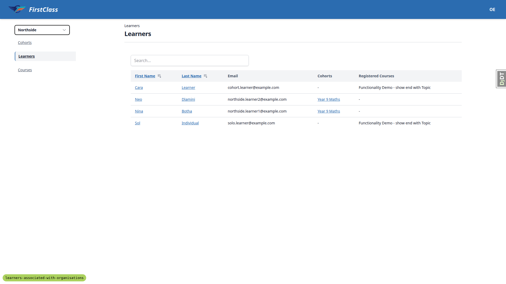

### 3. A cohort-only educator still sees only their cohort

| Test ID | Verdict | Notes |
|---|---|---|
| 3.1 | PASS | As Lena Legacy, the RPAS list shows exactly Cara Learner, Priya Naidoo, Tom Fischer — the Year 9 Maths members. |
| 3.2 | PASS | Nell Unregistered does not appear for Lena — the organisation-role gate survived the rewrite; the `has_perm` branch was not widened. |
| 3.3 | PASS | Ada Kruger (Year 10 Science) does not appear for Lena either. |

### 4. Links from other sections now point at Learners

| Test ID | Verdict | Notes |
|---|---|---|
| 4.1 | PASS | Clicking Cara Learner in the Year 9 Maths course progress table lands on `/educator/organisations/rpas-training/learners/df0fa425-…`, a learner detail page — not a 404, not `/users/`. |
| 4.2 | PASS | Names and progress percentages render for all three members. All show 0% because `qa_create_organisation_scenarios` seeds no progress for Year 9 Maths — confirmed as correct data via 4.2b. |
| 4.2b | PASS | The QA Progress Demo Cohort, which does have seeded progress, renders all nine learners with names, real 0–100% percentages, per-item ticks and dates — the membership→learner→user hop is intact. |
| 4.3 | PASS | On the solo course's Direct Registrations panel, Sol Individual's row has first name, last name, email, Active tick and Registered timestamp populated; clicking his name lands on `/northside/learners/eb2a5d1d-…`, matching his Learner pk. |
| 4.4 | PASS | Direct Registrations are ordered by first name: Cara then Sol. |
| 4.5 | PASS | The same course opened under `/rpas-training/` shows only Rita Removed in Direct Registrations — Sol's and Cara's Northside registrations are correctly absent; the panel is organisation-scoped. |

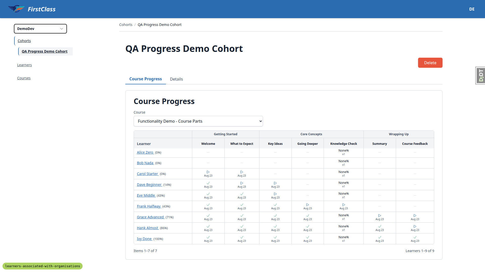

### 5. The Interested Learners panel is gone; the admin replaces it

| Test ID | Verdict | Notes |
|---|---|---|
| 5.1 | PASS | The Courses list retains the Interest column with a count. |
| 5.2 | PASS | A course's panels are exactly Details, Cohort Registrations, Direct Registrations — no "Interested Learners" panel. |
| 5.3 | PASS | `/educator/organisations/rpas-training/courses/<pk>/__panels/interest` returns HTTP 404. |
| 5.4 | PASS | The admin index has a Course interests entry; its changelist loads with a search box. |
| 5.5 | PASS | The express-interest write path works. The rendered CTA is suppressed on dev by `OVERRIDE_COURSE_VISIBILITY_TO_VISIBLE`, so the POST was issued directly and returned 200 with the CTA partial in the interested state. The row then appeared in admin Course interests, was findable by email search, and the Courses list Interest count for that course went from `-` to 1. |

### 6. Removal suspends access; records survive

| Test ID | Verdict | Notes |
|---|---|---|
| 6.1 | PASS | Rita's course registration row is Active (ticked); her Learner row's Active box is unticked. Records preserved, entitlement withdrawn — both visible at once. |
| 6.2 | PASS | As Rita, the dashboard's In Progress reads "You haven't signed up for any courses yet." The solo course is in neither current nor completed courses. |
| 6.3 | PASS | The solo course detail page loads and offers the self-registration CTA "Enrol for free", not a continue link. |
| 6.4 | PASS | Hitting the player directly redirects to the course detail page. Note: the plan's URL `/<slug>/home/` does not exist in this codebase (404s for everyone); the real player path is `/<slug>/<n>/`, and that is what redirects. |
| 6.5 | NOT OBSERVABLE (environment) | `config/settings_dev.py` sets `OVERRIDE_COURSE_VISIBILITY_TO_VISIBLE = True`, so both hidden QA courses appear in listings and 200 on their detail pages for everyone. The list and per-row gate do still agree (both show it), which is the divergence this step hunts for, and both code paths honour the same override early-return — but the plan's absolute hidden/404 expectation cannot be exercised with the override on. |
| 6.6 | PASS | With Rita `is_active=False`, the RPAS Learners list omits her for both Olive Educator (organisation-role branch) and Lena Legacy (per-cohort branch). |
| 6.7 | PASS | After reactivating Rita's Learner row, the solo course is back on her dashboard as REGISTERED with her progress unchanged, the player opens normally, and Olive's Learners list shows her again with her registered course. |
| 6.8 | PASS | Rita's RPAS Training learner was set back to `is_active=False`; DB confirms RPAS Training=false, DemoDev=true (the legitimate §7 default-org row). |

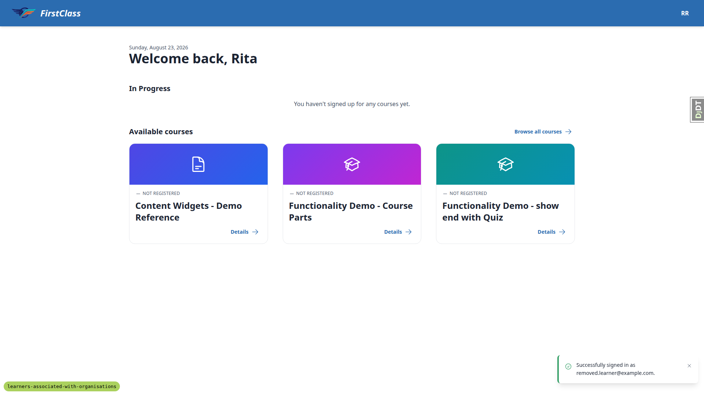

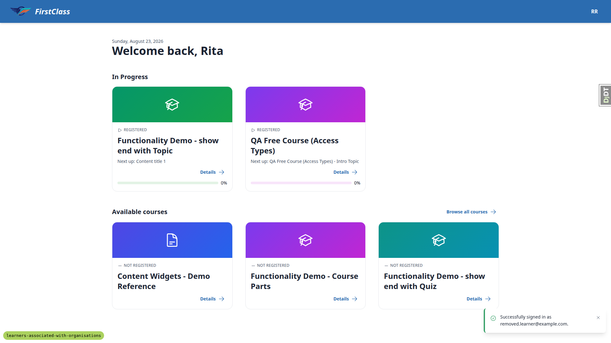

### 7. Self-registration round trip

| Test ID | Verdict | Notes |
|---|---|---|
| 7.2 | PASS | Rita clicked "Enrol for free" on QA Free Course (Access Types) and landed in the player; registration succeeded. |
| 7.4 | PASS | Rita now has exactly two Learner rows: DemoDev (`is_active=true`) and RPAS Training (`is_active=false`) — two rows, two organisations, both legitimate. |
| 7.5 | PASS | Her RPAS Training row is still inactive and her dashboard shows only QA Free Course (Access Types); re-entry on the default organisation did not un-remove her from RPAS. |
| 7.6 | PASS | Repeating the same registration returned straight to the player; the DB shows exactly one Learner row per organisation and one registration for the course, with only one `course.registered` webhook event emitted. |

### 8. The admin is the only curation surface

| Test ID | Verdict | Notes |
|---|---|---|
| 8.1 | PASS | Adding a Learner (Nell, Northside) via admin created a row whose `site_id` matches the organisation's `site_id`. |
| 8.2 | PASS | Re-adding the same user+organisation pair is rejected with a form validation error ("Learner with this User and Organisation already exists."), not an `IntegrityError` 500. |
| 8.3 | PASS | The Learner change form has no Delete button, the changelist has no bulk-action select, and the delete URL returns HTTP 403. |
| 8.4 | **FAIL** | The Year 9 Maths cohort's Learner dropdown offers learners from other organisations (DemoDev, and Northside on search). See bug **B1**. |
| 8.4b | **FAIL** | Selecting a cross-organisation learner and saving returns HTTP 500 instead of a validation error. See bug **B2**. |
| 8.5 | PASS | Dropdown options render readable text (e.g. "y9.learner3@example.com - RPAS Training"), never `Learner object (…)`. Note: the label is email + organisation rather than the person's name, but still unambiguous — treated as acceptable. |
| 8.6 | PASS | Searching the Learners changelist by email returns "1 result (142 total)" — the autocomplete search fields the three dependent admin screens rely on work. |
| 8.7 | PASS | The Learner course registrations list shows the person's name and course; the add/edit form has Learner, Collection, Is active, Timestamps and Deadlines only — no Organisation field. |
| 8.8 | PASS | The Learners list has no Add learner, no Remove, no row-level action menu, and `/learners/__actions/add` returns HTTP 404. |

### 9. Side effects and failure branches

| Test ID | Verdict | Notes |
|---|---|---|
| 9.1 | PASS | As Cara, deadline badges on the cohort course all read 22 Sep, matching her override — her deadlines neither vanished nor changed despite holding Learner rows in two organisations. |
| 9.2 | PASS | Adding a deadline override for a learner not in the cohort is rejected with "Learner is not a member of the cohort for this registration." — a validation error, not a save or a 500. |
| 9.3 | PASS | A generated cohort report for Year 9 Maths lists all three members in surname order with full names and per-learner detail — the `load_roster` user hop is intact. Note: report generation lives in `/admin/` rather than the educator interface, so this was run as admin rather than as Olive. |
| 9.4 | PASS | Adding a second registration for Cara through a different organisation did not change the solo course's Active Learners count (stayed at 4) — the count is per-person, not per-learner-row. The extra registration was removed afterwards. |
| 9.5 | PASS | The fresh `course.registered` webhook payload carries the integer `user_id` and `user_email`, not learner ids — unchanged by this cut. |
| 9.6 | PASS | Logged out entirely, the course listing and public course detail pages load for anonymous visitors. The "hidden course still 404s" half is not observable, for the same dev-override reason as 6.5 (verified separately via curl). |
| 9.7 | PASS | A full HTMX click-through of Cohorts → Learners → Courses (40 requests) produced zero requests to any `.../users/...` path and zero 404s. |
| 9.8 | PASS | Deleting RPAS Training in `/admin/` is refused with HTTP 403 — learners now protect the organisation on top of cohorts, via `on_delete=PROTECT` on both `Cohort.organisation` and `Learner.organisation`. |

### Responsive checks

| Test ID | Viewport | Verdict | Notes |
|---|---|---|---|
| 1.4-mobile | mobile | PASS | The Learners list body does not scroll horizontally; only the table's own `overflow-x-auto` container scrolls. All five columns reachable by swiping; name links remain tappable. |
| nav-mobile | mobile | PASS | The sidebar collapses to an "Open navigation panel" button that slides up a bottom drawer with the organisation switcher and the three sections, current section highlighted. |
| 4.2-mobile | mobile | PASS | The Cohort Course Progress table (the widest in the feature) scrolls inside its own container with no body overflow; names and percentages stay readable. |
| 1.6-mobile | mobile | PASS | The learner detail Details panel reflows to a two-column grid, the breadcrumb truncates with an ellipsis, and the empty Cohorts panel renders cleanly. |
| 1.4-tablet | tablet | PASS | All five Learners-list columns fit with no scrolling at all; headers wrap to two lines. Tablet gets the mobile-style collapsed nav rather than the desktop sidebar. |
| 4.3-tablet | tablet | PASS | The course detail panels stack full-width; the six-column Direct Registrations table fits without horizontal scroll; Northside scoping (Cara and Sol only) still correct. |
| nav-tablet | tablet | PASS | The tablet navigation drawer opens from the bottom with the organisation switcher, the three sections, and the current course nested under Courses; no crowding or overlap. |

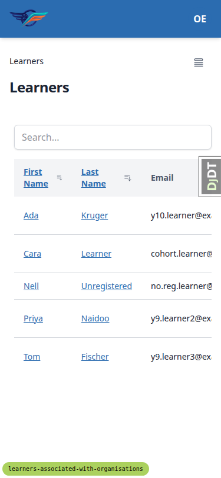

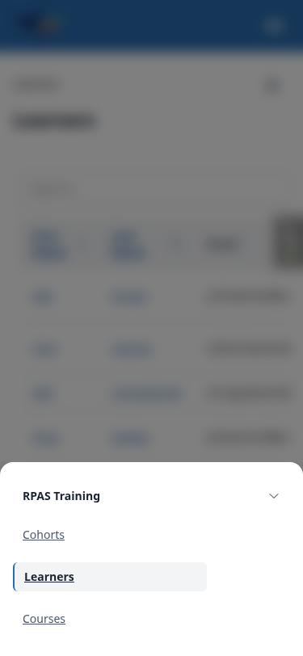

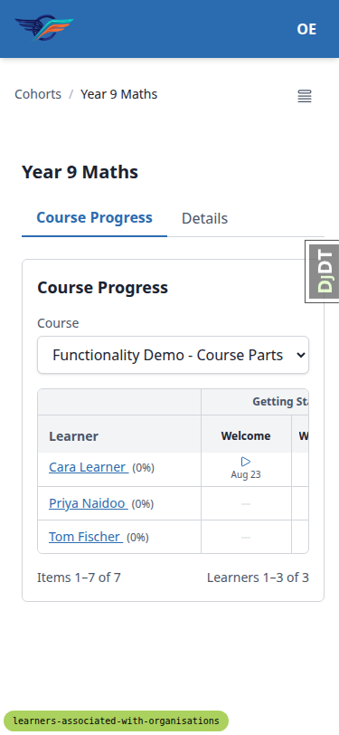

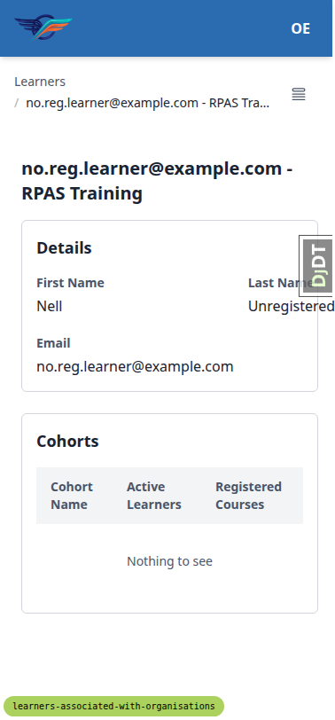

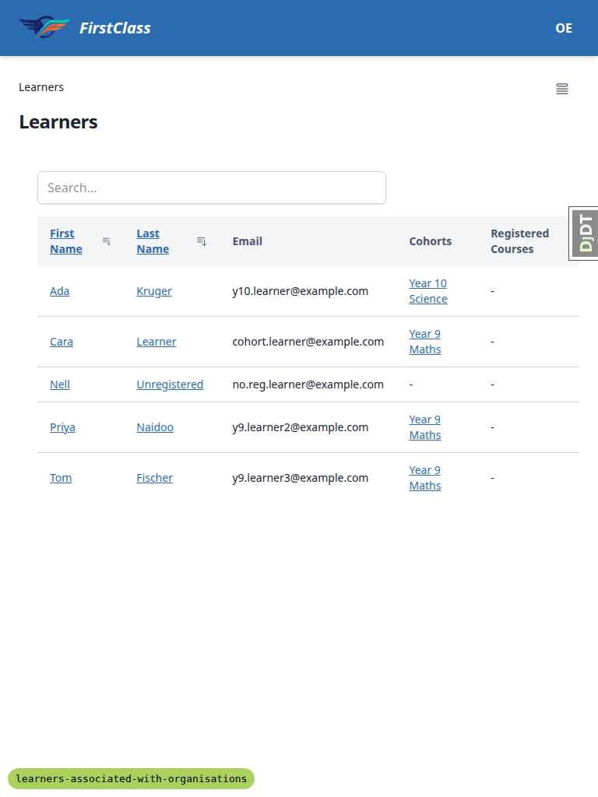

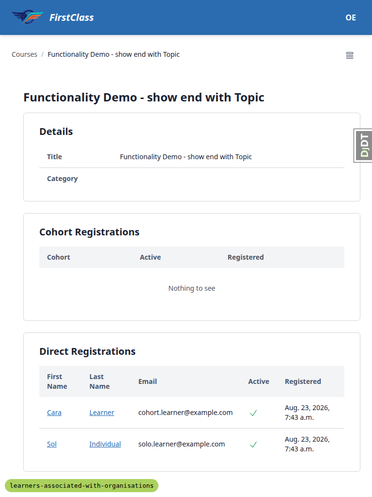

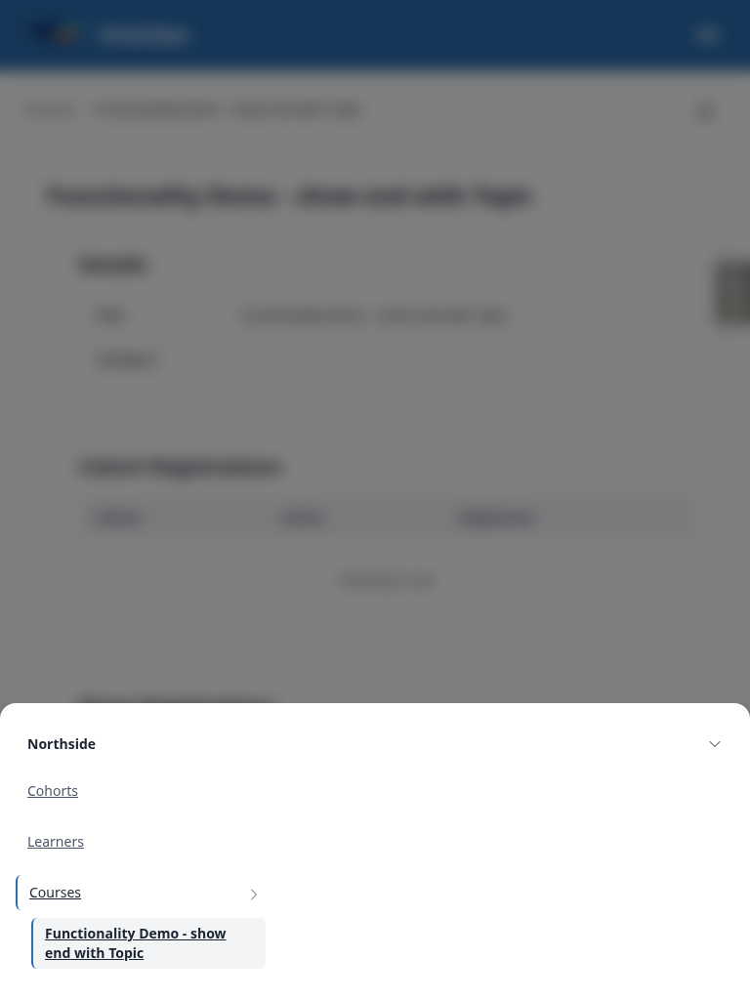

## Bugs

### B1: Cohort membership learner dropdown is not scoped to the cohort's organisation

**Manifestations:** 8.4 (desktop)

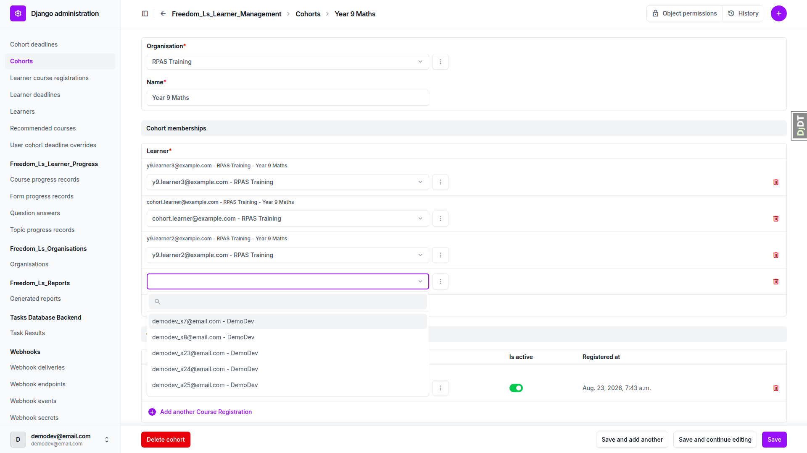

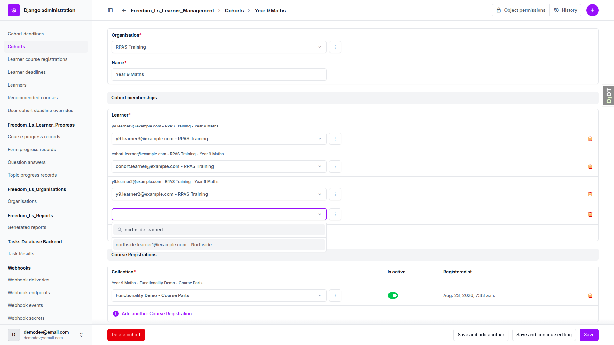

**Expected:** On the RPAS Training "Year 9 Maths" cohort in `/admin/`, the Cohort memberships
Learner dropdown offers only RPAS Training learners. Nina Botha and the other Northside learners
are not in the list.

**Actual:** The dropdown offers learners from every organisation on the site —
`demodev_s7@email.com - DemoDev`, `demodev_s8@email.com - DemoDev` and, on search,
`northside.learner1@example.com - Northside`. Root cause: `CohortMembershipInline.formfield_for_foreignkey`
(`freedom_ls/learner_management/admin.py:47-66`) does narrow the queryset to
`Learner.objects.filter(organisation__cohort__id=cohort_id)`, but the field is declared in
`autocomplete_fields`, so the rendered options are served by Django's `AutocompleteJsonView` from
the Learner ModelAdmin's own `get_search_results`, which never sees that queryset kwarg. The
narrowing is dead code for the widget.

### B2: Saving a cross-organisation cohort membership returns HTTP 500 instead of a validation error

**Manifestations:** 8.4b (desktop)

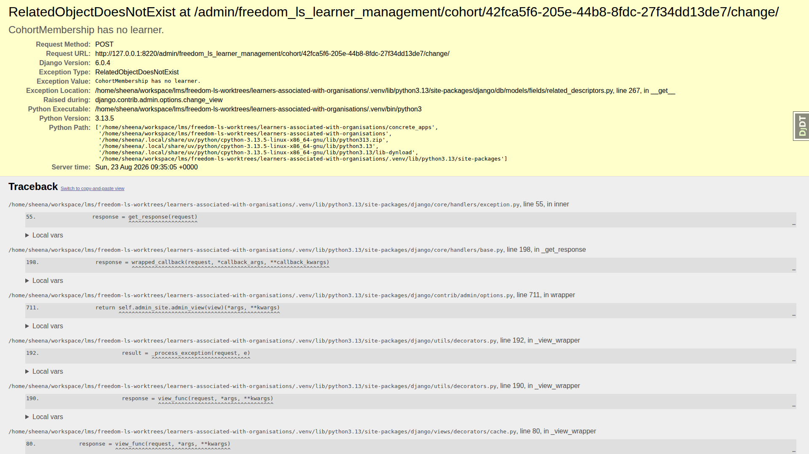

**Expected:** Selecting a learner from another organisation on a cohort and saving is rejected with
a form validation error, in the same way that a duplicate Learner is rejected with "Learner with
this User and Organisation already exists." (test 8.2).

**Actual:** The admin returns HTTP 500 `RelatedObjectDoesNotExist`, "CohortMembership has no
learner", raised at `freedom_ls/learner_management/models.py:81` in `CohortMembership.clean()` on
the line `if self.learner.organisation_id != self.cohort.organisation_id:`. When the learner field
itself fails form validation — which is exactly what happens for a cross-organisation choice,
because `formfield_for_foreignkey` narrowed the field's queryset — `cleaned_data` has no learner,
the instance's FK is unset, and `Model.full_clean()` still calls `clean()`, which dereferences
`self.learner` unguarded. No cross-organisation membership row is written (a SQL check for
`learner_org <> cohort_org` returns 0 rows), so this is a crash rather than data corruption.

## Bug status

- **UNRESOLVED** — B1: Cohort membership learner dropdown is not scoped to the cohort's organisation
  (reason: red lane — sits on the multi-tenant isolation boundary, and scoping an autocomplete
  endpoint is a design decision rather than a mechanical fix)
- **FIXED** (commit: `4049025d3ed72ed4647609a0d8c27707ab9c9a53`) — B2: Saving a cross-organisation
  cohort membership returns HTTP 500 instead of a validation error

**B2 fix and re-verification.** `CohortMembership.clean()` now wraps the `self.learner` /
`self.cohort` accesses in `try/except ObjectDoesNotExist` and returns early when either foreign key
is unset, so the field-level error surfaces instead of a crash; the same-organisation
`ValidationError` is unchanged when both relations resolve. Two tests were added to
`TestCohortMembershipClean` covering the unset-learner and unset-cohort cases, and the full suite
passes (2563 passed, 23 deselected).

Re-driven in the browser after the fix: repeating the exact steps that produced the 500 — selecting
`northside.learner1@example.com - Northside` on the RPAS Training "Year 9 Maths" cohort and saving —
now renders the change page with "Please correct the errors below." and a field-level error on the
offending row, "Select a valid choice. That choice is not one of the available choices." The three
existing memberships are untouched. Because the change is in shared model code, three adjacent
surfaces were spot-checked and all render correctly: an unmodified cohort save still reports "was
changed successfully", and the educator cohort Course Progress panel and Learners list both still
list their members with working `/learners/<uuid>` links.

Note that B1 remains open and is the reason a cross-organisation learner is offered in that dropdown
at all. B2's fix turns the resulting rejection into a proper validation error, but it does not make
the dropdown correct.

## General notes

**Not tested, and why:** Two plan assertions could not be observed on this dev server because
`config/settings_dev.py` sets `OVERRIDE_COURSE_VISIBILITY_TO_VISIBLE = True` (and
`OVERRIDE_COURSE_ACCESS_TO_FREE = True`). This override makes both hidden QA courses (and the
coming-soon course used in 5.5) visible/free to everyone, both authenticated and anonymous, so the
"hidden course 404s" half of tests 6.5 and 9.6 is not exercisable, and the rendered
express-interest CTA in 5.5 is suppressed (the write path was still verified directly via POST).
In all three cases the code paths that matter (`filter_visible`, `raise_404_if_hidden_unregistered`,
`override_visibility_to_visible()`) were confirmed to honour the same override consistently, so the
gap is environmental, not a sign of a regression.

**Test-plan/environment mismatches found (not product defects):**
- The plan's player URL `/<slug>/home/` does not exist in this codebase; the real path is
  `/<slug>/<n>/`, and that is the URL the redirect in test 6.4 actually targets.
- The plan says to generate a cohort report "as Olive Educator" (test 9.3), but report generation
  lives in `/admin/` only, so that test was run as admin instead.
- Test 4.2's progress assertion needed a cohort with seeded progress; Year 9 Maths has none
  (`qa_create_organisation_scenarios` doesn't seed it — that's `qa_create_cohort_progress`'s
  separate "QA Progress Demo Cohort"), so the 0% shown for Year 9 Maths in 4.2 is correct data, not
  a bug; 4.2b re-verifies the same rendering path against a cohort that does have progress.

**Tangential pre-existing issues, out of scope for this cut:**
1. The educator Courses list is site-scoped rather than organisation-scoped — the Northside and
   RPAS Courses pages are byte-identical, both listing DemoDev cohorts and the same Active Learners
   counts. `CourseDataTable.get_queryset` has never filtered by organisation; this diff only renamed
   `user_registrations` to `learner_registrations` there.
2. The cohort progress quiz cell renders "None%" for every learner on a quiz with no pass mark; the
   diff touched zero score-related lines.
3. Report-only CSP console errors for CDN scripts and a YouTube embed on the course player — dev
   environment noise, unrelated to this feature.

**Screenshot verification:** every screenshot basename referenced above was confirmed to exist in
`spec_dd/2. in progress/learners-associated-with-organisations/screenshots/` before embedding.
None were missing, so no embeds were dropped.

---

status: ok
reason: 2 bugs — 1 fixed (B2, commit 4049025d), 1 unresolved (B1, red lane); 62 tests run across desktop/mobile/tablet with 59 pass, 2 fail, 1 not observable; report rendered, screenshots verified
