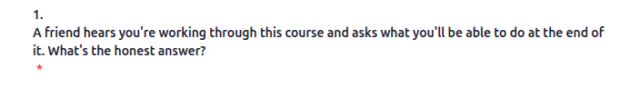

a few manual fixes to a few different files and functions. We'll do more interactive coding in this one instead of following SDD

-[ ] Email
    - [ ] subject: Site name
    - [ ] slow in prod
-[ ] Report bug: background color
-[ ] Admin polish
    -[ ] remove lots of content things
    -[ ] Organisation->Cohorts
    -[ ] Maybe ORganisation->Learners
-[ ] Widgets:
    -[ ] pretty flashcard
    -[ ] accordion
    -[ ] picture: show description even if the picture is not expanded
-[ ] Forms:
    -[ ] required * is on the next line . Also the number is one line up
    -[ ] form "Next" button is a different size to standard content next
