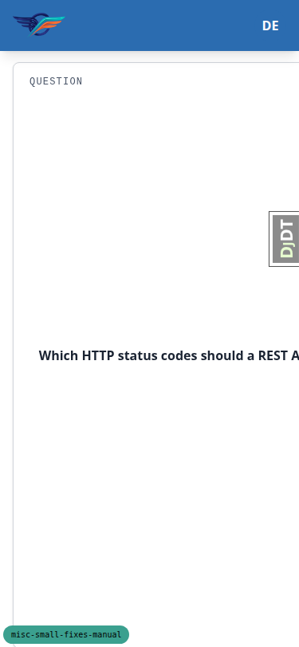
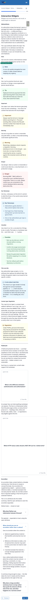

# Frontend QA report — styling-move re-run

This run is a targeted re-run of the styling-move sections of the plan: §5 (content widgets), §6
(course cards), §12.8 (mobile and tablet) and §14 (components whose CSS moved to their own
templates) — on both the `default` and `first_class` themes. The rest of the plan (§1–§4, §7–§11,
§13, §15) was covered by the earlier QA pass and was not re-run here.

## Methodology

Screenshots were collected into `screenshots/` beside this report; every image this report
references exists in that directory. The run drove the site through Playwright at three
viewports: 1920x1080 (desktop), 768x1024 (tablet) and 375x812 (mobile). To cover the second theme,
a second `runserver` was started with `FLS_THEME=first_class` and the Tailwind bundle was rebuilt
for it; the default-theme build was restored afterwards. Screenshot compression ran and found
nothing over the size threshold.

## Diff scoping

Scoping classed the change **FULL**, triggered by changed templates, stylesheets and JS (component
templates such as `accordion.html`, `flashcard.html`, `picture.html`, `course-card-shell.html`,
`player-footer.html` and `_base_interface.html`; the stylesheets `theme.css`, `tailwind.components.css`
and the two deleted stylesheets `tailwind.base_interface.css` and `tailwind.picture_spotlight.css`;
`alpine-components.js`; plus unrelated settings and admin changes and the new `freedom_ls/mail` app
picked up by the same diff). Nothing was skipped on scoping grounds — a FULL run covers desktop,
mobile and tablet, and all three ran.

## Smoke gate

Passed. Two pages were loaded before the full run began:

- `http://127.0.0.1:8435/` (dashboard, logged in)
- `http://127.0.0.1:8435/courses/content-widgets-demo-reference/4/` (widgets topic 4 — the primary changed page)

## B1 — A flashcard whose answer holds a table or code block overflows the viewport on mobile

**Manifestations:**
- 5.8a — mobile
- 5.8a (theme) — mobile

**Screenshots:**

**Expected:** At 375x812 every flashcard fits the 343px content column and the widgets topic 4 page
has no horizontal scrollbar, exactly as the first (prose-only) flashcard does.

**Actual:** The second flashcard — the one this branch adds for 5.8a — measures 586px and runs
227px off the right edge. The whole page gains a horizontal scrollbar (document scrollWidth 602 vs
clientWidth 375), the card's question text is cut off mid-sentence, and every other element on the
page is pushed into a 375px band with a wide empty strip beside it. Both faces are grid items with
the default `min-width:auto`, and the answer face's markdown table (528px) and fenced code block
(528px, `overflow-x` visible) set a min-content width the face will not shrink below. Reproduces
identically on the first_class theme (588px card, 604px document), so it is structural. The
pre-restyle `.flashcard-stack` had the same 1fr/1fr grid with no `min-width:0`, so this is a latent
defect newly exposed by the demo content this branch adds rather than a regression the restyle
introduced.

## B2 — The side-drawer panel's 24rem cap never applies — max-w-none outranks it

**Manifestations:**
- 14.4 — mobile

**Screenshots:** none captured (verified by devtools inspection, per the plan's own instruction for
this variant, which no shipped page reaches).

**Expected:** The side-drawer presentation is capped at 24rem (384px), per the
`.side-panel-dialog[data-variant="side-drawer"]` rule in `_base_interface.html`.

**Actual:** Computed `max-width` on the dialog is `none`. The `max-w-none` utility on the markup
sits in `@layer utilities` and beats the `max-width:24rem` declared in `@layer components`, so the
cap never applies and the drawer takes its full 80% width. At 375px that is 300px so nothing shows,
but at 768px the drawer measures 614px against the 384px cap. This is the same cascade-layer trap
the template's own comment documents for `max-height` — the max-height reset was deliberately moved
into the `<style>` block for exactly this reason, and max-width was left behind. No shipped page
uses the side-drawer variant (every consumer takes the bottom-sheet default), so there is no
user-facing impact today.

## Bug status

Neither bug was auto-fixed. Both failed the triage gate, for different reasons.

- **UNRESOLVED** — A flashcard whose answer holds a table or code block overflows the viewport on
  mobile (reason: a product/UX decision is required first — the fix is a choice between letting the
  table shrink and clip, giving the answer face its own horizontal scroll, or ruling that flashcard
  answers may not carry tables and code blocks and changing the demo content instead).
- **UNRESOLVED** — The side-drawer panel's 24rem cap never applies, because `max-w-none` outranks it
  (reason: not a user-facing regression — no shipped page uses the side-drawer variant — and the fix
  means removing `max-w-none` from `_base_interface.html`, the class that also clears the UA
  `max-width` on the docked desktop panel, which needs a browser to prove).

## Results

### §5 flashcard

| Test | Viewport | Status | Note |
| --- | --- | --- | --- |
| 5.1 | desktop | pass | Front corner label reads QUESTION, back reads ANSWER, both mono uppercase kicker style. |
| 5.2 | desktop | pass | Both faces carry a "Tap to flip" hint with retry icon, pinned bottom-right (`absolute bottom-3.5 right-5`). |
| 5.3 | desktop | pass | Answer face is a 135deg gradient mixed from primary at 6% and 13% into surface — distinct without fighting the prose. |
| 5.4 | desktop | pass | Every element on the answer face takes a face-owned colour: p/li/h4/code/pre → `--flashcard-fg` rgb(26,35,50); strong/a → `--flashcard-accent` rgb(43,108,176); hr/th/td borders → `--flashcard-border`; code/pre backgrounds fg at 8%. Nothing keeps a plain-surface colour. |
| 5.5 | desktop | pass | Front and back measure identically (card 1 250x672, card 2 696x672), padding 52px 28px, content flex-centred on both faces. |
| 5.6 | desktop | pass | Flips by click, Enter and Space; `aria-pressed` toggled false→true→false→true across three activations. |
| 5.7 | desktop | pass | Corner label and flip hint both `aria-hidden=true`; only accessible text is the button's `aria-label` plus sr-only span. Hidden face gets `inert`. |
| 5.8 | desktop | pass | Focus ring resolves to 2px white offset + 4px ring from `focus-visible:ring-focus-ring`. On default theme `--color-focus-ring` and `--color-primary` share #2B6CB0, so not visually distinguishable here — markup uses `ring-focus-ring`, which is what the check asks for. |
| 5.8a | desktop | pass | Second card's answer face carries heading, 5-row table, hr, inline code, fenced code block, bulleted list, link — all legible on the tint; table rules and hr take border colour from the face, not the page. |
| 5.8b | desktop | pass | `.flashcard-back` resolves `--flashcard-fg`, `--flashcard-accent`, `--flashcard-border`, `--flashcard-hint`. All four `--fls-flashcard-back-*` lookups return empty; no `--fls-flashcard-*` string appears in any style block. |
| 5.8c | desktop | pass | Perspective 1400px, `preserve-3d`, both faces `backface-visibility hidden`, 0.56s transition. Sampling every 70ms shows a smooth sweep, faces exactly 180deg apart at every sample, no flatten/ghost. Hidden face `inert`, unreachable by Tab. |
| 5.8a | mobile | **fail** | See bug B1. |
| 5.8a (theme) | mobile | **fail** | See bug B1 (reproduces identically on first_class). |

### §5 accordion

| Test | Viewport | Status | Note |
| --- | --- | --- | --- |
| 5.9 | desktop | pass | Closed summary colour rgb(26,35,50) = `--color-on-surface`, the normal text colour. |
| 5.10 | desktop | pass | Hover tints summary to rgb(243,244,246) = `--color-surface-2`; `
` has `overflow:hidden` + 8px radius, so the tint clips to the rounded corners. |
| 5.11 | desktop | pass | Open accordion: summary and chevron both rgb(43,108,176) = `--color-primary`, chevron rotated 180deg. |
| 5.12 | desktop | pass | Focused summary draws `box-shadow rgb(43,108,176) 0 0 0 2px inset` — visible and inset, so `overflow:hidden` cannot clip it. |
| 5.13 | desktop | pass | Summary padding 16px 20px, row height 56px — roomier than main's px-4 py-3. Body inner padding 0 20px 20px, byte-identical to pre-restyle commit 7c02eb66. |
| 5.14a | desktop | pass | Nested accordion authored in DOM: inner one stays closed, summary rgb(26,35,50), chevron grey rgb(74,85,104) unrotated, body track 20px — no open-state leak from the descendant selectors. |
| 5.14a-i | desktop | pass | Chevron's computed `transition-property` is `rotate, color` at 0.24s — names `rotate`, so the half-turn sweeps rather than snapping. |
| 5.14b | desktop | pass | `list-style-type: none`, no native marker in Chromium; `marker:hidden` and `::-webkit-details-marker` reset both present. Firefox/WebKit not available in this environment. |
| 5.14 | mobile | pass | At 375px the long summary wraps to five lines inside a 343px card; chevron stays pinned right at 20px, 20px from the summary edge. `flex-auto min-w-0` on title and `shrink-0` on chevron hold. |

### §5 picture

| Test | Viewport | Status | Note |
| --- | --- | --- | --- |
| 5.15 | desktop | pass | Description renders on the page, in its own paragraph below the caption row. |
| 5.16 | desktop | pass | Description sits outside the title/button flex row, runs full card width, doesn't stop short at the Expand button. |
| 5.17 | desktop | pass | "Figure 1" sits in its own gutter, mono, brand-coloured, no colon after it. |
| 5.18 | desktop | pass | Trigger button reads "Expand" on all ten pictures. |
| 5.19 | desktop | pass | With a deliberately long title, first line sits level with the Expand button, second line hangs indented, clear of the "Figure 1" gutter. |
| 5.20 | desktop | pass | Spotlight opens, shows heading top-left and description in a full-width bottom panel, closes on Escape and the close button. |
| 5.21 | desktop | pass | A picture with no description renders exactly one paragraph — no empty `
`, no stray gap. Both the caption and lightbox panel are guarded by ``. |
| 5.22 | desktop | pass | Unnumbered drone picture's lightbox heading reads "Figure:" above the title. |
| 5.22a | desktop | pass | Enter: opacity 0→1, scale 0.95→1 over ~200ms. Leave: dialog holds `display:flex` while fading, only flips to `display:none` after — `transition-discrete` correctly carries the leave animation. Closed dialogs compute `display:none`/0x0 box, so they swallow no clicks. |
| 5.22b | desktop | pass | Topic 2 renders ten pictures (plan says thirteen — stale count; ten `c-picture` widgets plus one `c-video`). Every lightbox image src matches its own thumbnail; no horizontal scrollbar (scrollWidth 1920 = clientWidth 1920). |
| 5.22c | desktop | pass | Dialog computes padding 0px, margin 0px — same effective value as before, where `p-0` in a later cascade layer had always beaten `.spotlight-dialog`'s declared 1.5rem. |
| 5.15-5.19 | mobile | pass | At 375px caption row holds: "Figure 1" gutter, title's first line level with Expand button (both y 460), later lines hanging indented, description running full 309px of the 341px card with symmetric 16px inset. No horizontal scroll. |
| 5.20-5.22 | mobile | pass | At 375px spotlight opens with heading bar wrapping to three lines clear of the close button (`pr-18` holds the gap), image card centred, description panel pinned full-width to the bottom edge. |

### §5 themes/motion

| Test | Viewport | Status | Note |
| --- | --- | --- | --- |
| 5.23 | desktop (theme) | pass | Flashcard and accordion re-checked on first_class (rebuilt with `FLS_THEME=first_class`, own runserver on 8164). Answer face resolves `--flashcard-fg` #1A1A2E, `--flashcard-accent` #283593, coherent indigo-tinted panel, all elements legible. Theme never set the removed `--fls-flashcard-back-*` tokens and gets a working face for free. Accordion: closed summaries rgb(26,26,46), open one rgb(40,53,147) with rotated chevron, padding unchanged at 16px 20px. |
| 5.24 | desktop | pass | Emulated `prefers-reduced-motion: reduce`. Every `motion-safe:` transition drops to 0s (flashcard faces, accordion chevron/body/summary). All three state changes still happen: flashcard flips, accordion opens (grid row 156px, chevron 180deg, summary primary), spotlight opens/closes (display flex→none). Spotlight keeps a 0.2s opacity/overlay/display transition under reduce, as `motion-reduce:transition-[opacity,overlay,display]` specifies; scale animation correctly dropped (stays 1). |
| 5.25 | desktop | skip | Before/after screenshot comparison not run — see General notes. |

### §5.26 style-block counts

| Test | Viewport | Status | Note |
| --- | --- | --- | --- |
| 5.26 (widgets topic 4) | desktop | pass | 3 project `<style>` blocks — the side panel's plus one per flashcard; the accordion ships none. Two extra blocks in the DOM are htmx's injected `.htmx-indicator` rule and the DEBUG branch badge, neither project component CSS. |
| 5.26 (topic 2) | desktop | pass | Widgets topic 2 (media, ten pictures): exactly 1 project `<style>` block, the side panel's. Picture widget ships no CSS. |
| 5.26 (/courses/) | desktop | pass | `/courses/` carries 0 project `<style>` blocks — no side panel on that shell. |

### §6 course cards

| Test | Viewport | Status | Note |
| --- | --- | --- | --- |
| 6.1 | desktop | pass | Eyebrow chip (checked logged out, anonymous not-registered) computes `display:inline-flex`, measures 40px for "Free" on both a /courses/ row (40 of 1192px) and a home-page grid card (40 of 379px). Does not stretch. |
| 6.2 | desktop | pass | Across rows of three cards with different title/description lengths, every Details link's bottom edge is identical per row (558, 912, 1666) and every card bottom is identical. On cards with no progress footer, Details row sits 17px above the card bottom (16px padding + 1px border) — flush, held by `mt-auto`. |
| 6.3 | mobile | pass | At 375x812 cards stack one per row at 343px, hero 112px, radius 16px, every Details link 45px above its card bottom (same flush offset as desktop). No horizontal scroll. |
| 6.3 | tablet | pass | At 768x1024 grid drops to two columns of 344px. Hero 112px, radius 16px, Details links aligned to the pixel per row (510, 837, 1191). No horizontal scroll. |

### §14.1 side panel

| Test | Viewport | Status | Note |
| --- | --- | --- | --- |
| 14.1 | desktop | pass | At 1920x1080: docked left column, sticky, top 72px, height calc(100vh - 72px) = 1008px, width 320px, grid '320px 1488px'. Body `overflow-y:auto` + `overscroll-behavior:contain`. |
| 14.2 | desktop | pass | Shell sets `data-desktop-lock=true` (no collapse control on desktop), toggle is `lg:hidden`. Exercised directly: closing dialog / `data-panel-open=false` takes grid from '320px 1488px' to a single '1856px' track — no 16rem gap left behind. |
| 14.5 | desktop | pass | Forced overflow at 1280x400: panel caps at 328px (100vh - 72px) with 353px of content; body scrolls internally, scrollTop reached its 25px maximum. Overflow reachable. |
| 14.3 | mobile | pass | Below 1024px, panel is a modal overlay, bottom-sheet default: `position fixed`, `inset auto 0 0 0`, max-height 690.2px = 85vh, rounded 16px top corners. Slides up: translateY 192→64→12→0, opacity 0.41→1 over ~200ms. |
| 14.4 | mobile | **fail** | See bug B2. |
| 14.5 | mobile | pass | TOC grown to 1405px of content; sheet caps at exactly 690px = 85vh, body scrolls internally the full way (scrollTop reached 715 = 1405 − 690). `flex 1 1 auto` and `min-height 0` on the body do the work. |
| 14.6 | mobile | pass | Closing slides the sheet back down the way it came: position stays fixed, translateY 72→229→284→312→325 (full height) while opacity fades to 0, only then `display:none`. Never jumps to the top first. |
| 14.7 | mobile | pass | With an oversized TOC, sheet's top sits at 122px and height is exactly 85vh — does not grow past the top of the screen. UA max-height reset lives in the components layer where the sheet's own cap can still override it. |
| 14.8 | mobile | pass | Scrim is the same dark blur as every other modal (`.modal-backdrop-host::backdrop`); sheet body carries its own `0 10px 25px rgb(0 0 0 / 0.25)` shadow. |
| 14.9 | desktop | pass | Covered by the reduced-motion pass (5.24): the panel's own open/close still works with the animation dropped. |
| 14.3-14.8 (theme) | mobile | pass | Repeated on first_class: bottom-sheet default, `position fixed`, max-height 690.2px = 85vh, 16px top radius, body white, no horizontal scroll — identical to default theme (panel styling is shell-owned, theme-independent apart from surface colour). |

### §14.2 buttons

| Test | Viewport | Status | Note |
| --- | --- | --- | --- |
| 14.10 | desktop | pass | Educator Create Cohort modal submitted for real: during the request `.htmx-request` present, both label spans `display:none`, both spinner spans `display:flex`; on completion class removed, label returns, cohort created. |
| 14.11 | desktop | pass | Spinner row computes `display:flex`, `align-items:center`, `gap:8px`, height 24px, icon centre within 2px of span centre. One line, vertically centred. |
| 14.12 | desktop | pass | Before any request only the label shows: label span `display:block`, spinner span `display:none`; open modal shows plain "Save" / "Save and add another" with no spinner. |
| 14.13 | desktop | pass | Spans carry `[.htmx-request_&]:hidden` and `[.htmx-request_&]:inline-flex`; compiled bundle holds the matching rules with partners `inline-flex`, `items-center`, `gap-2`. `&` survived the HTML attribute unescaped. |

### §14.3 cards

| Test | Viewport | Status | Note |
| --- | --- | --- | --- |
| 14.14 | desktop | pass | Grid cards measure border-radius 16px (1rem), hero band 112px (h-28 = 7rem), body padding 16px (1rem) — matching the values `--fls-card-radius`, `--fls-card-hero-height` and `--fls-card-padding` used to carry, verified numerically. |
| 14.15 | desktop | pass | Accent gradient fills the hero band edge to edge on every card, clipped to the rounded corners by `overflow-hidden` on the article. |
| 14.16 | desktop | pass | List rows on /courses/: body padding 16px; accent panel is self-stretch full height, flush to the card edge, clipped to the 16px radius. |
| 14.17 | desktop | pass | At rest `box-shadow: none`; on hover the card translates 0 -4px, gains `shadow-md`; title link's `before:absolute before:inset-0` makes the whole card one click target. Focusing draws `:focus-within` ring `0 0 0 2px #fff, 0 0 0 4px rgb(43,108,176)` around the whole card. |
| 14.18 | desktop | pass | In-progress cards show a progress bar tinted to the course accent (blue, magenta, teal, green); `.course-progress-N` still reads `--fls-course-accent-N-soft`/`-to`, deliberately kept. |
| 14.20 | desktop | pass | Course detail hero renders accent gradient `linear-gradient(135deg,#4F46E5,#2563EB)` plus spotlight glyph overlay, reading `--fls-course-accent-*` directly. Default theme sets no `--fls-course-accent-pattern`, resolves to `none` as documented. |
| 14.14 | tablet | pass | Card radius 16px and hero height 112px hold unchanged at 768px, as at 375px and 1920px — not breakpoint-gated. |
| 14.19 | desktop (theme) | pass | On first_class, `.course-card` computes background rgb(255,255,255) — the theme's `bg-white` re-opening still wins over the shared class. Theme also retunes radius to 12px (Tier-2 re-opening working as designed). |
| 14.20 | desktop (theme) | pass | On first_class, course detail hero renders all three layers: accent gradient, spotlight overlay glyph, and the theme's grid pattern from `--fls-course-accent-pattern` (two repeating-linear-gradients over the accent). |

### §14.4 shared stylesheet

| Test | Viewport | Status | Note |
| --- | --- | --- | --- |
| 14.21 | desktop | pass | All `.btn` rules still in the shared stylesheet and resolve in the compiled bundle (`.btn`, `.btn-primary`, `.btn-secondary`, `.btn-ghost`, `.btn-link`, `.btn-error`, `.btn-accent`, `.btn-success`, `.btn.btn-sm`). `git diff main..HEAD` on `tailwind.components.css` removes nothing from the `.btn` family. Primary/secondary/link/small buttons exercised live. |
| 14.22 | desktop | pass | `.chip` plus every variant (primary, secondary, success, warning, error, info, muted) and `.chip-xs` all still resolve from the shared stylesheet; eyebrow chip on a course card still sized to its own text (see 6.1). |
| 14.23 | desktop | pass | Header sticky with `shadow-md` at rest; scrolling sets `data-scrolled=true`, shadow deepens to `shadow-lg`, returns on scroll back. (First attempt on course detail showed no change only because that page is too short to scroll.) |
| 14.24 | desktop | pass | Both modal kinds get the dark blurred scrim from `.modal-backdrop-host::backdrop` — Alpine `c-modal` (educator Create Cohort) and native `<dialog>` (picture spotlight). |
| 14.25 | desktop | pass | Checklist admonitions render read-only checkboxes: `.task-list` `list-style:none`, `padding-left:0`; `.task-list-item` flex, `align-items:baseline`, 8px gap; every checkbox disabled. No bullet, aligned with text. |
| 14.26 | desktop | pass | Headings, prose, tables, code blocks, form inputs unchanged. `git diff main..HEAD` shows the whole `@layer base` block untouched — only removals are the component-private families meant to move (`.accordion*`, `.flashcard*`, `.course-card-hero`, `.course-card-body`, `.htmx-hide/show-on-request`), only addition is `.course-card`'s `rounded-2xl` absorbing the removed `--fls-card-radius`. |
| 14.23 | desktop (theme) | pass | On first_class, header drops the shadow entirely (all-transparent layers), carries a 1px rgb(226,232,240) bottom border instead — the documented theme re-opening. |
| 14.4 (theme) | desktop | pass | Classes first_class re-opens in its own `theme.css` — `.btn`, `.chip*`, `.surface`, `.course-card`, `.signup-panel`, `.alert-*`, `.header` — all still land: buttons/CTA take theme indigo, `.signup-panel` white, `.course-card` white with 12px radius, header takes the border treatment. |

### §14.5 terminal checks

| Test | Viewport | Status | Note |
| --- | --- | --- | --- |
| 14.27 | terminal | pass | `tailwind.picture_spotlight.css` and `tailwind.base_interface.css` both absent; `tailwind.input.css` imports exactly three project files (`theme.css`, `tailwind.components.css`, `tailwind.active_theme.css`) plus the tailwindcss package import. |
| 14.28 | terminal | pass | `grep -c` for the eleven removed selector families in `static/vendor/tailwind.output.css` returns 0 after a fresh `npm run tailwind_build`. |
| 14.29 | terminal | pass | `uv run pytest freedom_ls/base/tests/test_theme_tokens.py` — 16 passed. (Run also prints a project-wide coverage-gate failure, an artefact of running one file, not a test failure.) |
| 14.30 | terminal | pass | `upgrade_notes.md` exists, sets `requires_tailwind_rebuild: true`, names both deleted stylesheets plus all seven removed tokens in a table with their new homes. |

## General notes

- §5.22b's plan text says the media topic renders 13 pictures; it renders 10 (plus one `c-video`).
  The plan's count is stale; the checks themselves passed against the 10 that exist.
- §5.25's before/after screenshot comparison was not run: capturing the pre-restyle baseline needs
  a checkout of the commit before the restyle, and this branch has staged and unstaged work in the
  tree; the todo-list item for capturing the "before" screenshots had also been removed ahead of
  this run. A stronger substitute was run instead: every value 5.25 asks to look hardest at was
  verified numerically against the pre-restyle source rather than by eye — accordion summary
  padding 16px 20px and body padding 0 20px 20px byte-identical to commit 7c02eb66; flashcard face
  padding 52px 28px with both faces the same height; the picture caption's first line level with
  the Expand button; and the card radius 16px, hero height 112px and body padding 16px matching
  exactly what `--fls-card-radius`, `--fls-card-hero-height` and `--fls-card-padding` carried.
  `git diff main..HEAD` on `tailwind.components.css` confirms the only removals are the
  component-private families that were meant to move. This is the one plan item the run did not
  execute as written.
- The media topic logs one report-only CSP console error: a demo-content iframe embeds
  `https://www.google.com/`, which the `frame-src` directive does not allow. Pre-existing demo
  content, unrelated to the styling move.
- On the default theme `--color-focus-ring` and `--color-primary` hold the same value (#2B6CB0),
  so §5.8's token change is not visually distinguishable there; the markup does use
  `ring-focus-ring`, which is what the check asks for.
- The picture spotlight shows the title twice when a description is present — once in the heading
  bar and again above the description in the bottom panel. The component's own docstring says this
  is deliberate ("shown in the thumbnail figcaption and as the spotlight heading + bottom caption"),
  so it is a design decision to raise separately if unwanted, not a defect.
- A closed accordion keeps a 20px residual body track from its `pb-5` inner padding. Identical on a
  top-level and a nested accordion, and unchanged from the pre-restyle structure.
- Testing §14.10 created a cohort named "QA Loading State Check" in the dev database. Ordinary QA
  residue in disposable dev data.
- `upgrade_notes.md` still says nothing about the new `freedom_ls/mail` app and keeps
  `requires_settings_change: false` / `changed_settings: []`. That is §13.1a's expected failure,
  already recorded by the earlier QA pass; it was not re-tested here and is unrelated to the
  styling move.

---

status: ok
reason: 2 bugs — 0 fixed, 2 unresolved (both held back at the triage gate); report rendered, screenshots verified
