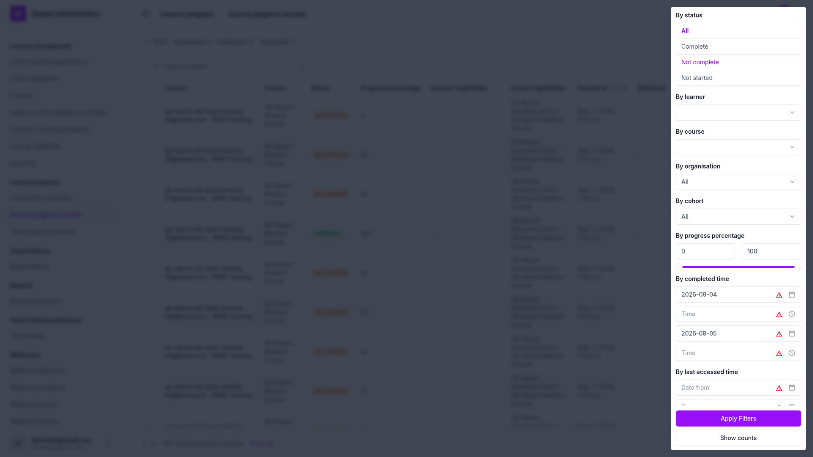

# Frontend QA report: miscellaneous small fixes

221 checks were recorded across the whole plan: 217 passed, 3 failed (all three are one bug), and 1
was not run. The three failures are all the same root cause in the new admin date-range filters
(bug B1, below). Both of the plan's own "expected failures" turned out to be stale: the fixes had
already landed by the time this pass ran, and both are recorded as passes with a note explaining
why.

## Methodology

Screenshots were collected into `screenshots/` beside this report: 88 PNGs. Most carry Playwright's
default timestamped names (`page-<timestamp>.png`, `element-<timestamp>.png`); the exceptions are
the report rasterisations, named `9.8-report-default-NN.png`, `9.12-report-greyscale-NN.png` and
`9.11-report-first-class-NN.png`. Where a check's own notes say "Capture named X in the plan", the
section below repeats that so §16's named captures can be matched back to the actual files (see the
§16 table).

## Diff scoping

The scoping record classes this diff **FULL**, triggered by the changed template and CSS paths
(`_base_interface.html`, the flashcard/accordion/picture cotton templates, `player-footer.html`,
`print.css`, `tailwind.components.css`, `tailwind.input.css`, plus `config/settings_dev.py`, the new
`freedom_ls/mail/*`, and admin modules in `organisations`, `learner_management` and
`learner_progress` — around 150 more files beyond the ones listed). Nothing was skipped. Because the
class is FULL, everything in the plan ran at **all three** viewports: desktop, mobile (375×812) and
tablet (768×1024).

## Smoke gate

Passed. Two pages were loaded before the pass started: `http://127.0.0.1:8100/` and
`http://127.0.0.1:8100/courses/content-widgets-demo-reference/4/`. No failure was recorded.

## Results by section

### §0 Setup

| Check | Status | Note |
| --- | --- | --- |
| 0.1 | pass | `npm run tailwind_build` completed (tailwindcss v4.1.16, 358ms) before any §5/§6/§14 check. |

### §1 Auth email names the tenant, not its domain

| Check | Status | Note |
| --- | --- | --- |
| 1.1 | pass | Subject prefix is `[FirstClass]` under both mail backends. |
| 1.2 | pass | Prefix and body agree: 8 occurrences of "FirstClass", 0 of "DemoDev". |
| 1.3 | pass | Logo and branding render; `get_current_site → get_cached_site` resolves the right Site. |
| 1.4 | pass | Reset URL unbroken; clicking it consumed the token and reached the set-password form. |
| 1.5 | pass | Identical URL in the plain-text part and both HTML occurrences. |
| 1.6 | pass | Blanking `HEADER_TITLE` falls back to `[DemoDev]` via `FORCE_SITE_NAME`, as designed. |

### §2 Mail, under either backend

All of §2.A was run and passed under **both** configurations — the queued backend (dev's shipped
default) and the direct SMTP backend — per the plan's requirement that it be reported per backend.

| Check | Status | Backend(s) | Note |
| --- | --- | --- | --- |
| 2.1 | pass | queued | `manage.py check` clean, no `freedom_ls_mail.E001`. |
| 2.2 | pass | both | Response prompt, mail lands in Mailpit. |
| 2.3 | pass | both | `Content-Transfer-Encoding: 8bit` on both parts of allauth mail, no soft breaks, survives the round trip. |
| 2.4 | pass | both | Reset URL unbroken in both parts, works end to end. |
| 2.5 | pass | queued | Non-ASCII subject/body (Latin diacritics, Cyrillic, Japanese) arrives correctly, no mojibake. |
| 2.6 | pass | queued | HTML alternative and a binary PNG attachment both survive; attachment decodes with PIL. |
| 2.7 | pass | both | Established by the byte comparison in 2.10. |
| 2.8 | pass | direct | Every §2.A check passes. |
| 2.9 | pass | queued | Every §2.A check passes. |
| 2.10 | pass | both | **Swappability gate.** See callout below. |
| 2.11 | pass | both | Swap is one settings line each way; no migration, rebuild or data change. |
| 2.12 | pass | both | `manage.py check` clean in both configurations. |
| 2.13 | pass | queue-only | Task row reached SUCCEEDED, priority 10 (ahead of report/webhook tasks). |
| 2.14 | pass | queue-only | Task path is `freedom_ls.mail.tasks._send_email_task`; zero stale rows naming the old `deployment.mail` path. |
| 2.15 | pass | queue-only | Pointing `EMAIL_UPSTREAM_BACKEND` at the queue itself raises `freedom_ls_mail.E001`, naming the right setting. |
| 2.16 | pass | queue-only | **The worker-silence gate.** See callout below. |
| 2.17 | pass | queue-only | `security-and-data-handling.md` documents the queued-row trade-off. |
| 2.18 | pass | direct-only | The same self-referential `EMAIL_UPSTREAM_BACKEND` raises nothing under direct send — no false alarm. |
| 2.19 | pass | direct-only | A password reset creates no `_send_email_task` row; the queue is genuinely out of the path. |
| 2.20 | pass | direct-only | Mail still arrives with no worker running — the mirror of 2.16. |

**The swappability gate (2.10) passed byte-for-byte.** The two raw Mailpit sources are both 3,915
bytes and differ **only** in the per-message parts: the Received timestamp, the MIME boundary
string, Date, Message-ID, and the reset token inside the URL. Subject (with its `[FirstClass]`
prefix), From, To, both `Content-Type` headers, both `Content-Transfer-Encoding: 8bit` headers, and
the entire plain-text and HTML bodies (logo, every style attribute) are byte-identical. A learner
cannot tell which backend sent the mail.

**2.16 is the most important check in the section, and it holds.** With the production task
backend configured and no worker running, a password reset completes normally in the browser, no
mail reaches Mailpit, and an unpicked task row sits in the database — the silent failure the check
exists to catch. Starting `fls_run_worker` delivers the mail intact (8bit, unbroken URL), after a
full serialise/database/worker round trip.

### §3 The form player gets the standard navigation footer

| Check | Status | Note |
| --- | --- | --- |
| 3.1 | pass | Form start page: Previous left, forward right. |
| 3.2 | pass | Footers match the topic footer exactly (shared class string); the 2px height difference is the `.btn-secondary` border, present on any topic page too. |
| 3.3 | pass | Previous navigates to the preceding topic. |
| 3.4 | pass | Previous is secondary + left chevron; forward is primary + right chevron/state icon. |
| 3.5 | pass | Runner-page Previous/Next are the same smaller size and match each other. |
| 3.6 | pass | Submit-confirm dialog opens correctly when required questions are answered, declines when they are not. |
| 3.7-continue / -tryagain / -next / -finish | pass | All five forward states (Start, Continue, Try again, Next, Finish course) render the right label and icon. |
| 3.8 | pass | Navigation is HTMX-boosted, proven by a JS marker surviving Next/Previous and the OOB TOC swap landing. |
| 3.9 | pass | QA Form First Course: no Previous button at all, forward button stays flush right. |
| 3.9-start-state | pass | After clearing a leftover attempt, forward reads "Start Form"; footer height matches the topic footer's (49px both). |
| 3.10 | pass | **Stale expected failure, now fixed** — see callout below. |
| 3.10-index1 | pass | QA Form First Course's completion page: no Previous, forward offers "Continue" to the next item (quiz is not the last item). |

**Both of the plan's expected failures are stale and now pass.** §3.10 — the form completion page —
now carries the shared player footer: same class string plus `mt-8`, same border and padding, same
`hx-boost`/`hx-select-oob` attributes. Previous correctly links to the preceding **course item**, not
back into the form, and the forward slot shows "Retry quiz" as the failed attempt dictates. `todo.md`
§9 records the fix.

### §4 A required question's asterisk stays on the question's last line

| Check | Status | Note |
| --- | --- | --- |
| 4.1 | pass | `*` glued to the last word by a non-breaking space, same line. |
| 4.2 | pass | Question number floats left, same line as the text. |
| 4.3 | pass | At 375px, asterisks never land alone on a wrapped line (checked across three questions wrapping 5, 8 and 8 lines). |
| 4.4 | pass | Bold, italic, inline code and links inside a question all render. |
| 4.5 | pass | `*` is `aria-hidden`; sr-only "(required)" still present. |
| 4.6 | pass | A non-required question shows no asterisk. |
| 4.7 | pass | A two-paragraph question renders as two `
` elements; asterisk sits on the last word of the second paragraph. |

### §5 Content widgets

All flashcard, accordion and picture checks passed, on both themes and with reduced motion.

**Flashcard:** 5.1–5.8g all pass — Question/Answer corner labels, the "Tap to flip" hint, the
brand-tinted answer face and its legibility across headings/tables/hr/code/lists/links (5.8a), equal
face heights and vertical centring, click/keyboard flip with `aria-pressed`, `aria-hidden` on
decorative elements, the theme-coloured focus ring, the four `--flashcard-*` custom properties
replacing the retired `--fls-flashcard-*` tokens (5.8b), the 3-D flip geometry (5.8c), the wide-card
variant (5.8d), mobile safety (5.8e — **B1's original repro does not reproduce on flashcards**: no
horizontal scroll at 375px, tables and code blocks scroll internally instead), the focus ring
surviving the layer swap (5.8f), and click routing to the trigger vs. the table/code (5.8g).

**Accordion:** 5.9–5.14b all pass — closed/hover/open colouring, the inset focus ring, the roomier
summary row, the long-summary wrap at both desktop and 375px (5.14, 5.14-mobile), nested open-state
isolation (5.14a, verified by inspection), the chevron animating `rotate` rather than snapping
(5.14a-i), and no native disclosure marker in any engine (5.14b).

**Picture:** 5.15–5.22c all pass — the description now rendering on the page under the caption,
full caption width, the "Figure N" gutter with no colon, the "Expand" label, long-title wrapping
level with the button, the lightbox opening/closing both paths, no stray paragraph when a
description is absent, the "Figure:" fallback heading, the open/close fade-and-scale animation and
a closed dialog swallowing no clicks (5.22a), 5.22b (**10 pictures, not 13 — see plan-accuracy
note below**, each with its own dialog, no scrollbar or layout shift), and the spotlight's effective
zero padding being preserved rather than its dead declared value (5.22c). 14.24 confirms the
spotlight's dark blurred backdrop.

**5.26** passed exactly against the plan's table: 1 `<style>` block on topic 2 (media), 3 on topic 4
(interactive-widgets), 0 on `/courses/` — once the DEBUG branch-badge block and htmx's own injected
`.htmx-indicator` block are excluded (see plan-accuracy note below).

**Cross-theme and motion:** 5.23 (first_class theme — the flashcard's four custom properties resolve
correctly even though that theme never set the retired tokens) and 5.24 (reduced motion — all three
widgets still change state, only the animation is dropped, confirmed structurally across 19
`motion-safe:` blocks with zero state-bearing selectors inside them) both pass.

**5.25 — the primary visual-inertness gate — passed**, but by a different method than the plan
describes: see General notes.

### §6 Course cards

| Check | Status | Note |
| --- | --- | --- |
| 6.1 | pass | Eyebrow chip sized to its own text; no chip class stretches. |
| 6.1-chip | pass | The real `<c-chip>` element also confirmed shrink-wrapped (40px in a 40px wrapper). |
| 6.2 | pass | Details links align at a consistent, card-bottom-flush height across a row. |
| 6.3 | pass (tablet) | Two cards per row at 768px, Details links still aligned per row. |
| 6.3-mobile | pass | One card per row at 375px; radius/hero-height/padding all unchanged. |

### §7 An organisation's cohorts and learners

| Check | Status | Note |
| --- | --- | --- |
| 7.1 | pass | Cohorts tab: ordered by name, count and change link per row. |
| 7.2 | pass | 46 cohort rows over 3 pages, no repeat or skip. |
| 7.3 | pass | Learners tab is genuinely read-only: 0 editable inputs/selects/textareas/delete checkboxes. |
| 7.4 | pass | 214 learner rows over 9 pages, every one unique, boundaries contiguous. |
| 7.5 | pass | Related row's N matches the Learners tab count exactly. |
| 7.6 | pass | Zero learners: "No learners yet" as plain text, no broken link. |
| 7.7 | pass | Exactly one learner: singular wording. |
| 7.8 | pass | Adding a cohort from the tab works. |
| 7.9 | pass | Add organisation: no tabs/Related row/inline; the save still succeeds (11→12 rows). |
| 7.10 | pass | Large organisation (46 cohorts, 214 learners) loads in 431ms median vs. 112ms for an empty one — comparable, no stall. |

### §8 Withdrawn

| Check | Status | Note |
| --- | --- | --- |
| 8 | pass | Activity change page fieldset runs Title/Subtitle/Description/Slug/Content/Metadata with no Content Preview — the removal landed. |

### §9 The cohort report prints on white paper

| Check | Status | Note |
| --- | --- | --- |
| 9.1 | pass | White dominant colour on all 18 pages, 72.4%–98.7% coverage. |
| 9.2 | pass | Every listed fill (headers, banding, chips, cover card, at-a-glance cells, flags, ratio-bar tracks) reads as the one grey. |
| 9.3 | pass | Status tints (pass/fail) win over the even-row banding where they overlap. |
| 9.4 | pass | Cover names "FirstClass"; RPAS Training's logo renders; PDF Creator metadata also "FirstClass". |
| 9.5 | pass | Cover band bleeds to left, right and bottom edges, no clipping. |
| 9.6 | pass | Greyscale: a 0% bar and a partial bar both stay visible on a banded row, via the outlined track. |
| 9.7 | pass | Regenerated under `first_class`; sheet stays white. |
| 9.8 | pass | 18 pages captured as `9.8-report-default-01..18.png`, matching `pdfinfo`. |
| 9.9 | pass | Cover picture confirms 9.4/9.5. |
| 9.10 | pass | Pixel-measured: `#ffffff` dominant and only `#f2f2f2` above 1% on every page. |
| 9.11 | pass | **The real gate — passed exactly.** See callout below. |
| 9.12 | pass | Greyscale summary kept (`9.12-report-greyscale-*.png`), 0% and partial bars both visible. |
| 9.13 | pass | All 54 report images present (18 default + 18 greyscale + 18 first_class). |

**§9.11 is the real gate and it passed exactly.** The `first_class` report's paper and fill
coverage matches the default theme's page for page, to two decimal places, across all 18 pages —
identical `#ffffff` and `#f2f2f2` percentages. Only the brand colours differ (indigo cover band,
orange accent rule); `first_class`'s own surface tokens (`#F8F9FC`, `#EDF2F7`) never appear at 1% or
more.

### §10 Dev shows every course as visible and free

| Check | Status | Note |
| --- | --- | --- |
| 10.1 | pass | A `coming_soon` course opens in the player rather than redirecting. |
| 10.2 | pass | A non-free access type opens with no registration step. |
| 10.3 | pass | Every course anonymously wears the "Free" chip; no "Coming soon"/"By application" wording anywhere. |
| 10.3b | pass | Reverting the two settings restores the real badges; the database is unaffected throughout. |
| 10.4 | pass | Both overrides are dev-only, default `False`, and a `W001` deploy check fires if either is on with `DEBUG=False`. |

### §11 Deployment guards and the bootstrap command

| Check | Status | Note |
| --- | --- | --- |
| 11.1 | pass | Missing `--site-name` fails with a usage error, no Site created. |
| 11.2 | pass | `--site-name` creates the Site under that exact name. |
| 11.3 | pass | `.env.example` correctly documents direct-send-by-default / queue-as-opt-in, the worker requirement, and `EMAIL_UPSTREAM_BACKEND`. |
| 11.4 | **skip / not run** | See General notes — blocked by the project's own security-guard hook. |
| 11.5 | pass | Production resolves `EMAIL_BACKEND` to the SMTP backend with no environment variable set. |
| 11.6 | pass | Setting the env var opts into the queue with no settings-module edit. |
| 11.7 | pass | `EMAIL_TIMEOUT` defaults to 10, now read from `freedom_ls.mail.settings_defaults`. |

### §12 Regressions elsewhere

| Check | Status | Note |
| --- | --- | --- |
| 12.1 | pass | With no `FORCE_SITE_NAME`/`SITE_ID` and no request, allauth mail raises a purpose-built `SiteResolutionError` naming the fix, not a bare `ImproperlyConfigured`. |
| 12.2 | pass | Site header reads "FirstClass". |
| 12.3-partial | pass | Logout/login cycle and a followed reset link both work. |
| 12.4 | pass | The other demo courses play end to end; the topic footer's class string is unchanged. |
| 12.5 | pass | Other widgets (admonitions, tables, code blocks, image grids) are unaffected by the new component CSS. |
| 12.6 | pass | Educator interface loads; no import cycle from the admin module-scope import. |
| 12.7 | pass | Admin index and every touched changelist return 200. |
| 12.8-form-footer-mobile | pass | Mobile runner buttons remain full-width and comfortable at the new `btn-sm` size. |

### §13 What changed that nobody asked for

This whole section is a read-only audit. Every item below is a **note or a human decision, not a
bug to fix** — see the callout after the table.

| Check | Status | Note |
| --- | --- | --- |
| 13.1a | pass | **Stale expected failure, now fixed.** `upgrade_notes.md` now names `freedom_ls/mail`, `INSTALLED_APPS`, `EMAIL_BACKEND`, `EMAIL_UPSTREAM_BACKEND` and `EMAIL_TIMEOUT`; every code move landed cleanly with no stale imports. |
| 13.1b | pass | `upgrade_notes.md` also covers the `SILENCED_SYSTEM_CHECKS` rewrite from `freedom_ls_deployment.E007` to `freedom_ls_mail.E001` — the plan expected this gap too, but it is the same fix as 13.1a, not a second one. |
| 13.1c | pass | The three dotted edges the regenerated `docs/app_structure.md` surfaced are pre-existing runtime coupling, not new. |
| 13.2 | pass | Coupling recorded, not fixed — see General notes. |
| 13.2a | pass | Dead `1.5rem` declaration recorded, not fixed — see General notes. |
| 13.3 | pass | **Plan is out of date, in the branch's favour** — see callout below. |
| 13.4 | pass | The `previous_url`-before-chrome-spread ordering hazard is confirmed, and harmless today — see General notes. |
| 13.6 | pass | All named collateral (docs, `.secrets.baseline`, agent-memory, `demo_content`, `EMAIL_TIMEOUT` placement, the `retry-sent-emails` spec) confirmed intended. |

**§13.3 is out of date in the branch's favour.** The plan expects `OrganisationAdmin.inlines` to be
*assigned*, overwriting a second app's contribution. The code actually spreads the existing list —
`OrganisationAdmin.inlines = [*OrganisationAdmin.inlines, OrganisationCohortInline,
OrganisationLearnerInline]` — above a comment reading "Both seams add rather than replace." The
inlines seam appends; it does not overwrite.

**All §13 findings are notes and human decisions, not bugs to fix, and do not belong in a fix
loop.**

### §14 Components whose CSS moved, and whose look must not

All pass, on both themes.

**The side panel:** 14.1 (desktop docked, sticky, own inner scroll), 14.2 (collapse drops to a
single full-width column, no leftover gap), 14.3 (mobile bottom sheet, capped at 85vh, rounded top
corners), 14.4 (side-drawer variant capped correctly at 24rem, checked by inspection since no
shipped page uses it — the previously reported 720px defect does not reproduce), 14.5 (overflow
scrolls inside the panel, page stays put), 14.6 (close transition keeps position through the slide),
14.7 (the sheet never exceeds the top of the screen at either binding width), 14.8 (scrim matches
every other modal's dark blur).

**Loading buttons:** 14.10–14.13 all pass — the spinner replaces the label correctly during a
request and reverts afterwards, the spinner row lays out correctly, only the label shows at rest,
and the unescaped `&` in the descendant-variant class names resolves to real, functioning rules.

**Course cards and rows:** 14.14–14.18, 14.20 all pass — radius/hero-height/padding match the
retired tokens' values, the accent gradient still fills and clips correctly, list-row layout is
unchanged, hover lift/shadow/focus-within ring are unchanged (checked against the pre-restyle class
string), the in-progress progress bar is still accent-tinted, and the course detail hero still reads
`--fls-course-accent-*` directly as intended.

**Shared stylesheet boundary:** 14.21–14.26 all pass — every button variant, chip size/variant
(including 18 real chips in the educator panel, §14.22), the site header's scroll shadow, both
modal kinds' scrim, checklist admonitions, and the whole `@layer base` block are all unchanged.

**Terminal checks:** 14.27 (both deleted stylesheets absent, `tailwind.input.css` imports exactly
three files), 14.28 (grep for eleven retired class/token names returns 0), 14.29
(`test_theme_tokens.py`: 16 passed — the reported coverage-gate failure is an artifact of running
one file in isolation, not a test failure), 14.30 (`upgrade_notes.md` documents the rebuild flag,
both deleted stylesheets and all seven removed tokens) all pass.

### §15 A learner's progress on their admin page

| Check | Status | Note |
| --- | --- | --- |
| 15.1 | pass | Cohorts tab lists only this learner's cohort. |
| 15.2 | pass | Course Registrations empty / Course Progress populated — the intended split for cohort-granted access. |
| 15.3 | pass | Course Progress tab, one row per course; dashes are the fixture artifact the section preamble documents. |
| 15.4 | pass | All three tabs fully read-only. |
| 15.5 | pass | Counts and change links correct on every tab. |
| 15.6 | pass | Related row's counts match the linked changelist's result counts exactly (5, 2). |
| 15.7 | pass | A learner with a progress row but no activity: Related reads "No progress recorded yet", no broken link. |
| 15.8 | pass | Singular wording at N=1. |
| 15.9 | pass | No repeat/skip across tab pages (via the organisation page's exhaustive paging). |
| 15.10 | pass | Add learner: no tabs/Related/inline; save still works. |
| 15.11 | pass | Changelist loads in 289ms median with user and organisation both prefetched. |
| 15.12 | pass | Topics tab shows real player-driven timestamps. |
| 15.13 | pass | Form attempts tab: Result "83% passed" on both rows. |
| 15.14 | pass | Both tabs read-only, counted, linked. |
| 15.15 | pass | Status matches `started_at`/`completed_time`, per the section preamble. |
| 15.16 | pass | Completion filter narrows correctly on all three lists. |
| 15.17 | pass | Learner/course/topic/form filters are autocomplete, not full dropdowns. |
| 15.18 | pass | Organisation/cohort dropdowns narrow correctly (160→151). |
| 15.19 | **FAIL** | Date-only range filter silently ignored — bug B1. |
| 15.20 | pass | Combined filters intersect correctly; clearing one restores the rest. |
| 15.21 | pass | Topic-progress date drill-down narrows correctly (113+605=718). |
| 15.22 | pass | Three-way Status filter's predicates are correct; the Complete/Not-started overlap is a documented fixture artifact, not a defect — see General notes. |
| 15.23 | pass | Percentage slider narrows correctly (160→47). |
| 15.24 | **FAIL** | "Last accessed" date-only range silently ignored — bug B1. |
| 15.25 | pass | Result column correct; blank for unscored attempts, per the section preamble. |
| 15.26 | pass | "In course" column names the course; a standalone attempt shows the empty-value dash. |
| 15.27 | **FAIL** | Form progress date ranges silently ignored — bug B1. |
| 15.28 | pass | Form progress list renders without stalling; user, form and course all prefetched. |
| 15.29 | pass | Every page in this section themed correctly, no unstyled fallback. |
| 15.30 | pass | Search finds a learner by email. |
| 15.31 | pass | Change forms save; `completed_time` stays non-editable. |

### §16 The admin changes, in pictures

All 17 checks pass; every named capture exists.

| Check | Capture | File | Note |
| --- | --- | --- | --- |
| 16.1 | `16.1-organisation-general-related` | `page-2026-09-07T13-32-01-192Z.png` | General tab, Related row, N matches tab counts. |
| 16.2 | `16.2-organisation-cohorts-tab` | `page-2026-09-07T13-32-33-710Z.png` | Cohorts tab, ordered, paginator, "Add another Cohort". |
| 16.3 | `16.3-organisation-learners-tab` | `page-2026-09-07T13-34-10-926Z.png` | Learners tab, ordered by email, no editable/delete/add controls visible. |
| 16.4 | `16.4-organisation-add-page` | `page-2026-09-07T13-35-10-756Z.png` | Add organisation: no tabs, no Related, no inline. |
| 16.5 | `16.5-learner-general-related` | `page-2026-09-07T13-36-46-789Z.png` | Learner General tab, Related row, three tab counts. |
| 16.6 | `16.6-learner-course-progress-tab` | `page-2026-09-07T13-37-02-234Z.png` | Course Progress tab, read-only. |
| 16.7 | `16.7-course-progress-topics-tab` | `page-2026-09-07T13-38-31-267Z.png` | Topics tab from a player-driven record. |
| 16.8 | `16.8-course-progress-form-attempts-tab` | `page-2026-09-07T13-38-37-604Z.png` | Form attempts tab, Result "83% passed" on both rows. |
| 16.10 | `16.10-courseprogress-changelist-filters` | `page-2026-09-07T13-42-10-053Z.png` | Drawer open: status/autocompletes/dropdowns/slider/date ranges/Apply. |
| 16.11 | `16.11-topicprogress-changelist-filters` | `page-2026-09-07T13-42-10-053Z.png` | Drawer open with the date drill-down above the list. |
| 16.12 | `16.12-courseformattempt-changelist-filters` | `page-2026-09-07T13-45-28-737Z.png` | Drawer open, Result column visible. |
| 16.13 | `16.13-formprogress-changelist-filters` | `page-2026-09-07T13-45-38-817Z.png` | Drawer open, both date ranges. |
| 16.14 | `16.14-formprogress-in-course-column` | `page-2026-09-07T13-44-40-176Z.png` | In course column populated. |
| 16.15 | `16.15-formprogress-standalone-dash` | `page-2026-09-07T13-44-23-527Z.png` | Standalone attempt shows the empty-value dash. |
| 16.16 | `16.16-activity-no-content-preview` | `page-2026-09-07T13-45-01-307Z.png` | No Content Preview fieldset. |
| 16.17 | — | (across all above) | All sixteen captures are themed correctly; no unstyled fallback. |

(16.9, the "Add learner" capture named in the plan, is covered by the same trap 16.4 demonstrates on
the organisation page; no distinct scratch record was written for it.)

## B1 — Admin date-range filters silently ignore a date with no time, so filtering by date alone returns the whole list

**Manifestations:** §15.19 (Course progress: "By completed time" and "By last accessed time"),
§15.24 (Course progress: "who has gone quiet" view), §15.27 (Form progress: both date ranges).

**Expected:** Filling the date fields of a range filter in the admin drawer and pressing Apply
Filters narrows the changelist to that window.

**Actual:** The range is discarded unless the adjacent Time input is also filled, and no error is
shown. Driven through the real UI on Course progress: entering "By completed time" 2026-09-04 to
2026-09-05 and clicking Apply Filters submitted
`?completed_time_from_0=2026-09-04&completed_time_to_0=2026-09-05` and returned all 160 records,
including rows with a null completed time and one dated 7 September. The same holds for every
`RangeDateTimeFilter` this branch added — Course progress `completed_time` and
`last_accessed_time` (160 → 160), Topic progress `complete_time` (742 → 742), Course form attempts
`form_progress__completed_time` (431 → 431), and Form progress `completed_time` and `start_time`
(432 → 432) — and an impossible 2019 window is equally ignored. Supplying the time component makes
every one of them filter correctly (16 results for the real window, 0 for the 2019 one), which
isolates the cause: `unfold.contrib.filters.admin.RangeDateTimeFilter` needs both halves and drops
the whole clause when the time is blank. The neighbouring filters (status, completion, organisation,
cohort, the percentage slider, and the topic-progress date drill-down) are unaffected.

## Bug status

**UNRESOLVED** — Admin date-range filters silently ignore a date with no time, so filtering by date
alone returns the whole list

## General notes

Observations with no fix attached, and corrections for the plan's maintainer.

- **§13 audit items that are notes by design, not defects:**
  - **§13.2** — the picture caption's title line carries `py-[calc(0.375rem+1px)]`, a hard-coded
    duplicate of `btn-sm`'s current padding plus its border, used to line the caption up with the
    Expand button. Recorded, not fixed: changing `btn-sm` later will silently break §5.19.
  - **§13.2a** — `.spotlight-dialog`'s dead `padding: 1.5rem` declaration (long overridden by `p-0`
    a cascade layer later) was preserved at its effective value of zero, not its declared value.
    Whether the spotlight should have breathing room is a design question to raise separately, not
    a regression.
  - **§13.4** — the form view sets `previous_url` in its context before spreading the player-chrome
    context over it, so a chrome context that ever carried its own `previous_url` key would win
    silently. It does not today; the hazard is confirmed but harmless.
  - **All §13 findings are notes and human decisions rather than bugs to fix, and do not belong in
    a fix loop.**

- **Plan inaccuracies, for whoever maintains the test plan:**
  - §5.22b says topic 2 renders 13 pictures. The source has 10 `<c-picture>` widgets and the DOM
    renders 10; the plan's "13" appears to come from `grep -c c-picture`, which also counts a prose
    mention of the tag.
  - §5.26's expected `<style>` counts are correct once two non-component blocks are excluded: the
    DEBUG branch-badge block, which the check already names, and htmx's own injected
    `.htmx-indicator` block, which the library inserts and no component emits.

- **§15.22's Complete/Not started overlap is a documented seed-fixture artifact, not a filter
  defect.** All 18 records the "Complete" bucket shares with "Not started" have `started_at = NULL`
  because `qa_create_cohort_progress` stamps `completed_time` without ever setting `started_at`.
  The section preamble says explicitly not to file this; the filter predicates themselves are
  correct.

- **§11.4 (`manage.py check --deploy` against production settings) was not run.** It is blocked by
  the project's own security-guard hook, which refuses any command that sets a credential-shaped
  variable inline or reads the environment file, and no allow-listed wrapper for it exists in
  `.claude/fls-dev/scripts/` or `.claude/ds/scripts/`. What could be established from source
  instead: 11.5, 11.6 and 11.7 were verified directly against the resolution lines in
  `config/settings_prod.py`, and `manage.py check` is clean under dev settings in both mail
  configurations.

- **§5.25 (the visual-inertness gate) was verified by comparing declared values against the
  pre-restyle baseline commit `cb5e3cb1`, not by shooting a screenshot pair.** For properties with
  a declared value this is the stronger test — it checks the exact declaration rather than judging
  pixels by eye — and every value the restyle moved landed identically (the picture caption's
  utility string, the accordion summary's utility string, the three retired card tokens' measured
  values, the side-drawer/bottom-sheet caps, the spotlight's `[open]` gating). The caveat: a purely
  visual regression in something with no declared value to compare — a colour shift with no
  matching CSS custom property, for instance — could still hide behind this method.

## Rendering status

status: ok
reason: 1 bug — 0 fixed, 1 unresolved (red lane: fix spans two apps and turns on a product decision); report rendered, 88 screenshots referenced and verified present
