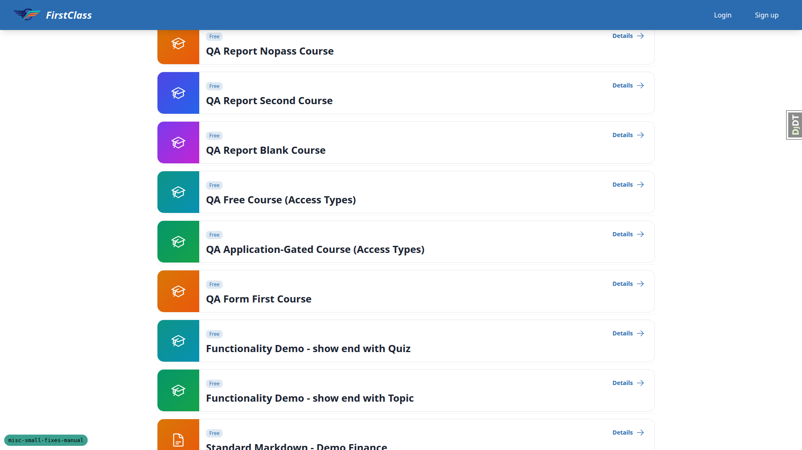
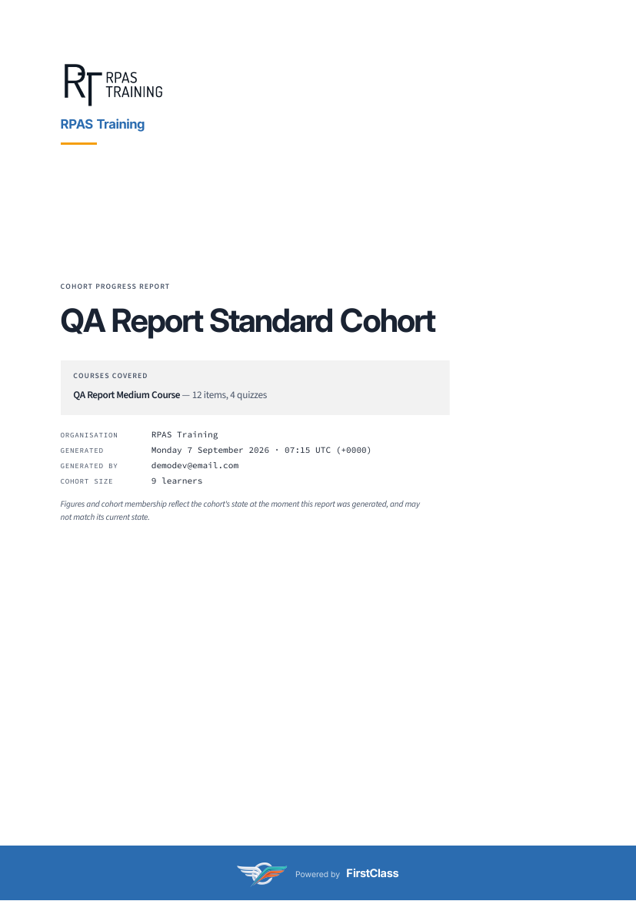
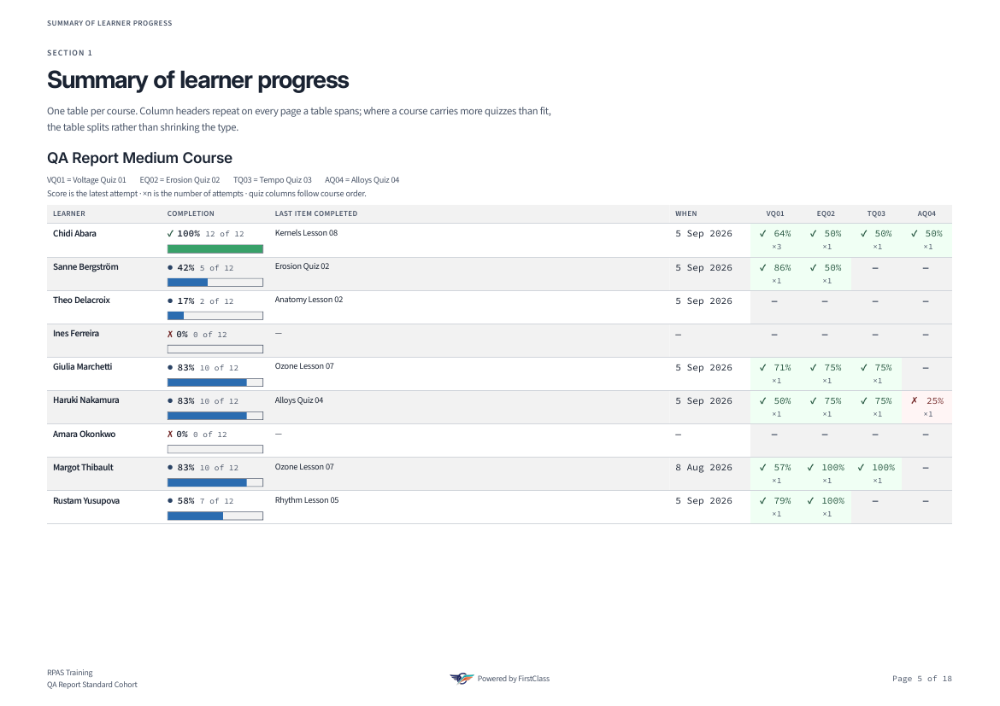
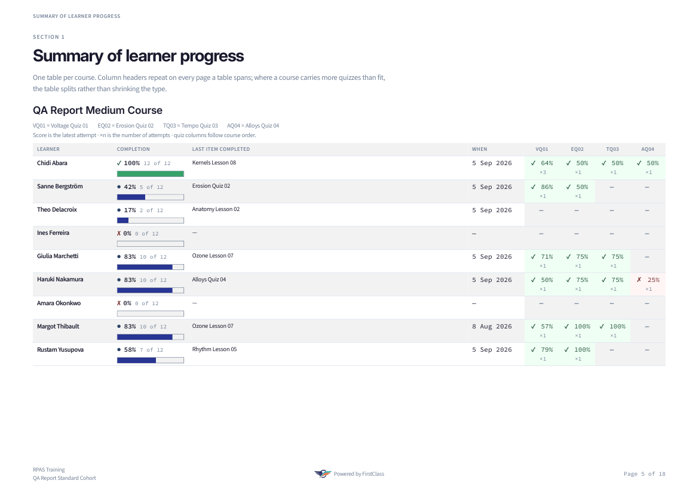
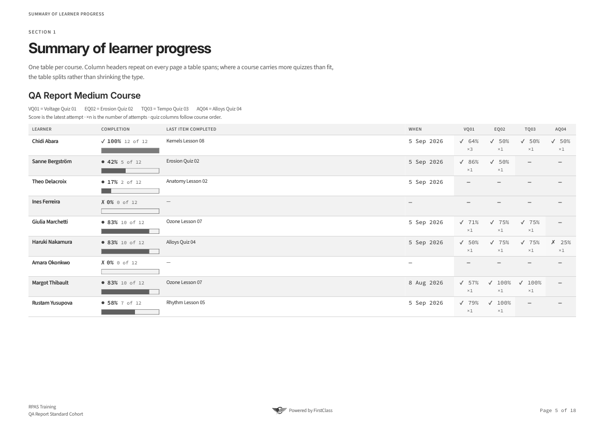
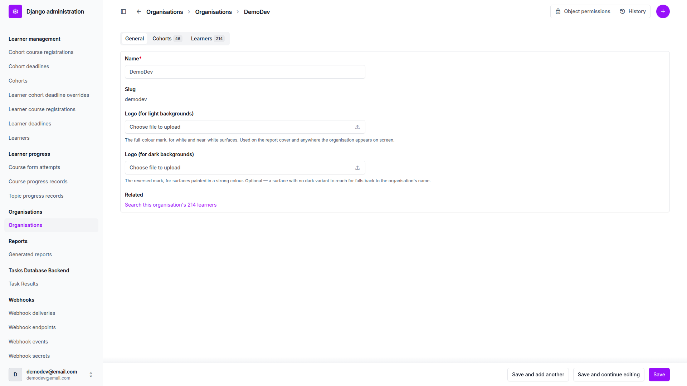
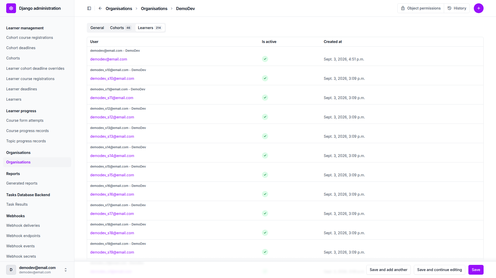
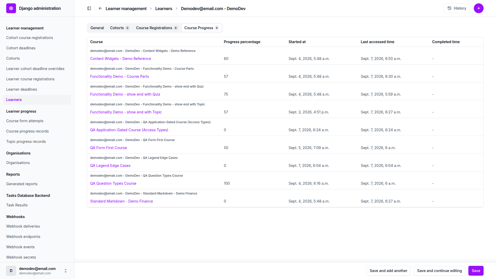
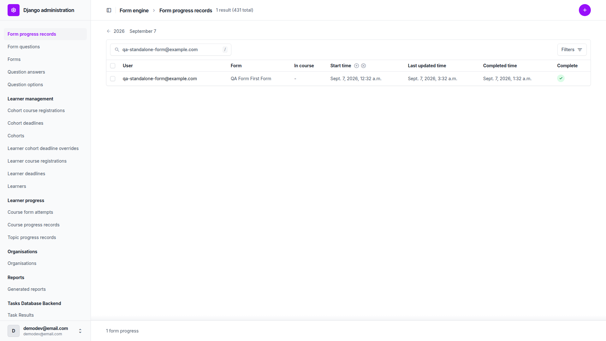

# Frontend QA report: miscellaneous small fixes

This pass ran 176 checks against `3. frontend_qa.md` across desktop, mobile and tablet viewports, under
both mail backends and both themes where the plan called for it. 175 checks passed and 1 failed. The
one failure turned out to be a wrong expectation in the plan rather than a defect: §10.3 has since been
rewritten to match the shipped preview-override behaviour, and B1 is closed — see below.

**A second run followed**, after the first was found to have left almost no visual evidence: §9's report
is a PDF that nobody but the tester opened, and §7 and §15 signed off the admin work in prose alone. The
plan gained §9.8–§9.13 (rasterised report pages, plus a pixel measurement of the white-paper fix) and a
new §16 (a named capture for every admin surface this branch changed). Those 23 checks were then run.
All 23 passed, bringing the totals to **199 checks, 198 passed, 1 failed**. No new defect surfaced —
the point of the run was to make the existing verdicts re-readable, and it did.

## Methodology

The pass was driven manually through Playwright MCP against a dev server on port 8623, and the second
run — §9.8–§9.13 and §16 — on port 8313. Screenshots were collected into `screenshots/` beside this
report, and every image referenced below exists there. The second run's images are named for the check
that owns them rather than by timestamp; the report PDFs were turned into images with `pdftoppm`, since
a PDF is not something a browser screenshot can reach.
Both mail backends (direct SMTP and the queued `freedom_ls.mail.backends.QueuedEmailBackend`), all
three viewports (1920x1080 desktop, 375x812 mobile, 768x1024 tablet) and both themes (`default` and
`first_class`) were exercised where the plan called for them. Seed data could not reach two checks on
its own, so the run created two idempotent QA management commands — `qa_create_legend_edge_cases` and
`qa_create_org_cohort_pagination` — via the qa-data-helper agent to build the missing fixture data
before continuing.

## Diff scoping

The scoping gate classified this run as **FULL**. It fired because the changed-file set spans far more
than one component: `freedom_ls/mail/*` is an entirely new app; `freedom_ls/content_engine/templates/
cotton/{flashcard,accordion,picture,table}.html`, `freedom_ls/base/templates/cotton/button.html` and
`freedom_ls/base/templates/_base_interface.html` are a restyle across shared components; `freedom_ls/
learner_interface/templates/cotton/{player-footer,course-card-shell,course-row-shell}.html` and several
`learner_interface` page templates touch the form-player footer and course cards; `freedom_ls/
learner_interface/views.py`, `config/settings_base.py` and multiple `admin.py` files touch behaviour
directly; and `tailwind.base_interface.css`, `tailwind.picture_spotlight.css`, `tailwind.components.css`
and `tailwind.input.css` move CSS ownership project-wide. Given that breadth, nothing was skipped: the
scoping record's own `skipped` field is "nothing," and this report confirms desktop, mobile and tablet
passes all ran in full.

## Smoke gate

The smoke gate passed. Two pages were loaded to confirm the server and the widgets demo course were
reachable before the full pass began: `http://127.0.0.1:8623/` and
`http://127.0.0.1:8623/courses/content-widgets-demo-reference/4/`.

## Coverage by section

| Section | Passed | Failed |
| --- | --- | --- |
| 1. Auth email names the tenant, not its domain | 6 | 0 |
| 2. Mail, under either backend | 20 | 0 |
| 3. The form player gets the standard navigation footer | 11 | 0 |
| 4. A required question's asterisk stays on the question's last line | 8 | 0 |
| 5. Content widgets | 42 | 0 |
| 6. Course cards | 4 | 0 |
| 7. An organisation's cohorts and learners on its admin page | 10 | 0 |
| 8. Withdrawn — not tested | — | — |
| 9. The cohort report prints on white paper | 7 | 0 |
| 10. Dev shows every course as visible and free | 3 | 1 |
| 11. Deployment guards and the bootstrap command | 7 | 0 |
| 12. Regressions elsewhere | 7 | 0 |
| 13. What changed that nobody asked for | 7 | 0 |
| 14. Components whose CSS moved, and whose look must not | 22 | 0 |
| 15. A learner's progress on their admin page | 21 | 0 |
| 9.8–9.13. The report, kept as images | 6 | 0 |
| 16. The admin changes, in pictures | 17 | 0 |
| **Total** | **198** | **1** |

Section 8 was withdrawn from the plan — the admin's read-only topic content preview was removed from
the branch before this pass, so there is nothing there to test.

## B1: The dev preview overrides relabel courses, not just ungate them — closed, not a defect

**Manifestations:** 10.3 (desktop)

**Expected, per §10.3 as written at the time of the pass:** the badges on `/courses/` keep reporting
each course's declared visibility and access, because the overrides change gating and not labelling.

**Actual:** both overrides also change what the listing says. With them on (as committed in
`settings_dev.py`) an application-gated course wears the same "Free" chip as a genuinely free course
beside it, and a coming-soon course no longer presents as coming-soon. Toggling the settings isolates
the cause exactly: overrides off gives badge "By application" and `coming_soon=True`; overrides on
gives "Free" and `coming_soon=False`.

**Resolution:** the code is right and the check was wrong. Relabelling is what the overrides were
specified to do. `spec_dd/3. done/2026-07-11_16:24_override_course_access_and_details_page/1. spec.md`
says a `coming_soon` course under the visibility override must "look fully published — no 'Coming soon'
badge, no 'I'm interested' CTA" (§157), devotes a section to suppressing exactly those cosmetic reads
(§200-212), and specifies `get_access_badge` returning the "Free" badge under the access override
(§238). That spec's own QA pass signed both off (its B2 and B4). Nothing on this branch touched
`freedom_ls/course_access/`. §10.3 of this plan was written from first principles rather than from the
override spec, and inverted the requirement; it has been rewritten to the shipped behaviour, with a new
§10.3b covering the revert when the settings go back to `False`. No code change.

## §9.8–§9.13: the report, kept as images

Generated for **QA Report Standard Cohort** on **RPAS Training** — a non-house organisation carrying a
logo, which is what §9.4 and §9.5 need and what the first run's house-organisation cohort could not
give. Nine learners, a twelve-item four-quiz course, eighteen A4 pages. Rasterised at 100 dpi with
`pdftoppm`; the stored file is byte-identical to what the admin's download view streams.

| Check | Result |
| --- | --- |
| 9.8 | Pass. `pdfinfo` reports 18 pages and 18 PNGs were produced. Five are kept: cover, at-a-glance, the landscape summary table, a per-learner detail page and the quiz-confusions page. |
| 9.9 | Pass. |
| 9.10 | Pass, on all 18 pages. |
| 9.11 | Pass, on all 18 pages, with coverage matching the default theme's to two decimal places. |
| 9.12 | Pass. |
| 9.13 | Pass. All eight images below exist in `screenshots/`. |

**9.9 — the cover.** The RPAS Training wordmark renders, the "Powered by FirstClass" band runs to the
left, right and bottom edges, and nothing is clipped.

**9.10 — the white paper, measured.** Every one of the eighteen pages has `#ffffff` as its most common
colour (72.4%–98.7%) and, above a 1% floor, exactly one other achromatic fill: `#f2f2f2`. Those are
`--report-paper` and `--report-fill`, the two hex constants `print.css` declares — no third grey, so no
theme surface token reaches the sheet. The summary table is the densest page and the clearest read: 72.4%
`#ffffff`, 18.63% `#f2f2f2`, with the pass and fail tints (`#f0fff4`, `#fff5f5`) sitting over the banding
rather than under it, which is 9.3.

**9.11 — the other theme, and why this is the real gate.** `first_class` sets `--color-surface: #F8F9FC`
and `--color-surface-2: #EDF2F7`. Before the fix those are what the sheet and its fills would have been.
After it, the eighteen `first_class` pages measure **identically** to the eighteen default-theme ones —
same dominant colour, same fill, same coverage percentage on every page. What does differ is the brand:
the cover band moves `#2b6cb0` → `#283593` and the body text `#1a2332` → `#1a1a2e`, so the theme did
apply; it simply no longer reaches the paper.

**9.12 — greyscale.** Ines Ferreira and Amara Okonkwo are both at 0%, and Ines's row is banded. Her
empty ratio-bar track is still visible against the band because the track is outlined, not merely
filled — which is the whole reason the outline is there.

Also kept: `screenshots/9.8-report-default-at-a-glance.png`,
`screenshots/9.8-report-default-learner-detail.png`,
`screenshots/9.8-report-default-quiz-confusions.png` and
`screenshots/9.11-report-first-class-cover.png`.

## §16: the admin changes, in pictures

Sixteen captures at 1920x1080, one per changed admin surface, covering all six modules that touched the
admin on this branch: `organisations`, `learner_management`, `learner_progress`, `form_engine`,
`content_engine` and the new shared `site_aware_models/admin_filters.py`. Taken against `DemoDev`
(46 cohorts, 214 learners) so counts and pagination are visible rather than implied. All 17 checks pass.

**The organisation page** — `16.1-organisation-general-related.png`,
`16.2-organisation-cohorts-tab.png`, `16.3-organisation-learners-tab.png`,
`16.4-organisation-add-page.png`. The Related row reads "Search this organisation's 214 learners" and
the Learners tab's own count is 214, so 7.5's two numbers agree. The Cohorts tab pages at 20 of 46 and
carries "Add another Cohort"; the Learners tab has no editable field, no delete control and no blank add
row, which is 7.3's read-only claim as a picture. The add page shows no tab, no Related row and no
inline — 7.9's trap, which would otherwise present as a create that silently refuses to save.

**The learner page and one progress record** — `16.5-learner-general-related.png`,
`16.6-learner-course-progress-tab.png`, `16.7-course-progress-topics-tab.png`,
`16.8-course-progress-form-attempts-tab.png`, `16.9-learner-add-page.png`. `demodev@email.com` was used
rather than a fixture learner precisely because its rows were driven through the player, so the
timestamps in 16.7 are real rather than the fixture artefact §15's preamble warns about. 16.8 comes from
`qa-report-xl-demodev-20@email.com`, who has fourteen attempts, and its Result column reads "80% passed"
down the page.

**The filter drawers** — `16.10-courseprogress-changelist-filters.png`,
`16.11-topicprogress-changelist-filters.png`, `16.12-courseformattempt-changelist-filters.png`,
`16.13-formprogress-changelist-filters.png`. One capture each, drawer open, which is where §15.16–§15.24
and §15.27 actually live. Course progress carries the widest set: the three-way **By status**, learner
and course autocompletes, organisation and cohort dropdowns, the 0–100 progress slider, two date ranges,
and the **Apply Filters** button that §15.19 is about. Topic progress and course form attempts carry the
two-way **By completion**; form progress carries the same one under `FormProgressCompletionFilter`, which
is the second subclass of the new shared `CompletionListFilter` — the pair of pictures is what shows
both changelists offering one control rather than two lookalikes.

**The columns and the removal** — `16.14-formprogress-in-course-column.png`,
`16.15-formprogress-standalone-dash.png`, `16.16-activity-no-content-preview.png`. 16.14 shows **In
course** populated across the list; 16.15 shows it as the empty-value dash for
`qa-standalone-form@example.com`, the one attempt in 431 that was sat outside a course. Both are needed:
without the second, a dash could not be told apart from a column that is not populating at all. 16.16
confirms §8's withdrawal actually landed — the Activity change page runs Title, Subtitle, Description,
Slug, Content, Metadata, with no Content Preview field.

**16.17 — the theme held.** All sixteen pages render on the unfold base: sidebar, pill tabs, filter
drawer. No admin class slipped back to Django's own, which §15.29 says would render unstyled rather
than error.

## Bug status

| Bug | Status |
| --- | --- |
| B1 | **CLOSED, not a defect** — relabelling is the overrides' specified behaviour; plan §10.3 was wrong and has been rewritten |

## General notes

Both failures the test plan's preamble said to expect have since been fixed and now pass, so the
preamble is stale on both points. §3.6/3.9/3.10: the form completion page now carries the same shared
footer as topic and form-start pages — Previous on the left going to the preceding course item, the
forward action on the right, and a form at index 1 correctly showing no Previous at all — closing the
gap the preamble said was still open. §13.1a: `upgrade_notes.md` now sets `requires_settings_change:
true` and names `INSTALLED_APPS` (to add `freedom_ls.mail`), `EMAIL_BACKEND`, `EMAIL_UPSTREAM_BACKEND`,
`EMAIL_TIMEOUT` and `SILENCED_SYSTEM_CHECKS` — the new mail app is no longer undocumented, and §13.1b
confirms it also tells a downstream to rewrite a silenced `freedom_ls_deployment.E007` entry to
`freedom_ls_mail.E001`.

§5.26's style-block counts do not account for htmx 2.0.8 injecting its own `.htmx-indicator` block into
every page's `<head>` after its script tag. Once that block is excluded alongside the debug badge the
plan already excludes, the counts match the plan exactly: 1 on the media topic, 3 on interactive-widgets,
0 on `/courses/`.

§5.22b says the media topic renders thirteen pictures; it currently renders eleven figures — ten
picture widgets each with its own Expand button and dialog, plus one video embed. That is a stale count
in the plan, not a missing widget; every dialog opened correctly and the page grew no scrollbar.

§9.4's tenant name is suppressed on a cohort belonging to the site's own house organisation, by design:
the cover band is wrapped in ``, and `show_powered_by` is `not
organisation.is_default`. It reads "Powered by FirstClass" for any other organisation. The first run
found this the hard way, on a house cohort; §9 now says to build the fixture on `RPAS Training` instead,
and the second run's cover shot is that band rendering.

§15's documented fixture artefact held up under testing: `qa_create_cohort_progress` writes completed
progress rows without ever stamping `started_at`, so those learners read "Not started" even when their
topics are finished (Ivy Done included). Rows driven through the real player do carry `started_at` —
`demodev`'s player-driven course-progress rows all have real timestamps, one written during this run —
and read "In progress" or "Complete" correctly.

§5.25 could not be done the plan's own way — checking the pre-restyle files into the working tree was
refused by the environment's command classifier. It was done instead by reading the deleted
declarations straight out of the pre-restyle commit (`9a2c3be5^`) and comparing them against values
measured live in the browser now. Every one matched: accordion padding, gap and colours; the
flashcard's face padding, label position, radius, border and transition timing; the three removed
course-card tokens (`--fls-card-radius: 1rem`, `--fls-card-hero-height: 7rem`, `--fls-card-padding:
1rem`) against the measured 16px/112px/16px; and the removed flashcard gradient and border tokens
against the new `--flashcard-*` custom properties resolving to the identical expressions. Nothing
moved.

The 2px height difference between `btn-secondary` and `btn-primary` (measured under 3.4: 34px against
32px) is a pre-existing 1px border on the secondary variant, project-wide — this branch's only change
to `cotton/button.html` was the loading-state spans, so it is not a form-footer regression.

§13.2's hard-coded `py-[calc(0.375rem+1px)]` coupling in the picture caption to `btn-sm`'s current
padding-plus-border, and §13.2a's already-dead `.spotlight-dialog` `padding: 1.5rem` declaration
(silently beaten by `p-0` one cascade layer later, both before and after the restyle), are both
recorded as-is per the plan rather than fixed. Neither is a regression; both are pre-existing couplings
now sitting as utilities on the markup instead of inside retired class names.

Firefox and WebKit were not available in this environment, so §5.14b's disclosure-triangle check covers
Chromium only — no native marker there, with `list-none`, `marker:hidden` and the
`::-webkit-details-marker` reset all confirmed doing the work.

status: ok · reason: 1 bug — 0 fixed, 1 unresolved (red lane: turns on a product decision); 199 checks run, 198 passed; report rendered, screenshots verified
