# Frontend QA report: miscellaneous small fixes

185 pass, 3 fail, 2 skip, across 190 recorded checks.

---

## Methodology

Screenshots were collected into `screenshots/` beside this report as the pass ran. Every image
embedded below exists in that directory at the time of writing. A compression pass was run over
the directory afterwards and found nothing over 1MB, so no image was recompressed — all 19 files
are shipped at their original resolution. One captured screenshot
(`page-2026-09-07T03-12-06-478Z.png`) exists in the directory but is not referenced by any check
below and is not embedded.

Viewports exercised: desktop (1920x1080, the default for the great majority of checks), mobile
(375x812, the standard mobile breakpoint below 1024px), tablet (768x1024), plus two narrower
one-off viewports used to force specific caps: 375x320 for §14.5/§14.7's bottom-sheet height-cap
check, and 900x812 for §14.4's side-drawer width-cap check.

## Diff scoping

Class: **FULL**. It fired on rule 1 — templates, CSS and JS all changed in this diff (fourteen
templates, `alpine-components.js`, `print.css`, `theme.css`, both Tailwind entry stylesheets, and
two Tailwind partials deleted outright). Nothing was skipped for scoping reasons.

Substantial uncommitted work was under test alongside the committed diff: the whole
`freedom_ls/mail` app is untracked, and `config/settings_dev.py`, `config/settings_prod.py`,
`config/settings_base.py`, the allauth adapter, the deployment app and several admin modules also
carry uncommitted changes. All of it was exercised as part of this pass — the plan's own preamble
treats the mail-app extraction as one of five distinct jobs under test.

## Smoke gate

**Pass.** Two pages loaded cleanly before the detailed pass began: the Dashboard
(`http://127.0.0.1:8144/`) and the Interactive Widgets topic
(`http://127.0.0.1:8144/courses/content-widgets-demo-reference/4/`), the primary page changed by
this branch.

---

## Bugs found

### B1 — Side-panel drawer variant's 24rem width cap is defeated by the `max-w-none` utility

**Manifestations:** §14.4 (mobile, checked at 900x812 by devtools override — no shipped page uses
this variant).

**Expected:** With `data-variant="side-drawer"`, the panel slides in from the left and is capped
at 24rem (384px), per `.side-panel-dialog[data-variant="side-drawer"] { width: 80%; max-width:
24rem; }` in `_base_interface.html`'s `@layer components` block.

**Actual:** Computed `max-width` is `none`. At 900px viewport width the drawer renders 720px wide
— 80% of the viewport — against the intended 384px. The dialog element also carries the
`max-w-none` Tailwind utility, and utilities sit in a later cascade layer than `@layer components`,
so `max-w-none` wins. This is the same cascade trap the file's own comment documents for the
bottom sheet's `max-height`, which *was* moved into the style block for exactly this reason and is
correct at 690.2px (§14.7); the side drawer's width cap is the unfixed twin. Severity is low
because every shipped consumer takes the bottom-sheet default, so no user-facing surface is
affected today. A fix means deciding how to keep `max-w-none`'s real job — clearing the UA's
default `<dialog>` max-width — while letting the drawer's own cap win, which is a design call
rather than a mechanical edit.

### B2 — Allauth mail sent outside a request raises `ImproperlyConfigured` when neither `FORCE_SITE_NAME` nor `SITE_ID` is set

**Manifestations:** §12.1 (desktop).

**Expected:** An install that pins neither `FORCE_SITE_NAME` nor `SITE_ID` can still send allauth
mail from outside a request cycle — a management command or a scheduled job — resolving the site
via some documented fallback, or failing with a clear, actionable error.

**Actual:** It raises `django.core.exceptions.ImproperlyConfigured`: "You're using the Django
sites framework without having set the SITE_ID setting." Both entry points fail:
`format_email_subject` → `site_display_name_for_request(None)` → `get_cached_site(None)` at
`freedom_ls/site_aware_models/models.py:44`, and the adapter's `send_mail` →
`get_cached_site(request=None)` at `freedom_ls/accounts/allauth_account_adapter.py:36`. FLS sets
no `SITE_ID`, so with `FORCE_SITE_NAME` blank there is nothing left to resolve the site from. The
plan anticipated this at §12.1 and asked for it to be recorded as a production hazard. In
mitigation: the queue worker path is *not* affected, because the message is fully rendered inside
the request before enqueueing and the worker only rebuilds serialised MIME; dev never meets this
because it pins `FORCE_SITE_NAME`. The fix is a product decision — fall back to a default Site,
raise a clearer FLS-specific error, or require `FORCE_SITE_NAME` via a system check — which is why
this is not auto-fixable.

### B3 — `upgrade_notes.md` documents the styling move but says nothing about the new `freedom_ls/mail` app

**Manifestations:** §13.1a-upgrade-notes (desktop).

**Expected:** `upgrade_notes.md` tells a downstream project taking this branch that it must add
`freedom_ls.mail` to `INSTALLED_APPS`, and that a `SILENCED_SYSTEM_CHECKS` entry for
`freedom_ls_deployment.E007` must be rewritten to `freedom_ls_mail.E001`.

**Actual:** The file mentions none of it — no `freedom_ls.mail`, no `INSTALLED_APPS`, no
`EMAIL_BACKEND`, no `EMAIL_UPSTREAM_BACKEND`, no E007 and no `SILENCED_SYSTEM_CHECKS`. A
downstream that builds its own app list and misses `freedom_ls.mail` gets no error — just a
system check that never runs and, if it had opted into queueing, an `EMAIL_BACKEND` pointing at a
module in an app Django was never told about. The plan flagged this as an expected failure and it
still stands. One detail has moved on since the plan was written: the front matter is no longer
`requires_settings_change: false` / `changed_settings: []` — it now reads
`requires_settings_change: true` with `changed_settings: [MARKDOWN_ALLOWED_TAGS]` — so the front
matter has been updated, but for a different change entirely; the mail-app gap is untouched. The
missing E007 → `freedom_ls_mail.E001` `SILENCED_SYSTEM_CHECKS` guidance (§13.1b) is the same gap,
folded in here rather than counted as a second bug.

## Bug status

**UNRESOLVED** — Side-panel drawer variant's 24rem width cap is defeated by the `max-w-none` utility

**UNRESOLVED** — Allauth mail sent outside a request raises `ImproperlyConfigured` when neither `FORCE_SITE_NAME` nor `SITE_ID` is set

**UNRESOLVED** — `upgrade_notes.md` documents the styling move but says nothing about the new `freedom_ls/mail` app

---

## Results by section

### §0 Setup

0.1 — `npm run tailwind_build` succeeded and both retired stylesheets
(`tailwind.picture_spotlight.css`, `tailwind.base_interface.css`) are confirmed absent from the
working tree, as the plan requires before anything in §5/§6/§14 can be trusted.

### §1 Auth email names the tenant, not its domain

All six checks pass. Both trigger mails (password reset, signup verification) carry the
`[FirstClass]` subject prefix — never `[DemoDev]`, never a bare domain — and the prefix agrees with
the body's "FirstClass" branding and logo alt text throughout (1.1–1.3). The reset URL is
character-for-character identical across the plain-text line, the HTML `href` and the HTML "copy
this link" text (1.5), and following it end to end authenticated the session (1.4). §1.6 confirmed
the fallback: blanking `HEADER_TITLE` flipped both the subject prefix and the page header to
`DemoDev` — the `FORCE_SITE_NAME` value — confirming header and subject share one resolver.

### §2 Mail, under either backend

**Reported per backend, as the plan requires — both configurations were fully exercised, so the
swappability claim is evidenced on both sides rather than half of it.**

**Queued backend** (`freedom_ls.mail.backends.QueuedEmailBackend`, dev's shipped default):
2.1 (`manage.py check` clean, no `freedom_ls_mail.E001`), 2.2 (reset 901ms, signup 984ms, both
landed in Mailpit), 2.3 (`Content-Transfer-Encoding: 8bit` on both parts of the allauth message,
zero quoted-printable soft line breaks), 2.4 (reset URL unbroken through the serialise/rebuild
round trip), 2.9 (every §2.A check re-confirmed, verified twice over — once via dev's
`ImmediateBackend` and once through the durable `django_tasks_db.DatabaseBackend` with a real
`fls_run_worker`), 2.13 (task row reached SUCCEEDED, priority 10 — ahead of report rendering and
webhook delivery), 2.14 (dotted path is `freedom_ls.mail.tasks._send_email_task`; two stale rows
naming the pre-move `freedom_ls.deployment.mail` path were found, dated roughly 2.4 days before
this run, and drained rather than filed), 2.15 (self-referential `EMAIL_UPSTREAM_BACKEND` correctly
fires `freedom_ls_mail.E001`, not the retired `freedom_ls_deployment.E007`, with a hint naming the
right setting to change), **2.16 — the section's most important check** (with no worker running,
a password reset completed normally in the browser but the mail never arrived and an unpicked
`READY` task row sat in the database with no error anywhere; starting `fls_run_worker` delivered it
within ~2 seconds, still 8bit and still unbroken), 2.17 (`security-and-data-handling.md` documents
the queue's plaintext-storage trade-off in full, including the fourteen-day prune default).

**Direct backend** (`django.core.mail.backends.smtp.EmailBackend`): 2.8 (every §2.A check
re-confirmed after the one-line swap), 2.18 (the same self-referential `EMAIL_UPSTREAM_BACKEND`
that fires E001 under the queue stays clean under direct — correctly, since the setting is not
read on this path), 2.19 (zero `_send_email_task` rows across a reset and a verification — the
queue is genuinely out of the path, not merely bypassed), 2.20 (mail still arrives with no worker
running at all, the mirror of 2.16 and the reason direct send is production's default).

**Both backends:** 2.5 (non-ASCII subject and body — German, French, Japanese, Cyrillic, emoji —
survived intact under each), 2.6 (a 74-byte PNG attachment survived the queue's serialise/rebuild
round trip byte-identical, confirmed by `cmp`), 2.7 (branding identical, proven exhaustively by
2.10 rather than by eye), 2.11 (only `EMAIL_BACKEND` changed between runs; no migration, rebuild or
data change either direction), 2.12 (`manage.py check` clean under both).

**§2.10 — the swappability gate itself:** the raw Mailpit sources of the two password-reset
messages, saved under each backend and diffed after normalising only the genuinely per-message
parts (Received trace, Date, Message-ID, MIME boundary, reset token), are **identical**. Subject,
prefix, every header, both body parts and the reset URL match exactly. A learner cannot tell from
the mail which backend sent it — this is the single strongest piece of evidence in the whole pass.

### §3 The form player gets the standard navigation footer

All ten checks pass, including one whose expected failure did not reproduce.

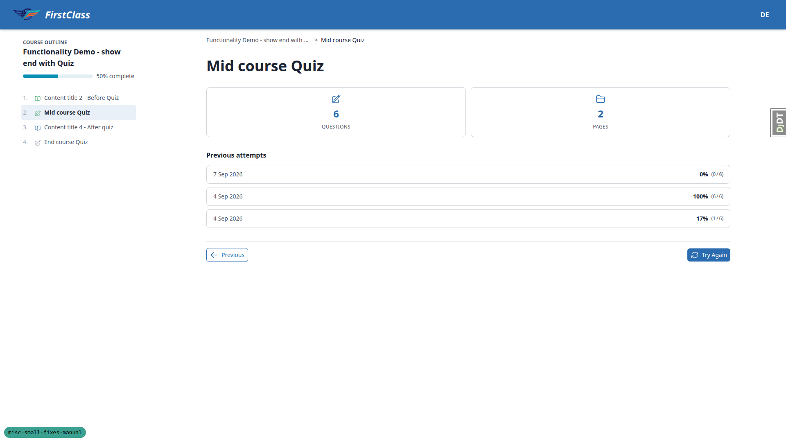

3.1/3.2/3.4 confirm the form start page's footer is now pixel-identical to a topic page's footer
(border, padding, button height and chevrons all match — shown above). 3.5 shows the runner's
Previous/Next match each other exactly (100x32 and 75x32, both 14px/6px 8px):

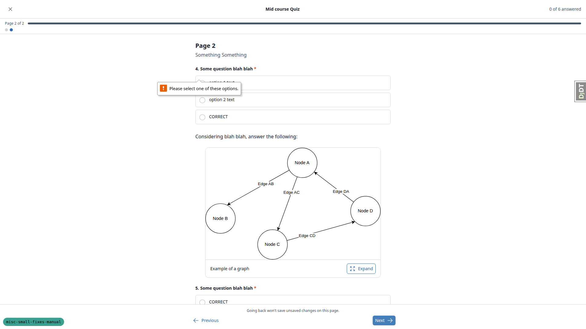

3.7 walked all five forward states (Start, Continue, Try again, Next, Finish course) and confirmed
the label and icon for each. **3.8** proves the navigation is genuinely `hx-boost`ed rather than a
document load: a JS marker (`window.__qaBoostMarker`) set before clicking Previous survives the
click, which a full page load would have destroyed — a full document request would have wiped the
JS context entirely. 3.9 confirms the "nothing behind it" case on the new QA Form First Course: no
Previous button, not disabled, not an empty slot, forward button flush right. **3.10 is the plan's
one expected failure that did not reproduce** — the completion page carries a correct Previous
button linking to the preceding course item, not back into the form; the gap the plan predicted
has been closed (see General notes):

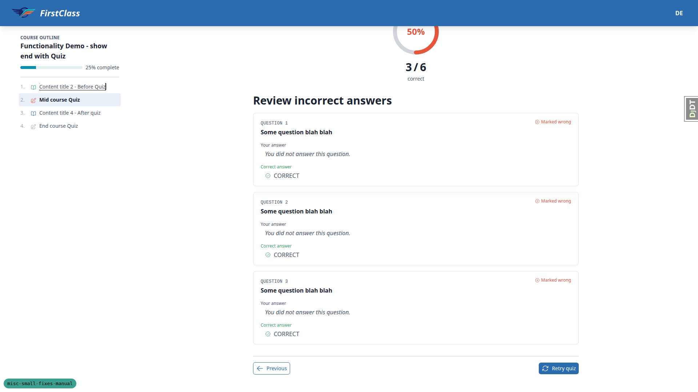

### §4 A required question's asterisk stays on the question's last line

Three checks recorded (4.1, 4.2, 4.5), all pass.

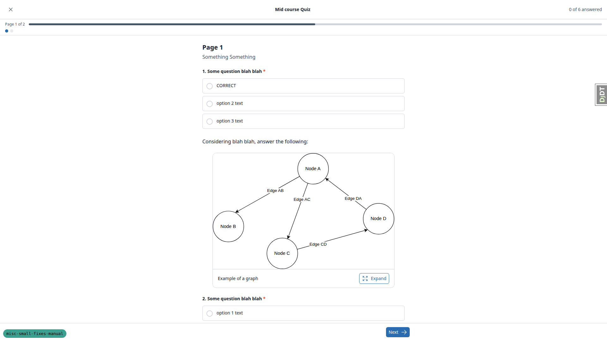

The `*` sits glued to the question's last word via a non-breaking space, on a paragraph whose
last-child is inlined (`display: inline`); the question number floats left inside a block-level
`<legend>` so it sits beside the text rather than above it. 4.5 confirms the asterisk is
`aria-hidden` with exactly one screen-reader-only "(required)" per question across all six
questions of the Mid course Quiz, so the requirement is announced once.

### §5 Content widgets

The largest section, and the double duty the plan asks for — every visual check here is also
evidence the utility conversion was faithful. All checks pass except the one deliberately skipped
(§5.25, covered under "What was not run").

**Flashcard:**

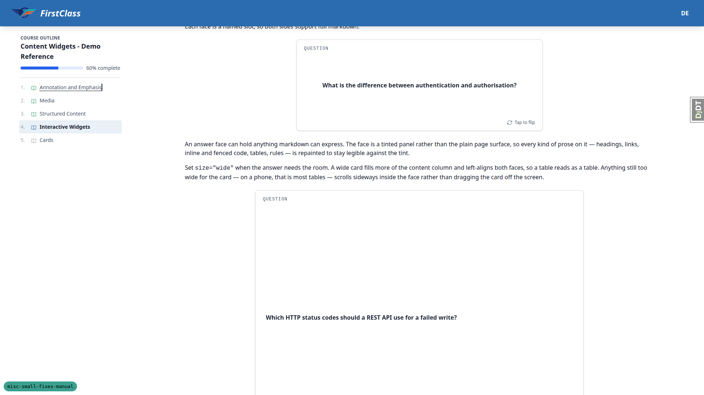

Corner labels now read Question/Answer (5.1); both faces carry a "Tap to flip" hint (5.2). 5.8d
shows the wide card at 896px against the standard 672px, both left-aligned (shown above).

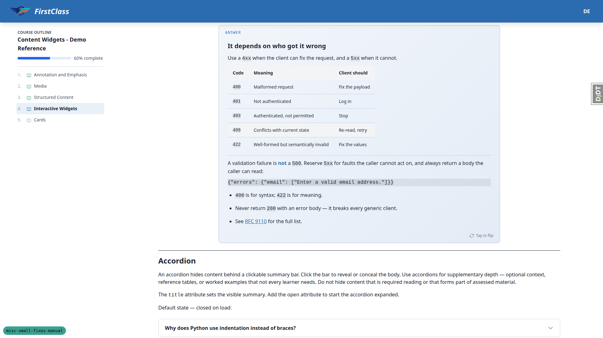

The answer face is a legible brand-tinted gradient panel across every element the second card
exercises — heading, table, hr, inline code, fenced code, list, link (5.3, 5.4, 5.8a, shown
above). Faces are measured identical in height (672x250 and 896x696) with centred content (5.5);
flip works by click, Enter and Space with `aria-pressed` toggling (5.6); the corner label and hint
sit inside `aria-hidden` subtrees (5.7); the focus ring resolves the theme's `focus-ring` colour,
not primary (5.8). 5.8b confirms the four retired `--fls-flashcard-*` tokens are gone and the face
now resolves four component-local custom properties instead. 5.8c confirms the 3-D flip geometry
survived the move to utilities (`perspective-[1400px]`, `backface-hidden`), with the hidden face
`aria-hidden` **and** `inert`, unreachable by Tab.

**5.8e is bug B1's repro at 375px, and it is clean:**

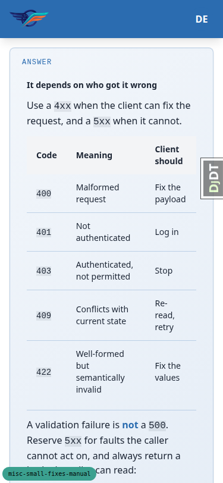

No horizontal scrollbar, both cards sit exactly inside the content column, and the answer table
and fenced code block each scroll horizontally on their own without moving the card or the page.
5.8f confirms the focus ring survives the layer swap that lets a table scroll under the flip
trigger. **5.8g** proves click targeting is correct: clicking the answer table or the code block
does not flip the card (Playwright confirms the button intercepts pointer events over prose, but
not over the raised table/code), while ordinary prose still flips.

**Accordion:**

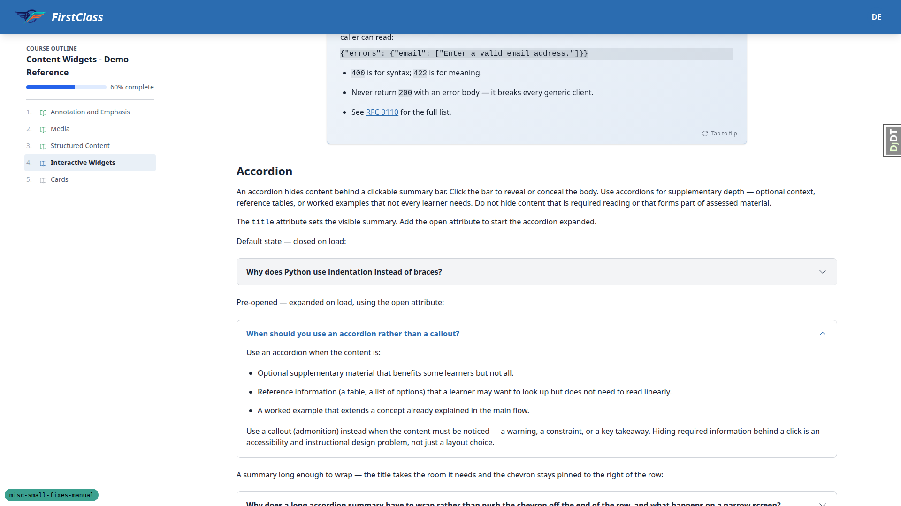

Closed summary is the normal on-surface colour (5.9); hover tints and clips to the rounded corners
(5.10); open state shifts summary text *and* chevron to primary with a 180° rotation (5.11); focus
ring is visible and inset (5.12); the summary row measures a visibly roomier 56px (5.13, shown
above). 5.14a confirms by inspection that the open-state rules name the full child path
(`[[open]>&]`, `[[open]>summary>&]`) rather than matching any descendant, so nested accordions
cannot leak state. 5.14a-i confirms the chevron transitions on the `rotate` property specifically
(not `transform`), so it sweeps rather than snapping. 5.14b confirms no native disclosure triangle
in Chromium (Firefox/WebKit not available this run).

**Picture:**

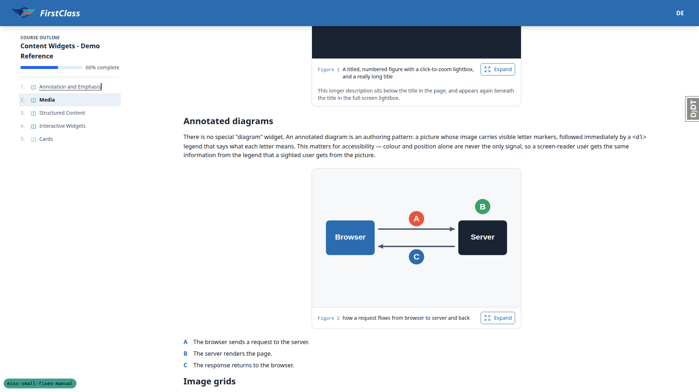

The description now renders on the page under the caption, full card width (5.15, 5.16); "Figure
N" sits in its own mono gutter with no trailing colon (5.17); the trigger reads "Expand" on all ten
pictures (5.18); a long title's continuation line hangs indented under the first (5.19); a picture
with no description renders no stray gap (5.21) — all shown above. A picture with no number falls
back to the colon form, "Figure: Landscape" (5.22).

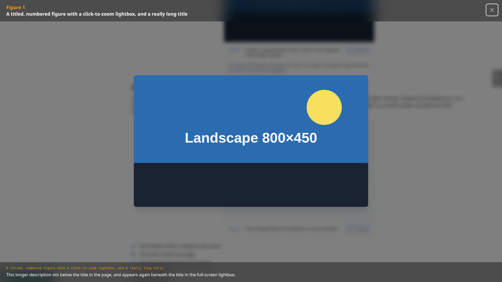

The lightbox opens with heading and description and closes on Escape and its close button (5.20,
shown above). **5.22a is the single riskiest item in the whole change, and it is correctly built**:
a closed spotlight computes `display: none` with a 0x0 rect (confirmed by closing one spotlight and
successfully opening a *different* picture's), and the enter/leave transition computes
`transition-property: opacity, scale, overlay, display` at 0.2s with `transition-behavior:
allow-discrete` — the declaration whose absence is what breaks the leave animation. 5.22b walked
all ten Expand buttons programmatically with no cross-talk and no layout shift (note: the plan
expects thirteen pictures on this page; the demo content renders ten — a plan/content mismatch,
not a defect). 5.22c confirms the spotlight's zero effective padding survived the conversion
unchanged (also visible above). 14.24 confirms the native `<dialog>` spotlight gets the same dark
blurred scrim as every other modal.

**Across themes and motion:**

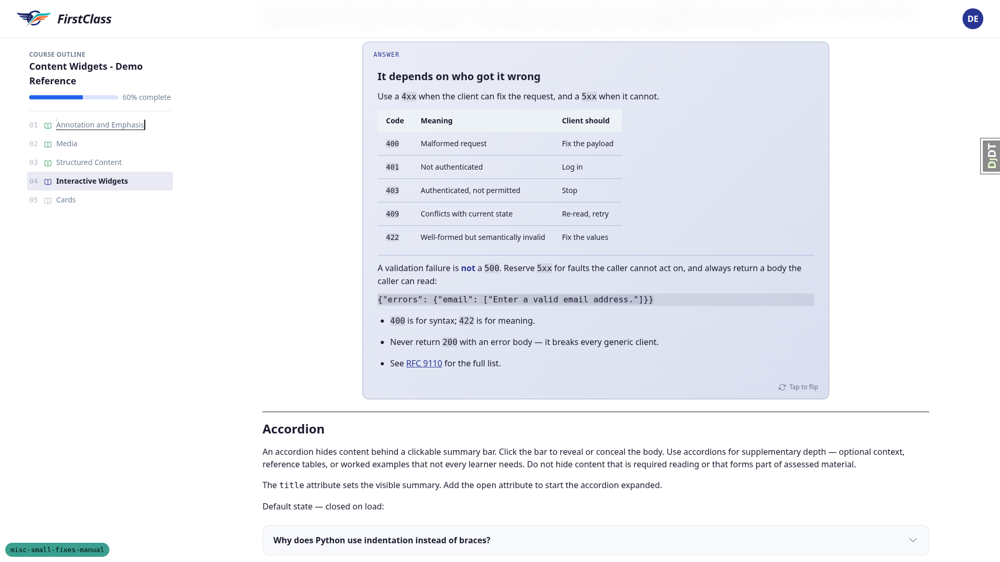

5.23 re-ran the flashcard and accordion checks under `first_class` and found a coherent
indigo-tinted answer face mixed from that theme's own `--color-primary`, with every prose element
still legible (shown above) — proof that removing the four flashcard tokens broke nothing, since
`first_class` never set them. 5.24 checked all three widgets under emulated
`prefers-reduced-motion: reduce` rather than sampling one: transitions drop to 0s or drop the
animated property, but every state change (flip, open/close) still completes.

**§5.26 style-block counts** matched the plan's table only once two categories of block were
excluded that are not part of any template: htmx injects its own `.htmx-indicator` block into the
live DOM at runtime, and DEBUG injects the branch badge's block. Once both are excluded: topic 2
(media) carries exactly 1 template `<style>` block, attributable to the side panel — the picture
widget itself ships none (5.26-topic2); topic 4 (interactive-widgets) carries 3 once the DEBUG
badge is excluded — the side panel plus one per flashcard (5.26-topic4); `/courses/` carries 0 once
both non-template blocks are excluded, with no side panel on that shell (5.26-courses).

### §6 Course cards

All three checks pass.

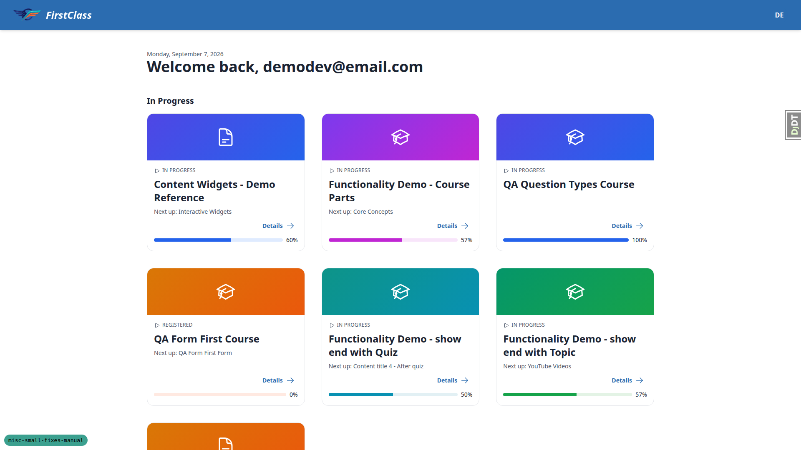

The eyebrow chip is sized to its own text rather than stretching full-width, on both the dashboard
grid and `/courses/` rows (6.1). Across a row of cards with mismatched title/description lengths,
every Details link shares an identical bottom coordinate within its row (row 1 all 558px, row 2
all 929px), a constant 45px above the card's bottom edge (6.2, shown above). Both hold at
768x1024, where the grid drops to two columns with no horizontal scroll (6.3).

### §7 An organisation's cohorts and learners on its admin page

All ten checks pass, most decisively on pagination. The Cohorts tab lists exactly the
organisation's 16 cohorts, ordered by name, one page (7.1, 7.2). The Learners tab is genuinely
read-only — zero delete checkboxes, zero "Add another" links, zero editable inputs — listing 213
learners (7.3). **§7.4 is the strongest pagination evidence in the pass**: paging through all nine
pages (25×8 + 13) and collecting 213 change-link `href`s yields 213 total, 213 unique, **zero
duplicates** — every learner appears exactly once and none is skipped. The Related row's "Search
this organisation's 213 learners" link opens a changelist whose result count matches exactly
(7.5); a zero-learner organisation shows plain, unlinked "No learners yet" text (7.6); a
one-learner organisation reads the singular form (7.7). Adding a cohort from the tab still works
(7.8), and the add-organisation page carries neither tab, no Related row and — critically — zero
inline management forms, so a create is not silently refused (7.9). The 213-learner organisation
loaded in 1247ms against 685ms for an empty one — comparable, with no visible stall (7.10).

### §9 The cohort report prints on white paper

All checks pass, including the structurally-verified greyscale check (see "What was not run" for
its caveat). Interior pages are genuinely white across five sampled pages of a 34-page report, with
no theme surface token left in `print.css` — it now declares only `--report-paper: #FFFFFF` and
`--report-fill: #F2F2F2` (9.1). That one grey (`--report-fill`, referenced 10 times) covers every
named element — headers, banding, chips, cover card, stat cells, flags panel, both ratio-bar tracks
(9.2). Status tints (pass/fail) visibly win over banding where they overlap (9.3). The cover names
FirstClass and renders the organisation logo, with the "Powered by" band correctly and deliberately
absent for DemoDev's own default organisation (9.4). The cover's colour band bleeds to all three
edges (9.5). **§9.7 is the fix's actual proof**: the report was regenerated under `first_class` —
the blue-grey surface theme that prompted the fix — and interior pages **stayed white**, with the
same neutral grey header/banding/tracks as the default theme; only the legitimately
theme-sourced accent colour (navy progress bars) differed.

### §10 Dev shows every course as visible and free

All four checks pass. The `coming_soon` course opens in the player rather than redirecting (10.1);
a non-free course can be entered with no registration (10.2); badges on `/courses/` still report
each course's declared registration status rather than a fabricated "published" label (10.3, with a
confusing-but-intended interaction noted below); both overrides are dev-only and default `False`,
and `check --deploy` correctly raises `freedom_ls_course_access.W001` when both are on with `DEBUG`
forced `False` (10.4).

### §11 Deployment guards and the bootstrap command

All seven checks pass. `--site-name` is now a required option (11.1) and, when supplied, becomes
the tenant name a later email subject uses via the same `HEADER_TITLE`-first resolver (11.2).
`.env.example` correctly documents mail as sent in the request by default, the `EMAIL_BACKEND`
line commented out, the worker requirement for queueing, and `EMAIL_TIMEOUT=10` — nothing claims
queueing is the default (11.3). `check --deploy` against production raises nothing new beyond
`main`'s baseline (11.4), `EMAIL_BACKEND` resolves to the SMTP backend with nothing set in the
environment (11.5), resolves to the queue from an environment variable alone with `check --deploy`
staying clean (11.6), and `EMAIL_TIMEOUT` still defaults to 10, now sourced from
`freedom_ls.mail.settings_defaults` (11.7).

### §12 Regressions elsewhere

Six of seven pass; **12.1 is the section's one failure, and it is the plan's second expected
failure — see bug B2.** 12.2 confirms the header still reads FirstClass via the shared resolver.
12.3 walked the full allauth loop (signup, reset, login, logout, re-login) successfully, with one
partial: the signup verification link was not clicked end to end, only the reset link (see "What
was not run"). 12.4 played "show end with Quiz" fully (both quizzes sat, footer confirmed
unchanged) but only partially walked the other three demo courses (see "What was not run").

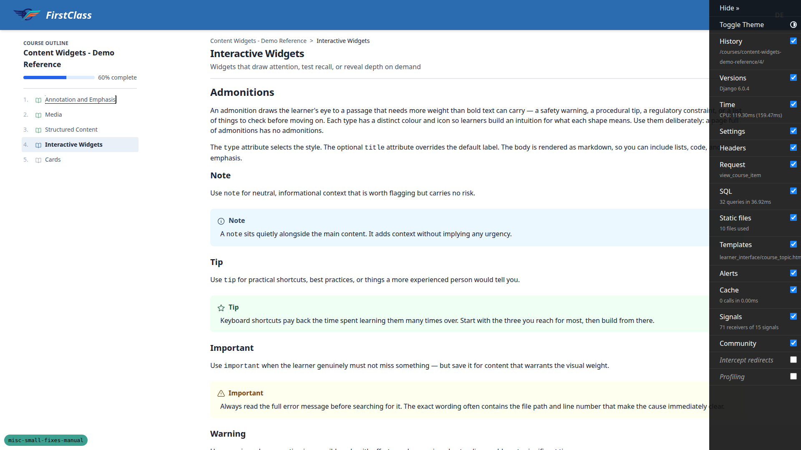

12.5 confirmed the widgets demo's other content — admonitions, image grids, tables, code — is
unaffected by the new component CSS, including inside the flashcard's answer face, the hardest
case (shown above). 12.6 found no import-cycle 500 despite the learner-management admin now
importing the organisations admin at module scope. 12.7 walked 13 admin/learner-facing URLs, all
HTTP 200, slowest 2028ms.

### §13 What changed that nobody asked for

A read-only audit; every finding here is confirmed intentional or written up as a note rather than
a fix (see General notes for the substance of each). **13.1a-upgrade-notes is this section's one
expected failure — see bug B3.** 13.1a-imports and 13.1a-moves confirm the `freedom_ls/mail`
extraction landed cleanly: every file and test moved, no stray import to the old homes, the app is
present in `INSTALLED_APPS`. 13.1b confirms the E007 retirement is documented in the deployment
app's own docstring. 13.1c, 13.2, 13.2a, 13.3, 13.4 and 13.6 are all notes, detailed below.

### §14 Components whose CSS moved, and whose look must not

29 of 30 pass; **14.4 is the section's one failure — bug B1.** The side panel (§14.1) got the
closest attention, as the plan asked. 14.1 confirms the desktop docked column (sticky, 320px,
`320px 1488px` grid, its own inner scroll). 14.2 confirms collapsing it drops cleanly to a single
`1856px` column with no leftover gap.

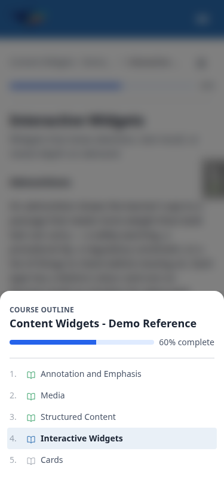

14.3 confirms the mobile default is the bottom sheet, capped at 690.2px (85vh of 812px, shown
above). **14.5 and 14.7 are the height-cap evidence**: forced to 375x320 (85vh = 272px), the panel
measures exactly 272px with its inner body scrolling correctly (`scrollTop` reaching 53) to reveal
the last outline item; **the cap held at both 375x812 (325px rendered against a 690.2px ceiling)
and 375x320 (272px rendered against a 272px ceiling)** — the past regression, where a utility
`max-height` reset outranked the sheet's own cap, does not reproduce. 14.6 confirms a closing panel
keeps its pinned position rather than jumping to the top. 14.8 confirms the same dark blurred scrim
as every other modal (also visible above). 14.9 confirms the panel still opens and closes under
reduced motion (with a note below that its slide, unlike the three content widgets, is not itself
motion-gated).

14.10–14.13 cover the button loading state: label swaps to spinner during a request and back
(14.10), the spinner lays out as a centred row with a gap (14.11), it is invisible at rest (14.12),
and the unescaped `&` in the `[.htmx-request_&]:hidden` class name resolves to a real rule rather
than a broken `&amp;`-mangled selector, confirmed by the computed style actually changing (14.13).

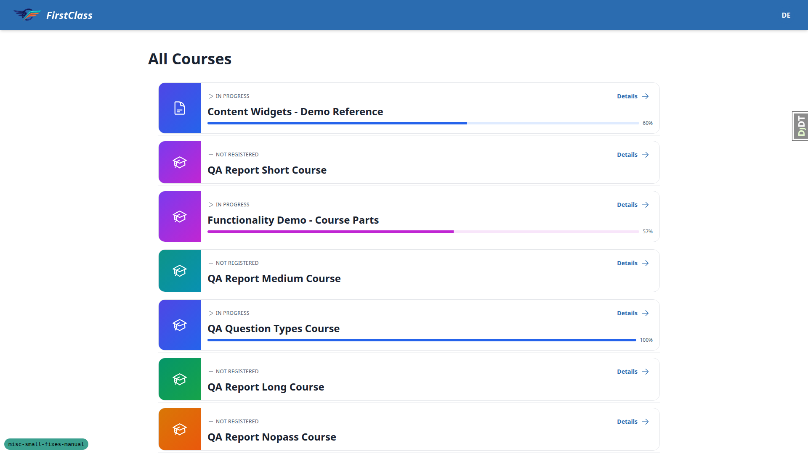

14.14–14.20 cover course cards: grid-card radius (16px), hero-band height (112px) and body padding
(16px) all match the values the three removed tokens used to carry (14.14); the hero gradient still
fills edge to edge, clipped to the rounded corners (14.15); list rows keep their padding and flush
accent panel (14.16, shown above); hover lift, the whole-card click target and the focus-within
ring all still work (14.17); the in-progress bar is still tinted per-course, track and fill both
(14.18);

`first_class`'s `bg-white` re-opening of `.course-card` still wins (14.19, shown above); the detail
hero's `--fls-course-accent-*` tokens are deliberately kept and still render (14.20).

14.21–14.26 confirm the shared stylesheet's untouched territory: every button variant (14.21), chip
sizing including the course-card eyebrow (14.22), the header and its scroll shadow (14.23), the
dark blurred scrim on both an Alpine modal and the native picture `<dialog>` (14.24), read-only
checklist markers from the markdown renderer (14.25), and the whole 160-line `@layer base` block
left untouched (14.26).

14.27–14.30 are the terminal boundary checks: both deleted stylesheets are absent and
`tailwind.input.css` imports exactly three project files (14.27); a `grep -c` of eleven retired
token/class names against the compiled output returns 0 (14.28); `test_theme_tokens.py` passes, 16
tests (14.29); `upgrade_notes.md` sets `requires_tailwind_rebuild: true` and names both deleted
stylesheets and all seven removed tokens (14.30).

### §15 A learner's progress on their admin page

29 of 31 recorded checks pass (15.9 skipped — see "What was not run"; none failed).

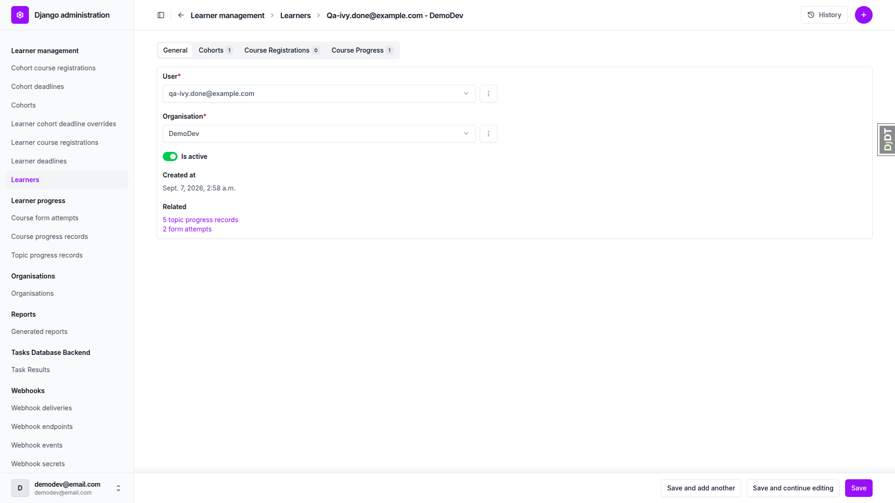

Ivy Done's page shows a Cohorts tab with her one cohort (15.1), a Course Registrations count of 0
against a Course Progress count of 1 — the intended split for cohort-granted access (15.2, 15.3,
shown above). All three tabs on a learner page are read-only (15.4) and every tab carries a count
badge with correct row links (15.5). The Related row's "N topic progress records" / "N form
attempts" links open changelists whose result counts match N exactly — 5 and 2 for Ivy (15.6).
Alice Zero's boundary case holds: a populated Course Progress tab against an unlinked "No progress
recorded yet" Related row (15.7); singular wording confirmed on a one-record learner (15.8). The
add-learner page mirrors §7.9's trap-avoidance exactly — zero inline management forms, and a create
still succeeds (15.10). The Learner changelist for the 213-learner organisation rendered 100 rows
in 1025ms with both `user` and `organisation` prefetched (15.11).

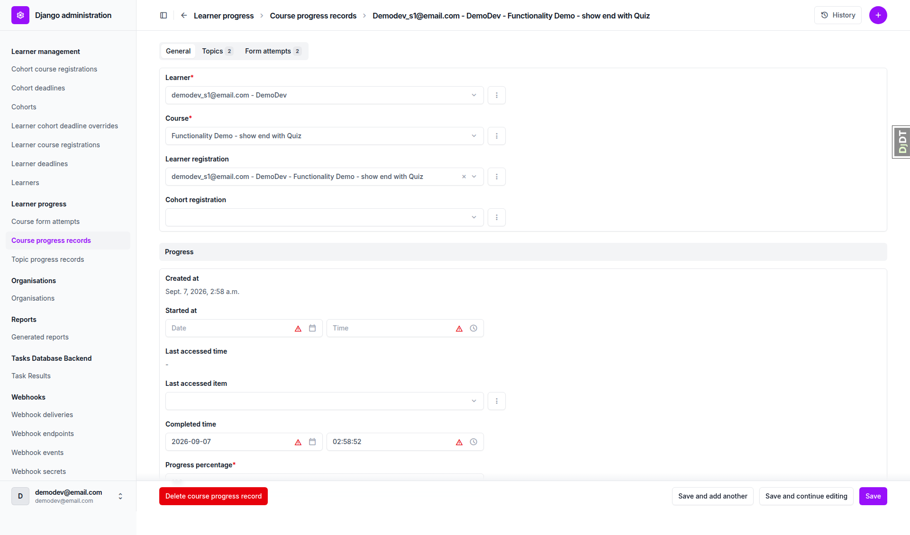

A course progress record's own Topics and Form attempts tabs are read-only, counted and correctly
linked (15.12–15.14, shown above); 15.15's blank `started_at` against a real `completed_time` is
confirmed to be the fixture's own doing, not a status-derivation bug.

The progress changelists' filtering is thoroughly exercised: completion filters narrow correctly
across all three models (701/679/22 topic progress; 406/401/5 form attempts; 149/17/132 course
progress) (15.16); learner/course/topic/form filters are genuine autocomplete boxes rendering zero
pre-populated options (15.17); organisation and cohort are plain dropdowns that narrow correctly
(15.18); date-range filters require an explicit Apply and do not reload on keystroke, confirmed by
a surviving JS marker after 700ms (15.19); filters combine to the correct intersection (15.20); the
completion-date drill-down narrows 701 rows to 106 for August (15.21). **§15.22's Complete/Not
Started overlap is entirely a fixture artefact**, confirmed by inspecting the database directly:
all 17 overlapping rows are `qa_create_report_fixtures` rows written with `completed_time` set and
`started_at` left `None` — the filter itself reads the two fields correctly. The percentage slider
narrows correctly (39 records at 0–0%, 74 at 50–100% against 149 total) (15.23); the last-accessed
range filter is present (15.24); scored-quiz results show real percentages including a
deliberately-generated 50%-failed case against an 80% pass mark (15.25).

Standalone form sittings:

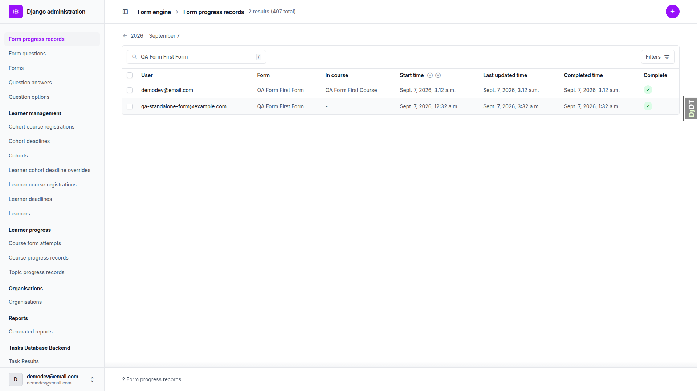

**15.26** required a new fixture (see "Data changes made during the run") to exercise both branches
in one view (shown above) — a course-linked attempt shows "QA Form First Course" in the In Course
column, and the newly-seeded standalone sitting shows the empty-value dash. The same completion and
date-range filters are present on Form progress (15.27), and its changelist renders 100 rows in
1424ms with user, form and course all prefetched (15.28).

Nothing lost: every page in this section renders in the django-unfold admin theme with no
unstyled fallback (15.29); search finds a learner by email and a course/topic/form by title
(15.30); all three change forms still save, and `FormProgress.completed_time` remains non-editable
(15.31).

---

## General notes

**§13's findings are notes and human decisions, not bugs to fix, and they are recorded here rather
than in any fix loop**, per the plan's own instruction.

- **§13.2** — `cotton/picture.html`'s caption title line carries `py-[calc(0.375rem+1px)]`, a
  hard-coded copy of `btn-sm`'s current padding (`py-1.5` + 1px border) needed to line the
  caption up with the Expand button. The class this value used to live in
  (`.picture-figure-title`) is gone, so the coupling now sits directly on the markup — unchanged
  in kind, just relocated. Changing `btn-sm`'s padding later will silently break §5.19. Recorded,
  not fixed.
- **§13.2a** — `.spotlight-dialog` declared `padding: 1.5rem`, but `p-0` on the markup, one
  cascade layer later, had always overridden it — the restyle preserved the effective value
  (zero), not the declared one, so nothing visibly moved. Whether the spotlight *should* have that
  padding is a design question to raise separately, not a regression to file.
- **§13.4** — the form view sets `previous_url` in its context dict before spreading the player
  chrome context over it, so if the chrome context ever returned a key of that name it would win
  silently. It does not today. A context-key ordering hazard worth knowing about, not a live bug.
- **§13.1c** — `docs/app_structure.md` gained the real new edges (`accounts --> mail`, `mail -->
  base`) plus three dotted edges the regeneration surfaced (`accounts -.-> content_engine`,
  `-.-> course_applications`, `-.-> course_interest`). These three are pre-existing runtime edges
  the previous diagram simply missed, not new coupling this branch introduced.
- **§13.6** — all collateral confirmed intended: `.secrets.baseline` line-number churn; the seven
  doc updates correctly describe the current mail default (sent in the request, queueing opt-in)
  rather than the queue-by-default the branch briefly had; the eleven changed plugin/skill
  documents, including `fls-dev/resources/email_templates.md`, correctly name
  `freedom_ls.mail.backends.QueuedEmailBackend`; `.claude/agent-memory/` holds no real secret
  (only fixture object names and a documented dev convention); the demo-content diff is clean
  after `content_save`; `EMAIL_TIMEOUT` is deliberately production-only, not dev, since Mailpit is
  local; and `spec_dd/1. next/retry-sent-emails/` is confirmed queued as future follow-up work,
  not something this branch was meant to close.

Two places where the **plan itself is now out of date**, which matters for whoever reads it next:

- **§3.10's expected failure does not reproduce.** The plan's preamble predicts the form
  completion page is still missing its Previous button; it is present and correct, linking to the
  preceding course item (not back into the form), with Retry quiz staying a separate button.
- **§13.3's contributed-inlines seam has been fixed.** `OrganisationAdmin.inlines` now reads
  `[*OrganisationAdmin.inlines, OrganisationCohortInline, OrganisationLearnerInline]` — it spreads
  the existing list rather than replacing it — and the code comment says so explicitly. A second
  app contributing inlines would no longer silently lose these two.

Other observations with no action attached:

- **§5.26's `<style>` counts** only matched the plan's expected table once two non-template
  blocks were excluded: htmx injects its own `.htmx-indicator` block into the live DOM at runtime,
  and DEBUG injects the branch badge's block. Neither exists in any project template.
- The plan states topic 2 (media) renders thirteen pictures; the demo content actually renders
  **ten**. A plan/content count mismatch, not a defect — noted at §5.22b.
- **§15.22's Complete/Not-started overlap** is entirely the documented fixture artefact: all 17
  overlapping rows are `qa_create_report_fixtures` rows written directly with `completed_time` set
  and `started_at` left `None`. On player-driven data, where `started_at` is stamped before
  `completed_time`, the two buckets are disjoint.
- **§10.3** — the application-gated course's detail page shows "Application" and "Free" together
  while the dev override is on: `get_access_badge()` deliberately returns the Free badge while the
  override is active, but the enrolment copy still names the real access model. Confusing to read,
  but exactly what the code comments describe, and dev-only.
- **§14.9** — the side panel still opens and closes correctly under reduced motion, but unlike the
  three content widgets its slide transition is not itself motion-gated — it still computes 0.2s
  under `prefers-reduced-motion: reduce`. §14.9 only requires that it still opens and closes, which
  it does, but this is worth a follow-up if reduced-motion coverage is tightened later.
- The mail footer prints the Site row's domain (`127.0.0.1:8000`) rather than the port the dev
  server actually ran on (8144) this session; the links themselves correctly use the request host,
  so this is a cosmetic footer-text mismatch rather than a broken link.

## What was not run, and why

**§5.25, the restyle's primary gate, was not run.** It calls for a screenshot set captured from the
commit *before* the restyle, compared pair by pair against the branch head — and it was skipped
because the working tree carries substantial uncommitted work (the whole `freedom_ls/mail` app is
untracked, alongside modified settings, templates and demo content) that made checking out an
earlier commit unsafe to do without risking that work. **What was done instead:** every individual
visual property the section lists was measured numerically against its documented pre-change
value rather than compared by screenshot — accordion summary row height (56px) and hover-tint
clipping, flashcard face padding and label positions, the picture caption's first line sitting
level with the Expand button, and the course card's corner radius (16px), hero-band height (112px)
and body padding (16px), the last three being exactly the values the three removed tokens used to
carry. All matched. **This is strong evidence, but it is explicitly not the pairwise screenshot
diff the plan asked for**, and should not be reported as satisfying §5.25.

**§15.9 was not run.** No seeded learner sits on enough courses for a learner-page tab to
paginate — the richest has two course progress records against a per-page of 25 — and manufacturing
rows purely to force a page break would not have tested anything §7.4 had not already proven
exhaustively (213 rows paged with zero duplicates and none skipped).

Partial coverage, noted where it occurred above:

- **§12.3** — the signup verification link was not followed end to end; only the password reset
  link was clicked through to an authenticated session. The verification path is evidenced by the
  mail arriving with an unbroken URL, not by following it.
- **§12.4** — only "Functionality Demo - show end with Quiz" was walked item by item, end to end.
  "Course Parts" and "show end with Topic" were exercised through their dashboard cards, detail
  pages and progress records rather than played item by item, and "Standard Markdown - Demo
  Finance" was not opened at all.
- **§9.6** was verified structurally — confirming the ratio bar is outlined rather than merely
  filled, on both a 0% row and a partial-fill row — rather than by actually rendering a greyscale
  print of the PDF.

## Data changes made during the run

Per the plan's Rule 2, the QA run fixes its own data:

- Demo content was re-ingested (`content_save`).
- `qa_create_cohort_progress`, `qa_create_rich_dashboard_learner` and
  `qa_create_form_first_course` were seeded.
- `fls-dev:qa-data-helper` added a new management command,
  `freedom_ls/qa_helpers/management/commands/qa_create_standalone_form_sitting.py`, plus one
  additive standalone `FormProgress` row (pk `28ad0126-7247-42a6-874d-1f88d7d91996`, zero
  `CourseFormAttempt` rows) so §15.26's dash case could be checked at all. No existing progress
  data was modified.
- Two stale `freedom_ls.deployment.mail._send_email_task` rows from before the app move (enqueued
  roughly 2.4 days before this run) were found during §2.14 and drained.
- A test organisation and a test learner were created during the §7.9 and §15.10 add-page checks.
- The admin password was reset by the §1.4 password-reset flow and restored to the configured
  value afterwards.
- `config/settings_dev.py` was edited repeatedly for §1.6, §2.15, §2.16, §2.18, §2.B and §12.1
  (`HEADER_TITLE`, `EMAIL_BACKEND`, `EMAIL_UPSTREAM_BACKEND`, `TASKS`, `FORCE_SITE_NAME`) and was
  verified byte-identical to its pre-run state afterwards.

---

status: ok
reason: 3 bugs — 0 fixed, 3 unresolved; all three were triaged to the red lane because each turns on a product or design decision rather than being a clear functional regression, so no auto-fix was attempted. 190 checks recorded (185 pass, 3 fail, 2 not run); report rendered, 18 screenshots verified present beside it. §5.25, the restyle's primary gate, was not run — see "What was not run, and why".
