# Mobile Responsiveness - QA Report

**Date:** 2026-03-10
**Tester:** Claude (automated via Playwright MCP)
**Viewports tested:** Desktop (1920x1080), Mobile (375x812), Tablet (768x1024)

---

## Summary

Overall, the mobile responsiveness implementation is working well. All major features are functional across desktop, mobile, and tablet viewports. **No blocking issues were found.** All tests passed with only minor observations noted below.

---

## Test Results

### Test 1: Educator Sidebar - Mobile Behavior - PASS

**Mobile (375px):**
- Sidebar collapsed by default on first visit
- Opens as overlay with semi-transparent backdrop
- Backdrop click closes sidebar
- Sidebar state persists after navigation

**Desktop (1920px):**
- Sidebar expanded by default (after clearing localStorage)
- Content displays beside sidebar, no backdrop
- Closing sidebar persists across navigation

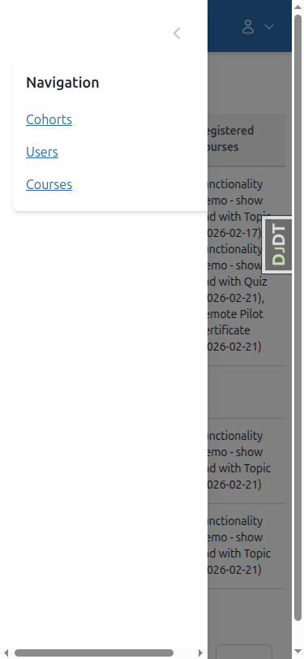

---

### Test 2: Student Course Sidebar - Mobile Behavior - PASS

**Mobile (375px):**
- Table of contents sidebar collapsed by default
- Opens as overlay with backdrop (same pattern as educator)
- Sidebar state persists

**Desktop (1920px):**
- Sidebar expanded by default with content beside it

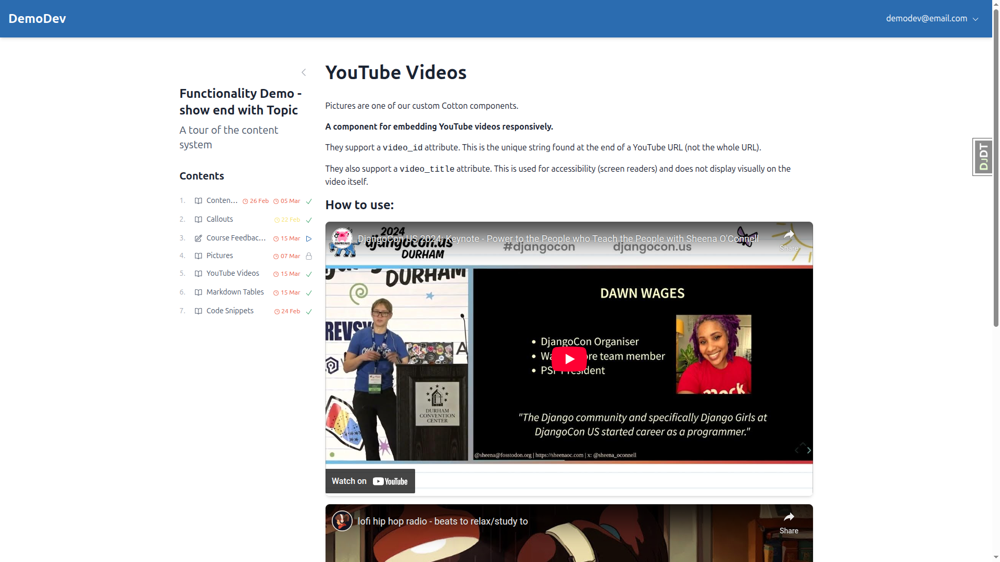

---

### Test 3: Progress Grid - Mobile Scroll - PASS

**Mobile (375px):**
- Grid is scrollable horizontally (scrollWidth: 941px in 299px container)
- First column (student names) is NOT frozen/sticky
- Floating labels appear above each row when scrolled past the student name column
- Labels disappear when scrolled back to show the first column

**Desktop (1920px):**
- Table displays normally with all visible columns

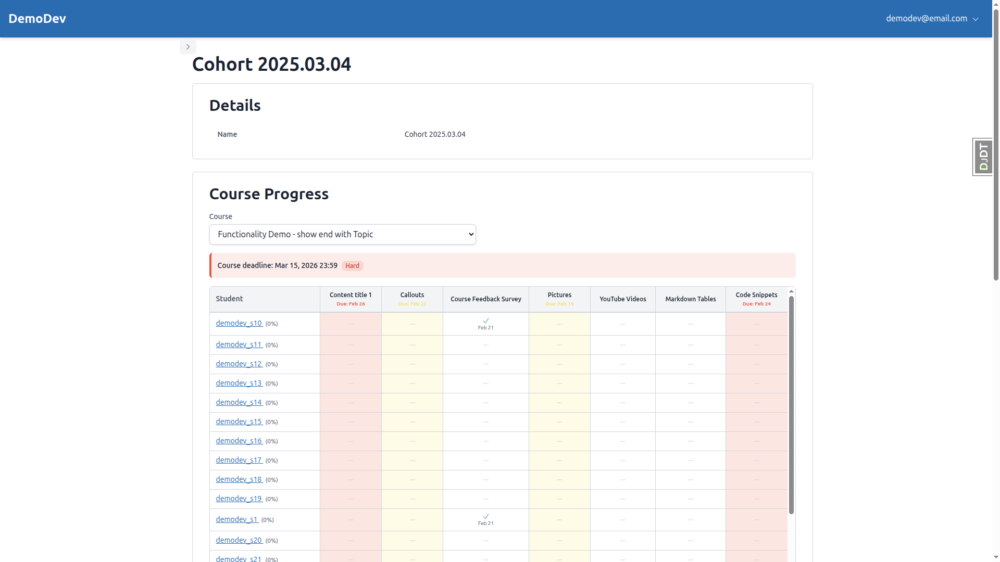

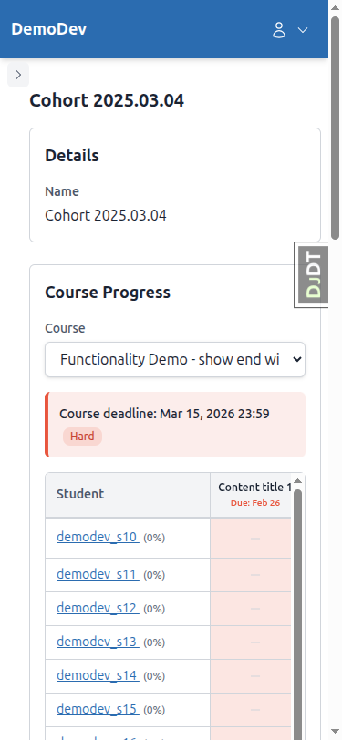
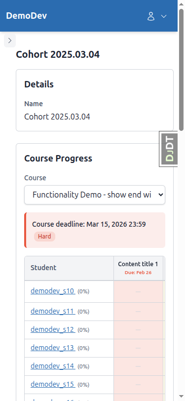

---

### Test 4: Data Tables - Mobile Scroll - PASS

**Mobile (375px):**
- Cohort table: fits within viewport without needing horizontal scroll (text wraps within cells)
- Users table: scrollable horizontally, floating labels appear when first column scrolls out of view
- Pagination working correctly

**Desktop (1920px):**
- Tables display normally with all columns visible, no floating labels

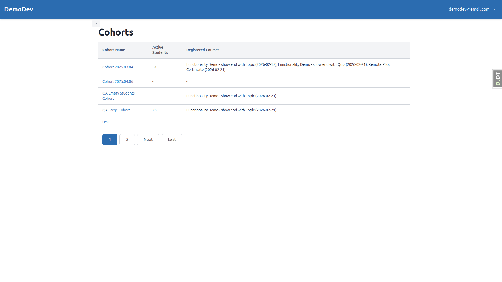

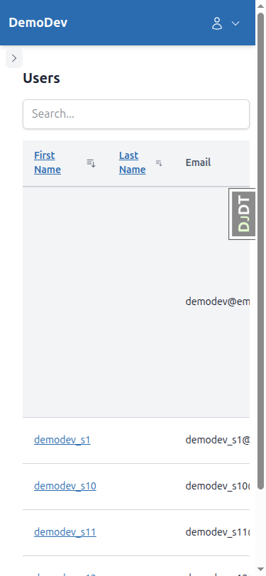
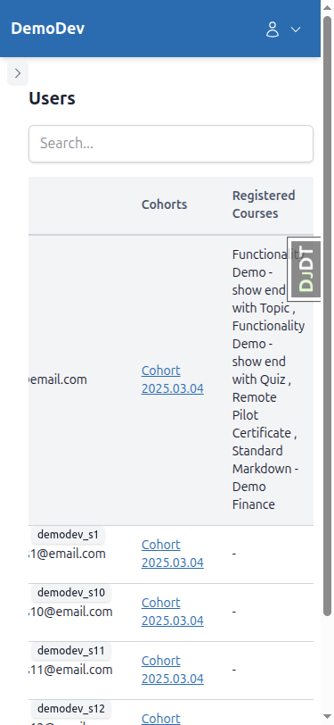
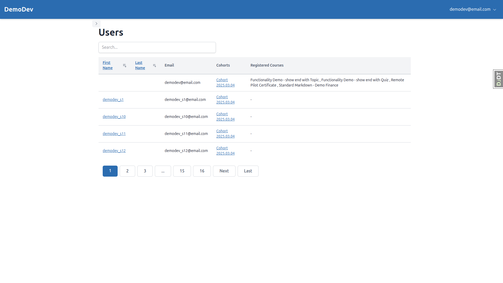

---

### Test 5: Course Dropdown - PASS

**Mobile (375px):**
- Course names are mostly visible in the native select dropdown
- Minor truncation on the longest option ("Functionality Demo - show end with Quiz (inactive)") - acceptable as it's a native browser control
- Dropdown does not overflow viewport

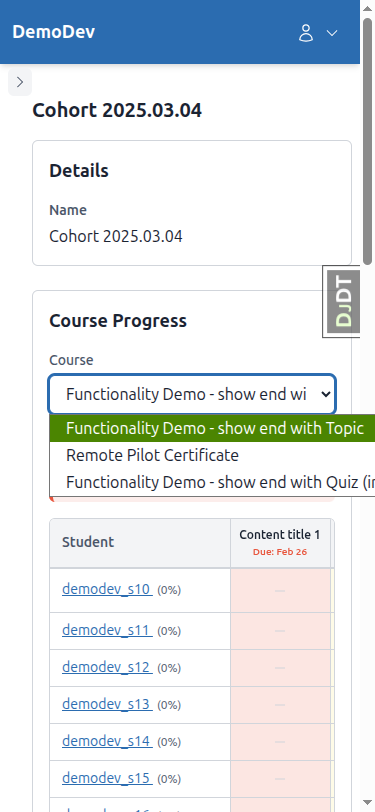

---

### Test 6: YouTube Embed - PASS

**Mobile (375px):**
- Videos maintain 16:9 aspect ratio
- Videos fill available width without horizontal scroll
- No excessive vertical space

**Tablet (768px):**
- Videos display at reasonable size, maintain aspect ratio

**Desktop (1920px):**
- Videos display well with sidebar beside content

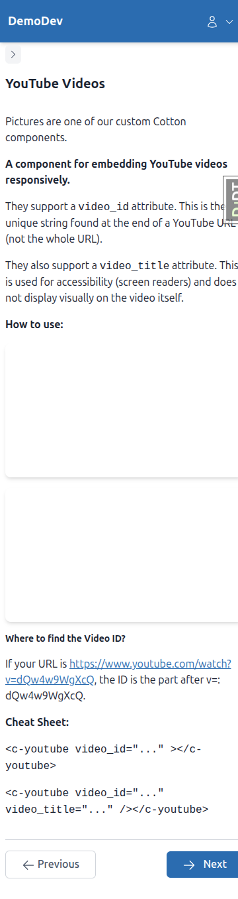
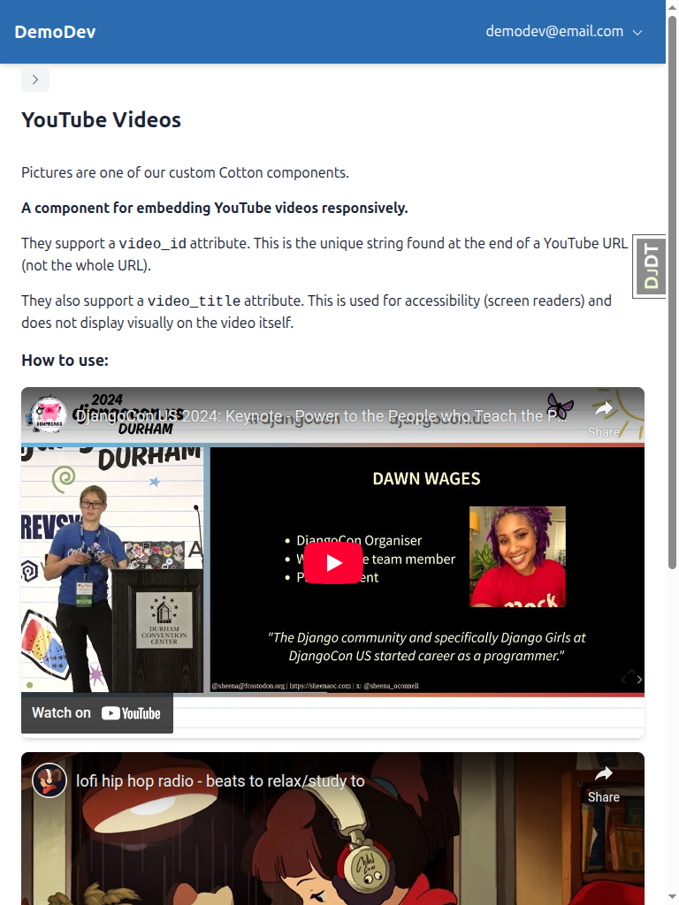

---

### Test 7: Dropdown Menu Positioning - PASS

**Mobile (375px):**
- Menu appears fully within viewport, not cut off on the right
- All items clickable

**Desktop (1920px):**
- Menu appears in expected position

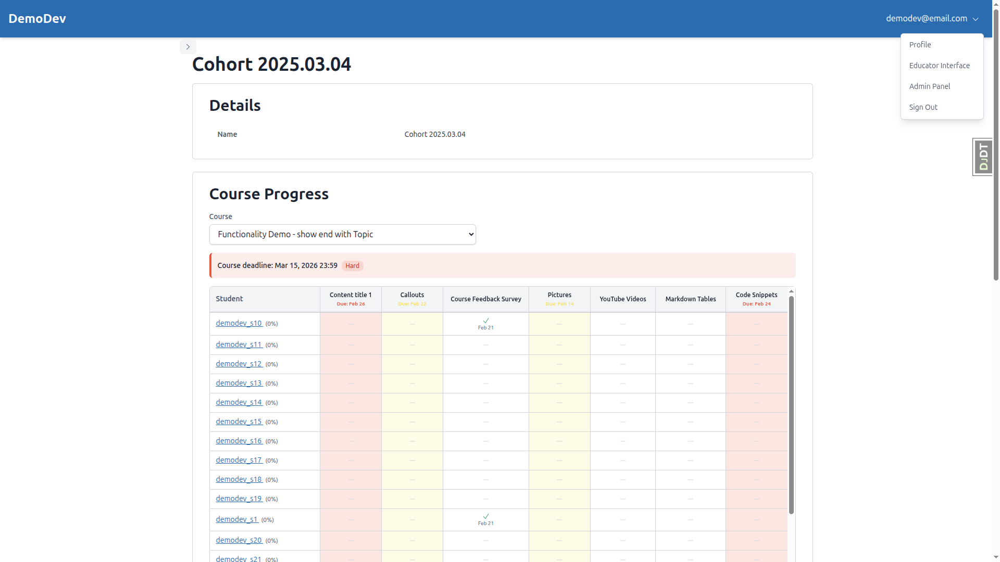
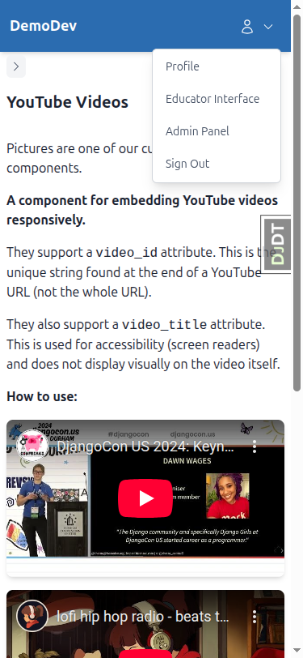

---

### Test 8: Form Long-Text Input - NOT TESTED

No form with a long-text (textarea) question was found in the available test data. The Course Feedback Survey only has radio button questions.

---

### Test 9: Form Navigation Buttons - PARTIALLY TESTED

The Course Feedback Survey is a single-page form with only a "Finish" button. No multi-page form was available to test Previous/Next button stacking.

**What was verified:**
- The "Finish" button is full-width on mobile (375px)
- The button is right-aligned at tablet (768px) and desktop (1920px)

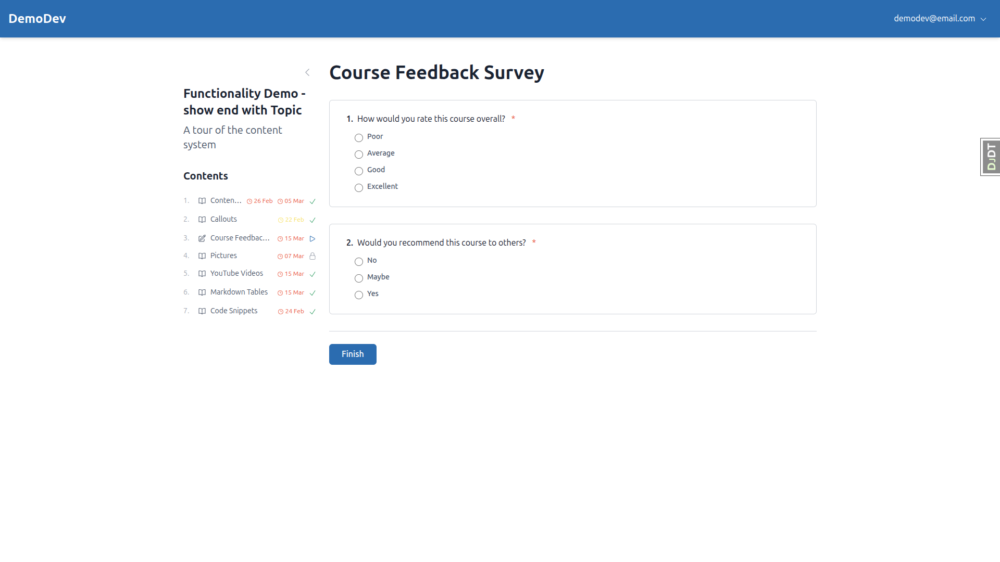
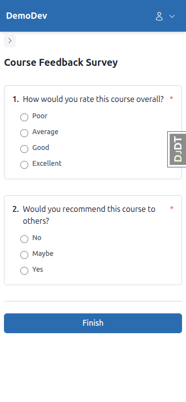
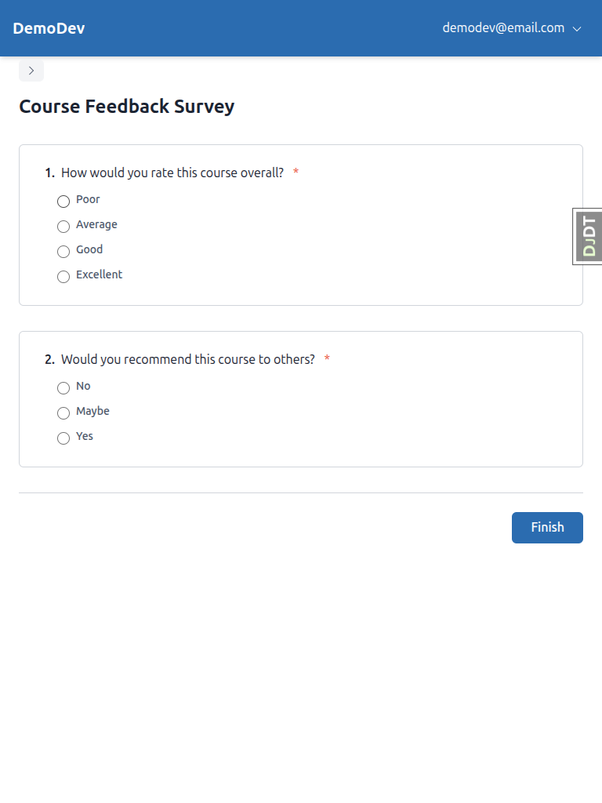

---

### Test 10: Pagination Touch Targets - PASS

**Mobile (375px):**
- Cohort list pagination uses "Page 1 of 2" with "Next" link format - adequate touch target
- Users list pagination uses numbered buttons with good sizing
- Progress grid uses "Students 1-20 of 51" with "Next >>" button

**Desktop (1920px):**
- Pagination uses compact numbered button style

---

### Test 11: Instance Details Panel - PASS

**Mobile (375px):**
- Data displayed in stacked layout (label above value) using `<dt>`/`<dd>` definition list
- No horizontal overflow
- All data readable

**Desktop (1920px):**
- Data displays in table layout (label and value side by side)

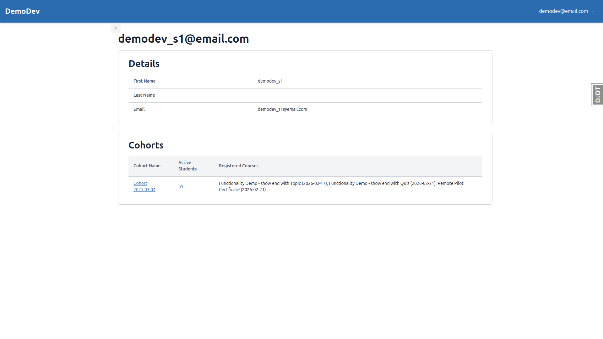
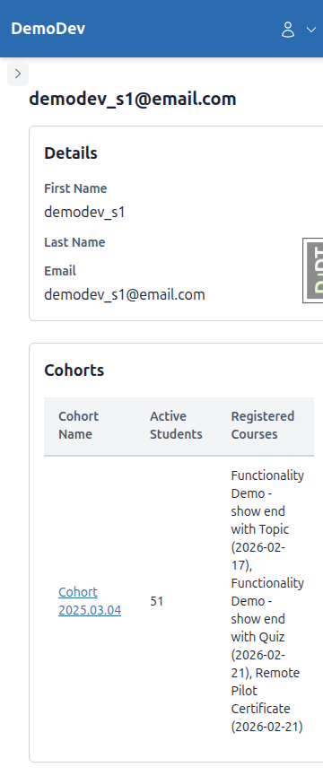

---

### Test 12: Auth Pages Mobile Padding - PASS

**Mobile (375px):**
- Login page: content has visible side padding, does not touch screen edges
- Signup page: same padding present

**Desktop (1920px):**
- Content centered with proper spacing (verified during login flow)

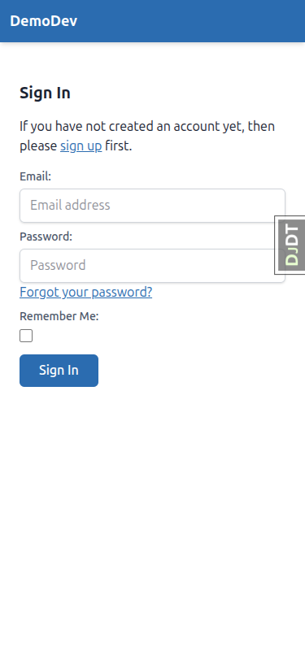
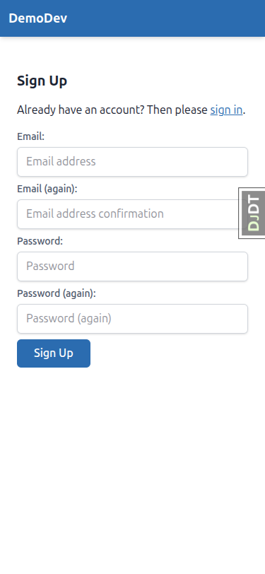

---

### Test 13: Sidebar localStorage Key Isolation - PASS

**Mobile (375px):**
- Educator sidebar uses key `sidebar-educator`
- Course TOC sidebar uses key `sidebar-course-toc`
- Opening course sidebar does not affect educator sidebar state
- States are fully independent

---

### Test 14: Full Page Sweep - No Horizontal Scroll - PASS

**Mobile (375px):**
No horizontal scrollbar found on any of the following pages:
- Login page
- Signup page
- Student home
- Course list
- Course topic view
- Form view
- Educator main interface
- Educator cohort list
- Educator user list
- Educator progress grid (table scrolls within container)
- User instance detail
- Profile page

---

### Test 15: Full Page Sweep - Desktop Regression - PASS

**Desktop (1920px):**
No regressions found on any tested page:
- Login/signup pages centered with proper spacing
- Course list displays correctly
- Course home/topic views with sidebar expanded beside content
- Form buttons horizontal with proper spacing
- Educator interface with sidebar beside content
- Tables display normally
- Instance details in table layout

---

## Tablet-Specific Observations

**Viewport: 768x1024**

- Navigation uses the mobile/overlay pattern for sidebars (breakpoint for side-by-side is `lg`/1024px). This is sensible for the 768px width.
- Tables adapt well - more columns visible than mobile but still scrollable for wide tables
- Forms render at reasonable width
- YouTube embeds maintain proper aspect ratio
- Course dropdown shows full course names without truncation

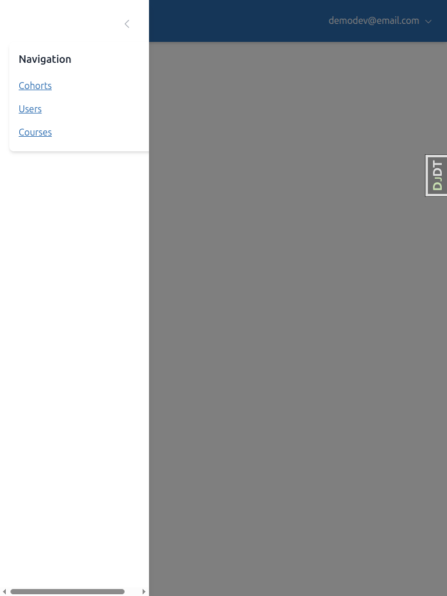
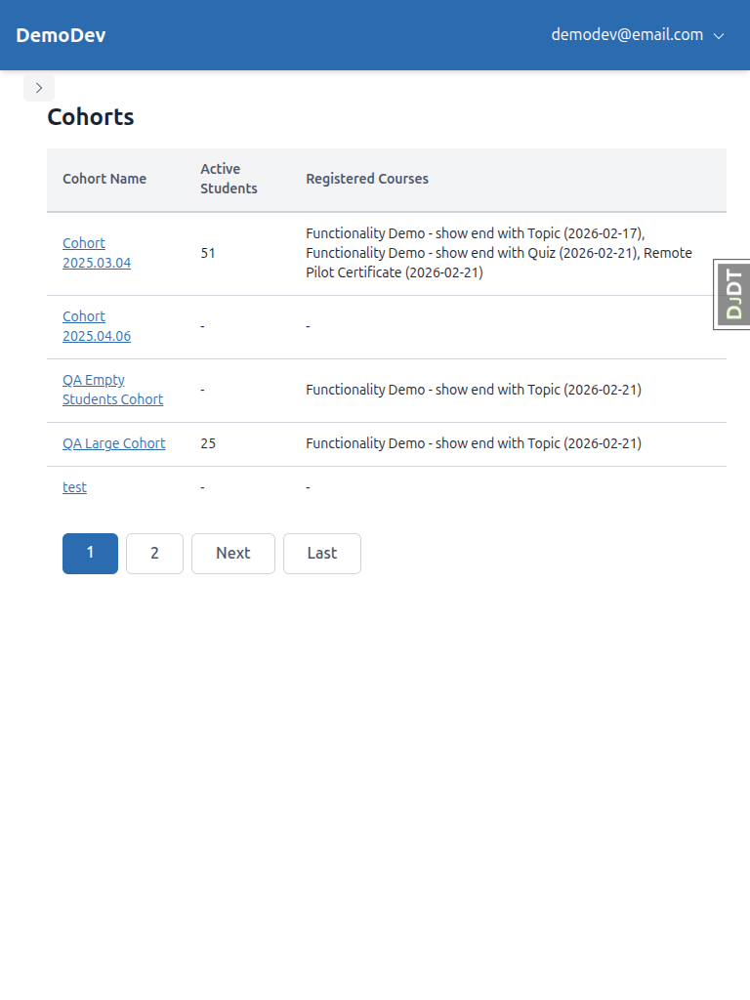

---

## Tests Not Fully Executed

| Test | Reason |
|------|--------|
| Test 8 (Form Long-Text Input) | No textarea/long-text form found in test data |
| Test 9 (Form Navigation Buttons) | No multi-page form available; only single-page form tested |
| Test 14 at 360px | Only tested at 375px; 360px viewport was not separately tested but behavior is expected to be identical |

---

## Tangential Observations

1. **Django Debug Toolbar (DJDT)** is visible on all pages in the bottom-right corner. This overlaps slightly with content on mobile. Not a bug (dev tool only), but worth noting.

2. **First row in users table has no first/last name**: The demodev@email.com user has empty first name and last name cells, which creates a large empty space in the first row of the users table. This is a data issue, not a responsive issue.

3. **Favicon 404**: A console error `Failed to load resource: the server responded with a status of 404 (Not Found)` for `/favicon.ico` appears on page load. Minor issue, not related to responsiveness.
