# Mobile Responsiveness Audit - QA Report

**Date:** 2026-03-08
**Tester:** Claude (automated via Playwright MCP)
**Viewports tested:** Desktop (1920x1080), Mobile (375x812), Tablet (768x1024)

---

## Summary

All mobile responsiveness fixes are working correctly. One bug was found during initial QA (floating row labels not visible on mobile table scroll) and was fixed during this session.

### Results Overview

| Test | Status | Notes |
|------|--------|-------|
| Test 1: Educator Sidebar | PASS | Mobile overlay, persistence, backdrop all working |
| Test 2: Student Course Sidebar | PASS | Same shared component, works identically |
| Test 3: Progress Grid Mobile Scroll | PASS (fixed) | Labels now use overlay positioning instead of sticky-in-cell |
| Test 4: Data Tables Mobile Scroll | PASS (fixed) | Same fix applied to data-table component |
| Test 5: Course Dropdown | PASS | Full width, no truncation |
| Test 6: YouTube Embed | PASS | Responsive aspect ratio maintained |
| Test 7: Dropdown Menu Positioning | PASS | Stays within viewport |
| Test 8: Form Long-Text Input | Not tested | Could not find a form with long-text input in test data |
| Test 9: Form Navigation Buttons | PASS | Stacked on mobile, horizontal on desktop |
| Test 10: Pagination Touch Targets | PASS | Adequate sizing on mobile |
| Test 11: Instance Details Panel | PASS | Stacked on mobile, table on desktop |
| Test 12: Auth Pages Mobile Padding | PASS | Visible side padding present |
| Test 13: Sidebar localStorage Isolation | PASS | Independent state confirmed |
| Test 14: Full Page Sweep - No Horizontal Scroll | PASS | No horizontal scrollbar on tested pages |
| Test 15: Desktop Regression | PASS | No regressions found |

---

## FIXED: Floating Row Labels on Mobile Table Scroll (Tests 3 & 4)

### Issue Found During QA

When scrolling data tables or the progress grid horizontally on mobile (375px), the floating row labels were **not visible**. The original implementation used `position: sticky; left: 0` on `` elements prepended inside table cells. This didn't work because `position: sticky` on a child element inside a table cell doesn't keep it visible when the cell itself scrolls out of view.

### Fix Applied

Changed both `data-table.html` and `course_progress_panel.html` to use an **overlay approach**:
- Labels are placed in a separate `
` overlay positioned absolutely over the scroll container
- Each label uses `position: absolute` with `top` set to the corresponding row's `offsetTop`
- The overlay is shown/hidden based on horizontal scroll position
- The overlay's `top` is adjusted for vertical scroll to keep labels aligned with rows
- On desktop (`min-width: 768px`), the overlay is never initialized (early return in `init()`)

### Verification

After the fix:
- Labels appear correctly at the left edge when scrolling right past the first column
- Labels disappear when scrolling back to reveal the first column
- No labels appear on desktop
- All 253 tests still pass

**Progress grid with labels visible after fix:**
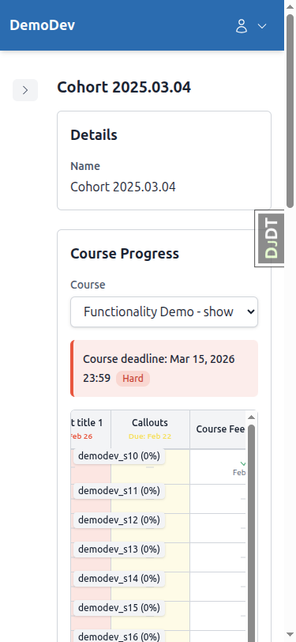

---

## PASS Details

### Test 1: Educator Sidebar - Mobile Behavior

**Desktop (1920x1080):** Sidebar expanded by default, content beside it. No backdrop. Toggle works.

**Mobile (375x812):** Sidebar collapsed by default. Opens as overlay with semi-transparent backdrop. Backdrop click closes sidebar. State persists via localStorage.

**Tablet (768x1024):** Sidebar collapsed (below 1024px threshold). Opens as overlay with backdrop, same as mobile.
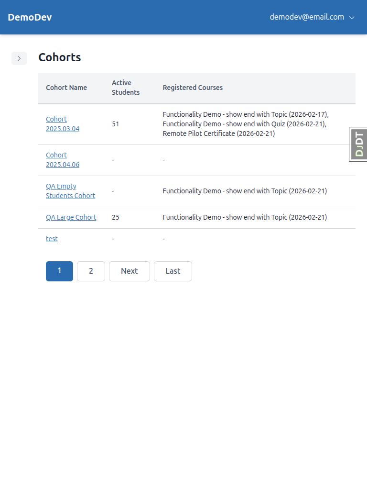

### Test 2: Student Course Sidebar

**Desktop:** Sidebar expanded, content beside it.
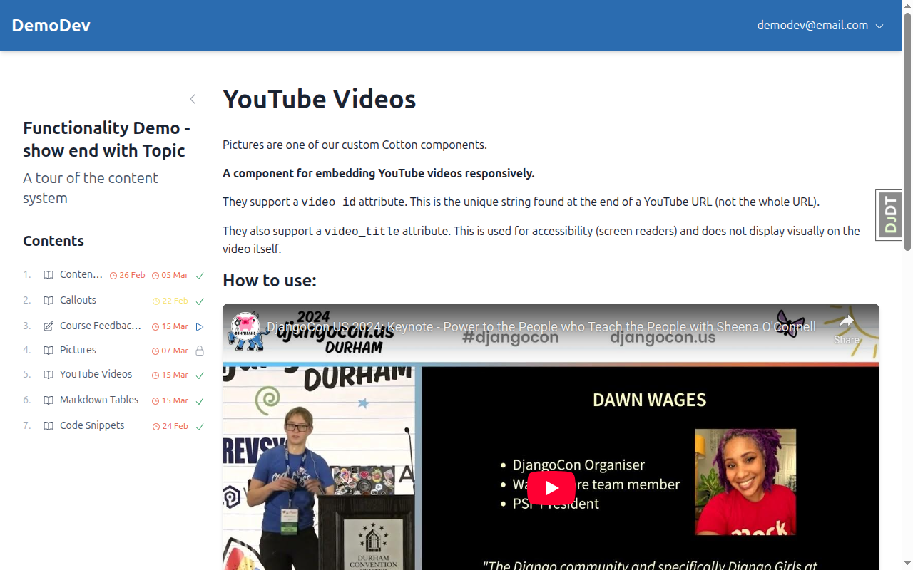

**Tablet:** Sidebar collapsed, opens as overlay.
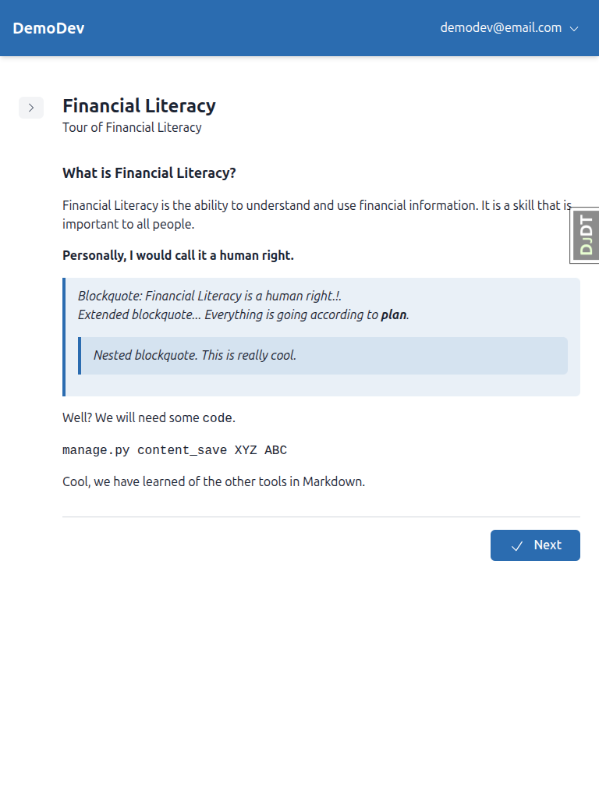
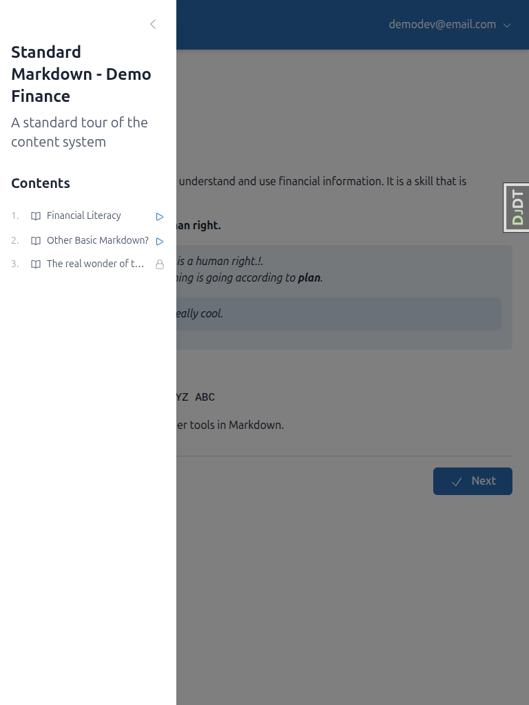

### Test 6: YouTube Embed

**Mobile:** Video uses `aspect-video` class, fills width, maintains 16:9 ratio. No fixed height.
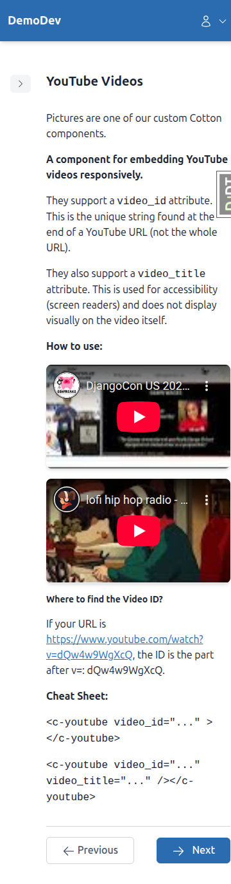

**Desktop:** Video displays at reasonable size with proper aspect ratio.
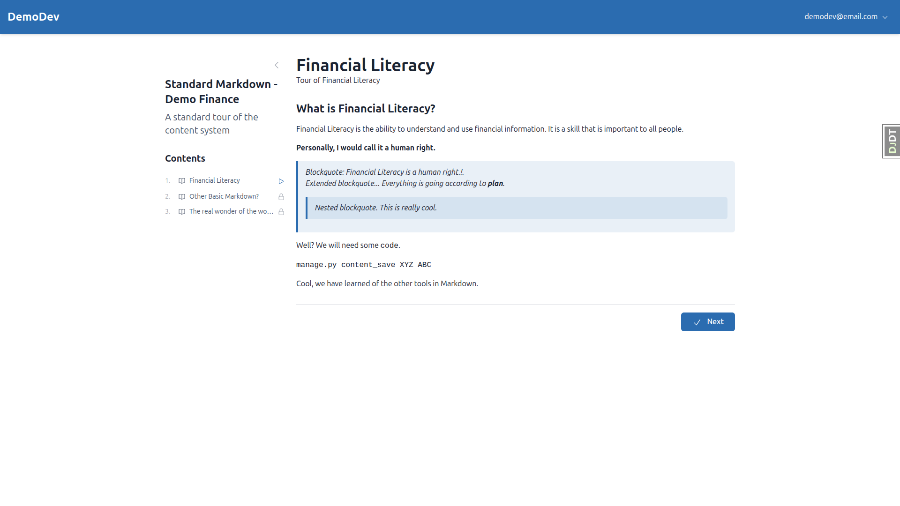

### Test 7: Dropdown Menu Positioning

**Mobile:** Dropdown stays within viewport bounds.

**Desktop:** Dropdown appears in expected position.

### Test 9: Form Navigation Buttons

**Mobile:** Buttons stacked vertically, full width. Primary action (Next) appears first.
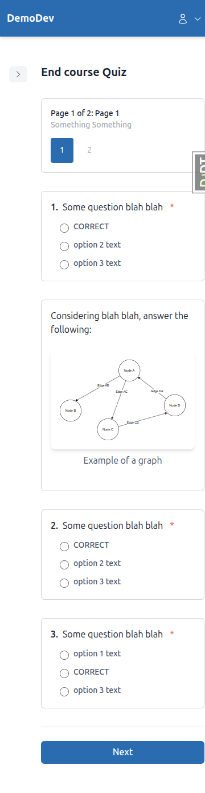
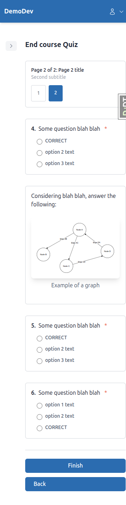

**Desktop:** Buttons horizontal with space between.
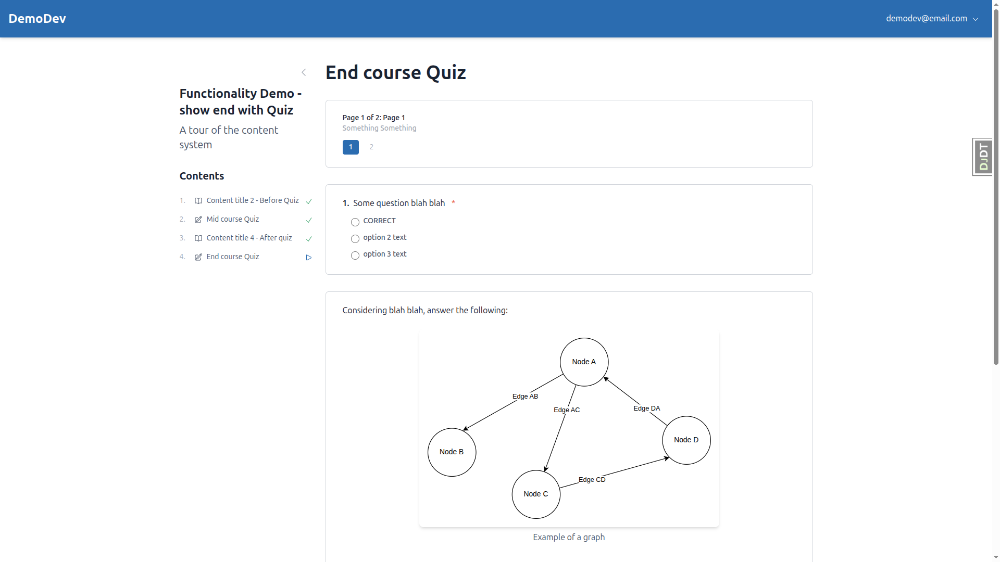

### Test 11: Instance Details Panel

**Mobile:** Stacked layout (label above value), no horizontal overflow.

**Desktop:** Table layout (label and value side by side).

### Test 12: Auth Pages Mobile Padding

**Mobile:** Content has visible side padding, does not touch screen edges.

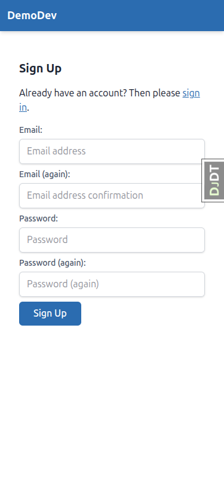

### Test 13: Sidebar localStorage Isolation

Verified: Educator sidebar uses `sidebar-educator` key, student course sidebar uses `sidebar-course-toc` key. Toggling one does not affect the other.

---

## Not Tested

### Test 8: Form Long-Text Input

Could not locate a form with a long-text (textarea) question in the available test data. The forms found contained multiple-choice and short-answer questions only. This test would need specific course content with a long-text question to verify the `ml-4` → `sm:ml-4` fix.

---

## Tablet-Specific Observations

At 768px (tablet), the system behaves as follows:
- **Sidebar:** Collapsed by default (below 1024px threshold), opens as overlay — same as mobile. This works well.
- **Data tables:** All columns visible at 768px without horizontal scroll for the cohort list. Progress grid may still need horizontal scroll depending on column count.
- **Instance details:** Uses `md:` breakpoint table layout at 768px — label and value side by side. Looks good.
- **Forms:** Previous submissions display cleanly. Navigation buttons use horizontal layout at `sm:` breakpoint (640px+).

No tablet-specific issues found.
