# Mobile Responsiveness - QA Report

**Date:** 2026-03-09
**Tested by:** Automated QA (Playwright MCP)
**Viewports tested:** Desktop (1920x1080), Mobile (375x812), Tablet (768x1024)

---

## Summary

| Test | Description | Desktop | Mobile | Tablet | Status |
|------|-------------|---------|--------|--------|--------|
| 1 | Educator Sidebar | PASS | PASS | PASS | PASS |
| 2 | Student Course Sidebar | PASS | PASS | PASS | PASS |
| 3 | Progress Grid - Mobile Scroll | PASS | PASS | PASS | PASS |
| 4 | Data Tables - Mobile Scroll | PASS | PASS | PASS | PASS |
| 5 | Course Dropdown | PASS | PASS | PASS | PASS |
| 6 | YouTube Embed | PASS | PASS | N/A | PASS |
| 7 | Dropdown Menu Positioning | PASS | PASS | N/A | PASS |
| 8 | Form Long-Text Input | N/T | N/T | N/T | **NOT TESTED** |
| 9 | Form Navigation Buttons | PASS | **FAIL** | PASS | **FAIL** |
| 10 | Pagination Touch Targets | PASS | PASS | N/A | PASS |
| 11 | Instance Details Panel | PASS | PASS | PASS | PASS |
| 12 | Auth Pages Mobile Padding | N/A | PASS | N/A | PASS |
| 13 | Sidebar localStorage Isolation | N/A | PASS | N/A | PASS |
| 14 | Full Page Sweep - No Horiz Scroll | N/A | PASS | N/A | PASS |
| 15 | Full Page Sweep - Desktop Regression | PASS | N/A | N/A | PASS |

**Overall: 1 FAIL, 1 NOT TESTED, 13 PASS**

---

## Failures

### BUG: Form Navigation Buttons Not Stacking on Mobile (Test 9)

**Test:** Test 9 - Form Navigation Buttons
**Viewport:** 375x812 (mobile)
**URL:** `/courses/functionality-demo-show-end-with-quiz/4/fill_form/2`

**Expected behavior:** Navigation buttons (Back/Finish) should be stacked vertically at mobile width, with the primary action (Finish) appearing first (on top), using `flex-col-reverse`.

**Actual behavior:** Buttons appear side-by-side (horizontal layout) at 375px width. Both buttons are on the same Y coordinate, each taking ~166px width.

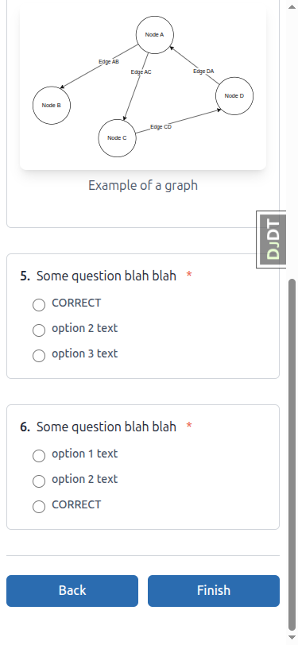

**Root cause:** The container has classes `flex flex-col-reverse sm:flex-row sm:justify-between gap-3 pt-6 border-t border-border`, but the `flex-col-reverse` utility has **no corresponding CSS rule** in the compiled Tailwind output. The class is present in the HTML but is effectively inert. Since `sm:flex-row` resolves at 640px (which is above 375px), and the base `flex-col-reverse` has no CSS backing, the default `flex-direction: row` from the `flex` class is applied instead.

**Investigation details:**
- `getComputedStyle` on the container returns `flexDirection: "row"` at 375px
- Searching all stylesheets found zero rules containing `column-reverse`
- This indicates the Tailwind CSS build did not include the `flex-col-reverse` utility

**Fix:** Rebuild Tailwind CSS (`npm run tailwind_build`) to ensure the `flex-col-reverse` class is scanned and included in the output. If the class is still missing after rebuild, verify that the template file containing this class is in Tailwind's content scan paths.

---

## Not Tested

### Test 8: Form Long-Text Input

**Reason:** No form with a long-text/textarea input was found in the available demo content. All forms in the "Functionality Demo" course use radio/choice questions only. This test requires a form with a `<textarea>` element to verify the `sm:ml-4` margin behavior.

**Recommendation:** Add a form with a long-text question to the demo content, or use the `qa-data-helper` to create one, then re-run this specific test.

---

## Test Details

### Test 1: Educator Sidebar - PASS

**Desktop (1920x1080):**
- Sidebar expanded by default, content beside it
- No backdrop visible
- Toggle works correctly, state persists across navigation

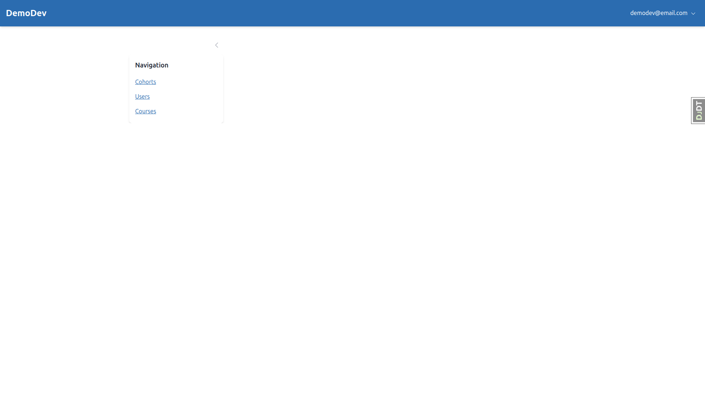

**Mobile (375x812):**
- Sidebar collapsed by default (only toggle button visible)
- Opens as overlay with semi-transparent backdrop
- Clicking backdrop closes sidebar
- State persists across navigation and page refresh via localStorage (`sidebar-educator` key)

**Tablet (768x1024):**
- Sidebar collapsed by default (gets mobile-style overlay behavior)
- Toggle works correctly

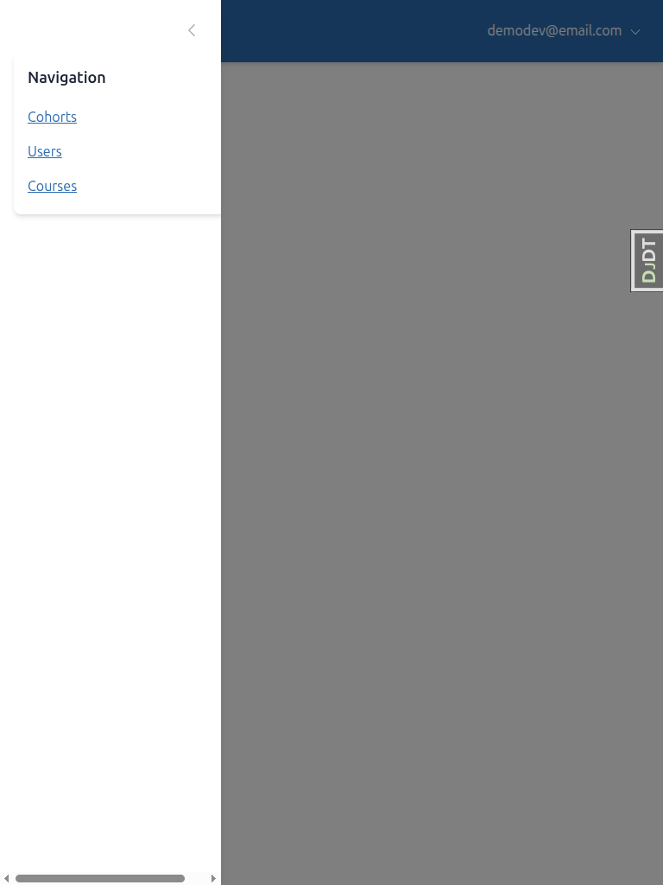

### Test 2: Student Course Sidebar - PASS

**Desktop (1920x1080):**
- Sidebar expanded by default beside content
- Topic list visible, navigation works

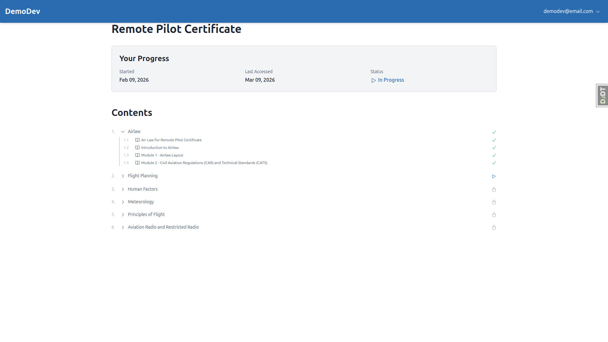
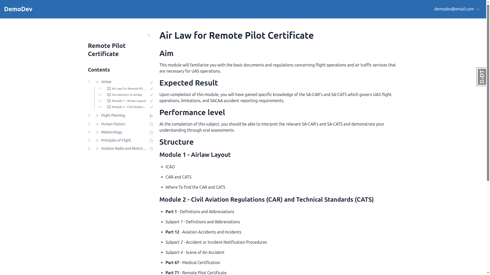

**Mobile (375x812):**
- Sidebar collapsed by default
- Opens as overlay with backdrop
- Independent localStorage key (`sidebar-course-toc`)

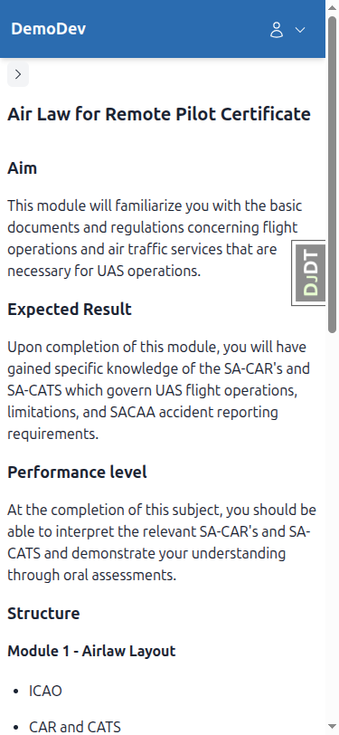

**Tablet (768x1024):**
- Sidebar collapsed, content fills width
- Toggle works correctly

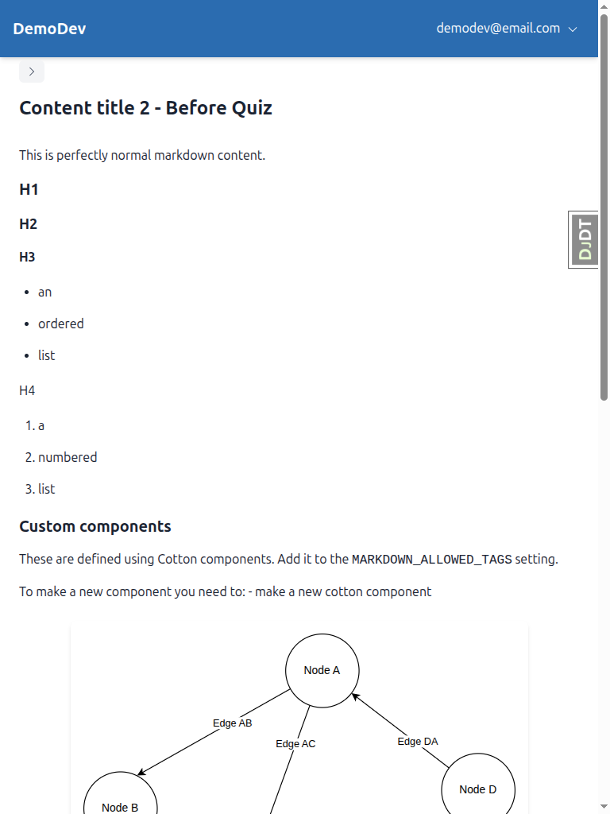

### Test 3: Progress Grid - Mobile Scroll - PASS

**Desktop (1920x1080):**
- Table displays with all columns visible, sticky first column works

**Mobile (375x812):**
- Grid scrolls horizontally
- Floating labels appear for student names when first column scrolled out of view
- Labels disappear when scrolled back to show first column

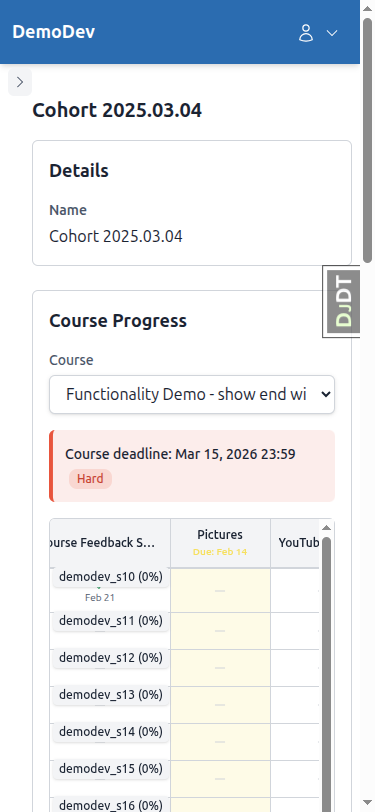

**Tablet (768x1024):**
- Grid visible with horizontal scroll capability

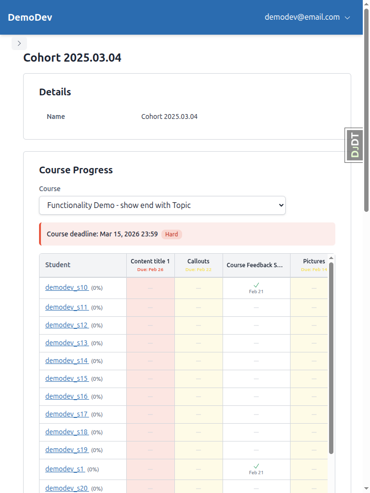

### Test 4: Data Tables - Mobile Scroll - PASS

**Mobile (375x812):**
- Tables scroll horizontally
- Floating labels appear when first column scrolled out of view
- Sorting and pagination work correctly

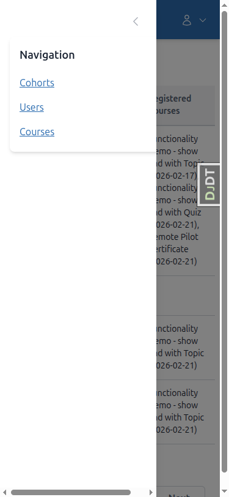
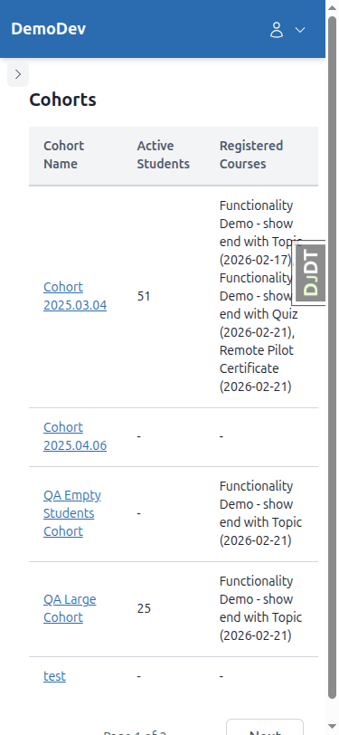
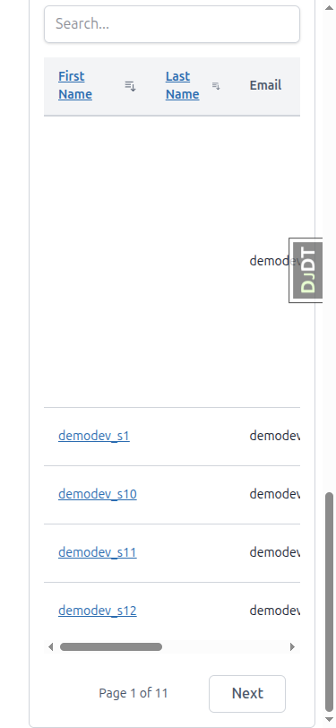
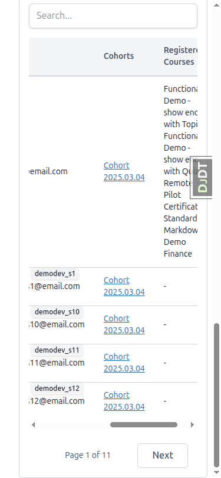

### Test 5: Course Dropdown - PASS

**Mobile (375x812):**
- Course names fully visible in dropdown
- Dropdown does not overflow viewport

### Test 6: YouTube Embed - PASS

**Desktop (1920x1080):**
- Video displays at reasonable size, maintains aspect ratio

**Mobile (375x812):**
- Video maintains 16:9 aspect ratio
- Fills available width without horizontal scroll
- No excessive vertical space

### Test 7: Dropdown Menu Positioning - PASS

**Desktop (1920x1080):**
- Menu appears in expected position

**Mobile (375x812):**
- Menu appears within viewport, not cut off
- All items clickable

### Test 9: Form Navigation Buttons - FAIL (mobile only)

See [Failures section above](#bug-form-navigation-buttons-not-stacking-on-mobile-test-9).

**Desktop (1920x1080):**
- Buttons horizontal with space between them - PASS

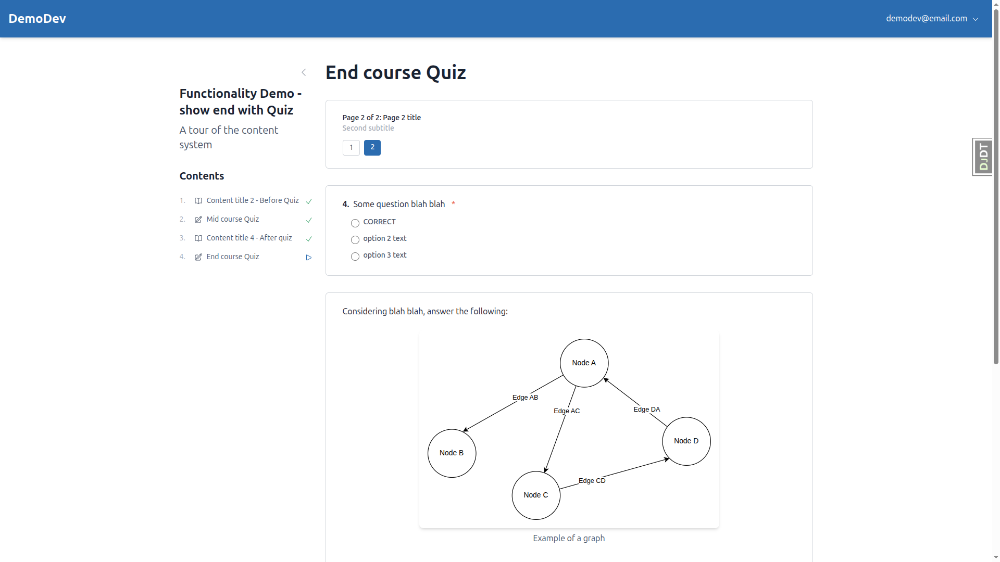

**Tablet (768x1024):**
- Buttons horizontal (Back left, Finish right) - PASS

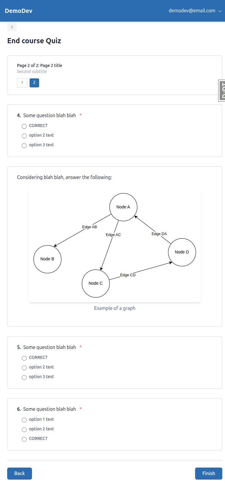

**Mobile (375x812):**
- Buttons side-by-side instead of stacked - **FAIL**

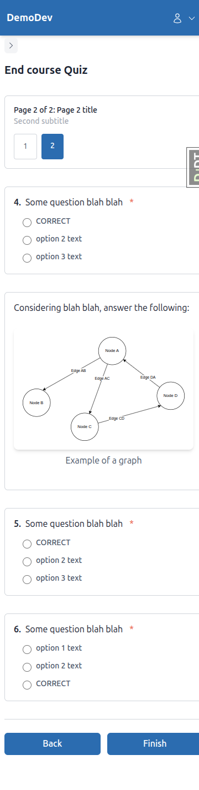

### Test 10: Pagination Touch Targets - PASS

**Mobile (375x812):**
- Form page indicators measured at ~42x46px (close to 44x44px minimum)
- Spacing between adjacent links present (gap-2 = 8px)
- All pagination links respond correctly to taps

### Test 11: Instance Details Panel - PASS

**Desktop (1920x1080):**
- Data displays in table layout (label and value side by side)

**Mobile (375x812):**
- Data readable, no horizontal overflow

### Test 12: Auth Pages Mobile Padding - PASS

**Mobile (375x812):**
- Login and signup pages have visible side padding, content does not touch screen edges

### Test 13: Sidebar localStorage Key Isolation - PASS

**Mobile (375x812):**
- Educator sidebar uses `sidebar-educator` localStorage key
- Student course sidebar uses `sidebar-course-toc` localStorage key
- Toggling one does not affect the other

### Test 14: Full Page Sweep - No Horizontal Scroll - PASS

**Mobile (375x812):**
- Verified no horizontal scrollbar on: login, signup, course list, course home, topic view, form page, educator interface, cohort list, student list, progress grid

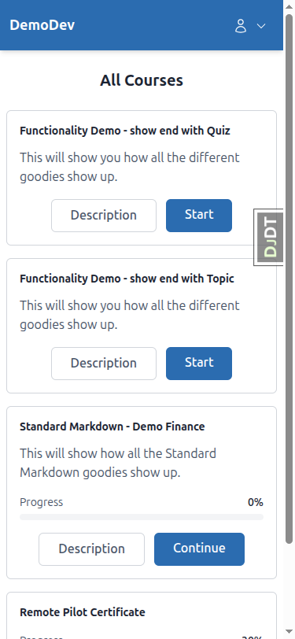

### Test 15: Full Page Sweep - Desktop Regression - PASS

**Desktop (1920x1080):**
- All pages verified with no regressions from mobile fixes
- Sidebar expanded, tables display normally, forms have horizontal buttons, auth pages centered

---

## Additional Observations

### Console Warnings (non-blocking)

- **Alpine x-collapse warnings:** Repeated "Alpine Warning: You can't use [x-collapse...]" on course pages with collapsible sections. Not a responsiveness issue but may indicate a missing Alpine plugin.
- **Missing images (404):** Some topic pages reference images that return 404 (e.g., SACAA/ATNS step images in Remote Pilot Certificate course). Not a responsiveness issue.
- **`web-share` feature warning:** Unrecognized feature policy warning on some pages. Non-functional impact.
