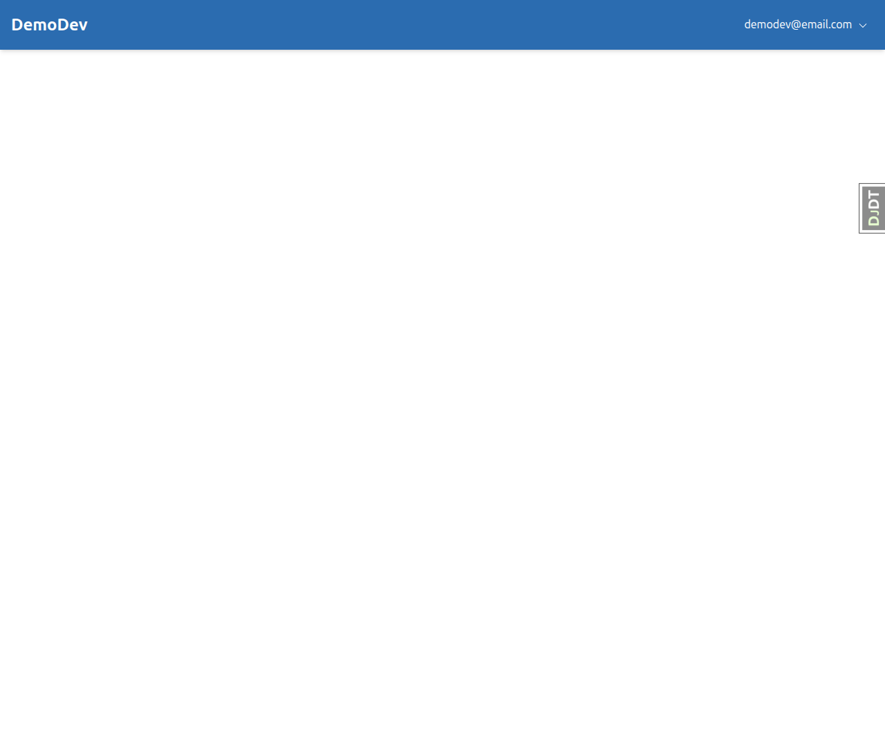
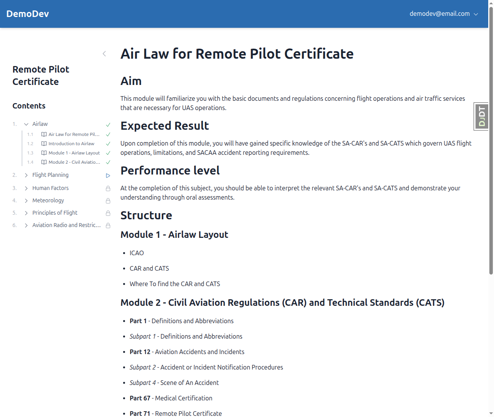
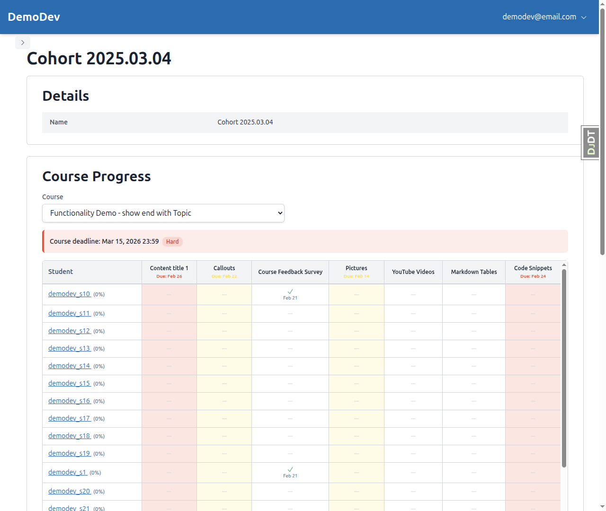
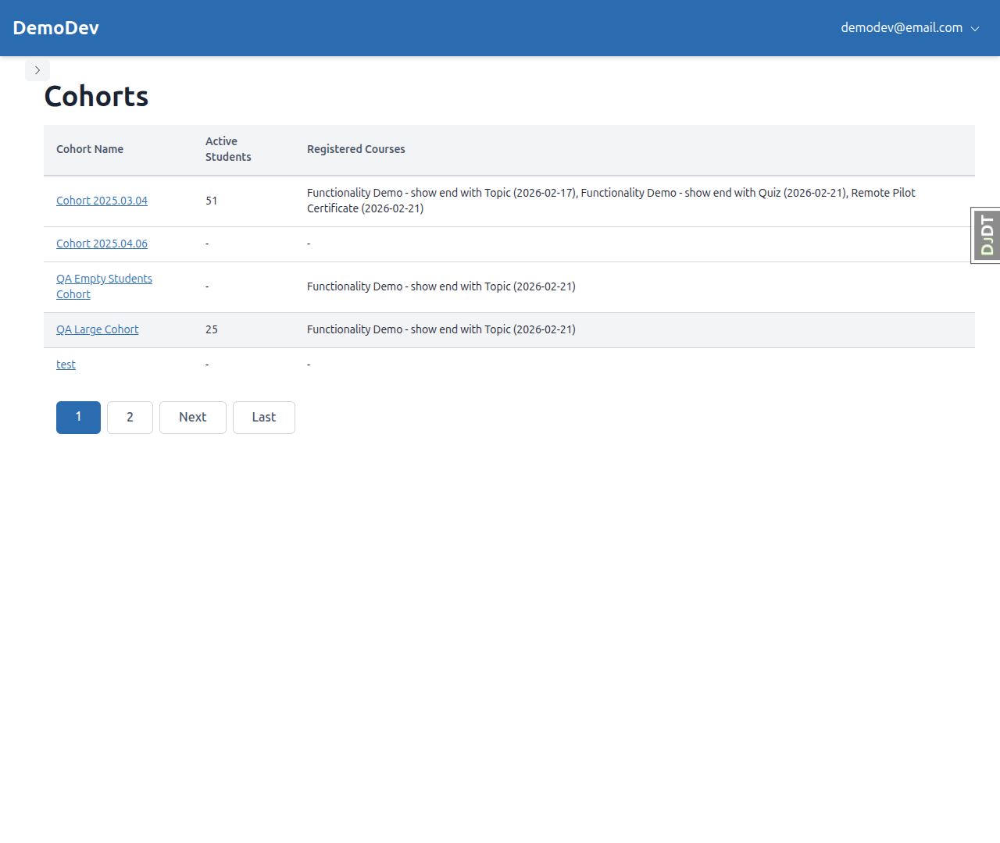
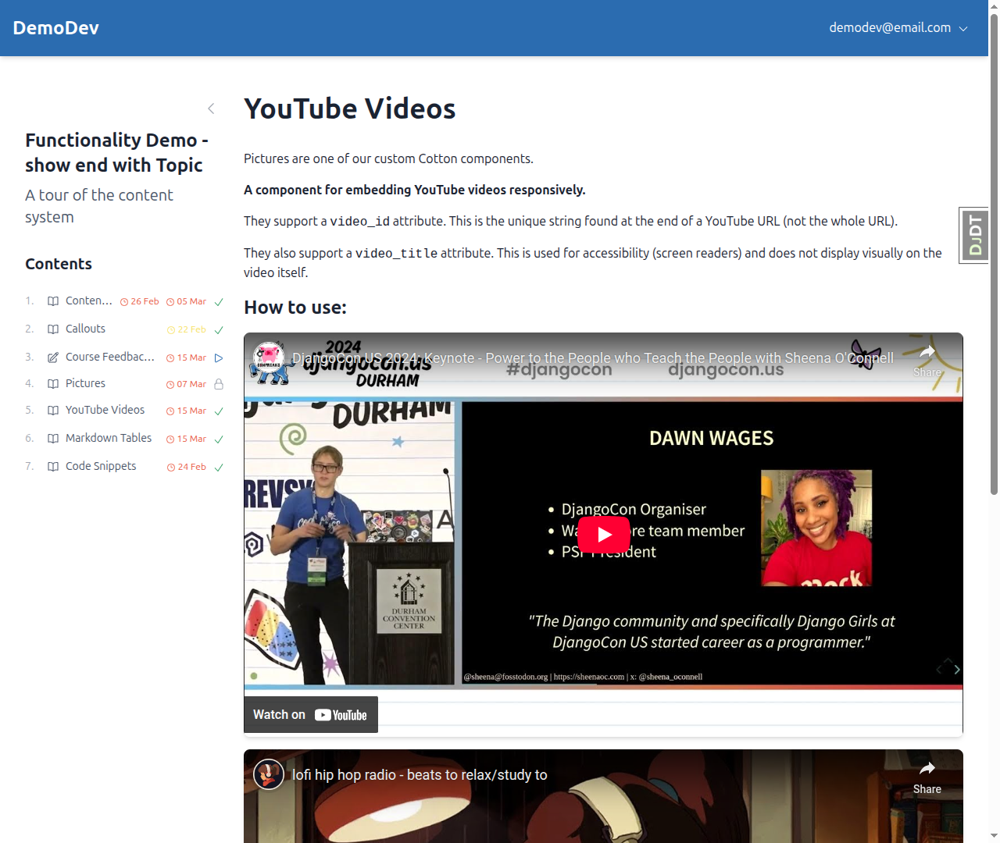
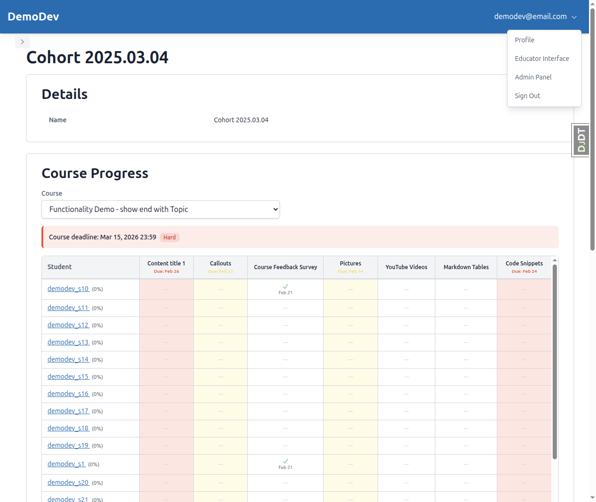
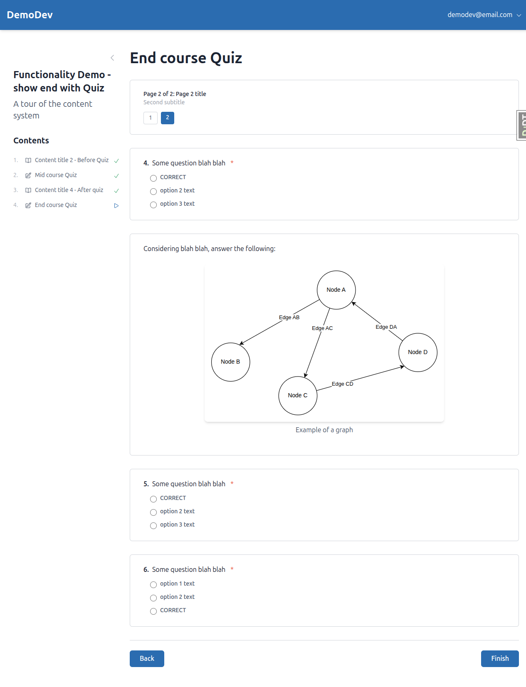
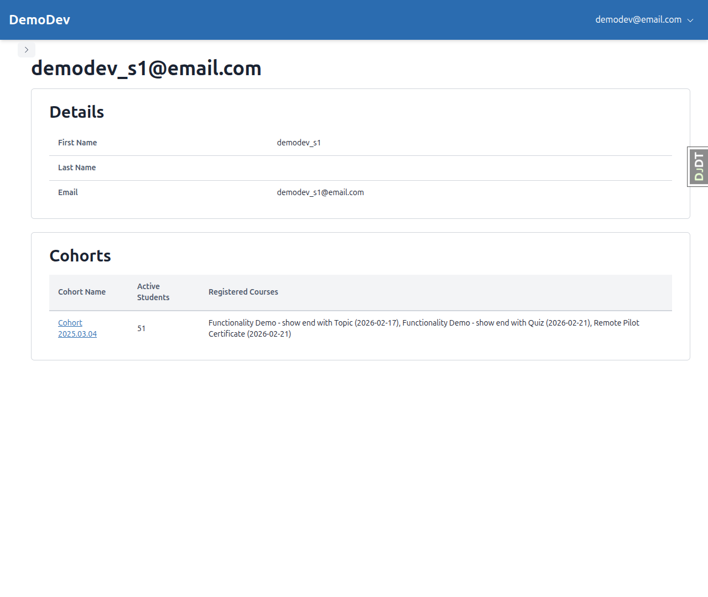
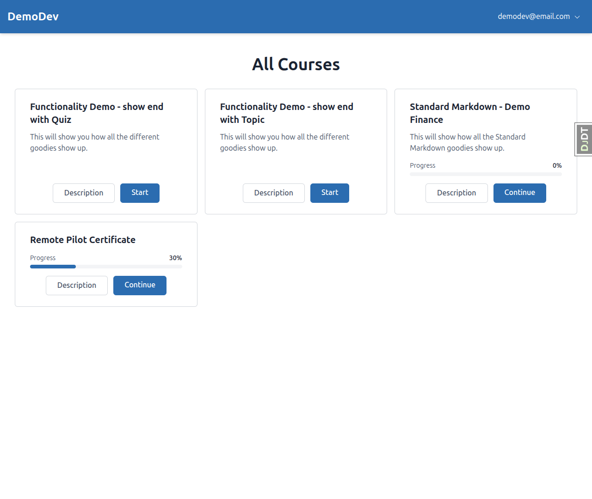

# Mobile Responsiveness - QA Report

**Date:** 2026-03-10
**Tester:** Claude (automated via Playwright MCP)
**Viewports tested:** Desktop (1280x1080), Mobile (375x812), Tablet (768x1024)

---

## Critical Bug Found & Fixed During QA

### BUG: Alpine.js `$persist` broken - Educator page completely blank

**Test:** Test 1 (Educator Sidebar)
**Severity:** Critical (P0)
**Status:** Fixed during QA

**Expected:** Educator interface loads with sidebar and content.
**Actual:** Page was completely blank. Alpine.js console errors: `this.$persist is not a function` and `sidebarOpen is not defined`.

**Root cause:** In `freedom_ls/base/templates/cotton/sidebar.html` line 4, `this.$persist(...)` was used in the `x-data` object literal. Alpine.js magics like `$persist` are not available via `this` in x-data property definitions.

**Fix applied:** Changed `this.$persist(...)` to `$persist(...)` (removed `this.`).

---

## Test Results Summary

| Test | Desktop (1280px) | Mobile (375px) | Tablet (768px) |
|------|-----------------|----------------|----------------|
| 1. Educator Sidebar | PASS | PASS | PASS |
| 2. Student Course Sidebar | PASS | PASS | PASS |
| 3. Progress Grid Mobile Scroll | PASS | PASS | PASS |
| 4. Data Tables Mobile Scroll | PASS | PASS | PASS |
| 5. Course Dropdown | PASS | N/A | PASS |
| 6. YouTube Embed | PASS | PASS | N/A |
| 7. Dropdown Menu Positioning | PASS | PASS | N/A |
| 8. Form Long-Text Input | Not tested (no long-text form found) | | |
| 9. Form Navigation Buttons | PASS | PASS | PASS |
| 10. Pagination Touch Targets | PASS | PASS | N/A |
| 11. Instance Details Panel | PASS | PASS | N/A |
| 12. Auth Pages Mobile Padding | N/A | PASS | N/A |
| 13. Sidebar localStorage Isolation | Not tested (see notes) | | |
| 14. Full Page Sweep - No Horizontal Scroll | N/A | PASS | N/A |
| 15. Full Page Sweep - Desktop Regression | PASS | N/A | N/A |

---

## Detailed Test Results

### Test 1: Educator Sidebar

**Desktop (1280px):** Sidebar expanded by default, content beside it. No backdrop. Toggle works, state persists across navigation.

**Mobile (375px):** Sidebar collapsed by default. Opens as overlay with backdrop. Backdrop click closes. State persists after navigation.

**Tablet (768px):** Gets mobile-style collapsed sidebar (768px < 1024px breakpoint). Overlay behavior works correctly.

### Test 2: Student Course Sidebar

**Desktop:** Sidebar expanded with course TOC, content beside it.

**Mobile:** Sidebar collapsed by default, content fills screen.

**Tablet:** Sidebar collapsed, content fills width nicely.

### Test 3: Progress Grid Mobile Scroll

**Desktop:** Table displays normally with all columns visible.

**Mobile:** Grid scrolls horizontally. Floating student name labels appear when first column scrolls out of view and disappear when scrolled back.

**Tablet:** Progress grid with scrollable area, fits well.

### Test 4: Data Tables Mobile Scroll

**Desktop:** Cohort list table displays normally with all columns visible.

**Mobile:** Table readable but columns are somewhat cramped at 375px. Pagination simplified to "Page X of Y" with Next button.

### Test 5: Course Dropdown

**Desktop & Tablet:** Course dropdown fully readable, course names not truncated.

### Test 6: YouTube Embed

**Desktop:** Videos display at reasonable size, maintain 16:9 aspect ratio.

**Mobile:** Videos fill available width, maintain aspect ratio, no horizontal scroll.

### Test 7: Dropdown Menu Positioning

**Desktop:** Menu appears in expected position, fully interactive.

**Mobile:** Menu appears fully within viewport, not cut off on the right.

### Test 9: Form Navigation Buttons

**Desktop:** Buttons horizontal with space between them (Back left, Finish right).

**Mobile:** Buttons stacked vertically, full-width. Primary action (Finish) appears first.

**Tablet:** Buttons horizontal with space between them.

### Test 11: Instance Details Panel

**Desktop:** Data in table layout (label and value side by side).

**Mobile:** Data switches to stacked layout (label above value) using definition list.

### Test 12: Auth Pages Mobile Padding

**Mobile:** Login and signup pages have visible side padding, content does not touch screen edges.

### Test 14: Full Page Sweep - No Horizontal Scroll

**Mobile (375px):** Tested course list, educator interface, cohort list, cohort detail, topic pages, form pages, login, signup. No horizontal overflow detected on any page.

### Test 15: Full Page Sweep - Desktop Regression

**Desktop (1280px):** Tested all major pages. No regressions from mobile fixes. Layouts correct.

---

## Tests Not Fully Executed

### Test 8: Form Long-Text Input
**Reason:** Could not find a form with a long-text (textarea) question in the available demo data. All forms found had radio/choice questions only.

### Test 13: Sidebar localStorage Key Isolation
**Reason:** Not explicitly tested as a separate flow. However, the sidebar component uses dynamic storage keys (`sidebar-educator` vs `sidebar-course`) which should isolate state. The sidebar component code confirms separate `.as('{{ storage_key }}')` calls.

---

## Tangential Issues Discovered

### 1. Server error when re-filling completed form
**URL:** `/courses/functionality-demo-show-end-with-quiz/2/fill_form/1`
**Error:** `AttributeError: 'NoneType' object has no attribute 'existing_answers_dict'`
**Location:** `freedom_ls/student_interface/views.py`, line 374, in `form_fill_page`
**Description:** When navigating directly to a `fill_form` page for a quiz that has already been completed, the server returns a 500 error. The `form_progress` object is `None`, causing the AttributeError. This is not a mobile responsiveness issue but was encountered during testing.

### 2. Console error: favicon.ico 404
A minor `favicon.ico` 404 error appears on every page load. Not a responsiveness issue.

### 3. Student list first row excessive whitespace
On mobile (375px), the student list table's first row (for demodev@email.com) had noticeably excessive vertical whitespace compared to other rows, likely due to the long content in the "Registered Courses" cell wrapping at narrow widths.
