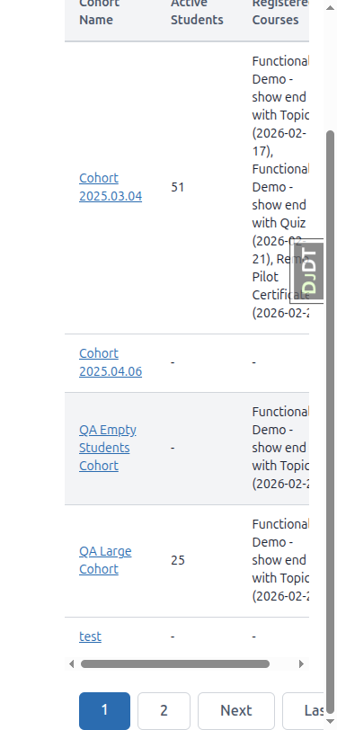
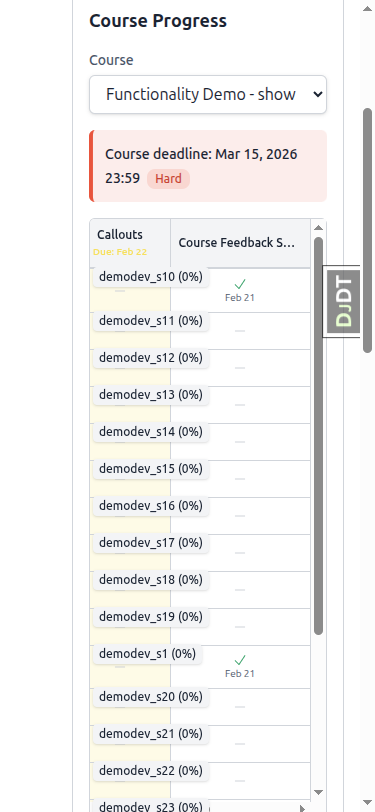
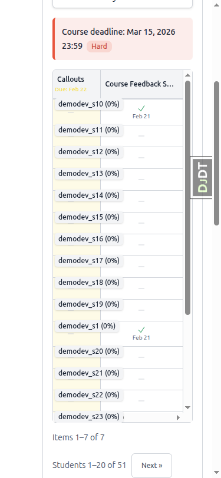
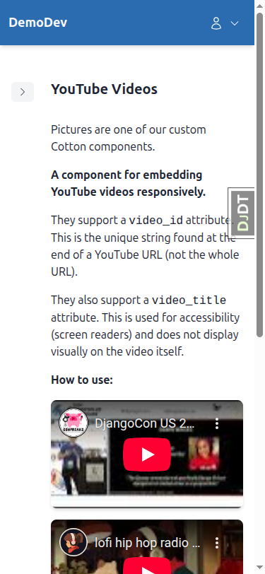
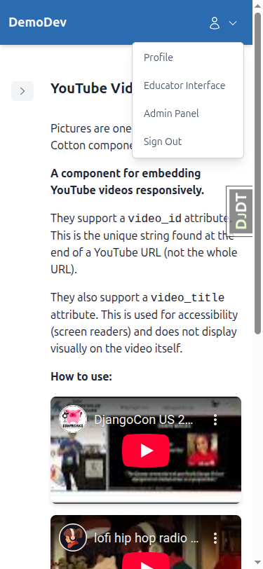
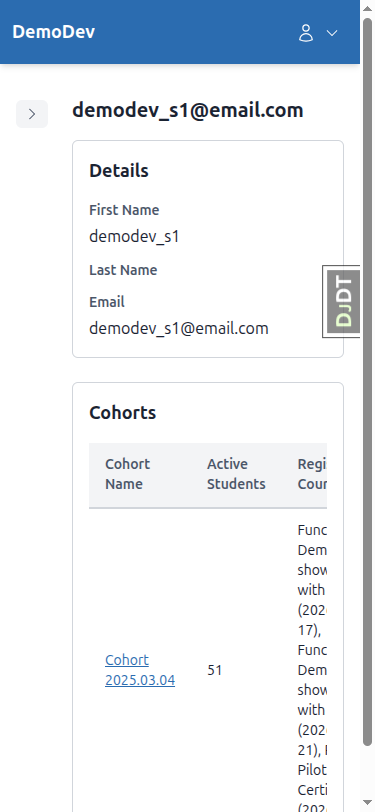
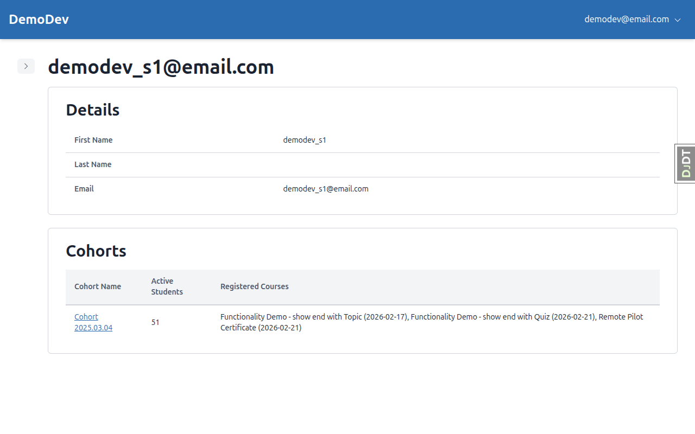
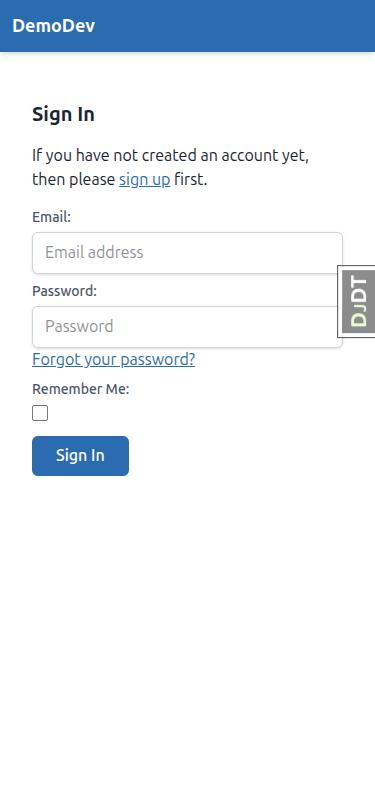

# Mobile Responsiveness - QA Report

**Date:** 2026-03-09
**Tester:** Claude (automated QA via Playwright MCP)
**Viewports tested:** 375x812 (mobile), 768x1024 (tablet), 1280x800 (desktop)

---

## Summary

Overall, the mobile responsiveness implementation is **solid**. The vast majority of tests pass across all three viewport sizes. The sidebar overlay pattern, floating table scroll labels, stacked detail layouts, and YouTube responsive embeds all work as expected.

**Tests Passed:** 13 of 15
**Minor Issues Found:** 2

---

## Passed Tests

| Test | Description | Status |
|------|-------------|--------|
| Test 1 | Educator Sidebar - Mobile & Desktop | PASS |
| Test 2 | Student Course Sidebar - Mobile & Desktop | PASS |
| Test 3 | Progress Grid - Mobile Scroll with floating labels | PASS |
| Test 4 | Data Tables - Mobile Scroll with floating labels | PASS |
| Test 5 | Course Dropdown | PASS (see note) |
| Test 6 | YouTube Embed - responsive 16:9 | PASS |
| Test 7 | Dropdown Menu Positioning | PASS |
| Test 11 | Instance Details Panel - stacked on mobile, table on desktop | PASS |
| Test 12 | Auth Pages Mobile Padding | PASS |
| Test 13 | Sidebar localStorage Key Isolation | PASS |
| Test 14 | Full Page Sweep - No Horizontal Scroll | PASS |
| Test 15 | Full Page Sweep - Desktop Regression | PASS |

---

## Issues Found

### Issue 1: Pagination touch targets slightly under 44px minimum

**Test:** Test 10 - Pagination Touch Targets
**Page:** Educator cohort list pagination (and likely all paginated pages)
**Expected:** Pagination links should be at least 44x44px for comfortable touch targets
**Actual:** Pagination links measure 42px tall (width is fine at 59-86px). This is 2px short of the 44px minimum.

**Severity:** Low - the buttons are close to the minimum and are still usable. The spacing between them is adequate.

---

### Issue 2: Course dropdown shows truncated course name on mobile

**Test:** Test 5 - Course Dropdown
**Page:** Educator cohort detail, Course Progress section
**Expected:** Course names should be fully visible in the dropdown
**Actual:** The native `<select>` dropdown shows "Functionality Demo - show" (truncated) at 375px width. When tapped, the native mobile picker shows the full names, so this is a display-only issue with the collapsed dropdown.

**Severity:** Low - the native mobile picker overlay shows full names when tapped. The truncation in the collapsed state is a cosmetic issue inherent to the viewport width.

---

## Tests Not Fully Executed

### Test 8: Form Long-Text Input
Could not fully test - the available forms (Course Feedback Survey) only contain radio button questions, not long-text/textarea fields. No form with a textarea question was found in the demo content.

### Test 9: Form Navigation Buttons (Previous/Next)
Could not fully test - the available form (Course Feedback Survey) is a single-page form with only a "Finish" button. No multi-page form was available to test Previous/Next button stacking behavior. The "Finish" button on mobile is full-width which is correct.

### Test 10: Progress Grid Pagination Touch Targets
The progress grid pagination ("Next >>") button was observed but not measured separately from the data table pagination. The same 42px height likely applies.

---

## Detailed Test Results

### Test 1: Educator Sidebar
- **Mobile (375px):** Sidebar collapsed by default. Opens as overlay with semi-transparent backdrop. Backdrop click closes sidebar. State persists across navigation and page refresh via `sidebar-educator` localStorage key.
- **Desktop (1280px):** Sidebar expanded by default (after clearing localStorage). Content displays beside sidebar. Toggle works, state persists.
- **Tablet (768px):** Sidebar collapsed by default. Opens as overlay (same as mobile behavior).

### Test 2: Student Course Sidebar
- **Mobile (375px):** Sidebar collapsed by default on topic pages. Opens as overlay with backdrop. Closes on backdrop click.
- **Desktop (1280px):** Sidebar expanded by default beside content.
- **Tablet (768px):** Sidebar collapsed by default. Opens as overlay.

### Test 3: Progress Grid - Mobile Scroll
- **Mobile (375px):** Grid scrolls horizontally. When scrolled right past the Student column, floating labels showing student names ("demodev_s10 (0%)", etc.) appear above each row. Labels disappear when scrolled back.
- **Desktop (1280px):** Table displays normally with all columns visible.

### Test 4: Data Tables - Mobile Scroll
- **Mobile (375px):** Users table scrolls horizontally. Floating labels appear when first column scrolls out of view.
- **Desktop (1280px):** Tables display normally with all columns visible.

### Test 5: Course Dropdown
- **Mobile (375px):** Dropdown does not overflow viewport. Course name is truncated in collapsed state but full names are accessible via native picker.

### Test 6: YouTube Embed
- **Mobile (375px):** Videos maintain 16:9 aspect ratio, fill available width, no horizontal scroll.
- **Desktop (1280px):** Videos display at reasonable size with proper aspect ratio.

### Test 7: Dropdown Menu Positioning
- **Mobile (375px):** Menu appears fully within viewport, all items clickable.
- **Desktop (1280px):** Menu appears in expected position.

### Test 11: Instance Details Panel
- **Mobile (375px):** Data displayed in stacked layout (label above value using `<dl>/<dt>/<dd>`). No horizontal overflow.
- **Desktop (1280px):** Data displayed in table layout (label and value side by side).

### Test 12: Auth Pages Mobile Padding
- **Mobile (375px):** Login, signup, and password change pages all have visible side padding. Content does not touch screen edges.
- **Desktop (1280px):** Content is centered with proper max-width.

### Test 13: Sidebar localStorage Key Isolation
- Educator sidebar uses key `sidebar-educator`
- Student course sidebar uses key `sidebar-course-toc`
- Toggling one does not affect the other
- States are fully independent

### Test 14: Full Page Sweep - No Horizontal Scroll
All pages checked at 375px show no horizontal scrollbar:
- Home page, Course list, Course home, Topic view, Form page
- Educator main, Cohort list, User list, Cohort detail, User detail
- Login, Signup, Password change

### Test 15: Full Page Sweep - Desktop Regression
No regressions observed at 1280px:
- Course list grid layout correct
- Sidebar expanded beside content
- Tables display normally
- Auth pages centered with proper spacing
- Progress grid with all columns visible

---

## Tangential Observations

1. **Alpine.js x-collapse warnings:** The Remote Pilot Certificate course page generates multiple console warnings: "Alpine Warning: You can't use [x-collapse]..." suggesting the Alpine Collapse plugin is not loaded but is being referenced in templates.

2. **Django Debug Toolbar (DJDT):** Visible on all pages, overlapping content at the right edge on mobile. This is expected in development but worth noting for the screenshots.
