# Frontend QA Report: more-prominent-signup-button

## Methodology

Driven manually at depth 0 with the Playwright MCP against a per-run dev server on port 8085.
Viewports covered: desktop 1920x1080, mobile 375x812 (plus a 320px spot check), tablet 768x1024.
Screenshots were collected into `screenshots/` beside this report; every image referenced below
exists in that folder. Test plan: [`3. frontend_qa.md`](./3.%20frontend_qa.md).

## Diff scoping

Scoping class: **FULL** — templates changed (`account/login.html`, `account/signup.html`, plus
supporting views, decorators, and template tags). Desktop, mobile, and tablet all ran; nothing was
skipped.

## Smoke gate

Pass. Logged in as admin. `/` and the application-gated course detail page
(`/courses/qa-application-gated-course-access-types/detail/`) both returned 200 with no traceback.

## Results

| Test ID | Viewport | Status | Notes |
|---|---|---|---|
| 1.1-1.3 | desktop | pass | Apply now -> signup with `next` carried (unencoded slashes, same value). Heading and tab title "Create an account". "Already have an account?" + secondary "Log in" switch before the form. Header shows Login and Sign up, both carrying `next`. |
| 1.4-1.6 | desktop | pass | Signup with a new email -> Verify Your Email page; Mailpit confirm link logs the user in and lands on the apply page. |
| 2 | desktop | pass | "Enrol for free" -> signup with `next` set to the access URL; after Mailpit confirm, lands on the first course item at 0% complete — enrolled. |
| 3 | desktop | pass | "I'm interested" -> signup with `next=/interest/courses/.../deferred-express-interest/` (plan omits the `/interest` prefix; actual URL is correct). After confirm, lands on the coming-soon detail page showing "Interested" + "Remove interest", unchanged after reload. |
| 4 | desktop | pass | Login page: heading/tab title "Log in"; "New here?" + secondary "Create an account" switch before the form, both carrying `next`. Form has email, password, "Forgot your password?", Remember Me, Log in submit. Switches round-trip `next` correctly; logging in as an existing learner lands on the apply page. |
| 5.1-5.4 | desktop | pass | Unknown email and wrong-password errors render identical main content. Generic error + "New here?" callout (primary "Create an account") inside `role=alert`; top switch still present. Callout href carries `next` and the typed `email`. |
| 5.5-5.6 | desktop | pass | Callout click -> signup prefilled with the typed email; a fresh email signs up and confirms via Mailpit to the apply page. |
| 6 | desktop | pass | Empty submit shows required-field errors and a callout with no `email` param. Invalid email ("not-an-email") passes it through to the callout href; signup renders with an empty email field. Script-injection payload is URL-encoded in the href, no dialog, no injected script, signup email field empty. |
| 7 | desktop | pass | With `allow_signups` off: Apply now / Enrol for free / I'm interested all go to login (same `next` values as scenarios 1-3), no "New here?" switch, no Create an account links, header shows Login only. Failed login shows the generic error with no callout. Re-enabled afterward. |
| 8 | desktop | pass | `/accounts/profile/` and `/applications/status/<uuid>/` both redirect to login (not signup) with `next` set. |
| 9 | desktop | pass | Failed login as an existing learner -> callout -> signup prefilled with that email -> submit lands on "Verify Your Email Address" with no "account exists" error; Mailpit receives an "Account already exists" notice. Post-submit URL is `/accounts/confirm-email/` with no query, same as new-signup flows; `next` was present on the signup URL. |
| 10 | desktop | pass | Logged-in learner: Apply now goes straight to the apply page; visiting the signup URL while logged in redirects to `next` with no form shown. |
| 11.1-11.2 | desktop | pass | Tab order reaches the "Create an account" switch before any form field, with a visible focus ring; Enter activates it. Failed-login error region has `role=alert` containing both the error and the callout. |
| 11.3 (4.2-4.4) | mobile | pass | 375x812 login: no horizontal scroll, switch fits on one line, header controls 40px tall. 320px spot check: no overflow; the signup page's "Log in" switch wraps onto its own line. |
| 11.3 (5.1-5.3) | mobile | pass | 375x812 failed login: error text wraps, callout fits and sits on its own line, href carries `next` and `email`, no horizontal scroll. |
| 1.1-1.3, 5.1-5.3 | tablet | pass | 768x1024 gets the desktop header. Apply now, the Log in switch, and the failed-login callout all render at a sensible width with no horizontal scroll and correct `next`/`email` values. |

### Screenshots

**1.1-1.3 — desktop — Apply now -> signup, header and switch visible**
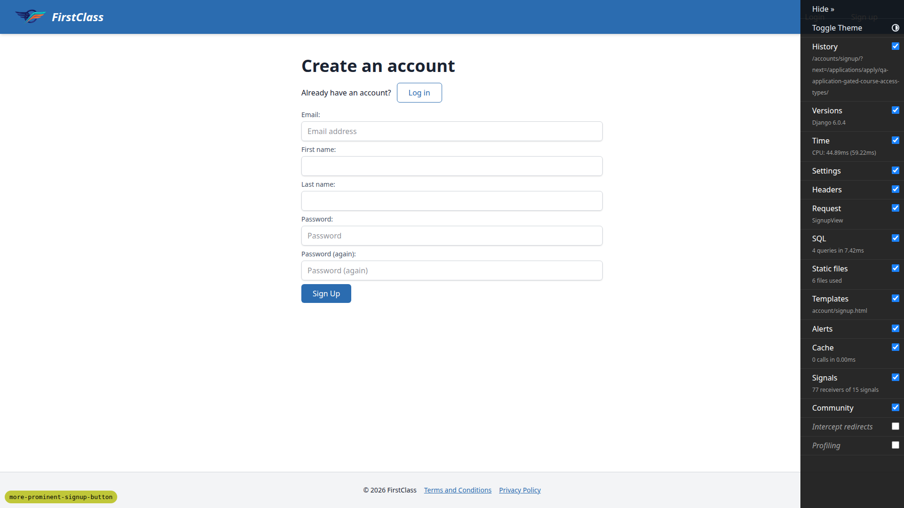

**1.4-1.6 — desktop — Verify Your Email page after signup**
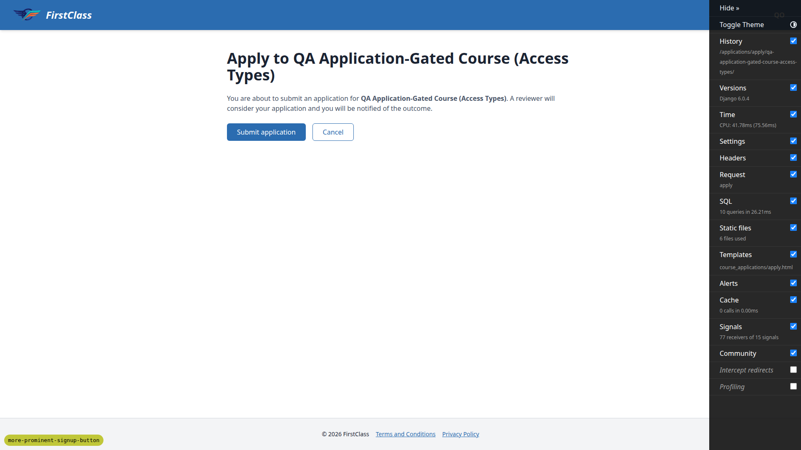

**2 — desktop — enrolled via free-course access flow**
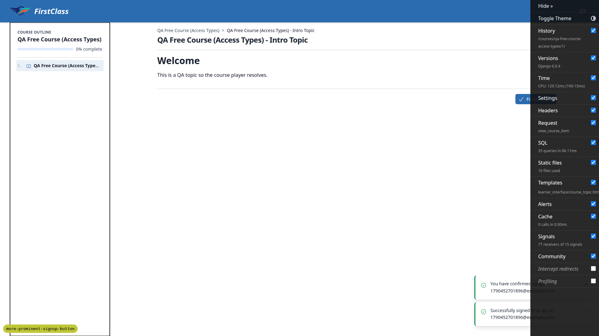

**3 — desktop — express interest recorded, debug toolbar visible in this shot only**
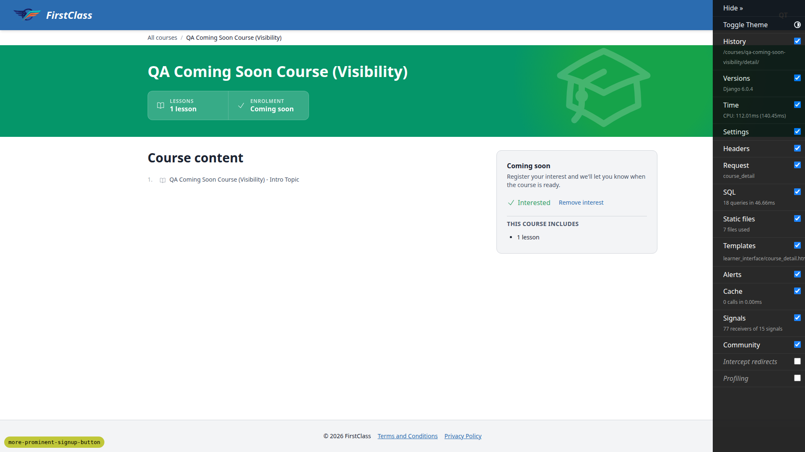

**4 — desktop — login page with "New here?" switch**
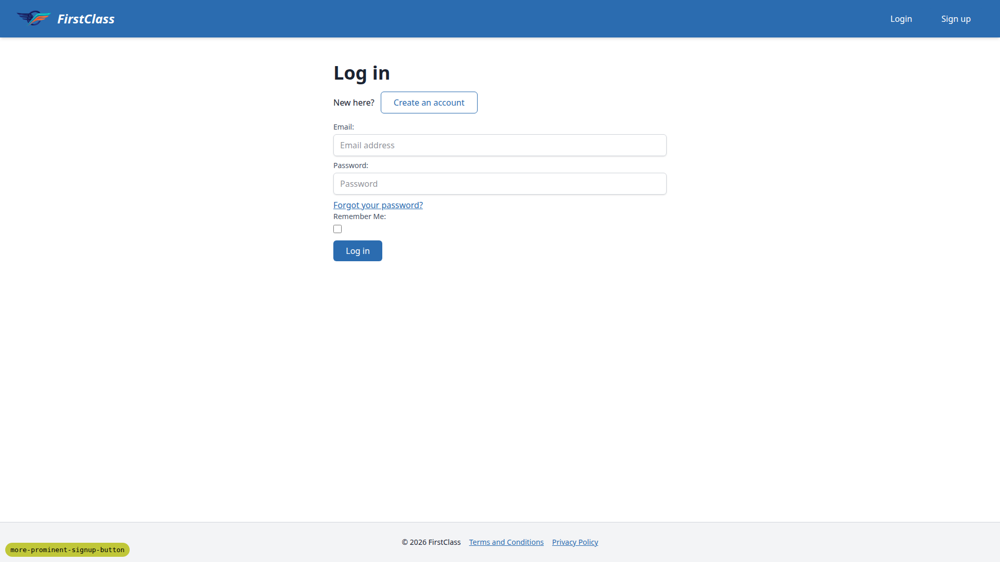

**5.1-5.4 — desktop — failed login with "New here?" callout**
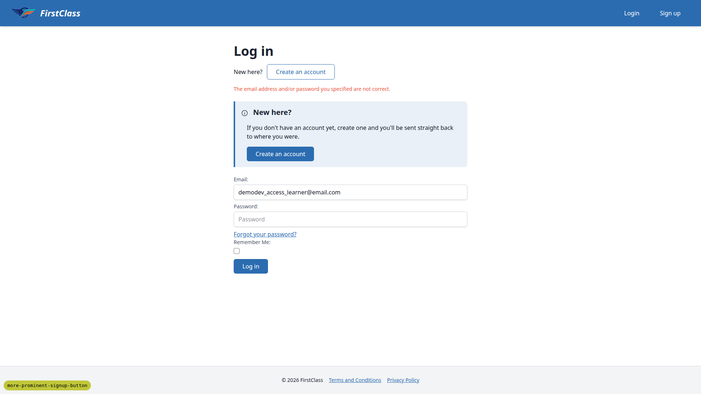

**6 — desktop — signup page after script-injection payload, email field empty**
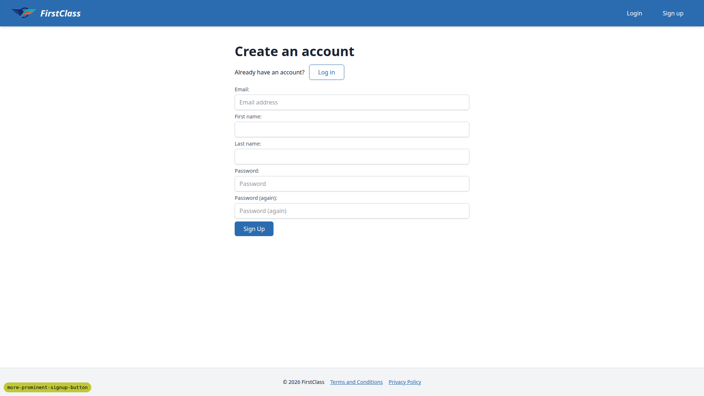

**7 — desktop — login-only flow with signups disabled**
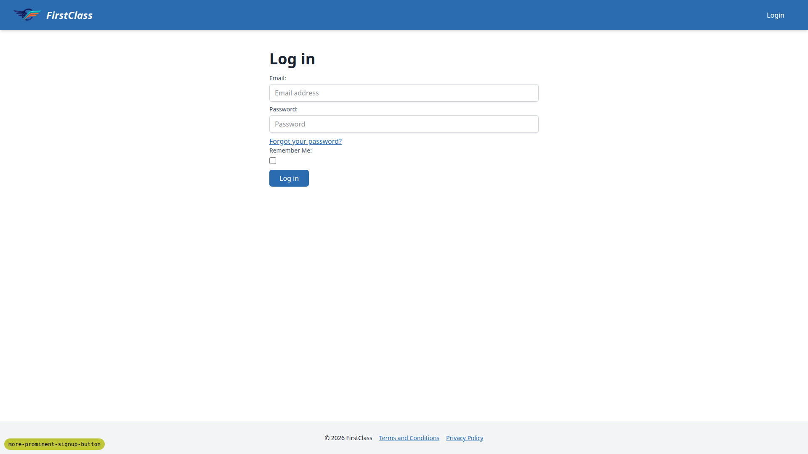

**11.1-11.2 — desktop — focus ring on "Create an account" switch**
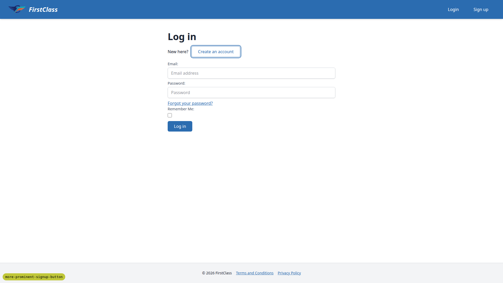

**11.3 (4.2-4.4) — mobile — login page at 375x812, no horizontal scroll**
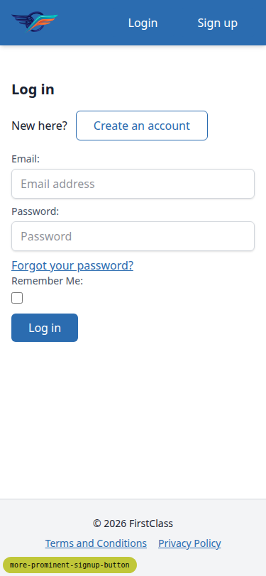

**11.3 (5.1-5.3) — mobile — failed login callout at 375x812**
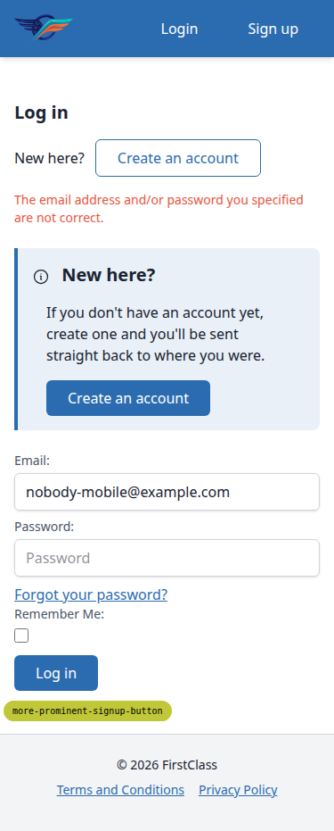

**1.1-1.3, 5.1-5.3 — tablet — desktop header and callout at 768x1024, debug badge overlapping footer**
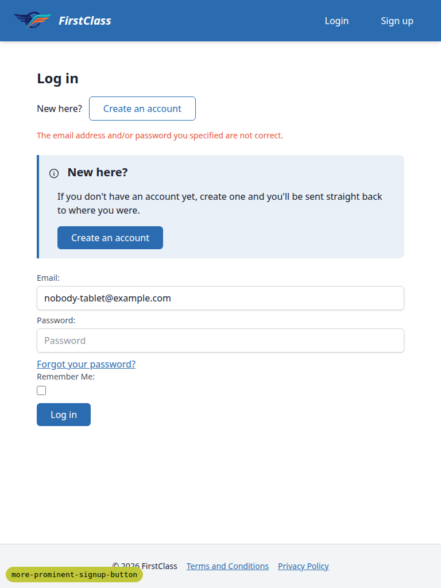

## Bug status

None. No bugs were found during this run.

## General notes

1. Data setup: the branch DB had no demo data. Ran `create_demo_data --yes` plus the two plan
   seeds. The DemoDev Site's domain was repointed from `127.0.0.1:8000` to `127.0.0.1:8085` so
   this run's server resolved to DemoDev, and a DemoDev `SiteSignupPolicy` (`allow_signups=True`)
   was created since none existed. Port 8000 no longer maps to DemoDev in this branch DB.
2. Test plan inaccuracies: the admin URL is `/admin/freedom_ls_accounts/sitesignuppolicy/`, not
   `/admin/accounts/sitesignuppolicy/` (that 404s). Scenario 3's `next` is
   `/interest/courses/qa-coming-soon-visibility/deferred-express-interest/` — the plan omits the
   `/interest` prefix. Redirects from `login_required`-style decorators put `next` with unencoded
   slashes (e.g. `?next=/applications/...`), whereas the plan shows `%2F`; the value is the same.
3. Scenario 9 expected `next` still in the URL after submit; the post-signup "verify your email"
   URL is `/accounts/confirm-email/` with no query in every flow (standard allauth behaviour).
   `next` is present on the signup URL, and the new-signup flows still return users to `next`
   after confirmation.
4. A second, empty `role=alert` element exists site-wide (`#toast-region-assertive`); expected.
5. The debug branch badge overlaps the footer at tablet width; debug-only.
6. Snapshot `.yml` files and a console log also landed in `screenshots/` from the Playwright
   server's output directory; they are harmless artefacts. The console log came from admin pages,
   not the feature under test.

status: ok
reason: report rendered, 0 bugs documented, screenshots verified
