# Frontend QA Report: More Course Content Widgets

**Date:** 2026-06-17
**Branch:** `more_course_widgets`
**Tester:** Claude Code (Playwright MCP, manual walkthrough)
**Site / user:** DemoDev — `demodev_s1@email.com`
**Showcase topic:** *Content Widgets - Demo Reference* → topic 4, "Interactive Widgets"
(`/courses/content-widgets-demo-reference/4/`)

Viewports exercised: Desktop 1920×1080, Mobile 375×812, Tablet 768×1024.

---

## Summary

**No bugs found.** Every functional and accessibility check in the test plan passed.
The three bugs reported by the previous QA run (flashcard comment leak, checklist
literal `[ ]`, accordion `open` ignored) are **confirmed fixed** and re-verified on a
pristine page load and at the source level — see "Previously-reported bugs, now fixed"
below.

| # | Test | Result |
|---|------|--------|
| 2a | Admonition default types render (7 types) | ✅ Pass |
| 2b | `title` override | ✅ Pass |
| 2c | `checklist` renders as read-only checkboxes | ✅ Pass (was failing — now fixed) |
| 2d | Custom `regulation` type (override + `scale` glyph icon) | ✅ Pass |
| 2e | Unknown type falls back to "Note" | ⚠️ Not exercised (optional spot-check) |
| 2f | Admonition a11y (`role="note"`, `aria-labelledby`, unique ids, `aria-hidden` icon) | ✅ Pass |
| 3a | Flashcard flip on click | ✅ Pass |
| 3b | Fixed size across flip | ✅ Pass |
| 3c | Flashcard keyboard & a11y (`<button>`, Enter/Space, `aria-pressed`, hidden face inert) | ✅ Pass |
| 3d | Flashcard reduced motion (CSS-gated) | ✅ Pass |
| —  | Flashcard template comments leak as visible text | ✅ Pass (was failing — now fixed) |
| 4a | Accordion default closed + toggle | ✅ Pass |
| 4b | Accordion `open` attribute starts expanded | ✅ Pass (was failing — now fixed) |
| 4c | Accordion native behaviour (keyboard / markup / chevron) | ✅ Pass |
| 4d | Accordion reduced motion (CSS-gated) | ✅ Pass |
| 5a | Migrated callout content renders as admonitions | ✅ Pass |
| 5b | Form pages still render (template move) | ✅ Pass |
| 6  | Console — no JS / Alpine CSP inline-expression errors | ✅ Pass |
| 6  | Responsive (mobile / tablet) — overflow, touch targets | ✅ Pass |

---

## What was verified

### §2 Admonitions
- All 9 boxes render with `role="note"`, an `aria-labelledby` pointing at a present
  visible label, an `aria-hidden="true"` icon wrapper, and a **unique** label id (no
  duplicate ids across the page).
- The seven default types (`note`, `tip`, `important`, `warning`, `danger`,
  `key_takeaways`, `checklist`) each show a real text label and colour that tracks
  meaning. Body markdown renders (lists, inline code, bold).
- **2b:** the `title="A note about task lists"` box shows the custom title, not the
  default "Note" label.
- **2c:** the `checklist` box renders four real `<input type="checkbox">` elements,
  all `disabled` (read-only — clicking does nothing, nothing persists). No literal
  `[ ]` text.
- **2d:** the custom `regulation` type renders a styled box labelled "Regulation"
  with warning colouring and a real `scale` SVG icon (`aria-label="scale"`, single
  path) — distinct from the generic `info` icon used by `note`. Confirms the
  `settings_dev.py` `ADMONITION_TYPES` override and literal-glyph icon resolution.

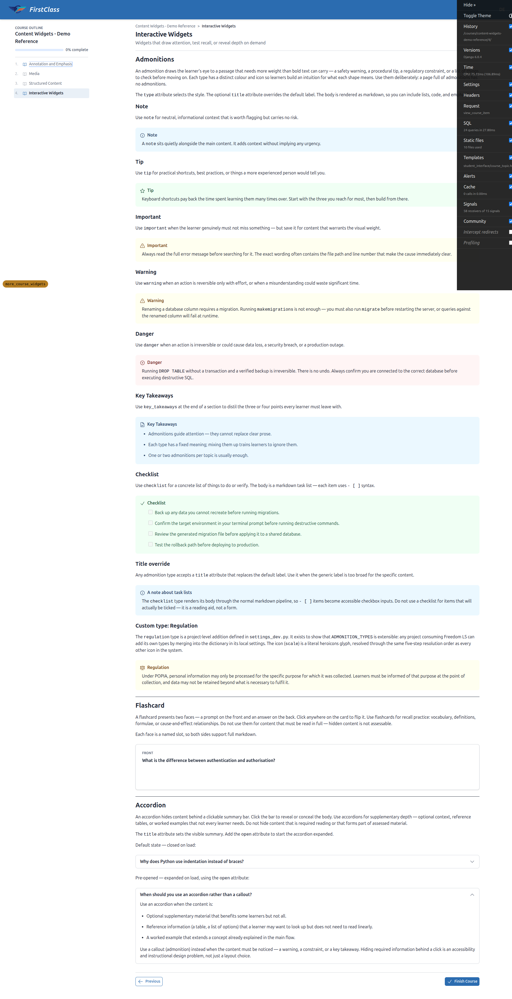

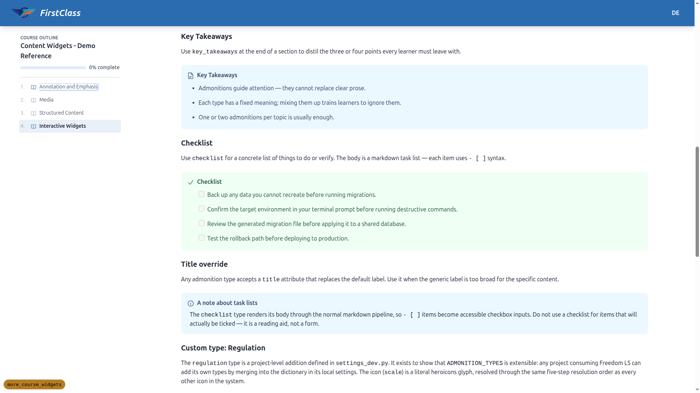

### §3 Flashcard
- **3a/3b:** clicking flips front↔back; both faces render markdown (e.g. **bold** on
  the back). The card footprint is identical on both faces (1280×170 on desktop) —
  no jump/resize despite the back holding more text. The CSS-grid single-cell stack
  sizes the card to the larger face.
- **3c:** the flip trigger is a real `<button>` with `aria-label="Flip card"`, a
  large hit area (full card surface, ≥44px), and `aria-pressed` that tracks state
  (`false` front, `true` back). Enter and Space both toggle. The hidden face is
  `aria-hidden="true"` **and** `inert` — the implementation uses `inert` rather than
  `tabindex="-1"`, which is a stronger guarantee: it removes the entire hidden
  subtree (not just a wrapper) from the tab order, pointer events, and AT.
- **3d:** with `prefers-reduced-motion: reduce` emulated, the face transition drops
  to `0s` (no animated rotation) but the flip state still changes.

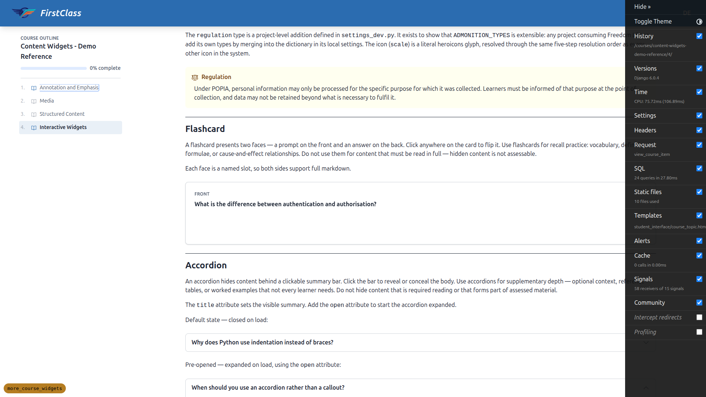

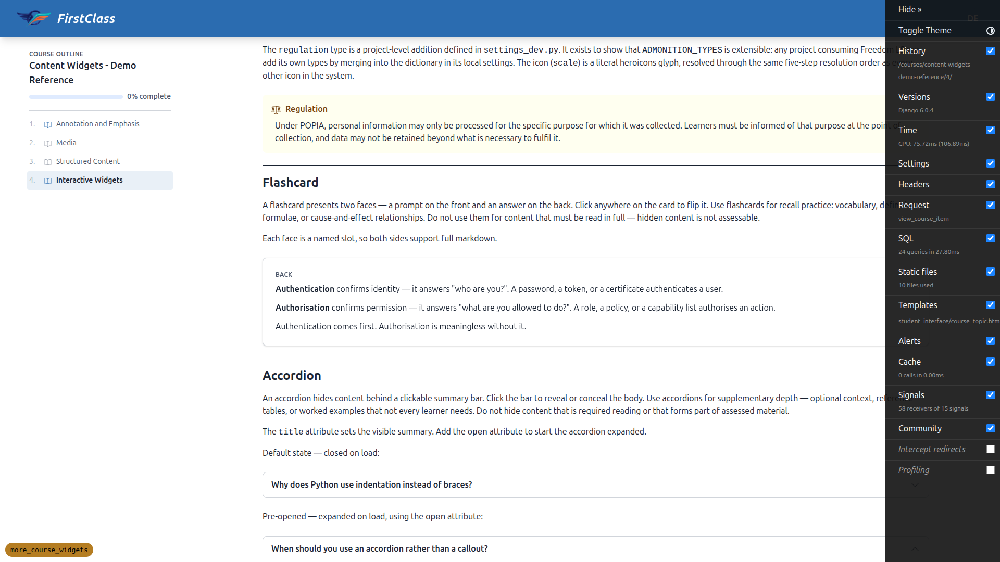

### §4 Accordion
- **4a:** the default accordion is closed on load; clicking the summary expands it
  (and collapses again).
- **4b:** the accordion authored with the bare `open` attribute is expanded on a
  fresh page load (`
`).
- **4c:** markup is native `
`/`
` with no manually-added
  `role="button"` / `aria-expanded` (the browser provides these); a chevron is
  present; Enter on the summary toggles it; native `
` keeps closed-body
  content in the DOM so Ctrl+F find-in-page works.
- **4d:** with reduced motion emulated, toggling still works but the height
  transition is dropped.

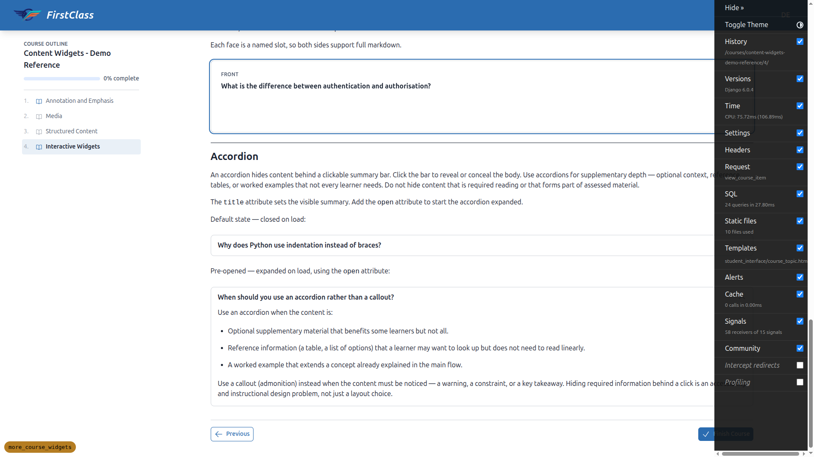

### §5 Callout migration regression
- **5a:** migrated topics render the former callouts as **admonition** boxes with the
  mapped types and preserved titles (info/none→note, success→tip, warning→warning,
  error→danger). No literal `<c-callout …>` text and no stray unrendered
  `<c-admonition …>` tags (the only `<c-admonition …>` strings on the page are inside
  intentional `<code>` syntax examples). No empty gaps.
- **5b:** normal form pages still render after the `c-callout` move to `base` — the
  quiz landing page and the form-runner page (`fill_form`) both render correctly with
  real form controls.

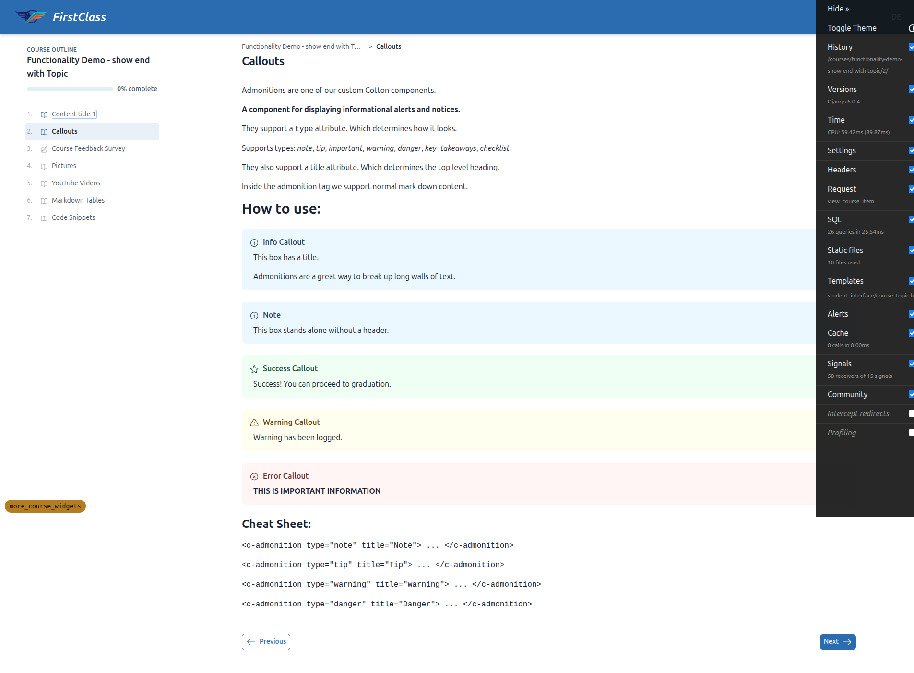

### §6 Cross-cutting
- **Console:** zero JavaScript errors and zero warnings on the showcase topic. In
  particular, no Alpine CSP "inline expression" errors — the flashcard/accordion JS
  is authored without inline expressions. (The four INFO-level messages present are
  dev-only CSP *report-only* notices about CDN scripts — htmx, Alpine, chart.js
  loaded from jsdelivr — not errors.)
- **Responsive:** no horizontal page overflow and no overflowing admonition boxes at
  375×812 or 768×1024. Touch targets are adequate (flashcard ≥330px wide, accordion
  summary ~72px tall). Widgets stack and reflow sensibly.

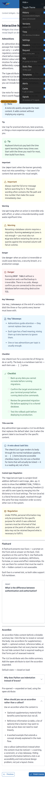
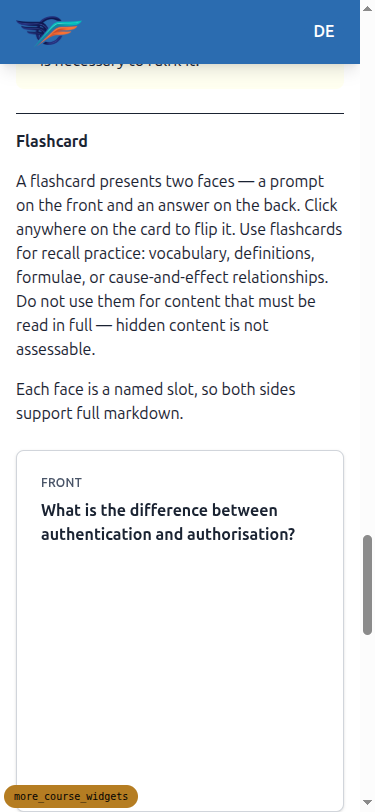
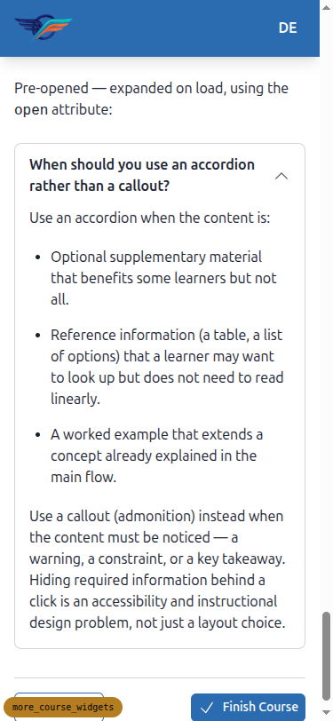
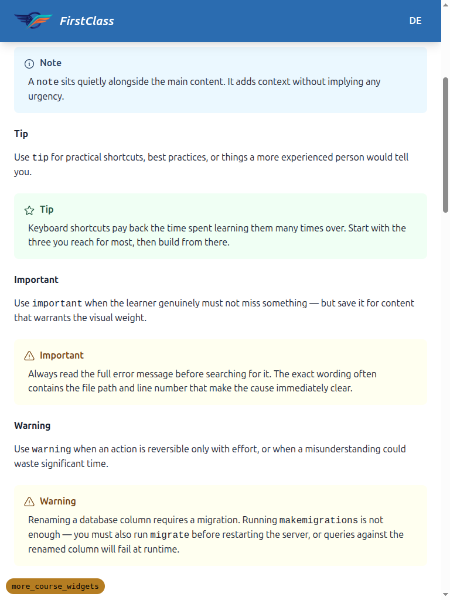
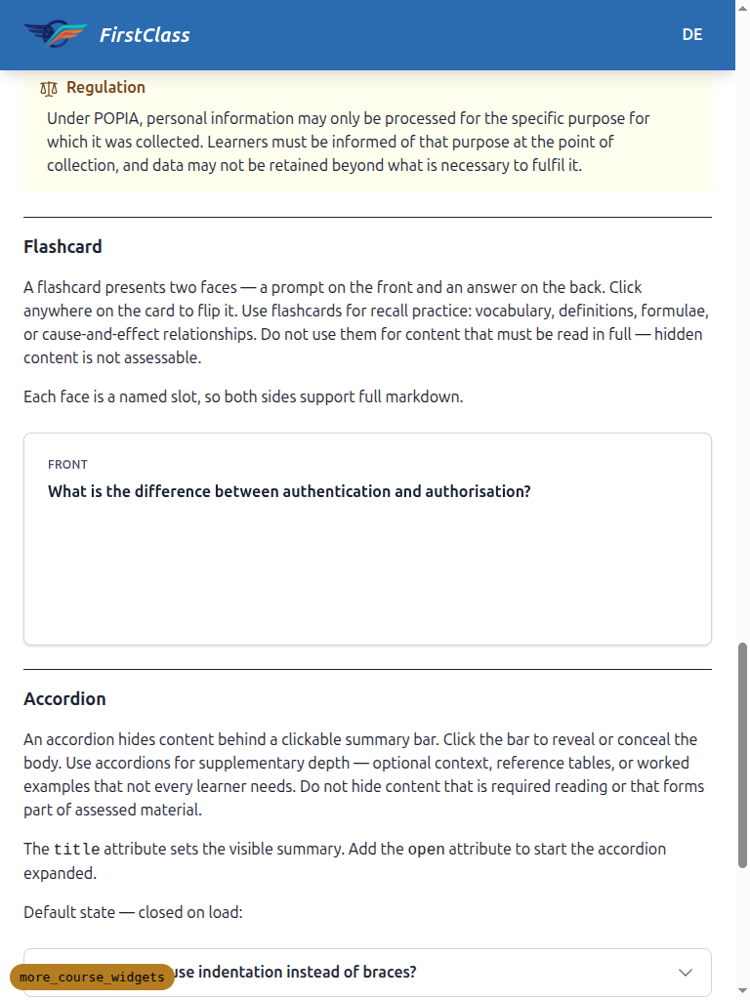

---

## Previously-reported bugs, now fixed

The previous QA run (earlier the same day) reported three bugs. The three files in the
working tree that were modified since — `cotton/flashcard.html`, `cotton/accordion.html`,
and `markdown_rendering/markdown_utils.py` — are exactly the fixes. Each was
re-verified both in the browser (pristine load) and at the source level:

1. **Flashcard template comments leaking as visible text** — *fixed.* No bare
   `{# … #}` comments remain in `cotton/flashcard.html`; authoring notes use
   `…` blocks, which the render pipeline strips. No
   comment text appears in the rendered page.

2. **`checklist` rendered literal `[ ]` instead of checkboxes** — *fixed.*
   `markdown_utils.py` now enables the `pymdownx.tasklist` extension and allowlists
   the read-only (`disabled`) checkbox markup. The checklist box renders four real
   disabled checkbox inputs.

3. **Accordion `open` attribute ignored (rendered closed)** — *fixed.*
   `cotton/accordion.html` now defaults `open="__unset__"` and emits the `open`
   attribute via ``, so the bare `open` — which the
   sanitiser collapses to `open=""` — is treated as present (matching native
   `
` semantics). The pre-opened accordion is expanded on fresh load.

---

## Not tested / notes

- **§2e (unknown admonition type falls back to "Note")** — not exercised. This is an
  explicitly optional spot-check that requires authoring throwaway
  `<c-admonition type="does_not_exist">` content; the fallback behaviour is covered by
  the unit suite, so it was left as-authored. No production demo content uses an
  unknown type.
- **Tangential (not a product bug):** at the 375×812 mobile viewport the Django Debug
  Toolbar's collapsed handle overlays the right edge of the content and intercepts
  pointer events, which blocked a Playwright tap on the flashcard until the toolbar
  was hidden. This is a dev-only artifact (`settings_dev`) and does not affect real
  users; widget interaction itself works (verified via direct click once the overlay
  was dismissed).
- **Step 1 cleanup caveat:** `qa_cleanup.sh` operates on the *current* directory, but
  the QA artifacts live in the spec directory, so stale screenshots and the prior
  `qa_report.md` from the previous run were not auto-removed by Step 1. They were
  removed manually during this run; only the current run's screenshots remain.
