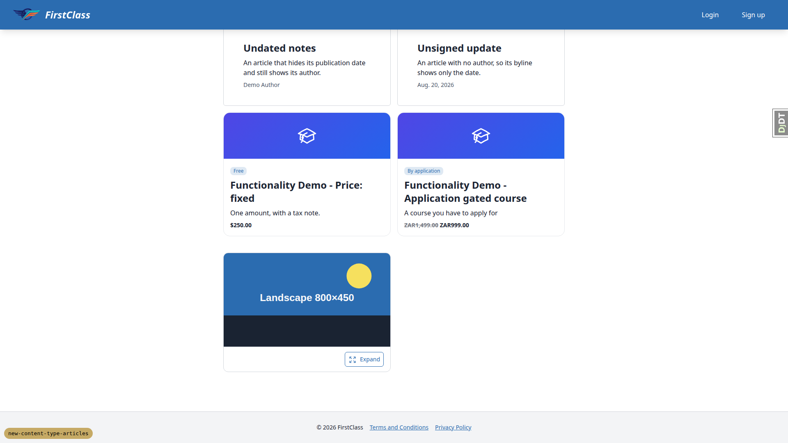
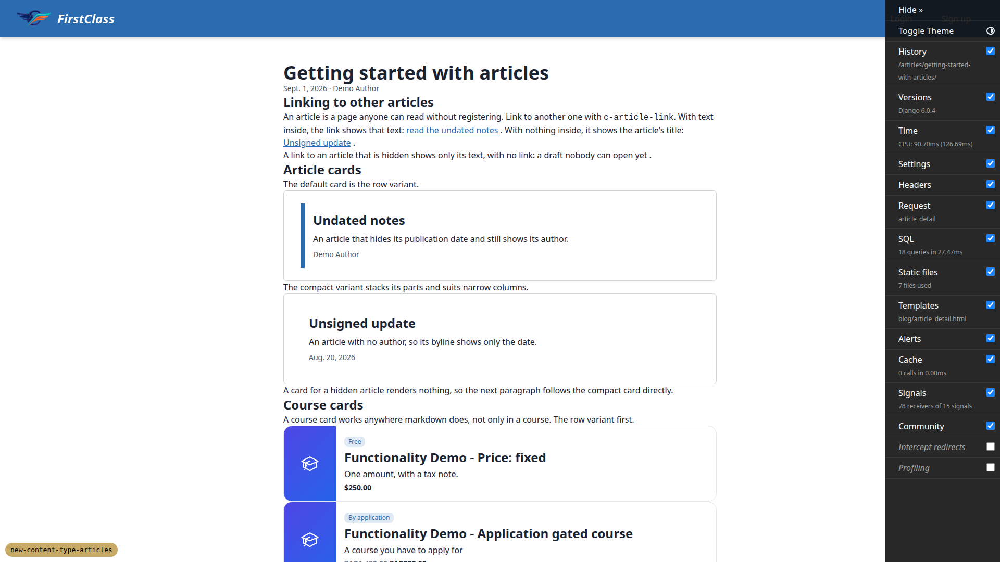
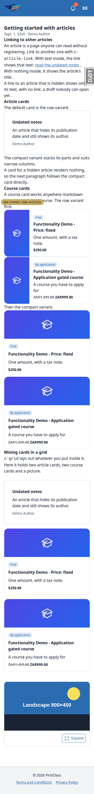
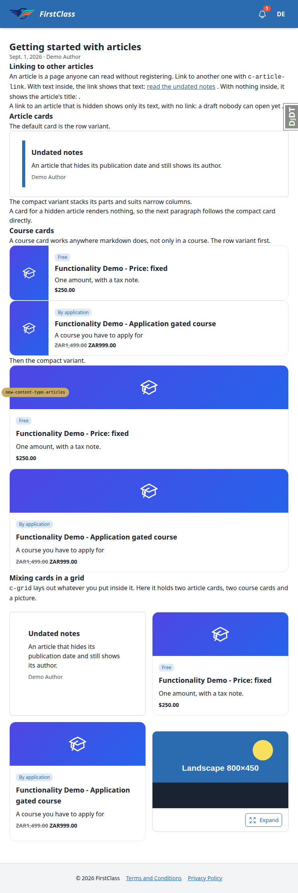

# Frontend QA report: Articles

33 test records were run across desktop, mobile and tablet: 29 passed and 4 failed. The smoke gate passed. The failures led to 6 bugs: the lightbox does not open on article pages (B1), the article body has no vertical spacing (B2), a mixed grid row misaligns the picture tile (B3), the demo article skips from H1 to H3 (B4), the content reset leaves articles behind (B5), and inline article links leave a stray space before punctuation (B6). B6 was found during a test that passed. The fix loop fixed B1 and B2; B3 to B6 are unresolved (see Bug status).

## Methodology

- Tool: Playwright MCP, driven manually.
- Viewports: desktop 1920x1080, mobile 375x812, tablet 768x1024.
- Screenshots were collected into `screenshots/` beside this report. Every image referenced here exists there.
- Data setup:
  - Stale Site-1 CourseCategory, Article and CoursePart rows had to be deleted before `content_save` would load.
  - The Content Widgets course was made temporarily reachable: it was published, registered, and topics 1-4 were marked complete.
  - Its Cards topic was given article and course cards in the DB so test 5 could exercise them, because no demo topic uses them.
  - A later `content_save` reset the course.

## Diff scoping

- Class: FULL.
- Template files that triggered it:
  - `freedom_ls/blog/templates/blog/article_detail.html`
  - `freedom_ls/blog/templates/blog/article_list.html`
  - `freedom_ls/content_engine/templates/cotton/article-card.html`
  - `freedom_ls/content_engine/templates/cotton/grid.html`
  - `freedom_ls/learner_interface/templates/cotton/course-card.html`
  - plus about 70 py/md files
- Skipped: nothing. All three viewports ran.

## Smoke gate

Outcome: pass. Pages checked: `/` and `/articles/getting-started-with-articles/`.

## Results by test

| test_id | viewport | status | note |
|---|---|---|---|
| 1.1-1.4 | desktop | pass | List shows 3 entries newest first, draft hidden, undated shows no date, title click opens the page |
| 1.5 | desktop | pass | /courses/ and dashboard unchanged, no article content |
| 2.1 | desktop | fail | Headings skip H1 to H3; body has no spacing (B2, B4) |
| 2.2 | desktop | pass | Meta, og and canonical tags correct |
| 2.3-2.4 | desktop | pass | Undated and unsigned bylines and meta correct |
| 2.5-2.6 | desktop | pass | Hidden and missing slugs give identical 404; utm dropped from canonical |
| 2.7 | desktop | pass | No progress or registration UI on article pages |
| 3.1-3.2 | desktop | pass | Sitemap and robots.txt correct |
| 4.1 | desktop | pass | Links correct; cosmetic space before punctuation (B6) |
| 4.2 | desktop | pass | Row and compact article cards render; hidden draft renders nothing |
| 4.3 | desktop | pass | Course cards render, prices correct |
| 4.4 | desktop | fail | Grid layout fine, but lightbox does not open (B1) |
| 4.5 | desktop | pass | Whole card is clickable, one link per card |
| 4.6 | desktop | pass | Focus rings visible on article and course cards |
| 4.7 | desktop | pass | c-image-grid unchanged, lightbox opens on course topic |
| 6.1 | desktop | pass | Admin changelist columns correct |
| 6.2 | desktop | pass | Admin change form correct |
| 6.3 | desktop | pass | Admin delete removes article and its URL 404s |
| 5.1-5.3 /articles/ | mobile | pass | No overflow, text wraps |
| 5.1-5.3 article page | mobile | pass | No overflow, grid stacks; missing spacing visible (B2) |
| 4.4 / 5 grid row heights | tablet | fail | Picture tile 24px low and shorter than its row (B3) |
| 5.1-5.3 /articles/ + article page | tablet | pass | No overflow, 2-column grid |
| 5.1-5.3 | desktop | pass | No overflow at 1920 |
| 5.1-5.3 course topic with cards | mobile | pass | No overflow at 375/768/1920, equal card heights |
| 6.4 | desktop | pass | content_save restored the deleted article with the same uuid |
| 6.5 | desktop | pass | visibility: hidden in file hides the article after content_save |
| 7.1 | desktop | pass | Duplicate slug refused, naming both files |
| 7.2 | desktop | pass | Invalid slug error names file and slug |
| 7.3 | desktop | pass | Broken widget reference caught by content_save and bundled validator |
| 7.4 | desktop | pass | Missing author shows date only |
| 7.5 | desktop | pass | Bad prefix fails the system check; custom prefix works |
| 7.6 | desktop | pass | Odd URLs 404 or redirect, no 500 |
| 0 setup (content reset) | desktop | fail | danger_content_delete leaves articles behind (B5) |

## Bugs

### B1 — Lightbox does not open on article pages

- Manifestations: 4.4 (desktop)
- Screenshot: 
- Expected: Clicking a picture (or its Expand button) on an article page opens the lightbox, as it does on course topic pages.
- Actual: Nothing opens. The console logs `Alpine Expression Error: Undefined variable: contentLightbox`. `blog/article_detail.html` never loads `content_engine/js/alpine-components.js`, which registers `contentLightbox`. Course pages load it in `_course_base.html`.

### B2 — Article body has no vertical spacing

- Manifestations: 2.1 (desktop), 5 article page (mobile), 5 article page (tablet)
- Screenshots:
  - 
  - 
  - 
- Expected: Article body spaced like course topic and course detail bodies, with gaps between byline, headings, paragraphs and cards.
- Actual: Byline, headings, paragraphs and stacked cards butt against each other (margins 0). `article_detail.html` emits `{{ article.rendered_content }}` directly instead of inside `<c-markdown-container>` (space-y-4), which topic and course detail pages use.

### B3 — Mixed c-grid: picture tile sits 24px low and is shorter than its row

- Manifestations: 4.4 (tablet)
- Screenshot: 
- Expected: Cards and pictures in the same c-grid row share the row's top and height.
- Actual: The picture wrapper has top=1878 and h=259 beside a course card with top=1854 and h=307. c-picture's outer `
` keeps its my-6. `grid.html` only zeroes the figure margin (`[&_figure]:my-0!`). It is hidden at desktop because the picture is alone in its row there.

### B4 — Demo article headings skip from H1 to H3

- Manifestations: 2.1 (desktop)
- Screenshot: 
- Expected: Per spec, body `#` renders as H2 via mdx_headdown and a body H2 precedes the first card grid, so headings never skip H1 to H3.
- Actual: `getting-started-with-articles.md` uses `##` for its sections, which render as H3 directly under the H1.

### B5 — Content reset (danger_content_delete) leaves articles behind

- Manifestations: 0 setup, content reset (desktop)
- Screenshots: none
- Expected: `danger_content_delete` removes all content, including the new Article type.
- Actual: Article is not in its `models_to_delete` list, so articles survive a content reset.

### B6 — Inline article link leaves a space before following punctuation

- Manifestations: 4.1 (desktop)
- Screenshot: 
- Expected: "...read the undated notes." with the full stop right after the link.
- Actual: "read the undated notes ." and "a draft nobody can open yet .". The output of c-article-link carries trailing whitespace before the next character.

## Bug status

- **FIXED** (commit: c65bfb19) — Lightbox does not open on article pages
- **FIXED** (commits: 27e6f373, bed808dd) — Article body has no vertical spacing
- **FIXED** (commit: 8b7b8c3b) — Mixed c-grid: picture tile sits 24px low and is shorter than its row (decision: c-image-grid rows close up to the shared gap-4 too)
- **FIXED** (commit: 02c67492) — Demo article headings skip from H1 to H3
- **FIXED** (commit: 01f4f2d3) — Content reset (danger_content_delete) leaves articles behind
- **FIXED** (commit: d46e7611) — Inline article link leaves a space before following punctuation

## General notes

- The sitemap host lacks the port. This is a dev Sites artifact: several dev Sites share 127.0.0.1, and existing course URLs show the same thing. It is not caused by this branch.
- The course card price shows as '$250.00' where the plan said 'USD 250.00'. It uses the same formatter as the catalogue.
- The slug-collision message names both files rather than the owning uuid. Both files are in the tree, so the validator catches it before the DB check.
- Model-level validator errors print a blank 'Field:' label.
- The bundled validator needs `.fls-content.yaml` at the repo root. The FLS repo does not have one, so the plan's command fails as written. It was run with a temporary empty file, which was removed afterwards.
- The admin Show date and Show author selects say 'Unknown' for 'use site default' (Django NullBooleanSelect wording).
- The tag filter is hidden because the demo articles have no tags.
- The demo article has no subtitle, so the subtitle line was not observed.
- No demo course topic uses the new cards, so test 5 relied on DB-appended cards.
- The plan's desktop width of 1280 was run at 1920 per the QA command.

status: ok
reason: 6 bugs — 2 fixed, 4 unresolved; report rendered, screenshots verified
