# Frontend QA report: new-content-type-articles

## Methodology

Driven by hand through Playwright MCP against a dev server on port 8393. Viewports: desktop 1920x1080 (plus 1280 and a resize sweep), mobile 375x812, tablet 768x1024. Screenshots were collected into `screenshots/` beside this report, and every referenced image exists there. Compression ran with nothing over the limit.

Data setup that was needed:

- qa-data-helper registered the admin on the coming-soon Content Widgets course and completed topic 1 (4.7).
- qa-data-helper set a temporary tag (6.1).
- qa-data-helper appended the article cards to the Media topic (section 5).
- All of it was restored by a final `content_save ./demo_content DemoDev`, apart from the admin's course registration and progress rows, which stay in the dev DB.

File-edit tests (6.5, 7.1-7.4) ran against a scratchpad copy of demo_content, because editing tracked demo files in place was refused by the auto-mode permission classifier. Settings tests (7.5, 7.6) used a scratch settings module importing config.settings_dev plus a second runserver on port 8205, so no tracked file changed.

## Diff scoping

Class: FULL. Everything ran; nothing was skipped.

Changed files included:

- freedom_ls/blog/templates/blog/article_list.html
- freedom_ls/blog/templates/blog/article_detail.html
- freedom_ls/content_engine/templates/cotton/article-card.html
- freedom_ls/content_engine/templates/cotton/article-link.html
- freedom_ls/content_engine/templates/cotton/article-byline.html
- freedom_ls/content_engine/templates/cotton/grid.html
- freedom_ls/content_engine/templates/cotton/image-grid.html
- freedom_ls/learner_interface/templates/cotton/course-card.html
- (plus ~100 .py/.md/spec files)

## Smoke gate

Status: pass. Pages checked:

- http://127.0.0.1:8393/ (logged in as admin)
- http://127.0.0.1:8393/articles/

## Test results

| Test | Viewport | Status | Notes | Screenshot |
|---|---|---|---|---|
| 0.2 | n/a | pass | content_save ./demo_content DemoDev succeeded; git status --short demo_content/ printed nothing | |
| 1.1-1.3 | desktop | pass | 200, H1 Articles, tab title 'Articles — DemoDev', 3 entries newest first (Getting started 09-01, Unsigned update 08-20, Undated notes 08-15), hidden draft absent; bylines: author·date / date only / author only | 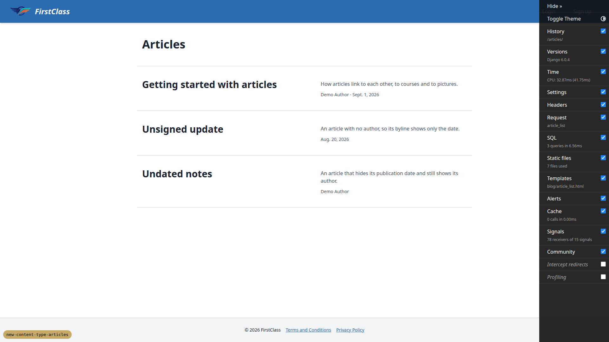 |
| 1.6 | desktop | pass | hover tints row to rgb(243,244,246); clicking row body opened /articles/unsigned-update/; clicking title opened /articles/undated-notes/ | 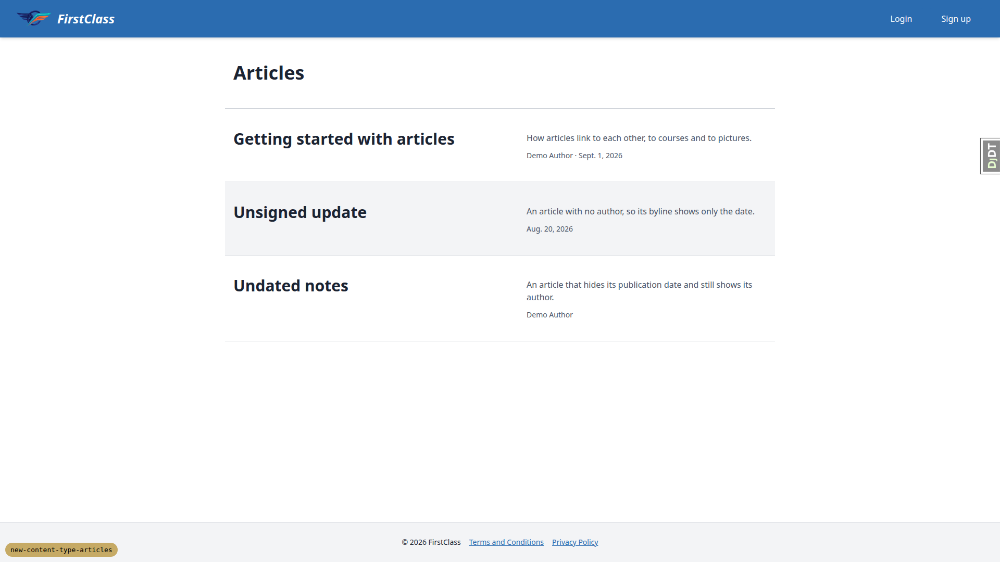 |
| 1.7 | desktop | pass | Tab to first row title: 2px inset primary ring around whole row, fully visible | 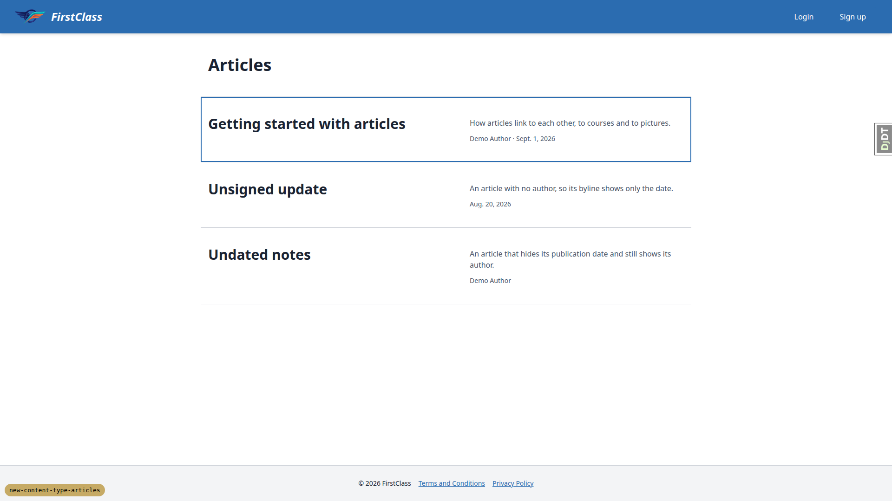 |
| 1.8 | desktop | pass | /courses/ and dashboard render as admin; no article links or article text in either main | 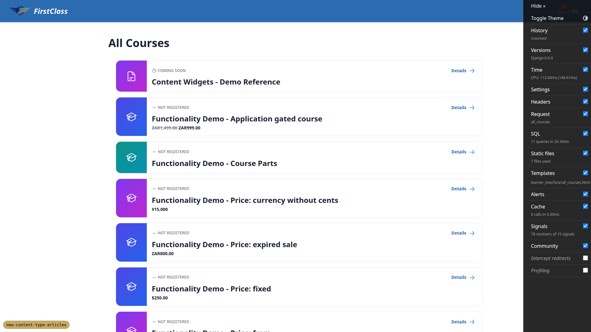 |
| 2.1 | desktop | pass | 200; back link '← Articles' above H1; single H1; byline Demo Author / Sept. 1, 2026; first body heading is H2 'Linking to other articles'. No demo article has a subtitle, so the subtitle line was not observed | 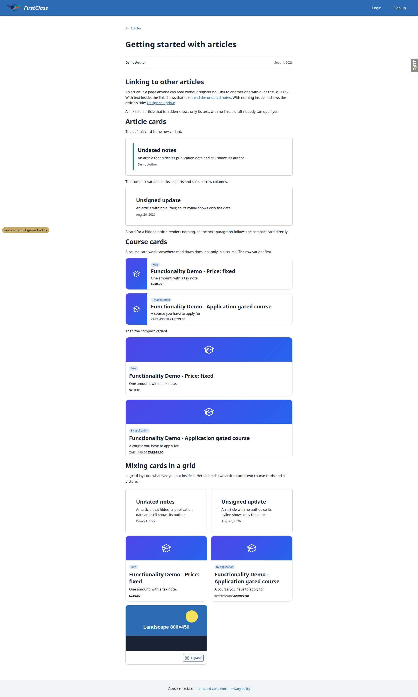 |
| 2.4 | desktop | pass | title, meta description, og:type article, og:title, og:description, canonical == og:url == page URL on this host, article:published_time 2026-09-01, meta author, no og:image, twitter:card summary | |
| 2.5-2.6 | desktop | pass | undated-notes: byline author only, no published_time, meta author present. unsigned-update: byline date only, published_time 2026-08-20, no meta author | |
| 2.7 | desktop | pass | hidden-draft and does-not-exist both 404 'No Article matches the given query.'; HTML identical after normalising the path, apart from debug-toolbar request id/timings; no 'Hidden draft' text. DEBUG=True so this is Django's technical 404 page | 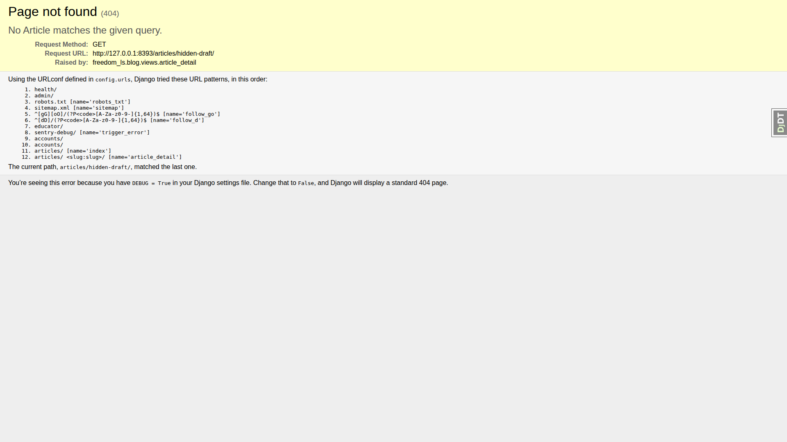 |
| 2.8 | desktop | pass | ?utm_source=x: canonical and og:url omit the query string | |
| 2.9 | desktop | pass | no progress element, no Start course/registration prompt; header shows Login/Sign up | |
| 3.1 | desktop | pass | sitemap lists /articles/ and the 3 published articles, hidden draft absent, 14 course URLs. All locs use host 127.0.0.1 with no port (Site.domain), same as the existing course entries | |
| 3.2 | desktop | pass | robots.txt: Allow: /courses/, Allow: /articles/, Sitemap: http://127.0.0.1:8393/sitemap.xml | |
| 4.1 | desktop | pass | custom-text link -> /articles/undated-notes/; empty-slot link shows title 'Unsigned update'; hidden-draft link is plain text, no red span, no 'Hidden draft' | 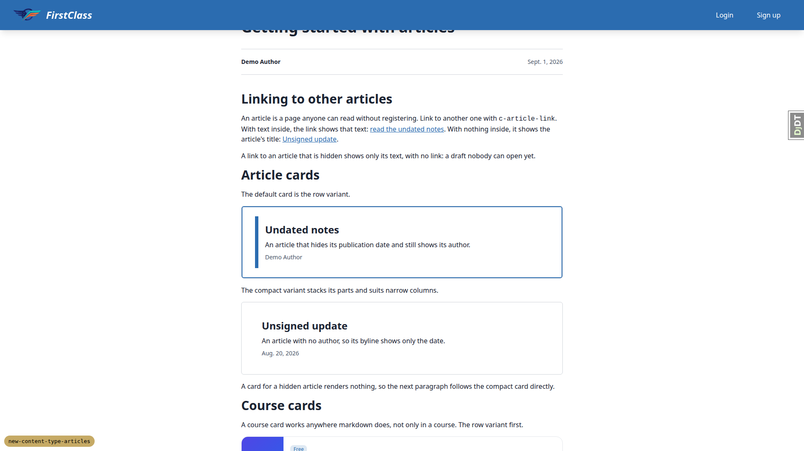 |
| 4.2 | desktop | pass | row card with accent strip + compact card, each with title/description/byline; hidden-draft card renders nothing (16px gap, same as the other cards) |  |
| 4.3 | desktop | pass | 2 row + 2 compact course cards; Price: fixed has badge Free, price '$250.00', no excl. tax; Application gated has badge By application, ZAR1,499.00 struck, ZAR999.00. No status eyebrow/progress/Details. Card click -> /courses/functionality-demo-price-fixed/detail/ |  |
| 4.4 | desktop | pass | grid is 2 columns at desktop; article cards 198px tall each, course cards 302px each; lightbox dialog opens from the picture's Expand button. Clicking the picture itself does nothing; compared with the existing image-grid in 4.7 | 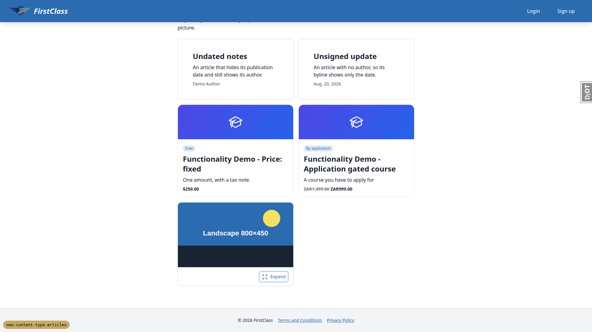 |
| 4.5 | desktop | pass | empty points on all 10 cards hit the card's single stretched link (1 link per card), so right-click offers the link menu; clicking card body navigated to the course detail page | |
| 4.6 | desktop | pass | Tab onto card title: 2px inset primary ring around the whole card, not clipped |  |
| 6.2 | desktop | pass | Hidden draft change page: slug and visibility read-only, 'Delete article' link present (a Topic change page has none), fieldset note about content_save recreating the article present | 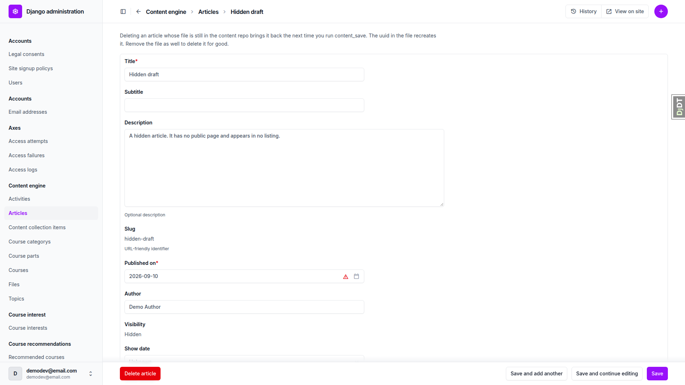 |
| 4.7 | desktop | pass | Needed data: qa-data-helper registered demodev on content-widgets-demo-reference and completed topic 1 (coming soon + sequential lock). Media topic: 2- and 3-column c-image-grids tile, items top-aligned, 16px gap; Expand opens the lightbox dialog. Only markup change vs main is the added [&>*]:my-0! (picture wrapper margin removed so tiles share a top edge). On the course page and the article page the lightbox opens from Expand; clicking the inline image is not a trigger, unchanged from main | 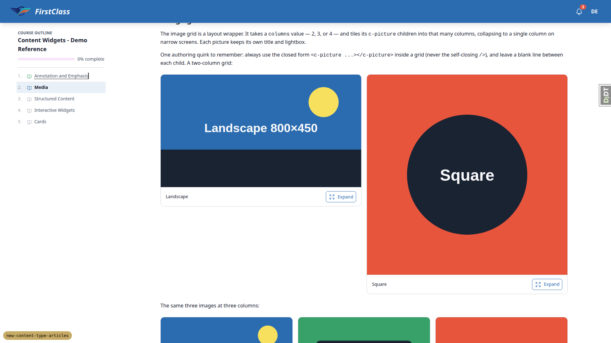 |
| 6.1 | desktop | pass | Columns title, slug, published_on, visibility. Filters panel shows 'By visibility'; 'By tags' only appears once a tag exists (SimpleListFilter hides when there are no choices), so qa-data-helper set tags=['qa-demo'] on undated-notes, then 'By tags' with qa-demo showed. Later content_save reset it | 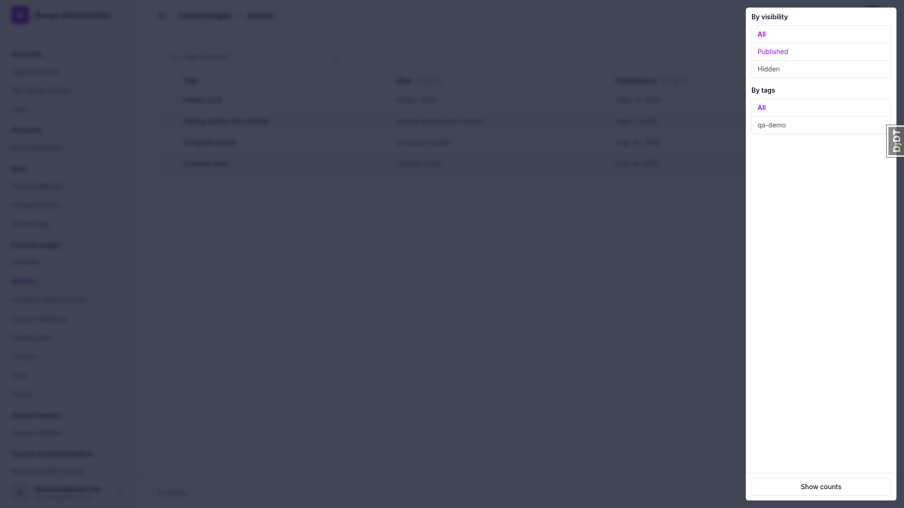 |
| 6.3 | desktop | pass | Deleted Unsigned update via admin; gone from /articles/ and its URL 404 | |
| 6.4 | n/a | pass | content_save ./demo_content DemoDev: Unsigned update back with the same uuid 6f00230c-1857-47b9-9246-cbf98b610de5, URL 200, git status demo_content clean | |
| 6.5 | n/a | pass | Ran against a scratchpad copy of demo_content: visibility: hidden -> URL 404, absent from index; reverted the copy and reloaded -> 200. No tracked file changed | |
| 7.1 | n/a | pass | Scratchpad copy. Copy plus original in one save: refused 'Duplicate article slug ... Give one of them a different slug' naming both files. Copy alone against the DB: refused, naming the file and owning uuid 6f00230c-...; Article rows identical before and after | |
| 7.2 | n/a | **fail** | slug: "bad slug!" is refused with a validation error naming the file, and the Problem text says "Invalid article slug 'bad slug!' ... a slug may only contain letters, digits, hyphens and underscores", but the structured 'Field:' line is blank ('• Field: ') because the check runs as a model-level validator, not on the slug field (see B1) | |
| 7.3 | n/a | pass | Scratchpad copy with c-course-card path ../nope/course.md: content_save fails before saving, naming the file, 'Field: c-course-card path', 'no content file at this path', given '../nope/course.md'. The bundled validator gives the same failure (run with a scratch .fls-content.yaml; see General notes). After reverting the copy, both pass | |
| 7.4 | desktop | pass | Scratchpad copy without the author line: byline 'Sept. 1, 2026' only, no meta author. Reloaded ./demo_content: meta author back | 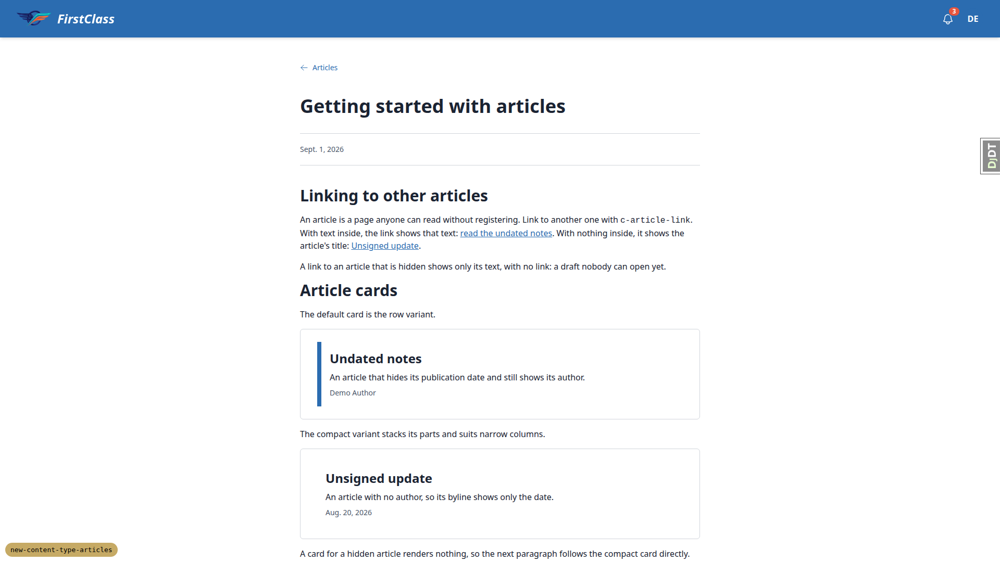 |
| 7.5 | n/a | pass | Scratch settings module importing config.settings_dev. BLOG_URL_PREFIX='/articles' -> check reports freedom_ls_blog.E001; '' -> no issues. 'news/blog' on a second server: /news/blog/ 200, /articles/ 404, robots Allow: /news/blog/, canonical, back link and widget links all under /news/blog/ | |
| 7.6 | n/a | pass | BLOG_NAME='Posts' (scratch settings, second server): /articles/ H1 'Posts', title 'Posts — DemoDev', article back link 'Posts', URL still /articles/. Default server still shows 'Articles' | |
| 7.7 | n/a | pass | curl --path-as-is: /articles/../admin/ 404, /articles/%2E%2E/admin/ 404, /articles/Hidden-Draft/ 404, /articles/hidden-draft 301 -> /articles/hidden-draft/ (404). No 500 | |
| 5.1-5.4 /articles/ | mobile | pass | scrollWidth == 375, nothing past the right edge; rows stack title/description/byline in one column with hairlines | 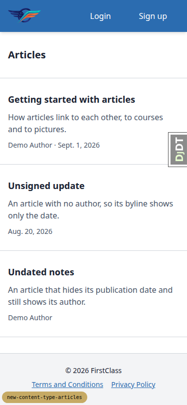 |
| 5.1-5.3, 5.5 article page | mobile | pass | no horizontal overflow; byline keeps author left and date right on one line; c-grid is 1 column; row course cards keep the horizontal layout without overflow; titles wrap. Back link hit area is 72x20px (observation only) | 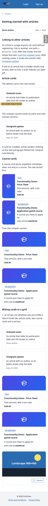 |
| 1.4/2.2 tablet + 5.x | tablet | pass | /articles/ two columns (348/316px), header and row rules both 752px, no overflow. Article page: 720px column, byline author left/date right, c-grid 2 columns with equal heights per row (218/218, 294/294), no overflow | 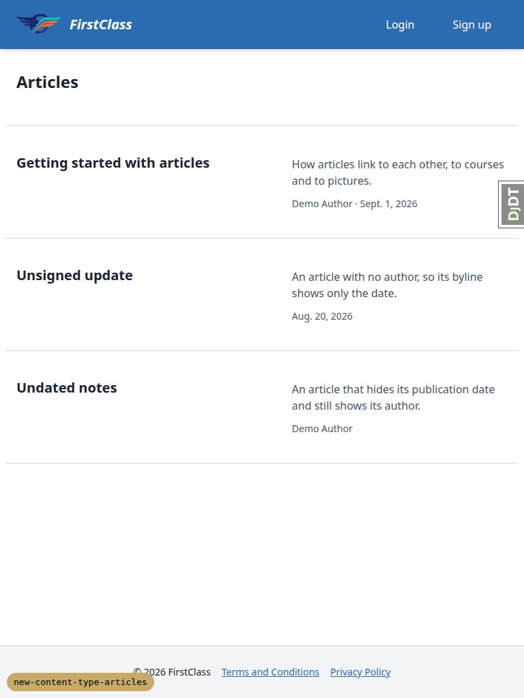 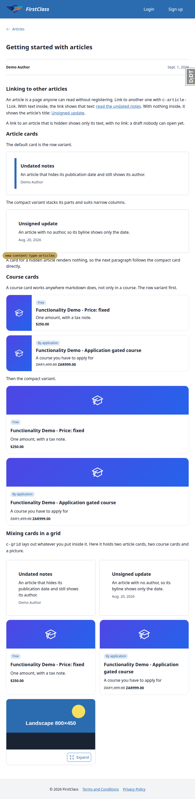 |
| 5.4 | desktop->mobile | pass | /articles/ resized 1280, 1000, 768, 767, 600, 375: grid (two columns) at >=768, stacked flex below; no title/description overlap and scrollWidth == viewport at every width | |
| 5.1-5.3 course topic with cards | mobile | pass | No course topic in demo_content uses the new cards, so qa-data-helper appended the article's card section (paths rebased to the topic's folder) to the Media topic of content-widgets-demo-reference in the DB. At 375: no overflow, 10 cards render, no title/description overflow, card grid 1 column | 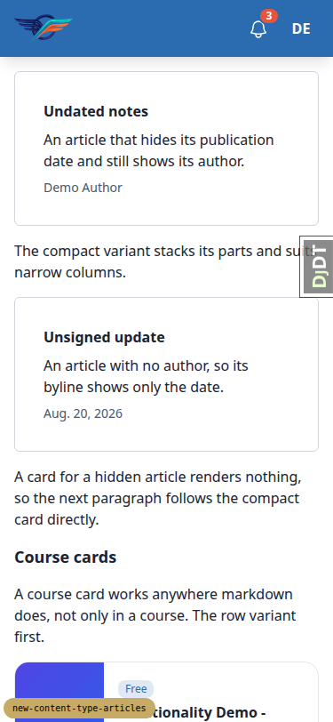 |
| 5.1-5.3 course topic with cards | tablet | pass | 768: no overflow; card grid 2 columns, row heights 218/218 and 294/294 | 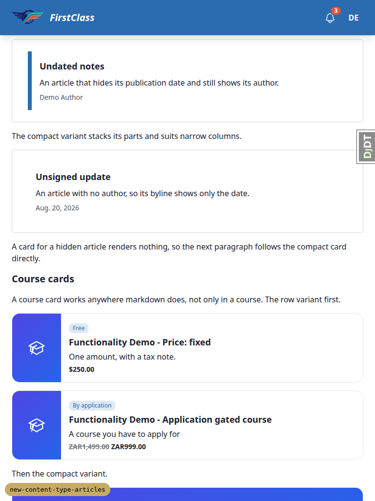 |
| 5.1-5.3 course topic with cards | desktop | pass | 1920 with the course outline sidebar: no overflow; card grid 2 columns (632px), row heights 174/174 and 270/270; row cards horizontal | 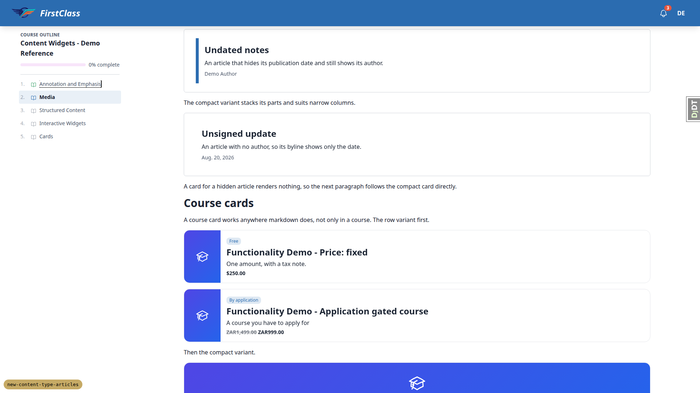 |

## Design check

| Test | Viewport | This run | Design | Result |
|---|---|---|---|---|
| 1.4-design | desktop |  | 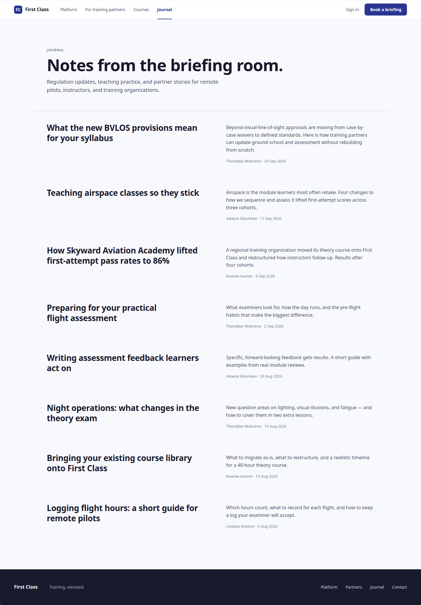 | pass |
| 2.2-design | desktop |  | 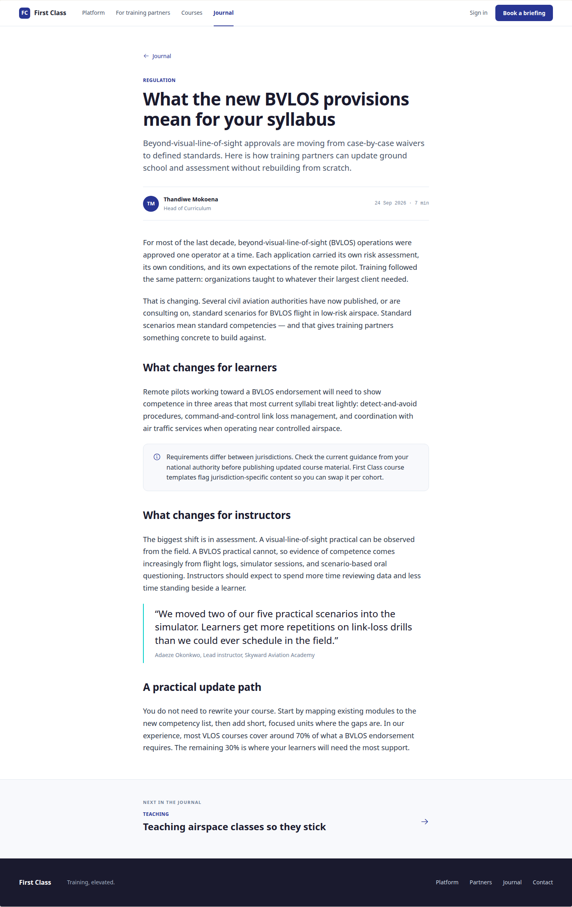 | pass |
| 1.5-design | mobile |  | 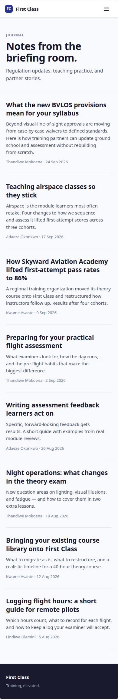 | pass |
| 2.3-design | mobile |  | 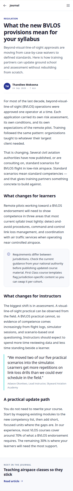 | pass |
| 1.4-design | tablet |  |  | pass |
| 2.2-design | tablet |  |  | pass |

## B1: Bad article slug error shows a blank 'Field:' line

Manifestations: test 7.2 (viewport n/a).

Screenshots: none.

Expected: content_save on an article with slug: "bad slug!" fails with a validation error naming the file and the field (Field: slug).

Actual: The error names the file and the Problem text says "Invalid article slug 'bad slug!' ... a slug may only contain letters, digits, hyphens and underscores", but the structured line reads '• Field: ' with nothing after it, because the slug check runs as a model-level validator rather than against the slug field.

## Bug status

| Bug | Status |
|---|---|
| B1 | **UNRESOLVED** — Bad article slug error shows a blank 'Field:' line |

## General notes

- The plan's 4.3 expects "USD 250.00", but the site formats USD as "$250.00" everywhere (course list, detail, cards), so the card is consistent.
- The plan's 7.3 bundled-validator command can't run from the FLS repo root: the validator requires a `.fls-content.yaml` at the cwd, the repo has none, and that requirement predates this branch. It was run with a scratch `.fls-content.yaml`.
- The 6.1 tag filter is hidden until some article has a tag (standard SimpleListFilter behaviour), and no demo article has tags.
- Sitemap `<loc>`s use Site.domain `127.0.0.1` without the port, the same as the existing course entries.
- No demo article has a subtitle, so the subtitle line in 2.1 was not observed.
- With DEBUG on, the 404s are Django's technical page; hidden and missing slugs give identical pages apart from toolbar ids.
- On the article page the grid picture's lightbox opens from Expand, not from clicking the image; that matches the existing image grid on main.
- The article back link's tap target is 72x20px on phone.
- A browser normalises `../`, so 7.7 used curl --path-as-is.

status: ok · reason: report rendered, 1 bug documented
