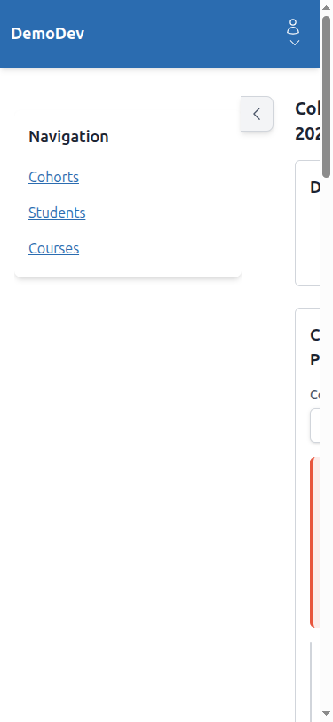
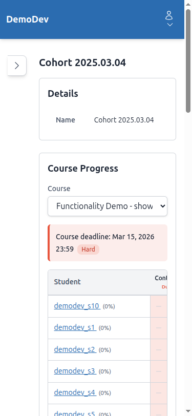
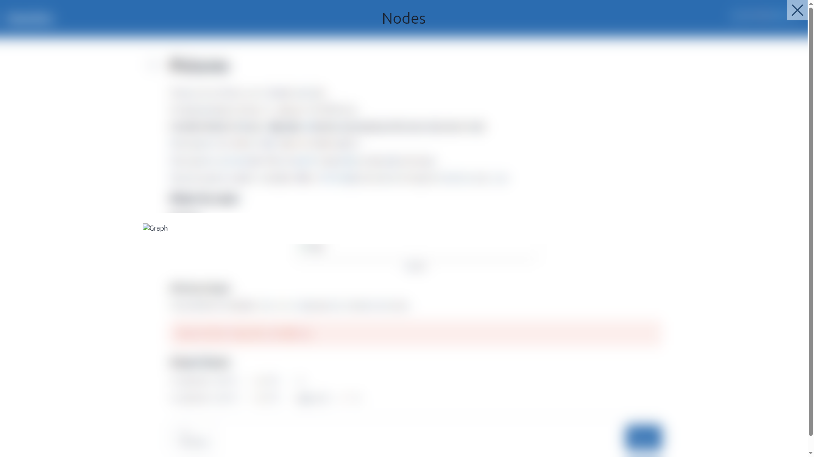
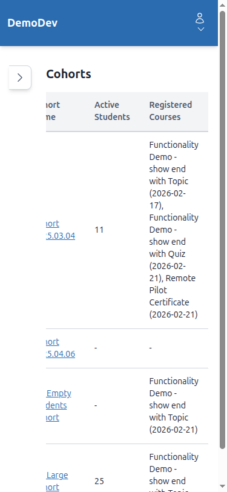

# QA Report: Icon Migration (Font Awesome to Heroicons)

**Date**: 2026-03-01
**Tester**: Claude (automated via Playwright MCP)
**Branch**: `open-source-icons`

---

## Summary

All 14 tests were executed on both desktop (1920x1080) and mobile (375x812) viewports. The icon migration from Font Awesome to Heroicons SVG icons is **largely successful**. All icons render as SVGs, no Font Awesome resources are loaded, and accessibility attributes are properly applied.

### Overall Result: PASS (with minor issues noted below)

---

## Issues Found

### Issue 1: Educator Sidebar Overlaps Content on Mobile

**Test**: Test 7 (Educator Interface) - Mobile
**Expected**: Sidebar should either collapse automatically on mobile or overlay without blocking content
**Actual**: The sidebar remains open by default on mobile and pushes the main content off-screen to the right, making it inaccessible until the sidebar is manually toggled closed.



After collapsing sidebar, content becomes visible:



**Severity**: Medium - Not icon-specific, but a general mobile responsiveness issue with the educator interface layout. The sidebar toggle chevron icon itself renders correctly.

---

### Issue 2: Alpine x-collapse Plugin Missing (Console Warnings)

**Test**: Test 1 (Student Course Navigation) and other pages with expandable sections
**Expected**: Expand/collapse transitions should animate smoothly
**Actual**: The browser console shows 6 Alpine.js warnings on every page with expandable course parts:
```
Alpine Warning: You can't use [x-collapse] without first installing the "collapse" plugin.
```

This means expand/collapse still works (toggling visibility), but without the smooth animated transition that `x-collapse` provides. The chevron-right/chevron-down toggle icons work correctly.

**Severity**: Low - Functionality works, but animations are absent. This is not icon-specific.

---

### Issue 3: Broken Image in Lightbox (404)

**Test**: Test 12 (Image Lightbox)
**Expected**: Image should display in the lightbox
**Actual**: The lightbox opens and the X close button SVG icon renders correctly, but the image itself (`graph1.drawio...svg`) returns a 404 from `/media/content_engine/`. The lightbox chrome and icons are all correct.



**Severity**: Low - Not icon-related. The lightbox X close icon works properly. The missing image is a content/media issue.

---

### Issue 4: Educator Tables Cramped on Mobile

**Test**: Test 8 (Data Tables) - Mobile
**Expected**: Tables should be usable on mobile
**Actual**: The cohort list table and student data tables are quite cramped on mobile with column names being cut off (e.g., "Cohort Name" becomes partially visible). Tables are horizontally scrollable which helps, but the experience is suboptimal.



**Severity**: Low - Not icon-specific. The sort icons and boolean check/X icons render correctly at all sizes. This is a general table responsiveness concern.

---

## Tests Passed (Desktop)

| Test | Description | Result | Notes |
|------|-------------|--------|-------|
| 1 | Student Course Navigation Icons | PASS | All status icons (check, spinner, play, lock, retry), content type icons (book, pencil-square, academic-cap, folder), deadline clock icons, and expand/collapse chevrons render as SVGs |
| 2 | Course Topic Page | PASS | Previous/Next navigation arrows render correctly |
| 3 | Quiz/Form Completion Page | PASS | Large green check-circle on pass, continue arrow, correct answer check icons all SVG |
| 4 | Course Finish Page | PASS | Trophy icon (gold), home icon, book icon all render as SVGs |
| 5 | Toast/Flash Messages | PASS | Success (green check-circle), dismiss X icon confirmed as SVGs |
| 6 | Header/User Menu | PASS | User person icon and dropdown chevron render as SVGs |
| 7 | Educator Interface | PASS | Sidebar toggle chevron, progress grid icons (check, minus, play, clock) all SVGs |
| 8 | Data Tables | PASS | Sort bar icons, boolean green check / red X all SVGs |
| 9 | Modals | PASS | X close button renders as SVG |
| 10 | Callout Components | PASS | Info (info-circle), success (check-circle), warning (triangle), error (x-circle) all SVGs |
| 11 | Loading Indicators | PASS | Spinning circular-arrows SVG with animate-spin CSS |
| 12 | Image Lightbox | PASS | X close button renders as SVG (image itself 404 - unrelated) |
| 13 | No Font Awesome Loaded | PASS | Zero Font Awesome requests in network, zero `fa` classes in DOM |
| 14 | Accessibility Check | PASS | All 29 SVGs have `aria-hidden="true"`, no missing accessibility attributes |

## Tests Passed (Mobile - 375x812)

| Test | Description | Result | Notes |
|------|-------------|--------|-------|
| 1 | Student Course Navigation Icons | PASS | All icons render correctly at mobile size |
| 2 | Course Topic Page | PASS | Nav buttons and arrows properly sized |
| 3 | Quiz/Form Completion Page | PASS | Pass page icons scale well |
| 4 | Course Finish Page | PASS | Trophy and action button icons display correctly |
| 5 | Toast/Flash Messages | PASS | (Same behavior as desktop - toast system is responsive) |
| 6 | Header/User Menu | PASS | Person icon and menu work on mobile |
| 7 | Educator Interface | PASS* | Icons correct, but sidebar overlaps content (see Issue 1) |
| 8 | Data Tables | PASS | Sort icons and boolean icons render, tables scrollable |
| 9 | Modals | PASS | X close button visible and properly positioned |
| 10 | Callout Components | PASS | All four callout type icons render correctly |
| 11 | Loading Indicators | PASS | (Same behavior as desktop) |
| 12 | Image Lightbox | PASS | X close icon works on mobile |
| 13 | No Font Awesome Loaded | PASS | (Same as desktop - no FA resources) |
| 14 | Accessibility Check | PASS | (Same as desktop - attributes preserved) |

---

## Screenshots Reference

### Desktop (1920x1080)
- `t01-course-home-desktop.png` - Course home with status icons
- `t01-course-home-expanded-desktop.png` - Expanded course parts with chevron-down
- `t01-course-home-quiz-desktop.png` - Course home showing quiz content type icon
- `t01-toc-collapsed-desktop.png` - TOC sidebar collapsed with chevron-right
- `t01-deadline-badges-desktop.png` - Deadline badges with clock icons
- `t02-topic-page-desktop.png` - Topic page layout
- `t02-nav-buttons-desktop.png` - Previous/Next navigation buttons with arrows
- `t03-quiz-landing-desktop.png` - Quiz landing page
- `t03-quiz-pass-desktop.png` - Quiz pass result with check-circle icon
- `t04-course-finish-desktop.png` - Course finish with trophy icon
- `t05-success-toast-desktop.png` - Success toast message with check and X icons
- `t06-user-menu-desktop.png` - User menu with person icon and chevron
- `t07-educator-sidebar-desktop.png` - Educator sidebar open with chevron-left
- `t07-educator-sidebar-collapsed-desktop.png` - Educator sidebar collapsed with chevron-right
- `t07-progress-grid-desktop.png` - Progress grid with status SVG icons
- `t08-data-table-sort-icons-desktop.png` - Data table with sort bar icons
- `t09-modal-desktop.png` - Modal with X close button
- `t10-callouts-desktop.png` - All four callout types with icons
- `t12-lightbox-desktop.png` - Image lightbox with X close button

### Mobile (375x812)
- `t01-home-mobile.png` - Home page on mobile
- `t01-course-home-mobile.png` - Course home on mobile
- `t02-topic-page-mobile.png` - Topic page on mobile
- `t02-nav-buttons-mobile.png` - Nav buttons on mobile
- `t03-quiz-pass-mobile.png` - Quiz pass page on mobile
- `t04-course-finish-mobile.png` - Course finish on mobile
- `t06-user-menu-mobile.png` - User menu on mobile
- `t07-educator-sidebar-mobile.png` - Educator sidebar on mobile
- `t07-educator-sidebar-overlap-mobile.png` - Sidebar overlapping content
- `t07-progress-grid-mobile.png` - Progress grid with sidebar open (overlap issue)
- `t07-progress-grid-collapsed-mobile.png` - Progress grid with sidebar collapsed
- `t08-data-table-sort-mobile.png` - Data table sort icons on mobile
- `t08-data-table-headers-mobile.png` - Table headers with sort icons on mobile
- `t08-boolean-columns-mobile.png` - Boolean check/X icons on mobile
- `t09-modal-mobile.png` - Modal on mobile

---

## Tangential Observations

1. **Alpine x-collapse plugin not loaded**: Multiple pages show console warnings about the missing collapse plugin. This affects expand/collapse animation smoothness but not functionality or icons.

2. **Broken demo content image**: The `graph1.drawio...svg` image file is missing from the media directory, causing a 404 in the lightbox. This is a content issue, not an icon issue.

3. **Educator sidebar not mobile-optimized**: The sidebar defaults to open on mobile and doesn't automatically collapse or use an overlay pattern. This is a pre-existing layout issue unrelated to the icon migration.

---

## Conclusion

The Font Awesome to Heroicons migration is **complete and successful**. All icons across the application have been properly replaced with SVG Heroicons. No Font Awesome resources are loaded, all SVGs have proper accessibility attributes (`aria-hidden="true"`), and icons render correctly at both desktop and mobile viewports. The issues noted above are either pre-existing or unrelated to the icon migration itself.
