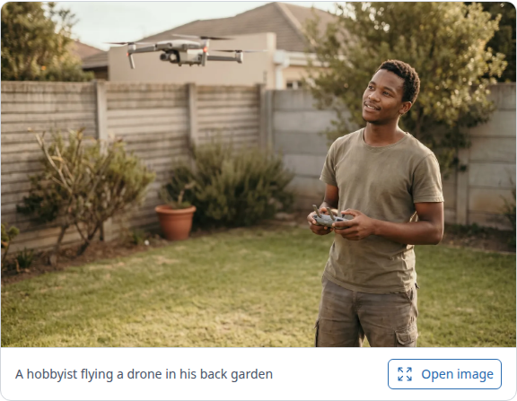
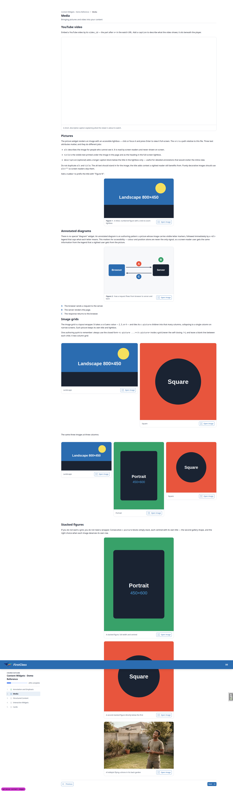
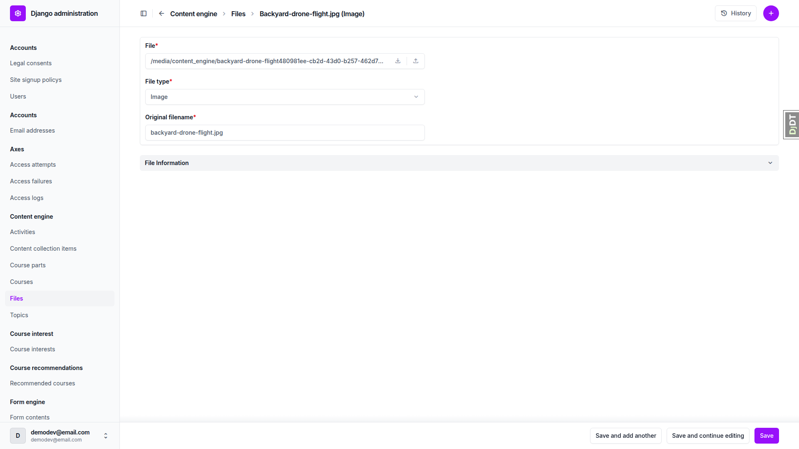
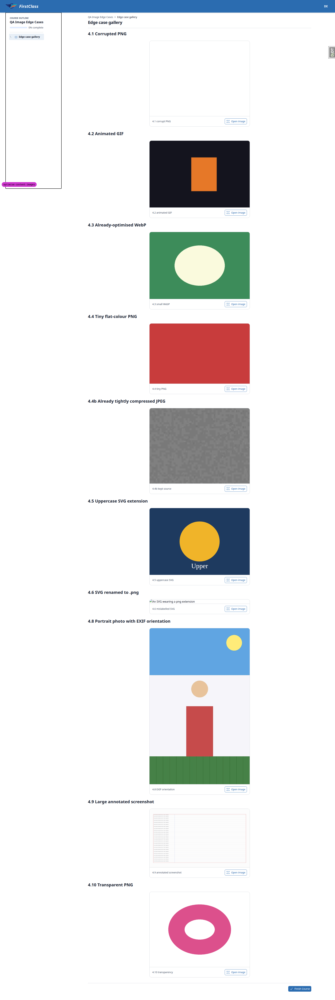
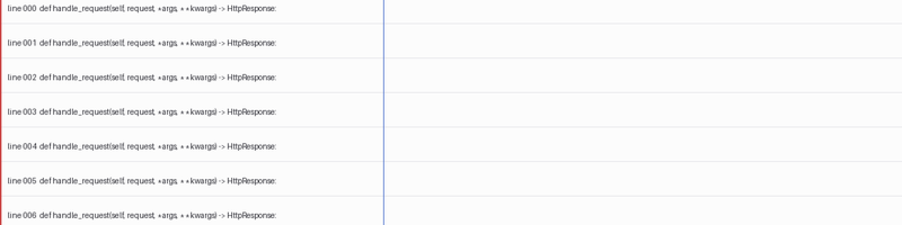
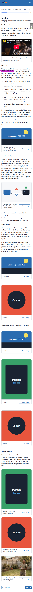
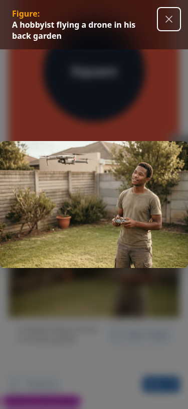
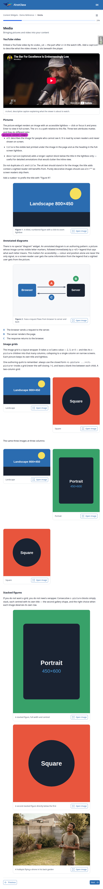
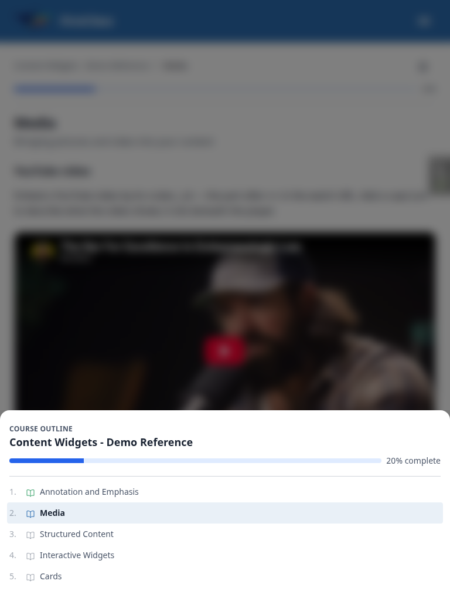

# Frontend QA report: optimise content images

Frontend QA for the `optimise-content-images` branch. All 40 checks in the test plan passed. No bugs were found.

## Methodology

The run used Playwright MCP driving a dev server on port 8925 against the `optimise-content-images` branch, with the branch confirmed via the debug-branch-badge. The tester was logged in as the dev admin (`demodev@email.com`). Screenshots were collected into `screenshots/` beside this report; every image referenced below exists there.

CLI-level checks (§1, and parts of §3 and §4) were run against `manage.py content_save` directly and verified against stored bytes with `cmp`, `md5sum` and Pillow, rather than through the browser, since those checks are about files and terminal output rather than pages.

## Diff scoping

The scoping gate classed this diff as **FULL**. The changed files were the image-optimisation implementation (`freedom_ls/base/images.py`, `freedom_ls/content_engine/images.py`, `freedom_ls/content_engine/management/commands/content_save.py`), their tests, `freedom_ls/organisations/validators.py`, a demo content addition (`demo_content/functionality_demo_content_widgets/2. media/content.md` and `images/backyard-drone-flight.jpg`), two product docs, and the `spec_dd/2. in progress/optimise-content-images/` plan files for this piece of work. Nothing was skipped: the full desktop, mobile and tablet passes all executed.

## Smoke gate

The smoke gate passed. Pages loaded: `http://127.0.0.1:8925/` and `http://127.0.0.1:8925/courses/content-widgets-demo-reference/2/` (the Media topic, the primary changed page).

## Results

### 1. CLI output (the author's view)

| Test | Viewport | Status | Notes |
| --- | --- | --- | --- |
| 1.1 | cli | pass | Created IMAGE file line present for all 7 images (6 svg + 1 jpg), not just the new photo. |
| 1.2 | cli | pass | Non-image type covered: "Created DOCUMENT file: functionality_demo_end_with_topic/1. topic/sample.pdf". |
| 1.3 | cli | pass | backyard-drone-flight.jpg: path line, "JPEG 2528x1696 -> WebP lossy 1600x1073", "1005 KB -> 97 KB (-90.3%), optimised." Large negative percentage. |
| 1.4 | cli | pass | All 6 .svg files show "SVG, passthrough." with no size line. |
| 1.5 | cli | pass | Success line visible on stdout: "✓ Successfully saved all content for site: DemoDev". |
| 1.6 | cli | pass | One summary line: "Images: 7 seen (1 optimised, 6 passthrough)." Statuses that did not occur are omitted. |
| 1.7 | cli | pass | No stray logger.info formatting, no traceback. stderr was completely empty. |
| 1.8 | cli | pass | Summary line prints below the success line, in that order. |

### 2. The learner-facing page

| Test | Viewport | Status | Notes |
| --- | --- | --- | --- |
| 2.1 | desktop | pass | Photograph renders in its c-picture card with caption "A hobbyist flying a drone in his back garden". Sharp; no blockiness, no banding in the sky or the smooth wall areas. |
| 2.2 | desktop | pass | All four pre-existing SVG figures render: landscape.svg (Figure 1), diagram.svg (Figure 2), square.svg and portrait.svg. No blank cards, no "Image not found" boxes. naturalWidth non-zero on every img. |
| 2.3 | desktop | pass | Both c-image-grid blocks tile correctly: the 2-column grid (landscape + square) and the 3-column grid (landscape + portrait + square). All figures render. |
| 2.4 | desktop | pass | "Open image" opens the lightbox showing the full 1600x1073 figure with its "Figure:" caption. Escape closes it; the "Close image" button also closes it. |
| 2.5 | desktop | pass | Page layout normal; nothing shifted or resized oddly. c-picture reserves no space, so the load-time jump is expected and not a regression. |
| 2.6 | desktop | pass | Photograph request URL ends .webp; Content-Type image/webp; Content-Length 99816 bytes (97 KB), well under the low-hundreds-of-KB budget. All four SVG requests end .svg with Content-Type image/svg+xml. |
| 2.7 | desktop | pass | demo_content/functionality_demo_content_widgets/2. media/content.md:74 still reads src="../images/backyard-drone-flight.jpg" — the author's original filename and extension, untouched, while a .webp is served. |

*2.1 — the new photograph rendering sharply in its c-picture card.*

*2.2/2.3/2.5 — the Media topic page: all SVG figures and both image-grid blocks render, layout unaffected.*

*2.4 — the lightbox open on the full-size photograph.*

### 3. Storage and the database

| Test | Viewport | Status | Notes |
| --- | --- | --- | --- |
| 3.1 | cli | pass | media/content_engine/ holds exactly one backyard-drone-flight object, the .webp. No orphaned .jpg or .png beside it. SVGs and the PDF are stored unchanged. |
| 3.2 | desktop | pass | Admin File row for the photograph: file_path "functionality_demo_content_widgets/images/backyard-drone-flight.jpg" (author's relative path, original extension); original_filename "backyard-drone-flight.jpg"; mime_type "image/webp"; stored file "/media/content_engine/backyard-drone-flight480981ee-...webp". |
| 3.3 | cli | pass | Second ingest run: md5sum diff empty (same filenames, same bytes); file count unchanged at 8; run-2 summary identical — "Images: 7 seen (1 optimised, 6 passthrough)." Per-file lines correctly say "Updated" rather than "Created". No cumulative re-encode. |
| 3.4 | cli | pass | git status --short demo_content/ is empty after the ingest run. |

*3.2 — the admin File row for the photograph, showing the original relative path and extension against a stored .webp with mime_type image/webp.*

### 4. Failure and edge branches

| Test | Viewport | Status | Notes |
| --- | --- | --- | --- |
| 4.1 | desktop | pass | Corrupted PNG (IDAT bytes flipped): CLI line "PNG 400x300, could not decode."; stderr warning names the relative path and the exception (OSError: broken data stream when reading image file); the run completed with exit 0. Stored byte-identical to source. Topic page loads; the figure card renders blank, which is correct for undecodable bytes stored unchanged. |
| 4.2 | desktop | pass | Animated GIF: CLI "GIF 240x160, passthrough." Stored byte-identical (cmp). Renders in the browser; stored file still reports n_frames=6, is_animated=True, so the animation survives. |
| 4.3 | desktop | pass | 600x400 already-optimised WebP: CLI "WEBP 600x400, passthrough." Renders. cmp against the source is byte-identical. |
| 4.4 | desktop | pass | Two fixtures. The plan's suggested 200x120 flat-colour PNG does not reach the kept-source branch: lossless WebP compresses it 292 B -> 38 B, so "optimised" is the correct outcome and it is served as image/webp. A second fixture, a 400x300 JPEG already saved at quality 15, does reach it: CLI "JPEG 400x300, re-encode not smaller, kept source." It is stored byte-identical and served with Content-Type image/jpeg. Both the branch and its "re-encode not smaller" wording verified. |
| 4.5 | desktop | pass | DIAGRAM.SVG (uppercase extension): CLI "SVG, passthrough." — not "could not decode". Stored byte-identical with its uppercase .SVG suffix, served as image/svg+xml, renders correctly. |
| 4.6 | desktop | pass | Real SVG named liar.png: CLI "could not decode.", stderr warning "UnidentifiedImageError: cannot identify image file". Run completed. Stored unchanged (cmp identical). Chrome does not sniff it, so the figure shows the broken-image placeholder with its alt text — explicitly acceptable per the plan. |
| 4.7 | cli | pass | Two .txt files in the tree both produced "Created DOCUMENT file: …" with their own file type and no image lines. Neither counted toward the images total (10 images seen, the .txt files excluded). |
| 4.8 | desktop | pass | Portrait phone photo in true sensor orientation (stored 1400x900, EXIF orientation 6). CLI "JPEG 900x1400 -> WebP lossy 900x1400 … optimised" — the source dimensions are reported already swapped so the line does not read as an aspect change. Renders upright in the browser at 900x1400: sky band at the top with the sun top-right, head above body, grass at the bottom. Not sideways, so exif_transpose ran and ran before draft(). |
| 4.9 | desktop | pass | 2400x1400 annotated screenshot: CLI "PNG 2400x1400 -> WebP lossless 1600x933 … 82 KB -> 42 KB (-48.9%), optimised." — lossless, not lossy. Verified decisively: the stored WebP is bit-exact against the LANCZOS-downscaled source (total channel difference 0). A 1:1 crop of the text shows crisp letter edges, no coloured haloes, no ringing; the 1px blue rule and thin red border survive as clean single-colour lines. |
| 4.10 | desktop | pass | Transparent PNG: CLI "PNG 800x600 -> WebP lossless 800x600 … optimised." Stored WebP is mode RGBA with alpha range 0-255; the corner and the ring's hole are (0,0,0,0) fully transparent, the ring itself opaque. Transparency survived — no black or white matte. |
| 4.11 | cli | pass | Third run over the same tree: both corrupt files warned again on stderr, the run completed with exit 0, the object count in media/content_engine/ was unchanged at 20, and an md5sum diff before/after was empty — no new or rewritten objects. |
| 4.12 | cli | pass | Scratch tree /tmp/qa_images removed, all QA content deleted, media/content_engine cleared, and the demo tree re-seeded per §0.3. |

*4.1–4.10 — the edge-case gallery topic: corrupt PNG, animated GIF, already-optimised WebP, kept-source JPEG, uppercase-extension SVG, mis-named SVG, upright EXIF-rotated photo and transparent PNG, all rendering as expected.*

*4.9 — 1:1 crop of the annotated screenshot's text, confirming lossless re-encoding: crisp edges, no haloes or ringing.*

### 5. Regressions elsewhere

| Test | Viewport | Status | Notes |
| --- | --- | --- | --- |
| 5.1 | desktop | pass | Admin > Organisations > DemoDev. A valid 320x320 PNG logo uploads and saves: "The organisation \"DemoDev\" was changed successfully." A corrupted PNG is rejected with exactly "File is not a readable image. Use PNG, JPEG or WebP." and the form does not save. Extracting the decode guard did not change check_logo_safety's behaviour. |
| 5.2 | desktop | pass | An 8.6 MB PNG logo is rejected with the size message: "Image file is too large (8.6MB; maximum is 2MB)." The form does not save. |
| 5.3 | desktop | pass | All five other demo courses load. The two that carry figures render them: "Functionality Demo - show end with Topic" topic 1 and "Functionality Demo - show end with Quiz" topic 1 both render graph1.drawio.svg at 471x301 with no broken images and no "Image not found" boxes. "Standard Markdown - Demo Finance" and "Functionality Demo - Course Parts" detail pages load cleanly. |
| 5.4 | cli | pass | OVERRIDE_COURSE_VISIBILITY_TO_VISIBLE and OVERRIDE_COURSE_ACCESS_TO_FREE are both back to False; git diff on config/settings_dev.py is empty, so neither can be committed as True. |

*5.1 — organisation logo upload succeeding and a corrupted logo being rejected.*

*5.2 — an oversized organisation logo rejected with the size-limit message.*

### Responsive: mobile (375x812)

| Test | Viewport | Status | Notes |
| --- | --- | --- | --- |
| 2.1-2.5 | mobile | pass | Media topic: zero horizontal overflow, no element extends past the viewport. Both c-image-grid blocks collapse to a single column; every figure renders at 341px with no broken images. The photograph and all four SVGs render. |
| 2.4 | mobile | pass | The photograph's lightbox opens full-width with its caption; the close button is a 44x44 touch target and Escape closes it. |
| 4.x | mobile | pass | The edge-case gallery, including the 1600px-wide annotated screenshot, produces zero horizontal overflow; every figure is constrained to 341px. |

*2.1–2.5, mobile — the Media topic at 375x812: single-column grids, no horizontal overflow.*

*2.4, mobile — full-width lightbox at 375x812.*

### Responsive: tablet (768x1024)

| Test | Viewport | Status | Notes |
| --- | --- | --- | --- |
| 2.1-2.5 | tablet | pass | Media topic: zero horizontal overflow, no broken figures. The course-outline sidebar correctly gives way to the mobile-style drawer at this width. Both grids resolve to two 352px columns — the 3-column grid falls back to 2 and wraps its third figure onto a new row, which reads sensibly at this width. |
| nav | tablet | pass | The "Open course outline" hamburger opens the outline drawer over a dimmed page, listing all five topics with the current one marked and the 20% progress bar. |

*2.1–2.5, tablet — the Media topic at 768x1024: grids fall back to two columns.*

*nav, tablet — the course outline drawer open over a dimmed page.*

## Bug status

No bugs found — all 40 checks passed.

## General notes

**Test plan fixture 4.4 does not reach the branch it targets**

The plan suggests "a tiny, already well-compressed PNG (e.g. 200x120 flat colour)" to exercise "kept source". It cannot: lossless WebP beats PNG on essentially every PNG, and the suggested fixture compresses 292 B -> 38 B, so the correct outcome is "optimised". Probing confirmed this across flat colour, RGB noise, 2/4/16-colour palette and bilevel noise at several sizes — WebP won every time. The branch's realistic trigger is an already heavily compressed JPEG; a 400x300 JPEG at quality 15 reaches it. Worth amending the plan's 4.4 fixture if it is ever re-run.

**Corrupted-PNG rendering differs slightly from the plan's prediction**

The plan expects the corrupt PNG to "show as a broken image". Chrome instead reports it as decodable (naturalWidth 400x300) and paints an empty card, because only IDAT bytes were flipped and the header is intact. The plan already treats either outcome as correct — the file is stored unchanged and the page loads — so this is a note, not a finding.

**Touch-target size on the figure "Open image" button**

At the 375x812 mobile viewport the "Open image" button in each figure caption measures 127x34 CSS px, under the 44px minimum touch target. The lightbox's own "Close image" button is correctly sized (min-w-11 min-h-11 = 44x44). This is pre-existing component styling, untouched by this diff, and is recorded only as an observation.

**Evidence method for the lossless claim (4.9)**

Rather than judging screenshot sharpness by eye alone, the stored WebP for the annotated screenshot was compared pixel-by-pixel against the source downscaled with the same LANCZOS filter: total channel difference 0, i.e. bit-exact. That is direct proof the lossless branch ran, stronger than a visual check. A 1:1 crop was also inspected and shows clean letter edges and intact 1px rules.

**Deviation from the plan's scratch-file locations**

The plan writes CLI captures to /tmp/content_save_run*.txt. Those were written into this session's scratchpad directory instead, per the session's file-handling rules. Content is identical; only the path differs.

status: ok · reason: report rendered, 40 checks documented, 0 bugs
