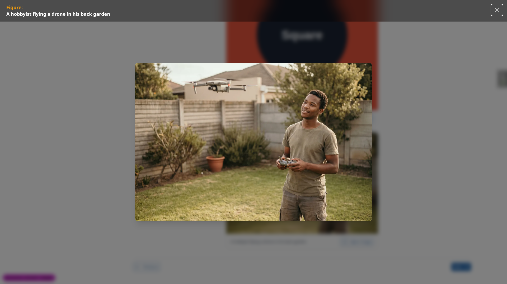
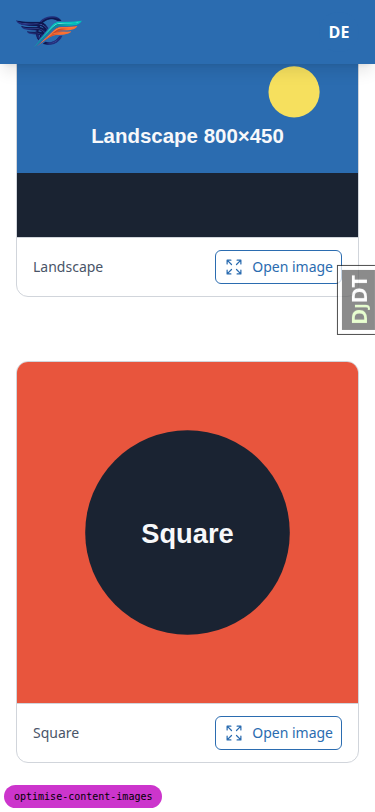
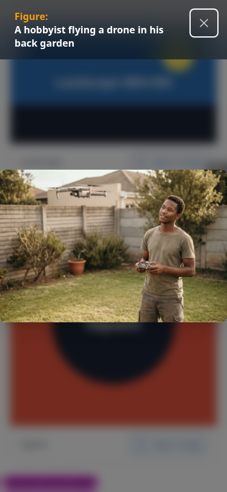
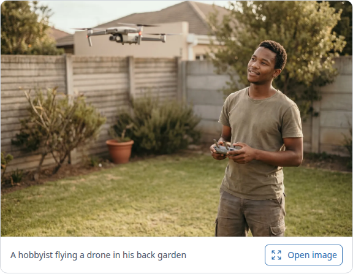
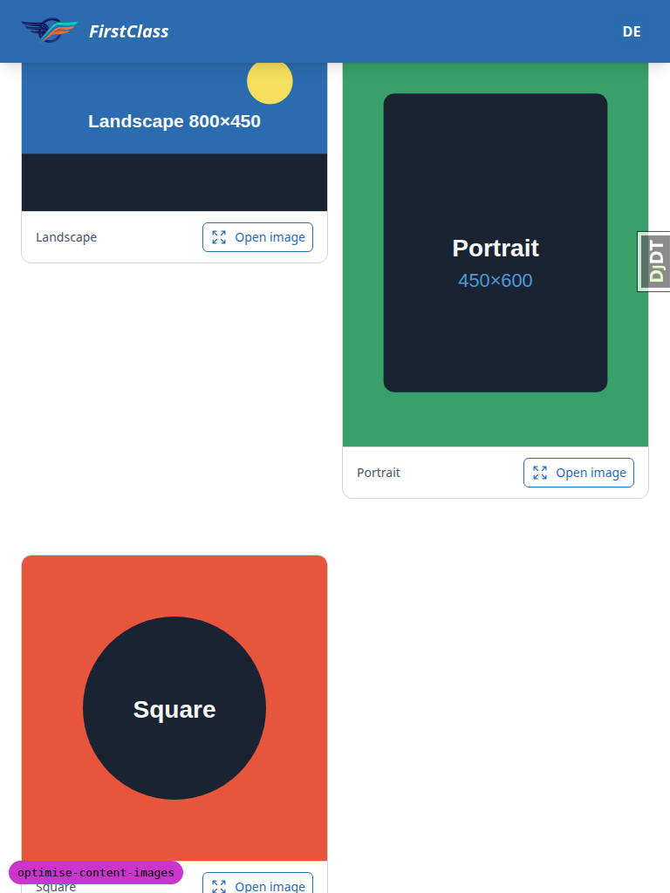
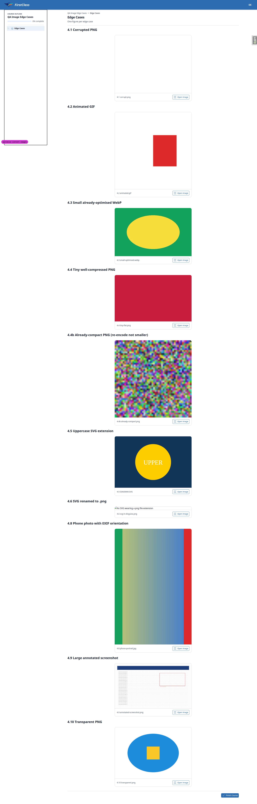
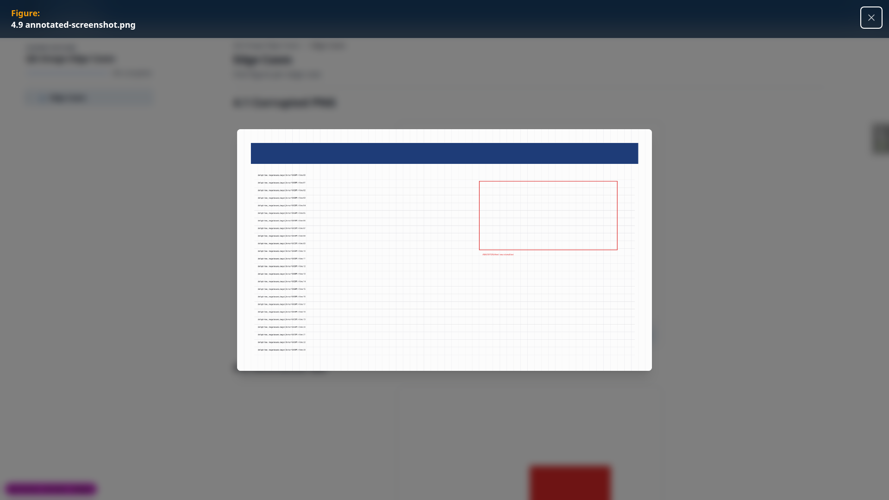
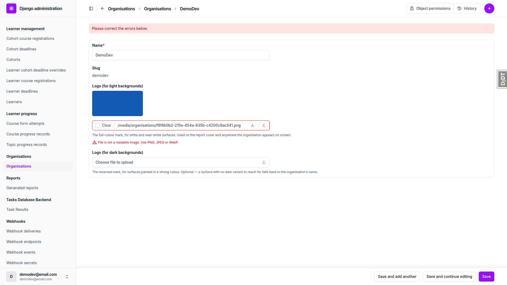

# Frontend QA report: optimise content images

Feature under test: image optimisation at content ingest (branch `optimise-content-images`).
`content_save` now converts photographs to WebP, reports its work to the author on the CLI, and
leaves passthrough types (SVG, already-optimised images) untouched.

## Methodology

Testing was done by hand through the Playwright MCP against a dev server running on port 8849,
logged in as the admin user. Screenshots were collected into `screenshots/` beside this report;
every image referenced below was confirmed present in that directory with a `Glob` before being
referenced.

The test plan's §0 setup was performed before testing began: the two preview overrides in
`config/settings_dev.py` (`OVERRIDE_COURSE_VISIBILITY_TO_VISIBLE`,
`OVERRIDE_COURSE_ACCESS_TO_FREE`) were temporarily set to `True`, `media/content_engine/` was
cleared, and `content_save demo_content DemoDev` was run to seed the demo course. All five
sections of the plan ran; nothing was skipped.

## Diff scoping

The scoping record classifies this run as **FULL**. The diff is not confined to `.py` files: it
also touches demo content (`2. media/content.md`) and adds a JPEG fixture
(`backyard-drone-flight.jpg`), plus the spec files for this feature. That takes it outside the
`.py`-only fast path, so rule 4 (the safe default) applies and the full plan runs rather than a
reduced one. Consequently nothing was skipped on scope grounds: the desktop, mobile and tablet
passes over §2 all ran.

## Smoke gate

The smoke gate passed. Pages loaded before testing began:

- `http://127.0.0.1:8849/`
- `http://127.0.0.1:8849/courses/content-widgets-demo-reference/2/` (Media topic)

## Results by plan section

### §1 CLI output

| Test | Viewport | Status | Finding |
| --- | --- | --- | --- |
| 1.1 | cli | pass | Created/Updated IMAGE file lines present for all 7 images, not only the new photo. |
| 1.2 | cli | pass | Non-image types get their own per-file lines too (a DOCUMENT line for `sample.pdf`). |
| 1.3 | cli | pass | New photo shows path, `JPEG -> WebP lossy` line, and a size/percentage line with a large negative percentage. |
| 1.4 | cli | pass | All 6 `.svg` files show `SVG, passthrough.` with no size line. |
| 1.5 | cli | pass | Success line `Successfully saved all content for site: DemoDev` is visible on stdout. |
| 1.6 | cli | pass | One run-summary line appears below the success line; statuses that did not occur are omitted. |
| 1.7 | cli | pass | stderr is empty: no traceback, no unformatted `logger.info` output. |
| 1.8 | cli | pass | Summary line prints after, not before, the success line. |

No screenshots for this section (CLI-only checks).

### §2 The learner-facing page

| Test | Viewport | Status | Finding |
| --- | --- | --- | --- |
| 2.1 | desktop | pass | Photograph renders sharp in its `c-picture` card with caption; no blockiness or banding. |
| 2.1 | mobile | pass | At 375x812 the photograph renders at 341x229 CSS px, sharp, no artefacts. |
| 2.1 | tablet | pass | At 768x1024 the photograph renders at 574 CSS px wide, sharp, no artefacts. |
| 2.2 | desktop | pass | All four pre-existing SVG figures render; no blank cards or "Image not found" boxes. |
| 2.2 | mobile | pass | All SVG figures still render at mobile width; zero broken images. |
| 2.2 | tablet | pass | All SVG figures render at tablet width; zero broken images. |
| 2.3 | desktop | pass | Both `c-image-grid` blocks (2-column and 3-column) tile correctly. |
| 2.3 | mobile | pass | Both grids collapse to a single column; figures and captions stay readable. |
| 2.3 | tablet | pass | Both grids resolve to two columns; the three-image grid wraps its third figure to a second row. |
| 2.4 | desktop | pass | Lightbox opens with the full-size figure and title, closes on Escape. |
| 2.4 | mobile | pass | Lightbox opens full-bleed with title and close button, closes on Escape. |
| 2.5 | desktop | pass | Page layout matches the pre-change structure; nothing shifted or resized oddly. |
| 2.5 | mobile | pass | No horizontal overflow; course-outline drawer opens as a bottom sheet. |
| 2.5 | tablet | pass | No horizontal overflow; drawer nav is the existing responsive design, unchanged by this diff. |
| 2.6 | desktop | pass | Photo served as `.webp` / `image/webp`, 97 KB transferred vs a 1005 KB source; SVGs still `.svg` / `image/svg+xml`. |
| 2.7 | desktop | pass | `content.md` still references the author's original `.jpg` filename even though a `.webp` is served; no content edit needed. |

Photograph card at desktop width, sharp with caption (test 2.1).

Media topic at desktop width: SVG figures and both image grids all rendering (tests 2.2, 2.3, 2.5).

Lightbox open on the photograph at desktop width (test 2.4).

Photograph card at 375px mobile width (test 2.1).

Media topic at mobile width: SVG figures and single-column grids (tests 2.2, 2.3).

Lightbox open full-bleed at mobile width (test 2.4).

Media topic at mobile width with the course-outline drawer open (test 2.5).

Photograph card at 768px tablet width (test 2.1).

Media topic at tablet width: SVG figures and two-column grids (tests 2.2, 2.3, 2.5).

### §3 Storage and the database

| Test | Viewport | Status | Finding |
| --- | --- | --- | --- |
| 3.1 | cli | pass | `media/content_engine/` holds 8 objects; no orphaned `.jpg`/`.png` sits beside the stored `.webp`. |
| 3.2 | desktop | pass | Admin File row keeps `file_path`/`original_filename` as the author's `.jpg`; `mime_type` is `image/webp`; the stored filename ends `.webp`. |
| 3.3 | cli | pass | Second ingest run is idempotent: identical md5sums, unchanged file count, matching summary line; per-file verb changes `Created` -> `Updated`. |
| 3.4 | cli | pass | `git status --short demo_content/` is empty after ingest; the source tree is not dirtied. |

Admin File detail for the photograph, showing the original path/filename alongside the `image/webp` mime type and `.webp` stored file (test 3.2).

### §4 Failure and edge branches

| Test | Viewport | Status | Finding |
| --- | --- | --- | --- |
| 4.1 | desktop | pass | Corrupt PNG: stderr warning names the path and `OSError`; run completes; per-file line reads `could not decode`; stored byte-identical; figure shows as an empty/partly-decoded card. |
| 4.2 | desktop | pass | Animated GIF: passthrough; stored byte-identical; still animates (`n_frames=6`). |
| 4.3 | desktop | pass | Already-optimised WebP: passthrough; byte-identical to source; served `image/webp`. |
| 4.4 | desktop | pass | "Kept source" branch confirmed with the expected wording, using a substitute fixture (see General notes). |
| 4.5 | desktop | pass | `DIAGRAM.SVG` (uppercase extension) reports `SVG, passthrough.`, not `could not decode`. |
| 4.6 | desktop | pass | Real SVG renamed to `.png`: `could not decode`, stderr warning, stored unchanged; browser shows alt text (allowed by the plan). |
| 4.7 | cli | pass | `notes.txt` gets its own DOCUMENT line; no image lines or count contribution. |
| 4.8 | desktop | pass | EXIF-rotated portrait photo: `optimised`, lossy; stored landscape but renders upright with correct orientation. |
| 4.9 | desktop | pass | Large annotated screenshot: `optimised`, lossless; pixel diff against the Lanczos-resized source is `(0, 0)` on every channel. |
| 4.10 | desktop | pass | Transparent PNG: `optimised`; stored RGBA with a fully transparent corner pixel; page shows through. |
| 4.11 | cli | pass | Re-running the scratch tree: corrupt files warn again, run completes, no new objects appear, summary line matches. |
| 4.12 | cli | pass | Scratch tree and content removed, `media/content_engine/` cleared and demo content re-ingested; dev database back to the 8-object demo state. |

Edge-case topic page rendering the corrupt PNG, GIF, WebP, kept-source PNG, uppercase-extension SVG, renamed-SVG, EXIF-rotated photo and transparent PNG fixtures (tests 4.1, 4.2, 4.3, 4.4, 4.5, 4.6, 4.8, 4.10).

Lightbox on the large annotated screenshot, showing clean edges with no haloes or ringing (test 4.9).

### §5 Regressions elsewhere

| Test | Viewport | Status | Finding |
| --- | --- | --- | --- |
| 5.1 | desktop | pass | Organisation logo upload still works; a corrupt upload is still rejected with the unchanged "not a readable image" message. |
| 5.2 | desktop | pass | A 5.6 MB logo is still rejected with the size-limit message. |
| 5.3 | desktop | pass | All four other demo courses load and render their figures and links. |
| 5.4 | cli | pass | `config/settings_dev.py` overrides reverted to `False`; `git status --short` clean. |

Organisation logo upload rejecting a corrupt file with the "not a readable image" message (test 5.1).

Organisation logo upload rejecting an oversized file with the size-limit message (test 5.2).

## Bug status

No bugs were found. Every test in the run passed, so there are zero bug records in the scratch
file and the table below is empty.

| ID | Test | Severity | Description |
| --- | --- | --- | --- |
| — | — | — | — |

## General notes

The test plan's §4.4 expectation needs correcting in a future revision. It suggests a 200x120
flat-colour PNG will exercise the `kept source` / `re-encode not smaller` branch. It does not:
WebP lossless takes that fixture from 295 B to 38 B, so it correctly reports `optimised` instead.
The `kept source` branch was exercised with a 48x48 random-noise PNG (7028 B) instead, which
produced exactly the wording the plan expects. The code is correct here; only the plan's suggested
fixture is wrong.

§4.1's corrupt PNG renders in the browser as a partly-decoded, mostly blank figure rather than a
classic broken-image icon, because Chrome tolerates a truncated `IDAT` chunk enough to draw
something. The test plan allows either outcome, so this is not a failure, but it is worth noting
so a future run is not surprised by the appearance.

The "Open image" buttons measure 34 CSS px tall at the 375px mobile viewport, below the usual 44px
touch-target guidance. This button is pre-existing chrome that this diff did not touch, so it is
recorded as an observation rather than a finding against this change.

Console output on the learner-facing pages carries report-only CSP violations for the jsdelivr CDN
scripts (htmx, Alpine, chart.js) and a YouTube/Google iframe `frame-src` violation. Both are
pre-existing and unrelated to image optimisation.

The YouTube embed on the Media topic rendered blank on the first desktop load and rendered
normally on a subsequent load. This looks like a network/CDN timing artefact of the test
environment rather than a regression introduced by this diff.

status: ok
reason: report rendered, 0 bugs documented, 16 screenshots verified
