# QA Report — TOC-in-development flag + visibility/access preview overrides

**Feature:** `override_course_access_and_details_page`
**Date:** 2026-07-11
**Site:** DemoDev (`FORCE_SITE_NAME` pinned in `settings_dev.py`)
**Method:** Manual browser QA via Playwright MCP against a dev `runserver`.
**Viewports exercised:** Desktop 1920×1080, Mobile 375×812, Tablet 768×1024.

## Result summary

**All tests passed. No bugs found.**

| Workflow | What it checks | Result |
|---|---|---|
| A1 | Flag `true`, no assessments → all TOC surfaces gone | ✅ Pass |
| A2 | Flag `true`, with assessment → panel keeps only assessments | ✅ Pass |
| A3 | Flag `false` → page unchanged (regression) | ✅ Pass |
| B1 | Visibility override → hidden course reachable + listed | ✅ Pass |
| B2 | Visibility override → coming-soon looks published | ✅ Pass |
| B3 | Visibility override → enrol actually self-registers | ✅ Pass |
| B4 | Access override → every course is free (badge, CTA, JSON-LD, self-register) | ✅ Pass |
| B5 | Data never written (revert spot-check) | ✅ Pass |
| B6 | Production-safety warning `W001` (terminal) | ✅ Pass |

Test data required by the plan was missing from the dev DB at the start of the run
and was created by the **`fls:qa-data-helper`** agent (6 courses on DemoDev +
verified learner `demodev@email.com`). Nothing was created by the tester directly.

---

## Part A — `table_of_contents_in_development` flag (overrides OFF)

### A1 — Flag `true`, no assessments: all TOC surfaces gone ✅
`/courses/qa-toc-in-development/detail/` — page loads 200. No **Lessons** stat card
(only the Enrolment card shows), **no** "This course includes" panel at all, **no**
"Course content" section, and no "0 lessons"/empty-list remnants.

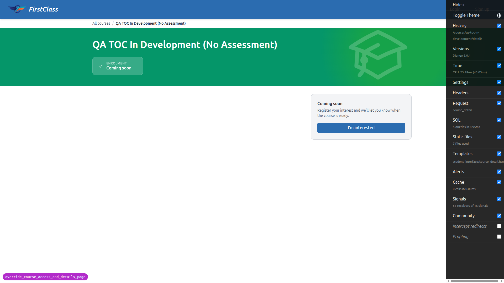

### A2 — Flag `true`, with an assessment: panel keeps only assessments ✅
`/courses/qa-toc-in-development-with-assessment/detail/` — no Lessons stat card and
no "Course content" section (as A1). The "This course includes" panel **is present**
and shows only **"Includes assessments"**, with **no** "N lessons" line above it.

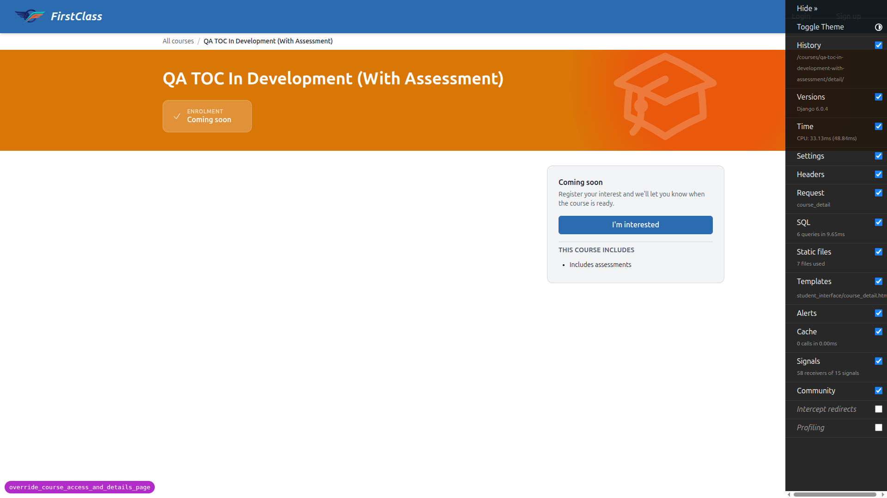

### A3 — Flag `false`/omitted: page unchanged (regression) ✅
`/courses/qa-free-course-access-types/detail/` — everything renders as before: the
**"3 lessons"** stat card, a "This course includes" panel with a lessons line, and
the **"Course content"** section with its table of contents. Nothing hidden.

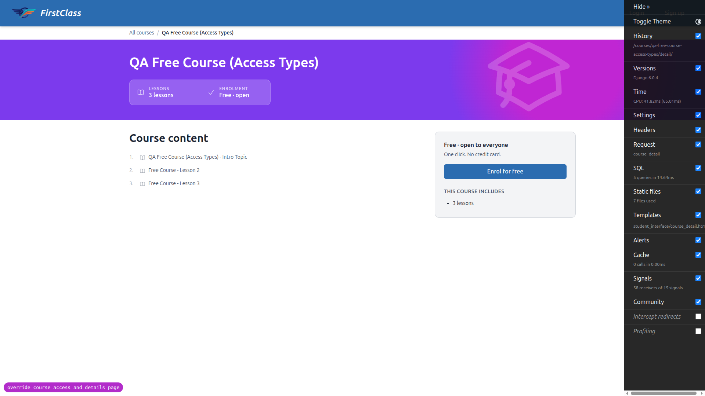

---

## Part B — preview overrides

Overrides were toggled by temporarily editing `config/settings_dev.py` and
restarting the server, then reverted. **The file was fully restored — `git diff
config/settings_dev.py` is empty at end of run.**

### B1 — Visibility override: hidden course reachable ✅
With `OVERRIDE_COURSE_VISIBILITY_TO_VISIBLE = True`, logged out:
`/courses/qa-hidden-course/detail/` returns **200** (baseline with override OFF was
verified **404**). The hidden course also now appears in `/courses/`.

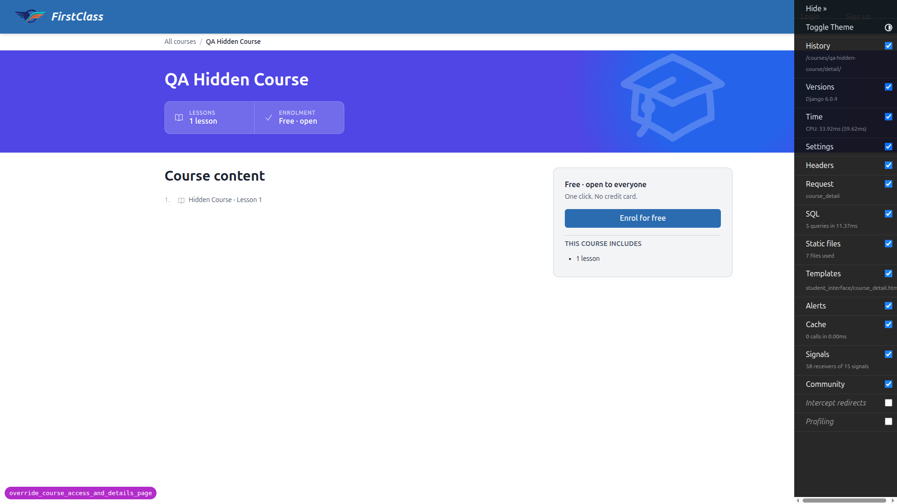
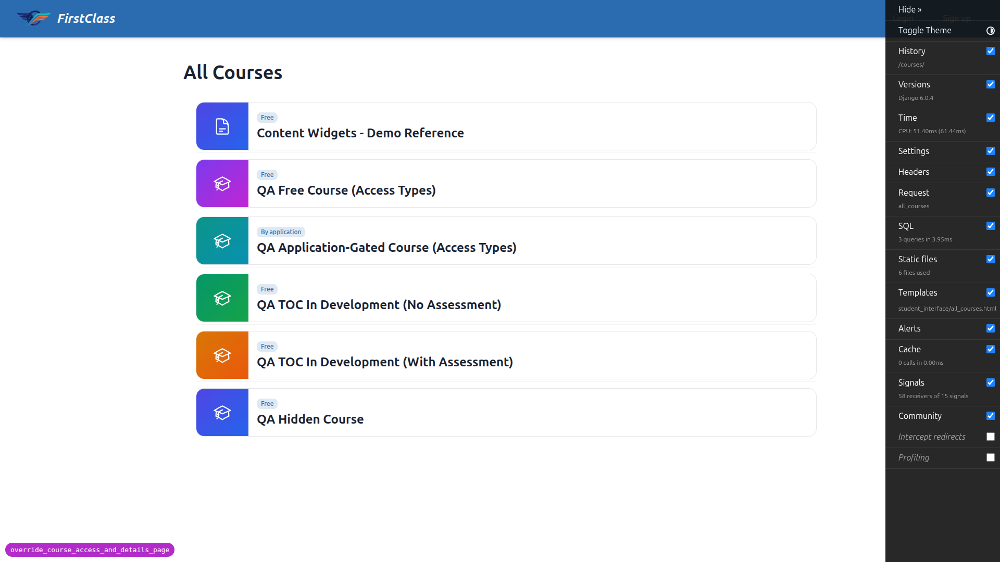

### B2 — Visibility override: coming-soon looks published ✅
`/courses/content-widgets-demo-reference/detail/` shows **no** "Coming soon"
badge/eyebrow and **no** "I'm interested" control — the normal **"Enrol for free"**
CTA appears instead. The catalogue and the logged-in dashboard `/` show **no**
"Coming soon" status anywhere.

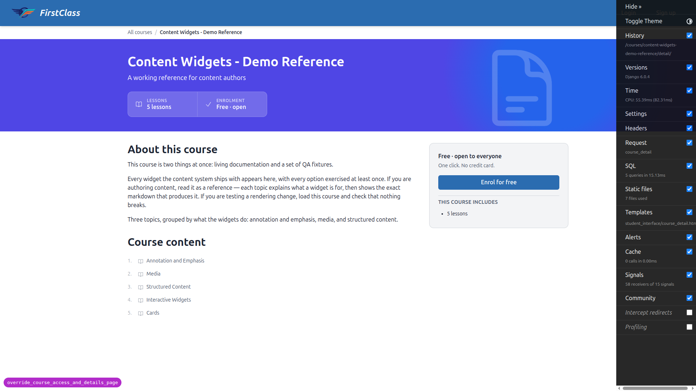
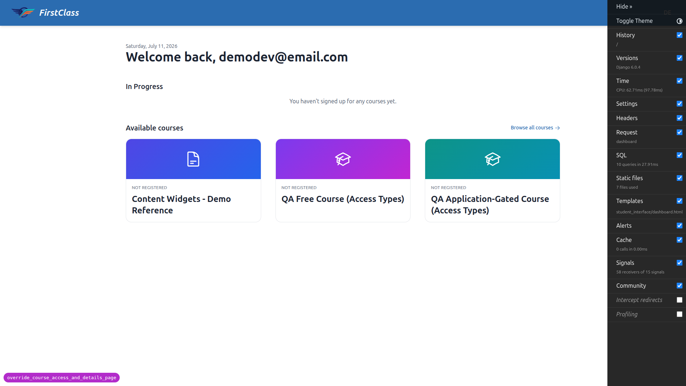

### B3 — Visibility override: enrol actually self-registers ✅
Logged in as `demodev@email.com`, clicking **"Enrol for free"** on the coming-soon
course self-registered the learner and landed them **inside the course player**
(`/courses/content-widgets-demo-reference/1/`) — not bounced back to the detail page.

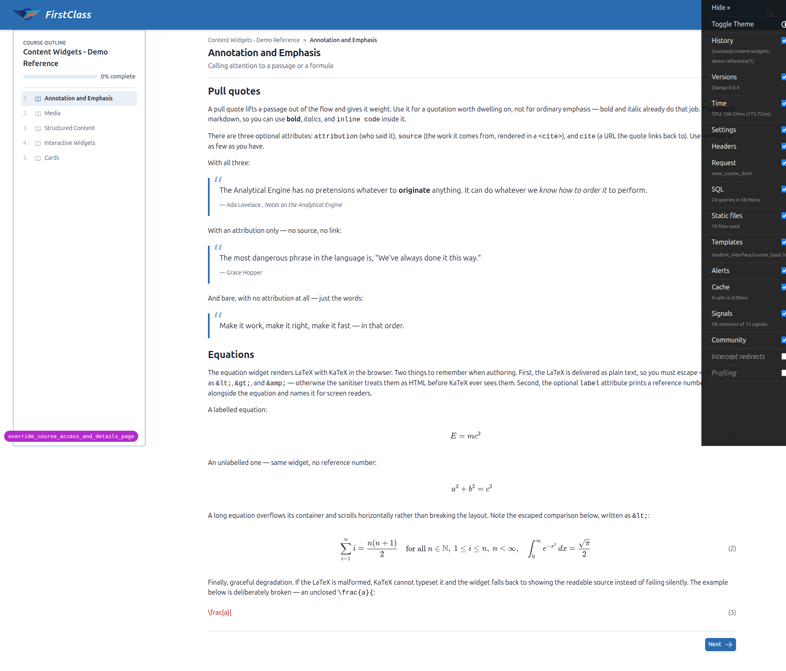

### B4 — Access override: every course is free ✅
With `OVERRIDE_COURSE_ACCESS_TO_FREE = True` (visibility override off):
- The gated course's catalogue badge reads **"Free"** (not "By application") —
  verified in the logged-out listing markup.
- `/courses/qa-application-gated-course-access-types/detail/` CTA reads **"Enrol for
  free"** (not "Apply now").
- The Course JSON-LD (`<script id="course-jsonld">`) contains
  **`"isAccessibleForFree": true`**.
- Clicking the CTA (logged in) **self-registered** the learner into the gated course
  (`/courses/qa-application-gated-course-access-types/1/`).

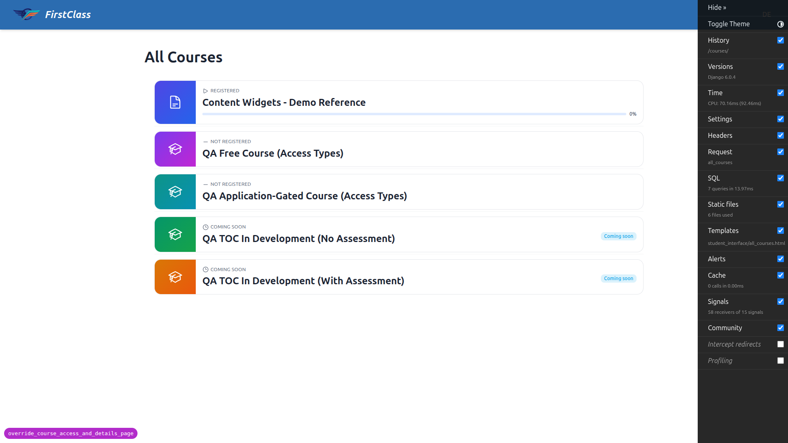
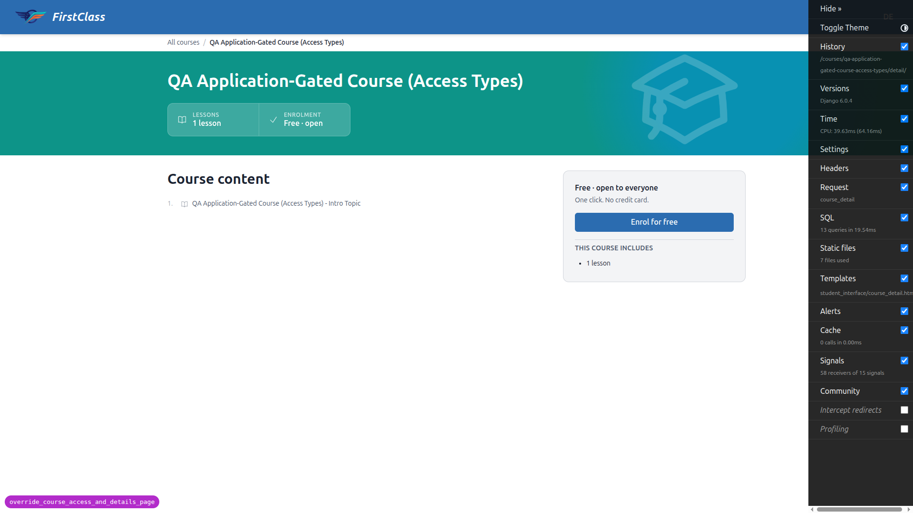
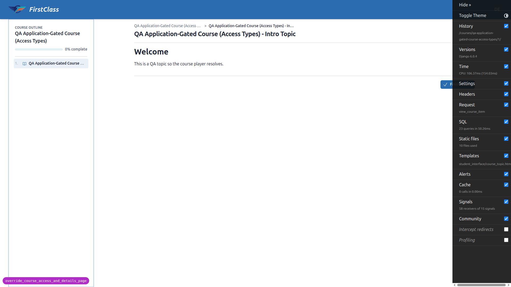

### B5 — Data is never written (spot check) ✅
Both overrides set back to `False` and the server restarted. Logged out:
`qa-hidden-course` returns **404** again, the gated course detail CTA is **"Apply
now"** again with JSON-LD `"isAccessibleForFree": false`, the gated catalogue badge
is **"By application"** again, and the coming-soon course shows **"Coming soon"**
again. This confirms the overrides only changed what was *reported*, never the
stored `visibility` / `access_config`.

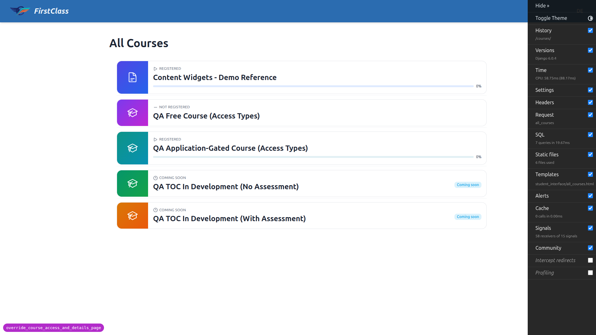

### B6 — Production-safety warning (terminal, not browser) ✅
With `DEBUG = False` **and** `OVERRIDE_COURSE_VISIBILITY_TO_VISIBLE = True`,
`uv run python manage.py check` emits:

```
WARNINGS:
?: (freedom_ls_course_access.W001) Course preview override(s) enabled with
DEBUG=False: ['OVERRIDE_COURSE_VISIBILITY_TO_VISIBLE']. These are dev/staging
only — unset them for this environment.

System check identified 1 issue (0 silenced).
```

The command still exits **0** (Warning, not Error — does not block). Restoring
`DEBUG = True` and re-running `check` → **"System check identified no issues"** — the
warning is gone. All `settings_dev.py` edits were reverted.

---

## Responsive checks (mobile 375×812 / tablet 768×1024)

No horizontal overflow at any viewport on the course-detail pages or the catalogue
grid (measured `document.documentElement.scrollWidth ≤ viewport width` in every
case). The stat strip, sign-up/"This course includes" panel, and Course-content
table-of-contents reflow into a single column on mobile and adapt sensibly on
tablet; catalogue cards stack/grid appropriately.

| | Mobile | Tablet |
|---|---|---|
| Free course detail (full layout) | 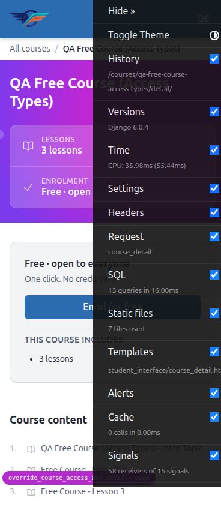 | 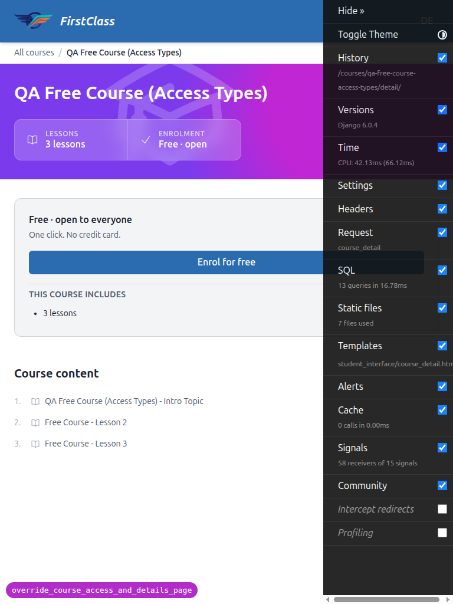 |
| TOC-in-dev w/ assessment | 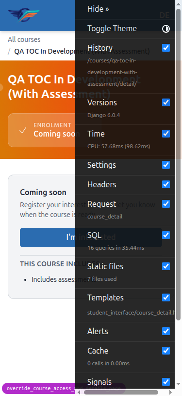 | — |
| Catalogue | 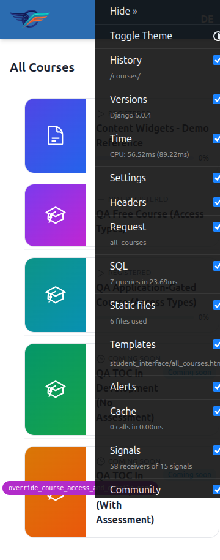 | 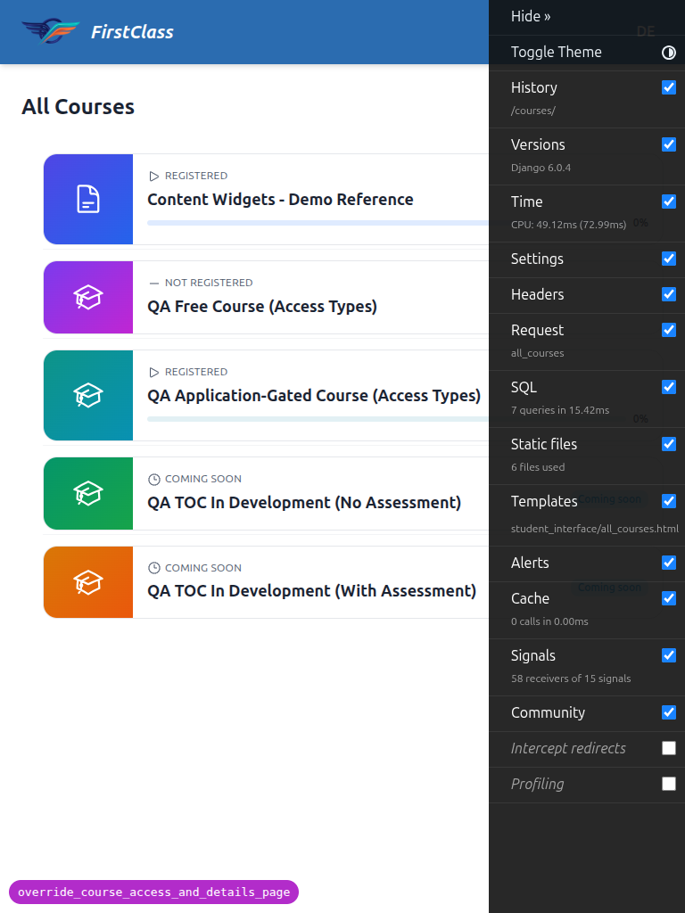 |

---

## Tangential observations (not failures, out of scope of this feature)

- **JSON-LD script `type` attribute.** The Course structured-data block is emitted as
  `<script id="course-jsonld" type="application/json">`. Schema.org structured data
  is conventionally served as `type="application/ld+json"` so search engines
  recognise it. The `isAccessibleForFree` value the spec asked for is correct, so
  this does not fail B4 — but the `type` attribute means the block would not be
  picked up as JSON-LD by crawlers. This appears to be pre-existing behaviour of the
  course-detail template, unrelated to the override feature under test. Flagged for
  awareness only.

## Notes / difficulties

- All required test data was missing at the start of the run (every course 404'd).
  The `fls:qa-data-helper` agent created the six courses on DemoDev and confirmed the
  verified learner. It added an idempotent management command
  `freedom_ls/qa_helpers/management/commands/qa_create_course_detail_variants.py` for
  the TOC/hidden variants — noted here since it is a new file produced during QA
  setup (in the `qa_helpers` dev-only app).
- The dev server crashed once as expected when `DEBUG` was flipped to `False` for B6
  (empty `ALLOWED_HOSTS`); it was restarted afterward for the responsive checks. B6
  itself is a terminal-only check and was unaffected.
