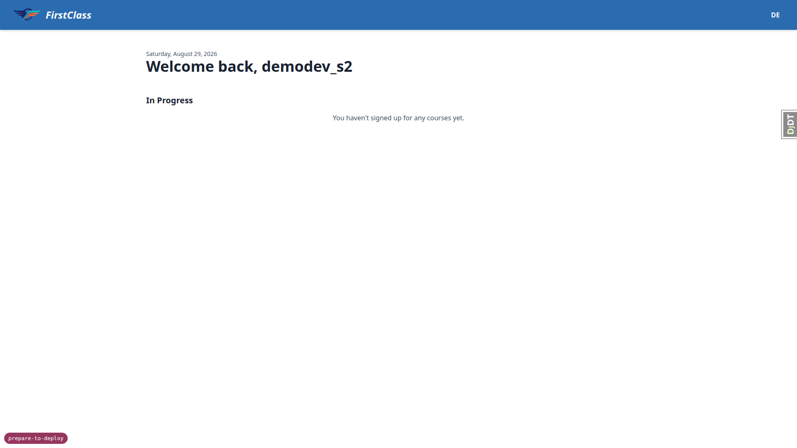
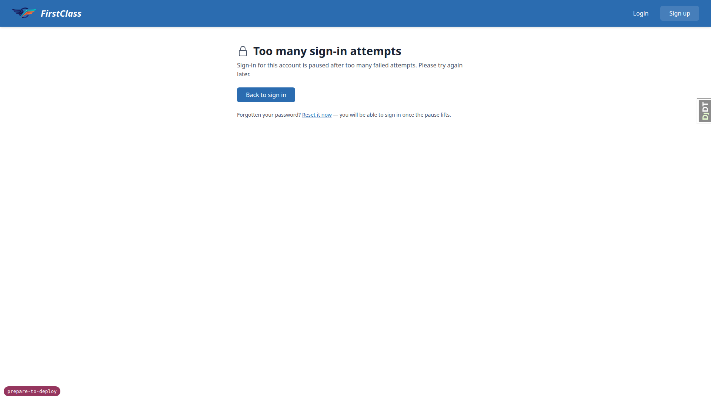

# Frontend QA report — Prepare to deploy

## Verdict

This run tested the three browser-reachable surfaces of the "prepare to deploy" change: the
bootstrap admin command (`setup_initial_prod_data`), the nested `AXES_LOCKOUT_PARAMETERS` lockout
behaviour, and the `AXES_CLIENT_IP_CALLABLE` rewrite of `get_client_ip`, across desktop, mobile and
tablet viewports, plus the two long-running commands (`fls_run_housekeeping`, `fls_run_worker`).
Every recorded test passed. The one recorded failure was not a test result against the plan's
criteria but a separate observation about the appearance of the lockout page (bug B1). That bug has
since been fixed and §4 re-run end to end against the fix: a locked-out learner now lands on a
branded FLS page carrying a route back to sign-in and to password reset. The feature is sound — the
pair-keyed lockout, the IP-spoofing resistance, and the bootstrap-admin login path all behave
exactly as specified — and nothing is left open.

## Methodology

Screenshots referenced below were collected into `screenshots/` beside this report; every image
named in this report exists there. The run did not abort at the smoke gate, so every section of the
test plan (`3. frontend_qa.md`) ran, across desktop, mobile and tablet passes.

§4 was re-run in full on a later pass, after bug B1 was fixed, on a fresh server at
`http://127.0.0.1:8905` against the same per-branch dev database. Its rows below record that
re-run, not the original one. No other section was re-run.

Before testing could start, the dev database had to be rebuilt: it was empty and its migration
history was inconsistent (`learner_progress.0001_initial` had applied before `form_engine.0003`).
It was dropped, recreated, migrated and re-seeded with `create_demo_data`. This is stale
per-branch dev-environment residue, not a product defect, and it did not affect any result below.

## Diff scoping

Class: **FULL**. Rule 4, the safe default, applies: the diff is not all-`.py` (it also carries
`.md` spec files and `.secrets.baseline`), and it contains no template, static, HTML, CSS or JS
changes. Nothing was skipped: desktop, mobile and tablet passes all ran in full.

## Smoke gate

Pass. Pages loaded as the logged-in user: `http://127.0.0.1:8538/` and
`http://127.0.0.1:8538/accounts/login/`.

## Results by test-plan section

### §1 — bootstrap admin can sign in

| Step | Status | Observation |
| --- | --- | --- |
| 1.1 | pass | `setup_initial_prod_data qa-admin@example.test --domain 127.0.0.1:8000` printed a 22-character mixed-case-and-digit password (`mxoJ3Yce...`) and "This password is shown once and is stored nowhere. Record it now." |
| 1.2 | pass | `/accounts/login/` renders 200 with email and password fields. |
| 1.3 | pass | Signed in as `qa-admin@example.test` with the generated password; landed on the dashboard with "Successfully signed in as qa-admin@example.test." The verified `EmailAddress` row exists, so mandatory verification does not block the bootstrap admin. Screenshot: `page-2026-08-29T12-53-16-723Z.png`. |
| 1.4 | pass | Signed out via the user menu; nav returns to Login / Sign up. |

### §2 — running the bootstrap command twice changes nothing

| Step | Status | Observation |
| --- | --- | --- |
| 2.1 | pass | Site `127.0.0.1:8000` name is `DemoDev` before the re-run. |
| 2.2 | pass | Second run printed only "Administrator qa-admin@example.test already exists; password unchanged." No password in the output. |
| 2.3 | pass | Site name still `DemoDev` after the re-run; the `--site-name` default did not overwrite the existing row. |
| 2.4 | pass | Signed in again as `qa-admin@example.test` with the **original** password from 1.1. Success — the credential was not reset. |

### §3 — login page and signup flow

| Step | Viewport | Status | Observation |
| --- | --- | --- | --- |
| 3.1 | desktop | pass | `/accounts/login/` renders 200 with the sign-in form. |
| 3.2 | desktop | pass | `/accounts/signup/` renders 200 with both consent checkboxes ("I accept the Terms and Conditions", "I accept the Privacy Policy") linking to `/accounts/legal/terms/` and `/accounts/legal/privacy/`. |
| 3.3 | desktop | pass | `/accounts/password/reset/` renders 200 with the email field and Reset My Password button. |
| 3.4 | desktop | pass | Signed in as `demodev_s1@email.com` successfully, then signed out. |
| 3.5 | desktop | pass | Signed up `qa-signup-1@example.test` with both consent boxes ticked. Flow completed to `/accounts/confirm-email/` (Verify Your Email Address). No 500, no `TypeError`/`AttributeError` from `get_client_ip`. Screenshot: `page-2026-08-29T12-54-44-659Z.png`. |
| 3.6 | desktop | pass | `LegalConsent.ip_address` for `qa-signup-1@example.test` is `127.0.0.1` — not blank, not `None`. With `TRUSTED_PROXY_IP_HEADER=None` the helper falls through to `REMOTE_ADDR` correctly. |
| 3b.7 | desktop | pass | Re-submitted signup with the existing address `qa-signup-1@example.test`. Landed on the same `/accounts/confirm-email/` page — no "address is taken" error. `ACCOUNT_PREVENT_ENUMERATION` holds. |
| 3.1 | mobile | pass | 375x812. Login form renders single-column, no horizontal overflow (`scrollWidth` 375 = viewport), no element past the right edge, fields full-width and legible. Screenshot: `page-2026-08-29T13-00-20-192Z.png`. |
| 3.2 | mobile | pass | 375x812 full-page. Signup form stacks cleanly; both consent checkboxes and their Terms/Privacy links sit on one line each and stay inside the viewport. No overflow. Screenshot: `page-2026-08-29T13-00-59-544Z.png`. |
| nav | mobile | pass | 375x812, logged in as `demodev_s1`. Header collapses to the circular avatar; tapping it opens the user menu inside the viewport with comfortably sized Profile and Sign Out targets. No hamburger drawer used or needed. Screenshot: `page-2026-08-29T13-01-21-755Z.png`. |
| 3.1 | tablet | pass | 768x1024. Login page gets the full desktop nav — wordmark visible, Login / Sign up links render inline rather than collapsing. No horizontal overflow (`scrollWidth` 768), no element past the right edge. |
| 3.2 | tablet | pass | 768x1024. Signup form renders single-column at a comfortable width, both consent rows intact, Sign Up button clear. No overflow, no crowding. Screenshot: `page-2026-08-29T13-01-57-279Z.png`. |
| nav | tablet | pass | 768x1024, logged in. Dashboard keeps the desktop header; the user-menu avatar opens and Sign Out works from tablet width. Screenshot: `page-2026-08-29T13-01-47-387Z.png`. |

### §4 — lockout locks the pair, not the address (headline result)

Re-run in full after the B1 fix. The branch badge read `prepare-to-deploy` before any step ran.

| Step | Status | Observation |
| --- | --- | --- |
| 4.1 | pass | `axes_reset` reported "No attempts found." — a clean start. |
| 4.2 | pass | Five wrong-password submits for `demodev_s1@email.com` at `/accounts/login/`. Attempts 1-4 each returned HTTP 200 with the ordinary allauth error "The email address and/or password you specified are not correct." The fifth returned **HTTP 429** rendering the new `accounts/lockout.html`: the FirstClass header bar, the heading "Too many sign-in attempts", the line "Sign-in for this account is paused after too many failed attempts. Please try again later.", a "Back to sign in" button and a password-reset link. Screenshot: `page-2026-08-29T13-54-52-032Z.png`. |
| **4.3** | **pass** | **CRITERION MET.** Same browser, same `127.0.0.1` address that had just locked `demodev_s1` out. Signed in as `demodev_s2@email.com` with its correct password: succeeded, "Successfully signed in as demodev_s2@email.com." The nested `AXES_LOCKOUT_PARAMETERS` still holds — the lockout is keyed on the (ip, username) pair, not the address alone. Screenshot: `page-2026-08-29T13-55-26-321Z.png`. |
| 4.4 | pass | Signed out, then retried `demodev_s1@email.com` with its correct password. Still HTTP 429, still the lockout page. The lockout is keyed on that pair and survives a correct credential. |
| 4.5 | pass | `axes_reset` reported "1 attempts removed." |
| 4.6 | pass | After the reset, `demodev_s1@email.com` signed in with its correct password and landed on the dashboard. |
| 4.2b | pass | Extra check against B1: from the lockout page, "Back to sign in" lands on `/accounts/login/` (200, the sign-in form) and "Reset it now" lands on `/accounts/password/reset/` (200, Password Reset). The page is no longer a dead end. |
| 4.2c | pass | The lockout page at 375x812: `scrollWidth` 375 = viewport, no element past the right edge, heading wraps to two lines, button and reset link stay legible. Screenshot: `page-2026-08-29T13-55-04-876Z.png`. |

The only console error recorded across the whole re-run is the browser's own note that
`/accounts/login/` answered 429 — the status the test expects, not a page defect.

Step 4.3, the criterion, from the same browser and address that had just locked `demodev_s1` out:

### §5 — spoofed client-IP header changes nothing (headline result)

| Step | Status | Observation |
| --- | --- | --- |
| 5.2 | pass | Re-locked `demodev_s1@email.com` from the browser (same origin, same cookies): attempts 1-4 HTTP 200 invalid-credentials, attempt 5 HTTP 429 "Account locked." |
| **5.3** | **pass** | With `X-Real-IP: 203.0.113.99` set on the request, eight further login attempts all returned HTTP 429 "Account locked" — including one with the correct password, six further wrong-password attempts (no fresh set of five became available), and one with a spoofed `X-Forwarded-For: 198.51.100.7`. The header buys nothing. Direct non-vacuity control: `TRUSTED_PROXY_IP_HEADER` is `None`, `AXES_CLIENT_IP_CALLABLE` is `freedom_ls.accounts.utils.get_client_ip`, and `get_client_ip()` on a `RequestFactory` request carrying both `HTTP_X_REAL_IP` and `HTTP_X_FORWARDED_FOR` returns `127.0.0.1` (`REMOTE_ADDR`). `AXES_LOCKOUT_PARAMETERS` reads `[['ip_address', 'username']]` — the nested form. The bare-curl variant returned 403 CSRF as the plan anticipates, so the browser run is the authoritative one. |
| 5.4 | pass | `axes_reset` cleared the lockout. |

§5 was **not** re-run after the B1 fix, so the response bodies quoted above describe the pre-fix
page. Those attempts now render the branded lockout page instead; the HTTP 429 statuses and every
conclusion drawn from them are unaffected, since the fix changes only what axes renders at that
status.

### §6 — deleted commands are gone

| Step | Status | Observation |
| --- | --- | --- |
| 6 | pass | `create_site` and `create_site_superuser` both report "Unknown command" and are absent from `manage.py help`. `setup_initial_prod_data`, `fls_run_worker` and `fls_run_housekeeping` all appear in help. |

### §7 — bad input to the bootstrap command

| Step | Status | Observation |
| --- | --- | --- |
| 7.1 | pass | `setup_initial_prod_data` with no `--domain` printed exactly "Error: No --domain given and HOST_DOMAIN is not set in this settings module." — a clear message, no traceback — and exited 1. `qa-admin-2@example.test` does not exist: no partial rows were written. |
| 7.2 | pass | `setup_initial_prod_data qa-admin-3@example.test --domain qa-new.example.test` succeeded and printed a 22-character password. The new site carries exactly one `Organisation` with `is_default=True`, created by the `post_save` receiver rather than the command. |

### §8 — the two long-running commands

| Step | Status | Observation |
| --- | --- | --- |
| 8.1 | pass | `fls_run_housekeeping` exits 1 under the dev `ImmediateBackend` with "CommandError: prune_db_task_results failed: Error: argument --backend: Backend default is not a database backend" on stderr, naming the failing step. No heartbeat file was written. Proved the session sweep still runs despite the earlier failure by planting two sessions: the expired one (`qa-expired-sess-001`) was deleted and the live one (`qa-live-sess-002`) survived. Spec line 299 ("A prune that raises still runs the session sweep... exits non-zero... does not touch the heartbeat") is satisfied on every clause. |
| 8.2 | pass | `fls_run_worker` started and stayed running. `/tmp/heartbeat` advanced between readings: 14:59:45.173 then 14:59:48.254 — touched once per poll while idle. SIGINT produced "Received Interrupt - shutting down gracefully... (press Ctrl+C again to force)" and the process exited about 0.5s later. No hang on the watchdog thread. |

## Bug B1 — the account-lockout page was an unstyled, dead-end plain-text response — **FIXED**

Manifestation: 4.2-lockout-page, desktop.

**Was:** `AXES_LOCKOUT_TEMPLATE` and `AXES_LOCKOUT_URL` were both `None`, so django-axes returned
its built-in HTTP 429 body: the single sentence "Account locked: too many login attempts. Please
try again later." as unstyled serif text on a blank white page. No header, no branding, no
navigation, and no link anywhere. It mattered because this change makes lockout the expected path
for a legitimate user who mistypes a password five times, so it is the surface the feature now
routes people to.

**Now:** `config/settings_base.py` sets `AXES_LOCKOUT_TEMPLATE = "accounts/lockout.html"`, and that
template (`freedom_ls/accounts/templates/accounts/lockout.html`) extends
`allauth/layouts/entrance.html`, so the page inherits the FLS header bar, wordmark and type. It
names the problem, and offers two ways forward: a "Back to sign in" button and a password-reset
link. The HTTP status stays 429 and the URL stays `/accounts/login/`.

At 375x812, with no horizontal overflow:

Two product decisions shaped the copy. The cool-off duration is **not** disclosed — "please try
again later", no number. And the password-reset link is worded so it does not promise an unlock:
axes blocks the login POST before the password is checked, so a reset does not lift a live lockout,
it only means the visitor can sign in once the lockout clears.

Fixed under TDD. `freedom_ls/accounts/tests/test_lockout_page.py` drives five failed logins through
the real login view and asserts the response is 429, renders `accounts/lockout.html`, carries both
links, and no longer carries axes' bare default sentence; both tests failed before the fix.
`freedom_ls/accounts/tests/test_utils.py` gained a settings assertion beside its two axes siblings.
Full suite: 3074 passed, coverage 88.65%.

## Bug status

- **RESOLVED** — The account-lockout page is now a branded FLS page with a route back to sign-in and
  to password reset. §4 was re-run in full against the fix and every step passes, the criterion
  (4.3) included.

## General notes

- Housekeeping observability gap, not a spec violation: when `fls_run_housekeeping` fails, its
  output names only the failing step. A successful `clearsessions` is silent, so an operator
  reading the output cannot tell whether the later sweeps ran or were skipped. The test plan's 8.1
  wording expects the message to also show the session sweep ran; the spec (line 299) requires
  only that the sweep still runs, which it demonstrably does. Verifying it required planting
  sessions and re-querying rather than reading the command output.
- Pre-existing and unrelated to this feature: many commands emit repeated warnings like "Rejected
  site domain '127.0.0.1:8003' as a legal-docs directory name; falling back to _default only" for
  every demo site whose domain carries a port. Noise only — it did not affect any result here.
- `screenshots/` also received roughly 73 `.yml` accessibility snapshots and `.log` console files
  that the collect script moves by design, alongside the 10 PNGs referenced in this report.

status: ok
reason: 1 bug — 1 fixed, 0 unresolved; §4 re-run in full against the fix and every step passes; all other test-plan sections pass; report rendered, screenshots verified
