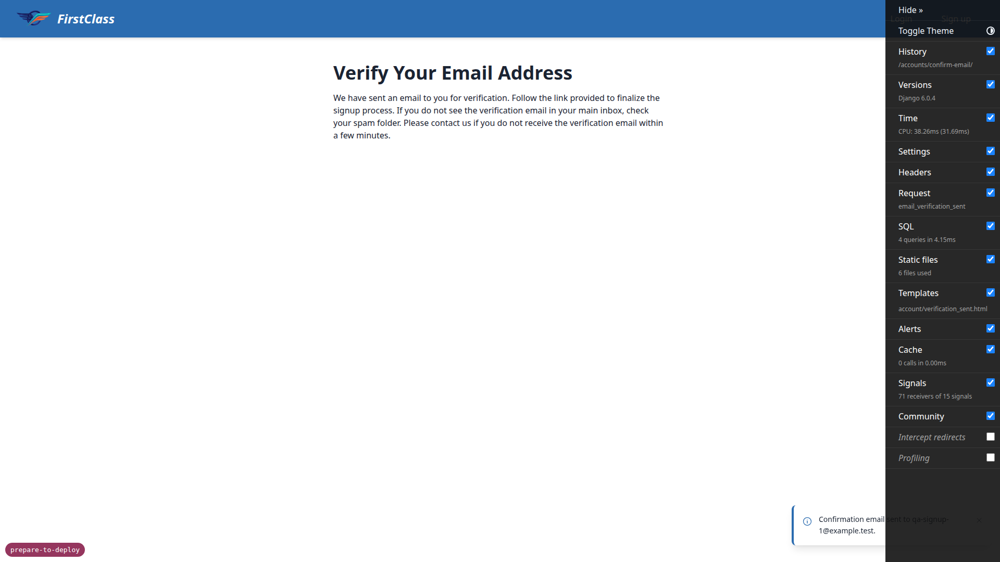
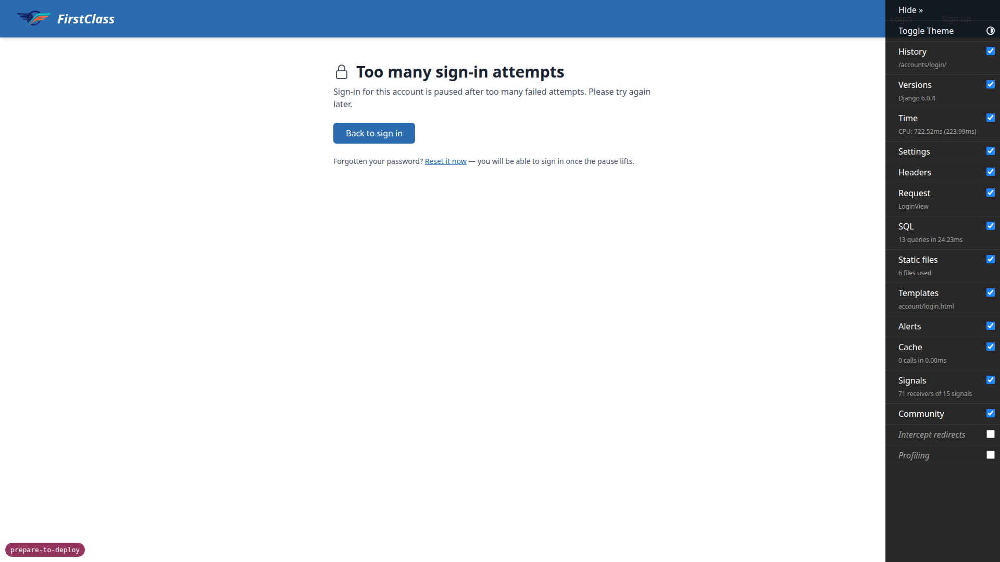
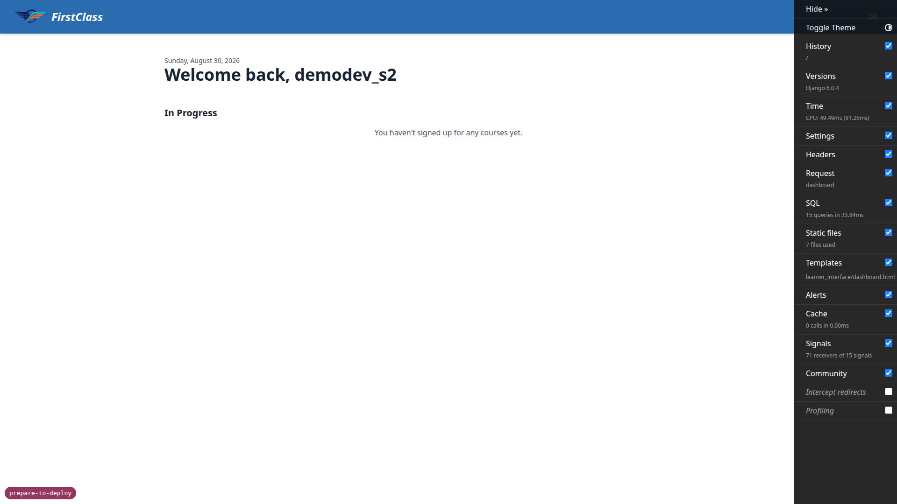
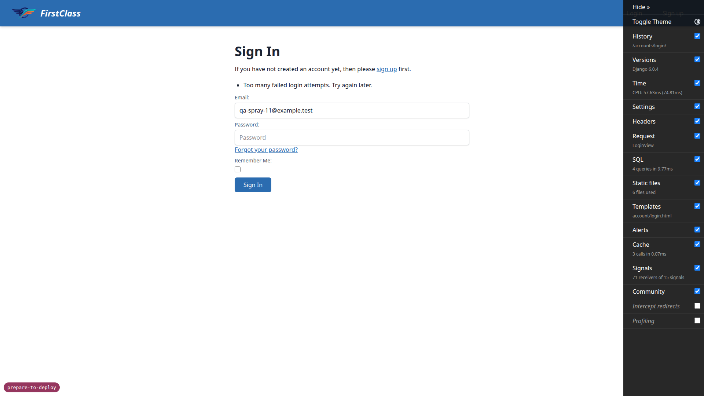
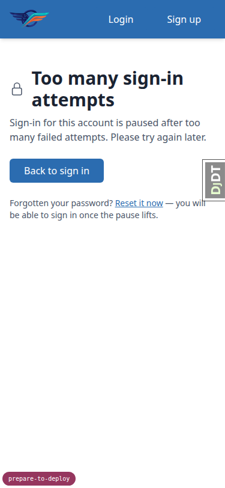
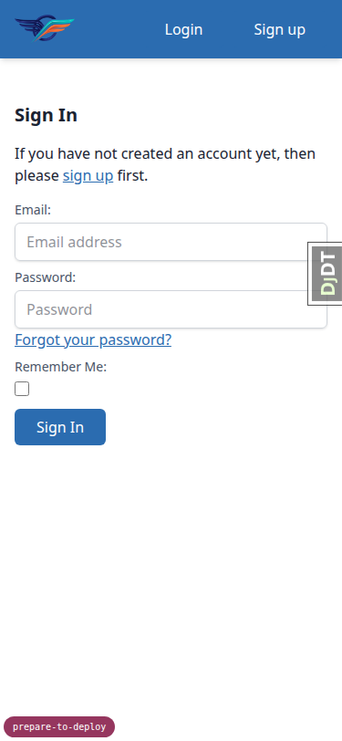
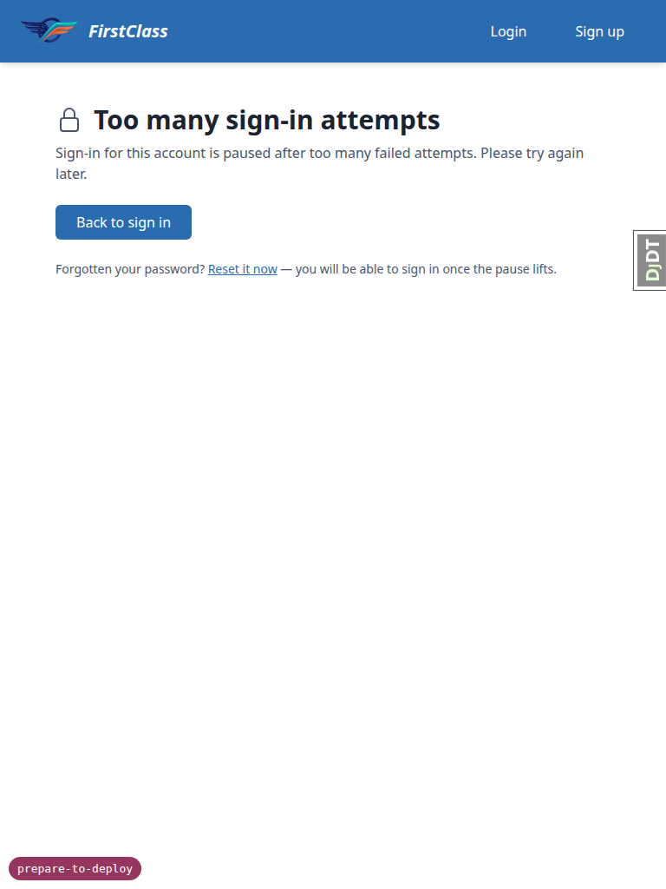
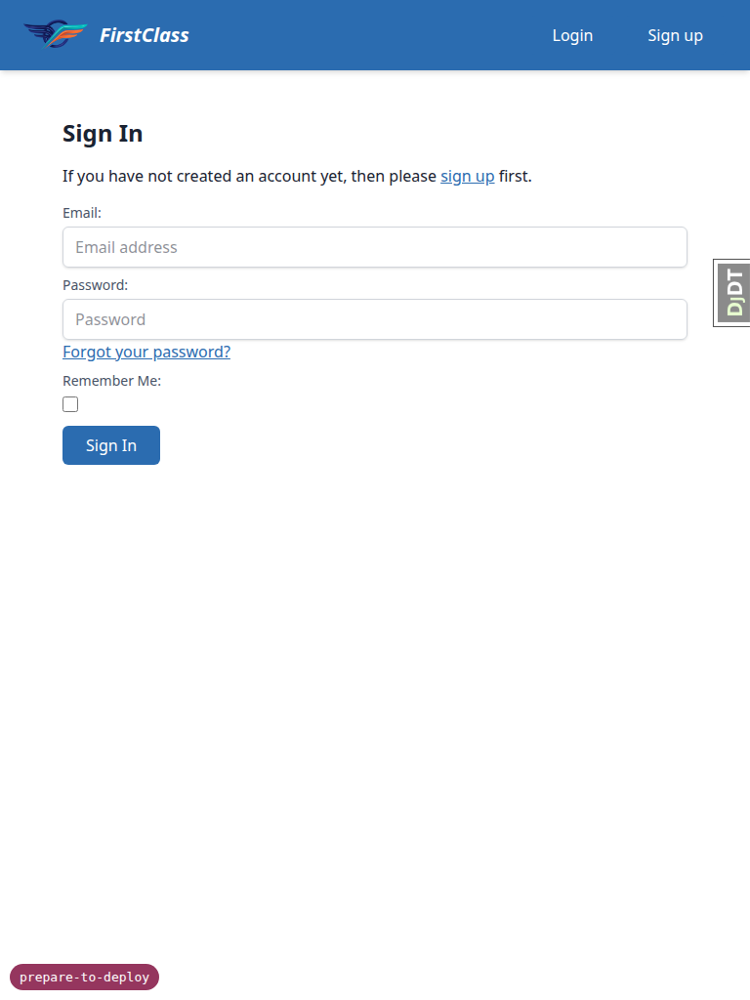

# Frontend QA report — prepare-to-deploy

Test plan executed: `spec_dd/2. in progress/prepare-to-deploy/3. frontend_qa.md`
Source records: `.sdd-work/qa_scratch.jsonl` (30 lines)

---

## Methodology

Screenshots were collected into `spec_dd/2. in progress/prepare-to-deploy/screenshots/` during the
run via Playwright MCP. Every image this report references exists beside the report, in that same
`screenshots/` directory.

The run drove a dev server on port 8293 under `config.settings_dev` for every section except §5b.
§5b needs allauth's failure rate limit switched on, which `config.settings_dev` disables entirely, so
that section ran against a second server on port 8479 under a throwaway `config.settings_qa_check`
module (as the test plan's §0 defines). That module was deleted again during cleanup and was never
committed.

Before testing began, the dev database was found in an inconsistent partially-migrated state
(`ProgrammingError: column freedom_ls_content_engine_course.created_at does not exist`, then a failed
migrate reporting `relation uniq_delivery_event_endpoint already exists`). It was rebuilt from scratch
(`dev_db_delete.sh` + `dev_db_init.sh` + `migrate` + `create_demo_data`) before any test ran. This was
environment repair, not a product finding, and is recorded as such in the scratch file.

## Diff scoping

Scoping class: **FULL**, triggered by `freedom_ls/accounts/templates/accounts/lockout.html` — a path
under `templates/` ending in `.html`. Nothing was skipped: the desktop, mobile, and tablet passes all
ran in full.

## Smoke gate

**Passed.** Two pages loaded before the full run began:

- `http://127.0.0.1:8293/` — Dashboard, 200
- `http://127.0.0.1:8293/accounts/login/` — Sign In, 200

---

## Results by section

### §1 Bootstrap command creates an administrator who can actually sign in

**Status: PASS**

`setup_initial_prod_data qa-admin@example.test --domain 127.0.0.1:8000` printed "Created
administrator qa-admin@example.test with password: <22-char mixed-case+digit string>" and "This
password is shown once and is stored nowhere. Record it now." `/accounts/login/` rendered 200 with
email+password fields. Signing in with that password succeeded: landed on the Dashboard with
"Successfully signed in as qa-admin@example.test." No bounce back to the login page, so the verified
`EmailAddress` row exists under `ACCOUNT_EMAIL_VERIFICATION=mandatory`.

*§1 — signed in as qa-admin@example.test, landed on the Dashboard.*

### §2 Running it twice changes nothing

**Status: PASS**

A second run with identical arguments printed only "Administrator qa-admin@example.test already
exists; password unchanged." — no password in the output. The Site name for domain `127.0.0.1:8000`
read "DemoDev" both before and after, so the existing Site row was not overwritten with the
domain-derived default. Signing in at `/accounts/login/` with the **original** password from §1 still
succeeded.

### §3 Login page and signup flow still work

**Status: PASS**

`/accounts/login/`, `/accounts/signup/`, and `/accounts/password/reset/` all render 200. The signup
form carries both the "I accept the Terms and Conditions" and privacy checkboxes
(`REQUIRE_TERMS_ACCEPTANCE=True`). `demodev_s1@email.com` signed in successfully. A fresh signup as
`qa-signup-1@example.test` completed to "Verify Your Email Address" with "Confirmation email sent to
qa-signup-1@example.test." — no 500, no `TypeError`/`AttributeError` from `get_client_ip`.
`LegalConsent.ip_address` for the new row read `127.0.0.1` (not blank, not `None`), so the helper
falls through to `REMOTE_ADDR` with `TRUSTED_PROXY_IP_HEADER=None`.

*§3 — signup/login flow check.*

### §3b Signing up again with an address that already exists

**Status: PASS**

Re-submitting the signup form with the already-registered `qa-signup-1@example.test` produced a
byte-for-byte identical outcome: redirect to `/accounts/confirm-email/`, heading "Verify Your Email
Address", message "Confirmation email sent to qa-signup-1@example.test." No "address is taken" error,
so `ACCOUNT_PREVENT_ENUMERATION` still holds. The user count for that address stayed at 1, so no
duplicate row was created.

### §4 Pair-keyed lockout (the headline change)

**Status: PASS**

After `axes_reset`, five wrong-password logins for `demodev_s1@email.com`. Attempts 1–4 each returned
HTTP 200 with the ordinary error "The email address and/or password you specified are not correct."
Attempt 5 returned **HTTP 429**, page title "Too many sign-in attempts", heading "Too many sign-in
attempts" with the padlock icon and body "Sign-in for this account is paused after too many failed
attempts. Please try again later." plus "Back to sign in" and a password-reset link. The new
`lockout.html` template renders correctly.

*§4 — the lockout page after the fifth failed attempt for demodev_s1@email.com.*

**§4.3 (headline criterion).** In the same browser from the same address, immediately after
`demodev_s1@email.com` was locked out, signing in as `demodev_s2@email.com` with its correct password
**succeeded** — "Successfully signed in as demodev_s2@email.com." on the Dashboard. The nested
`AXES_LOCKOUT_PARAMETERS` landed: one attacker on one address no longer locks every account behind a
shared egress IP.

*§4.3 — demodev_s2@email.com signs in successfully while demodev_s1@email.com is locked out.*

**§4.4.** Logged out, then retried `demodev_s1@email.com` with its correct password. Still HTTP 429
"Too many sign-in attempts." The lockout is keyed on the (address, username) pair, and this is that
pair, so a correct password does not lift it.

**§4.5.** `axes_reset` reported "1 attempts removed." `demodev_s1@email.com` then signed in
successfully with its correct password — "Successfully signed in as demodev_s1@email.com." Lockout
clears cleanly.

### §5 Spoofed client IP header changes nothing

**Status: PASS**

After `axes_reset`, `demodev_s1@email.com` was locked out again via five same-origin form POSTs
(attempts 1–4 HTTP 200 "Sign In", attempt 5 HTTP 429 "Too many sign-in attempts"). Three further
attempts were sent with spoofed `X-Real-IP: 203.0.113.99` and `X-Forwarded-For: 203.0.113.99` — two
with a wrong password and one with the correct password. All three returned HTTP 429 "Too many
sign-in attempts." The header bought nothing: no fresh allowance, no successful login. Confirmed
directly against the axes record: `AccessAttempt.ip_address` read `127.0.0.1` with 5 failures, **not**
`203.0.113.99`, so `AXES_CLIENT_IP_CALLABLE` → `get_client_ip` ignores the untrusted header while
`TRUSTED_PROXY_IP_HEADER` is `None`.

### §5b Failure rate limit catches what the lockout cannot

**Status: PASS**

Ran against the second dev server on `config.settings_qa_check`, which restores
`ACCOUNT_RATE_LIMITS`. Ten failed logins naming ten different nonexistent addresses
(`qa-spray-1` through `qa-spray-10@example.test`) all returned HTTP 200 with the ordinary "The email
address and/or password you specified are not correct." — no lockout, confirming no address/username
pair reached five and that this is the gap the limit closes. The eleventh
(`qa-spray-11@example.test`) returned **the login form at HTTP 200** carrying "Too many failed login
attempts. Try again later." — **not** the lockout page: no "Too many sign-in attempts" heading and no
429. The two mechanisms are cleanly distinguishable. After restarting the server to clear the
LocMemCache counters, `demodev_s2@email.com` signed in normally ("Successfully signed in as
demodev_s2@email.com."), so a legitimate visitor never spends the allowance.

*§5b — the eleventh spray attempt returns the login form with "Too many failed login attempts. Try again later." rather than the lockout page.*

### §6 Deleted commands are gone

**Status: PASS**

`create_site` → "Unknown command: 'create_site'. Did you mean createsuperuser?" and
`create_site_superuser` → "Unknown command: 'create_site_superuser'." Neither runs. Grepping
`manage.py help` confirms neither appears in the registry, while `setup_initial_prod_data`,
`fls_run_housekeeping`, and `fls_run_worker` all do appear.

### §7 Bad input to the bootstrap command

**Status: PASS**

**7.1** — `setup_initial_prod_data` with no `--domain` under `config.settings_dev` (which declares no
`HOST_DOMAIN`) exited 1 and printed exactly "Error: No --domain given and HOST_DOMAIN is not set in
this settings module." Zero Traceback lines in the output.
`User._base_manager.filter(email='qa-admin-2@example.test').exists()` returned `False`, so nothing
was created before the guard fired.

**7.2** — Running against the brand-new domain `qa-new.example.test` succeeded and printed a 22-char
password. The new Site (id 7) got exactly one Organisation, named `qa-new.example.test` with
`is_default=True`, supplied by the `post_save` receiver rather than by the command itself.

### §8 Worker and housekeeping commands

**Status: PASS** (all six steps)

| Step | What was run | Exit code | Heartbeat file existed? |
| --- | --- | --- | --- |
| 8.1 | `fls_run_housekeeping` under plain `config.settings_dev` | 1 | No — `/tmp/housekeeping-heartbeat` did not exist afterwards |
| 8.2 | `fls_run_housekeeping --settings=config.settings_qa_check` (clean run) | 0 | Yes |
| 8.3 | Same, with a `RUNNING` row orphaned 2h ago planted first | 0 | Yes |
| 8.4 | Same, with a `READY` row due 2h ago planted first | 1 | Yes |
| 8.5 | `fls_run_worker`, then SIGINT after ~5s | 0 | n/a (heartbeat file is `/tmp/heartbeat`, confirmed advancing between two `stat` reads 3s apart) |
| 8.6 | `fls_run_worker`, then SIGTERM after ~4s | 0 | n/a (worker drains; see notes below) |

Detail per step:

- **8.1** — stderr carried "CommandError: Sweep failures: prune_db_task_results failed: Error:
  argument --backend: Backend default is not a database backend" — the "Sweep failures:" label naming
  `prune_db_task_results`, as required. Proved the session sweep still ran despite the failure:
  planted one expired and one live session beforehand; afterwards only `['qa-live-sess']` remained, so
  the expired row was swept and the live one kept.
- **8.2** — stdout: "Deleted 0 task result(s)" then "Housekeeping complete."
- **8.3** — A repaired row is not a failure (exit 0). stdout named it: "Closed 1 task result(s)
  orphaned in RUNNING." The row afterwards: status `FAILED` (not back to `READY`),
  `exception_class_path` `freedom_ls.deployment.housekeeping.OrphanedTaskError`, traceback "Claimed at
  ... by worker(s) qa-worker and still running 3600s later, so the worker holding it died without
  finishing it. fls_run_housekeeping marked this row failed to say so. The task was not run again and
  was not requeued; whether the work still needs doing is an operator's call." Names the worker and
  states explicitly that it was not requeued.
- **8.4 (criterion for this section)** — stderr: "CommandError: Findings: 1 task result(s) unpicked
  past the window." — the label is "Findings:" and not "Sweep failures:", correctly distinguishing a
  worker problem from a housekeeping-container problem. `/tmp/housekeeping-heartbeat` exists anyway. A
  stopped worker is no longer reported as a dead housekeeping container, which is what the change was
  for.
- **8.5** — `fls_run_worker` started and was still running five seconds later rather than exiting
  immediately. Two `stat` readings of `/tmp/heartbeat` about three seconds apart advanced:
  `2026-08-30 11:18:13.547820701 +0200` then `2026-08-30 11:18:16.634761827 +0200`, so the heartbeat is
  touched once per poll while the worker idles. SIGINT produced "Received Interrupt - shutting down
  gracefully... (press Ctrl+C again to force)" and exit=0 in 482ms — prompt and clean, no hang on the
  watchdog thread.
- **8.6** — SIGTERM sent after four seconds — what a deploy actually sends. Output "Received Terminated
  - shutting down gracefully... (press Ctrl+C again to force)", exit=0, shutdown took 318ms. The worker
  drains rather than dying.

---

## Responsive passes

Both the mobile (375×812) and tablet (768×1024) passes ran as part of the FULL scope, covering the
lockout page and the login page.

**Mobile (375×812):**

- Lockout page (`4-lockout-page`) — heading "Too many sign-in attempts" wraps to two lines beside the
  padlock icon without collision, body copy stays readable, "Back to sign in" renders as a full
  157×40 button and the "Reset it now" password-reset link is reachable.
  `document.scrollWidth` measured 375 against `innerWidth` 375 — no horizontal overflow.

  
  *Lockout page at 375x812.*

- Login page (`3-login-page`) — email and password inputs go full width, labels sit above their
  fields, "Sign In" is a comfortably sized button and the nav collapses to plain Login / Sign up
  links. No overflow, no overlap.

  
  *Login page at 375x812.*

**Tablet (768×1024):**

- Lockout page (`4-lockout-page`) — gets the desktop nav with the FirstClass wordmark. Heading fits on
  one line beside the padlock, body copy wraps to two comfortable lines, the button and reset link
  keep sensible proportions. No crowding, no overflow.

  
  *Lockout page at 768x1024.*

- Login page (`3-login-page`) — gets the desktop nav. Inputs render at a reasonable width rather than
  stretching the full viewport, and the form stays a single readable column. No layout problems.

  
  *Login page at 768x1024.*

---

## Bug status

No bugs were found. Every test in this run (22 tests across §1–§8, desktop, mobile, and tablet
passes) returned PASS, and the scratch records contain zero `bug`-type entries. The bug table is
empty.

| ID | Severity | Description | Status |
| --- | --- | --- | --- |
| — | — | (none) | — |

---

## General notes

These are observations recorded during the run, not defects introduced by this branch:

- **Remember Me touch target.** The stock allauth "Remember Me" checkbox is a ~16px native control,
  below the usual 44px touch-target guidance on mobile. It is unchanged by this branch and appears on
  the pre-existing login form.
- **Report-only CSP notices.** The browser console logs report-only CSP notices on every page for
  scripts loaded from `cdn.jsdelivr.net` (htmx, alpine collapse, alpine csp, chart.js) — "violates the
  following Content Security Policy directive: script-src self unsafe-inline ... The policy is
  report-only, so the violation has been logged but no further action has been taken." Pre-existing
  development configuration, unrelated to this branch, but it will matter when the policy stops being
  report-only in production.
- **Legal-docs stderr noise.** `axes_reset` and `fls_run_housekeeping` both emit repeated stderr lines
  of the form "Rejected site domain '127.0.0.1:8003' as a legal-docs directory name; falling back to
  _default only" for every demo site with a port in its domain. Harmless in development and unrelated
  to this branch's changes, but it is noise an operator would see in command output.
- **Incidental `ModuleNotFoundError` during §8.5.** The worker picked up the `READY` `qa.late.task`
  row planted in §8.4 and logged `ModuleNotFoundError: No module named 'qa'`. That is the synthetic
  test task path used for QA, not a product defect — and it usefully confirms the worker really does
  claim unpicked `READY` rows. The row was deleted in the §9 cleanup.

---

status: ok
reason: report rendered, 22 tests, 0 bugs documented
