# Frontend QA report: prod_bucket_setup

This branch moves three model fields off Django's `default` storage alias onto named aliases
(`course_media`, `public`, `reports`) and adds the deploy-only checks that enforce it. No template,
view, URL or CSS changed, so this run was hunting regressions, not new behaviour. 26 tests ran across
desktop, mobile and tablet viewports. All 26 passed. No bugs were found. Nothing in the plan was
skipped.

## Methodology

Playwright MCP drove a real browser against a dev server on port 8824, logged in as
`demodev@email.com` for Parts A to D and F, and as `qa-educator@email.com` for the permission checks
in Part E. Screenshots were collected into `screenshots/` beside this report; every image referenced
below exists in that directory. Test data was prepared ahead of the run by the
`fls-dev:qa-data-helper` agent rather than by hand. A screenshot compression pass ran afterward and
found nothing over its size threshold.

## Diff scoping

The scoping record classifies this diff as `FULL`. The changed-file list mixes `.py`, `.md` and
`.png` files, which does not match the `ADMIN_ONLY` or `BACKEND_ONLY` patterns, so it falls through
to the safe default: every part of the plan runs, at every viewport. Nothing was skipped: the
desktop, mobile and tablet passes all ran in full.

Changed files by area:

| Area | Files |
|---|---|
| Settings | `config/settings_base.py`, `config/settings_prod.py`, `freedom_ls/base/env.py` |
| `content_engine.File.file` | `freedom_ls/content_engine/models.py`, `freedom_ls/content_engine/config.py`, `freedom_ls/content_engine/migrations/0015_alter_file_file.py` |
| `organisations.Organisation.logo` | `freedom_ls/organisations/models.py`, `freedom_ls/organisations/checks.py`, `freedom_ls/organisations/config.py`, `freedom_ls/organisations/migrations/0003_alter_organisation_logo.py` |
| `reports.GeneratedReport.file` | `freedom_ls/reports/models.py`, `freedom_ls/reports/checks.py` |
| Deployment checks | `freedom_ls/deployment/checks.py`, `freedom_ls/deployment/storage.py` |
| QA tooling | `freedom_ls/qa_helpers/management/commands/qa_register_org_course.py` |
| Docs | `docs/product/deployment.md`, `docs/deployment-security-checklist.md` |
| Other | tests, spec_dd docs, prior-run screenshots |

## Smoke gate

Passed. The two pages loaded as the logged-in user were the homepage
(`http://127.0.0.1:8824/`) and the generated-reports admin changelist
(`http://127.0.0.1:8824/admin/freedom_ls_reports/generatedreport/`). The tester's first guess at the
second URL used the app label `reports` instead of the actual `freedom_ls_reports` and 404'd; that
was corrected to the URL above before the gate ran. Tester error, not a defect, and it should not
read as a finding.

## Results by part

### Part A: the application still starts

**A1.** `manage.py check` exits 0 with no issues, no `freedom_ls_reports.W001`, no
`freedom_ls_deployment.E001`. `runserver` on 8824 booted with no `InvalidStorageError` and no
traceback. The home page and `/accounts/login/` render, and login as `demodev@email.com` lands on
the dashboard. The only console noise was a pre-existing, unrelated message about a rejected legal
docs site domain.

**A1-deploychecks.** The deploy-only storage checks were exercised in all three configurations of
`check --deploy --settings=config.settings_prod`, with bucket variables passed inline. With no bucket
variables set: five `freedom_ls_deployment.E002` errors, one per media alias (certificates,
course_media, public, reports, user_uploads), each naming the exact `AWS_S3_<PURPOSE>_BUCKET_NAME`
to set; `E001` stayed silent because there is no shared bucket to collide with. With only the shared
`AWS_STORAGE_BUCKET_NAME` set: five `E001` errors instead, one per alias, reporting the collision
with `default`; `E002` stayed silent. With every per-bucket name set: both checks went silent, and
only the two pre-existing HSTS warnings (`security.W005`, `security.W021`) remained. Neither check
fires on plain `check`, `runserver` or `migrate`.

### Part B: course media (`course_media` alias)

**B1.** The media topic of the content-widgets demo course. Every `c-picture` renders a real image:
a numbered Figure 1, an annotated Figure 2, a two-column image grid, a three-column grid, and two
stacked figures. All `/media/content_engine/*.svg` requests returned 200, zero 404s under `/media/`,
and `img.naturalWidth > 0` for every image.

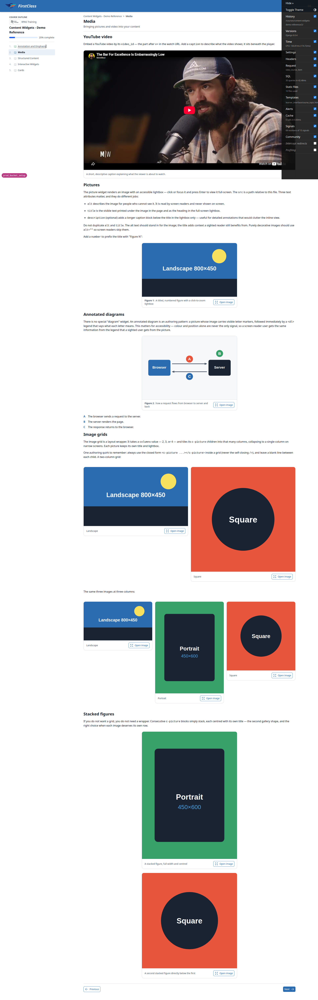

**B1-lightbox.** Clicking Figure 1 opens a full-screen lightbox with the image at size, the title
"Figure 1" top-left, and the description beneath the title at the foot of the overlay.

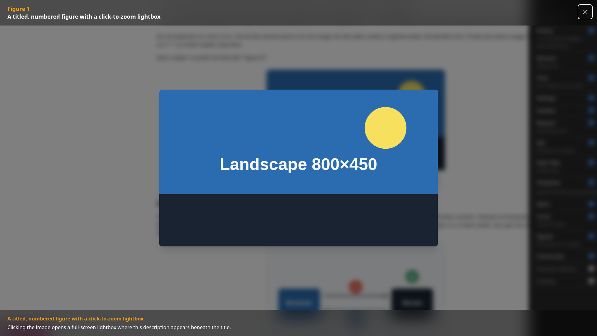

**B2.** First topic of the end-with-topic demo course. The `c-pdf-embed` iframe's `src` is
`/media/content_engine/samplea543a6c9-...pdf`; fetching it returns 200, `Content-Type:
application/pdf`, `Content-Length: 49915`. The "Download the sample PDF" link points at the same URL
and also returns 200. The embed itself paints as a blank dark frame in the screenshot because
headless Chromium ships no PDF viewer plugin, not because of a storage fault; the byte-level fetch is
what proves the `course_media` alias resolves the non-image branch. Not a defect.

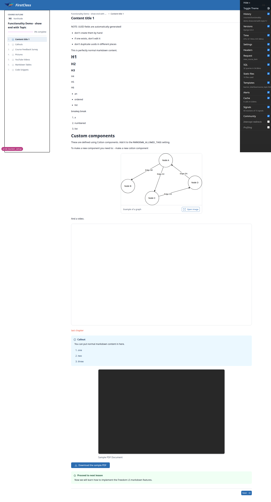

**B3.** Admin > Content engine > Files > Add. Uploaded a 240x160 PNG (1478 bytes) with File
type=Image, Original filename and File path filled. Saved to pk
`d4aeda82-ee4c-40ca-9506-e51d97ae6e97`. The change form's file link (django-unfold renders it as
"download" rather than Django's "Currently:") points at
`/media/content_engine/qa_upload_b3d4aeda82-....png`; fetching it returns 200, `Content-Type:
image/png`, `Content-Length: 1478`, byte-identical to the source. On disk the file sits under
`media/content_engine/`, so the `content_engine/` key prefix is unchanged. Incidental friction, not a
storage defect: the Add form requires File path and Mime type, and the django-debug-toolbar overlay
intercepts clicks on the Save buttons at 1920x1080.

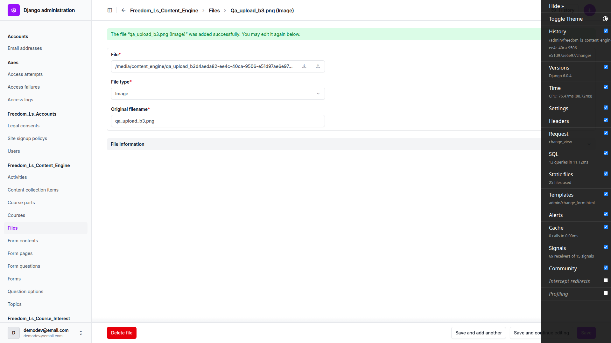

### Part C: organisation logo (`public` alias)

**C1-nologo.** The end-with-topic course belongs to Northside, which has no logo. The course
table-of-contents header renders the "NO" monogram fallback in a rounded badge beside the
organisation name, not a broken image and not an empty gap.

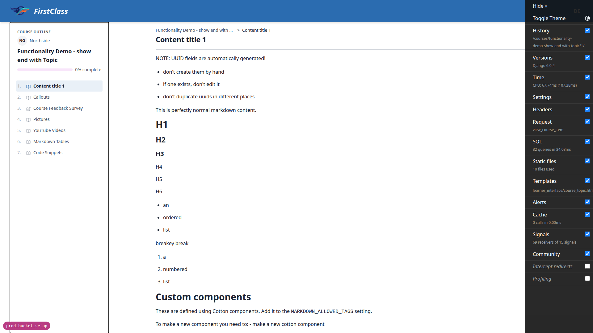

**C1-logo.** The content-widgets course belongs to RPAS Training, which has a logo. The header
renders the RPAS Training logo, scaled to fit on an opaque surface fill.
`GET /media/organisations/3f4d66e2-....webp` returned 200 and the image reports naturalWidth 1324 x
609. Both branches of the `public` alias behave correctly.

**C2.** Northside (no logo) admin. Uploaded a red 320x120 PNG: saved with no errors at the stable key
`organisations/455cdbc4-18fa-4498-b5f8-c0a700423399.png`, the admin file link resolves 200
`image/png` 1147 bytes, and the learner-facing course header replaced the "NO" monogram with the
image. Then uploaded a different green PNG at the same extension: the stored key and URL are
byte-for-byte identical, the same URL now serves 1110 bytes (the new file), and a fresh navigation of
the course header shows the green logo in place of the red one. On disk `media/organisations/` holds
exactly two files, one per organisation with a logo (RPAS `.webp`, Northside `.png`), with no
accumulation of uniquely-named copies. The plan's step-6 cache caveat did not bite here because
Playwright navigated fresh each time.

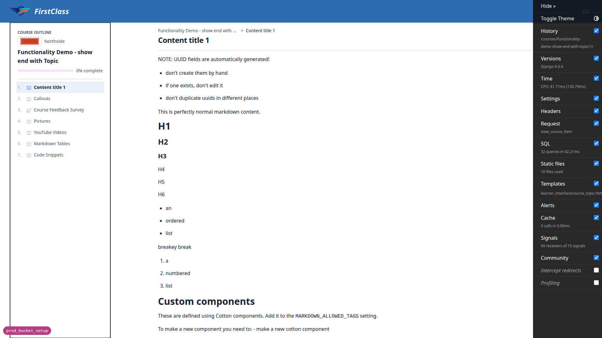

**C3.** Northside organisation admin. Uploading a real `.gif` redisplays the form with two clean
field errors: "File extension gif is not allowed. Allowed extensions are: png, jpg, jpeg, webp." and
"Image format GIF is not supported. Use PNG, JPEG or WebP." No 500. Uploading a plain-text file
renamed to `.png` redisplays with "File is not a readable image. Use PNG, JPEG or WebP.", naming the
actual problem. `media/organisations/` still held only the one pre-existing RPAS Training `.webp`;
neither rejected upload reached storage, so validation still runs before the save.

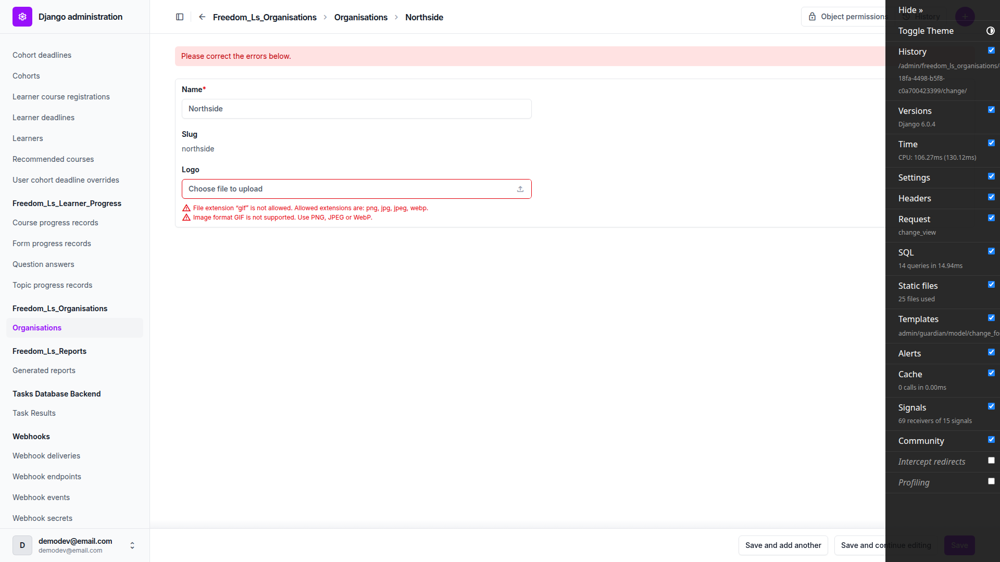

### Part D: cohort reports (`reports` alias and the prefix rename)

**D1.** Admin > Generated reports > "Generate cohort report" action, cohort "DemoDev - QA Storage
Cohort". Submitting redirects to the changelist, now listing 4 reports instead of 3. The new row
`4fb6cff7-ed42-471e-946d-f95b0150a2fd` is status `ready`, and its `file.name` is
`cohort_reports/4fb6cff7-...-cohort-report.pdf`, present on disk at 493446 bytes.
`media/reports/` remains an empty directory; nothing new was written under the old prefix. The plan's
expected `pending` to `running` to `ready` progression does not show up in dev, because
`settings_base` pins `TASKS` to `ImmediateBackend`, so the task renders inline during the request and
the row is already `ready` on the redirect. Not a defect; the plan's instruction to run `db_worker`
is stale for dev (see general notes).

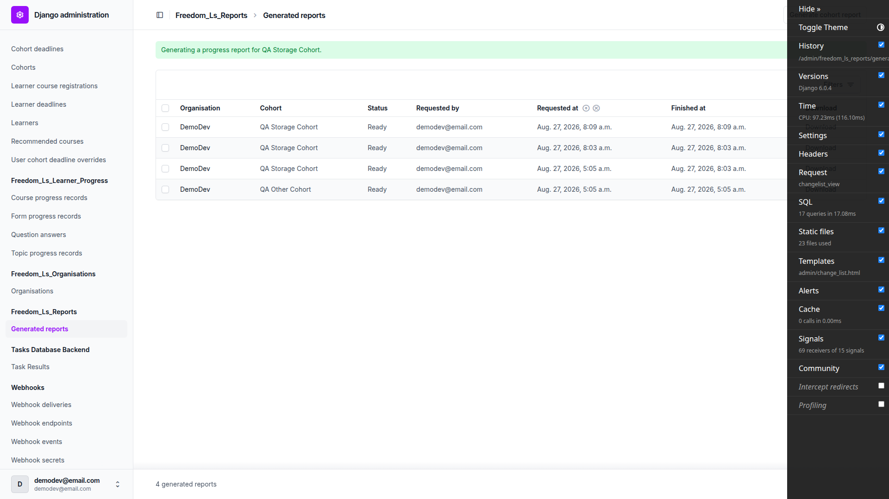

**D2.** `GET /admin/freedom_ls_reports/generatedreport/4fb6cff7-.../download/` returns 200,
`Content-Type: application/pdf`, `Content-Length: 493446` (byte-for-byte the file on disk), and a
body starting `%PDF-1.7`. `Content-Disposition` is `attachment; filename="qa-storage-cohort-progress-
report.pdf"`, matching the plan. `Cache-Control` is `private, no-store, must-revalidate, max-age=0,
no-cache`, a superset of the three directives required. The served URL is the permission-checked
`/admin/.../download/` path, never a `/media/` URL. Extracting the PDF confirms a real 15-page
report: cohort "QA Storage Cohort", all 9 learner names, and a "3 - Quiz confusions across the
cohort" section.

**D3.** A pre-rename row was staged exactly as the plan prescribes: report `4affff3a`'s PDF was
moved from `media/cohort_reports/` to `media/reports/` and its stored `file.name` updated to the
legacy `reports/...` key. Downloading it through the admin still returns 200,
`Content-Type: application/pdf`, `Content-Length: 493448`, a `%PDF-1.7` body, under the same
attachment filename. The prefix change lives only in `report_upload_path` and affects new writes
only; nothing rewrites stored `file.name` values, and an old-prefix key still resolves through the
`reports` alias.

**D4.** Report `ef4233fa`'s PDF was deleted from `media/cohort_reports/` by hand, leaving the
database row at status `ready`. Requesting its admin download URL returns a clean 404 Not Found. The
runserver console logs a single "Not Found" line and the 404 response, no traceback, no unhandled
`FileNotFoundError`, no 500. The alias swap did not change which exception the storage backend
raises for a missing key.

**D5.** Before: `media/cohort_reports/` held `4fb6cff7` and `eb5beced`. Report `4fb6cff7` was
deleted through the admin delete-confirmation page. Afterward its PDF is gone from disk and its row
is gone from the database, `eb5beced`'s PDF is still present and untouched in the same directory, and
`media/cohort_reports/` itself still exists. The legacy `media/reports/` directory and the file
staged there for D3 were also untouched. A per-object delete does not take the shared directory or
its siblings with it.

### Part E: permission branches on the report download

**E1.** Logged in as `qa-educator@email.com`: `is_staff=True`, `is_superuser=False`, holding a
guardian object-level `view_cohort` on QA Storage Cohort only, no organisation-level grant, no global
model permission. Its own cohort's report (`4affff3a`) downloads: 200, `%PDF-1.7`, 493448 bytes,
attachment filename `qa-storage-cohort-progress-report.pdf`. Requesting the QA Other Cohort report
(`eb5beced`) by guessing its URL returns 403 Forbidden; the admin login redirect landed straight on
that URL, so the 403 rendered as a full page immediately after authenticating. Staff status alone is
not enough and URL guessing is not enough; the check is per-cohort.

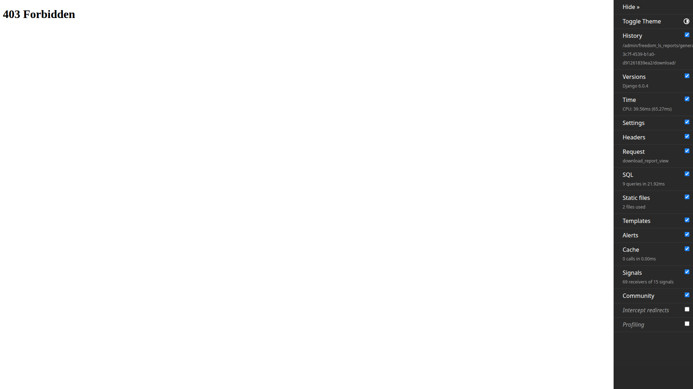

**E2.** Fully logged out, then requested a report download URL. Redirected to
`/admin/login/?next=/admin/freedom_ls_reports/generatedreport/<pk>/download/` and served the admin
login form. No PDF bytes reach an anonymous visitor.

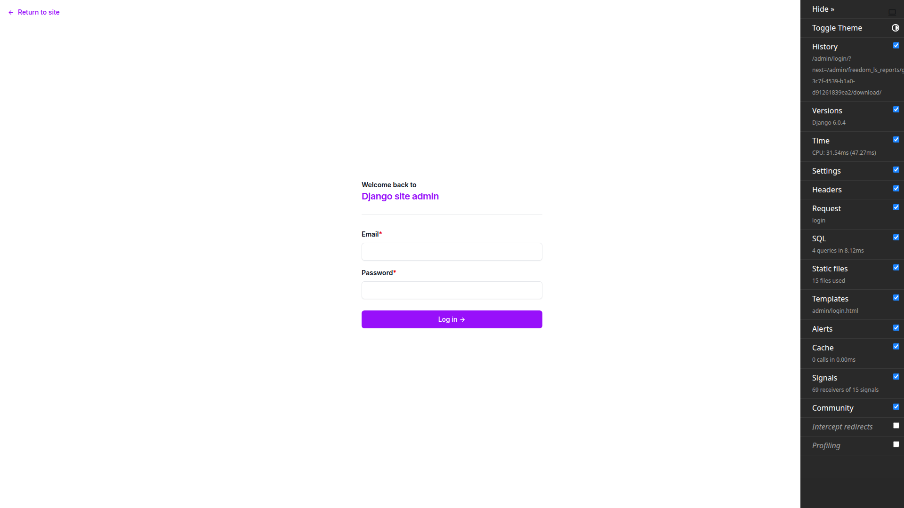

**E3.** Fetched the reports changelist HTML as the superuser and regex-scanned the raw source for
`/media/`. Zero occurrences. The reports admin exposes no raw file field, so no report file leaks a
media URL.

### Part F: nothing wrote where it should not have

**F1.** Snapshotted `find media -type f | sort` (12 files), ran the full suite (2674 passed, 23
deselected, 24 warnings in 310s, exit 0, coverage 88.34% against a 73% floor), then re-ran the same
`find` and diffed. No difference. The autouse fixture that redirects `MEDIA_ROOT` to a temp directory
still covers every alias; no storage alias declared its own `location` and opted out of test
isolation. `find` was used rather than `git status`, as the plan requires, because `media/` is
gitignored.

**F2.** `logs/` holds `django.log`, `django_errors.log` and `security.log` beside the pre-existing
`.gitkeep`, gitignored and harmless, exactly as the plan predicts. No `staticfiles/` directory
appeared, so nothing ran `collectstatic`. No throwaway env file is sitting in the tree: the only
root-level env file is the tracked, pre-existing `.env.example`, and
`git status --untracked-files=all` shows no untracked env file. The working tree's only changes are
the qa-data-helper's own agent-memory notes and a pre-existing uncommitted tick in `todo.md` that
predates this run.

## Responsive results

### Mobile (375x812)

**B1.** Media topic. The header collapses to logo, hamburger and avatar; the desktop course-outline
sidebar becomes a breadcrumb strip with an "Open course outline" control. The two- and three-column
image grids collapse to a single column, every image still loads and fits the width, and the "Open
image" lightbox buttons stay full-size and tappable. `documentElement.scrollWidth` equals
`clientWidth` equals 375, so no horizontal page overflow.

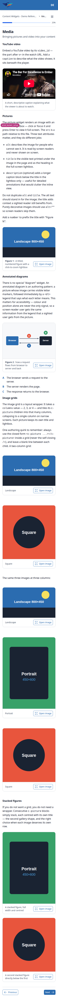

**C1-logo.** Tapping "Open course outline" slides up a bottom-sheet drawer carrying the organisation
header. The RPAS Training logo renders inside it at a legible size on an opaque white surface fill,
and the topic rows are touch targets of roughly 44px. The drawer scrim dims the page behind it
correctly.

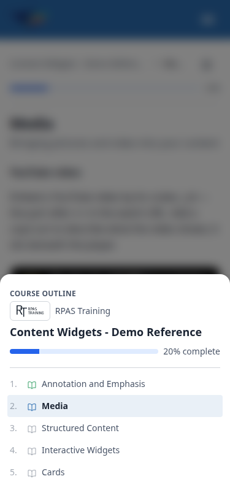

**D-changelist.** Reports changelist at 375px. django-unfold restacks the table into one label/value
card per report rather than forcing a sideways scroll; the table sits inside an overflow-x-auto
wrapper that does not need to scroll at this width. All three ready reports show Organisation,
Cohort, Status, Requested By/At, Finished At and a Download link. No horizontal page overflow.

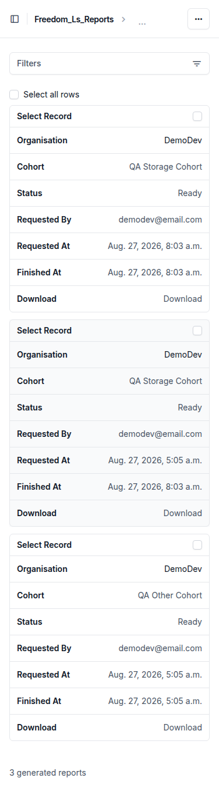

### Tablet (768x1024)

**B1.** The tablet takes a hybrid: the desktop top nav (full FirstClass wordmark plus the DE avatar
menu, no hamburger) paired with the mobile course-outline treatment (breadcrumb strip plus a
table-of-contents drawer toggle). The content column is comfortably wide, every `/media/` image
loads (`naturalWidth > 0` for all), and `scrollWidth` equals `clientWidth` equals 768, so nothing
overflows sideways.

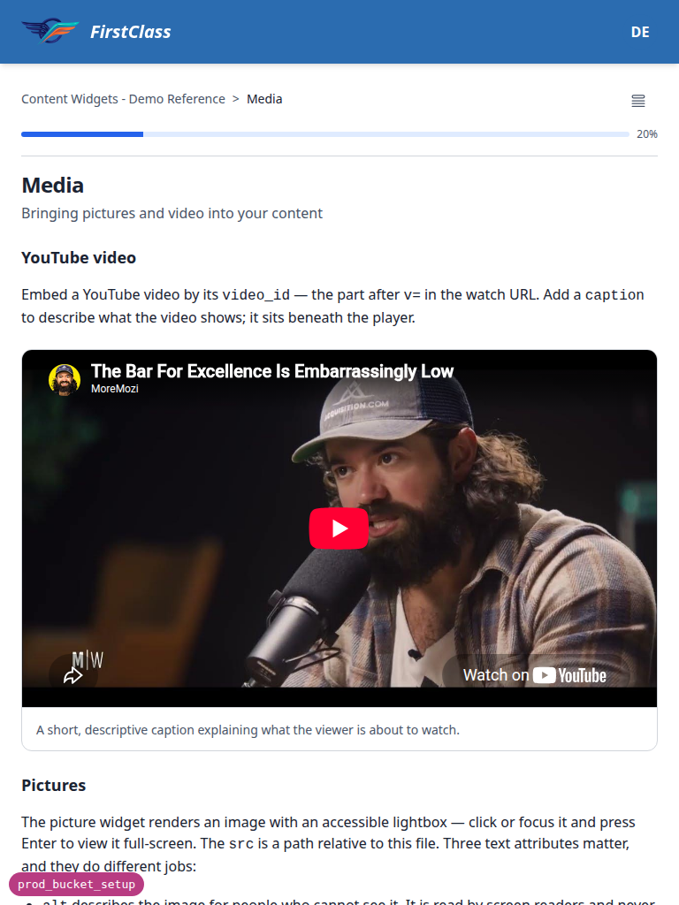

**C1-logo.** The course-outline drawer opens from the bottom at full tablet width and carries the
RPAS Training logo on its opaque surface fill, with the topic list below. Usable, not crowded.

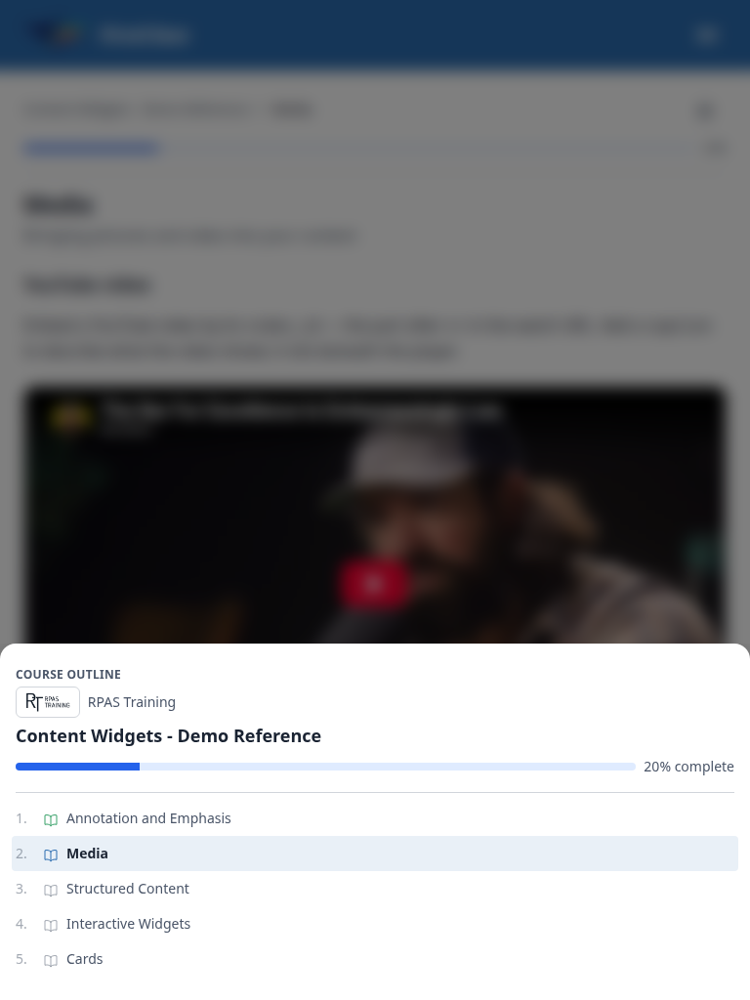

**C2.** Northside organisation admin at 768px. The form is single-column at a readable width and the
Save / Save and continue / Save and add another buttons stack full-width instead of crowding. The
Logo widget shows the green replacement thumbnail and its path reads
`/media/organisations/455cdbc4-18fa-4498-b5f8-c0a700423399.png`, independent confirmation that the
same-extension replacement overwrote at the stable key rather than creating a new one. No horizontal
overflow.

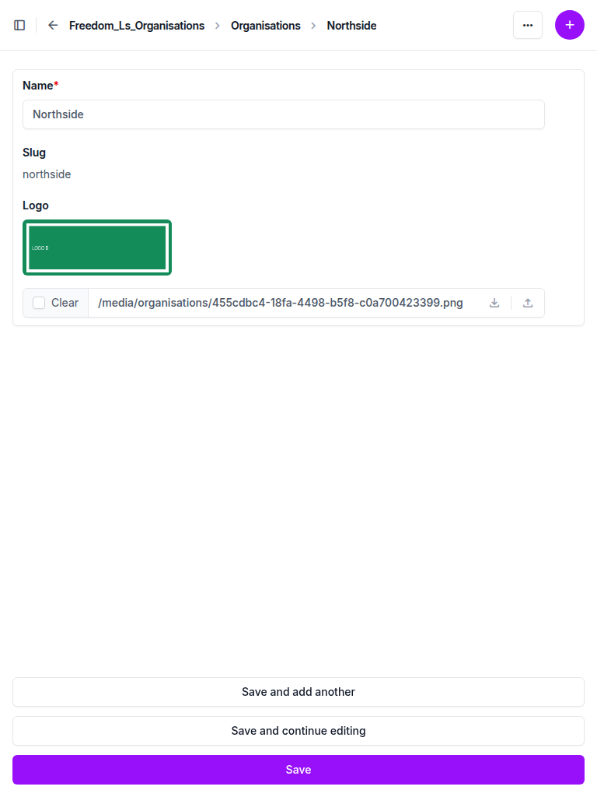

## Results matrix

| Test | Desktop | Mobile | Tablet |
|---|---|---|---|
| A1 | pass | – | – |
| A1-deploychecks | pass | – | – |
| B1 | pass | pass | pass |
| B1-lightbox | pass | – | – |
| B2 | pass | – | – |
| B3 | pass | – | – |
| C1-nologo | pass | – | – |
| C1-logo | pass | pass | pass |
| C2 | pass | – | pass |
| C3 | pass | – | – |
| D1 | pass | – | – |
| D2 | pass | – | – |
| D3 | pass | – | – |
| D4 | pass | – | – |
| D5 | pass | – | – |
| D-changelist | – | pass | – |
| E1 | pass | – | – |
| E2 | pass | – | – |
| E3 | pass | – | – |
| F1 | pass | – | – |
| F2 | pass | – | – |

## Alias to surface mapping

| Alias | Model field | Where a user sees it |
|---|---|---|
| `course_media` | `content_engine.File.file` | Images, embedded PDFs and download links inside course content |
| `public` | `organisations.Organisation.logo` | The organisation logo in the course table-of-contents header, and the admin form |
| `reports` | `reports.GeneratedReport.file` | The cohort report PDF download in the admin |

## Bug status

No bugs were found this run. This section is intentionally empty.

## General notes

### Test plan inaccuracies to fix

Three places in `3. frontend_qa.md` are out of date and should be corrected before the plan is used
again.

1. The Setup section tells the tester to run `uv run python manage.py db_worker` in its own terminal,
   and Test D1 expects a `pending` to `running` to `ready` progression. In dev this is stale:
   `config/settings_base.py` pins `TASKS` to `django.tasks.backends.immediate.ImmediateBackend` and
   `settings_dev.py` does not override it, so report rendering happens inline during the request and
   the row is already `ready` on the redirect. `manage.py db_worker` also fails outright with
   "argument --backend: Backend 'default' is not a database backend" unless a database-backed queue
   is named. The plan should say no worker is needed in dev.
2. The report data setup command passes `--num-flagged 2`, which cannot produce 2 flags on either
   demo course: `qa_create_report_cohort` cycles the flavours `no_activity`, `failing`, `stale`, and
   `failing` needs a pass-marked quiz, which neither demo course has. `--num-flagged 3` yields the 2
   real flags the plan wants. Line 59 should be amended.
3. Part A step 3 checks only for `freedom_ls_deployment.E001`. Since the plan was written, commit
   `c808ad2d` split the local-disk rule out of `E001` into a separate `E002`, so the plan should name
   both.

### Dev-only rendering artefacts, not defects

The `c-pdf-embed` block in Test B2 paints as a blank dark frame in screenshots. This is headless
Chromium having no PDF viewer plugin, not a storage failure: the iframe's `src` fetches 200,
`Content-Type: application/pdf`, `Content-Length: 49915`, byte-identical to the file on disk, which
is what actually proves the `course_media` alias resolves the non-image branch. The
django-debug-toolbar panel also overlays the admin Save buttons at 1920x1080 and intercepts clicks on
them, so admin form submissions in Part B3 and Part C had to hide `#djDebug` before submitting. Both
are pre-existing dev-environment behaviour, unrelated to this branch.

### Deliberate QA residue left in the dev database and media tree

Parts D3, D4 and D5 mutate state by design, and that state was left as-is: report `ef4233fa` is
still `ready` with its PDF deleted from disk (staged for the D4 404 check); report `4affff3a` still
carries the legacy `reports/` key with its PDF under `media/reports/` (staged for D3); report
`4fb6cff7` was deleted through the admin for D5. Parts B3 and C2 also added real files:
`media/content_engine/qa_upload_b3d4aeda82-....png` and
`media/organisations/455cdbc4-....png`, and Northside now has a logo where it previously had none.
None of this affects the branch; re-running the plan from a clean dev database would reproduce it.

### Coverage

Every test in the plan was executed. Nothing was skipped and nothing was blocked by missing data.
The `fls-dev:qa-data-helper` agent set up the dataset before the run: it repaired the QA Storage
Cohort flag count, re-rendered a report whose file was missing, and added a third report so D4 and D5
had spares. Two small substitutions were made along the way. Test C1 used `demodev@email.com`, which
the helper confirmed holds org-scoped learner registrations on both an RPAS Training course and a
Northside course, rather than creating a separate learner. Test C2 step 6's browser-cache caveat did
not arise because Playwright navigated fresh each time; the overwrite was instead proven by the
identical URL serving a different Content-Length and a visibly different image. Beyond the plan, the
deploy-only storage checks were exercised in all three configurations: no buckets giving `E002`,
shared bucket giving `E001`, per-bucket names giving a clean check.

---

status: ok
reason: report rendered, 26 tests documented, 0 bugs
