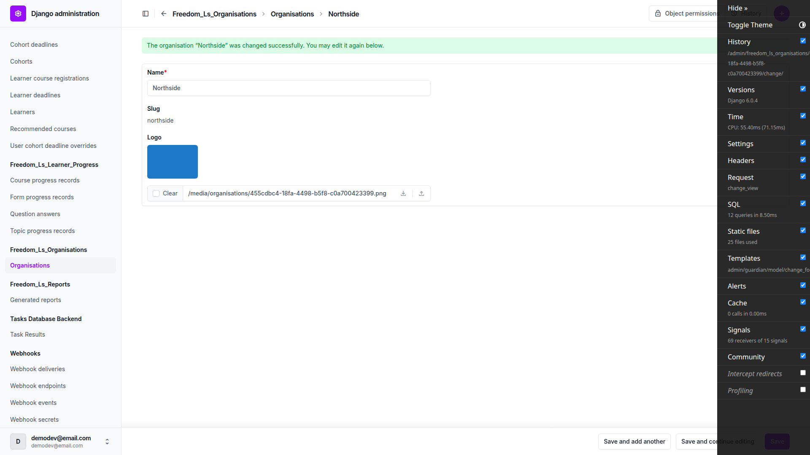

# Frontend QA report: production object storage bucket layout

This run exercised the storage-alias rewiring described in `3. frontend_qa.md`: `content_engine.File.file`
onto `course_media`, `Organisation.logo` onto `public`, and `reports.GeneratedReport.file` onto `reports`
(with its key prefix moved from `reports/` to `cohort_reports/`). The application boots clean, and every
place a user actually sees a stored file — course media, the organisation logo, and cohort report PDFs —
still resolves correctly across desktop, tablet and mobile, including the permission and error-handling
branches around report downloads. Two bugs were found: organisation logo replacement does not overwrite
the stable key in place and instead accumulates orphaned files, and the `env_example` guidance overstates
what `freedom_ls_deployment.E001` actually catches, meaning a per-alias bucket-name typo can silently drop
learner report data onto local disk in production. Nothing in the plan was left untested.

## Methodology

The browser pass was driven through Playwright MCP at three viewports — 1920x1080 desktop, 375x812
mobile and 768x1024 tablet — against a dev server on port 8329, on branch `prod_bucket_setup`. Tests
requiring admin or full-permission access were run logged in as the `demodev@email.com` superuser; the
Part E permission tests were additionally run logged in as `qa-educator@email.com`, a staff user scoped
to a single cohort. Screenshots were collected into `screenshots/` beside this report; every image
referenced below exists there. The run did not abort at any point, so every step in the plan executed.

## Diff scoping

The scoping classifier fired **FULL** (desktop, mobile and tablet passes), landing on the safe default
because the diff mixes `.py` and `.md` files with no template, static asset, HTML, CSS or JS touched.
The files that triggered it: `config/settings_base.py`, `config/settings_prod.py`, `freedom_ls/base/env.py`,
`freedom_ls/content_engine/config.py`, `freedom_ls/content_engine/models.py`,
`freedom_ls/content_engine/migrations/0015_alter_file_file.py`, `freedom_ls/deployment/checks.py`,
`freedom_ls/deployment/storage.py`, `freedom_ls/organisations/apps.py`, `freedom_ls/organisations/checks.py`,
`freedom_ls/organisations/config.py`, `freedom_ls/organisations/models.py`,
`freedom_ls/organisations/migrations/0003_alter_organisation_logo.py`, `freedom_ls/reports/checks.py`,
`freedom_ls/reports/models.py`, `docs/product/deployment.md`, `docs/product/security-and-data-handling.md`,
`docs/deployment-security-checklist.md`, `claude_plugins/fls-dev/skills/file-storage/SKILL.md`, plus test
files and spec_dd markdown. Nothing was skipped: the FULL classification means all three viewport passes
ran in full against every part of the plan.

## Smoke gate

**Pass.** Two pages were loaded before the full run started: `http://127.0.0.1:8329/` (Dashboard, 200,
logged in as `demodev@email.com`) and `http://127.0.0.1:8329/admin/freedom_ls_reports/generatedreport/`
(Generated reports changelist, 200).

## Results by test

| Test | Viewport | Status | Notes |
|---|---|---|---|
| A1 | desktop | pass | `manage.py check` exits 0, no `freedom_ls_reports.W001`, no `freedom_ls_deployment.E001`. `runserver` on 8329 boots clean, no `InvalidStorageError`. Home page 200, login lands on Dashboard, branch badge reads `prod_bucket_setup`. |
| A1 (deploy-check supplement) | desktop | pass | `check --deploy --settings=config.settings_prod` with the five per-bucket env vars is clean apart from unrelated `security.W005`/`security.W021` (HSTS settings). Confirmed E001 is not dead code: it fires correctly when the shared bucket collides with `default`, or when both are absent — see bug B2 below for where it does *not* fire. |
| B3 | desktop | pass | Admin file upload to Content engine > Files succeeds; the `Currently:` link resolves 200, image/png, byte-exact; on-disk path keeps the existing `content_engine/` prefix. Test-harness note, not a defect: the file input is overlaid by the unfold widget and the debug toolbar intercepts Save, requiring a CSS-selector click target. |
| C3 | desktop | pass | Uploading a `.gif` and a renamed text-as-`.png` to an organisation logo both redisplay the form with clean field errors, no 500; neither rejected file reaches `media/organisations/`. |
| C2 | desktop | **fail** | See bug B1. Steps 1–4 (first upload) pass; steps 5–7 (replace) fail — accumulates a second file instead of overwriting the stable key. |
| C1 | desktop | pass | RPAS Training (has a logo) renders the logo image in the course header; Northside (no logo) renders the "NO" monogram with zero `/media/organisations/` requests. Both branches distinguishable. |
| C2-step4 | desktop | pass | After the first logo upload to Northside, reloading the learner course header replaces the monogram with the image; clearing the logo restores the monogram. |
| B1 | desktop | pass | All 19 `c-picture` images in the media topic render, zero broken images, no 404s under `/media/`. Deviation from plan wording, not a defect: the lightbox opens via the figure's "Open image" button, not by clicking the image itself — a pre-existing interaction detail, no template was touched on this branch. |
| B2 | desktop | pass | `c-pdf-embed` renders a real iframe at 894x598 serving the sample PDF (200, application/pdf, %PDF-1.4 magic); the file-download link resolves the same key. |
| D1 | desktop | pass | Generating a report for QA Storage Cohort lands `ready` with the PDF at `media/cohort_reports/<uuid>-cohort-report.pdf`; `media/reports/` does not exist. Deviation from plan step 3, not a defect: dev pins the `ImmediateBackend` task backend, so the report renders inline in the request and is `ready` on first paint — there is no pending→running→ready window to watch, and no `db_worker` is needed. |
| D2 | desktop | pass | Download link is an `/admin/.../download/` path, not `/media/`; 200, application/pdf, correct attachment filename, byte-exact, real 15-page report content. Header note, not a failure: `Cache-Control` is `private, no-store, must-revalidate, max-age=0, no-cache` — a superset of the three directives the plan names, the extra `max-age=0, no-cache` coming from `never_cache`. Strictly stronger than expected. |
| E3 | desktop | pass | Rendered source of the reports changelist contains zero `/media/` substrings while a Ready row is present. |
| E1 | desktop | pass | As `qa-educator@email.com` (staff, scoped to QA Storage Cohort only): that cohort's report downloads 200; a different cohort's report, requested by guessed URL, returns 403. Changelist also scopes to only the permitted cohort's rows. |
| E2 | desktop | pass | Anonymous request to a report download URL redirects 302 to `/admin/login/?next=...`; no PDF served. |
| B1 | mobile | pass | 375x812. All 19 images load, no horizontal overflow, image grids collapse to single column, course outline collapses behind the breadcrumb toggle. |
| D2 | mobile | pass | 375x812. Reports changelist reflows to stacked cards, all three rows render, no horizontal scroll. Pre-existing, unrelated note: the Download link's hit box (66x20px) is under the usual 44px touch-target minimum — a plain admin link, not introduced by this change. |
| B1 | tablet | pass | 768x1024. All images load, no horizontal scroll. Course gets the mobile nav at this width (bottom-sheet outline drawer, not the desktop sidebar); RPAS Training logo renders correctly inside the drawer. |
| D2 | tablet | pass | 768x1024. Changelist keeps the stacked card layout (unfold's table breakpoint sits above 768px); all three rows render, nothing clipped. |
| D3 | desktop | pass | A staged legacy row with an old `reports/...` key (never moved, never rewritten) still downloads correctly: 200, application/pdf, correct filename, byte-exact. |
| D4 | desktop | pass | PDF deleted from disk by hand, DB row left at `ready`. Download returns a clean 404 (Django's "Page not found"), no 500, no unhandled traceback. |
| D5 | desktop | pass | Deleting one of two reports sharing `media/cohort_reports/` removes only its own PDF; the other report's PDF and the shared directory both survive. |
| F1 | desktop | pass | `find media -type f` before and after the full `uv run pytest` run (2648 passed, 0 failed) shows no difference — the MEDIA_ROOT-redirecting autouse fixture still covers all six aliases. |
| F2 | desktop | pass | Deploy-check side effects match the plan: `logs/` gained `django.log`, `django_errors.log`, `security.log` (all gitignored); no `staticfiles/` appeared; no throwaway `.env` file was left. |
| A1-E001-coverage (ad hoc, not plan-numbered) | desktop | **fail** | See bug B2. Surfaced while exercising Part A's deploy-check requirement. |

## Replacing an organisation logo does not overwrite the stable key; files accumulate under media/organisations/

**Manifestations:** C2 (desktop)

**Expected:** `organisation_logo_upload_to` returns the stable key `organisations/{pk}{ext}`, so
re-uploading a same-extension logo overwrites the same object at the same URL and
`media/organisations/` holds exactly one file per organisation. The QA plan's C2 step 7 states this
explicitly, and this mutability-at-a-stable-key property is the stated reason the `public` alias gets
`public, max-age=86400` rather than an immutable cache header.

**Actual:** Uploading a second PNG to Northside wrote a second file. `media/organisations/` now holds
both `455cdbc4-18fa-4498-b5f8-c0a700423399.png` (261 bytes, orphaned) and
`455cdbc4-18fa-4498-b5f8-c0a700423399_POSc62o.png` (1201 bytes), and the row's stored `logo.name` is now
the suffixed key, not the stable one. `FileSystemStorage.get_available_name` suffixes on collision and
nothing in the `public` alias opts out. Scope: the stable-key `upload_to` pre-dates this branch — the
diff to `organisations/models.py` only adds `storage=get_organisation_logo_storage` — and
`storages.backends.s3.S3Storage` defaults `file_overwrite=True`, so production on R2 would overwrite.
`build_s3_media_storage` never sets `file_overwrite` explicitly, so that production guarantee rests
entirely on a django-storages default.

**Resolution.** Fixed at the alias level rather than in the model, because the overwrite is a
property of the alias: it is what `public, max-age=86400` and the guessable `organisations/{pk}` key
both rest on, so it now gets declared rather than assumed. `_OVERWRITE_ALIASES` in
`freedom_ls/deployment/storage.py` names the aliases that replace at a stable key — `public` alone;
`certificates` is deliberately excluded, since a uuid-keyed certificate is written once.
`build_s3_media_storage` always writes `file_overwrite` into the S3 options, never inheriting the
django-storages default. On local disk the same alias uses `OverwritingFileSystemStorage`, whose
`get_available_name` replaces rather than suffixes, so development and production agree.

Verified by the tests that reproduce the bug — a second `logo.save()` keeps
`organisations/{pk}.png`, leaves one file in the directory and serves the new bytes — plus per-alias
assertions on `file_overwrite` and on which backend each alias falls back to. The two orphaned
Northside files were removed from the dev working tree; that organisation's `logo` was already
cleared by test C2-step4, so no row pointed at either.

## env_example overstates what freedom_ls_deployment.E001 catches: a per-alias bucket-name typo drops learner data to local disk silently

**Manifestations:** A1-E001-coverage (desktop)

**Expected:** Per the guidance in `spec_dd/2. in progress/prod_bucket_setup/env_example`, leaving
`AWS_STORAGE_BUCKET_NAME` unset means a misspelled per-bucket variable drops that alias to local disk
and `freedom_ls_deployment.E001` catches it under `manage.py check --deploy`.

**Actual:** E001 compares each media alias against `default` only, so it fires only when the alias
resolves to the SAME store as default. In the exact configuration `env_example` recommends — shared
fallback empty, `AWS_S3_DEFAULT_BUCKET_NAME` set to its own bucket — omitting
`AWS_S3_GENERATED_BUCKET_NAME` drops the reports alias to `FileSystemStorage` while `default` stays on
S3; the two identities differ, and `check --deploy` reports "no issues". Cohort report PDFs containing
learner names and quiz answers would be written to the container's local disk in production with
nothing flagging it. E001 does fire correctly for the two collision cases (shared fallback set; or both
bucket names absent), so the check itself is not broken — the `env_example` comment claims coverage the
check does not provide.

**Resolution.** Fixed by widening the check rather than by softening the comment. Reading the spec
settled which side was wrong: §5.3 states the guarantee the `env_example` comment repeats, and §7.4's
decision table — which the code implements faithfully — cannot deliver it, because §13 requires
`AWS_S3_DEFAULT_BUCKET_NAME` always be set, which guarantees a typo'd alias is never *identical* to
`default`. The two halves of the spec contradicted each other.

The new rule is a check of its own, `freedom_ls_deployment.E002`: a media alias resolving to local
filesystem storage while `DEBUG` is `False`, whatever `default` points at. It gets its own id
because `SILENCED_SYSTEM_CHECKS` is per-id, and a deployment that serves media off local disk
deliberately must be able to silence that rule without also giving up `E001`'s bucket-collision
protection. `E001` therefore skips every filesystem identity and `E002` owns the whole class, so one
misconfiguration still produces exactly one error.

Verified against a live `check --deploy`: the configuration that previously reported "no issues" now
exits non-zero with `Storage alias 'reports' resolves to local filesystem storage while DEBUG is
False`, hinting `AWS_S3_GENERATED_BUCKET_NAME`; the full intended production configuration still
exits clean.

One pre-existing test, `test_multiple_offending_aliases_each_produce_their_own_error`, had encoded
the bug: its fixture put `user_uploads` and `reports` on local disk with an S3 `default` under
`DEBUG=False` and asserted only 2 errors. It now asserts all 4, two from each check. The `E001`
function was renamed `check_media_aliases_not_shared_with_default`. The `env_example` comment, spec
§5.3 and §7.4, the deployment checklist and the product security doc were updated to name the check
that actually delivers the guarantee.

## Bug status

Both bugs were triaged to the red lane during the QA run itself, so neither was auto-fixed. Both
were fixed by hand afterwards, TDD, once reading the spec showed each was a code gap rather than a
matter of correcting a comment.

- **FIXED** — Replacing an organisation logo did not overwrite the stable key, so files accumulated
  under `media/organisations/`. The overwrite the spec relies on was never declared: it held in
  production only because `S3Storage` defaults `file_overwrite=True`, and was simply false on local
  disk. `_OVERWRITE_ALIASES` now names the aliases that replace at a stable key — `public` only —
  `build_s3_media_storage` always writes `file_overwrite` rather than inheriting a third-party
  default, and the non-production `public` entry uses `OverwritingFileSystemStorage` so development
  and production agree about where a replaced logo lives.
- **FIXED** — `freedom_ls_deployment.E001` did not catch a media alias that fell back to local disk
  while `default` kept its own bucket, so a per-alias bucket-name typo could silently put learner
  report PDFs on a container's local disk in production. That case is now `freedom_ls_deployment.E002`,
  a separate deploy check under `DEBUG=False`. See the Resolution note in the section above for what
  changed and how it was verified.

## General notes

- This run left two side effects in the working tree that the reader may want to deal with:
  - A new untracked management command,
    `freedom_ls/qa_helpers/management/commands/qa_register_org_course.py`, created by the test-data
    helper. `Course` has no organisation FK, so the organisation shown in a course header is resolved
    per-learner, and this command had to be wired up to get a learner registered against a specific
    organisation's course for the C1/C2 tests.
  - New files under `.claude/agent-memory/fls-dev-qa-data-helper/`, written by that same helper. Worth
    flagging explicitly because the project's `CLAUDE.md` says "Do not use memory."
- The dev database now carries QA artefacts from this run: a `qa_upload_a.png` `content_engine.File`
  row, two Northside organisation logo files (the orphaned pair from bug B1), cohorts "QA Storage
  Cohort" and "QA Other Cohort" with their learners, a staff `qa-educator@email.com` user, and one
  `GeneratedReport` row (`ef4233fa-...`) that is `status=ready` but whose PDF was deleted on purpose for
  test D4 — it will 404 if downloaded again.
- The dev server ran on port 8329 while the DemoDev `Site.domain` is `127.0.0.1:8000`. `FORCE_SITE_NAME`
  makes site selection work regardless, but any absolute URL Django builds from `Site.domain` will point
  at `:8000`, not `:8329`.
- Nothing in the plan was left untested. Every part (A–F) and every numbered test ran, across all three
  required viewports where the plan calls for them.

status: ok
reason: 2 bugs — 2 fixed (B1 logo overwrite-at-a-stable-key, B2 local-disk coverage now E002); report rendered, screenshots verified
