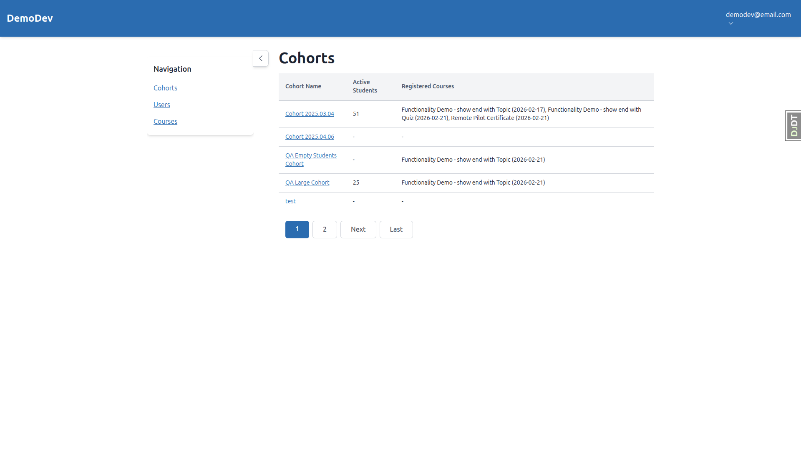
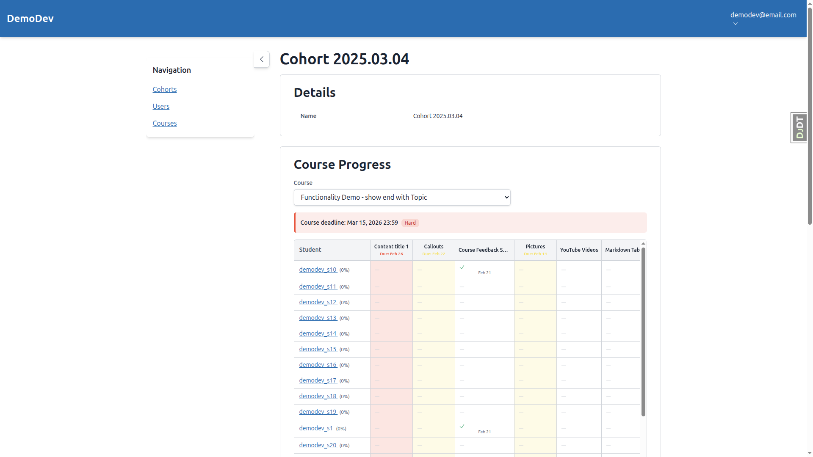
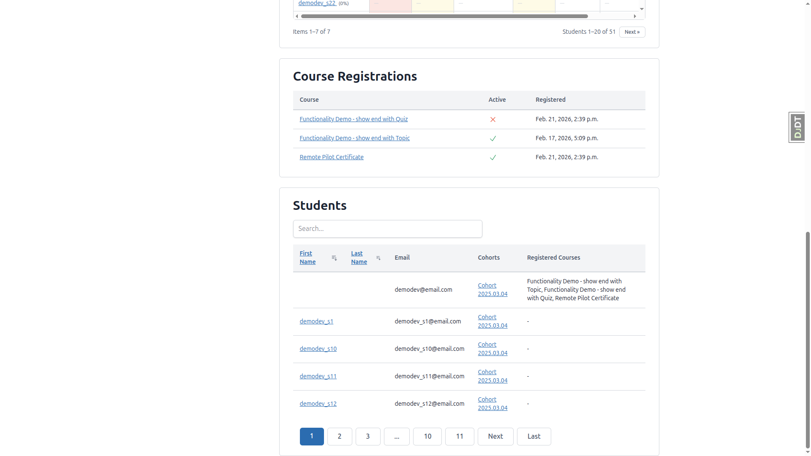
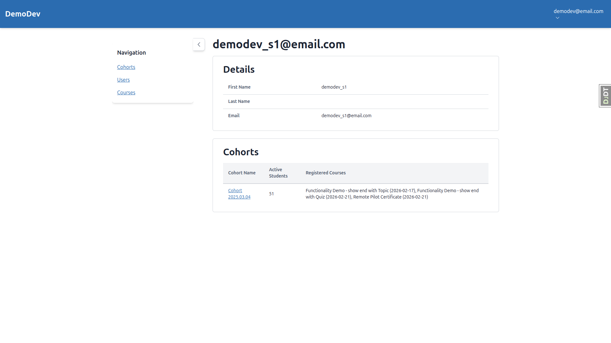
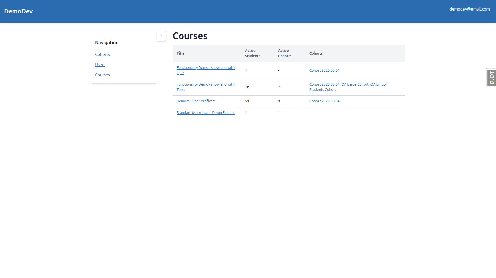
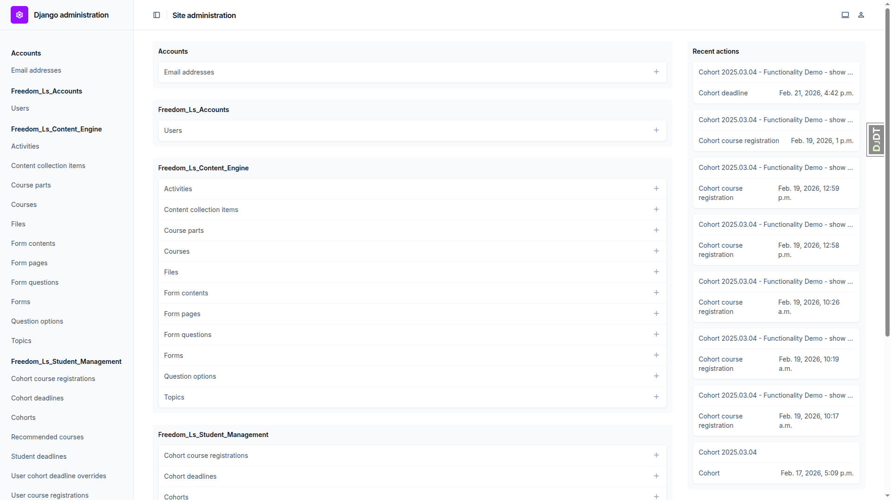
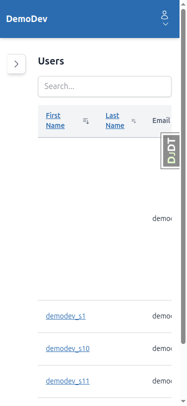
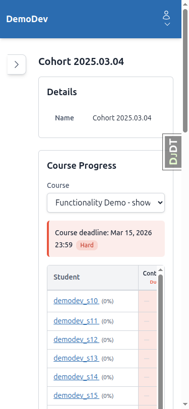
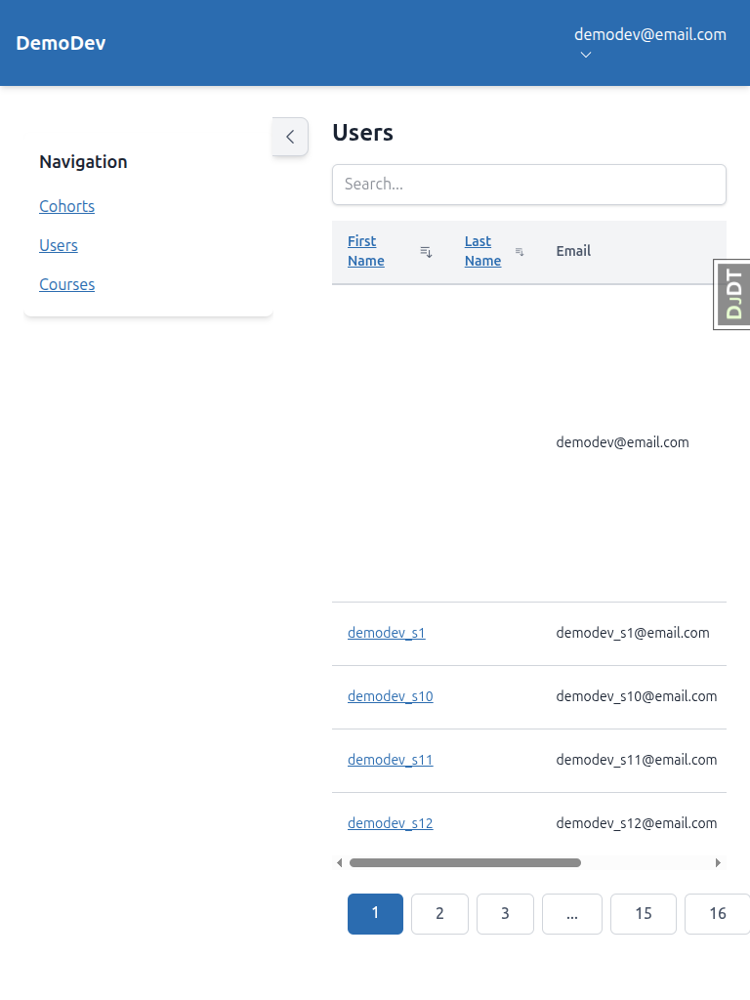
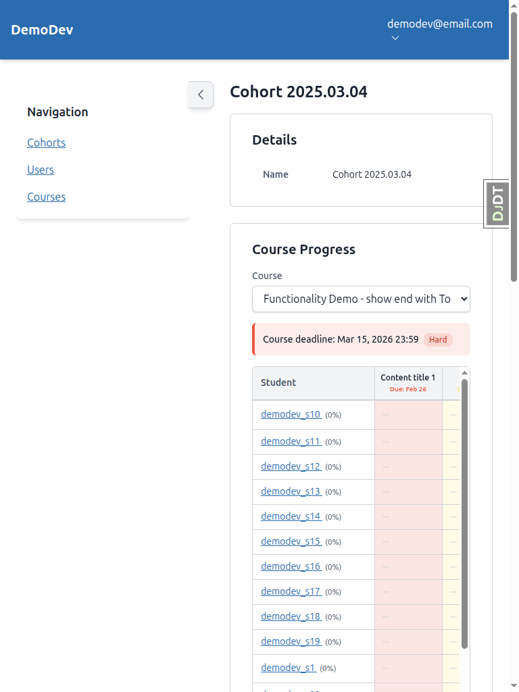

# QA Report: Remove the Student Model

**Date:** 2026-03-07
**Tester:** Claude (automated via Playwright MCP)
**Branch:** refactor-student-model

---

## Summary

The core refactoring functionality works correctly — URLs use `/users/`, the User model replaces Student, course registration and progress tracking work as expected. However, there are **multiple instances of stale "Student/Students" text** remaining in the educator interface UI that should have been renamed to "User/Users".

**Tests Passed:** 4 of 9
**Tests Failed:** 3 of 9 (all due to stale "Student" text)
**Tests Passed with Notes:** 2 of 9

---

## Errors

### Error 1: Stale "Active Students" column header on Cohort List

**Test:** Test 7 (Cohort Member Count), Test 8 (No Stale "Student" Text)

**Expected:** Column header should say "Active Users"
**Actual:** Column header says "Active Students"

**Location:** Educator Interface > Cohorts list (`/educator/cohorts`)

---

### Error 2: Stale "Student" column header in Course Progress table

**Test:** Test 3 (Cohort Detail with User Progress), Test 8

**Expected:** Progress table first column should say "User"
**Actual:** Progress table first column says "Student"

**Location:** Educator Interface > Cohort Detail > Course Progress table (`/educator/cohorts/{id}`)

---

### Error 3: Stale "Students 1-20 of 51" pagination text in Course Progress

**Test:** Test 3, Test 8

**Expected:** Pagination should say "Users 1-20 of 51"
**Actual:** Pagination says "Students 1-20 of 51"

**Location:** Educator Interface > Cohort Detail > Course Progress pagination

---

### Error 4: Stale "Students" heading on Cohort Detail members section

**Test:** Test 3, Test 8

**Expected:** Section heading should say "Users"
**Actual:** Section heading says "Students"

**Location:** Educator Interface > Cohort Detail > Members section

---

### Error 5: Stale "Active Students" column header on User Detail cohorts table

**Test:** Test 2 (User Detail), Test 8

**Expected:** Column header should say "Active Users"
**Actual:** Column header says "Active Students"

**Location:** Educator Interface > User Detail > Cohorts table (`/educator/users/{id}`)

---

### Error 6: Stale "Active Students" column header on Courses List

**Test:** Test 8

**Expected:** Column header should say "Active Users"
**Actual:** Column header says "Active Students"

**Location:** Educator Interface > Courses list (`/educator/courses`)

---

### Error 7: "Student deadlines" model still appears in Django Admin

**Test:** Test 6 (Admin Interface)

**Expected:** The test plan says "Student" model should NOT appear in admin. While this is an intentionally kept model name (StudentDeadline), the admin verbose name "Student deadlines" is potentially confusing given the refactor goals.

**Actual:** "Student deadlines" appears in admin under Freedom_Ls_Student_Management

**Location:** Django Admin (`/admin/`)

---

## Test Results Detail

| Test | Result | Notes |
|------|--------|-------|
| Test 1: User List | PASS | URL uses `/users/`, header says "Users", correct columns. First user (admin) has empty name fields — data issue, not a bug. |
| Test 2: User Detail | FAIL | URL correct, details correct, no old Student fields. But cohorts table has "Active Students" column header. |
| Test 3: Cohort Progress | FAIL | Progress table works correctly but has "Student" column header, "Students" pagination text. |
| Test 4: Course Registration | PASS | Registration works, course loads, no "Student" text visible. |
| Test 5: Course Deadlines | PASS | Lock indicators display correctly, unlocked items accessible. |
| Test 6: Admin Interface | PASS (with note) | "User course registrations" and "User cohort deadline overrides" appear correctly. "Student deadlines" still present as a model name. |
| Test 7: Cohort Member Count | FAIL | Counts are correct but column header says "Active Students" instead of "Active Users". |
| Test 8: Stale "Student" Text | FAIL | Multiple instances found across educator interface (see errors above). |
| Test 9: Management Commands | PASS | `create_demo_data` completes without errors. |

---

## Mobile Testing (375x812)

- **Navigation:** Hamburger menu works correctly with Profile, Educator Interface, Admin Panel, Sign Out options. Touch targets are adequately sized.
- **Sidebar:** Opens by default on page load which pushes content off-screen. User must toggle sidebar closed to see content. This is a pre-existing UX concern, not related to the refactor.
- **Tables:** User list and progress tables are horizontally scrollable. Content is accessible but cramped.
- **Forms:** Course selector dropdown on cohort detail works correctly at mobile width.

---

## Tablet Testing (768x1024)

- **Navigation:** Gets desktop nav (sidebar visible). Sidebar takes reasonable space.
- **Tables:** Horizontally scrollable, Cohorts/Registered Courses columns cut off but accessible via scroll.
- **Progress table:** Scrollable, functional at tablet width.
- **No additional issues** beyond what was found on desktop.

---

## Tangential Observations

1. **Alpine.js warnings:** 6 console warnings about `x-collapse` on the course navigation page. Not related to the refactor but worth investigating.
2. **Demo user login:** Demo student users (e.g., demodev_s1@email.com) require email verification, making it impossible to log in as a non-educator user for Test 4. Test was performed using the admin account instead.
3. **favicon.ico 404:** Minor — the site returns a 404 for favicon requests. Not related to this refactor.
