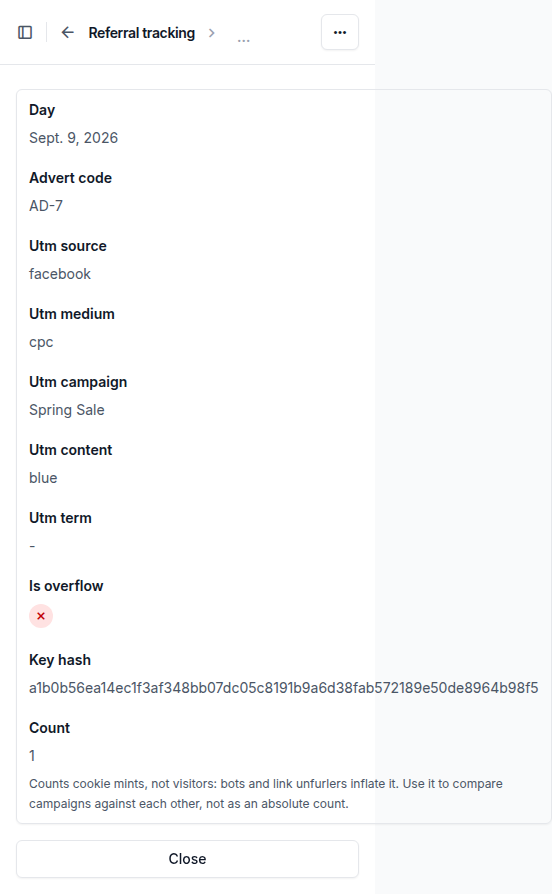
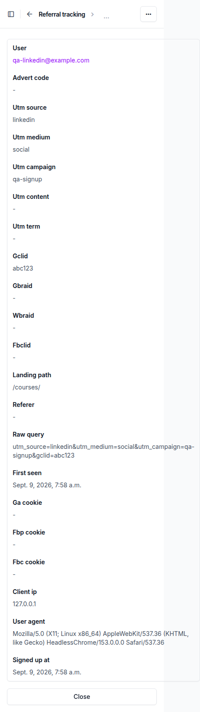
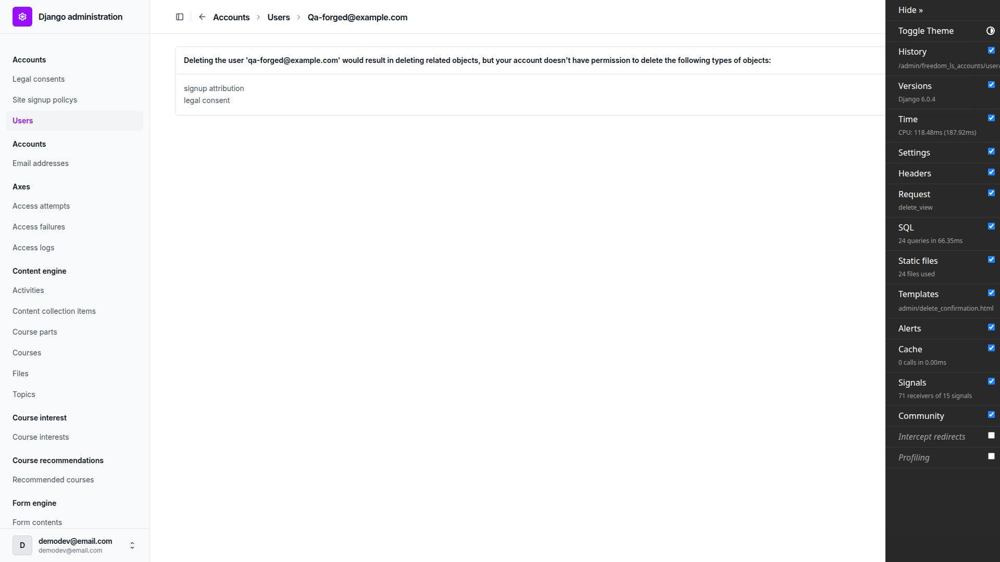

# Frontend QA report — referal_tracking

## 1. Methodology

The run drove a real browser through Playwright MCP against a dev server on port 8681, logged in as
the admin from `.claude/fls-dev/config.md`. Screenshots were collected into
`spec_dd/2. in progress/referal_tracking/screenshots/`, which sits beside this report; every image
this report embeds exists there. Header-level assertions (`Set-Cookie` attributes, `Vary`,
`Cache-Control`) were read from real response headers, not inferred. Isolated fresh browser contexts
were used wherever the plan called for a visitor with no `fls_attribution` cookie.

Two setup facts affected the run:

- The dev DB's `DemoDev` Site was repointed from `127.0.0.1:8000` to `127.0.0.1:8681`, because port
  8000 was occupied by another worktree's server and site resolution is host-based.
- The dev DB held zero `Course` rows on every site, so course content was created via the
  `fls-dev:qa-data-helper` agent before the course-player checks in §9 could run.

## 2. Diff scoping

Scoping class: **FULL**.

Changed files:

- `.secrets.baseline`
- `config/settings_base.py`
- `docs/app_structure.md`
- `freedom_ls/accounts/forms.py`
- `freedom_ls/referral_tracking/*.py` (new app: admin, capture, counters, exports, middleware,
  models, migrations, tests)
- `spec_dd/2. in progress/referal_tracking/*.md`

A new middleware that runs on every request plus a new signup hook is not a change with a safely
narrowable blast radius, so the plan ran in full: nothing was skipped.

## 3. Smoke gate

**Pass.** Pages loaded:

- `http://127.0.0.1:8681/` (Dashboard, 200)
- `http://127.0.0.1:8681/admin/freedom_ls_referral_tracking/signupattribution/` (changelist, 200)

## 4. Results by test-plan section

### §1 A tracked landing mints the cookie and tallies once — pass

A tracked landing on `/courses/` rendered normally and set `fls_attribution` as `HttpOnly`,
`SameSite=Lax`, `Max-Age=7776000`, `Path=/`, no `Domain`, not `Secure`, alongside a single
`Vary: Cookie` and `Cache-Control: private, no-store`. Header assertions were re-confirmed with a
second fresh curl landing (`utm_source=Hdrcheck`) rather than re-using the browser session, so the
browser's Facebook tally stayed at 1.

The `FirstTouchCount` changelist showed one row for today: `utm_source` `facebook`, `utm_medium`
`cpc` (both lower-cased), `utm_campaign` `Spring Sale` (case kept), `utm_content` `blue`,
`advert_code` `AD-7`, `count` 1, `is_overflow` unticked. The detail view rendered every field
read-only with no Save/Delete buttons and the expected count help text ("Counts cookie mints, not
visitors...").

Reloading the same URL, then a different tracked URL (`utm_source=google`), with the cookie already
present minted no new cookie and added no Google row — the stored cookie value was byte-identical
before and after. First touch stays frozen.

### §2 Untracked traffic is untouched — pass

`/courses/`, `/accounts/login/` and `/courses/?foo=bar&ref=partner` set no `fls_attribution` and
added no tally row, each with a single `Vary: Cookie`; `ref` is correctly not a tracked parameter.
`POST /accounts/login/?utm_source=post-test` returned 403 (CSRF) with no `fls_attribution` in
`Set-Cookie` and no `post-test` row in `FirstTouchCount`. Only GETs mint.

### §3 Signup after a tracked landing — pass

Landing on `?utm_source=linkedin&utm_medium=social&utm_campaign=qa-signup&gclid=abc123` then
signing up as `qa-linkedin@example.com` wrote one `SignupAttribution` row before the email was
confirmed, with `gclid` `abc123`, `landing_path` `/courses/`, `raw_query` the full query string,
`client_ip` `127.0.0.1`, a HeadlessChrome `user_agent`, and blank `ga_cookie`/`fbp_cookie`/`fbc_cookie`.
`first_seen` (07:58:09) precedes `signed_up_at` (07:58:10) as expected.

Opening the confirmation link in a brand-new context confirmed the email and left the row
byte-identical (still `linkedin` / `qa-signup`, same `first_seen`) — see the general note on where
the confirmation flow lands. A third fresh context landed on a decoy campaign, then confirmed a
different signup that had no landing; that learner's row still read `direct` / `none` with its
original `first_seen`, and no extra row was created. Confirmation never writes attribution.

### §4 Signup with no landing — pass, with one wording note

A cookie-less signup wrote `utm_source` `direct`, `utm_medium` `none`, and every other frozen field
blank, with no `FirstTouchCount` row added. `first_seen` and `signed_up_at` differ by about a
millisecond rather than being exactly equal — see general notes. Landing on `?utm_source=direct`
before signing up stored `direct` as-is (`landing_path` `/courses/`, `raw_query`
`utm_source=direct`) and gave the tally a `direct` row with `count` 1: a crafted value is not
distinguished from a real direct signup, as specified.

### §5 Malformed and hostile input — pass

Landing with a null byte and tab embedded in `utm_source`, `=1+1` in `utm_campaign`, a
double-encoded `utm_term`, and a 200-character `utm_content` rendered the course listing at 200 with
no traceback. The stored row: `utm_source` `facebook` (null byte and tab stripped, lower-cased),
`utm_campaign` `=1+1` literal, `utm_term` `a%2Bb` (not double-decoded), `utm_content` truncated to
exactly 128 characters.

Forging the `fls_attribution` cookie then landing on `?utm_source=after-forge` returned 200, emitted
exactly one fresh `Set-Cookie` replacing the forged value, and tallied an `after-forge` row with
`count` 1 — a tampered cookie counts as absent. Signing up with the forged cookie still in place
stored `direct` / `none` with blank `landing_path`/`raw_query`; nothing from the forged value
reached the row.

### §6 The admin is read-only — pass

`FirstTouchCount`: no Add button; date drilldown by day; filters for utm source/medium/campaign/
is_overflow; add and delete URLs 403 for the superuser, change URL 200 read-only.

`SignupAttribution`: no Add button; date drilldown by `signed_up_at`; filters exactly by utm
source/medium/campaign (gclid, ad cookies, client_ip and user_agent are not offered as filters);
search finds a row by email, campaign or advert code (verified with a row carrying `advert_code`
`AD-SEARCH`), gclid is not searchable; detail view read-only with no Save/Delete; add and delete
URLs 403 even for the superuser.

Permission check: a staff user with no permissions sees neither model on the admin index and gets
403 on both changelists and the add URL. Granted only "Can view signup attribution": the
`SignupAttribution` changelist renders 200 and appears on the index, the add URL still 403s,
`FirstTouchCount` still 403s and stays off the index, and "Export selected rows as CSV" is offered.

### §7 The overflow row — pass

After seeding 1000 distinct keys for today (1008 total), landing on
`?utm_source=past-cap&utm_campaign=novel` returned 200 and created no `past-cap` row — instead a
single overflow row for today with every key column blank. A second fresh `past-cap` landing took
that overflow row's count to 2, and landing on the already-seeded key `seed-5` took that row's count
to 2 independently: an existing key still gets its own increment past the cap. Seed rows were
removed afterwards.

### §8 CSV export — pass

Filtering `SignupAttribution` by `utm_campaign=qa-signup` and exporting the selected row produced
`signupattribution.csv` beginning with the UTF-8 BOM (`EF BB BF`), a header naming every model field
including `gclid`, `client_ip` and `user_agent`, one data row, the `user` column as the email, and
`first_seen`/`signed_up_at` as ISO 8601 (`2026-09-09T07:58:09.104485+00:00`).

Exporting the `FirstTouchCount` row whose `utm_campaign` is `=1+1` produced a cell of `'=1+1` — the
leading apostrophe forces Excel/Sheets/LibreOffice to render it as text rather than evaluating it.

On the seeded changelist (1000 rows, 100 per page, 10 pages) filtered to `utm_source=seed`, ticking
the header checkbox then "Select all 1000 first touch counts" set `select_across=1`, and the export
returned 1000 data rows with 1000 distinct campaigns — the whole filtered set, not the visible page.

### §9 What else could break — pass on every check but one

| Check | Result |
|---|---|
| 404 with `?utm_source=x404` | 404 page rendered, cookie still minted, one `x404` tally row, one `Vary: Cookie` — expected, spec doesn't gate minting on status |
| Admin under `?utm_source=x`, cookie already present | 200, single `Vary: Cookie`, no re-mint (first touch frozen) |
| Admin under `?utm_source=admin-fresh`, cookie cleared, logged-in admin context | mints and tallies an `admin-fresh` row — admin is tallied like any other GET, as the plan expects |
| Signup with `_ga`/`_fbp`/`_fbc` set by hand | stored verbatim: `ga_cookie` `GA1.1.111111111.1700000000`, `fbp_cookie` `fb.1.1700000000000.222222222`, `fbc_cookie` `fb.1.1700000000000.IwAR3fbclidvalue` |
| HTMX partials (admin search, and the mint path under `HX-Request: true`) | exactly one `Vary: Cookie` each, `Cache-Control: private, no-store` and one `Set-Cookie` on the mint path, no duplicated headers |
| Course listing/detail/player, plain and with tracked params | 200, single `Vary: Cookie`; the player's Next action still marks complete and advances under the middleware |
| Deleting a user with a `SignupAttribution` row from the User admin | **fail** — see bug B2 |
| Mobile/tablet admin layout (changelists, detail pages) | changelists reflow cleanly at 375×812 and 768×1024; detail pages overflow at 375×812 — see bug B1 |

## Bug B1: Read-only admin detail pages scroll sideways on a phone when a stored value is one long unbroken string

**Manifestations:** `6.1-mobile-detail` (mobile)

**Screenshots:**

**Expected:** At 375×812 the `FirstTouchCount` and `SignupAttribution` detail pages fit the
viewport, wrapping long values the way the changelist cards already do. Document `scrollWidth`
should equal 375.

**Actual:** The field container is forced wider than the viewport by its longest unbreakable value,
so the whole page scrolls horizontally. `FirstTouchCount` detail measures 552px against a 375px
viewport, driven by the 64-character `key_hash` rendering as a single unbroken line off the right
edge. `SignupAttribution` detail measures 458px for the row whose `raw_query` is 73 characters and
417px for another; rows whose values are all short measure exactly 375px and fit — the correlation
with value length is exact. This is not baseline theme behaviour: the pre-existing `LegalConsent`
detail page, whose breadcrumb title is longer still, stays at 375px. It will be the normal case in
production rather than the exception, because `raw_query`, `user_agent` and the three ad cookies
routinely hold long unbroken strings, and real ad-platform query strings run far longer than 73
characters. The fix is a wrapping rule (`overflow-wrap: anywhere` / `break-words`) on the read-only
field values.

## Bug B2: A user holding a SignupAttribution row can no longer be deleted from the User admin

**Manifestations:** `9.user-delete` (desktop)

**Screenshots:**

**Expected:** Per the test plan's §9, the User admin delete page lists the attribution row in its
deletion summary, and after confirming, the row is gone from the changelist.

**Actual:** The delete page renders "Cannot delete user" with no summary and no confirm button, even
for a superuser: "Deleting the user ... would result in deleting related objects, but your account
doesn't have permission to delete the following types of objects: signup attribution, legal
consent." Django's delete view calls `has_delete_permission` on every related admin, and
`SignupAttributionAdmin` returns `False`. The FK cascade itself is sound — deleting the user through
the ORM removed the `SignupAttribution` row cleanly — so only the admin route is blocked. Important
context: "legal consent" is listed alongside it, and `LegalConsentAdmin.has_delete_permission`
already returns `False` on main (`freedom_ls/accounts/admin.py:44`). Every consent-flow signup
writes both rows, so admin user deletion was already blocked before this branch; this diff adds a
second, identical blocker following the accounts app's own precedent rather than introducing the
behaviour. Resolving it means deciding whether read-only audit rows should permit cascade deletion
at all — a product and data-retention call that also touches the accounts app.

## Addendum 2026-09-09: §8 re-run after moving the export to django-import-export

The hand-written `export_as_csv` action was replaced by `django-import-export` through the new
`SiteAwareExportModelAdmin` base. §8 was re-run against the dev site on `127.0.0.1:8681` as the
superuser, on the same seed rows as the first run.

- The `SignupAttribution` changelist filtered to `utm_campaign=qa-signup` shows a "download Export"
  button linking to `.../signupattribution/export/?utm_campaign=qa-signup`, and the action menu
  offers "Export selected signup attributions". Ticking the row and running the action downloaded
  `SignupAttribution-2026-09-09.csv` at once, with no intermediate form. The file starts with
  `EF BB BF`, its header names every model field including `gclid`, `client_ip` and `user_agent`
  and omits `site`, the `user` column is `qa-linkedin@example.com`, and `first_seen` /
  `signed_up_at` read `2026-09-09T07:58:09.104485+00:00` / `2026-09-09T07:58:10.015691+00:00`.
- Fetching the Export button's URL through the logged-in session returned the same one-row CSV.
- Fetching `.../firsttouchcount/export/?utm_campaign=%3D1%2B1` returned
  `FirstTouchCount-2026-09-09.csv` whose campaign cell reads `'=1+1`, `day` reads `2026-09-09` and
  `is_overflow` reads `0`.
- The `SignupAttribution` detail page renders 200 with neither a Save nor an Export button.
- As `qa-staff@example.com` (view permission on `SignupAttribution` only), the
  `signupattribution` export URL returned `text/csv` and the `firsttouchcount` export URL returned
  403, matching the changelist itself.

The "Select all N" pass of the first run (1000 seeded rows) was not repeated; the seed rows were
removed after that run. The same `select_across=1` path is covered by
`test_export_action_on_filtered_changelist_returns_only_matching_rows`.

## Bug status

- **UNRESOLVED** — Read-only admin detail pages scroll sideways on a phone when a stored value is one long unbroken string
- **UNRESOLVED** — A user holding a SignupAttribution row can no longer be deleted from the User admin

## General notes

- Email confirmation lands on the login page rather than auto-logging the learner in, despite
  `ACCOUNT_LOGIN_ON_EMAIL_CONFIRMATION=True`. This is baseline allauth cross-session behaviour
  untouched by this diff (`accounts/forms.py` adds only a `record_signup_attribution` call after
  consents) — the plan's §3.4 expectation is what's off, not the code.
- In §4.1, `first_seen` and `signed_up_at` differ by about a millisecond (`08:00:20.914544` vs
  `08:00:20.915546`) rather than being exactly equal as the plan words it, since they come from two
  separate `timezone.now()` calls. Same instant for any reporting purpose.
- The plan's §1.1 header assertions were confirmed on a second fresh curl landing using
  `utm_source=Hdrcheck` so the browser's Facebook tally stayed at 1, which leaves a stray `hdrcheck`
  row in the dev tally.
- About 10 links/buttons on the admin changelists measure under 32px tall on mobile (mainly the
  date-drilldown links) — this is Django/unfold admin chrome rather than FLS-authored markup.
- The `fls-dev:qa-data-helper` agent left a new management command at
  `freedom_ls/qa_helpers/management/commands/qa_create_browsable_course.py`, which is untracked and
  not part of this feature's diff. Flag it so someone decides whether to keep or drop it.

status: ok
reason: 2 bugs — 0 fixed, 2 unresolved (both triaged to the red lane: B1 is a CSS layout defect with no pytest-level assertion, B2 turns on a product decision and spans two apps); report rendered, screenshots verified
