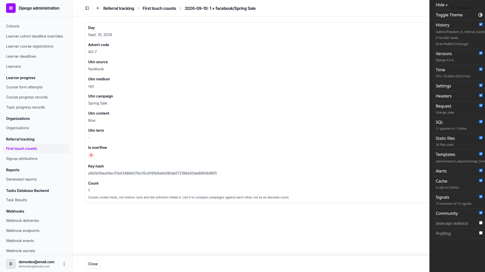
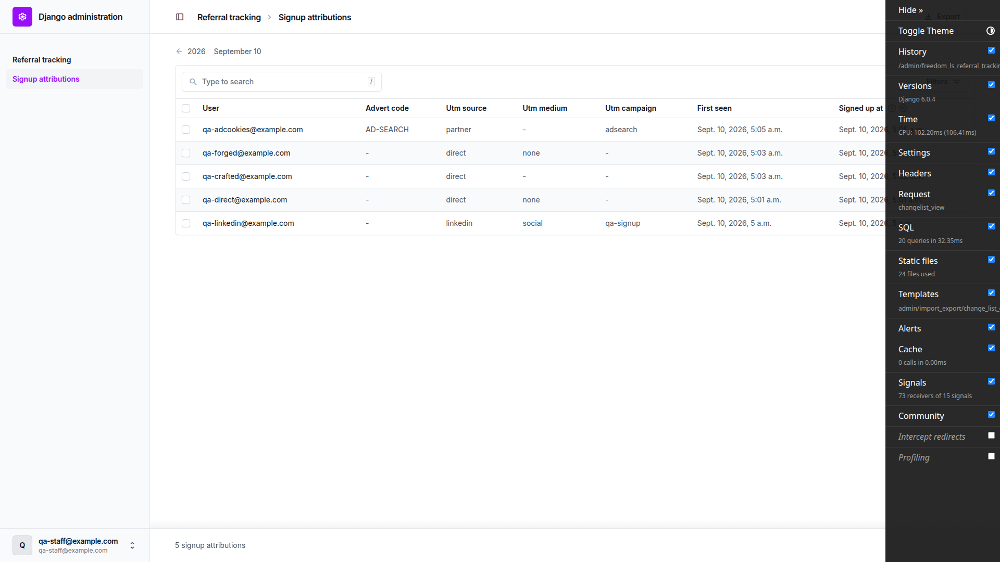
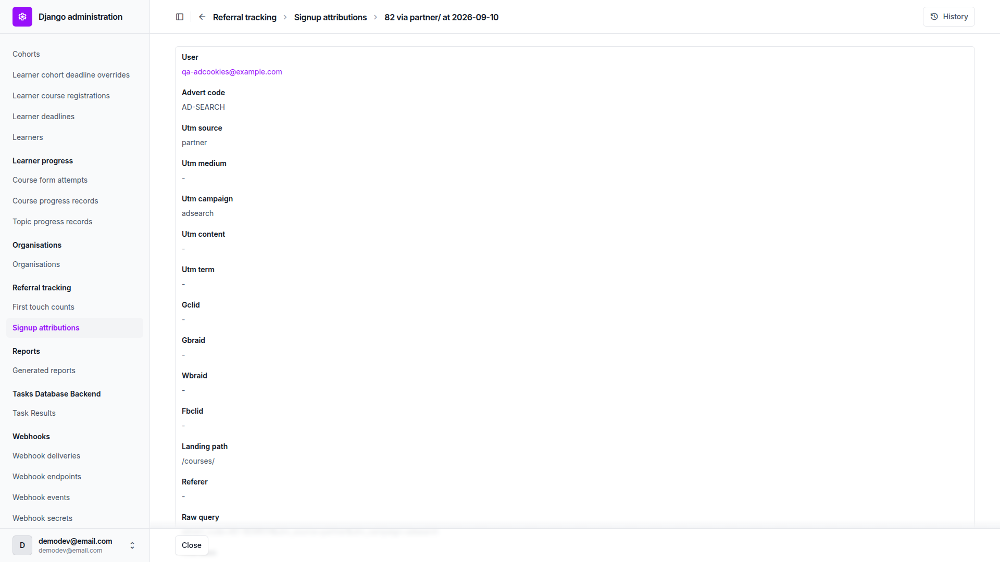
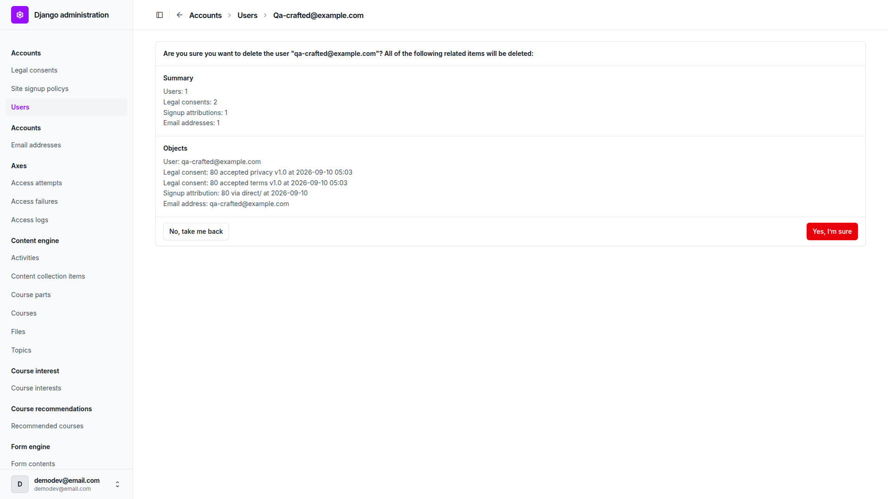
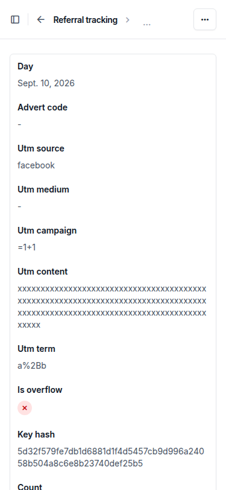
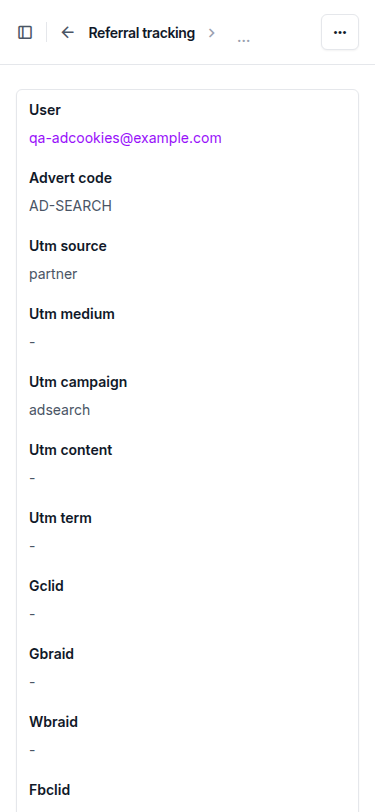
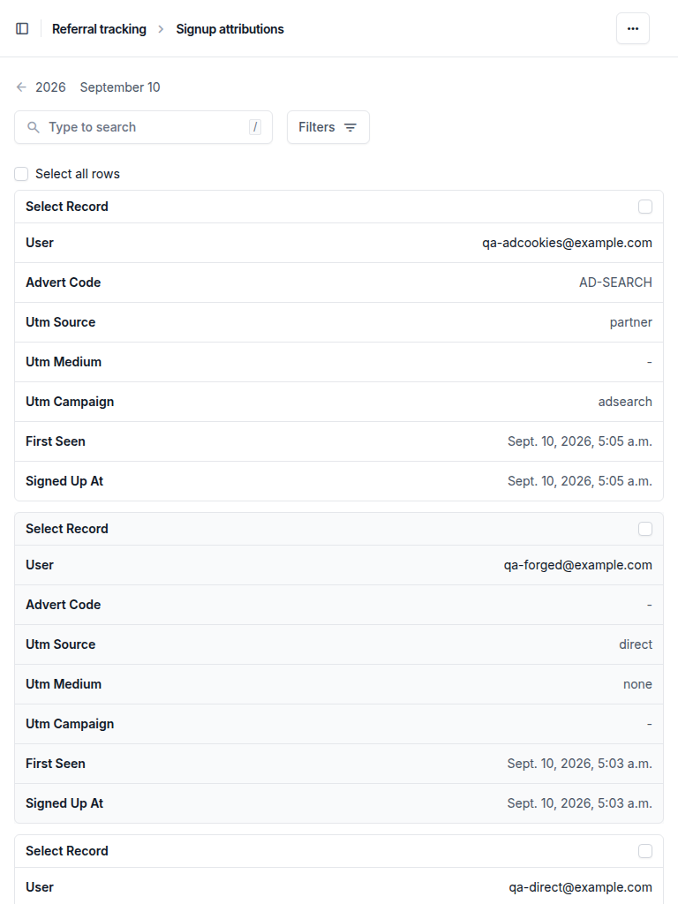

# Frontend QA report — referal_tracking

## 1. Methodology

This run drove a real browser through Playwright MCP against a dev server on port 8882, logged in
as the admin account from `.claude/fls-dev/config.md` (`demodev@email.com`, password equal to the
email). The DemoDev site row was repointed from `127.0.0.1:8681` to `127.0.0.1:8882` for the run,
since site resolution is host-based and the port is chosen per run.

Header-level assertions — `Set-Cookie` attributes, `Vary`, `Cache-Control` — were read from real
response headers via `curl`, not inferred from behaviour or from reading the middleware source.

Screenshots were collected into `spec_dd/2. in progress/referal_tracking/screenshots/`, which sits
beside this report. Every image this report embeds exists in that directory.

Nothing was skipped. All of §1 through §9 of the test plan ran, across desktop, mobile (375x812)
and tablet (768x1024) viewports.

## 2. Diff scoping

Scoping class: **FULL**. The changed files that triggered it:

- `freedom_ls/site_aware_models/static/site_aware_models/css/admin.css`
- `freedom_ls/referral_tracking/*.py`
- `freedom_ls/site_aware_models/admin.py`
- `freedom_ls/site_aware_models/admin_exports.py`
- `freedom_ls/accounts/admin.py`
- `freedom_ls/accounts/forms.py`
- `config/settings_base.py`
- `pyproject.toml`
- `docs/product/*.md`

Nothing was skipped as a result of this scoping: desktop, mobile and tablet all ran.

## 3. Smoke gate

Outcome: **pass**. Pages loaded:

- `http://127.0.0.1:8882/`
- `http://127.0.0.1:8882/admin/freedom_ls_referral_tracking/signupattribution/`

## 4. Results by test-plan section

### §1 A tracked landing mints the cookie and tallies once — pass

A fresh landing on `/courses/?utm_source=Facebook&utm_medium=CPC&utm_campaign=Spring%20Sale&utm_content=blue&advert_code=AD-7`
returned 200 and set `fls_attribution`: `HttpOnly`, `SameSite=Lax`, `Max-Age=7776000`, `Path=/`, no
`Domain`, not `Secure`. The response carried a single `Vary: Cookie` and `Cache-Control: private,
no-store`.

The `FirstTouchCount` changelist showed one row for today: `advert_code` `AD-7`, `utm_source`
`facebook`, `utm_medium` `cpc` (both lower-cased), `utm_campaign` `Spring Sale` (case kept),
`utm_content` `blue`, `count` 1, `is_overflow` unticked. The detail page had no editable inputs, no
Save or Delete button, and showed the `count` help text about cookie mints, bots and comparing
campaigns.

Reloading the same URL, then a different one (`utm_source=google`), with the cookie still present
set no new `fls_attribution` cookie. The tally still showed `count` 1 for the Facebook row and no
Google row — first touch stayed frozen.

### §2 Untracked traffic is untouched — pass

`/courses/`, `/accounts/login/` and `/courses/?foo=bar&ref=partner` each returned 200 with a single
`Vary: Cookie` and no `fls_attribution` Set-Cookie. `ref` was correctly not treated as a tracked
parameter, and no new `FirstTouchCount` row appeared.

`POST /accounts/login/?utm_source=post-test` returned 403 (CSRF) and set only `csrftoken`, no
`fls_attribution`. No `post-test` row appeared in the tally. Only GETs mint.

### §3 Signup after a tracked landing — pass

Landing on `?utm_source=linkedin&utm_medium=social&utm_campaign=qa-signup&gclid=abc123` and signing
up as `qa-linkedin@example.com` wrote one `SignupAttribution` row before the email was confirmed:
`linkedin`/`social`/`qa-signup`, `gclid` `abc123`, `landing_path` `/courses/`, `raw_query` the full
query string, `client_ip` `127.0.0.1`, a `user_agent`, and blank `ga_cookie`/`fbp_cookie`/`fbc_cookie`.
`first_seen` (05:00:37.199152) preceded `signed_up_at` (05:00:49.206718).

Opening the confirmation link in a fresh context with no prior visit verified the email (`True`) and
left the attribution row unchanged — still `linkedin`/`qa-signup`, same `first_seen`, still exactly
one row. Confirmation landed on the login page rather than auto-logging in; that is baseline allauth
cross-session behaviour, unchanged by this diff. The test plan's wording on this point is what is
off, not the product.

A fresh context that landed on `?utm_source=decoy&utm_campaign=decoy` (minting `fls_attribution`)
and then confirmed `qa-direct@example.com` — whose own signup had no landing — left that learner's
row reading `direct`/`none` with its original `first_seen`, and created no extra row. Confirmation
never writes attribution.

### §4 Signup with no landing — pass

A cookie-less signup (`qa-direct@example.com`) wrote `utm_source` `direct`, `utm_medium` `none`,
every other frozen field blank, and added no `FirstTouchCount` row. `first_seen` and `signed_up_at`
differed by 0.64ms rather than being byte-equal — two separate `timezone.now()` calls, same instant
for reporting purposes. That is a plan-wording nit, not a defect.

Landing on `?utm_source=direct` and then signing up stored `utm_source` `direct` as-is
(`landing_path` `/courses/`, `raw_query` `utm_source=direct`), and the tally gained a `direct` row
with `count` 1. A crafted `direct` value is not distinguished from a real direct signup, as
specified.

### §5 Malformed and hostile input — pass

Landing with a null byte and tab embedded in `utm_source`, `=1+1` in `utm_campaign`, a
double-encoded `utm_term`, and a 200-character `utm_content` returned 200 with no traceback. Stored:
`utm_source` `facebook` (null and tab stripped, lower-cased), `utm_campaign` `=1+1` literal,
`utm_term` `a%2Bb` (not double-decoded), `utm_content` truncated to exactly 128 characters.

Landing on `?utm_source=after-forge` with a forged `fls_attribution` cookie in place returned 200,
minted a fresh cookie replacing the forged value, and tallied an `after-forge` row with `count` 1. A
tampered cookie counts as absent.

Signing up (`qa-forged@example.com`) with the forged cookie still in place stored `direct`/`none`
with blank `landing_path`, `raw_query` and `gclid`. Nothing from the forged value reached the row.

### §6 The admin is read-only — pass

On both changelists: no Add button; the add URL and the delete URL both returned 403, even for the
superuser; the change URL returned 200 and was fully read-only (no editable inputs, no Save, no
Delete, no Export button on the detail page). `SignupAttribution` has a `signed_up_at` date
drilldown and filters for `utm_source`/`utm_medium`/`utm_campaign` only — `gclid`, the ad cookies,
`client_ip` and `user_agent` are not offered as filters. Its search box found a row by email,
campaign and advert code (`AD-SEARCH`); searching `gclid` `abc123` returned 0 rows, confirming
`gclid` is correctly not searchable. `FirstTouchCount` has a `day` drilldown and filters for
`utm_source`/`utm_medium`/`utm_campaign`/`is_overflow`.

`qa-staff@example.com` (`is_staff`, no permissions) saw neither model on the admin index and got 403
on both changelists, the add URL and both export URLs. After granting only "Can view signup
attribution": the `SignupAttribution` changelist rendered 200 and appeared on the index, its add URL
still 403'd, no Add button appeared, the action menu offered "Export selected signup attributions",
and `FirstTouchCount` stayed off the index and still 403'd.

### §7 The overflow row — pass

With 1000 distinct keys seeded for today, landing on `?utm_source=past-cap&utm_campaign=novel`
returned 200 and created no `past-cap` row; instead a single overflow row appeared for today with
every key column blank and `count` 1. A second fresh `past-cap` landing took the overflow count to
2, and landing on the already-seeded key `seed-5` took that row's own count to 2 independently: an
existing key still gets its own increment past the cap.

### §8 CSV export — pass

`SignupAttribution` filtered to `utm_campaign=qa-signup`, one row ticked, action "Export selected
signup attributions": downloaded `SignupAttribution-2026-09-10.csv` immediately with no intermediate
form (changelist URL unchanged). The file starts with the UTF-8 BOM (`EF BB BF`); the header line is
`id,user,advert_code,utm_source,utm_medium,utm_campaign,utm_content,utm_term,gclid,gbraid,wbraid,fbclid,landing_path,referer,raw_query,first_seen,ga_cookie,fbp_cookie,fbc_cookie,client_ip,user_agent,signed_up_at`
— every model field including `gclid`, `client_ip` and `user_agent`, no `site` column. One data row;
`user` was `qa-linkedin@example.com`; `first_seen` `2026-09-10T05:00:37.199152+00:00` and
`signed_up_at` `2026-09-10T05:00:49.206718+00:00` were both ISO 8601.

The `FirstTouchCount` row carrying `utm_campaign` `=1+1` exported via "Export selected first touch
counts" as `FirstTouchCount-2026-09-10.csv`. The cell read `'=1+1` with a leading apostrophe, so
Excel, Google Sheets and LibreOffice render it as text rather than evaluating it to 2. `is_overflow`
read `0`, `day` read `2026-09-10`, and there was no `site` column.

On the seeded changelist filtered to `utm_source=seed` (1000 rows, 100 per page), ticking the header
checkbox then "All 1000 selected" set `select_across=1`, and the action exported 1000 data rows with
1000 distinct campaigns, all `utm_source=seed` — the whole filtered set, not just the visible page.
On the same filtered changelist with nothing ticked, the top-of-list Export button linked to
`.../firsttouchcount/export/?utm_source=seed` and downloaded the same 1000-row filtered set
immediately.

A `SignupAttribution` detail page rendered 200 with no Export anchor or button outside the debug
toolbar, an empty submit row (no Save, no Delete) and no editable inputs.

As `qa-staff@example.com` holding only "Can view signup attribution": `GET
.../firsttouchcount/export/` returned 403 (`text/html`), while `.../signupattribution/export/`
returned 200 `text/csv` and downloaded `SignupAttribution-2026-09-10.csv`. Export follows the
model's own view permission, not merely "is this user staff".

### §9 What else could break — pass

A 404 URL carrying `?utm_source=x404` rendered the 404 page and still minted the cookie and tallied
a row, with a single `Vary: Cookie`. The plan does not gate minting on response status, so this is
expected.

A tracked landing sent with `HX-Request: true` returned 200 with exactly one `Vary: Cookie` and
`Cache-Control: private, no-store`, and minted normally. No duplicated `Vary` headers were seen on
any page checked (course listing, course detail, player, 404, admin), with or without tracked
params. Course listing, course detail
(`/courses/qa-browsable-course/detail/?utm_source=playerqa`) and the player
(`/courses/qa-browsable-course/1/?utm_source=playerqa3`) all returned 200 with a single
`Vary: Cookie`. The player's Next button still marked the topic complete and advanced: Welcome to
Key Ideas (302 then 200, one `Vary: Cookie` each).

The admin under `?utm_source=x` is tallied like any other GET, which the plan calls expected. The
observed consequence — that the referral admin's own changelist filters mint cookies and write tally
rows — is covered in General notes below and is filed as an observation, not a defect.

A signup made with `_ga`, `_fbp` and `_fbc` set by hand stored them verbatim: `ga_cookie`
`GA1.1.111111111.1700000000`, `fbp_cookie` `fb.1.1700000000000.222222222`, `fbc_cookie`
`fb.1.1700000000000.IwAR3fbclidvalue`.

Creating `qa-staff@example.com` straight from the `User` admin's Add form produced no
`SignupAttribution` row. Only the signup flow, via the `user_signed_up` receiver, writes one.

Two bullets in this section re-verify bugs the previous QA run found. Both are now fixed:

**User deletion (previously bug B2), fixed and re-verified.** Deleting `qa-crafted@example.com` from
the `User` admin now renders a real deletion summary — "Users: 1, Legal consents: 2, Signup
attributions: 1, Email addresses: 1" with the individual objects listed — and a working "Yes, I am
sure" button. There was no "Cannot delete user" message and no permission warning. After confirming,
the user, its attribution row and its two legal consents were all gone. Per-row deletion on the
attribution admin itself is still refused (403), so the audit trail stays protected there.
Previously, deleting a user with a `SignupAttribution` row could not be done from the `User` admin at
all.

**Sideways scroll on read-only detail pages at mobile width (previously bug B1), fixed and
re-verified.** At 375x812, both read-only detail pages measured `documentElement.scrollWidth` 375
against `clientWidth` 375 — no sideways scroll. The `.readonly` wrapper computes
`overflow-wrap: anywhere`, and the widest read-only value box measured 317px. This was checked on
the worst-case rows: the `FirstTouchCount` row carrying both a 64-character `key_hash` and a
128-character `utm_content`, and the `SignupAttribution` row with a 109-character `user_agent`.
Previously these measured 552px and 458px.

Two further viewport checks beyond the plan's own list: both changelists reflowed cleanly at
375x812, `scrollWidth` 375, no horizontal overflow.

At 768x1024, both changelists and both detail pages measured `scrollWidth` 768 against `clientWidth`
768. The result tables fit without their own horizontal scroll, and the read-only detail layout
stayed within the viewport.

## Bug status

No bugs were found in this run. Every test in §1 through §9 passed.

The two bugs found by the previous QA run were re-verified as fixed in this run: B1 (read-only
detail pages scrolling sideways on a phone) and B2 (a user with a `SignupAttribution` row could not
be deleted from the `User` admin). Detail for both is under §9 above.

## General notes

**Product question: the admin's own filters feed the data they filter.** The referral admin's own
changelist filters are named `utm_source`, `utm_medium` and `utm_campaign` — exactly the parameters
the middleware tracks. Filtering either changelist therefore mints an `fls_attribution` cookie for
the person doing the filtering and writes a tally row named after the filter value. Verified
directly: `GET .../firsttouchcount/?utm_source=adminfilterprobe` as a fresh visitor minted
`fls_attribution` and created an `adminfilterprobe` row. The feature's own reporting UI writes rows
into the data it displays. This also explains why the overflow row reached `count` 3 during the
export tests, rather than the 2 the §7 steps alone would produce — an admin changelist URL carrying
`utm_source=seed` minted one extra increment while the seed was still in place. The test plan's §9
already declares admin tallying expected, so this is filed as an observation and a product question
rather than a defect: is it acceptable for admin/report traffic to pollute the same counters it
reports on?

Both bugs from the previous QA run are now fixed and were re-verified in the browser this run: B1 is
covered by test `B1-regression`, B2 by test `9.user-delete`.

The DemoDev Site row was repointed from `127.0.0.1:8681` to `127.0.0.1:8882` for this run, because
site resolution is host-based and the port is chosen per run.

The dev database briefly went down mid-run. It was restored by the user, and every row this run had
created was verified intact afterwards (6 tally rows, 4 attribution rows, all matching what the
tests had observed). No check had hit a connection error, so no test needed re-running.

Two expectations in the test plan were corrected during this run because they described baseline
behaviour inaccurately rather than describing a defect: §3.4 said email confirmation logs the
learner straight in (allauth actually lands on the login page when the link is opened in a context
that did not sign up), and §4.1 said `first_seen` equals `signed_up_at` exactly (they come from two
separate `timezone.now()` calls and differ by well under a millisecond).

The django-debug-toolbar overlay intercepts pointer events on admin form buttons at desktop width, so
the toolbar had to be hidden before clicking Save or Run. This is dev-only tooling, not product
markup.

Dev data left behind by this run: QA users `qa-linkedin@example.com`, `qa-direct@example.com`,
`qa-forged@example.com`, `qa-adcookies@example.com` and the staff user `qa-staff@example.com`
(holding only "Can view signup attribution"), plus the tally rows the landing tests created. The
1000 seeded `FirstTouchCount` rows for §7 were removed. The overflow row remains at `count` 3 rather
than 2 because an admin changelist URL carrying `utm_source=seed` minted one extra increment while
the seed was still in place — see the admin-filter observation above.

status: ok
reason: report rendered, 0 bugs found, screenshots verified
