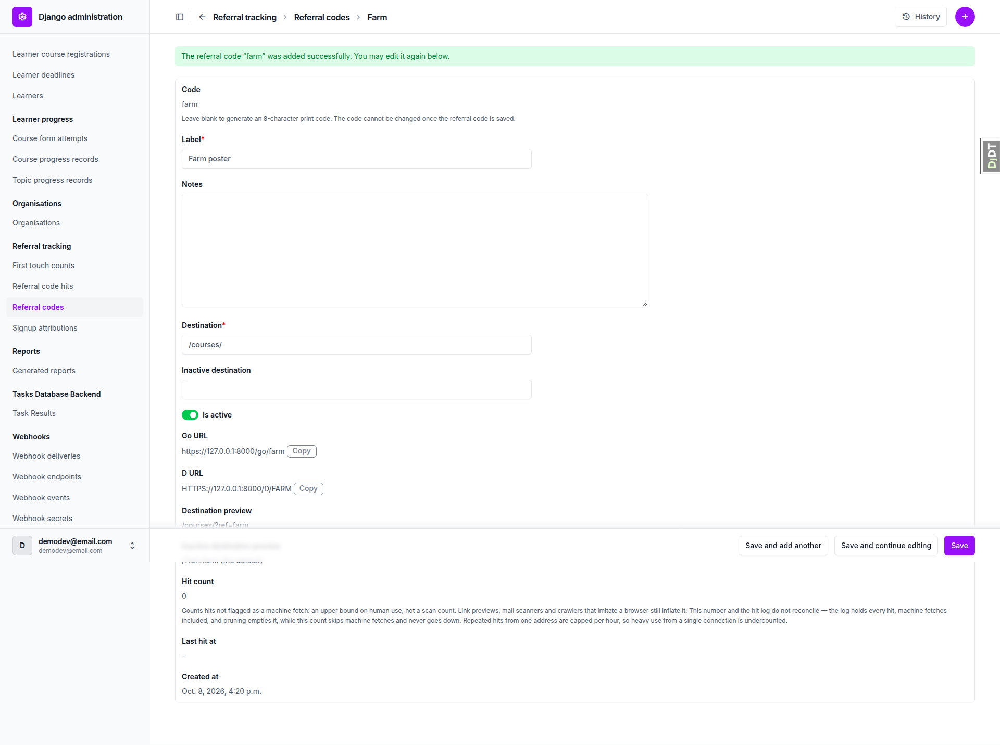
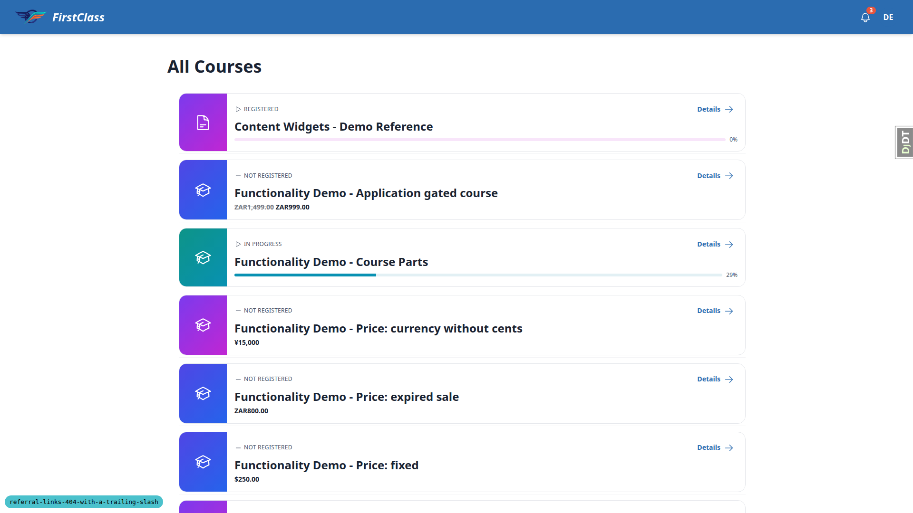
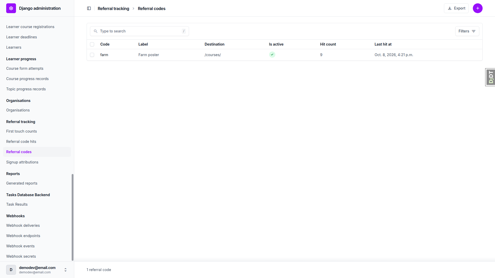
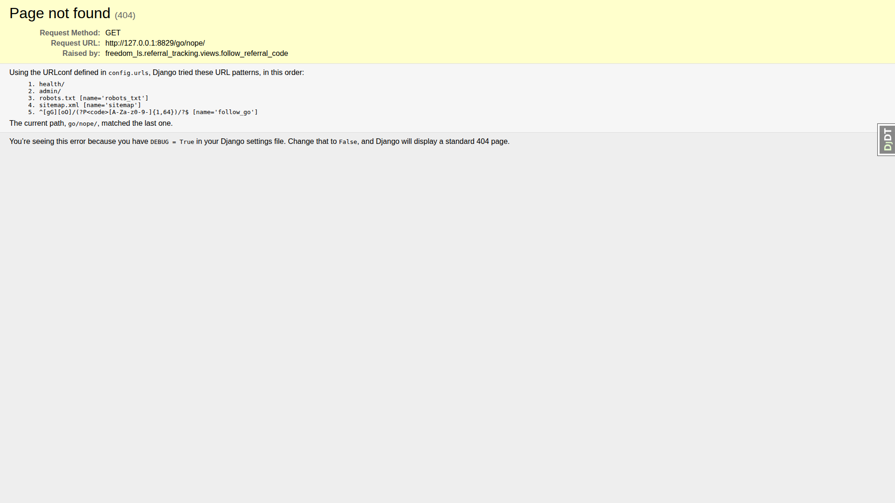
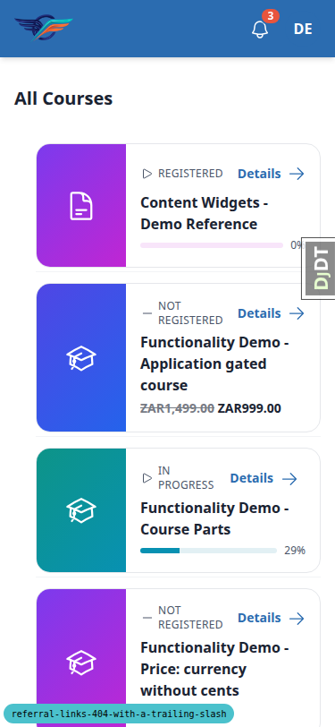
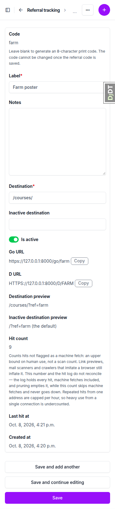
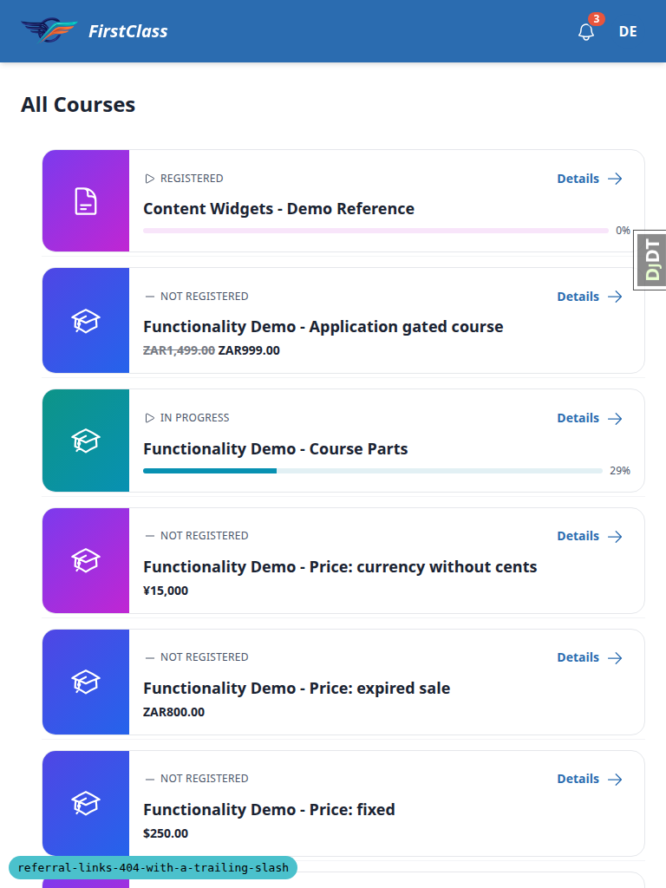

# Frontend QA report: referral links with a trailing slash

Every test passed on desktop, mobile and tablet, and no bugs were found. Referral links work in all spellings (slashless, slashed, upper and lower case, with a query string) with a single 302 and no 301 hop. Hits were counted. A stray trailing slash on other slashless routes redirects with a 301. Real 404s, the missing-slash direction and normal browsing are unchanged.

## Methodology

- Playwright MCP against a dev server on port 8829 on branch `referral-links-404-with-a-trailing-slash`, signed in as demodev@email.com where needed.
- Each referral visit ran in a fresh browser context so attribution cookies did not carry over.
- Redirect chains were read from each response's redirect history.
- Screenshots were collected into `screenshots/` beside this report, and every referenced image exists there.

## Diff scoping

- Class: FULL (rule 4: non-.py files changed, so the safe default applies).
- Changed files: `config/settings_base.py`, `freedom_ls/base/middleware.py`, `freedom_ls/base/tests/remove_slash_urls.py`, `freedom_ls/base/tests/test_middleware.py`, `freedom_ls/referral_tracking/tests/test_views.py`, `freedom_ls/referral_tracking/urls.py`, `freedom_ls/referral_tracking/views.py`, plus spec_dd files (plan, QA plan, idea, todo, upgrade notes, previous qa_report and screenshots).
- Nothing was skipped: desktop, mobile and tablet all ran.

## Smoke gate

Pass. `/` and `/courses/` loaded signed in.

## Results

### Desktop

| Test | Status | Notes |
|---|---|---|
| 0.2.3 (seed) | pass | A 'farm' code left by the previous run (9 hits) was deleted with its hits and first-touch rows by fls-dev:qa-data-helper; the admin has no delete permission. Created farm / Farm poster / /courses/ through the admin add form. The change form shows `https://127.0.0.1:8000/go/farm` and `HTTPS://127.0.0.1:8000/D/FARM` with no trailing slash; hit count 0. The host comes from the Site's configured domain, not this server's port.  |
| 1.1 | pass | Fresh context per visit. `/go/farm`, `/GO/FARM`, `/d/farm`, `/D/FARM`: each a single 302 to `/courses/?ref=farm` (200). No 301 in any chain. |
| 1.2 | pass | `/go/farm/`, `/GO/FARM/`, `/d/farm/`, `/D/FARM/`: each a single 302 to `/courses/?ref=farm`, with no 301 to the slashless form first. `/go/farm/?utm_source=poster` gives 302 to `/courses/?utm_source=poster&ref=farm`.  |
| 1.3 | pass | Hit count 9 and last hit 4:21 p.m. (current time). Copyable URLs still have no trailing slash. See the hit counting note under General notes.  |
| 1.4 | pass | `/go/farm//` gives 404, no redirect; `/go/farm/extra` gives 404; `/go/nope/` gives 404; `/d/NOPE/` gives 404. Extra: POST `/go/farm/` gives 403 (CSRF, as the view docstring says). Hit count still 9 afterwards (also `page-2026-10-08T16-21-14-092Z.png`).  |
| 2.1 | pass | `/robots.txt/` gives 301 to `/robots.txt`, then 200 robots text; `/sitemap.xml/` gives 301 to `/sitemap.xml`, then 200 XML; `/robots.txt/?v=2` gives 301 to `/robots.txt?v=2` (query kept). Hardening extras: HEAD `/robots.txt/` gives 301; POST `/robots.txt/` gives 404 (not redirected); `//robots.txt/` gives 301 to `/robots.txt`, an on-site path, not a protocol-relative off-host URL.  |
| 2.2 | pass | `/courses` gives 301 to `/courses/`, then 200; `/educator` gives 301 to `/educator/`, then 302 to `/accounts/login/?next=/educator/` when signed out. APPEND_SLASH unchanged. |
| 2.3 | pass | Signed in: `/courses/no-such-course/` gives 404 with no redirect (signed out it redirects to login first, as before). `/nowhere/` gives 404. `/robots.txt//` gives 404, no redirect. The 404 pages are Django's DEBUG technical 404 since DEBUG is on.  |
| 2.4 | pass | Signed in: `/courses/`, "Functionality Demo - show end with Quiz" item 1, Next, item 2 (Mid course Quiz, 200), Try Again, `/2/start_form` 302 (the view's own redirect), `/2/fill_form/1` 200, quiz form shown. No 301s from the middleware. Bonus: slashed `/2/fill_form/1/` gives 301 to `/2/fill_form/1`. Signed out, then signed in at `/accounts/login/` to the dashboard. `/admin/` and the referral code changelist both 200 (changelist screenshot `page-2026-10-08T16-19-25-135Z.png`).  |

### Mobile (375x812)

| Test | Status | Notes |
|---|---|---|
| 1.2 | pass | `/go/farm/` gives 302 to `/courses/?ref=farm`, course list renders with no horizontal overflow. `/robots.txt/` gives 301 to `/robots.txt`; slashed `/2/fill_form/1/` gives 301 to the form, no overflow.  |
| 1.3 | pass | The referral code change form stacks into one column. Go URL and D URL with Copy buttons fit, no trailing slash, hit count 9.  |

### Tablet (768x1024)

| Test | Status | Notes |
|---|---|---|
| 1.2 | pass | `/D/FARM/` gives 302 to `/courses/?ref=farm`, course list renders. `/robots.txt/` gives 301; `/go/nope/` gives 404; admin change form 200. No horizontal overflow on any page.  |

## Design check

No design states tested.

## Bugs

There are no bug records, so there are no per-bug sections.

## Bug status

No bugs found.

## General notes

- Hit counting under headless Chromium: the first pass of the 9 visits left hit_count at 0, because headless Chromium's User-Agent contains "HeadlessChrome" and `is_machine_fetch()` treats it as a machine fetch. All 9 hit rows were logged with `is_machine_fetch=True`. That behaviour is intended. The visits were repeated with a regular Chrome User-Agent, which gave 9. A future run of this plan should override the User-Agent, or the plan's 1.3 should say so.
- A 'farm' code left by the previous QA run was removed by the data helper, because the admin has no delete permission for referral codes.
- The admin's copyable URLs use the Site's configured domain (`https://127.0.0.1:8000`), not the dev server's port. This was already the case before this branch and does not affect the trailing-slash check.
- The 404 pages seen are Django's DEBUG technical 404, because DEBUG is on.
- Extra hardening checks, all as intended: HEAD `/robots.txt/` is redirected with a 301; POST `/robots.txt/` gets a 404 and no redirect; `//robots.txt/` redirects to the on-site `/robots.txt`, not off-host; POST `/go/farm/` gets a 403 from CSRF.
- Signed out, `/courses/no-such-course/` redirects to login before any 404, as it did before. Signed in, it returns a plain 404.
- In the demo course "Functionality Demo - show end with Quiz", item 1's markdown link "the Mid course Quiz" has an empty href. This is unrelated to this branch.
- At desktop width the expanded Django debug toolbar covers the user menu. This is a dev-only tool, so it is not a bug.

status: ok · reason: report rendered, 0 bugs documented, screenshots verified
