# Frontend QA report: referral links 404 with a trailing slash

## Methodology

- Tests were driven with the Playwright MCP against a dedicated dev server on port 8076. The branch badge was confirmed before testing.
- Each referral visit ran in a fresh browser context (no cookies) with a non-headless Chrome UA. The redirect chain was read from each response.
- Screenshots were collected into `screenshots/` beside this report, and every referenced image exists there.
- Only PNG screenshots were kept. Playwright's .yml snapshot and console .log files were dropped.
- Compression ran with nothing over 1 MB to compress.

## Diff scoping

Class: FULL. It fired via rule 4 (the safe default), because the spec .md files are neither .py nor templates/static.

The code changes themselves are Python-only:

- `config/settings_base.py`
- `freedom_ls/base/middleware.py`
- `freedom_ls/base/tests/remove_slash_urls.py`
- `freedom_ls/base/tests/test_middleware.py`
- `freedom_ls/referral_tracking/tests/test_views.py`
- `freedom_ls/referral_tracking/urls.py`

The spec files that also changed were the plan, frontend_qa, idea and todo .md files.

Desktop, mobile and tablet all ran. Nothing was skipped.

## Smoke gate

Passed. Pages checked:

- http://127.0.0.1:8076/
- http://127.0.0.1:8076/courses/

The dev DB was empty at first, so the initial load returned a 500 (no DemoDev Site). It was seeded through the qa-data-helper before the gate ran:

- `create_demo_data --yes`
- `content_save demo_content DemoDev`
- the superuser registered on 3 courses

## Results

| Test | Viewport | Status | Notes | Screenshot |
|---|---|---|---|---|
| 0.2.3 | desktop | pass | Created referral code `farm` ("Farm poster", target /courses/) via admin. The change form shows https://127.0.0.1:8000/go/farm and HTTPS://127.0.0.1:8000/D/FARM, with no trailing slash. Hit count 0. The Save button was covered by django-debug-toolbar, so the form was submitted via script. | 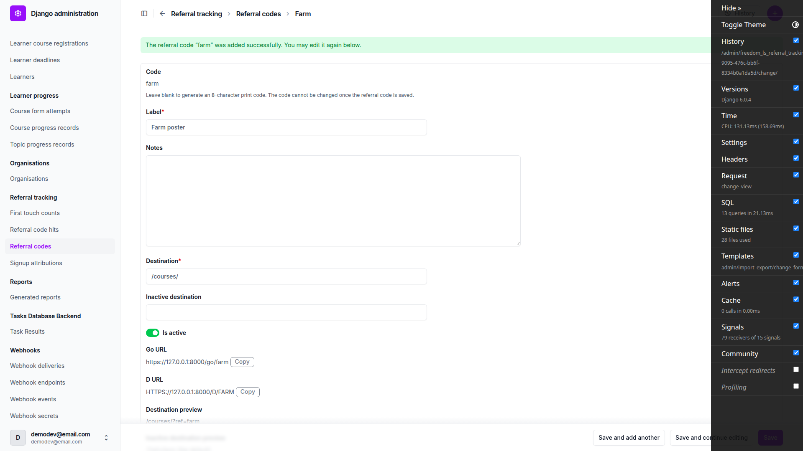 |
| 1.1 | desktop | pass | /go/farm, /GO/FARM, /d/farm and /D/FARM, each in a fresh browser context: a single 302 to /courses/?ref=farm (200). No 301 in the chain. | none |
| 1.2 | desktop | pass | /go/farm/, /GO/FARM/, /d/farm/ and /D/FARM/ each gave a single 302 to /courses/?ref=farm, with no 301 first. /go/farm/?utm_source=poster went to /courses/?utm_source=poster&ref=farm in one 302. | 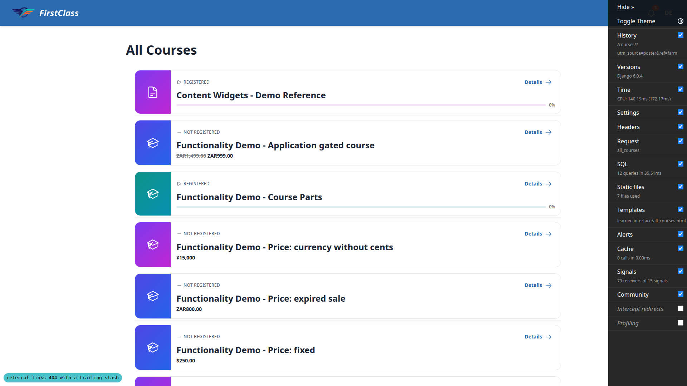 |
| 1.3 | desktop | pass | Changelist shows hit count 9 and a last hit of Oct. 8, 2026, 1:53 p.m. (the current minute). Change form URLs are still slashless. Fresh contexts used a non-headless Chrome UA. A HeadlessChrome UA is correctly treated as a machine fetch and not counted, so the screenshot visit with the headless tab did not inflate the count. | 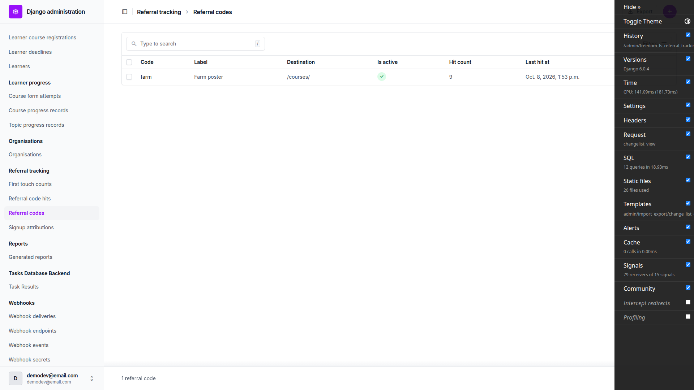 |
| 1.4 | desktop | pass | /go/farm// 404, /go/farm/extra 404 and /go/nope/ 404, all with no redirect. Hit count was still 9 afterwards (second screenshot below). | 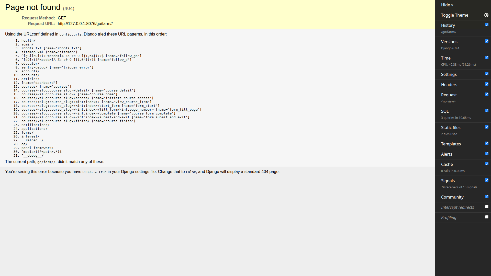 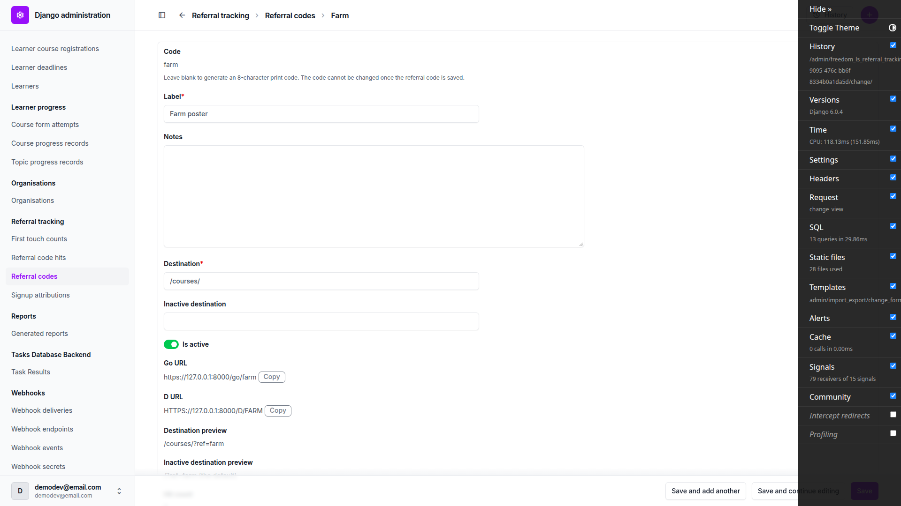 |
| 2.1 | desktop | pass | /robots.txt/ 301 to /robots.txt (robots text rendered). /sitemap.xml/ 301 to /sitemap.xml (XML rendered). /robots.txt/?v=2 301 to /robots.txt?v=2. | 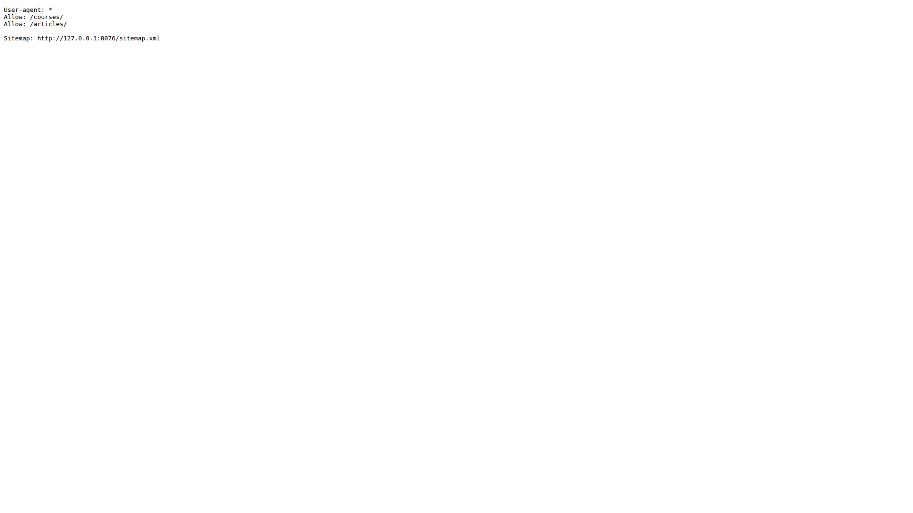 |
| 2.2 | desktop | pass | /courses 301 to /courses/ (course list). /educator 301 to /educator/, then 302 to /accounts/login/?next=/educator/ when signed out. | none |
| 2.3 | desktop | pass | /courses/no-such-course/ signed in: 404 directly, no redirect. /nowhere/ 404. /robots.txt// 404. See general note 4 for the signed-out behaviour. | 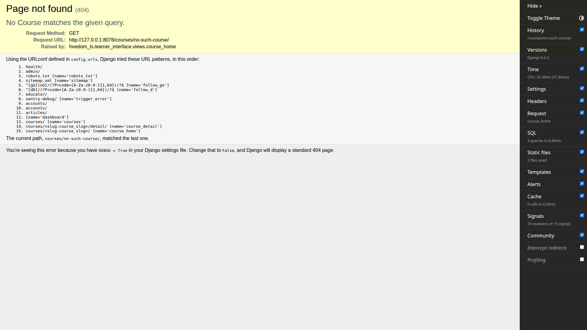 |
| 2.4 | desktop | pass | Quiz course: item 1, then Next (POST 302), then item 2 Mid course Quiz, then Start Form (/2/start_form 302 to /2/fill_form/1 200, the app's own redirect). Course-parts: two Next steps 1 to 2 to 3, each POST 302 plus GET 200. Sign out and sign in via /accounts/login/ worked. /admin/ and the referral code changelist load (second screenshot below). | 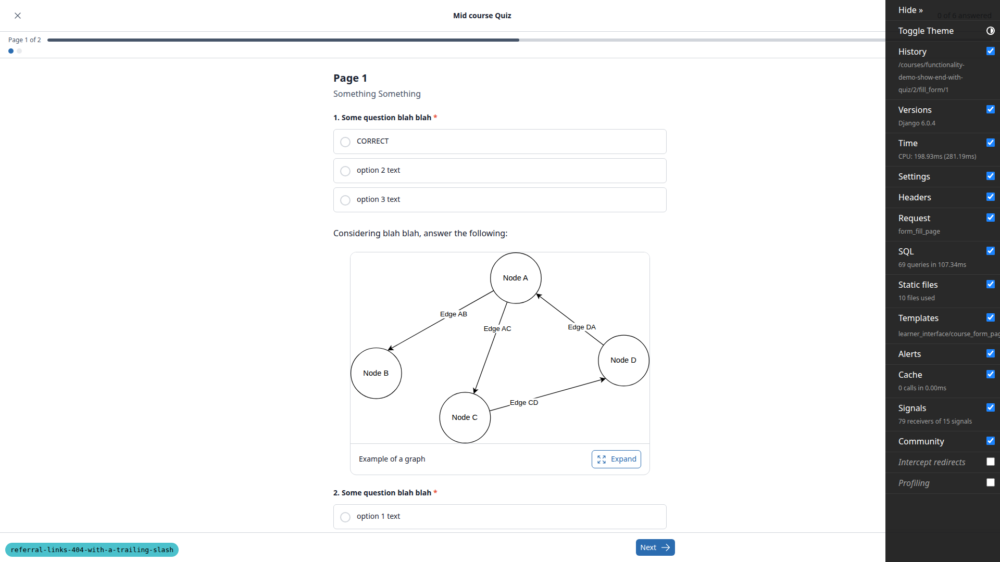 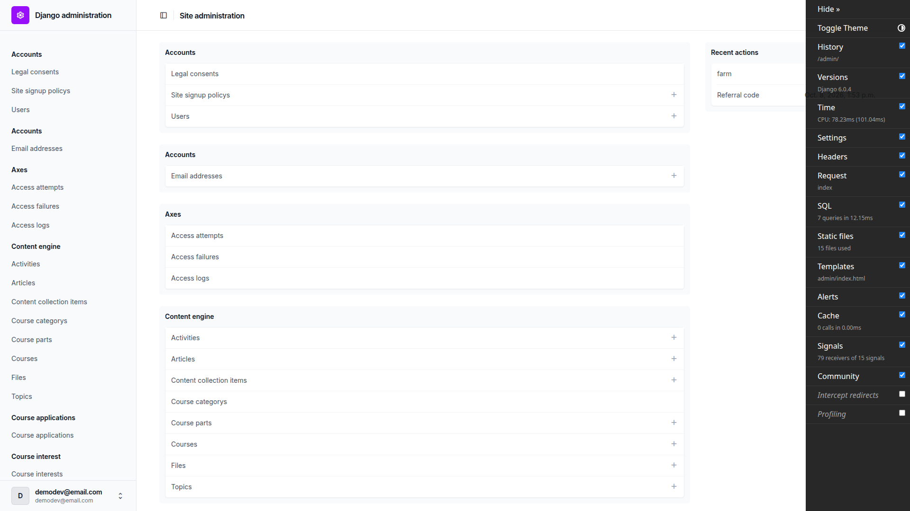 |
| 1.2 | mobile | pass | /go/farm/ lands on /courses/?ref=farm. No horizontal overflow. | 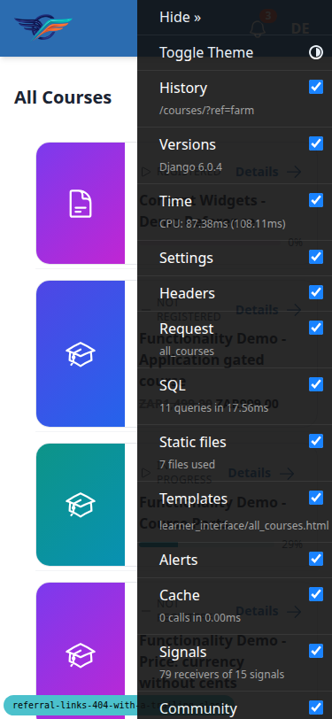 |
| 1.3 | mobile | pass | Admin change form: Go URL and D URL slashless, Copy buttons beside them, hit count 9, fields stack in one column, no overflow. | 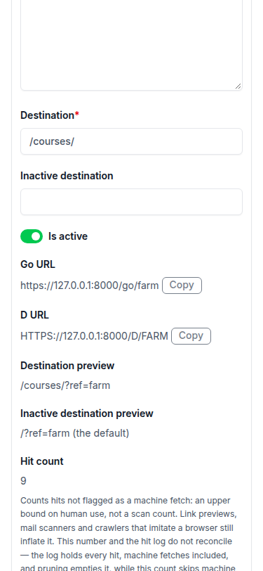 |
| 2.1 | mobile | pass | /robots.txt/ redirects to /robots.txt. | none |
| 1.2 | tablet | pass | /D/FARM/ lands on /courses/?ref=farm. No horizontal overflow. | 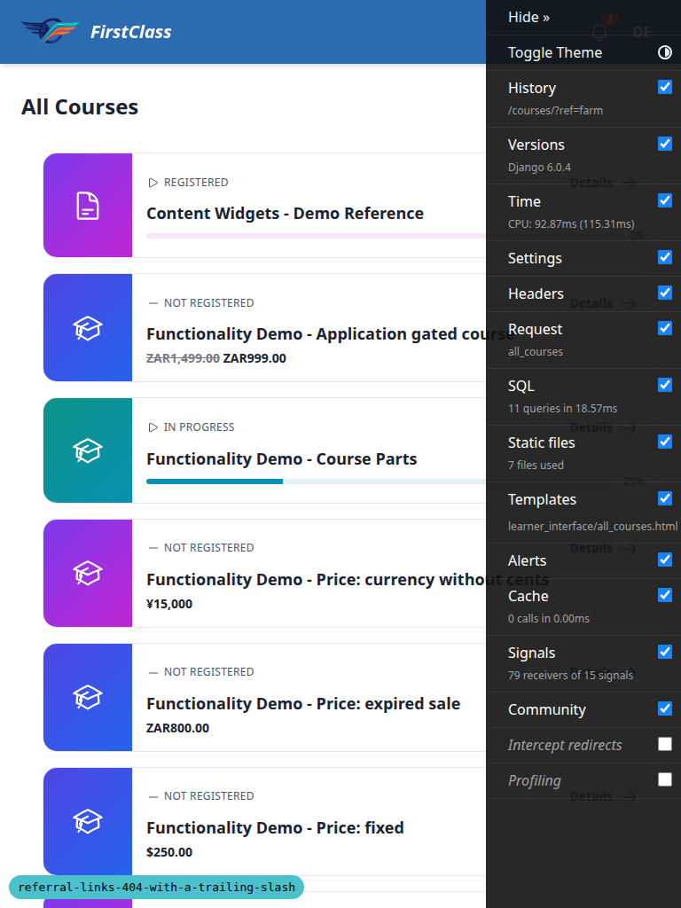 |
| 1.3 | tablet | pass | Referral code changelist renders, hit count 9, no overflow. | 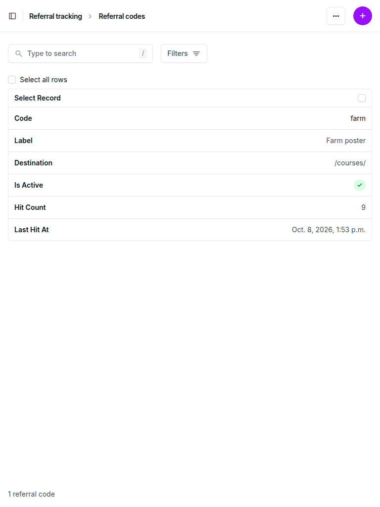 |

## Design check

No design states tested.

## Bugs

No bug records, so there are no per-bug sections.

## Bug status

No bugs found.

## General notes

1. The admin pages log many report-only CSP 'unsafe-eval' violations from unfold's bundled alpine.js. This predates the branch, is unrelated, and nothing is blocked.
2. The django-debug-toolbar overlay intercepts clicks on the admin Save buttons and the learner Next button at 1920x1080. The run submitted those by script or hid the toolbar. This is a dev-only annoyance.
3. A HeadlessChrome user agent counts as a machine fetch, so headless visits are logged but not counted in hit_count. The test plan's expected 9 hits holds only for real-browser user agents, and a future plan should mention this.
4. Signed out, /courses/no-such-course/ redirects to login because the route requires a login. The plan's 404 expectation was confirmed signed in.
5. The admin's copyable URLs use the Site domain (127.0.0.1:8000) and https, not the runserver port. That is expected.

status: ok · reason: report rendered, 0 bugs documented
