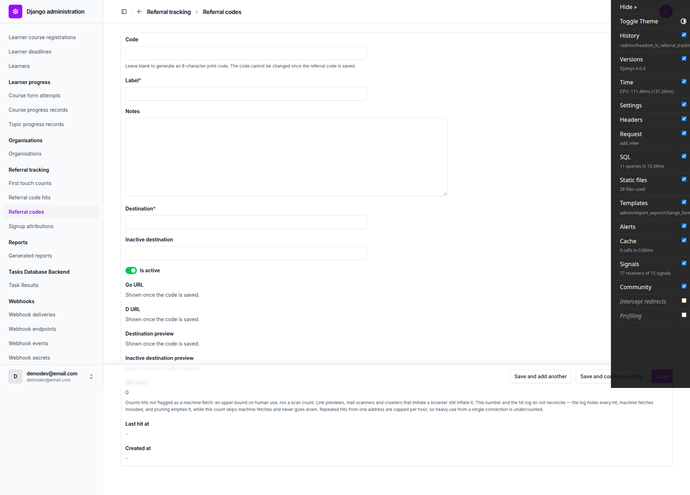
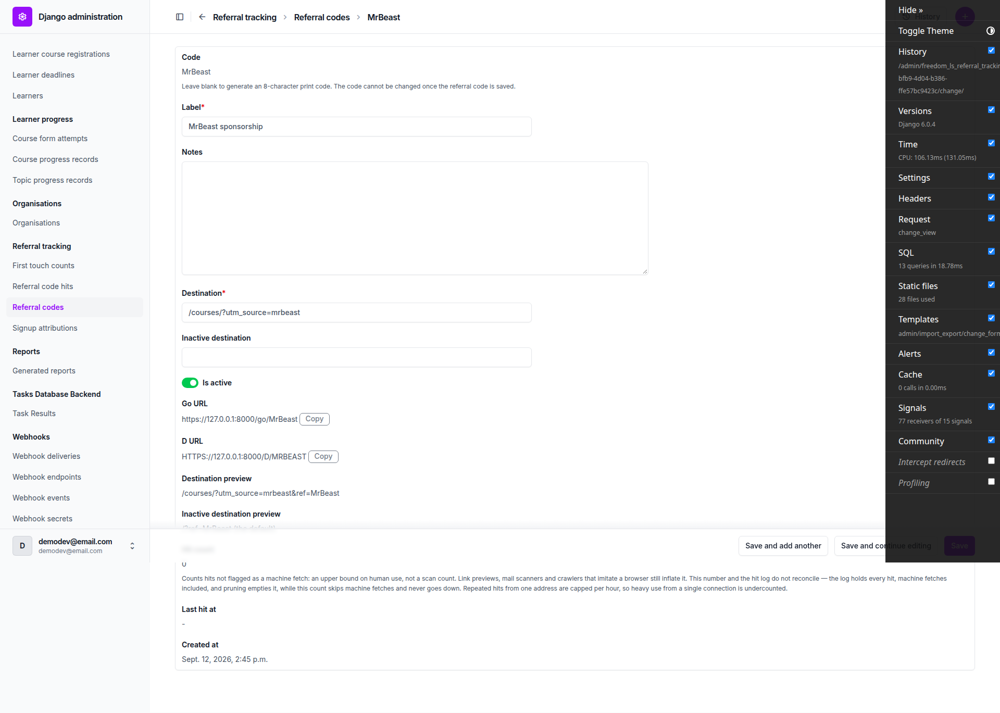
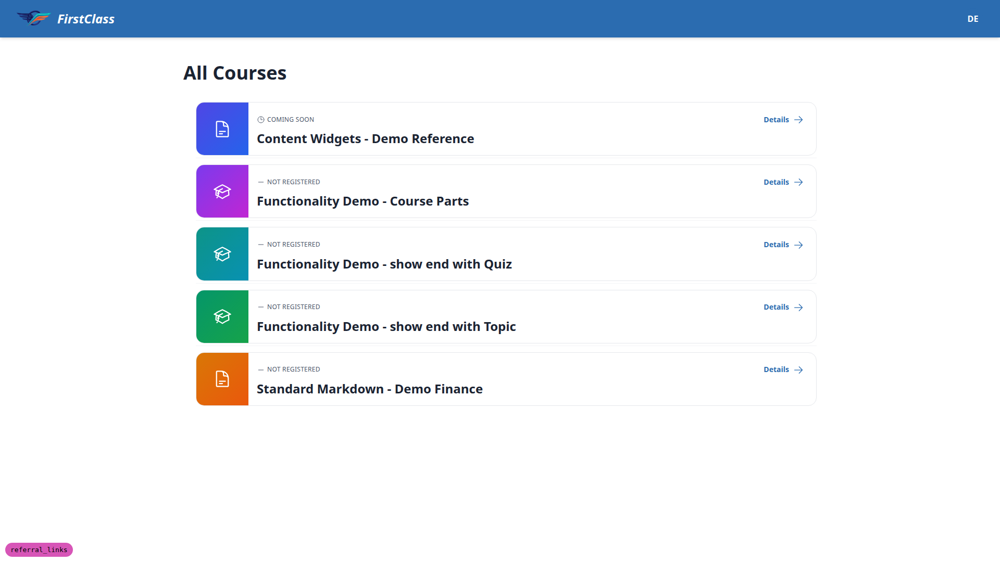
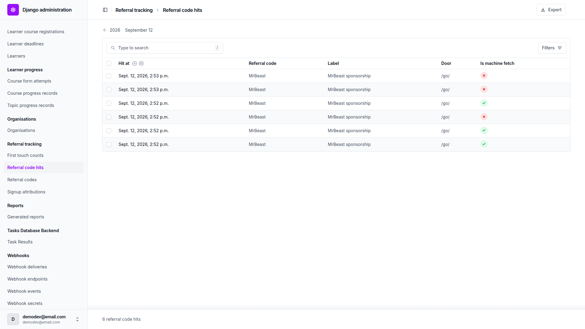
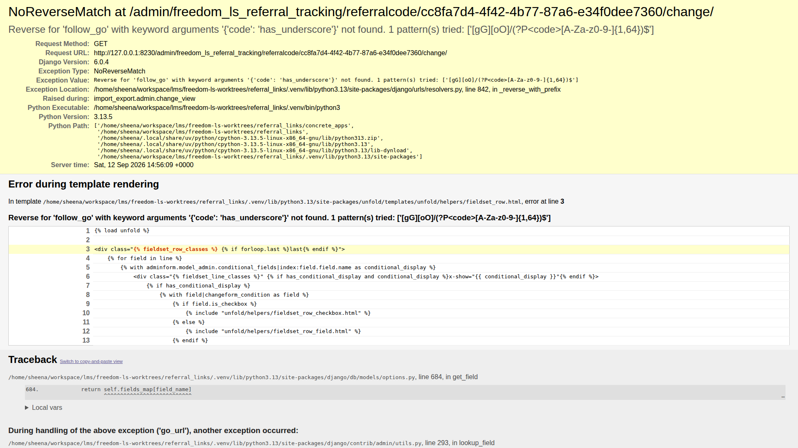
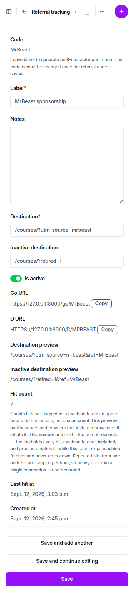
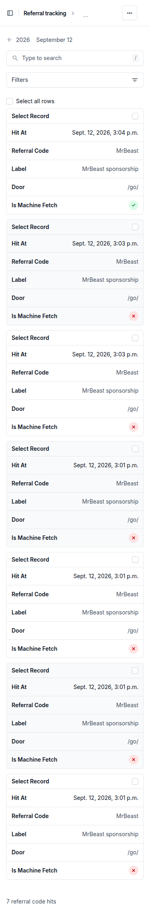
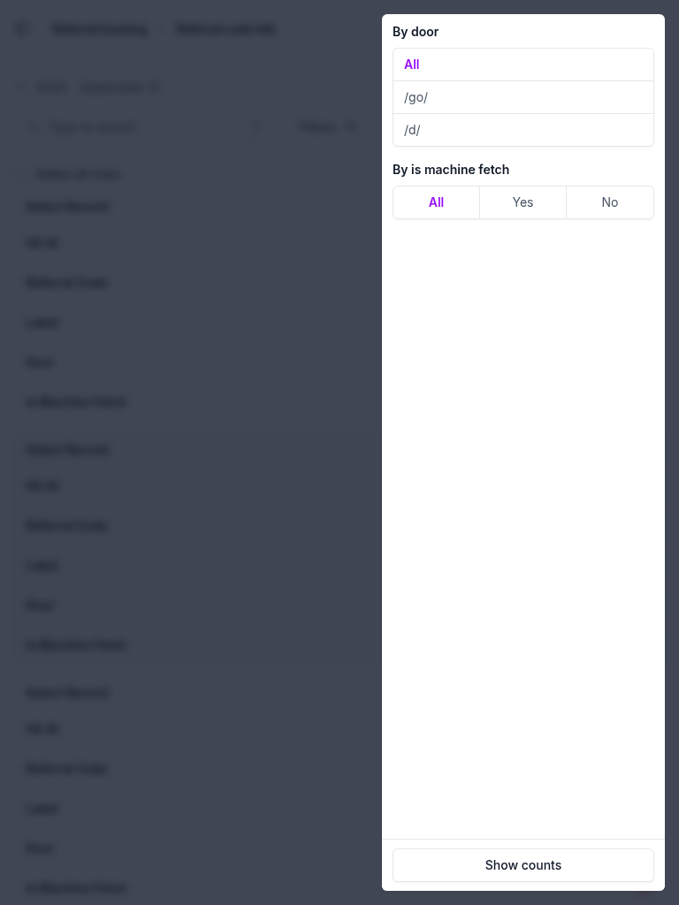

# Frontend QA Report — referral_links

## 1. Methodology

The run drove the real dev site at `http://127.0.0.1:8230/` with Playwright MCP, logged in as the admin user `demodev@email.com`, for all UI-level checks (form rendering, admin changelists, copy-button behaviour, responsive layout). Where the plan required exact HTTP header, status-code or cookie assertions (plan §3 redirect semantics, §5 admin permission refusals), `curl` was used directly against the running server. Database state (hit counts, tally rows, attribution rows) and system checks (`manage.py check`, `prune_referral_code_hits`) were verified with `manage.py`.

Screenshots were collected into `screenshots/` beside this report as the run proceeded; every `screenshot_path` referenced below and in the bug section corresponds to a real file in that directory. The run completed all planned sections and did not abort.

## 2. Diff scoping

The scoping record classifies this run as **FULL**, triggered by changes to `freedom_ls/referral_tracking/static/referral_tracking/css/copy_button.css`, `freedom_ls/referral_tracking/static/referral_tracking/js/copy_button.js`, `freedom_ls/referral_tracking/admin.py`, `freedom_ls/referral_tracking/views.py`, `freedom_ls/referral_tracking/models.py`, `freedom_ls/referral_tracking/middleware.py` and `config/urls.py`. A second scoping record, also FULL, was logged over the same core changed files plus `docs/product/referral-codes.md`, reflecting the documentation touched during the run's own plan corrections (see General notes). Both records report `skipped: nothing`. In line with the FULL classification, nothing was skipped: desktop, mobile and tablet passes all ran in full (see §9 entries `9.narrow-change-form`, `9.mobile-lists`, `9.touch-targets` for mobile, and `9.tablet` for tablet).

## 3. Smoke gate

The smoke gate **passed**. Pages loaded were `http://127.0.0.1:8230/` and `http://127.0.0.1:8230/admin/freedom_ls_referral_tracking/referralcode/`. No failure URL or failure reason was recorded.

## 4. Results by section

### §1 Create a referral code

- **1.1** — Add form offers code/label/notes/destination/inactive_destination/is_active (ticked by default), no site field. The code field's help text names the 8-char generation and immutability. `go_url`, `d_url` and both destination previews read "Shown once the code is saved." `hit_count` reads `0` and `last_hit_at`/`created_at` read `-` rather than the same sentence — accurate, not misleading (see General notes).
  
- **1.2** — MrBeast saved successfully. Changelist row and change form both check out: code becomes read-only text after save, `go_url`/`d_url` are correct (with `d_url` fully uppercase), destination and inactive previews append `ref=MrBeast` correctly, and a Copy button sits beside each URL.
  
- **1.3** — Blank code generated `E3Q1HY00`: 8 chars, uppercase, no I/L/O/U. Inactive preview correctly omits the "(the default)" note when a custom retired URL is used.
- **1.4** — Copy wrote the exact `go` URL to the clipboard; the `aria-live=polite` region announced "Copied"; the two Copy buttons have distinct accessible names; no inline `onclick`, script loaded from the static JS file.
- **1.5** — With `clipboard.writeText` stubbed to reject, the live region read "Could not copy. Select the URL and copy it." with no console/page error — rejection handled gracefully.

### §2 Codes the admin refuses

- **2.1** — Case-only duplicate `mrbeast` refused with "This code is already in use. Choose a different one." Form re-renders, no 500.
- **2.2** — `admin`, `Admin`, `login`, `ACCOUNTS` all refused as reserved, case-insensitively.
- **2.3** — `demodev` refused as the site's own name. `demo-dev` was accepted, but correctly so per the spec's brand guard definition (see General notes) — not a defect.
- **2.4** — `my_code`, `my code`, `code!` refused for character-set violations; `my-code` accepted. The 65-character string is refused server-side; an apparent client-side pass was due to the input's `maxlength=64` truncating the typed value, not a validation gap.
- **2.5** — Open-redirect and path-confusion attempts (`//evil.com`, `/\evil.com`, `https://evil.com`, `courses`, `/a b`) refused on both destination fields; self-referential routes (`/go/MrBeast`, `/d/other`) refused as referral-code routes; a normal path with query and fragment accepted.
- **2.6** — Injecting an unrendered `code` input into the change form and saving had no effect — the code stayed `MrBeast`, confirming the form ignores fields it did not render.

### §3 The redirect

- **3.1** — A single 302 straight to the destination with `ref` appended, no trailing-slash hop. Correct `Cache-Control: private, no-store` and `X-Robots-Tag: noindex` on the redirect, no cookie set there; the landing page sets `fls_attribution` (HttpOnly, SameSite=Lax, 90 days). One `FirstTouchCount` row and one unflagged `ReferralCodeHit` recorded; `hit_count`/`last_hit_at` moved.
  
- **3.2** — Case-insensitive routes (`/GO/MRBEAST`, `/d/mrbeast`, `/D/MRBEAST`) all redirect to the stored-case `ref`, not the typed case. Repeat visits with the cookie already set do not re-tally — first touch is preserved.
- **3.3** — Query-parameter precedence verified: the visitor's own `utm_source` wins over the destination's, blank params survive, a spoofed `ref=hijack` is dropped, and the stored code is appended last.
- **3.4** — Unknown and pattern-invalid codes 404 with no cookie, no hit, no tally row.
- **3.5** — HEAD redirects and writes no hit. POST is refused **403** (not 405 as the plan originally stated — corrected during this run, see General notes). Machine-fetch signals (empty UA, Slackbot UA, `Sec-Purpose: prefetch`) redirect and log a flagged hit without moving counters; a genuine mobile UA writes an unflagged hit and moves both counters.

### §4 Deactivation

- **4.1** — Deactivate action reports the correct affected count, including reporting 0 when re-run on an already-inactive row.
- **4.2** — Deactivated code with blank `inactive_destination` falls back to the setting's default `/`; a hit is still logged and `hit_count` still rises.
- **4.3** — A custom `inactive_destination` is honoured over the setting default, and the preview correctly drops the "(the default)" note.
- **4.4** — Reactivating a code makes it live again without resetting `hit_count`.

### §5 What the admin refuses

- **5.1** — No delete action, no delete link, and a direct GET of the delete URL returns 403.
- **5.2** — `ReferralCodeHit` admin is add-403 and shows the expected read-only columns, filters and search behaviour; the detail view has no editable fields, no save, no delete, and its delete URL returns 403.
  
- **5.3** — Permission gating verified end to end: a no-permission staff user sees neither model and gets 403 on both changelists; granting only view permission on `ReferralCode` renders a read-only changelist and change form with Export present, while `ReferralCodeHit` remains 403.
- **5.4** — **FAIL.** See Bug B1 below.
  

### §6 Attribution carries the code

- **6.1** — Landing via `/go/MrBeast` with an `advert_code` and `utm_source` composes all three into one `FirstTouchCount` key, and a subsequent signup's `SignupAttribution` carries `referral_code`, `advert_code`, `utm_source`, `landing_path` and the raw query string in the plan's stated equivalent order. Neither changelist offers `referral_code` as a sidebar filter (only `utm_*` and `is_overflow`), matching the plan.
- **6.2** — A bare `?ref=anything-at-all` mints the cookie and tallies as free text without any `ReferralCode` lookup or hit write — `ref` alone is tracked but not validated against real codes.
- **6.3** — Export and cross-model columns all show the code text, never a UUID, and the `ReferralCode` export includes every field except `site`.

### §7 The setting and the check

- **7.1** — `REFERRAL_TRACKING_INACTIVE_DESTINATION` set to a protocol-relative or absolute URL fails `manage.py check` with `E001`, naming the setting; a real path passes, and removing the setting entirely also passes.
- **7.2** — With the setting at `/courses/`, a deactivated code with a blank override falls back correctly, and the admin preview matches the redirect and is marked as the default.
- **7.3** — `REFERRAL_TRACKING_HIT_LOG_LIMIT` throttles hit logging to the configured cap without ever refusing the redirect itself; `0` disables the cap entirely.

### §8 Pruning

- **8.1** — `prune_referral_code_hits --older-than-days 30` deletes only aged rows and leaves every code's `hit_count`/`last_hit_at` untouched; `--older-than-days 0` and an omitted option are both refused with the expected usage errors.
- **8.2** — A hit row's page heading, browser tab title and changelist column all name the code text (e.g. "MrBeast via go at 2026-09-12"), never a UUID.

### §9 What else could break

- **9.routes** — Core routes behave as expected for an anonymous visitor; `/go`, `/go/`, `/d`, `/d/` with no code all 404. The plan's `/health/` check was inaccurate (see General notes) — the actual liveness/readiness routes both return 200.
- **9.course-htmx** — Attribution cookie is minted on the listing landing (not the redirect itself), and the course page's HTMX "I'm interested" control fires and swaps content with no page errors.
- **9.login-redirect-mint** — An anonymous request to a login-gated URL with `ref`/`utm_source` still mints the cookie and tallies on the redirect-to-login response itself.
- **9.admin-tally** — A plain GET of `/admin/?utm_source=x` tallies like any other page; the `/go/` redirect route itself never tallies unless followed.
- **9.user-delete** — Deleting a user with an attribution row correctly cascades only `SignupAttribution`; `ReferralCode` and `ReferralCodeHit` are untouched since neither references a user.
- **9.cross-site** — A code created on a second Site is invisible and unreachable (404) from the DemoDev site.
- **9.narrow-change-form** (mobile) — Zero page-level horizontal overflow on the change form at 375×812; both URLs wrap via `overflow-wrap: anywhere`; both Copy buttons render and work. The only element extending past the edge is unfold's own clipped breadcrumb title, not this feature's markup.
  
- **9.mobile-lists** (mobile) — Both changelists and the Add form render with no horizontal overflow at 375px; the filter sidebar collapses behind the nav toggle.
  
- **9.tablet** (tablet) — Both changelists and the change form show zero horizontal overflow at 768×1024; the filter sidebar collapses behind a reachable toggle; Copy still works.
  
- **9.touch-targets** (mobile) — Copy buttons measure 57×24 CSS px, clearing WCAG 2.2 AA minimum but short of the 44×44 comfortable guidance (see General notes) — recorded as an observation, not a defect.

## 5. Bug B1 — Change form 500s for a ReferralCode whose text cannot be reversed into a /go/ URL

**Manifestation:** test `5.4`, desktop viewport.

**Expected:** the change form for a `ReferralCode` written past validation (code `has_underscore`, created directly through `_base_manager`) opens, its label can be edited and saved, and the changelist shows the new label. The plan requires no server error, since `code` is read-only on that form and therefore has no field to attach a validation complaint to.

**Actual:** the change form returns HTTP 500, `NoReverseMatch`: `Reverse for 'follow_go' with keyword arguments '{'code': 'has_underscore'}' not found. 1 pattern(s) tried: ['[gG][oO]/(?P<code>[A-Za-z0-9-]{1,64})$']`. The `go_url`/`d_url` read-only fields call `absolute_code_url`, which reverses the route; `CODE_PATTERN` excludes underscore, so any stored code outside that pattern makes its own change form unreachable. Raised through `freedom_ls/referral_tracking/admin.py` into `codes.py`. Blast radius is limited: the changelist still renders 200 and lists the row, other codes' change forms return 200, and the CSV export succeeds.

## Bug status

| Bug | Title | Status |
|-----|-------|--------|
| B1 | Change form 500s for a ReferralCode whose text cannot be reversed into a /go/ URL | **FIXED** (commit: e7682f4) |

`_copyable_url` in `ReferralCodeAdmin` now catches `NoReverseMatch` and shows "This code
predates the current rules and has no working link." in place of the URL. Re-verified in the
browser after the fix: the `has_underscore` change form opens 200, both URL fields carry that
message, editing its label saved and the changelist shows the new text. Spot-checks confirm no
regression — a normal code still renders `https://127.0.0.1:8000/go/MrBeast` with a working Copy
button, all four changelists return 200, and the Add form still refuses `other_underscore`,
`bad code` and `code!` on the pattern and `admin` as reserved. The fixer's full suite run passed
(4153 passed, 38 deselected).

## 6. General notes

- Two errors in the test plan itself were found, verified against the spec and the implementation, and **corrected in `3. frontend_qa.md` during this run**:
  (a) §3.5 expected a token-less `POST` to `/go/<code>` to return 405. Both the spec and the view's own docstring state that `CsrfViewMiddleware` refuses a token-less POST with **403** before the view's `require_safe` decorator ever runs — 403 is correct and deliberate, and the plan has been corrected to match.
  (b) §9 listed `/health/` as an existing route to probe. That path has never existed on this branch or on main; the health app mounts `/health/liveness/` and `/health/readiness/`, both of which return 200. The plan has been corrected accordingly.
- **§2.3 brand-guard observation:** `demo-dev` is accepted as a code. This matches the spec, which defines the brand guard as `slugify(site.name)` and that same string with hyphens removed. The dev site is named `DemoDev`, so both forms reduce to `demodev` and there is no distinct hyphenated variant to reserve. Under a site named e.g. "Demo Dev", both `demodev` and `demo-dev` would be refused. This is worth flagging only as a brand-impersonation consideration for sites with multi-word names — it is not a defect.
- The `hit_count`/`last_hit_at` columns on the unsaved Add form read `0` and `-` rather than the "Shown once the code is saved." sentence shown for the URL preview fields. This is accurate rather than misleading, since those columns do have real zero/empty values even before save; no action needed.
- Playwright's headless Chromium is itself flagged `is_machine_fetch` because its user agent contains "headless", one of the `GENERIC_TOKENS`. This is correct behaviour on the application's part, but it means any browser-driven hit-counting test must override the UA to a genuine browser string, or the hit will be logged flagged and neither `hit_count` nor `last_hit_at` will move. Worth carrying forward to the next QA run on this feature.
- Copy button touch targets measure 57×24 CSS px. This clears WCAG 2.2 AA Target Size (Minimum) of 24×24 but falls short of the 44×44 comfortable-touch guidance. This is a desktop-first Django admin surface using unfold's own small-button sizing, so it is recorded as an observation rather than a defect.
- Several plan steps assert exact hit counts. Instrumenting these needs care: any extra probe request against `/go/` or `/d/` inflates the counters being asserted on, and the per-IP hourly throttle (`REFERRAL_TRACKING_HIT_LOG_LIMIT`, default 30) persists in the cache across database resets — the cache must be cleared alongside the tables when resetting state between test sections.

---
status: ok
reason: 1 bug — 1 fixed, 0 unresolved; report rendered, 9 screenshots verified
