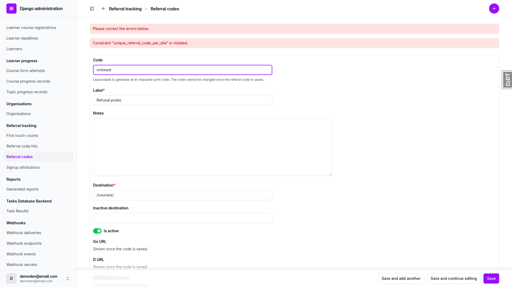
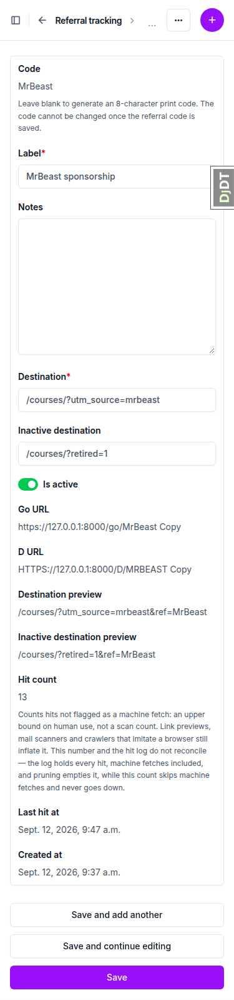
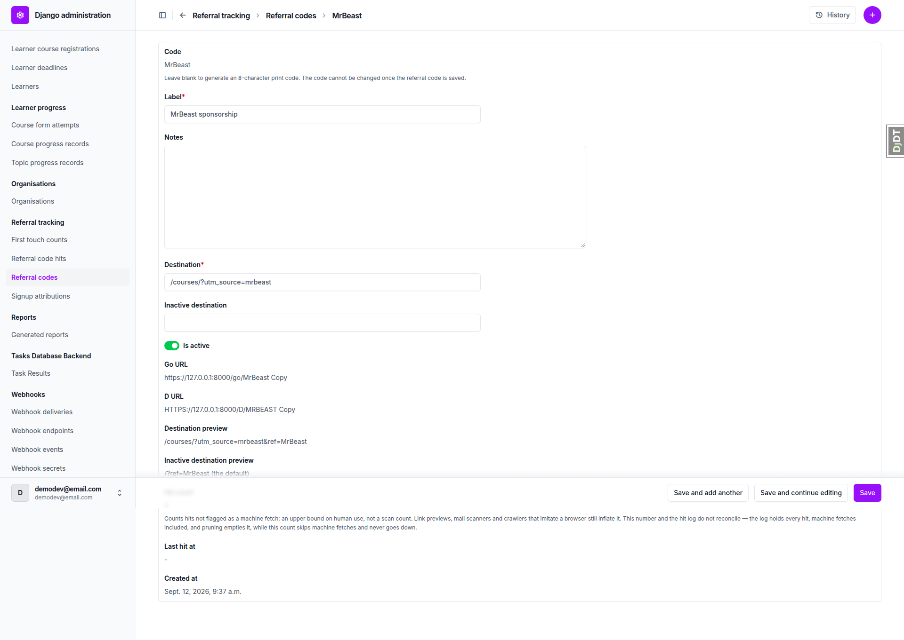
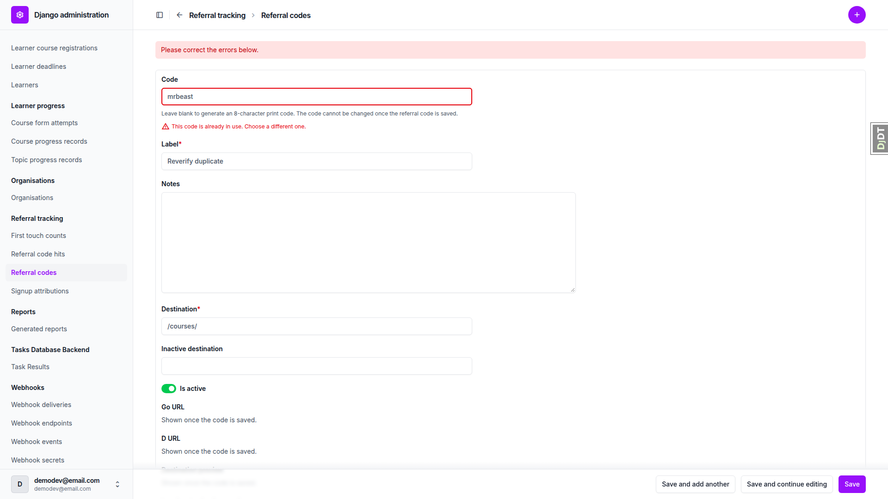

# Frontend QA report: referral codes and the redirects behind them (`referral_links`)

## Verdict

The run covered every section of the test plan (§1 through §9, plus §7's setting/check pair) with
nothing skipped. 34 of 37 test records passed. Three failed, and three bugs were logged from them:
a duplicate referral code surfaces the raw Postgres constraint name (`unique_referral_code_per_site`)
instead of a duplicate-code message (B1); `POST /go/MrBeast` returns 403 from CSRF middleware rather
than the 405 the view's `@require_safe` decorator intends (B2); and the admin's Copy buttons carry no
styling at all, so they read as body text and their 35x20 CSS px hit box sits under the WCAG 2.5.8
24x24 minimum, on desktop, tablet and mobile alike (B3). Everything else held: the redirect routes,
attribution capture, admin permission boundaries, exports, the system check and the prune command all
behaved as specified.

## Methodology

The run drove Playwright MCP against a dev server on `127.0.0.1:8096` for every browser-facing
surface: the admin add/change forms, the changelists, the copy-button interaction, and the three
viewport passes (desktop, 375px mobile, 768px tablet). `curl` was run alongside Playwright wherever
the assertion was about HTTP status, response headers or `Set-Cookie` — this is most of §3, whose own
§3.5 is explicitly a curl matrix (`HEAD`, `POST`, empty/bot/prefetch/mobile user agents against
`/go/MrBeast`). `manage.py shell` was used wherever a test needed an exact row count or counter value
rather than what a page shows — `ReferralCode.hit_count`/`last_hit_at`, `ReferralCodeHit.count()`,
`FirstTouchCount` and `SignupAttribution` rows, and to age a hit before pruning.

Screenshots were collected into `screenshots/` beside this report; every image referenced below
exists at that path. Playwright MCP's output directory also accumulates a per-call accessibility-tree
`.yml` snapshot and a console `.log` file alongside each `.png`; those were set aside outside the repo
before collection so only the PNGs actually referenced by a test or bug record were committed.

## Diff scoping

The scoping record classifies this run as **FULL**, with `skipped: "nothing"` — every section of the
plan ran. The changed-file list includes `freedom_ls/referral_tracking/middleware.py` alongside the
models, views, forms, admin, urls and management command. Middleware runs on every request site-wide
(the plan's own §9 preamble says as much: "the middleware and the URLconf run on every request"), so
a change to it cannot be scoped down to the referral-code screens alone — it can affect any existing
route. That's what pushed the classification to FULL rather than a narrower slice: §9's "what else
could break" checks (existing routes, HTMX interactions, login-gated landings, admin-with-utm,
user deletion, cross-site isolation, the two extra viewports) all had to run, not just the new
`ReferralCode` admin and the `/go/` and `/d/` routes themselves.

## Smoke gate

Pass. Two pages were loaded before the full run started: `http://127.0.0.1:8096/` and
`http://127.0.0.1:8096/admin/freedom_ls_referral_tracking/referralcode/`. Both rendered, so the run
proceeded to the full test list.

## Coverage

| Test | Viewport | Status | Note |
|---|---|---|---|
| **§1 Create a referral code** | | | |
| 1.1 | desktop | pass | Add form fields, help text and read-only previews match the plan. |
| 1.2 | desktop | pass | MrBeast saved; go_url/d_url, Copy buttons, both previews correct. |
| 1.3 | desktop | pass | Blank code generated `2KN23MY4` — 8 chars, no I/L/O/U. |
| 1.4 | desktop | pass | Copy button puts exact go_url on clipboard; live region reads "Copied"; no `onclick` anywhere. |
| **§2 Codes the admin refuses** | | | |
| 2.1 | desktop | **fail** | Case-only duplicate `mrbeast` re-renders with the raw constraint name, not a duplicate-code error. See B1. |
| 2.2 | desktop | pass | `admin`, `Admin`, `login`, `ACCOUNTS` all refused as reserved. |
| 2.3 | desktop | pass | `demodev` refused; `demo-dev` accepted — correct for this site's actual name (see General notes). |
| 2.4 | desktop | pass | `my_code`, `my code`, `code!` refused; 65-char string blocked client-side by `maxlength=64` (see General notes); `my-code` accepted. |
| 2.5 | desktop | pass | All seven bad destinations refused with the path/whitespace/referral-route messages; `/courses/x?a=1#top` accepted; same validator on `inactive_destination`. |
| 2.6 | desktop | pass | Injected `code` input via devtools ignored; row still `MrBeast`. |
| **§3 The redirect** | | | |
| 3.1 | desktop | pass | Single 302, correct cache/robots headers, no cookie on the redirect, cookie set on landing, hit + tally rows correct. |
| 3.2 | desktop | pass | Case-insensitive routes, stored-case `ref`, doors recorded correctly, no new cookie for a returning visitor. |
| 3.3 | desktop | pass | Query-param precedence: visitor's `utm_source` wins, blank `x` survives, `ref=hijack` dropped, stored code appended last. |
| 3.4 | desktop | pass | `/go/nobody` and `/go/my_code` both 404; no side effects. |
| 3.5 | desktop | **fail** | Bot/prefetch/HEAD handling all correct, but `POST` returns 403 (CSRF) not 405. See B2. |
| **§4 Deactivation** | | | |
| 4.1 | desktop | pass | Action reports "Deactivated 1 referral code(s)."; re-run reports 0. |
| 4.2 | desktop | pass | Blank `inactive_destination` falls back to setting's default `/`; hit still written. |
| 4.3 | desktop | pass | Set `inactive_destination` honoured; preview drops the "default" note. |
| 4.4 | desktop | pass | Reactivation restores the live redirect; `hit_count` carries through the cycle unreset. |
| **§5 What the admin refuses** | | | |
| 5.1 | desktop | pass | No delete action, no Delete button, delete URL 403s. |
| 5.2 | desktop | pass | No Add on hit changelist, add URL 403, columns/filters/search/drilldown correct, rows fully read-only, delete URL 403. |
| 5.3 | desktop | pass | No-permission staff user sees neither model and gets 403 on both changelists; view-only grant gives exactly the read-only surface the plan describes. |
| **§6 Attribution carries the code** | | | |
| 6.1 | desktop | pass | `advert_code` and referral code compose in `FirstTouchCount`; `SignupAttribution` row correct; both changelists searchable, neither filterable on `referral_code`. |
| 6.2 | desktop | pass | Bare `?ref=anything-at-all` mints cookie and tally row as free text; no `ReferralCode` lookup, no hit. |
| 6.3 | desktop | pass | All four changelists export correctly; `ReferralCode` export omits `site`; `ReferralCodeHit` export column holds code text, not a UUID. |
| **§7 The setting and the check** | | | |
| 7.1 | desktop | pass | `E001` fires for `//x` and `https://x`, naming the setting; `/courses/` and removing the line both pass. |
| 7.2 | desktop | pass | Setting's default honoured on redirect and in the preview; setting removed afterwards, git clean. |
| **§8 Pruning** | | | |
| 8.1 | desktop | pass | Prunes exactly the aged hit; `hit_count`/`last_hit_at` untouched; `--older-than-days 0` and the missing option both refused with usage errors (exit 2). |
| **§9 What else could break** | | | |
| 9.routes | desktop | pass | All existing routes resolve; `/health/` 404s but never existed as a route (see General notes). |
| 9.course-htmx | desktop | pass | Course page reached via a code renders; HTMX interest toggle works with no reload, no console errors. |
| 9.login-gated-landing | desktop | pass | Anonymous `/educator/?ref=...` gates to login and still mints the cookie and a tally row on the 302 itself. |
| 9.admin-utm | desktop | pass | Admin login/logout with `?utm_source=x` tallies like any GET; redirect routes themselves never tally. |
| 9.user-delete | desktop | pass | Deleting the §6 signup user removes its `SignupAttribution` row only; `ReferralCode`/`ReferralCodeHit` untouched. |
| 9.other-site | desktop | pass | Cross-site code `Other` 404s on DemoDev and is absent from its changelist. |
| 9.mobile-change-form | mobile | **fail** | No horizontal scroll, wrapping and Copy function all correct, but the Copy button itself has no styling and an undersized hit box. See B3. |
| 9.mobile-changelists | mobile | pass | Both changelists collapse to stacked per-record cards at 375px; no sideways scroll. |
| 9.tablet | tablet | pass | No sideways scroll at 768px; nav/filters collapse to mobile chrome because django-unfold's breakpoint is `lg` (1024px) — theme behaviour, not a regression (see General notes). |

## Bug B1: A duplicate referral code shows the raw database constraint name instead of a duplicate-code error

**Manifestations:** 2.1 (desktop)

**Expected:** Saving a code that already exists on the site — a case-only duplicate such as
`mrbeast` against `MrBeast`, or an exact repeat — re-renders the add form with an error attached to
the `code` field saying the code is already taken.

**Actual:** The form re-renders (no 500, no raw `IntegrityError`), but the only error shown is a
non-field error reading: `Constraint "unique_referral_code_per_site" is violated.` Nothing is
attached to the `code` field and nothing tells the builder the code is a duplicate. An exact repeat
(`MrBeast` against `MrBeast`) produces the identical raw-constraint-name message. `ReferralCodeForm`
has no duplicate check of its own; `ConstraintValidationFormMixin` converts the constraint violation
into a form error but surfaces Django's default message, which carries the database constraint name
verbatim. `codes.py` already has a case-insensitive `lookup_referral_code()` the form could call to
produce a proper field-level error instead.

## Bug B2: POST to a referral redirect route returns 403 (CSRF) rather than the 405 the view intends

**Manifestations:** 3.5 (desktop)

No screenshot (curl-only assertion).

**Expected:** `POST /go/MrBeast` returns 405 Method Not Allowed — `follow_referral_code` is decorated
`@require_safe`, which answers anything that is not GET or HEAD with a 405.

**Actual:** `POST /go/MrBeast` returns 403 with the site's "The form was not sent" CSRF failure page.
`CsrfViewMiddleware` rejects the unauthenticated, token-less POST before the view runs, so
`@require_safe` never gets a chance to answer. `POST` to a code that does not exist is likewise 403
rather than 404. The route is still refused and still writes no hit — hit count, `hits.count()` and
the tally are unaffected — so nothing leaks and no counter moves; only the status code is wrong.
The obvious fix (`csrf_exempt` on a public route) is a security-posture call, so this is left for a
human rather than patched here.

## Bug B3: The admin Copy buttons carry no styling — they read as body text and their hit box is below the minimum target size

**Manifestations:** 9.mobile-change-form (mobile), 1.2 (desktop)

**Expected:** The Copy button beside `go_url` and `d_url` on the `ReferralCode` change form looks
like a control and is large enough to tap — at least 24x24 CSS px, per WCAG 2.5.8 Target Size
(Minimum).

**Actual:** The button has computed `padding: 0`, no border, no background and no `min-height`, so it
renders as the bare word "Copy" immediately after the URL text: the Go URL row reads
`https://127.0.0.1:8000/go/MrBeast Copy`, which a builder scans as part of the URL rather than as a
button. Its box measures 35x20 CSS px — 4px under the 24px WCAG minimum on height. This is identical
at 1920, 768 and 375px wide. The button works correctly at every width — it copies the exact URL and
announces "Copied" via the live region — so this is an affordance and target-size defect, not a
functional one. Choosing how it should look is a UX decision, so it is left for a human.

## Bug status

- **FIXED** (commit: cff3cc12) — A duplicate referral code shows the raw database constraint name instead of a duplicate-code error
- **UNRESOLVED** — POST to a referral redirect route returns 403 (CSRF) rather than the 405 the view intends (reason: the fix is `csrf_exempt` on a public route, a security-posture call for a human)
- **UNRESOLVED** — The admin Copy buttons carry no styling: they read as body text and their hit box is below the minimum target size (reason: how the button should look is a UX decision)

B1 was fixed by adding `ReferralCodeForm.clean_code()`, which uses the existing case-insensitive
`codes.lookup_referral_code()` and raises a field error before `validate_unique()` can attach the
constraint's own message. The `unique_referral_code_per_site` constraint is untouched and no
migration was created. The full suite passed (4129 passed, 38 deselected).

Re-verified in the browser against the reloaded server: saving `mrbeast` against the existing
`MrBeast` now puts "This code is already in use. Choose a different one." on the `code` field, and
the string `unique_referral_code_per_site` appears nowhere on the page. The two neighbouring save
paths were spot-checked and still work: a blank code still generates one (`6EG8R7X6`), and the
change form still saves.

## General notes

- The plan's §9 route check lists `/health/`, which 404s — but that route never existed. Only
  `/health/liveness/` and `/health/readiness/` are defined in `freedom_ls/health/urls.py`, and both
  return 200. The `config/urls.py` diff only appends the referral include, so nothing is shadowed by
  this branch; the `/health/` line is a plan slip, not a regression.
- The plan's §2.3 "with and without the hyphen" case assumes a two-word site name. This site is named
  `DemoDev`, which `slugify`s to `demodev` (no hyphen), so `codes.py`'s reserved set is
  `{"demodev"}` only. `demodev` was correctly refused as reserved; `demo-dev` was correctly accepted,
  matching the plan's own instruction to "adjust to the site's actual name if it differs." Not a
  defect.
- The plan's §2.4 65-character code could not be submitted at all: the `code` input carries
  `maxlength="64"`, so the browser truncates it to 64 characters before it ever reaches the server,
  and that (valid, truncated) code saves. `CODE_PATTERN` is `{1,64}` server-side, so a 65-character
  value posted directly (bypassing the HTML attribute) would still be refused, but the browser path
  never exercises that check.
- `ReferralCodeHit.__str__` renders the referral code's UUID rather than its code text, so the hit
  change page's heading and browser title read as a raw UUID instead of something like `MrBeast /go/
  hit`. Every other surface (changelist rows, search, CSV export) correctly shows the code text —
  this is specific to the model's string representation.
- django-unfold's responsive breakpoint for the collapsible nav sidebar and the filter panel is `lg`
  (1024px), not a typical tablet breakpoint. At 768px (9.tablet) the admin gets the mobile chrome —
  nav behind a panel toggle, filters behind a "Filters" button — and both changelists keep the
  stacked per-record card layout rather than a table, which makes the 16-row hit log tall to scan on
  a tablet. This is the theme's own breakpoint choice, unchanged by this branch.
- The run left test data behind on the database: three `ReferralCode` rows on DemoDev (`MrBeast`,
  the blank-code-generated `2KN23MY4`, and `my-code`), a second `Site` `other-site.test` carrying a
  code `Other`, and a staff probe user `qa-staff-noperms@email.com` with no permissions. Noted as an
  observation, not as a cleanup task.

status: ok · reason: 3 bugs — 1 fixed (cff3cc12), 2 unresolved and left for a human; report rendered, screenshots verified
