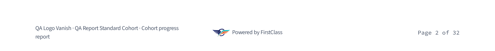
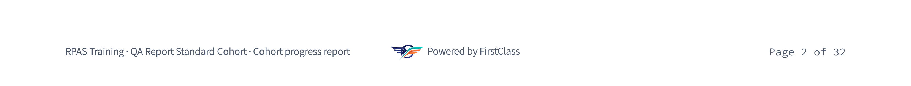
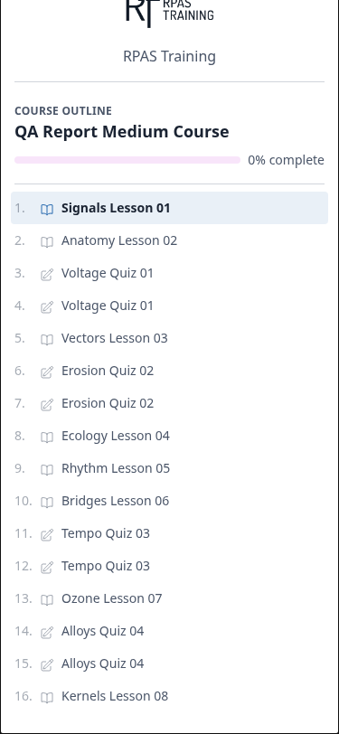

# Frontend QA report: Reports rendered with the organisation's brand

Branch: `report-rendered-with-org-name`
Test plan under test: `3. frontend_qa.md`

## Methodology

The artefact under test is a **PDF**, not a web page. The browser work consisted of the Django
admin flow that generates and downloads the report (logging in, seeding organisations, submitting
"Generate cohort report", polling the changelist for `Ready`, clicking Download); the actual
assertions were made by opening the resulting PDF and inspecting it — by eye, and, where possible,
objectively with command-line tools (`pdfinfo`, `pdfimages -list`, text search) rather than visual
judgement alone. Two of the eight tests (the R1–R4 responsive checks) test an on-screen HTML partial
directly (`course_organisation_chip.html` in the learner course-outline drawer) rather than the PDF,
and were checked in-browser with Playwright.

Two kinds of screenshot were collected, both under `screenshots/` beside this report:

- PDF page renders produced with `pdftoppm`, named like `t1-rpas-cover-01.png` or
  `t6.1-vanish-footer-p2-400dpi-02.png` (the `400dpi` ones are zoomed crops used to check
  fine detail such as glyph shape or mark cropping).
- Browser viewport screenshots from Playwright MCP, named like
  `page-2026-08-25T11-38-36-330Z.png`, used for the R1–R4 checks.

Every screenshot referenced below has been confirmed to exist in `screenshots/`.

The dev server ran on port 8116 against this worktree's database, seeded by the
`fls-dev:qa-data-helper` agent. The branch badge was confirmed correct on the dashboard before
testing began.

Nothing aborted during the run — no smoke-gate failure, no compression failure (compression ran
clean, exit 0, nothing oversized) — so every step in the plan executed, including all three
viewport passes.

## Diff scoping

Classed **FULL**. The changed-file set includes template files (`report.html`, `title_page.html`,
`course_organisation_chip.html`, `course_toc_header.html`) and a stylesheet (`print.css`), which
is enough on its own to require the full pass under this project's scoping rules. Nothing was
skipped: desktop, mobile and tablet passes all ran, including the three responsive checks (R2, R3)
against the organisation chip and the general mobile course-page check (R4).

## Smoke gate

Passed. Two pages checked: the dashboard (`http://127.0.0.1:8116/`, branch badge correct) and the
`GeneratedReport` admin changelist (`http://127.0.0.1:8116/admin/freedom_ls_reports/generatedreport/`,
200). No failure URL, no failure reason.

## Results by test

### Test 1 — RPAS Training, the golden path (all sub-checks pass)

- **1.1 Cover** — pass. Logo top-left, whole and uncropped, bound by width; accent rule under the
  brand block aligned left; organisation name not repeated beside the logo; the metadata
  `ORGANISATION` row shows the full name `RPAS Training`; the site's own name appears nowhere on
  the cover except the band. (`t1-rpas-cover-01.png`)
- **1.2 Band** — pass, and settled objectively rather than by eye: `pdfimages` shows page 1
  embeds the 1512x737 asset, which is `first_class_logo_on_dark.png` — the reversed mark, correctly
  used on the band. Whole and undistorted, about 7.6mm tall, clear of both band edges. The two-tier
  lockup reads correctly: "Powered by" smaller and lighter, "FirstClass" larger and bold.
  (`t1-rpas-band-400dpi-01.png`)
- **1.3 "Powered by" appears once on the cover** — pass, and this is the plan's stated trap. Text
  search: "Powered" occurs exactly once on page 1 (band only), and 32 times across 32 pages —
  one per page. `@page :first { @bottom-center { content: none } }` correctly clears the cover's
  bottom-centre box.
- **1.4 Interior footer (page 2)** — pass, in full. Left box reads `RPAS Training · QA Report
  Standard Cohort · Cohort progress report` on **one line** — this organisation's name is 13
  characters, which is just inside the budget, so Test 1's own one-line requirement is met. (It is
  the *next* character that breaks it: see bug B1, which this test does not itself trip.) Centre box embeds the 512x248
  asset — confirmed by `pdfimages` to be `first_class_logo.png`, the full-colour variant, correctly
  used on white paper — plus "Powered by FirstClass" on one line, mark about 3.8mm tall and on the
  text's baseline. Right box reads "Page 2 of 32". No box collides with another.
  (`t1-rpas-footer-p2-400dpi-02.png`)
- **1.5 Landscape pages** — pass. Pages 5 and 6 (841.89x595.276) both carry the full footer row:
  identity, "Powered by FirstClass", page number.
- **1.6 Document properties** — pass. `pdfinfo`: Author = `RPAS Training` (one name, no
  `"RPAS Training, DemoDev"` doubling), Creator = `FirstClass`, Title =
  `QA Report Standard Cohort — Cohort progress report`, Producer = WeasyPrint 69.0.
- **1.7 Download filename** — pass. `Content-Disposition: attachment;
  filename="rpas-training-qa-report-standard-cohort-progress-report.pdf"` — organisation first.

### Test 2 — Northside, no logo (wordmark fallback)

Pass. (`t2-northside-cover-01.png`) The top-left slot holds the organisation name set large in the
deployment's primary blue — no monogram/initials badge, no broken-image icon, no empty box, no alt
text; the cover reads as finished. Band, footer, metadata, Author (`Northside`) and filename
(`northside-qa-report-standard-cohort-progress-report.pdf`) all match Test 1's pattern.

### Test 3 — The house organisation (attribution suppressed)

Pass. "Powered" has zero hits across all 43 pages, and `pdfimages -list` reports no images at all
in the whole document — no platform mark anywhere, matching the plan's expectation for an org with
no logo of its own. The coloured band at the foot of the cover is still drawn, solid and
full-width, just empty. Footer identity line is intact (`DemoDev · QA Report Standard Cohort ·
Cohort progress report`) and "Page 2 of 43" is unshifted by the empty centre box.
(`t3-house-cover-01.png`)

### Test 4 — Very long organisation name

- **4.1 Cover, 147-char name** — pass. Condensed size class measured directly: 3.56mm cap-ink
  versus 6.10mm for the 40-character name in 4.2. Wraps to exactly 3 lines and ends in a single
  U+2026 (verified byte-level: 1 occurrence of the ellipsis glyph, 0 literal `...`). Measured ink
  span 22.1mm–90.9mm from the page left = 68.8mm slot width, inside the ~70mm budget. No overlap
  with the accent rule, overline or cover title; cover body not pushed down.
  (`t4-long150-brandblock-01.png`)
- **4.2 Size-class boundary** — pass. Lakeside (40 chars) renders at full size (6.10mm first-line
  ink, the largest measured of the set); Riverbend (45 chars) renders condensed (4.40mm), 2 lines,
  no overflow. Neither overflows its slot at its size. (`t4-med45-brandblock-01.png`)
- **4.3 Footer, 147-char name** — pass on the plan's own terms, since it grants two lines as the
  tolerance for this case specifically. Organisation truncated to `The Northern Federation of Co…`
  with the same single U+2026; identity line runs to 2 lines. Centre box still holds mark plus
  "Powered by FirstClass" on one line, with no collision with the centre box or the content above.
  (`t4-long150-footer-p2-400dpi-02.png`)

### Test 5 — Non-Latin organisation name

Pass. `Восточно-Европейская Академия Непрерывного Образования` renders as legible Cyrillic on the
cover, no missing-glyph boxes, in the plainer bundled fallback face — expected per the plan.
Footer shows it truncated with a single U+2026, also as real text. The download filename preserves
the script via RFC 5987 (`filename*=utf-8''%D0%B2%D0%BE%D1%81...`), decoding to
`восточно-европейская-академия-непрерывного-образования-qa-report-standard-cohort-progress-report.pdf`.
(`t5-cyrillic-brandblock-01.png`)

### Test 6 — Things that could break sideways

- **6.1 Logo vanished from storage** — pass. DB row points at a `.webp` absent from disk. Report
  still reaches `Ready`, not `Failed`. Cover falls back to the wordmark: page 1 embeds only the
  1512x737 band mark, no organisation image. (`t6.1-vanish-cover-01.png`)
- **6.2 File that is not really an image** — pass. Logo field points at an ASCII text file named
  `.png`. Report reaches `Ready`, cover falls back to the wordmark (page 1 embeds only the
  1512x737 band mark). No garbage embedded, no broken-image box. (`t6.2-bad-cover-01.png`)
- **6.3 Admin upload validation** — pass. SVG renamed `.png` → "File is not a readable image. Use
  PNG, JPEG or WebP." A 5.6MB PNG → "Image file is too large (5.6MB; maximum is 2MB)." A 48x24 PNG
  → "Image is too small (48x24px; minimum is 64x32px)." All three rejected at the form; none
  reached a report.
- **6.4 Old report not retroactively rebranded** — pass. After renaming `RPAS Training` to
  `Riverdale Flight School`, the pre-rename report is frozen: Author still `RPAS Training`, cover
  `ORGANISATION` row still `RPAS Training`, page-2 footer still `RPAS Training · ...`, file mtime
  unchanged. A newly generated report for the same cohort carries the new name and still embeds
  the logo. Both behaviours correct. Name restored afterwards. (See the download-filename
  observation in General notes below — the plan's own assertion here is unaffected.)
- **6.5 Markup/quotes in the name** — pass. `Acme & Sons <b>Ltd</b> "Trading"` renders literally on
  the cover — `<b>`/`</b>` visible as text, ampersand and quotes intact, no bold applied, no
  missing characters. `pdfinfo` Author carries the name literally. Footer truncates it with U+2026.
  No styling elsewhere in the document was disturbed, so the name did not reach the stylesheet.
  The admin changelist also escapes it correctly. (`t6.5-markup-brandblock-01.png`)
- **6.6 Punctuation-only name** — pass. `---` downloads fine (HTTP 200), no 500. Filename is
  `-qa-report-standard-cohort-progress-report.pdf` (`slugify('---')` is empty, so the name leads
  with a bare hyphen) — the plan calls this shape "ugly but valid". Footer reads
  `--- · QA Report Standard Cohort · Cohort progress report`. (`t6.6-punct-cover-01.png`)
- **6.7 Download permissions unchanged** — pass. Logged in as
  `qa-report-restricted@email.com`: downloading the permitted cohort's report returns HTTP 200 with
  the organisation-named `Content-Disposition`; downloading a different cohort's report returns
  HTTP 403. The filename change did not widen who can download what.
- **6.8 Non-Ready report download** — pass. Hitting the download URL of a non-Ready report returns
  404 with no traceback and no broken file, verified against a report caught `RUNNING` mid-
  generation and against two pre-existing `FAILED` reports. The changelist also renders no
  Download link for non-Ready rows.
- **6.9 Repeat generation** — pass. Two Generate submissions fired concurrently for the same
  cohort: the second returns "A report for this cohort is already being generated." Exactly one
  new row was created.
- **6.10 Cohort with no learners** — pass. `QA Report Empty Cohort` under RPAS Training produces a
  7-page report; the cover still carries the RPAS logo (1324x609 embedded on page 1) and the
  reversed platform mark on the band (1512x737). Branding is not lost with the content. Footer
  reads `RPAS Training · QA Report Empty Cohort · Cohort progress report`.
  (`t6.10-empty-cover-1.png`)
- **6.11 Dark logo vanished from storage** — pass. `QA Dual Logo`'s `*-on-dark.png` moved off disk;
  report still reaches `Ready`, no traceback. The cover brand slot renders byte-identical to the
  run with the dark file present (md5 match on a 300dpi crop), so the light logo is unchanged and
  the missing dark file is completely invisible. File restored afterwards.
  (`t6.11-darkgone-cover-01.png`)

### Test 7 — Both logo variants (QA Dual Logo)

- **7.1 Cover** — pass. Cover top-left slot holds the light (full-colour) variant — navy left wing
  on white — while the band below carries the reversed variant — pale left wing on blue. The two
  are visibly different in the one render, confirming the dark variant does not leak into the
  organisation's cover slot. Band, footer, metadata and filename all match Test 1.
  (`t7-dual-cover-01.png`)
- **7.2 Files on disk** — pass. `media/organisations/` holds two genuinely distinct files for
  QA Dual Logo: `cd09ec82-....png` (201093 B) and `cd09ec82-....-on-dark.png` (171022 B), different
  md5s, dark one suffixed `-on-dark`. Neither overwrote the other.
- **7.3 Admin form fields** — pass. Exactly two upload fields: "Logo (for light backgrounds)" —
  help "The full-colour mark, for white and near-white surfaces. Used on the report cover and
  anywhere the organisation appears on screen." — and "Logo (for dark backgrounds)" — help "The
  reversed mark, for surfaces painted in a strong colour. Optional — a surface with no dark variant
  to reach for falls back to the organisation's name." Each has a Clear checkbox.
- **7.4 Dark-field validation** — pass. A text file renamed `.png` uploaded into the dark field is
  rejected with the same message the light field gives: "File is not a readable image. Use PNG,
  JPEG or WebP." Same validators on both fields.
- **7.5 Clear the dark field** — pass. Ticking Clear on the dark field saves successfully
  ("The organisation 'QA Dual Logo' was changed successfully."). The organisation keeps its light
  logo — the new report's cover brand slot is byte-identical to the pre-clear render — and the
  report still generates to `Ready`.

### Test 8 — Platform mark not configured

- **8.1 Neither mark configured** — pass. With both settings commented out, the report reaches
  `Ready`. The whole document embeds exactly one image — the organisation's own logo on page 1 —
  so no platform mark appears anywhere. The band reads "Powered by FirstClass" as text alone in
  the two-tier treatment, starting at the normal left inset with no gap and no broken-image box.
  Interior footers likewise read text alone. Looks unremarkable, as intended.
  (`t8-1-noMarks-band-01.png`)
- **8.2 Only the light mark configured** — pass, and settled decisively by `pdfimages` rather than
  by eye: with only `HEADER_LOGO_ON_DARK_STATIC_PATH` commented out, page 1 embeds only the
  1324x609 organisation logo — the band embeds no image at all, so it did **not** fall back to the
  full-colour mark. Page 2 embeds the 512x248 full-colour mark in the footer. This is exactly the
  asymmetry the two separate settings exist to produce. (`t8-2-lightonly-band-01.png`)
- **8.3 A mark that does not resolve** — pass. `HEADER_LOGO_STATIC_PATH` pointed at
  `images/nope.png`: the report goes to `Failed`, and its error message names the path: "Static
  asset 'images/nope.png' could not be resolved through the staticfiles finders. Run `npm run
  tailwind_build` if this is the compiled Tailwind bundle; otherwise check the path against the
  setting that names it." Setting restored; the next report reached `Ready`.
  `config/settings_dev.py` restored byte-exact (empty git diff).

### R1–R4 — Responsive checks on the organisation chip

These test `course_organisation_chip.html` and `course_toc_header.html` directly in-browser
(this diff's only non-PDF surface), rather than the generated PDF.

- **R1 — desktop (1920x1080)** — pass. As learner
  `qa-report-std-rpas-training-01@email.com` on QA Report Medium Course, the chip renders in the
  TOC sidebar with the RPAS Training logo contained on its own surface fill, name as text beneath,
  no monogram. Rect measured at 272x113, positioned at x=56, y=100. No overflow.
  (`page-2026-08-25T11-35-16-809Z.png`)
- **R2 — mobile (375x812)** — **fail**, filed as bug B2 below. The TOC becomes a dialog drawer;
  with the chip present, the dialog computes to `position: fixed; top: -50px` with height 862
  against an 812 viewport, clipping the top 14px of the logo, and there is no inner scroll to
  recover it (`side-panel-body scrollHeight == clientHeight == 862`).
  (`page-2026-08-25T11-38-36-330Z.png`)
- **R3 — tablet (768x1024)** — pass. Still uses the drawer, not the desktop sidebar. Dialog sits
  at `top:162px`, height 862, within the 1024 viewport; chip fully visible with the logo top at
  y=198. No horizontal overflow. The mobile clipping does not reproduce here because the viewport
  is tall enough.
- **R4 — course-page mobile (375x812)** — pass. No horizontal overflow (`scrollWidth ==
  clientWidth == 375`), breadcrumb truncates cleanly, progress bar, title, body and Next button all
  readable and correctly sized. The "Open course outline" toggle is a 44px-plus touch target.
  (`page-2026-08-25T11-36-05-340Z.png`)

## Bug B1: Interior-page footer identity line wraps to two lines for organisation names of 14 characters or more

**Manifestations** (organisations whose footer identity line wraps):
- 6.1 — `QA Logo Vanish`, 14 characters (desktop) — the clearest case: a short, untruncated name that
  still wraps
- 4.2-sizeclass — `Lakeside College of Health Sciences Inc.` and
  `Riverbend Institute of Applied Technology Ltd` (desktop)
- 5 — `Восточно-Европейская Академия Непрерывного Образования` (desktop)
- 6.5 — `Acme & Sons <b>Ltd</b> "Trading"` (desktop)

**Not affected:** Test 1 (`RPAS Training`, 13 chars), Test 2 (`Northside`, 9), Test 7
(`QA Dual Logo`, 12), Test 6.6 (`---`, 3) and Test 3 (`DemoDev`, 7 — and its centre box is empty
anyway) all keep the identity line on one line. Test 4's 147-character name also wraps but is
explicitly granted that tolerance by the plan, so it is not counted as a manifestation here.

**Screenshots:**

The wrapping case — `QA Logo Vanish`, 14 characters, "report" orphaned onto a second line:

The passing control — `RPAS Training`, 13 characters, all on one line:

**Expected:** Test 1 states the bottom-left identity line stays on one line, and that a wrap here
is a regression rather than a tolerance, because the platform mark took width from that box. Two
lines is granted only for the very long name in Test 4.

**Actual:** The identity line wraps to two lines for any organisation name of about 14 characters
or more, orphaning the word "report" (or "Cohort progress report") onto a second line. Measured
boundary with the 25-character cohort name "QA Report Standard Cohort": `RPAS Training` (13 chars)
fits on one line; `QA Logo Vanish` (14 chars) wraps. `QA Bad Logo` does not wrap, but `Lakeside
College of Health Sciences Inc.`, `Riverbend Institute of Applied Technology Ltd`, the Cyrillic
name, and `Acme & Sons <b>Ltd</b> "Trading"` all wrap — these are truncated to roughly 30 characters
plus an ellipsis, which still exceeds the one-line budget. The organisation-name truncation budget
(~30 chars) is therefore wider than the space the line actually has, so almost every organisation
longer than a very short name gets a two-line footer. No collision with page content or the centre
box was observed, and the centre "Powered by" lockup itself correctly stays on one line.

## Bug B2: Organisation chip clips the top of the logo in the mobile course-outline drawer

**Manifestations:**
- R2-chip-mobile (mobile)

**Screenshots:**

**Expected:** The organisation chip added to `course_toc_header.html` should render fully inside
the course-outline drawer at a 375x812 mobile viewport, with the logo whole and reachable.

**Actual:** The chip's 113px of height pushes the drawer dialog's height to 862px against an 812px
viewport; the dialog resolves to `position: fixed; top: -50px`, so its top 50px sits off-screen and
the top 14px of the organisation logo is cut off. There is no inner scroll to recover it —
`side-panel-body` `scrollHeight` equals `clientHeight` — and the dialog itself is fixed, so the
clipped strip is unreachable. Removing the chip from the DOM on the same page and reopening the
drawer puts the dialog at `top: 91px`, height 721, entirely on-screen, which isolates the chip as
the cause. Does not reproduce at the 768x1024 tablet viewport.

## Bug status

- **FIXED** — B1: Interior-page footer identity line wrapped raggedly for organisation names of 14
  characters or more. The identity block is now a deliberate two-line stack — organisation on the
  first line, `<Cohort> · Cohort progress report` on the second — and the cohort name has a
  character budget of its own, which it previously lacked entirely.
- **FIXED** — B2: The mobile course-outline drawer clipped its own content off the top of the
  screen. The organisation chip was not the cause: a `max-h-none` utility had been defeating the
  sheet's `max-height: 85vh` from a later cascade layer, and the chip only made the panel tall
  enough to expose it. The clamp now lives where the variant rule can win, and the panel body sizes
  by flex so the overflow the clamp creates has somewhere to scroll.

Both fixes were made after this report was first rendered, following a re-triage. The re-triage also
corrected two things this report had wrong about B1 — see the note below.

### Correction to B1 as first filed

B1 was filed as a spec violation. It was not. `1. spec.md` says the identity line **may wrap** within
its margin box and asks only that QA confirm it does not collide with the centre box — which it did
not. The "stays on one line" rule this report tested against was invented by the QA plan, and the
plan has been corrected. The genuine defects behind B1 were that the wrap was *ragged* (stranding a
bare `report` on the second line) and that the cohort name had no budget at all, so the line could
grow without limit. Both are now fixed, and spec decision 3 — that the footer keeps its
`Cohort progress report` label — stands unreversed.

## General notes

These are observations about the test plan and the product's behaviour outside the plan's stated
assertions — kept separate from the two bugs above, which are defects against the plan's stated
expectations.

1. The test plan's admin URL for the report changelist is wrong. It gives
   `/admin/freedom_ls/reports/generatedreport/`, which 404s. The real path is
   `/admin/freedom_ls_reports/generatedreport/`. Doc typo in the plan, not a product defect.
2. The plan's setup command is wrong: `qa_create_organisations --site-name DemoDev` fails with
   "No such option: --site-name". The site name is a positional argument:
   `qa_create_organisations DemoDev`. Confirmed by the `qa-data-helper` agent.
3. The plan states the cohort dropdown on the Generate action groups cohorts by organisation name.
   It does not — it is one flat select, with labels formatted `<Organisation> — <Cohort>`.
   Cosmetic doc drift, no functional impact.
4. Not filed as a bug, but worth a product decision: the download filename of an **already-
   generated** report is computed at download time from the organisation's **current** name, so
   renaming an organisation changes the filename of old reports even though their PDF content
   stays frozen. After renaming `RPAS Training` to `Riverdale Flight School`, the pre-rename report
   still downloaded as `riverdale-flight-school-...pdf` although every name inside the PDF itself
   still read `RPAS Training`. Test 6.4 only asserts the PDF content is unchanged, which it is, so
   this sits outside the plan's stated assertions — but it cuts against the "immutable snapshot"
   framing the plan uses for that test.

---

status: ok
reason: 2 bugs — 2 fixed, 0 unresolved; B1 re-triaged (the plan, not the product, held the wrong rule); report rendered, screenshots verified
