# Frontend QA: Reports rendered with the organisation's brand

## Result

35 test records. All pass. 0 failures, 0 bugs found.

## Methodology

Playwright MCP drove the Django admin at `http://127.0.0.1:8342/` — a dedicated dev server on an unused port, with the branch confirmed via the debug branch badge before testing began. Each report was generated through the admin's "Generate cohort report" object-list action and downloaded through the row's download URL; using the download URL directly (rather than clicking the changelist link) is what proved the organisation-first download filenames.

PDF assertions were made against the downloaded files, not the browser DOM:

- `pdfinfo` — document metadata (Author, Creator, Title).
- `pdftotext`, including `-bbox` for word bounding boxes — used to measure wordmark type sizes and slot widths from the PDF's own layout rather than by eye.
- `pdfimages` — to list and extract embedded images, identifying which artwork occupies each slot by dimensions, and by pixel-diffing extracted images against the organisation's and platform's source files.
- `pdftoppm` renders at 300/400dpi, inspected visually.

Screenshots were collected into `screenshots/` beside this report. Every image referenced below exists there. Note that most of these "screenshots" are high-DPI renders of PDF pages and page regions rather than browser captures, since the surface under test is a PDF, not a web page.

## Diff scoping

Class: **FULL**, triggered by changed templates, CSS and HTML — `reports/templates/reports/report.html`, `reports/templates/reports/partials/title_page.html`, `reports/static/reports/print.css`, `_base_interface.html`, the learner-interface partials (`course_organisation_chip.html`, `course_toc_header.html`) and `tailwind.base_interface.css`, alongside `reports/render.py`, `reports/views.py`, `reports/report_data.py` and the organisations app.

FULL means desktop, mobile and tablet passes all ran. Nothing was skipped by scoping.

## Smoke gate

Passed. Loaded as the logged-in admin:

- `http://127.0.0.1:8342/`
- `http://127.0.0.1:8342/admin/freedom_ls_reports/generatedreport/`

## Coverage

### Test 1 — golden path (RPAS Training)

Cover: logo top-left, whole, aspect ratio 2.1741 identical to source (no distortion), sized 34.8mm x 16.0mm (within the 70mm/16mm budget). Organisation name set as text beneath the logo in the primary colour, above a left-aligned accent rule. ORGANISATION metadata row shows the full name. Download filename `rpas-training-qa-report-standard-cohort-progress-report.pdf` — organisation first.

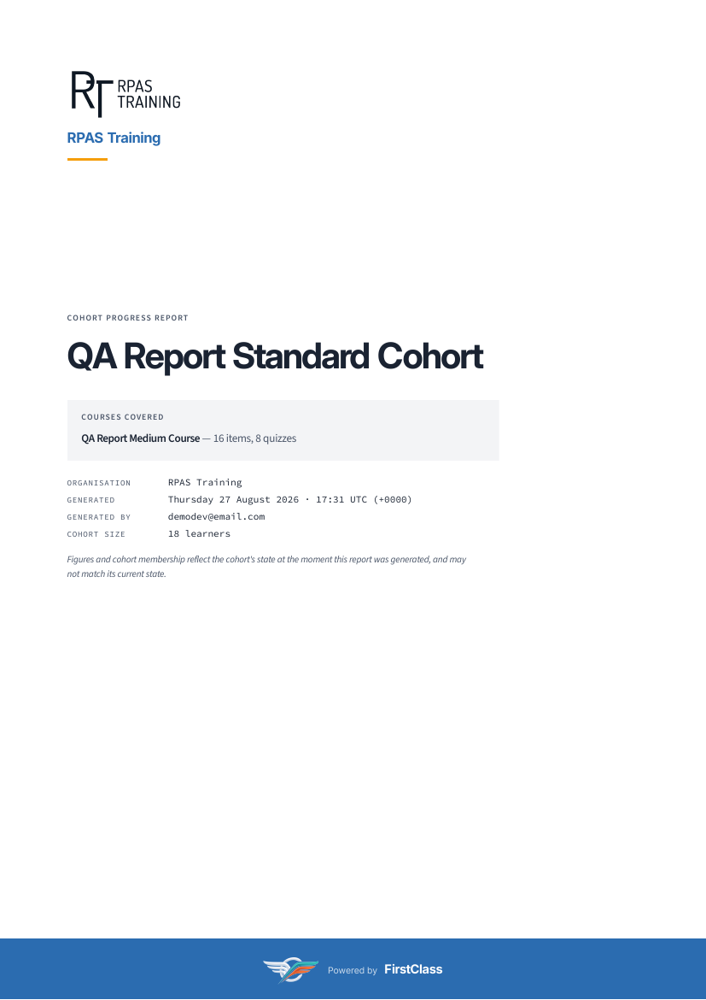

**Cover band trap check (page-1 grep count).** "Powered by" appears exactly ONCE on page 1 (grep count = 1). `@page :first` correctly clears the new `@bottom-center` box; the site name appears nowhere else on the cover. This is the trap the plan flagged as most likely to fail — it didn't.

**Cover band bleed.** Band pixels run x=0..2479 of a 2480.4px-wide page at 300dpi, and to the last row — bleeding off left, right and bottom. The single white column at x=2480 is a 0.08mm rasteriser rounding sliver, not a margin. The band's embedded mark is 1512x737 (`first_class_logo_on_dark.png`, the reversed variant): reads cleanly white against the blue, whole, undistorted, 8.0mm tall, lockup centred horizontally (1638px vs page centre 1654px at 400dpi) and vertically. "Powered by" is visibly smaller and lighter than "FirstClass", same typeface.

**Interior footer.** Bottom-left is a two-line stack ("RPAS Training" / "QA Report Standard Cohort"), no "Cohort progress report" label, no site name. Bottom-centre carries the full-colour mark (512x248, `first_class_logo.png` — the right-way-round pairing with the band's reversed mark) plus "Powered by FirstClass" on one line; the mark is 3.5mm tall and sits on the text baseline. Bottom-right reads "Page 2 of 32". No collisions. Landscape pages 5 and 6 carry the identical full footer row.

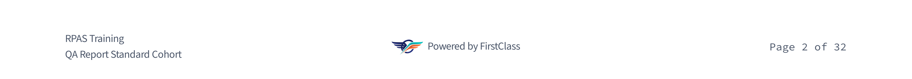

**Document metadata.** Author = "RPAS Training" (one name only, not "RPAS Training, DemoDev"). Creator = "FirstClass" (the site name). Title = "QA Report Standard Cohort - Cohort progress report", unchanged.

### Test 2 — wordmark fallback (Northside)

Northside has no logo. The top-left slot holds the organisation name set large in the deployment's primary blue, above the left-aligned accent rule — reads as finished, not as a failed image. No monogram/initials badge anywhere; page 1 embeds exactly one image (1512x737, the platform's on-dark band mark), so there is no image in the brand slot at all. No broken-image icon, no empty box, no alt text. Author=Northside, Creator=FirstClass, page-1 "Powered by" count = 1, footer two-line stack intact, filename `northside-qa-report-standard-cohort-progress-report.pdf`.

### Test 3 — house organisation (DemoDev)

DemoDev is the site's default organisation. Attribution is fully suppressed: text search for "Powered" returns **zero** hits across all 43 pages, and `pdfimages -list` lists **nothing at all** — no platform mark on the band, none in any page footer. The coloured band is still present and solid: 18.0mm tall, bleeding to left/right/bottom, and sampling inside it returns exactly one colour (43,108,176) — bare colour, no mark, no text. The interior footer keeps the two-line identity stack (DemoDev / QA Report Standard Cohort) at bottom-left and "Page 2 of 43" at bottom-right, neither shifted nor re-centred by the empty middle box.

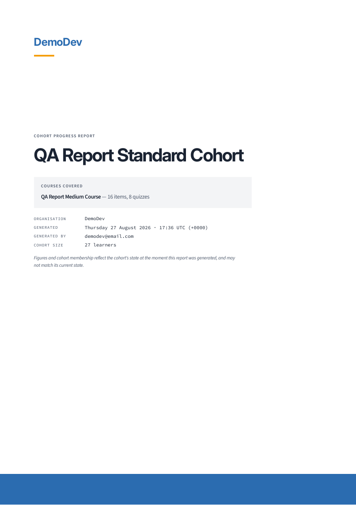

### Test 4 — long / medium / short names

Size-class boundary behaviour, measured from the PDF's own word bounding boxes:

| Organisation | Length | Wordmark size | Class |
|---|---|---|---|
| Northside | 10 ch | 21.78pt | FULL |
| Lakeside College of Health Sciences Inc. | 40 ch | 21.78pt | FULL |
| Riverbend Institute of Applied Technology Ltd | 45 ch | 15.73pt | CONDENSED |
| (147-char org name) | 147 ch | 15.73pt | CONDENSED |

Neither medium name overflows its slot at its size. Lakeside's 40-char name fits the footer budget untruncated; Riverbend's 45-char name truncates cleanly with a single ellipsis.

The 147-char case: the cover wordmark is set at the condensed size (line box 15.73pt vs 21.78pt full), wraps to exactly 3 lines and ends with a single U+2026 ellipsis glyph (confirmed via hexdump: `E2 80 A6`, not three periods). The block spans 20.0mm–89.0mm = 69.0mm wide, inside the ~70mm slot; it does not run to full page width. Brand block bottom is at y=113.3pt while the "COHORT PROGRESS REPORT" overline starts at y=253.5pt — 140pt of clearance, so no overlap with the accent rule, the overline or the cover title, and the cover body is not pushed down. The ORGANISATION metadata row still shows the full untruncated name.

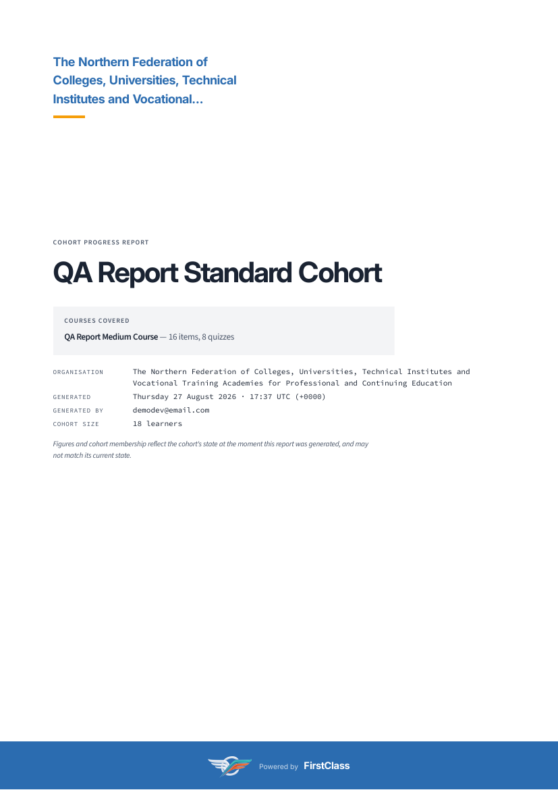

The footer identity block for the 147-char org stays at exactly two lines: "The Northern Federation of Colleges, Un…" over "QA Report Standard Cohort", truncated with a single U+2026, well clear of the centre box — no collision. The centre box still holds the mark plus "Powered by FirstClass" on one line. Checked on portrait page 2 and landscape page 5: both sane, same character budget, neither collides.

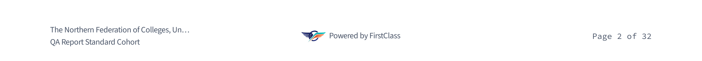

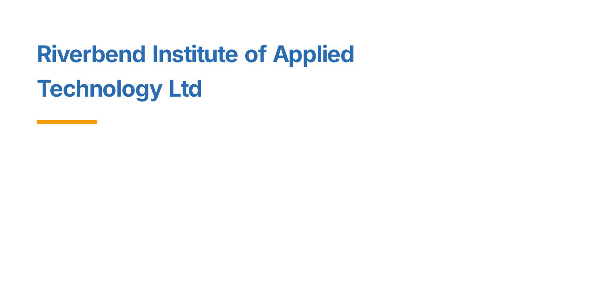

### Test 5 — non-Latin name (Cyrillic)

Organisation "Восточно-Европейская Академия Непрерывного Образования" renders as real text on the cover (3 lines, condensed size, primary blue) and in the footer — no missing-glyph boxes, in a face consistent with the rest of the cover. The download filename preserves the script: `восточно-европейская-академия-непрерывного-образования-qa-report-standard-cohort-progress-report.pdf` — the organisation name is not stripped. PDF Author metadata also carries the Cyrillic name intact. The footer truncates to two lines with a single ellipsis, as designed.

### Test 6.1 — 6.11: sideways cases

**6.1 — logo vanishes from storage (QA Logo Vanish).** The organisation's logo file had been deleted by a previous run in this worktree; it was restored so the full before/after sequence could be run, then deleted again as the test requires. Report 1 (logo restored): confirmed embedded on the cover (page-1 images 1324x609 org logo + 1512x737 band mark). File then deleted from `media/organisations/`, DB row left pointing at it. Report 2: status reached Ready (not Failed), `error_message` empty, page 1 now embeds only the 1512x737 band mark, and the cover falls back to the "QA Logo Vanish" wordmark. No traceback in the runserver console.

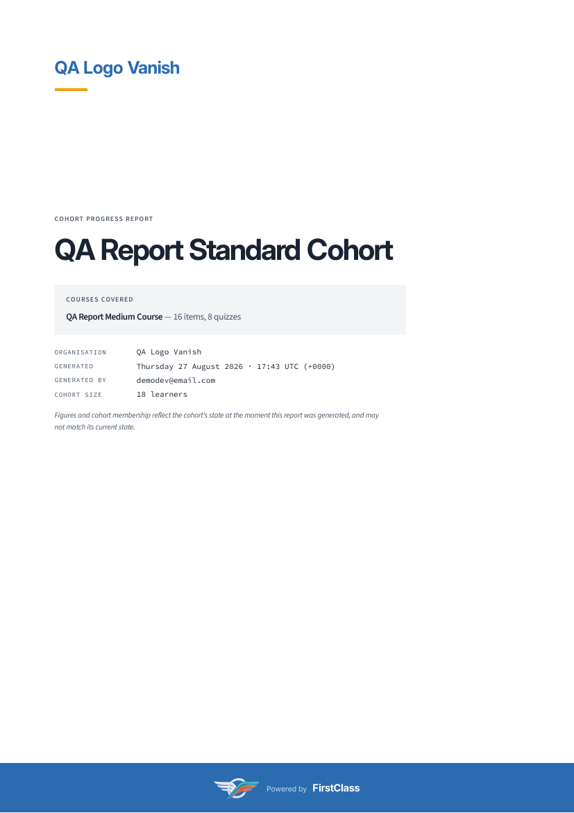

**6.2 — logo file isn't really an image (QA Bad Logo).** A 45-byte ASCII text file named `.png`, attached bypassing `full_clean`. Report generated to Ready with an empty `error_message`. Cover falls back cleanly to the "QA Bad Logo" wordmark: page 1 embeds only the 1512x737 band mark — no garbage embedded, nothing renders as a broken image.

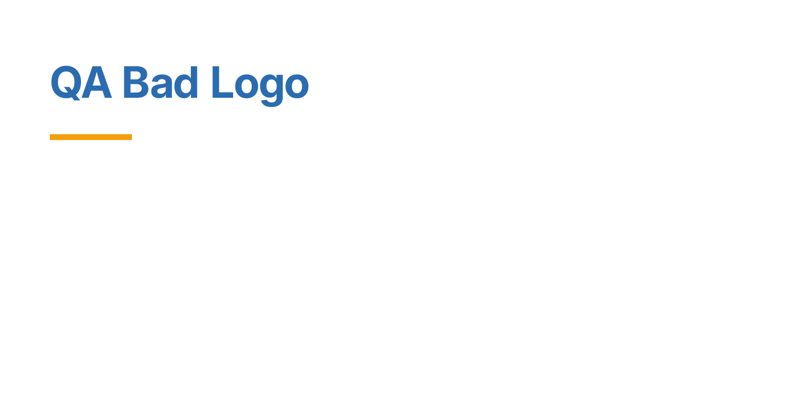

**6.3 — admin upload validation.** On the organisation change form, all three bad uploads were rejected on save with clear messages: SVG renamed `.png` → "File is not a readable image. Use PNG, JPEG or WebP."; a 9.3MB file → "Image file is too large (9.3MB; maximum is 2MB)."; a 48x24px image → "Image is too small (48x24px; minimum is 64x32px)." None reached storage or a report.

**6.11 — organisation's dark-mode file vanishes (QA Dual Logo).** The `*-on-dark` file was deleted from storage with the DB row left pointing at it. Report reached Ready with an empty `error_message` and no traceback. The cover still embeds the LIGHT variant — pixel-identical to `media/organisations/cd09ec82-...png` (mean abs diff 0.000) — and the band still carries the platform's on-dark mark (diff 0.000 vs `static/images/first_class_logo_on_dark.png`). The missing dark file is completely invisible, as intended: nothing on the report reads the organisation's dark variant today.

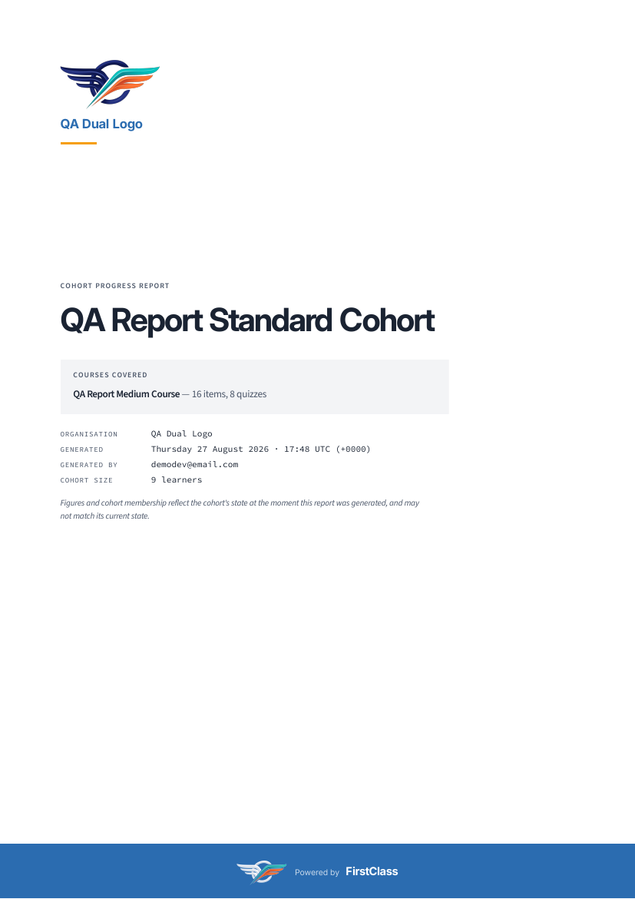

**6.4 — organisation renamed after a report exists.** Renamed "Northside" to "Northside Renamed Ltd" and re-downloaded the report generated before the rename. The PDF is byte-identical (md5 `1fe3978eea9beda0c198179d9e6c3a89` both before and after), still reads "Northside" on the cover and still carries Author='Northside' — an immutable snapshot. Generating a NEW report for the same cohort produced "Northside Renamed Ltd" on the cover and in Author. Both behaviours correct. Organisation name restored afterwards. (See General notes for the filename-vs-content divergence this exposed.)

**6.5 — organisation name contains markup and punctuation (`Acme & Sons <b>Ltd</b> "Trading"`).** The cover wordmark, the ORGANISATION metadata row, the page footer and the PDF Author field all show the name literally, with `<b>` visible as text. No bold is applied, the ampersand and both quotation marks render intact, and nothing further down the document is affected — band, title, metadata block and footer are all correct, so no name reached the stylesheet. The cover wordmark breaks mid-tag across two lines, which is ordinary text wrapping, not a lost character.

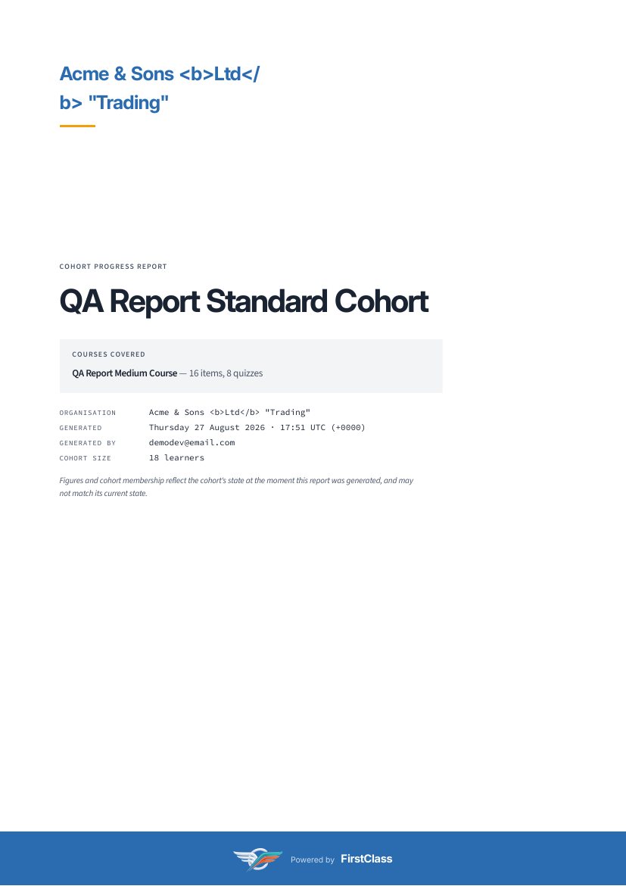

**6.6 — organisation name is punctuation only (`---`).** Download filename comes out as `-qa-report-standard-cohort-progress-report.pdf` — ugly but valid, exactly as the plan predicts. Downloads without a 500 and the file has a name. Report reached Ready; the cover renders "---" as the wordmark above the accent rule and the ORGANISATION row reads "---".

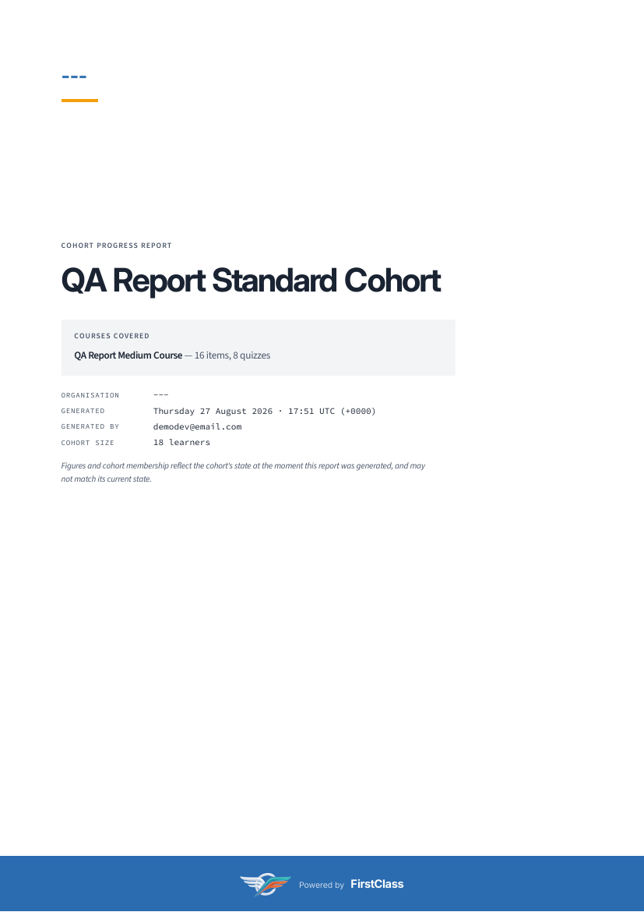

**6.10 — empty cohort (0 learners).** QA Report Empty Cohort (RPAS Training). The cover still carries the organisation's full brand — logo embedded (1324x609) top-left, "RPAS Training" set beneath it, accent rule — and the band with the platform's on-dark mark and "Powered by FirstClass" renders correctly. An empty cohort does not lose its branding along with its content.

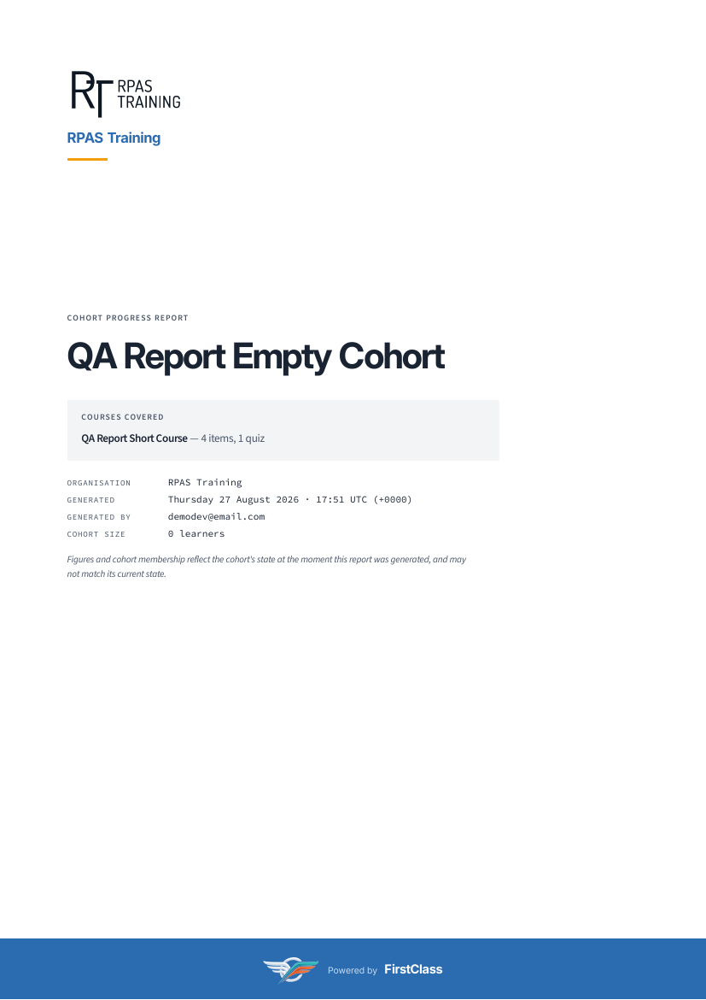

**6.8 — download a report stuck in `pending`.** Hit the download URL for a report row left in `pending` directly. Response is a clean HTTP 404 — no broken file, no traceback.

**6.9 — duplicate generation while one is in flight.** With a pending report already in flight for the cohort, submitting Generate for that same cohort returns "A report for this cohort is already being generated." and creates no second row — the report count for the cohort stayed at 4 across the blocked attempt.

**6.7 — download permissions.** Logged in as `qa-report-restricted@email.com`. Downloading the report for a cohort this user may view succeeded and served the organisation-named file `rpas-training-qa-report-standard-cohort-progress-report.pdf`. Downloading a report for a cohort the user may not view (RPAS Training / QA Report Empty Cohort) returned HTTP 403 Forbidden. The filename change has not widened who can download what — `download_report_view` still gates on `can_view_cohort()` before it builds the filename.

### Test 7 — dual logo variants (QA Dual Logo)

**Cover.** With both light and dark variants present, the cover's top-left slot holds the LIGHT variant: the first page-1 image is pixel-identical to the organisation's light file (mean abs diff 0.000) while differing from its dark file by 201.72. The dark variant appears nowhere as the organisation's mark. Band, footer, metadata (Author=QA Dual Logo, Creator=FirstClass) and filename (`qa-dual-logo-qa-report-standard-cohort-progress-report.pdf`) all match Test 1. Note: the fixture seeds the organisation's dark file with the same artwork the platform uses, so the band mark happens to be byte-identical to the org's dark file — a fixture coincidence the plan calls out, not the cover reading the wrong variant.

**Admin fields.** The change form has two upload fields with distinct labels and help text: "Logo (for light backgrounds)" — "The full-colour mark, for white and near-white surfaces. Used on the report cover…"; "Logo (for dark backgrounds)" — "The reversed mark, for surfaces painted in a strong colour. Optional…". The two files have different names on disk (`cd09ec82-...png` and `cd09ec82-...-on-dark_RwN9G3o.png`, the dark one ending `-on-dark`), so neither upload overwrote the other. Slug is rendered read-only. Uploading a text file renamed `.png` into the DARK field is rejected with the same message the light field gives: "File is not a readable image. Use PNG, JPEG or WebP."

**Clearing the dark field.** Ticked Clear on the dark field and saved. The organisation kept its light logo (`logo='organisations/cd09ec82-...png'`) while `logo_on_dark` became empty, and a freshly generated report for the cohort still reached Ready.

### Test 8.1 — 8.3: platform mark configuration

| Test | `HEADER_LOGO_STATIC_PATH` | `HEADER_LOGO_ON_DARK_STATIC_PATH` | Band | Interior footer | Result |
|---|---|---|---|---|---|
| 8.1 | unset | unset | text-only "Powered by FirstClass", centred, no mark/gap | text-only "Powered by FirstClass" | Ready |
| 8.2 | set | unset | **text-only** — does NOT fall back to full-colour mark | full-colour mark (512x248) on every interior page | Ready |
| 8.3 | invalid path | set | — | — | Failed, loudly |

**8.1 — neither mark configured.** Report reached Ready with an empty `error_message`. The band reads "Powered by FirstClass" as text alone in the two-tier treatment, centred, with no mark, no gap where a mark would sit and no broken-image box. Interior footers likewise read text alone. The whole document embeds exactly one image — the organisation's own logo on page 1 — confirming no platform mark anywhere. Looks unremarkable, as the pre-mark treatment should.

**8.2 — only the light mark configured.** Interior footers carry the full-colour mark (512x248 on every interior page) while the band carries text alone. Critically the band does **not** fall back to the full-colour mark: page 1 embeds only the organisation's 1324x609 logo and no platform mark at all. This is the whole reason the two settings are kept separate, and it holds.

**8.3 — configured but unresolvable path.** `HEADER_LOGO_STATIC_PATH` pointed at `images/nope.png`. The report went to Failed, as intended, with an error message naming the unresolvable path: "Static asset 'images/nope.png' could not be resolved through the staticfiles finders. Run `npm run tailwind_build` if this is the compiled Tailwind bundle; otherwise check the path against the setting that names it." A configured-but-wrong path is loud rather than silently missing. Restoring the setting and generating again reached Ready with both marks back in place. `config/settings_dev.py` restored to its committed state.

### Mobile pass

**M1 — generate-report form, 375x812.** No horizontal overflow (`scrollWidth` 375 = viewport). Cohort select is 293x38, Generate button 88x38, both inside the viewport with the select's right edge at 334px. Label, help paragraph and control stack legibly. The 38px control height is Django-unfold's standard admin sizing, not something this change introduced.

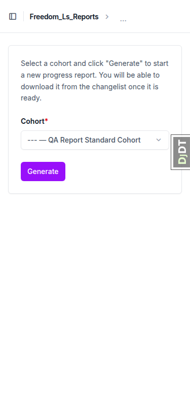

**M2 — generated-reports changelist, 375x812.** The wide table collapses to stacked label/value cards per row rather than overflowing — no horizontal page scroll (`scrollWidth` 375). Organisation, Cohort, Status, Requested By/At, Finished At and the Download link are all readable, and the organisation column (the one this change added) is not truncated.

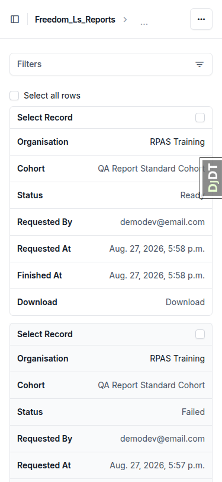

**M3 — course-player side panel, 375x812.** The mobile sheet clamp from this branch. The dialog opens in bottom-sheet variant with a computed max-height of 690.2px = exactly 85vh of the 812px viewport, so the UA's own cap no longer wins and the sheet cannot grow off the top of the screen (dialog top 495, bottom 812, never negative). The TOC header renders inside it — eyebrow, course title, progress bar, "0% complete" — with the item list below, over a dimmed backdrop. No horizontal overflow.

**M4 — organisation chip, absence check.** Organisation chip is correctly absent on this course: it is served by the site's default organisation (DemoDev), and the branch's fix hides the chip for a Site's own default org. Verified via `#course-organisation-chip` being missing from the DOM. (The positive case — chip present for a non-default org — is out of scope; see General notes.)

### Tablet pass

**T1 — course-player side panel, 768x1024.** The desktop dock is gated at `lg` (1024px), so an iPad-portrait tablet correctly gets the mobile bottom-sheet variant rather than a half-formed dock. Computed max-height is 870.4px = exactly 85vh of the 1024px viewport, so the same clamp holds at this width. The sheet renders the full TOC header (eyebrow, title, progress bar, "0% complete") and item list over the dimmed backdrop. No horizontal overflow.

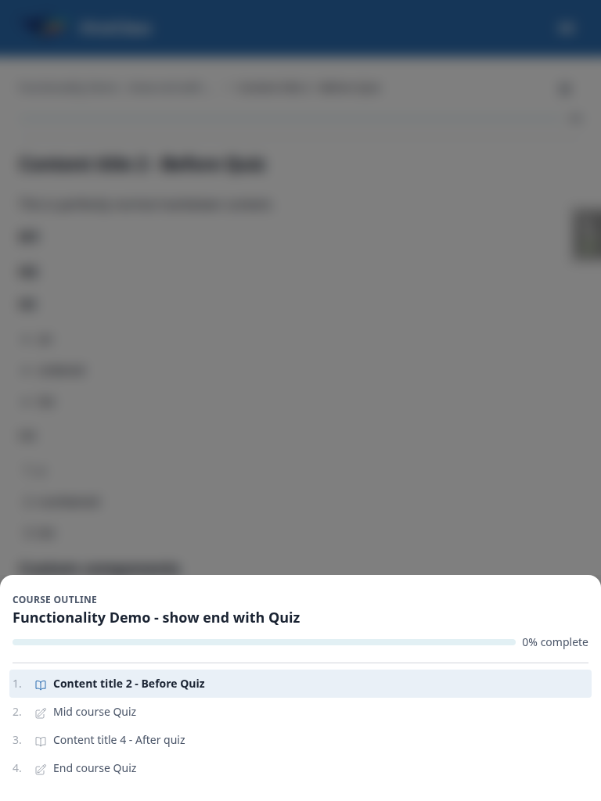

**T2 — generated-reports changelist, 768x1024.** Still renders as stacked label/value cards — roomy rather than crowded, no horizontal scroll, and the Organisation column this change added is fully readable at full width. A Failed row correctly shows an empty Download cell rather than a dead link.

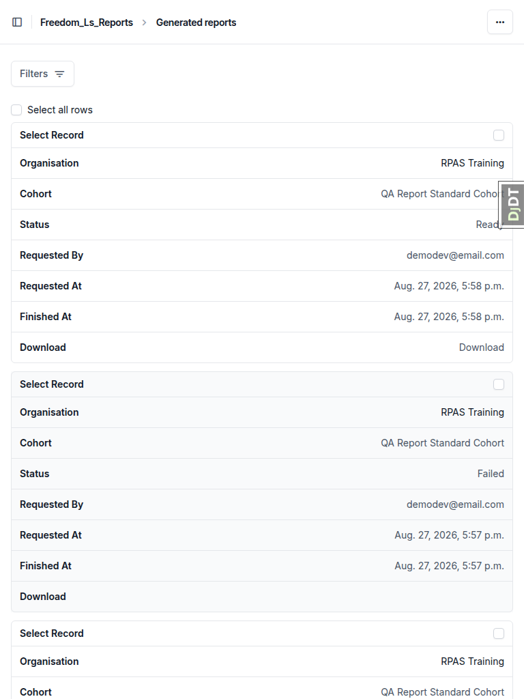

**T3 — generate-report form, 768x1024.** No horizontal overflow. Cohort select stretches to 672x38 with its right edge at 713px, comfortably inside the viewport, and the Generate button sits below it. The longest option label is 175 characters (the 147-char organisation plus its cohort) and the select still does not push the page wide — the control clips its own text rather than overflowing.

## Bug status

No bugs found.

| ID | Description | Severity | Status |
|---|---|---|---|

## General notes

- **Test data.** All required organisations and cohorts already existed in this worktree's database from earlier runs, so no `qa-data-helper` spawn was needed. `QA Logo Vanish`'s logo file had been deleted by a previous run; it was restored so test 6.1 could be run in full (confirm logo on cover → delete file → regenerate), then deleted again as the test requires.
- **Environment.** The `DemoDev` Site is bound to `127.0.0.1:8000` in this worktree's database, so its domain was repointed to the run's port for site resolution to work. This is a local dev-database detail, not a product finding.
- **Observation, not a defect.** The download filename is derived from the organisation's *current* name at download time, not from the snapshot the PDF froze. After renaming an organisation, re-downloading an older report serves byte-identical PDF content (old name inside) under a filename built from the new name. Test 6.4 asserts only that the PDF is unchanged, which held, so this is reported as an observation for the team to rule on rather than a bug.
- **Dev-only friction.** The django-debug-toolbar overlay intercepts pointer events on the changelist's Download link and on the admin file-input widgets, so downloads were driven by navigating to the download URL directly, and the toolbar was hidden before form interaction. Not a product issue.
- **Not exercised, with reasons.**
  - Test 5's optional CJK/Devanagari sub-case — the plan marks it a known accepted limitation and only requires the filename to survive, which the Cyrillic case already demonstrates.
  - Test 6.4's "upload a different logo" variant — the plan offers renaming as an equivalent alternative, and that was used instead.
  - The positive case of the learner-interface organisation chip appearing for a non-default organisation — the chip's absence for the site's default org was verified (M4), but showing it requires a learner registered through a non-default organisation, which is outside this PDF-focused plan and is covered by the branch's own tests.

status: ok · reason: report rendered, 35 test records, 0 bugs documented, 30 screenshots verified present
