# Frontend QA report: reports rendered with the organisation's brand

## Methodology

Screenshots were collected into `screenshots/`, beside this report, and every image referenced
below exists in that directory.

The rendered surface under test is a PDF, not a web page, so assertions were made against the
downloaded files rather than against anything on screen: `pdfinfo` for the Author/Creator/Title
metadata, `pdftotext` for per-page text and for counting occurrences of "Powered", `pdfimages` to
confirm an embedded logo is present or absent, `md5sum`/`cmp` for the immutability checks in 6.4,
and `pdftoppm` to rasterise covers and footers for visual judgement. Sixteen PDFs were generated
and downloaded across twelve organisations over the course of the run. This is the record of how
each result below was actually checked, not just observed.

The run did not abort at the smoke gate, so every step in the plan ran.

## Diff scoping

Scoped as **FULL**. The changed files span the report templates and stylesheet
(`freedom_ls/reports/templates/reports/partials/title_page.html`,
`freedom_ls/reports/templates/reports/report.html`, `freedom_ls/reports/static/reports/print.css`),
the report data and rendering pipeline (`gather.py`, `indexes.py`, `render.py`, `report_data.py`,
`views.py`), the organisation logo validators (`freedom_ls/organisations/validators.py`), two
learner-interface partials (`course_organisation_chip.html`, `course_toc_header.html`), three QA
seeding commands, `docs/app_structure.md`, and the reports/organisations test suite and spec_dd
docs. Nothing was skipped: the desktop, mobile and tablet passes all ran.

The rendered surface under test is a PDF, which has no viewport, so there was nothing to run the
mobile and tablet passes against directly. Those two passes instead covered the two changed
learner-interface templates (the organisation chip in the course TOC/drawer) and the admin flow
that drives report generation, since both are reachable in a browser and both are part of this
diff's surface.

## Smoke gate

Passed. Two pages were loaded: `http://127.0.0.1:8405/` and
`http://127.0.0.1:8405/admin/freedom_ls_reports/generatedreport/`.

## Environment blocker cleared mid-run

The branch database was behind by the `content_engine`-to-`form_engine` extraction migrations.
Every report generation failed with `AttributeError: 'NoneType' object has no attribute
'_base_manager'` raised from `build_course_catalogue`, because 30 `ContentCollectionItem` rows
pointed at a dead `freedom_ls_content_engine.form` `ContentType`. `build_course_catalogue` is
byte-identical on `main`, so this was diagnosed as pre-existing dev-database rot rather than a
defect in this feature.

The `fls-dev:qa-data-helper` agent migrated the database without data loss (30 forms, 153
questions, 456 options, 425 attempts, 2812 answers preserved) and added
`freedom_ls/qa_helpers/management/commands/qa_repair_form_engine_content_types.py` to repoint the
dangling generic foreign keys.

All results below were produced after that repair. The two `Failed` rows still visible in the
generated-report changelist predate it and are not evidence of a defect in this run.

## Results

### Test 1 — An organisation with a logo (the golden path)

**1.1 Cover layout, desktop — pass.** RPAS Training cover. Logo sits top-left, whole and
unclipped, roughly 34mm wide by 12mm tall, inside the 70mm/16mm caps. The organisation name is not
repeated as text beside it. The orange accent rule sits under the brand block, flush left. The
Organisation row of the metadata list shows the full name. The band at the foot is solid and reads
"Powered by FirstClass", with "Powered by" visibly smaller and lighter than the site name, so the
two-tier treatment holds. The site name appears nowhere else on the cover.

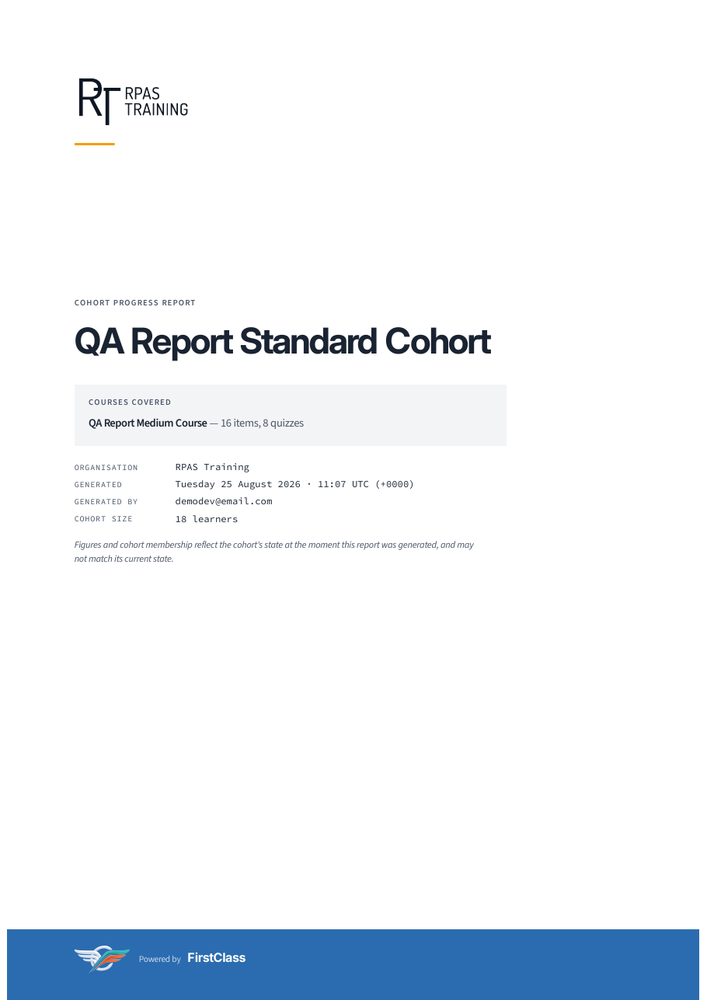

**1.2 "Powered by" appears exactly once on the cover — pass.** This is the trap the plan calls the
single most likely defect, and it is the one line in this report worth reading even if nothing
else is. `pdftotext` counts exactly one "Powered" on page 1 (the band) and one on every interior
page (the bottom-centre box). `@page :first` clears `@bottom-center` by name and WeasyPrint honours
it, so the cover does not say it twice.

**1.3 Interior footer, desktop — pass.** Page 2 footer reads "RPAS Training - QA Report Standard
Cohort - Cohort progress report" bottom-left, "Powered by FirstClass" bottom-centre, "Page 2 of
20" bottom-right. The site name is gone from the identity line. The three boxes do not overlap or
collide.

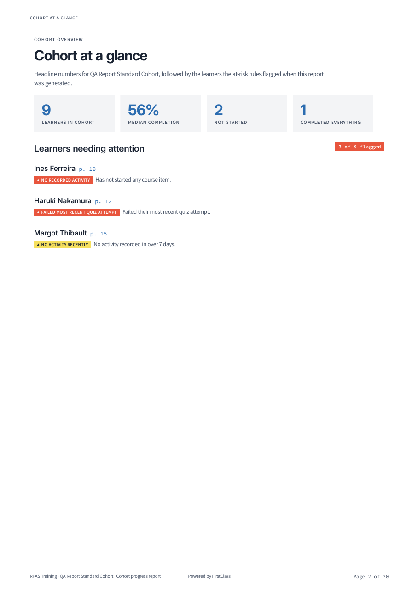

**1.4 Landscape footer, desktop — pass.** Page 5 rotates to landscape for the summary table and
still carries the whole footer row: identity, "Powered by", page number. Generous spacing, no
collision.

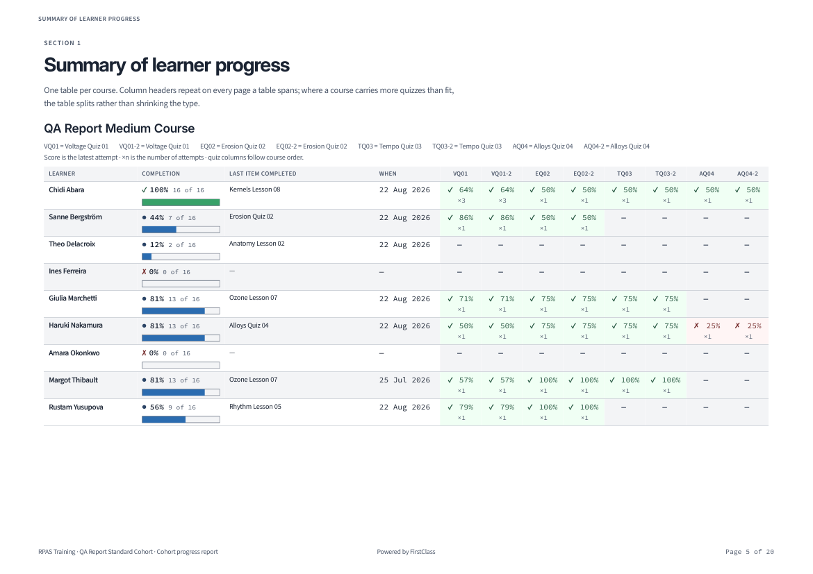

**1.5 Document properties, desktop — pass.** `pdfinfo` reports Author "RPAS Training" (one name
only, no "RPAS Training, DemoDev"), Creator "FirstClass" (the site name), Title "QA Report Standard
Cohort - Cohort progress report". Exactly one author meta tag survives into `/Author`.

**1.6 Download filename, desktop — pass.** Saved as
`rpas-training-qa-report-standard-cohort-progress-report.pdf`. The organisation comes first.

### Test 2 — An organisation with no logo (wordmark fallback)

**2.1 Cover layout, desktop — pass.** Northside has no logo. The top-left slot holds the
organisation name set large in the deployment's primary blue. No monogram or initials badge
anywhere, no broken-image icon, no empty box, no alt text.

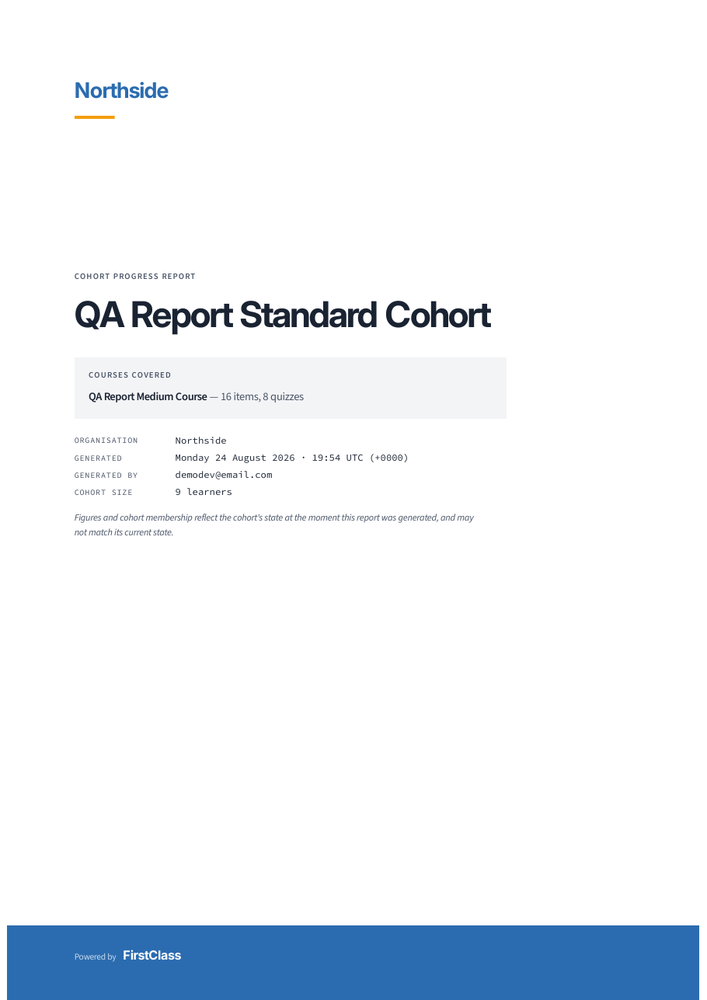

**2.2 Fallback changes the brand slot only, desktop — pass.** Author "Northside", Creator
"FirstClass", one "Powered" on the cover, footer reads "Northside - QA Report Standard Cohort -
Cohort progress report", filename `northside-qa-report-standard-cohort-progress-report.pdf`.
Everything outside the brand slot is unchanged from Test 1.

### Test 3 — The house organisation (attribution suppressed)

**3.1 "Powered by" absent everywhere, desktop — pass.** House organisation (DemoDev, the site's
default). Searching the whole 32-page document for "Powered" returns zero hits, and for
"FirstClass" zero hits. Attribution is suppressed everywhere, not just on the band.

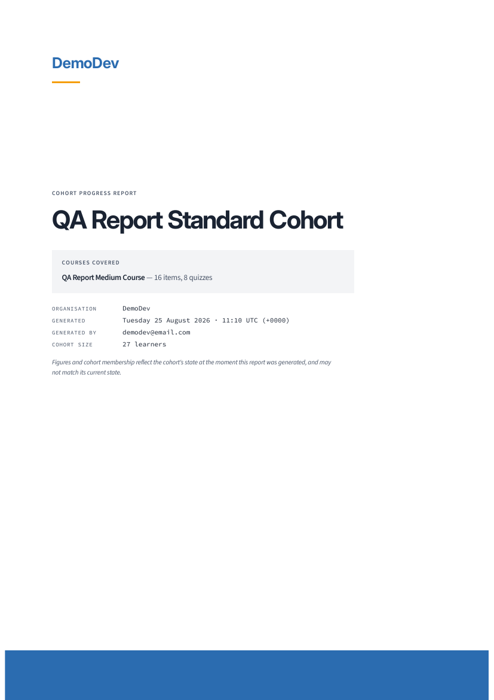

**3.2 Band still drawn, desktop — pass.** The coloured band at the foot of the cover is still
present, still solid, at the same height as the branded covers, just empty. It has not collapsed.

**3.3 Footer unaffected, desktop — pass.** With the centre box empty, the bottom-left identity line
still starts at the same left margin and the bottom-right page number still ends at the same right
margin as the branded reports; neither re-centres nor re-spaces. The identity line still reads
"DemoDev - QA Report Standard Cohort - Cohort progress report" on portrait and landscape alike.

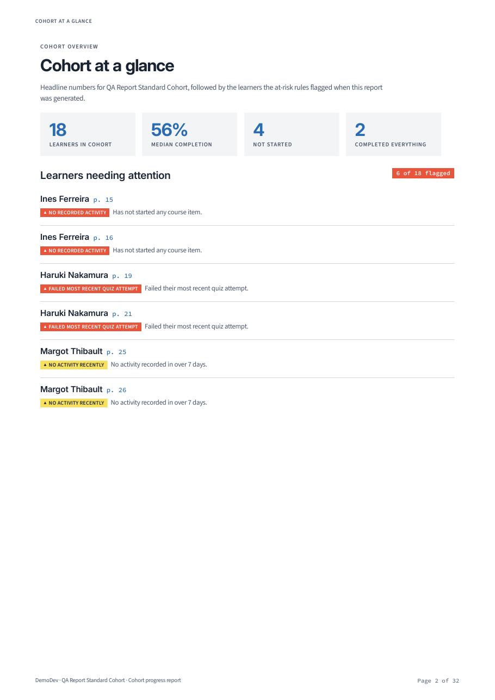

### Test 4 — A very long organisation name

**4.1 Wordmark, long name, desktop — pass.** 147-character name. The wordmark is set at the
condensed size, wraps to exactly three lines, and ends in a single ellipsis glyph (UTF-8 E2 80 A6,
not three periods). It occupies about 69mm of width, inside the ~70mm slot, and does not overlap
the accent rule, the "Cohort progress report" overline or the cover title.

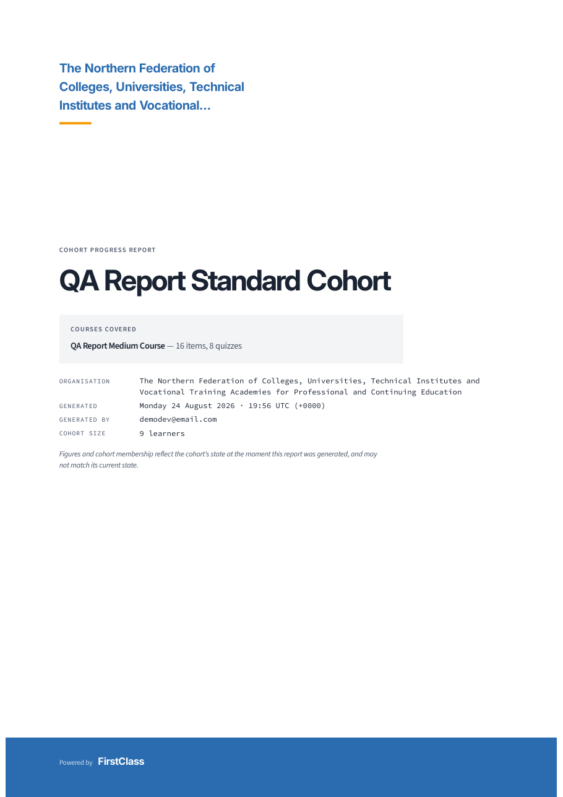

**4.2 Footer truncation, portrait, desktop — pass.** The footer identity line truncates to "The
Northern Federation of Co..." at the 30-character budget with a single ellipsis, and the footer row
occupies two lines. It stays clear of the page content above and does not collide with the centre
box, which itself wraps to "Powered by" over "FirstClass". Two lines is within the plan's stated
allowance.

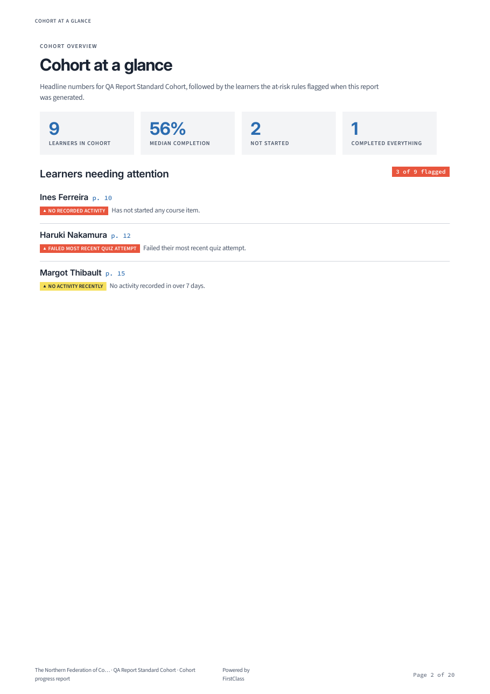

**4.3 Footer truncation, landscape, desktop — pass.** On the wider landscape page the same
truncated identity line, the centre mark and the page number all fit on one line with clear gaps.
Portrait and landscape are both sane, as required.

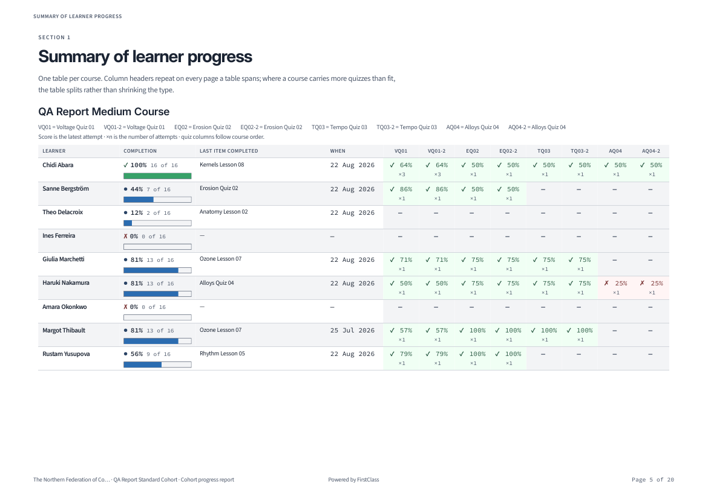

**4.4 Size-class boundary, desktop — pass.** "Riverbend Institute of Applied Technology Ltd" (45
characters) renders at the condensed size and "Lakeside College of Health Sciences Inc." (40
characters) at the full size, matching the `WORDMARK_FULL_MAX_CHARS = 42` boundary pinned in
`gather.py`. Neither overflows its slot.

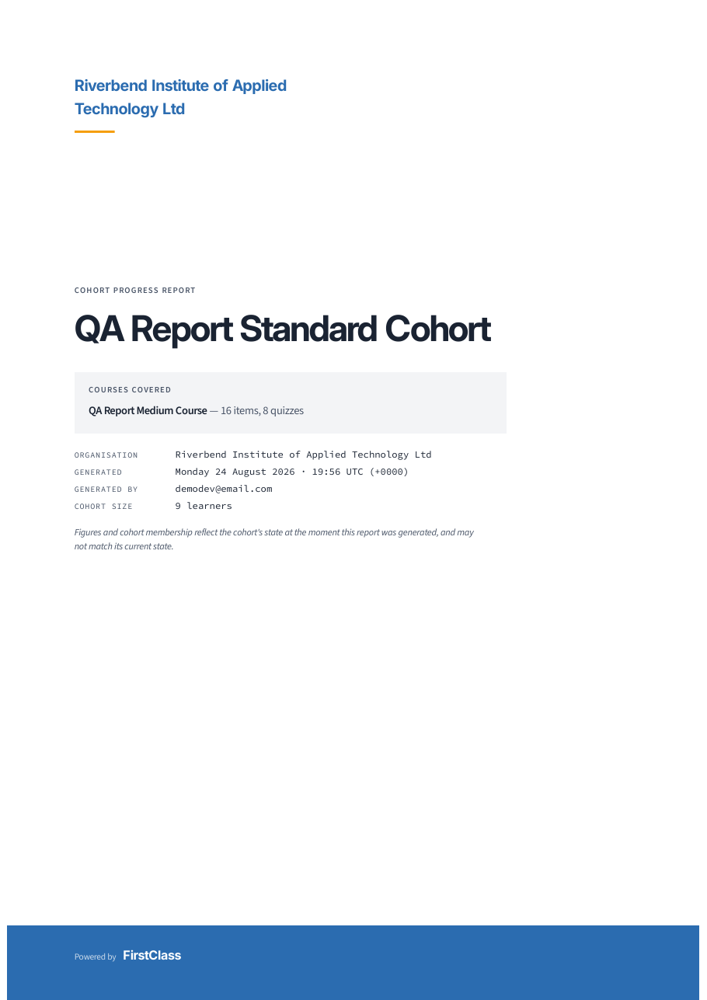

### Test 5 — A non-Latin organisation name

**5.1 Cyrillic render, desktop — pass.** The Cyrillic name renders as real text on the cover
wordmark, in the Organisation metadata row and in the page footers. No tofu boxes anywhere. The
face is the same one used elsewhere on the cover rather than a visibly plainer fallback.

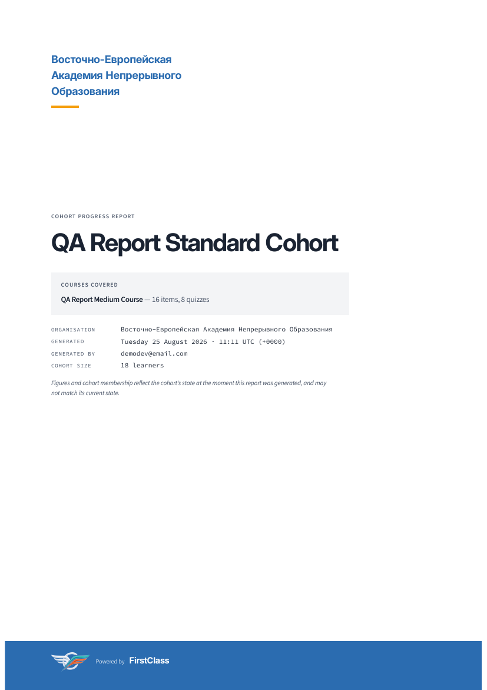

**5.2 Cyrillic filename, desktop — pass.** Saved to disk as
`vostochno-...-obrazovaniya-qa-report-standard-cohort-progress-report.pdf` with the organisation's
own Cyrillic characters intact; the organisation is not stripped from the filename.
`slugify(allow_unicode=True)` in `views.py` is doing its job.

**5.3 Cyrillic footer truncation, desktop — pass.** The footer truncates the Cyrillic name at the
same 30-character budget with a single ellipsis, on both portrait and landscape pages, still as
real glyphs.

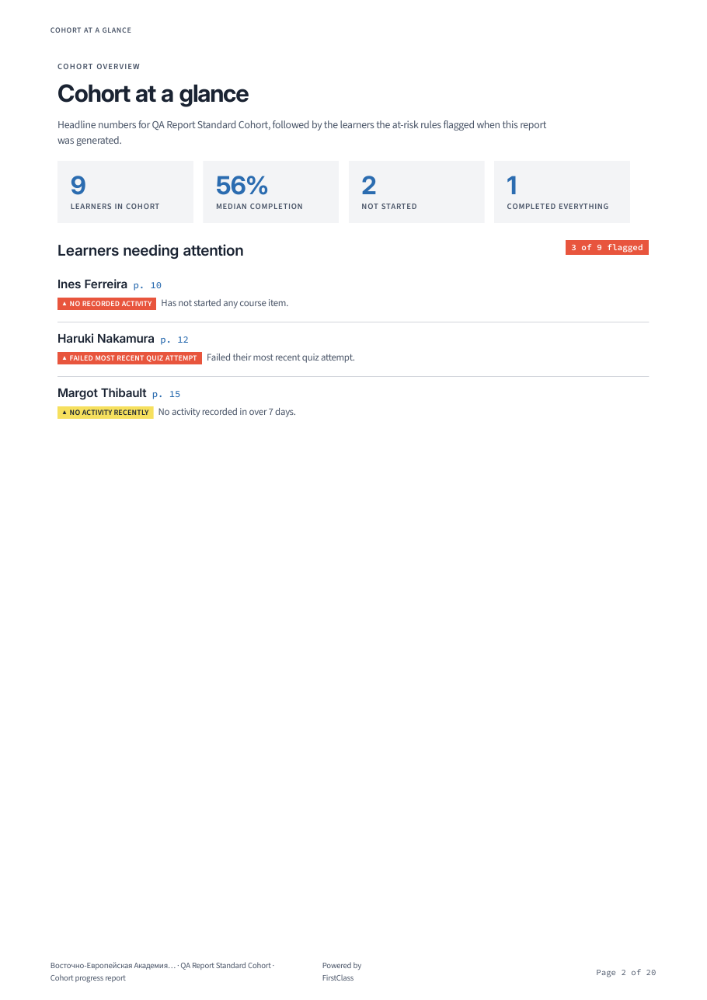

### Test 6 — Things that could break sideways

**6.1 A logo that vanished from storage, desktop — pass.** One report generated for QA Logo Vanish
with its logo present (`pdfimages` confirms an embedded 1324x609 image on page 1), then
`media/organisations/37ac5d66-....webp` deleted from disk leaving the database row pointing at it,
then a second report generated. The second reached Ready, not Failed; its cover falls back to the
wordmark with no embedded image at all; the runserver console shows no traceback for it.

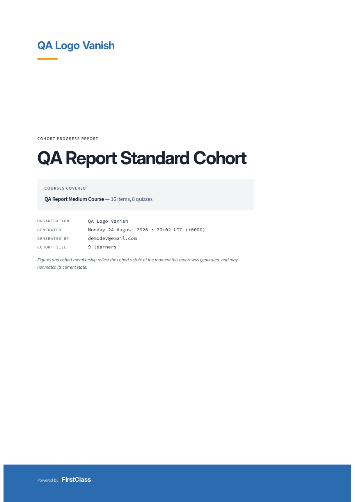

**6.2 A file that is not really an image, desktop — pass.** QA Bad Logo carries 45 bytes of plain
ASCII saved as `logo.png`, attached via `FieldFile.save()` so `full_clean()` never ran. The report
generated successfully, fell back to the wordmark, embedded no image, and showed no broken-image
artefact or garbage on the cover. No traceback.

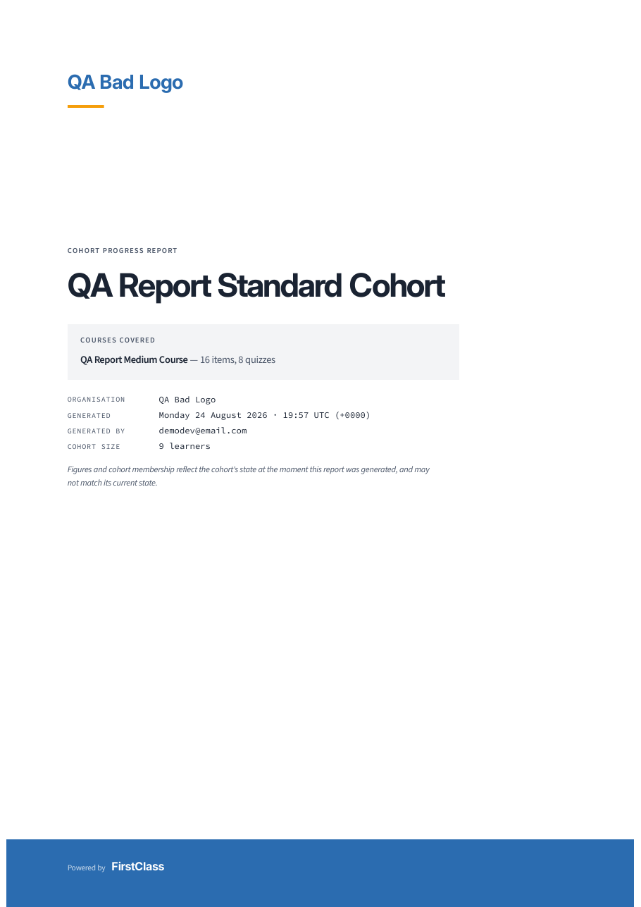

**6.3 Admin upload validation still works, desktop — pass.** All three uploads rejected on the
organisation change form: an SVG renamed to `.png` gives "File is not a readable image. Use PNG,
JPEG or WebP."; a 10.1MB PNG gives "Image file is too large (10.1MB; maximum is 2MB)."; a 48x24px
PNG gives "Image is too small (48x24px; minimum is 64x32px)." Nothing was persisted — Northside's
logo field is still empty afterwards, so none of them could reach a report. Existing behaviour is
undisturbed.

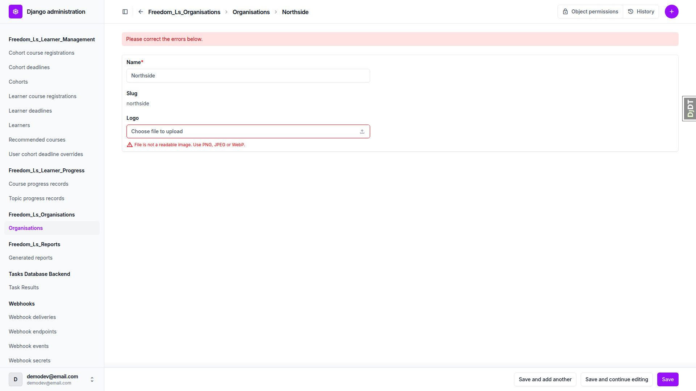

**6.4 A previously-generated report is not retroactively rebranded, desktop — pass.** Two halves,
both confirmed. Logo: after deleting QA Logo Vanish's logo file, re-downloading the old report
returns a byte-identical PDF (same md5) that still embeds the logo. Name: after renaming Northside
to "Northside Academy of Technology", re-downloading the old report returns a byte-identical PDF
whose Author and cover still say "Northside", while a freshly generated report carries "Northside
Academy of Technology" in the Author field, the wordmark, the Organisation row and the footer.
Generated PDFs are immutable snapshots.

**6.5 An organisation name with markup or quotes in it, desktop — pass.** `Acme & Sons <b>Ltd</b>
"Trading"` renders literally on the cover wordmark, in the Organisation row, in the footer and in
the PDF Author field. The `<b>` tags show as visible text, nothing is bold, no characters are
missing, and no styling further down the document is disturbed, so the name reached the markup and
not the stylesheet.

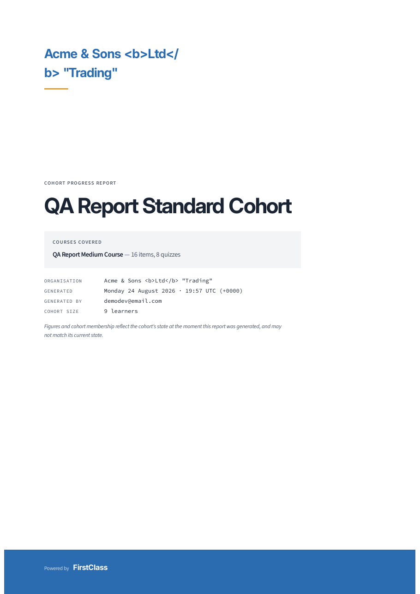

**6.6 An organisation name of only punctuation, desktop — pass.** An organisation named "---"
downloads as `-qa-report-standard-cohort-progress-report.pdf` — ugly but valid, exactly as the plan
predicts. No 500, and the file has a name. The cover and footer show "---" literally.

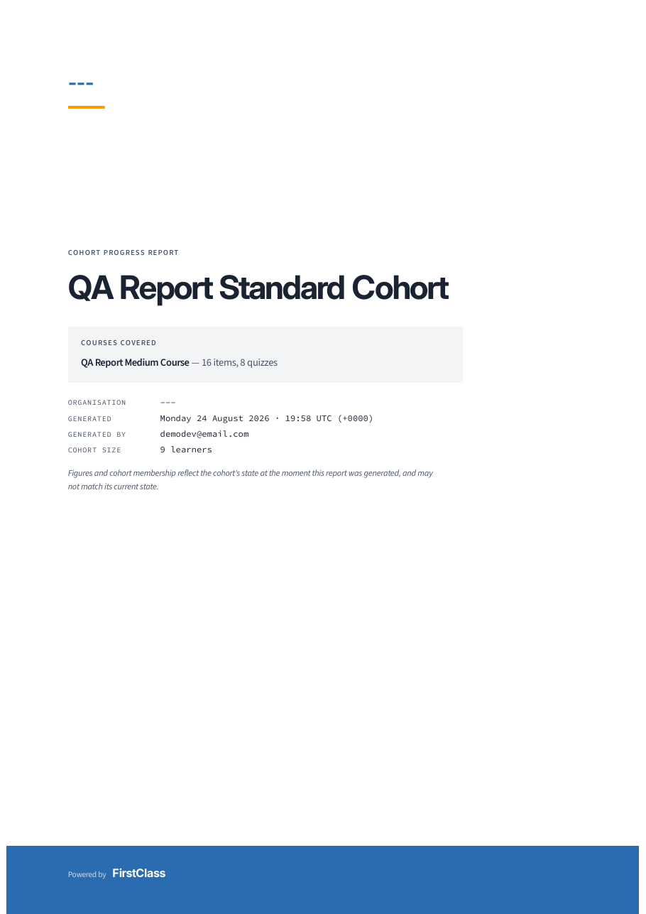

**6.7 Download permissions are unchanged, desktop — pass.** As
`qa-report-restricted@email.com`: downloading a cohort it holds `view_cohort` on succeeds and still
uses the organisation-named filename
(`northside-qa-report-standard-cohort-progress-report.pdf`); downloading QA Report Empty Cohort,
which it has no grant on, returns HTTP 403. `views.py` runs `can_view_cohort` before building the
filename, so the filename change did not widen access. The seeding runs accumulated grants, so
"cohort B" had to be a different fixture key rather than another Standard Cohort — see General
notes.

**6.8 A report in a non-Ready state, desktop — pass.** Hitting the download URL of a report whose
status is not Ready returns HTTP 404 — no broken file, no traceback. Exercised against a Failed
report rather than Pending/Running, because dev uses the `ImmediateBackend` and generation is
synchronous, so those states are not reachable through the UI. The view takes the same `status !=
STATUS_READY` branch for all three.

**6.9 Repeat generation, desktop — pass.** Two concurrent submissions for the same cohort: the
first response carries "Generating a progress report for ..." and the second carries "A report
for this cohort is already being generated." Exactly one new report row appeared, not two. Had to
be driven as two concurrent POSTs because generation is synchronous in dev, so sequential clicks
cannot race.

**6.10 A cohort with no learners, desktop — pass.** QA Report Empty Cohort in RPAS Training. The
cover carries the organisation's logo, the accent rule, the full Organisation row and the solid
band with "Powered by FirstClass" exactly as a populated cohort does. Cohort size reads "0
learners". An empty cohort does not lose its branding along with its content.

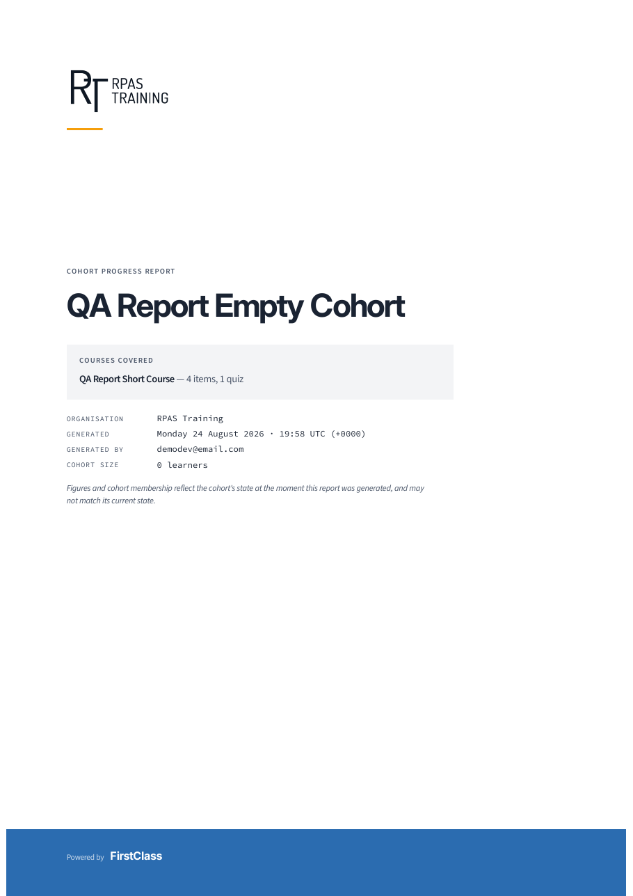

### Responsive checks (course organisation chip and admin report flow)

**7.1 Course organisation chip, desktop — pass.** The extracted `course_organisation_chip.html`
partial renders in the course TOC sidebar as a centred stack — monogram badge over the organisation
name, with a bottom divider — above the "COURSE OUTLINE" heading. No overflow, name truncates
rather than wrapping the container.

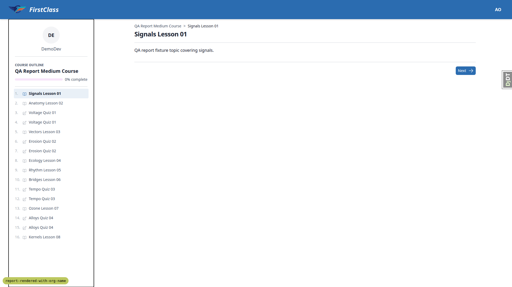

**7.2 Course organisation chip, mobile (375x812) — pass.** The outline moves behind an "Open course
outline" drawer. The chip renders at the top of the drawer, centred, readable, with its divider
intact and no horizontal overflow. The drawer toggle is a comfortable touch target.

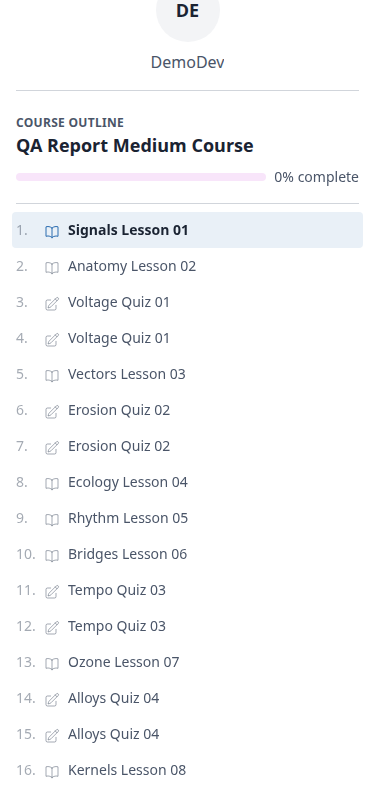

**7.3 Course organisation chip, tablet (768x1024) — pass.** The tablet gets the mobile drawer
rather than the desktop sidebar, which is consistent. The chip renders centred in the wider drawer
with correct proportions and no crowding of the outline list beneath it.

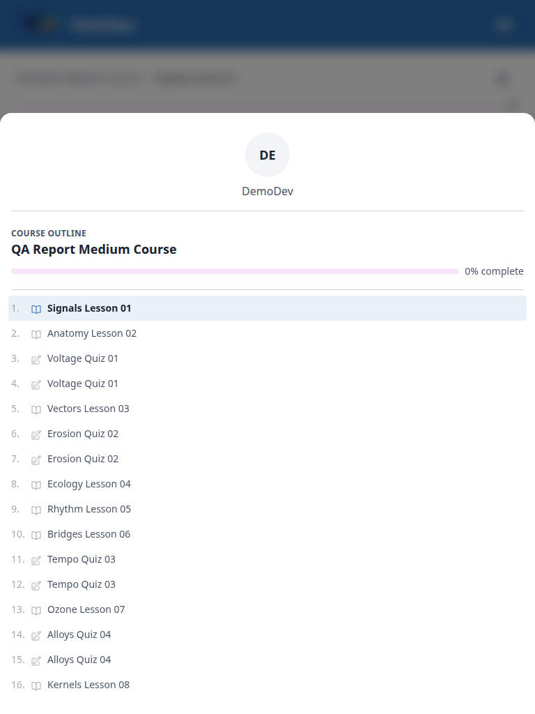

**7.4 Admin generated-report changelist, tablet (768px) — pass.** The changelist collapses each
row into a stacked label/value card. Organisation, Cohort, Status and the Download link are all
legible, nothing overflows horizontally. (The admin templates are not part of this diff; checked
because the tested flow lives here.)

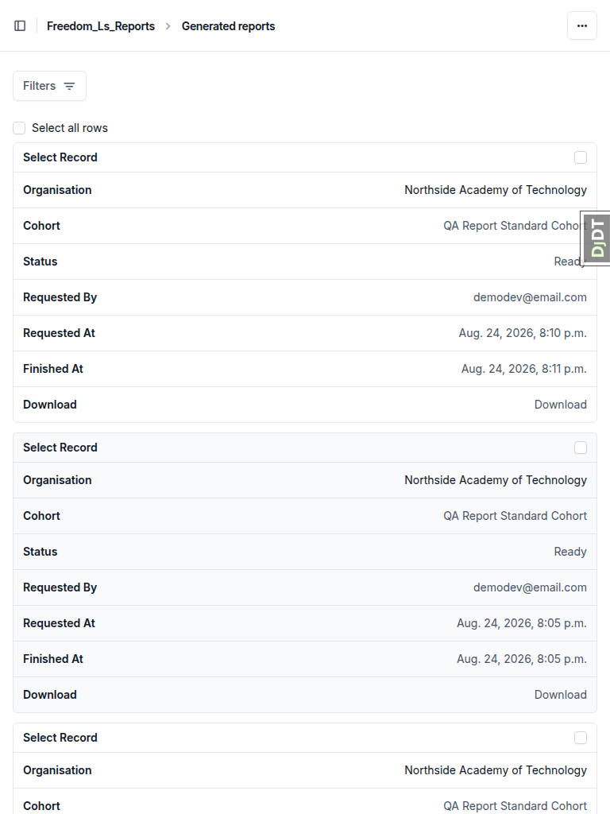

**7.5 Admin generate-report form, mobile (375x812) — pass.** The Generate cohort report form fits
the viewport: full-width cohort select, Generate button a comfortable touch target, no horizontal
scroll.

## Bug status

No bugs were found; every test in the plan passed.

## General notes

**Test-plan accuracy.** Four corrections the plan itself needs, found while following it:

- The admin URL the plan gives, `/admin/freedom_ls/reports/generatedreport/`, returns 404. The
  reports app label is `freedom_ls_reports`, so the real changelist is
  `/admin/freedom_ls_reports/generatedreport/` and the download URL is
  `/admin/freedom_ls_reports/generatedreport/<pk>/download/`.
- The plan invokes `qa_create_organisations` with `--site-name DemoDev`, but the command takes
  `SITE_NAME` as a positional argument, so the documented form fails. Correct invocation:
  `uv run python manage.py qa_create_organisations DemoDev`.
- The plan expects the cover band to read "Powered by DemoDev". `HEADER_TITLE` is "FirstClass" in
  `config/settings_dev.py`, so it correctly reads "Powered by FirstClass". The plan does allow for
  this ("or whatever `HEADER_TITLE` is set to").
- The plan says the generate dropdown groups cohorts by organisation name. It is in fact a flat
  list of "Organisation - Cohort" labels ordered by organisation, not an optgroup-grouped select.
  It reads as grouped and is perfectly usable; noted only because the wording differs from the
  implementation.
- The plan describes a status ladder of Pending -> Running -> Ready needing a manual reload. Dev
  uses `django.tasks.backends.immediate.ImmediateBackend`, so generation runs inline inside the
  POST and the row is already Ready (or Failed) on the redirect. Pending and Running are not
  observable through the UI in dev, which is why 6.8 was exercised against a Failed report and 6.9
  against two concurrent POSTs.

**Observations worth a human's judgement.** Four things that passed but are worth reading rather
than filing:

- Re-downloading an old report uses the organisation's *current* name for the download filename
  while the PDF inside still carries the name it was generated with. After renaming Northside, the
  old report downloaded as `northside-academy-of-technology-...pdf` but its Author and cover still
  read "Northside". This follows directly from `views.py` building the filename from
  `report.cohort.organisation.name` at request time, so it looks deliberate, but the filename and
  the document disagree. Worth a product decision rather than a bug: the plan only requires the PDF
  content to be immutable, which it is.
- An organisation whose stored logo is invalid cannot be saved through the admin at all, even when
  editing an unrelated field. Renaming QA Bad Logo failed with "File is not a readable image."
  because the change form re-validates the already-stored file. This only affects the
  deliberately-corrupt 6.2 fixture and is a direct consequence of the validators 6.3 confirms are
  working, but an administrator would have to clear the logo before they could edit anything else
  on that organisation.
- The cover body's vertical start position shifts a little with the height of the brand block —
  highest with a one-line wordmark, about 3mm lower with a three-line condensed wordmark or a logo.
  Everything still fits comfortably above the band with generous whitespace, so this is within
  tolerance, but the brand block is not a fixed-height slot.
- With a long organisation name the portrait footer row occupies two lines and the centre box wraps
  to "Powered by" over "FirstClass". The plan explicitly allows one or two lines and there is no
  collision with the page content or between the boxes, so this passes; it is simply the tightest
  the footer gets.

**Not attributable to this branch.** In the learner interface the course organisation chip showed
the house organisation (DemoDev) for a learner whose cohort is in RPAS Training. The resolver is
`organisation_for_learner_course` in `freedom_ls/learner_interface/views.py`, which is **not** in
this branch's diff, and the seeding reused the same learner emails
(`qa-report-std-01..09@email.com`) across all twelve organisations so those users hold overlapping
memberships. Not investigated further and not attributed to this change; flagged only so it is not
mistaken for a regression later.

**Seeding.** Seeding accumulated object-level grants rather than reassigning them:
`qa-report-restricted@email.com` now holds `view_cohort` on the QA Report Standard Cohort in all
twelve organisations, and `qa-report-orgstaff@email.com` is `organisation_staff` on twelve
organisations. Any future permission-scoping test must pick a cohort with a different fixture key
as its negative case.

**Not tested.** The plan's optional harder case for Test 5 — a CJK, Devanagari or Thai organisation
name, where missing-glyph boxes on the cover are an accepted limitation but the filename must still
carry the name — was not exercised. The Cyrillic case the plan calls for was covered in full.

**Housekeeping.** The seeding agent left uncommitted work in the tree that a human should review
before committing: a modified `qa_create_organisations.py` (an optional `slug_base` parameter,
needed because `slugify("---")` is empty), two new management commands
(`qa_create_report_brand_organisations.py` and `qa_repair_form_engine_content_types.py`), and three
files under `.claude/agent-memory/`. The agent-memory files are worth a second look because
CLAUDE.md states "Do not use memory."

---
status: ok
reason: report rendered, 0 bugs documented, 23 screenshots verified
