# QA Report: Organisations

Manual browser QA of `3. frontend_qa.md`, executed with Playwright MCP against
`uv run python manage.py runserver 8877` on branch `schools` (debug-branch-badge confirmed `schools`).

Viewports exercised: desktop 1920×1080, mobile 375×812, tablet 768×1024.

**Headline:** the feature's core promises hold. Cross-organisation isolation is airtight, the switcher
never lets the chrome disagree with the data, and the legacy-educator upgrade path (§5) — the check that
would have locked every existing educator out — passes completely. The defects found are three
**500s where a validation error or a 404 belongs**, one **accessibility regression in the live region**,
and one **navigation gap that leaves organisation educators with no link into the interface they can use**.
Entry 7 below is not a defect: it is a discrepancy between the spec and the test plan, since resolved in
the spec's favour, and is kept only for the record.

Test data was created by the `fls-dev:qa-data-helper` agent.

---

## Failures

### 1. Duplicate Organisation name returns a 500 IntegrityError, not a validation error

**Test:** §1.4 · **Persona:** admin · **URL:** `/admin/freedom_ls_organisations/organisation/add/`

Saving a second Organisation named exactly `Westbrook` crashes.

- **Expected:** a validation error naming the uniqueness problem.
- **Actual:** HTTP 500.
  `IntegrityError: duplicate key value violates unique constraint "unique_organisation_name_per_site"`
  `DETAIL: Key (site_id, name)=(3, Westbrook) already exists.`

The constraint is enforced only at the database level. A Django `ModelForm` does not validate
`Meta.constraints`, and `site` is excluded from the admin form, so nothing catches this before the INSERT.

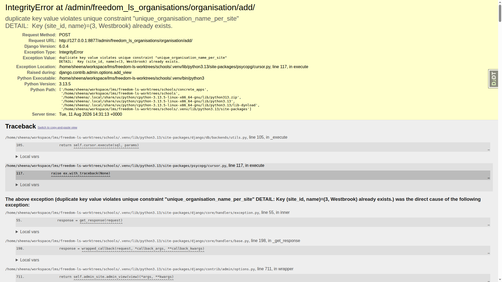

---

### 2. Duplicate cohort name within an organisation returns a 500 — and the user sees nothing at all

**Test:** §6.7 · **Persona:** superuser · **URL:** `POST /educator/organisations/northside/cohorts/__actions/create_cohort`

Creating a second `Year 10 Science` inside Northside fails with a 500. Because HTMX does not swap a
non-2xx response, **the modal simply sits there with no message, no toast and no field error** — the
user gets no feedback whatsoever that the save failed. The only trace is in the console:
`Response Status Error Code 500 from …/__actions/create_cohort`.

- **Expected:** a validation error, not a 500 (§6.7 names this explicitly).
- **Actual:** HTTP 500 `IntegrityError`, silently swallowed by the UI.

Same root cause as failure 1: a DB-level uniqueness constraint with no model- or form-level validation.

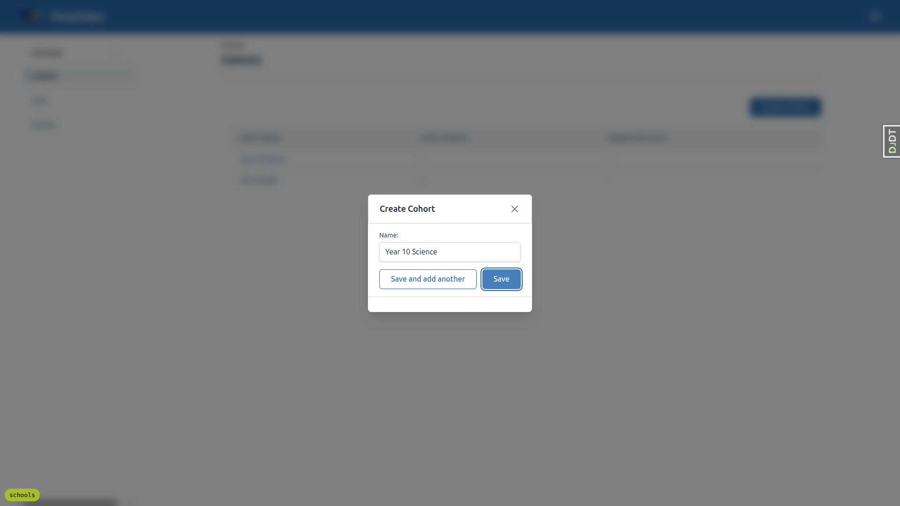

Note the positive half of this test passed: creating `Year 10 Science` in Northside while RPAS Training
already had one **worked**, which is the narrowed constraint doing its job (§6.3–6.5).

---

### 3. A non-UUID cohort id in the URL returns a 500 instead of a 404

**Test:** related to §3.6 · **URL:** `/educator/organisations/northside/cohorts/create` (any non-UUID segment)

- **Expected:** a plain 404, as §3.6 requires for URLs that do not exist.
- **Actual:** HTTP 500 `ValidationError: ['"create" is not a valid UUID.']`

Also reproduced with `/cohorts/new` and `/cohorts/__create`. §3.6's own check passed —
`/educator/organisations/northside/not-a-section` gives a clean 404 ("Unknown path segment") — so the gap
is specifically the segment after `/cohorts/`, which is fed to a UUID lookup without being validated first.

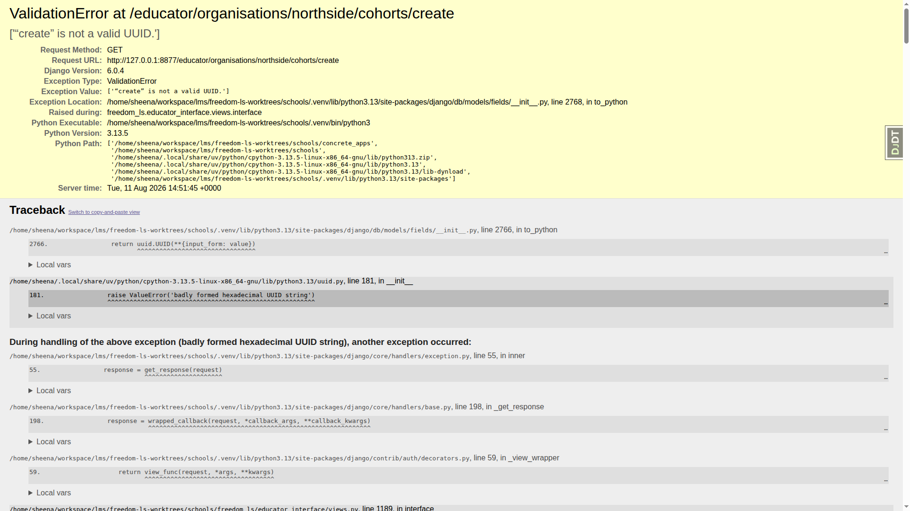

---

### 4. `#scope-announcer` is destroyed and recreated on every switch

**Test:** §3.9 step 15 · **Persona:** `org.educator@example.com`

The live region is correctly placed **outside** `#main-content` (it lives at `#interface-main >
#scope-announcer`, while `#main-content` is a nested descendant), so it survives the main swap. Its text
updates correctly to "Now viewing Northside". But the element itself is replaced.

- **Expected:** the text content changes and the element itself is not removed and re-added.
- **Actual:** a `MutationObserver` on `#interface-main` records a `childList` **add** and a **remove** of
  `#scope-announcer` on each switch. A `data-qa-tag` attribute set immediately before the switch is gone
  afterwards, and node identity differs (`newNode === oldNode` is `false`).

This is exactly the failure mode the test plan warns about: some screen readers do not announce a live
region that is torn down and rebuilt. The out-of-band fragment needs to swap the announcer's *contents*
rather than its `outerHTML`.

---

### 5. Organisation educators get no link to the educator interface

**Test:** §2.5 steps 8–9, §8.5 · **Personas:** `org.educator`, `single.org`, `legacy.educator`

The header user menu offers "Educator Interface" **only** to `demodev@email.com` (superuser). Measured
across every persona:

| Persona | Can load `/educator/` | "Educator Interface" in user menu |
| --- | --- | --- |
| `org.educator@example.com` | yes | **no** |
| `single.org@example.com` | yes | **no** |
| `legacy.educator@example.com` | yes | **no** |
| `no.access@example.com` | no (404) | no — correct |
| `demodev@email.com` | yes | yes |

- **Expected:** the link is present for users who can use the interface, and lands on `/educator/`.
- **Actual:** every organisation-scoped educator must know and type the URL by hand.

`freedom_ls/base/templates/partials/header_bar_user_menu.html:20` gates the link on
``. That gate predates this branch, **but this branch edited those exact lines** —
commit `fa7cfe3e` ("[batch 7] Scope educator URLs to an organisation…") changed
`` to `` and left the
condition untouched — and the branch's own `upgrade_notes.md` states that `is_staff` no longer implies
educator access. The interface's real gate is `organisations_accessible_to(user)`
(`freedom_ls/student_management/queries.py:105`), which is the condition the template should use.

Where the link *is* shown it works correctly (`/educator/` → redirect, no `NoReverseMatch`).

---

### 6. The switcher trigger is last in the tab order, not first

**Test:** §3.9 steps 2, 5–6 · **Persona:** `org.educator@example.com`

- **Expected:** the switcher trigger receives a visible focus ring **before** the section nav.
- **Actual:** tabbing from the top of the document reaches
  `Cohorts → Users → Courses → Year 10 Science → Year 9 Maths → FirstClass → user menu → **Switch
  organisation** → (wraps)`. The control that sits visually at the very top of the left panel is the last
  thing a keyboard user reaches.

Secondary: **arrow keys do not move focus between the menu options** once the menu is open (focus stays
on the trigger). `Tab` does move between them, so keyboard-only operation still completes the whole flow —
verified end to end: focus trigger → `Enter` → `Tab` → `Enter` on Northside switches successfully. But
`role="menu"` implies arrow-key support, and its absence is a rough edge.

Everything else in §3.9 passes: `aria-haspopup="menu"`, `aria-expanded` toggling correctly,
`role="menuitemradio"` with `aria-checked` true/false on the right items, and `Escape` closing the menu
and returning focus to the trigger.

---

### 7. RESOLVED — not a defect: the test plan named the wrong persona for §6

**Test:** §6, §8.1 step 9 · **Persona:** `org.educator@example.com`

§6 named `org.educator` as the persona who creates a cohort. That user has no "Create Cohort" button at
all, in either organisation. Probing the endpoints directly as that user:

| Request | Status |
| --- | --- |
| `GET …/northside/cohorts/__actions/create_cohort` | **403** |
| `GET …/rpas-training/cohorts/<own-cohort>/__actions/delete` | **403** |
| `GET`/`POST` `…/southgate/cohorts/__actions/create_cohort` | 404 — correct, and nothing was created |

**Decision: the spec is right and the test plan was wrong.** `organisation_staff` is view-only by
design — the spec gives it exactly `frozenset({"freedom_ls_organisations.view_organisation"})`, and
`roles.py:67-73` implements that verbatim. §6 and §8.1(9) have been corrected to name the superuser,
which is how they were actually executed (results under Passes). The 403s above are the intended
behaviour of a view-only role, and isolation is intact throughout.

Two code-level facts make it clear that adding permission strings to the role would not have been the
fix either:

- **No non-superuser can create a cohort today, whatever their role.**
  `CreateInstanceAction.has_permission` (`panel_framework/actions.py:151-160`) calls
  `request.user.has_perm(f"{app_label}.add_{model_name}")` with **no object**. Guardian's
  `ObjectPermissionBackend` returns `False` for an objectless check, and the only other backend in
  `AUTHENTICATION_BACKENDS` (`config/settings_base.py:274-279`) is `ModelBackend`, which reads Django
  `Group`s and `user_permissions` — nothing outside the admin fieldsets and one test populates either.
  So this gate is a broader limitation of the panel framework, not something specific to
  `organisation_staff`.
- **Cohort permissions on an object-scoped role could never reach guardian anyway.**
  `sync_user_object_permissions` (`role_based_permissions/utils.py:140-189`) filters a role's
  permissions through `_filter_perms_for_content_type` down to those whose content type matches the
  *target object*. A role assigned on an Organisation can therefore only ever sync
  `freedom_ls_organisations.*` permissions. The docstring of `cohorts_visible_to`
  (`student_management/queries.py:130-145`) documents this deliberately and does the
  organisation-to-cohort join in Python instead. The same applies to `site_admin`, which lists
  `add_cohort`/`change_cohort`/`delete_cohort` (`roles.py:26-29`) but is `SCOPE_SITE` and so is synced
  against a `Site` object — those three permissions never land in guardian either.

Organisation-scoped cohort management is therefore a **future feature, not a regression**: it needs an
object-aware permission check in `panel_framework`, not extra permission strings on a role. A
`# FUTURE:` note recording this now sits beside the role in `roles.py`.

---

### 8. Mobile/tablet: the navigation drawer stays open after switching organisation

**Test:** extension of §3.3 step 5 to small screens

On desktop the dropdown correctly closes after a switch. On mobile (375px) and tablet (768px) the switch
succeeds — URL, switcher label, data and announcer all update — but the whole navigation drawer remains
open over the newly-loaded content, which stays dimmed behind it. The user has to dismiss the drawer
manually to see the organisation they just switched to.

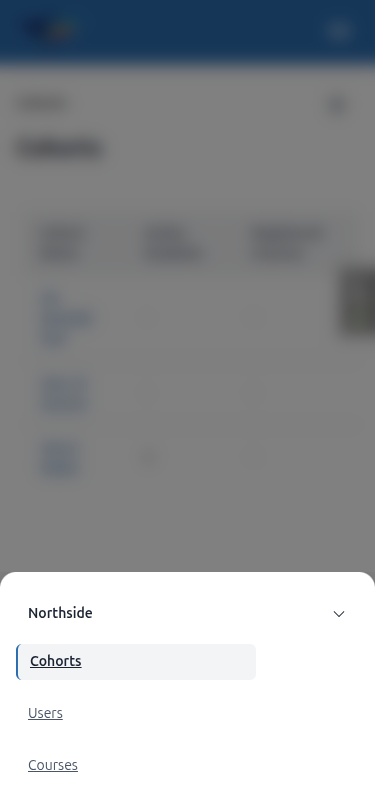

---

### 9. Educator interface pages have an empty `<title>`

Every `/educator/…` page returns `document.title === ""`, so the browser tab and any bookmark are blank.
Tangential to Organisations but consistent across all educator pages, including the newly
organisation-scoped ones.

---

## Not executed / partially executed

### §7.6 — "No registration, no logo" cannot be reached

`no.reg.learner@example.com` is redirected away from the player for **every** course. Verified live on
three courses:

| URL requested | Landed on |
| --- | --- |
| `/courses/standard-markdown-demo-finance/1/` | `/courses/standard-markdown-demo-finance/detail/` |
| `/courses/content-widgets-demo-reference/1/` | `/courses/content-widgets-demo-reference/detail/` |
| `/courses/functionality-demo-show-end-with-quiz/1/` | `/courses/functionality-demo-show-end-with-quiz/detail/` |

Content access requires a registration, so "logged in, inside the player, with no registration" is a state
the application does not produce. The `fls-dev:qa-data-helper` agent independently confirmed this cannot be
set up with data alone — it would need a temporary code or access-backend change. The scenario may simply
be moot rather than untested.

### §7.3 — the second theme was verified by tokens, not by rendering

The active theme is compiled into `static/vendor/tailwind.output.css`, so switching it requires
`write_active_theme_css` plus a Tailwind rebuild — an asset change I did not make during QA.

The `default` theme was verified live and the logo is clearly legible. For `first_class` I checked the
theme tokens directly, which answers the actual concern (a chip that is only padding would let a
transparent near-black mark vanish):

| Theme | `--color-surface` (the chip) | `--color-sidepanel` (behind it) |
| --- | --- | --- |
| `default` | `#FFFFFF` | `#FFFFFF` |
| `first_class` | `#F8F9FC` | `#FFFFFF` |

The chip's computed background is `rgb(255, 255, 255)` at **alpha 1** with a 1px border — a genuinely
opaque fill, not bare padding. Both themes give it a light opaque ground, so the mark reads on either.

One deviation from §7.3 step 5: under `default` the chip background and the surrounding panel are *both*
`#FFFFFF`, so the chip is not "visibly distinct from the surrounding" — only the 1px grey border separates
them. Legibility of the mark itself is unaffected.

### §7.8 — no N+1 observed, but not proven query-by-query

Query counts on the player were stable and tracked outline size rather than the logo: 34 queries on item 1,
34 on item 4 (4 outline items each), 40 on item 6 (5 outline items). Nothing suggests a per-outline-item
organisation lookup. I could not extract the per-query SQL list from the Debug Toolbar panel to confirm
exactly one `SELECT … FROM …_organisation`, and there is no pre-change baseline on this branch to compare
against, so this is "no evidence of a regression" rather than a proof.

### §4.3 — `__panels` URLs never appeared

The seeded data produced `__tabs` and `__actions` partials but no `__panels` request on any page I visited.
Both shapes that did appear were tested cross-organisation and 404 correctly (see Passes). `__panels`
remains untested only because nothing emitted one.

---

## Known behaviour, confirmed — not filed as bugs

Per §9 of the test plan:

- **The switcher closes on window scroll (§3.10).** Confirmed: `aria-expanded` goes `true` → `false` on
  scroll. In practice this is mild at desktop sizes — the sidebar is short and the window rarely scrolls on
  the list pages where you would use the switcher. It becomes noticeable only on a shortened viewport, where
  the menu can vanish mid-reach. Inherited from `c-dropdown-menu` and tracked by an existing `@claude`
  comment; not worked around.
- **Courses shows the same list in every organisation (§8.2).** Confirmed, and the URL still carries the
  Northside slug with the switcher correctly labelled.
- **The outline logo is behind a dialog on small screens (§7.7).** Confirmed and working well — see below.

---

## Passes

### §1 Admin

| Test | Result |
| --- | --- |
| 1.1 Organisation changelist renders with the **unfold** theme, Name + Slug columns | pass — sidebar, chrome and styling all correct; no plain-Django fallback |
| 1.2 Add form shows Name + Logo, read-only Slug, **no Site field** | pass |
| 1.3 Slug collision → `westbrook-2` | pass |
| 1.4 Name uniqueness | **FAIL — see failure 1** |
| 1.5 Rename does not change the slug | pass — "Westbrook Academy" kept slug `westbrook` |
| 1.6 Delete unavailable | pass — no Delete button, no action dropdown at all, direct `/delete/` URL → **403** |
| 1.7 Guardian object permissions | pass — page renders styled with a user lookup; granting `view_organisation` saved and persisted on reload |
| 1.8 Logo happy path | pass — stored as `organisations/<uuid>.png`, no trace of the uploaded filename |
| 1.9 Logo rejections | pass — all 9 cases, see below |

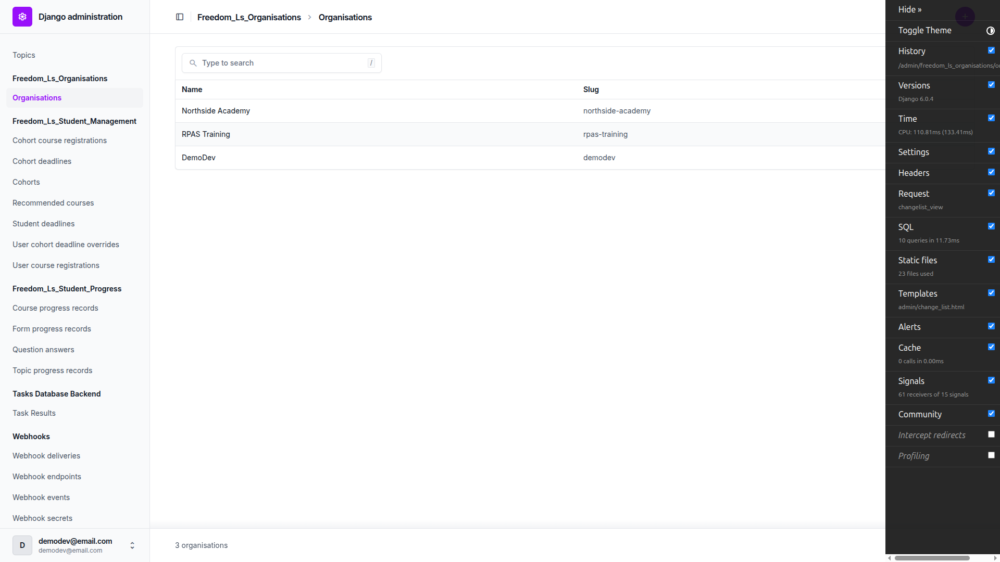

Every §1.9 rejection produced a field-level error and left the existing logo **unchanged**:

| Upload | Message |
| --- | --- |
| `.gif` | "File extension "gif" is not allowed. Allowed extensions are: png, jpg, jpeg, webp." + "Image format GIF is not supported…" |
| `.bmp` | equivalent, naming BMP |
| `.txt` | "Upload a valid image. The file you uploaded was either not an image or a corrupted image." |
| real `.svg` as `.svg` | rejected |
| **real `.svg` renamed `.png`** | **rejected** — the byte-level check works, not just the filename filter |
| 5000×5000 PNG | "Image is too large (5000x5000px; maximum is 4000x4000px)." |
| 1×1 PNG | "Image is too small (1x1px; minimum is 64x32px)." |
| 11.5 MB PNG | "Image file is too large (11.5MB; maximum is 2MB)." |
| truncated PNG | "Upload a valid image…" — no traceback |

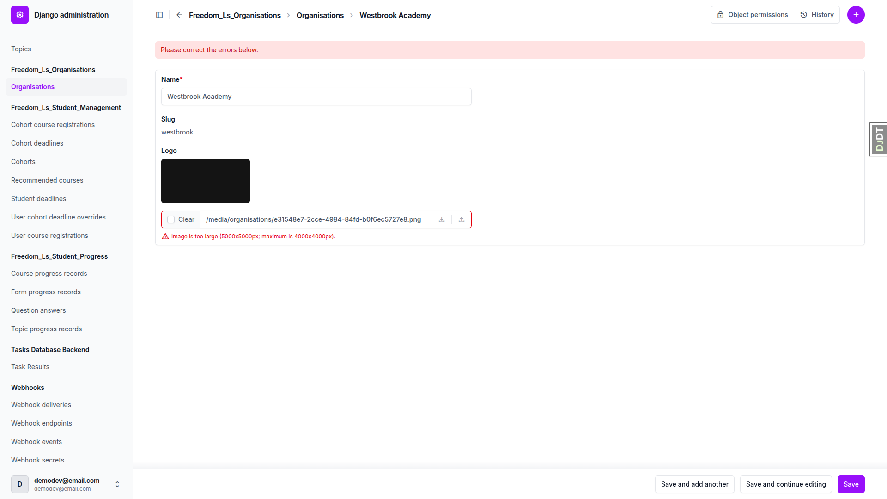

Minor note: the `.txt` case is caught by the image decoder rather than the extension validator, so its
message does not name the allowed formats. It is still a clear field-level error and does not save.

### §2 Educator URLs and access — all pass

- **2.1** `/educator/` → `/educator/organisations/northside/cohorts` (a concrete slug).
- **2.2** `org.educator` returns to its remembered Northside; `single.org` lands on **RPAS Training**, not
  the remembered Northside — the re-authorisation check passes.
- **2.3** `no.access@example.com` → **404** (not a 500, not an empty interface, not a loop).
- **2.4** unknown slug, real-but-unauthorised `southgate`, and invalid characters all → **404**. Both 404s
  are genuine `Http404` responses rendered by the same handler; the only textual difference is inside
  Django's DEBUG-only technical 404 page, which is not shown in production, so organisation names are not
  enumerable.
- **2.5** Every absolute `/educator/…` link on the cohorts list, cohort detail, users list and courses list
  carries the organisation segment (the only exceptions are relative query-only links such as `?page=2` and
  `?sort=first_name`, which resolve against the current URL and therefore keep it). All four pages load 200.
- **2.6** Back ×4 and Forward ×4 through Cohorts → cohort → Users → user each returned the correct page with
  the correct organisation and content; the URL and displayed data never disagreed. Reload on a deep page
  re-rendered identically.

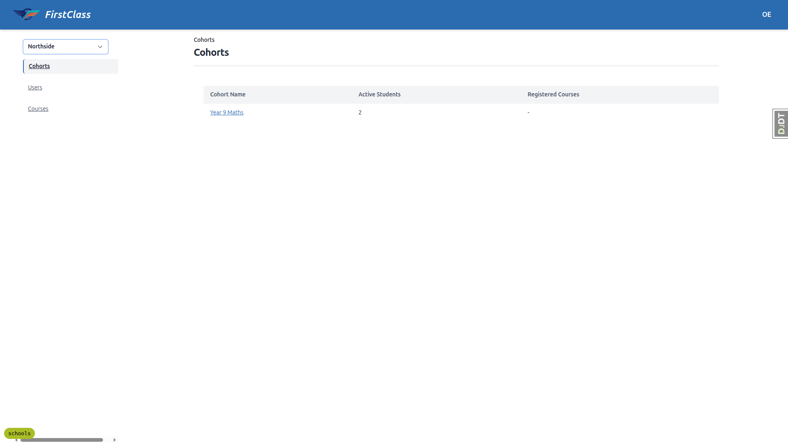

### §3 The switcher

- **3.1** Present at the top of the left panel, above the section nav, always naming the current
  organisation — never a placeholder.
- **3.2** `single.org` gets a **static ``** in the same position (top 96px, above the nav at 140px):
  no chevron, no button, `cursor: auto`. Clicking it does nothing — no menu, no navigation, **no console
  errors**.
- **3.3** Lists RPAS Training and Northside only; **Southgate never appears**. Switching reloads in place,
  the URL becomes `/educator/organisations/northside/cohorts`, the list shows Northside's Year 9 Maths, the
  dropdown **closes**, and reload keeps Northside. Critically, **the switcher's own label updates** in both
  directions — the chrome-disagrees-with-data failure this feature exists to prevent does not occur.
- **3.4** Switching from RPAS's "Year 9 Maths" detail (a name that exists in both organisations) lands on
  the Northside cohorts list with the notice *"Switched to Northside — that cohort isn't in this
  organisation"*. Label and data agree.
- **3.5** From a cohort with no counterpart: no bare 404, lands on the Northside cohorts list, notice shown,
  address bar is the list URL. **Back** returns to the RPAS cohort detail, correctly rendered. Repeating
  from a **user** detail page behaves identically, with *"…that user isn't in this organisation"*.
- **3.6** `/educator/organisations/northside/not-a-section` → plain **404** ("Unknown path segment"), with
  **no** switch notice. The switch handler is not catching unrelated 404s.
- **3.7** A foreign cohort id hand-pasted under Northside → plain **404**, no notice.
- **3.8** Two tabs stayed independent throughout: tab A reloaded as RPAS Training while tab B was deep in a
  Northside cohort; after switching tab A to Northside both tabs were independently correct. No session leak.
- **3.9** DOM contract correct (see failure 6 for the two keyboard gaps).

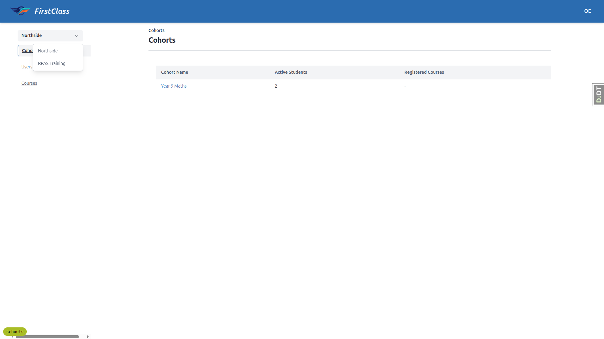
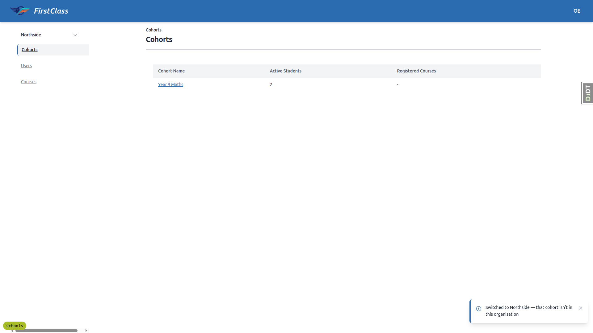
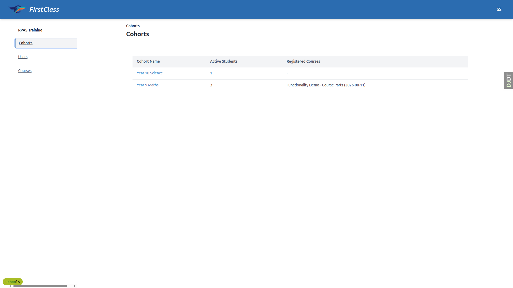

Minor observation: the open dropdown does not visually mark the current organisation — `aria-checked` is
set correctly, but there is no checkmark or highlight for sighted users.

### §4 Cross-organisation isolation — all pass

**4.1** Perfect mirror image, no overlap:

| | Cohorts | Users |
| --- | --- | --- |
| RPAS Training | Year 10 Science, Year 9 Maths | Ada Kruger, Cara Learner, Priya Naidoo, Tom Fischer |
| Northside | Year 9 Maths (Northside's) | Neo Dlamini, Nina Botha, Sol Individual |

Northside's identically-named "Year 9 Maths" never appears under RPAS Training, and no Northside-only
learner leaks into the RPAS user list.

**4.2 / 4.3 / 4.4** — every foreign or unauthorised request returned **404**:

| Request | Status |
| --- | --- |
| Northside cohort id under `rpas-training` | 404 |
| Northside-only user id under `rpas-training` | 404 |
| RPAS cohort id under `northside` | 404 |
| RPAS-only user id under `northside` | 404 |
| `…/northside/cohorts/<rpas-id>/__tabs/details` | 404 |
| `…/rpas-training/cohorts/<northside-id>/__tabs/details` | 404 |
| `…/rpas-training/cohorts/<northside-id>/__tabs/course-progress` | 404 |
| `…/rpas-training/cohorts/<northside-id>/__actions/delete` | 404 |
| `GET` + `POST` `…/southgate/cohorts/__actions/create_cohort` | 404 (nothing created) |
| `…/southgate/cohorts`, `/users`, `/courses` | 404, 404, 404 |

### §5 The legacy-educator path — passes completely

This is the upgrade-safety check, and it holds end to end for `legacy.educator@example.com` (no
organisation role, one per-cohort `view_cohort` grant):

| Step | Result |
| --- | --- |
| `/educator/` | **200**, redirected into RPAS Training — not a 404 |
| Cohorts list | exactly **"Year 9 Maths"** — the one cohort they hold a grant on |
| Granted cohort detail | 200 |
| Ungranted RPAS cohort detail ("Year 10 Science") | **404** — no organisation-wide access |
| Switcher | **static text** "RPAS Training" |
| Users list | only the three members of Year 9 Maths |

### §6 Creating a cohort (run as superuser — see entry 7)

- **6.2** The modal shows a **Name field and no organisation selector**; the form posts to
  `/educator/organisations/northside/cohorts/__actions/create_cohort`, so the organisation comes from the
  URL. Pass.
- **6.3–6.5** Creating `Year 10 Science` in Northside **succeeded** despite RPAS Training already having a
  cohort of that name on the same Site — the narrowed constraint works — and landed on the new cohort's
  detail page under `/organisations/northside/`. Pass.
- **6.6–6.7** **FAIL — see failure 2.**
- **6.8–6.9** The new cohort does **not** appear in RPAS Training's list. Pass.
- **6.10–6.11** "Save and add another" kept the modal open with the name field cleared; both cohorts landed
  in Northside and neither appeared in RPAS Training. Pass.

### §7 Player co-branding

- **7.1** The RPAS Training logo sits in the outline header between the course title and the progress bar,
  rendered at 48×22 against a 66×32 site logo — clearly secondary. It is inside an opaque chip
  (`bg-surface` + 1px border + padding), is **not** a link (`cursor: auto`, no ancestor `<a>`), and carries
  `alt="RPAS Training"`.
- **7.2** Exactly **one** chip in all ten states tested — five consecutive `Next` clicks (each an OOB
  outline swap), four direct item loads and three browser `Back` steps. Never duplicated, never lost. The
  current-item highlight moved correctly each time. (A "Previous" button does not exist on form-type items,
  so the reverse direction was exercised via outline links and browser Back.)
- **7.3** Pass — see the Not-executed section for the theme caveat.
- **7.4** Width and height are capped:

| Uploaded | Rendered | Chip | Outline header height | Horizontal scroll |
| --- | --- | --- | --- | --- |
| 3000×300 banner | 110×22 | 128×32 | 155px (unchanged) | none |
| 300×3000 crest | 2×22 | 20×32 | 155px (unchanged) | none |

  The header never grew, never overflowed and never pushed the progress bar off-screen.

- **7.5** The monogram fallback is correct in every case:

| Organisation name | Badge |
| --- | --- |
| `Northside` (no logo) | **"NO"** — single token, first two letters |
| `Northside Academy` | **"NA"** — two tokens, first letter of each |
| `123` | **generic icon** — an SVG, not an empty box, not "12", no crash |
| `RPAS Training` with its logo removed | **"RT"** |

  The badge is `inline-flex h-8 w-8 items-center justify-center rounded-full bg-surface-2` — the same round
  32px shape and weight as the header user-initials badge — and carries an `aria-label` naming the
  organisation.

- **7.6** Not reachable — see Not-executed.
- **7.7** Pass. At 375px the outline moves behind a dialog and the logo is no longer permanently on screen
  (expected and accepted). Opening "Open course outline" shows the chip correctly sized at 66×32, fully
  inside the panel, with no overflow and no horizontal scrolling.
- **7.8** No evidence of an N+1 — see Not-executed.

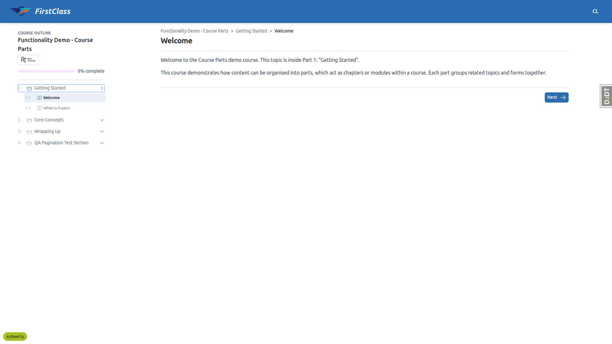

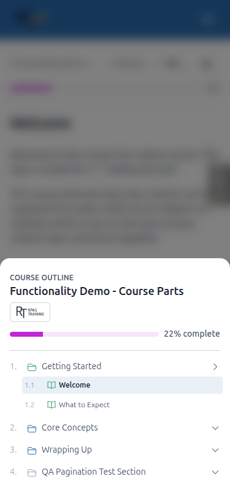

### §8 Regression sweep

- **8.1** Both cohort tabs load their panels. Search filters correctly (four users → one) with the
  organisation intact. Sorting works and keeps the organisation. Pagination advances through the courses
  list with the organisation and switcher label intact (the pagination links' `hx-get` carries the full
  organisation-scoped URL). The delete instance action worked as a permitted user and redirected back to
  that organisation's cohorts list with the cohort gone.
- **8.2** Courses shows the identical list under both organisations, the URL keeps the Northside slug, and
  the switcher still reads "Northside". Intended behaviour, confirmed.
- **8.3** **Self-registration still works** — the most likely place the new mandatory organisation FK could
  have broken an existing flow. "Enrol for free" registered the learner and dropped them straight into the
  player at `/courses/qa-published-free-visibility/1/` with **no 500**. The outline header showed the
  Site's own organisation as the **"DE"** monogram (`aria-label="DemoDev"`). Registering again was a clean
  no-op — no duplicate error, no 500.
- **8.4** Completing a topic moved progress 0% → 100%; the cohort learner's dashboard showed the in-progress
  course at 22% under "In Progress" with the rest under "Available courses", and **no duplicates**.
- **8.5** The header user menu opens and closes with `Escape` for every persona (see failure 5 for the
  missing link).
- **8.6** The Cohort change page renders with the unfold theme, shows an **Organisation** field and **no
  Site field**, and keeps a working object-permissions link. A User course registration shows an
  Organisation and saved without error.

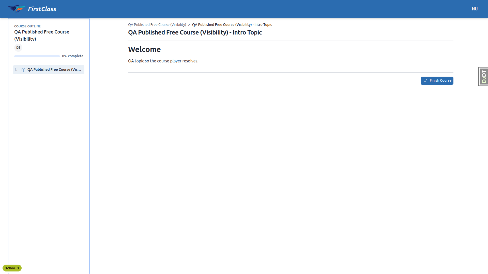
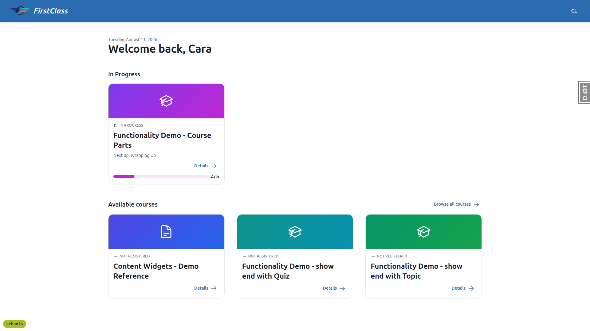

### Mobile (375×812) and tablet (768×1024)

No horizontal scrolling anywhere on either viewport, and no overflowing elements. The navigation collapses
behind an "Open navigation panel" button; the switcher sits at the top of the drawer as a full-width
control (343px on mobile, 736px on tablet) and switching works end to end — URL, label, data and announcer
all update — apart from the drawer staying open afterwards (failure 8).

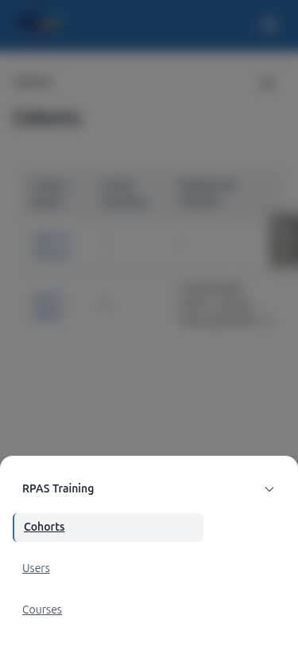
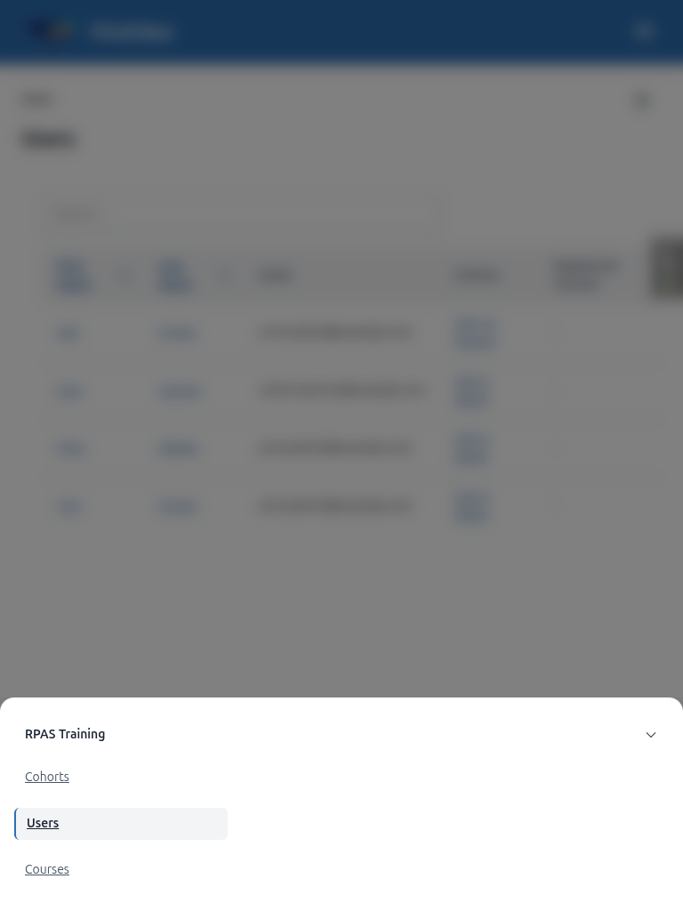

Touch targets: most controls are comfortable, but cohort and user links inside the tables are roughly
39–47 × 37px, under the 44×44 guideline. Pre-existing table styling rather than anything this feature
introduced.

**Breakpoint note:** the persistent desktop nav only appears at **≥1024px**. At 768px, 820px and 900px the
interface uses the mobile hamburger drawer, so an iPad in portrait — and many tablets in landscape — get
the mobile navigation rather than the desktop sidebar.

---

## Environment notes and QA residue

- **A signup-policy gate was cleared to make testing possible.** DemoDev's
  `SiteSignupPolicy.additional_registration_forms` still contained `PhoneNumberForm`, left over from
  `qa_create_incomplete_registration_learner`. `RegistrationCompletionMiddleware` redirects every
  authenticated non-superuser to the registration-completion page on any non-exempt URL, which would have
  blocked all seven personas from reaching any educator or player page. The `fls-dev:qa-data-helper` agent
  emptied that list; the policy row and `require_terms_acceptance=True` are untouched. **Re-run
  `qa_create_incomplete_registration_learner` to restore it.**
- **Data left behind in the dev database:** organisations `Westbrook Academy` (slug `westbrook`, with a test
  logo) and `Westbrook.` (slug `westbrook-2`) from §1.2–1.5; Northside cohorts `Year 10 Science` and
  `QA Saveadd One` from §6; and a registration for `no.reg.learner@example.com` on
  `qa-published-free-visibility` from §8.3. RPAS Training's `RT-logo.webp` and Northside's no-logo state
  were both restored after §7.4 and §7.5.
- The seeding command the agent wrote is at
  `freedom_ls/qa_helpers/management/commands/qa_create_organisation_scenarios.py`. Nothing was committed.
