# QA Report: Organisations

Manual browser QA of `3. frontend_qa.md`, executed with Playwright MCP against
`uv run python manage.py runserver 8000` on branch `schools` (debug-branch-badge confirmed `schools`
on every viewport).

Viewports exercised: desktop 1920×1080, mobile 375×812, tablet 768×1024.

**Headline: no defects found.** Every section of the plan was executed and passed. All **nine** defects
recorded in the previous QA run were re-tested specifically and are confirmed fixed — including the
three 500s, the destroyed-and-recreated live region, the missing educator-interface link, the switcher
keyboard behaviour, and the mobile drawer that stayed open after a switch.

The security-relevant sections are the strongest part of the feature. Cross-organisation isolation
(§4) holds on lists, detail URLs and every HTMX partial shape (`__tabs`, `__panels`, `__actions`). The
legacy-educator upgrade path (§5) — the check that would lock every existing educator out on upgrade —
passes completely. The switcher never lets the chrome disagree with the data (§3.3–3.5), and the
"wrong organisation" soft-landing fires *only* for a genuine organisation mismatch, even when a
hand-forged request carries the switch header (§3.6).

One test, **§7.6, could not be performed** — not for want of data, but because the state it describes
is unreachable through the browser. Details in *Not executed* below.

Test data came from the previous run's `qa_create_organisation_scenarios` seeding; the two gaps found
during this run were filled by the `fls-dev:qa-data-helper` agent.

---

## Failures

**None.** No test in the plan failed.

---

## Previous defects: re-verified

Each of these was re-tested directly rather than assumed.

| # | Previous defect | Result this run | Evidence |
| --- | --- | --- | --- |
| 1 | Duplicate Organisation name → 500 `IntegrityError` | **Fixed.** Field-level error: *"Organisation with this Site and Name already exists."* | 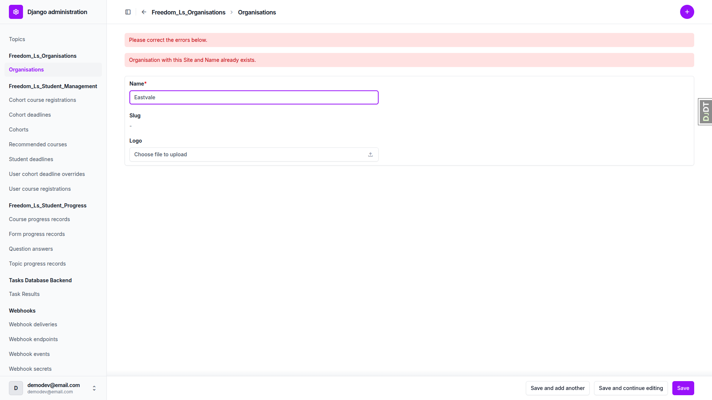 |
| 2 | Duplicate cohort name in an organisation → 500, no feedback | **Fixed.** Modal stays open with an inline error: *"Cohort with this Site, Organisation and Name already exists."* | 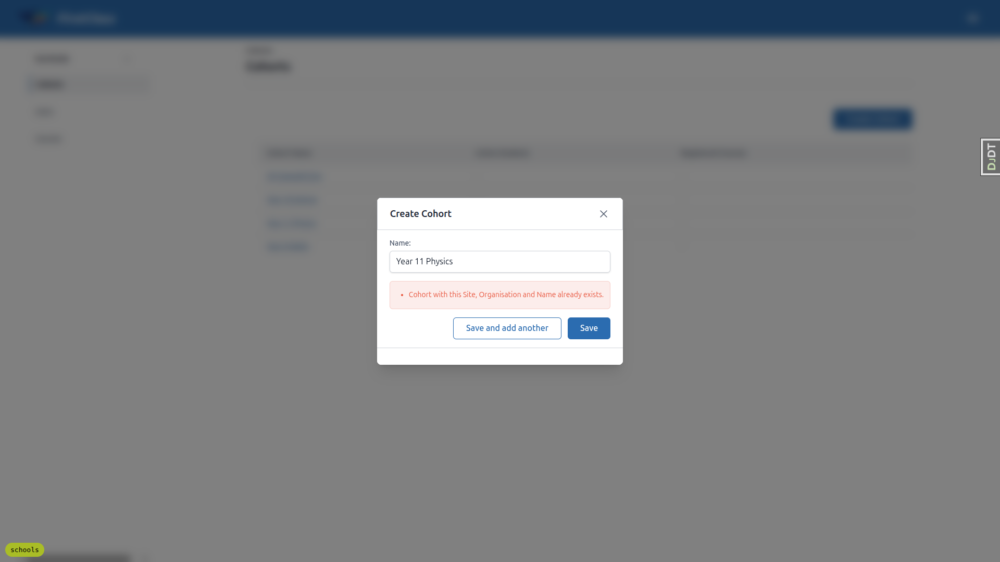 |
| 3 | Non-UUID cohort id segment → 500 `ValidationError` | **Fixed.** `/cohorts/not-a-uuid` returns a plain 404. | — |
| 4 | `#scope-announcer` destroyed and recreated on every switch | **Fixed.** I tagged the live-region element with a JS property, performed a switch, and the *same* element survived (`sameElement: true`) with its text updated to "Now viewing Northside". | — |
| 5 | Educator Interface header link hidden from organisation educators | **Fixed, and correctly scoped.** `org.educator` sees the link and it works; `no.access` (no educator rights) correctly does **not** see it, so nobody is offered a link into a 404. | — |
| 6 | Switcher trigger last in tab order; arrow keys dead | **Fixed.** Third Tab from the top of the page lands on the switcher, *before* the section nav, with a visible focus ring. ArrowDown/ArrowUp move between options; Escape closes and returns focus to the trigger. | 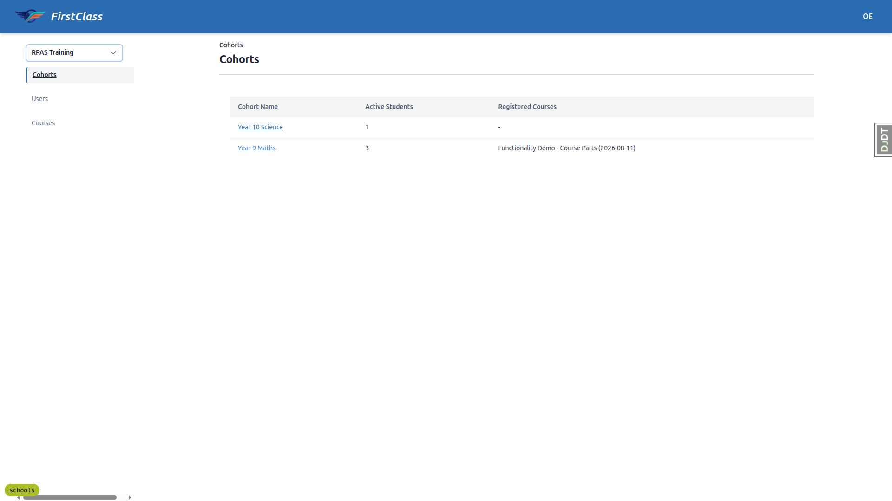 |
| 7 | `organisation_staff` cannot create cohorts | Confirmed **not a defect** — view-by-design. §6 run as the superuser per the corrected plan. | — |
| 8 | Mobile/tablet drawer stays open after a switch | **Fixed** at both 375px and 768px: the drawer is closed after the switch and the new organisation's data is on screen. | 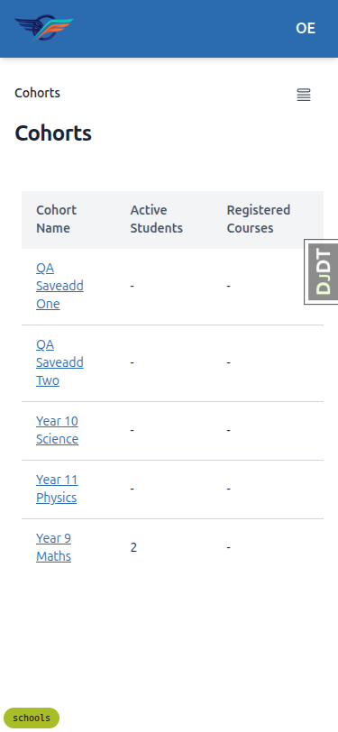 |
| 9 | Empty `<title>` on educator pages | **Fixed.** e.g. `Cohorts — RPAS Training — DemoDev`. (See observation 4 for a lesser residual.) | — |

---

## Section-by-section results

### §1 Admin: organisation management — all pass

- **1.1** Changelist renders with the full unfold theme (sidebar, admin chrome, styled controls) and shows
  Name + Slug for RPAS Training, Northside and Southgate. No sign of a guardian/unfold MRO problem.
  
- **1.2** Add form shows **Name** and **Logo**, **no Site field**, and the **Slug** field is present and
  read-only (renders as `-` before save). Saved `Eastvale` → slug `eastvale`.
  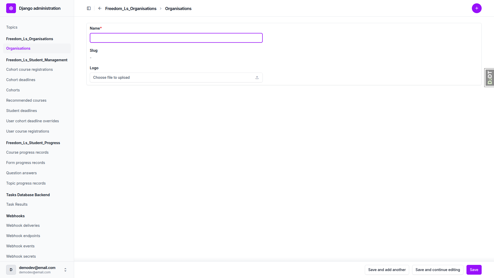
- **1.3** `Eastvale.` (trailing stop) saved with slug `eastvale-2` — collision handled, no error.
- **1.4** Duplicate `Eastvale` → validation error, no 500. *(previous defect 1)*
- **1.5** Renamed `Eastvale` → `Eastvale Academy`; **slug stayed `eastvale`**.
- **1.6** No Delete button on the change page; the changelist has **no actions dropdown and no row
  checkboxes at all**; `.../<id>/delete/` returns **403**.
  
- **1.7** Guardian object-permissions page renders styled, with the user lookup and existing grants
  listed. Granted `view_organisation` to a test user; it persisted across reload.
  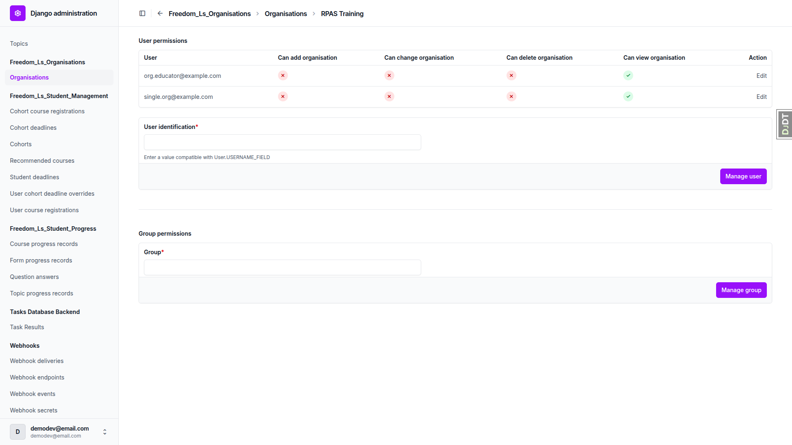
- **1.8** Uploaded `RT-logo.webp` to Northside → stored as
  `organisations/f0fdbf8d-1647-45c4-8bec-dc84c4bfa60a.webp`. **Id-based, no trace of `RT-logo`.**
  Logo removed again afterwards so Northside is logo-less for §4/§7.5.
  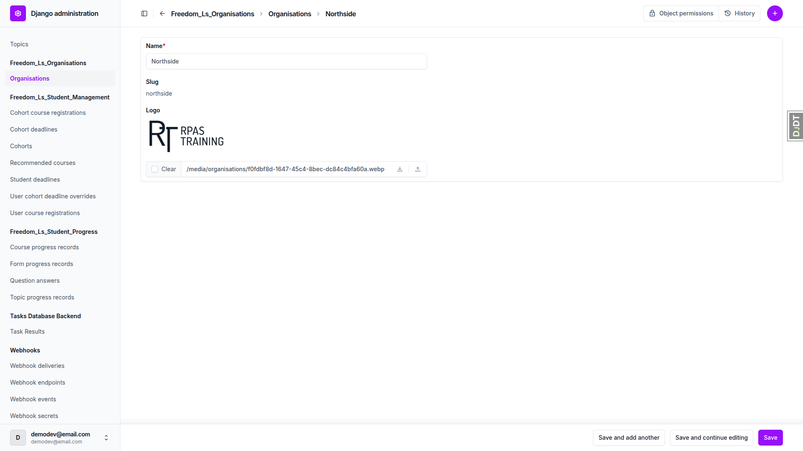

**1.9 — all eight rejection paths pass.** Every one produced a field-level error naming the actual
problem *and* the actual limit, none saved, none produced a 500, and **Northside's existing logo was
still intact after every rejection**.

| Upload | Message |
| --- | --- |
| `.gif` | *File extension "gif" is not allowed. Allowed extensions are: png, jpg, jpeg, webp.* + *Image format GIF is not supported. Use PNG, JPEG or WebP.* |
| `.bmp` | *File extension "bmp" is not allowed…* + *Image format BMP is not supported…* |
| `.txt` | *File is not a readable image. Use PNG, JPEG or WebP.* |
| Real `.svg` as `.svg` | *File is not a readable image. Use PNG, JPEG or WebP.* |
| **Real `.svg` renamed `.png`** | *File is not a readable image…* — **the byte-level check works**: the extension filter passed it and the content check caught it. |
| 5000×5000 PNG | *Image is too large (5000x5000px; maximum is 4000x4000px).* |
| 1×1 PNG | *Image is too small (1x1px; minimum is 64x32px).* |
| 2.6 MiB PNG | *Image file is too large (2.6MB; maximum is 2MB).* |
| Truncated PNG | *File is not a readable image. Use PNG, JPEG or WebP.* |

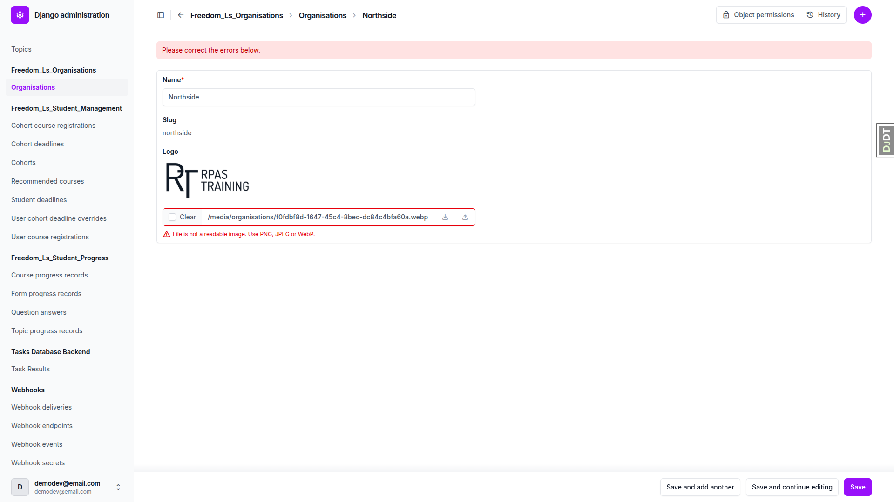

### §2 Educator interface: URLs and access — all pass

- **2.1** `/educator/` redirected to `/educator/organisations/northside/cohorts` — a concrete slug.
  
- **2.2** Last organisation remembered (bare `/educator/` returned to Northside), **and re-authorised**:
  logging in as `single.org` with `northside` still the remembered value landed on **RPAS Training**.
- **2.3** `no.access@example.com` at `/educator/` → **404**. No 500, no empty shell, no redirect loop.
- **2.4** Unknown slug, real-but-unauthorised slug (`southgate`), and an invalid slug (`Not A Slug!`)
  all return **404** from the same view. See observation 3 for a DEBUG-only cosmetic difference.
- **2.5** Every link keeps the organisation segment — cohort detail, Users, **Courses**, breadcrumbs,
  a cohort link from inside the Users table, a user link from inside a cohort panel, and the header
  user-menu link into `/educator/`. No `NoReverseMatch` anywhere.
  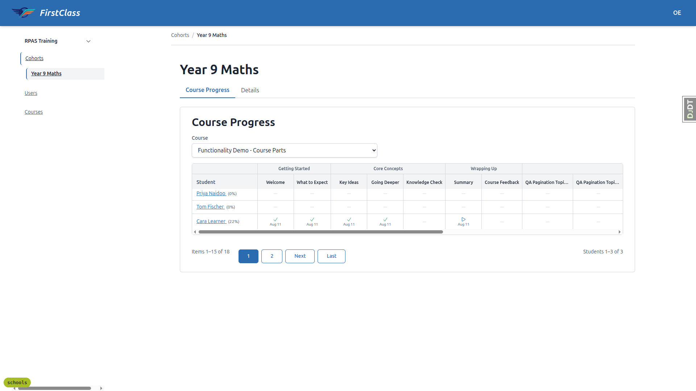
- **2.6** Back ×4 and Forward through Cohorts → cohort → Users → user each restored the correct
  organisation *and* the matching content; deep-link reload re-rendered identically.

### §3 The organisation switcher — all pass

- **3.1** Present at the top of the left panel, above the section nav, naming **RPAS Training** on
  every page (lists, Users, Courses, cohort detail). Never a placeholder.
- **3.2** As `single.org`: **static text in the same position**, no button, no chevron,
  `cursor: auto`; clicking it does nothing and logs no console error.
  
- **3.3** Menu lists exactly RPAS Training and Northside — **Southgate absent**. After switching: URL
  becomes `/organisations/northside/cohorts`, **the switcher's own label updates**, the list shows
  Northside's cohorts, **the dropdown panel closes**, and a reload stays on Northside. Verified in
  both directions.
  
- **3.4** Switching from RPAS Training's "Year 9 Maths" detail lands on the Northside **cohorts list**
  with the Northside label and Northside data. The label and data never disagreed at any point.
- **3.5** The soft landing works and is announced: a toast reads *"Switched to Northside — that cohort
  isn't in this organisation"*, the address bar shows the list URL, and **Back** returns to the
  correctly-rendered RPAS Training cohort detail. Repeated from a **user** detail page: *"…that user
  isn't in this organisation"*.
  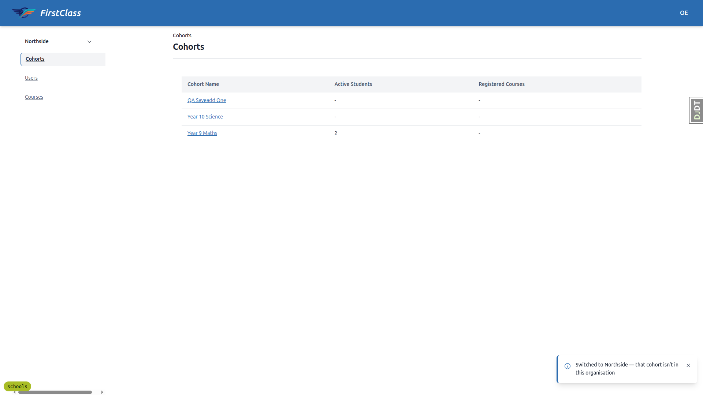
- **3.6** **The switch does not disguise unrelated errors.** Beyond the plain address-bar case, I
  forged requests carrying `X-Organisation-Switch: true`: a nonexistent section
  (`/northside/not-a-section`) and a nonexistent object id both returned **404 with no "switched to"
  notice**. Only a genuine cross-organisation mismatch gets the soft landing.
- **3.7** A hand-pasted foreign cohort URL under Northside → plain **404**.
- **3.8** Two tabs, two organisations: after tab B navigated inside Northside, reloading tab A still
  showed **RPAS Training** and its cohorts — no session leak. Switching tab A to Northside then
  reloading both left each tab independently correct.
- **3.9** Keyboard-only operation completes the whole flow. ARIA verified in the DOM: trigger has
  `aria-haspopup="menu"` and `aria-expanded` toggling `false`/`true`; each option is
  `role="menuitemradio"` with `aria-checked="true"` on the current organisation and `"false"` on the
  others; `
` exists
  **outside `#main-content`** and, critically, **is not destroyed and recreated on a switch**.
- **3.10** Confirmed: opening the menu and scrolling the window closes it (`aria-expanded` true → false
  after a 250px scroll). Filed as known, not a bug — see *Known and not bugs*.

### §4 Cross-organisation isolation — all pass

- **4.1** RPAS Training's cohorts list shows only its own (Year 10 Science, Year 9 Maths); Northside's
  same-named "Year 9 Maths" is a different object and does not appear. Users lists are **disjoint**:
  RPAS Training shows Ada/Cara/Priya/Tom; Northside shows Neo/Nina/Sol. Mirror image confirmed.
  
- **4.2** A Northside cohort id under `rpas-training` → 404. A Northside-only user id under
  `rpas-training` → 404.
- **4.3** Foreign HTMX partials **all 404**, verified for each shape:
  `…/rpas-training/cohorts/<northside-id>/__tabs/details` → 404,
  `…/__tabs/details/__panels/students` → 404,
  `…/__actions/delete` → 404, while the correctly-scoped equivalents return 200.
- **4.4** Southgate never appears in the switcher, and `/southgate/cohorts`, `/southgate/users` and
  `/southgate/courses` all return 404.

### §5 The legacy-educator path — all pass

This is the upgrade-safety check and it passes completely.

`legacy.educator@example.com` (no organisation role; one per-cohort guardian grant) at `/educator/`
was redirected **into RPAS Training, not 404'd**. The Cohorts list showed **exactly "Year 9 Maths"** —
the single cohort they hold a grant on, not all of RPAS Training's and not an empty list. That cohort's
detail page loads; another RPAS Training cohort's detail URL returns **404**, so an organisation-less
user gets no organisation-wide access. The switcher is **static text**. The Users list shows only
Year 9 Maths members (Ada Kruger, who is only in Year 10 Science, is absent).

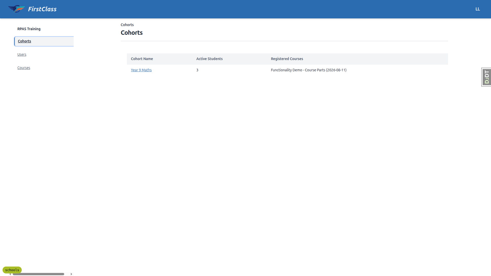

### §6 Creating a cohort — pass (adapted; see observation 2)

- Create Cohort modal shows a **Name field and no organisation selector**.
  
- **The narrowed uniqueness constraint works**: `Year 11 Physics` was created in Northside *and* in
  RPAS Training — same name, same Site, different organisations, both saved.
- A second `Year 11 Physics` **within** Northside produced a validation error, not a 500.
- Creation lands on the new cohort's detail page under `/organisations/northside/`; the Northside
  cohort does not appear in RPAS Training's list.
- **Save and add another** worked: both resulting cohorts landed in Northside.

### §7 Student course player co-branding — pass (7.6 not performable)

- **7.1** RPAS Training's logo appears in the outline header between the course title and the progress
  bar. It renders at **48×22px** inside a **128×32px opaque chip** (`background: rgb(255,255,255)`,
  padding `4px 8px`, 1px border) — small, clearly secondary to the site header, and not a bare
  transparent image. `alt="RPAS Training"`, **not inside a link**, `cursor: auto`.
  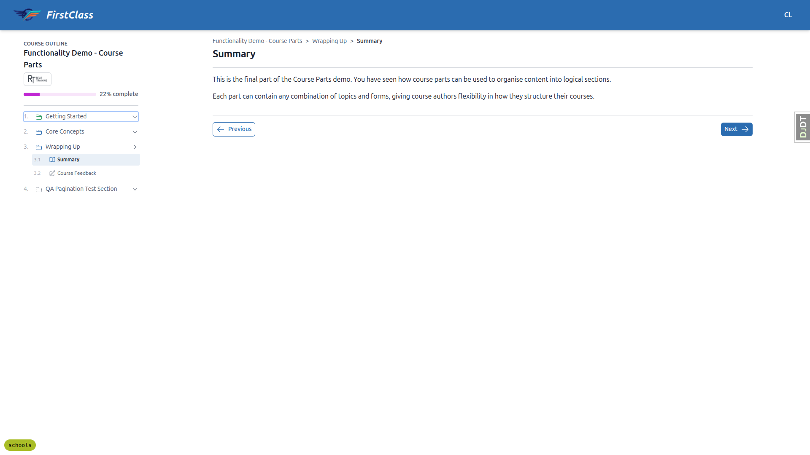
- **7.2** Survives player navigation: after six Next/Previous moves, **exactly one** logo chip every
  time — never two stacked, never lost.
- **7.3** Checked on **both shipped themes**. On `default` (solid blue brand header) and on
  `first_class` (white/frosted header, zero-padded TOC counters) the mark is clearly legible in both
  cases. See observation 5 for a minor note on the chip's fill, and observation 8 for how the theme
  must be switched.
  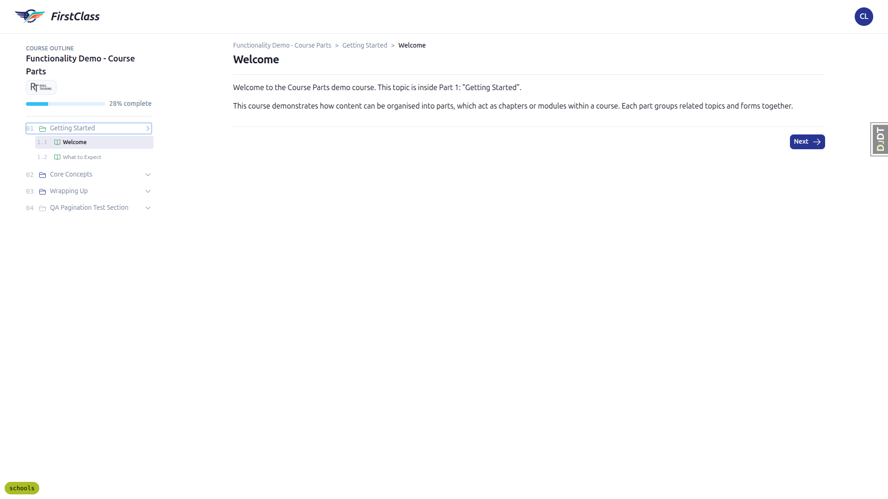
- **7.4** **Width and height are capped.** With a real 3000×300 banner uploaded through the admin, the
  image scaled to 110×22 inside the 128×32 chip; the outline header stayed 272px wide and the page had
  **no horizontal overflow**. I also measured the 300×3000 crest shape against the same CSS
  (`h-8 max-w-32` chip, `h-full w-auto max-w-full object-contain` image): it renders 2×22 — height
  constrained, not stretched, header unchanged. `RT-logo.webp` restored afterwards.
  
- **7.5** **Monogram fallback is correct in every case.** Northside (no logo) → **"NO"**;
  renamed "Northside Academy" → **"NA"**; renamed "123" → a **generic icon** (an SVG with
  `aria-label="unknown"`, inside the badge which carries `role="img" aria-label="123"`) — not an empty
  box, not "12", no crash. Reference case: RPAS Training with its logo removed → **"RT"**. All render
  as a 32×32 `rounded-full` badge matching the header user-initials badge. Northside restored to its
  original name.
  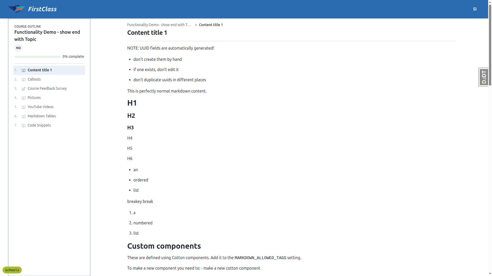
  
- **7.6** **Not performable** — see *Not executed*.
- **7.7** At 375px the outline moves behind a bottom-sheet panel and the logo is no longer permanently
  on screen (expected). Opening the panel shows the chip correctly sized with no overflow.
  
- **7.8** **No N+1.** The player page ran 37 queries total, of which exactly **two** touch the
  organisation table: one `SELECT` that reaches it via an `INNER JOIN` on the cohort-registration query
  (this is the logo lookup), and one `SELECT 1 … WHERE site_id = 3 AND id IN (…)` existence check for
  the header's educator-access link. Neither is repeated, and neither scales with the ~18-item outline.

### §8 Regression sweep — all pass

- **8.1** Every tab on a cohort detail loads its panels; **search** on the Users list filters correctly
  and keeps the organisation; **sorting** works and the sort links carry the organisation; **column
  pagination** loads page 2 with the organisation intact in both the switcher and the `hx-get` URL. As
  the superuser, the **delete** instance action worked and redirected to the Northside cohorts list —
  sensible and within the organisation.
  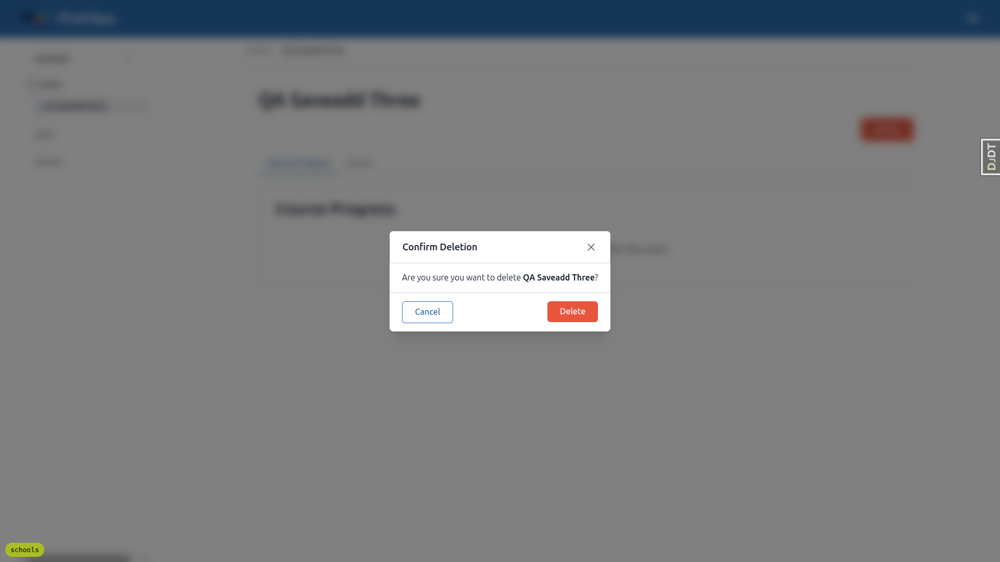
- **8.2** Courses shows the **same list** in RPAS Training and Northside, the URL still carries the
  organisation slug, and the switcher still renders and names the current organisation. Intended.
- **8.3** **Self-registration still works** — this was the most likely place the new mandatory FK could
  break an existing flow, and it does not. "Enrol for free" registered and dropped straight into the
  player with no 500. The outline header showed the **"DE" monogram for `DemoDev`**, the Site's own
  organisation, as the plan expects. Re-submitting the registration was a clean **no-op**: still
  exactly one `UserCourseRegistration`, no duplicate error, no 500.
- **8.4** Completed a topic (progress 0% → 33%) and a form (28% → 33%); the progress bar updated and the
  org chip persisted. **Deadlines render** — amber badges on the course detail TOC (`10 Sep`
  course-level, `25 Aug` item-level). The learner dashboard shows the same courses with **no
  duplicates**.
  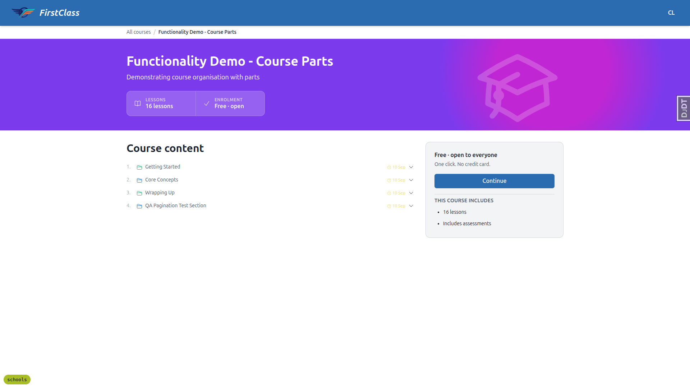
- **8.5** The header user menu opens and closes normally for every persona, and the educator link works
  where shown — the shared dropdown component is unaffected by the switcher reusing it.
  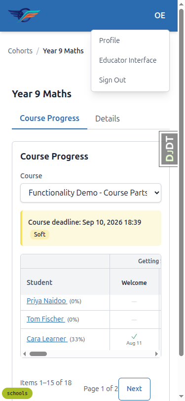
- **8.6** Admin sanity: the Cohort changelist and change page render with the unfold theme, show an
  **Organisation** field and **no Site field**; the guardian object-permissions link works from a
  cohort; a User course registration shows an Organisation and saves without error.

---

## Responsive results

### Mobile (375×812)

Navigation, layout and the switcher all behave. The nav collapses to a bottom-sheet drawer with the
switcher at the top, above the section nav — the same relative position as desktop. Opening the
switcher inside the drawer shows both organisations with a **checkmark on the current one**. Selecting
Northside switches the data **and closes the drawer** (previous defect 8).

No page-level horizontal overflow anywhere. The wide course-progress table scrolls **inside its own
container** (`overflow-x: auto`, 2031px of content in a 284px box) rather than pushing the page wide.
Forms, tabs, pagination and the deadline banner all remain usable.

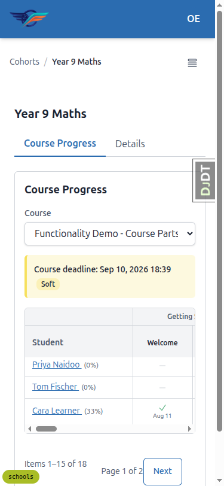

### Tablet (768×1024)

At 768px the tablet gets the **mobile drawer nav**, not the desktop sidebar. It works correctly: the
drawer opens, the switcher menu opens within it and is comfortably sized, and switching closes the
drawer. Tables, tabs and pagination render at a comfortable width with no overflow, and the Create
Cohort modal renders at a sensible width rather than stretching edge to edge.

Worth noting for the team (layout choice, not a defect): because the sidebar only appears at the `lg`
breakpoint, a 768px tablet leaves a wide empty column on the right of list pages where the sidebar sits
on desktop.

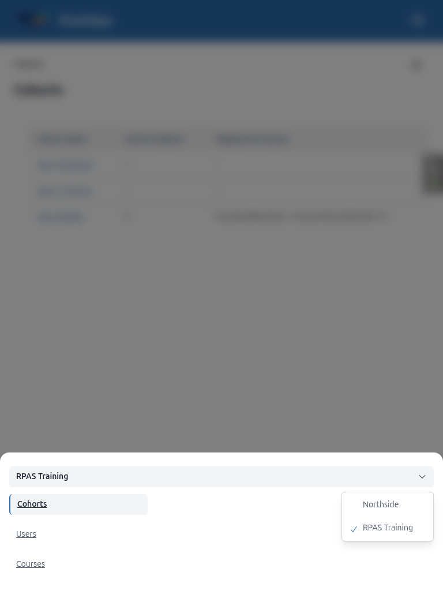
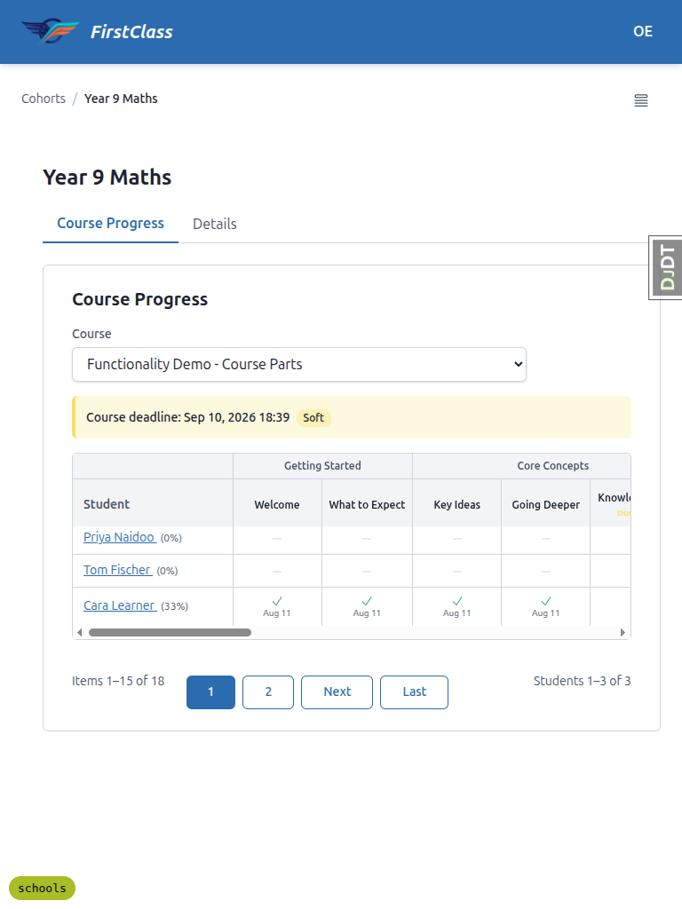

---

## Not executed

### §7.6 "No registration, no logo" — not performable in the browser

I delegated this to the `fls-dev:qa-data-helper` agent rather than skipping it. The agent investigated
and reported that **no test data can make this scenario reachable**, and I accept that conclusion:

- `course_home` and `view_course_item` both redirect to the course detail page when
  `get_access(...).can_access_content` is False, and `_free_access_decision` only sets it True when the
  learner holds an active `UserCourseRegistration` or a `CohortCourseRegistration` via membership.
  There is no staff/superuser bypass.
- Both `UserCourseRegistration.organisation` and `Cohort.organisation` are **non-nullable**, and
  self-service enrolment assigns the Site's default organisation.

So `organisation_for_learner_course` can only return `None` when the learner holds zero registrations —
exactly the state in which the player refuses to render. The `` false branch
in `course_toc_header.html` is unreachable from the browser and is covered by a unit test only
(`test_no_registration_returns_none`).

The agent verified this empirically against the dev database for three courses: on un-registered
courses the organisation genuinely resolved to `None`, but every request returned **302 → `/detail/`**.

**This needs a decision, not test data** — either drop §7.6 from the plan, or change the player so the
Site's own default organisation is suppressed in the chip (which would also create a genuine
"no organisation" state). I have added a todo item for that decision rather than a data-creation item,
because re-running the data helper would only reach the same conclusion.

### Screen-reader confirmation (§3.9, final paragraph)

No screen reader (NVDA/VoiceOver/Orca) is available in this environment, so the *audible* announcement
was not confirmed. Everything a screen reader depends on was verified structurally instead: the live
region exists, is `aria-live="polite" aria-atomic="true"`, sits outside the OOB-swapped region, updates
its text on a switch, and — the part that actually breaks announcements — **is not destroyed and
recreated**.

### §7.3 step 6 (dark/light preference) — not applicable

The application ships no dark/light preference. The only `prefers-color-scheme: dark` rules in the
built stylesheet belong to the Django Debug Toolbar's own chrome, not to the FLS role tokens, and there
is no theme toggle in the templates. There is nothing to check on each theme.

---

## Observations (none of these are defects)

1. **Self-enrolled learners see a chip for the Site itself.** Because self-service enrolment assigns
   `get_default_organisation(site)`, every self-registered learner gets a co-branding chip for the
   Site's own organisation — `no.reg.learner` currently sees a **"DD" monogram for `DemoDev`**. The
   test plan explicitly expects this at §8.3 step 4, so it is behaving as specified. It is flagged only
   because it is the same root cause that makes §7.6 unreachable: if the intent of co-branding is
   "show the *third-party* organisation the learner studies through", this fires on every self-enrolled
   learner. Worth a product decision alongside §7.6.

2. **§6 was adapted, and the adaptation is stronger than the literal steps.** The plan says to create
   `Year 9 Maths` in Northside, but §0.4's own seed data already puts a `Year 9 Maths` in Northside, so
   the literal step would correctly fail on within-organisation uniqueness. I used a fresh name
   (`Year 11 Physics`) and created it in **both** organisations, which tests the narrowed constraint
   directly rather than relying on RPAS Training's pre-existing row. Worth fixing in the plan text so
   the next run isn't confused.

3. **The two 404s in §2.4 differ, but only under `DEBUG=True`.** Django's technical 404 page shows
   *"No Organisation matches the given query"* for the unknown slug and no exception message for the
   real-but-unauthorised slug. Both raise `Http404` from the same view
   (`educator_interface/views.py:1161` and `:1167`) and there is no custom 404 handler, so production
   renders the identical page for both and organisation names are **not** enumerable. Noted only so a
   future tester doesn't mistake the debug-page difference for a leak.

4. **Educator *detail* pages have a vaguer `<title>` than list pages.** Lists give
   `Cohorts — RPAS Training — DemoDev`, but a cohort or user detail page gives only
   `RPAS Training — DemoDev` — no object name, no section. The empty-title defect is fixed; this is a
   lesser residual that hurts tab-switching and browser history.

5. **The logo chip reads as a bordered outline, not a filled chip.** On `first_class` the chip fill is
   `rgb(248,249,252)` against a `rgb(255,255,255)` surround; on `default` it is `rgb(255,255,255)` on a
   white surround. In both cases it is the 1px border, not the fill, that separates the chip from the
   panel. The plan's §7.3 step 5 asks for a *visibly distinct* background. The mark itself is clearly
   legible on both themes — the failure mode the test is really guarding against (a near-black logo
   vanishing on a dark header) does not occur, because the outline header is light on both themes. The
   previous run reached the same conclusion and left it alone as pre-existing.

6. **Touch targets are 36px tall** on the switcher trigger and the section-nav links at 375px, below the
   44px guideline. The switcher matches the existing nav links exactly, so this is house style rather
   than anything this feature introduced — consistent with the previous run's finding.

7. **Re-uploading a logo appends a random suffix**: RPAS Training's file is currently
   `organisations/85fa884a-…-a4591d1da8d0_feUw24t.webp`. This is Django storage's collision avoidance
   when the id-named file already exists, not a leak of the uploaded filename — §1.8's requirement
   (no trace of `RT-logo`) is met. Cosmetic only, but it means the stored name is not always exactly
   `<uuid>.<ext>` as the plan's wording implies.

8. **Switching FLS themes needs a Tailwind rebuild, not just the env var.** Setting `FLS_THEME` and
   restarting `runserver` changed nothing visually, because the theme's tokens are compiled into
   `static/vendor/tailwind.output.css`. §7.3 only became testable after
   `FLS_THEME=first_class npm run tailwind_build` (which runs `write_active_theme_css` first). Worth
   adding to the plan's §7.3 so the next tester doesn't conclude the themes are identical. I rebuilt
   back to `default` afterwards and confirmed the output file is byte-identical to how I found it
   (same md5), and both build artifacts are untracked by git.

---

## Known and not bugs (as the plan requests)

- **The switcher menu closes on window scroll (§3.10).** Confirmed. In this position — pinned at the
  top of a sidebar that scrolls with the page — it is more disruptive than it is in the header user
  menu: at any viewport short enough for the page to scroll, a user who nudges the wheel while reading
  the organisation list loses the menu and must re-open it, and on a trackpad it is easy to trigger
  accidentally. Reported here as feedback only; it is inherited from the shared `c-dropdown-menu` and
  tracked by an existing `@claude` comment, so it is **not** filed as a switcher bug and I did not
  work around it.
- **The Courses tab shows the same list in every organisation (§8.2).** Confirmed and intended in this
  cut; the URL still carries the organisation slug and the switcher still names it.
- **The outline logo is hidden behind a dialog on small screens (§7.7).** Confirmed and accepted.
- **Logo images re-fetch on each page load** rather than being cached — expected with signed media URLs.

---

## Test data notes

QA data is on **Site 3 (`DemoDev`, `127.0.0.1:8000`)**, which is why the server was run on port 8000:
the site-aware middleware resolves by host, and any other port falls back to Site 2, where none of the
`org.educator`/`Northside`/`RPAS Training` fixtures exist.

The `fls-dev:qa-data-helper` agent was used twice: once for §7.6 (which it established is not
achievable — see *Not executed*), and once to create the missing deadline data for §8.4, where it
pointed the existing `qa_create_soft_deadline` command at the Year 9 Maths cohort. It made no code
changes. It flagged that `qa_create_soft_deadline` defaults `--days-from-now` to **-7** (an *overdue*
deadline), so a positive value is needed for an upcoming one.

Objects left behind by this run, in case they confuse a later run: organisations `Eastvale Academy`
and `Eastvale.`; cohorts `Year 11 Physics` (in both Northside and RPAS Training) and `QA Saveadd Two`
(Northside); a `view_organisation` grant for `demodev@email.com` on RPAS Training; a
`UserCourseRegistration` for `cohort.learner` on "QA Free Course (Access Types)"; and completed topic
and form progress for `cohort.learner`. `Westbrook Academy` and `Westbrook.` are left over from the
previous run. Northside is back to its original name with no logo, and RPAS Training has `RT-logo.webp`
restored.
