# Frontend QA report: simple application forms

93 test records were run against the `simple-application-forms` branch on 2026-09-10, dev server on
port 8789, across desktop (1920x1080), mobile (375x812) and tablet (768x1024). All 93 pass. 0 fail,
0 skipped, 0 bugs.

## Methodology

The test plan (`3. frontend_qa.md`) was walked manually with the Playwright MCP browser tools; there
are no automated test scripts for this flow. Screenshots were collected into `screenshots/` beside
this report — 53 PNGs in total, all verified present on disk. 51 of those are referenced directly
from a test record below; the remaining two (`page-2026-09-10T07-11-45-801Z.png`,
`tablet-start.png`) were captured during setup and general navigation and are not tied to a specific
test id.

Seed data (accounts, demo content, cleared applications/sittings, scratch upload fixtures) was
created and reset through the `fls-dev:qa-data-helper` agent, never by hand, per §0.2 of the plan.

Run notes worth flagging up front: upload fixtures had to be copied into `.sdd-work/` because
Playwright MCP only has that directory and the project tree as allowed roots; accessibility-snapshot
`.yml` and console `.log` files were deleted from the screenshot staging folder before collection so
only PNGs were committed; and stale scratch records from an earlier run (29 lines) were stripped from
`.sdd-work/qa_scratch.jsonl` before this run started. Full detail is under General notes.

## Diff scoping

Scoping class: **FULL**.

Files that triggered it include:
- `freedom_ls/course_applications/templates/course_applications/check_your_answers.html`
- `freedom_ls/course_applications/templates/course_applications/form_page.html`
- `freedom_ls/form_engine/templates/form_engine/inputs/file_upload.html`
- `freedom_ls/form_engine/static/form_engine/js/alpine-components.js`
- `freedom_ls/learner_interface/templates/learner_interface/course_form_page.html`
- `freedom_ls/base/templates/cotton/button.html`
- plus roughly 100 further `.py`, migration, doc and spec files.

Nothing was skipped. Desktop, mobile and tablet passes all ran in full.

## Smoke gate

Status: **pass**.

Pages checked before the full run:
- `/`
- `/courses/functionality-demo-application-gated-course/detail/`
- `/applications/status/4408c2b7-03aa-4407-8f72-81e49a45b6b0/`

No failure URL or failure reason recorded.

## Results by section

Viewport rows are folded into the section they belong to. Every test record from the scratch file
appears exactly once below.

### §1 The control: a gated course without a form still works as before

- **1.1** (desktop) — PASS. Masterclass (gated, no form) detail shows ENROLMENT "By application" and
  "Apply now". Catalogue cards show COMING SOON/NOT REGISTERED chips; the "By application" badge is
  on the detail page.
  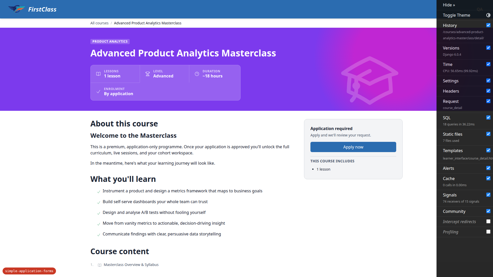
- **1.2** (desktop) — PASS. "Apply now" leads to the "Apply to Advanced Product Analytics
  Masterclass" confirmation page with Submit application / Cancel.
- **1.3** (desktop) — PASS. Submit leads to `/applications/status/<uuid>/`, "received and is
  currently pending review", with "Back to dashboard". No form page appears.
- **1.4** (desktop) — PASS. Dashboard "Your applications" lists the masterclass as Pending review;
  clicking it opens the same status page.
  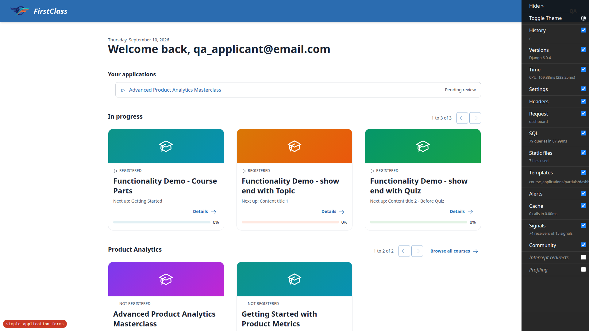

### §2 Applying to a course that names a form

- **2.1** (desktop) — PASS. Demo gated course detail shows "By application" + "Apply now".
- **2.2** (desktop) — PASS. "Apply now" lands straight on
  `/applications/application/<uuid>/page/1/`: eyebrow "Application for <course>", heading "About
  you", dots 1 (highlighted) and 2 (plain span), five questions (short text/number/radio/checkboxes/
  long text), single right-aligned "Next".
  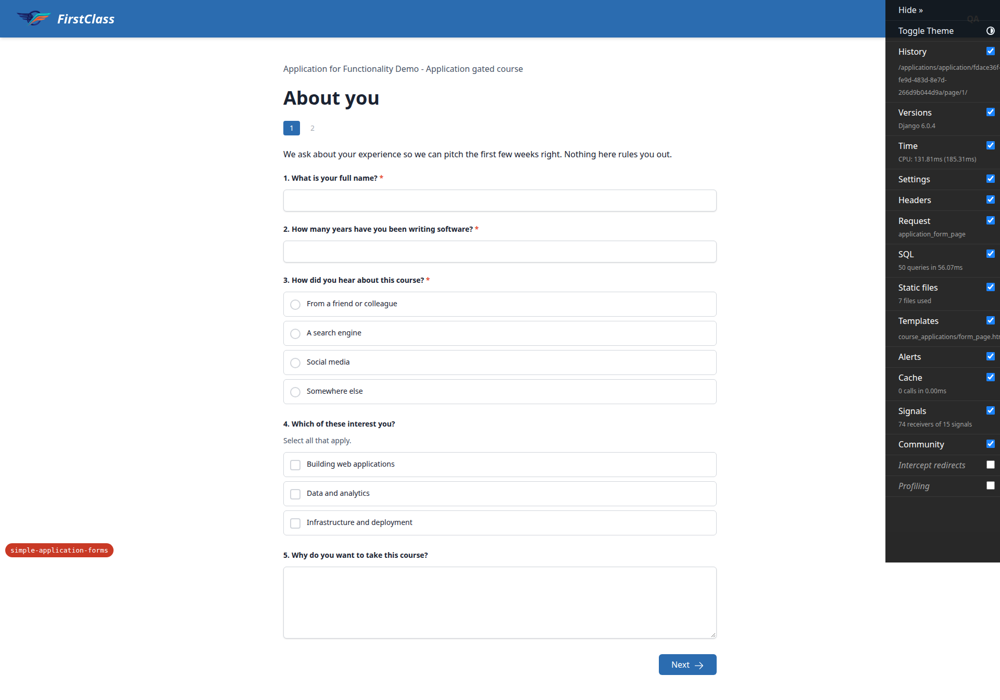
- **2.3** (desktop) — PASS. Question 2 is `<input type=number>`; typing "abc" leaves the value empty,
  "5" is accepted.
- **2.4** (desktop) — PASS. Plan-wording mismatch, not a defect: text/number/radio questions carry
  HTML `required`, so a real browser blocks the empty submit with its own "Please fill out this
  field." and sends nothing. With client validation bypassed the server re-renders at 422 with
  "Questions 1, 2 and 3 need answers before you can continue."
  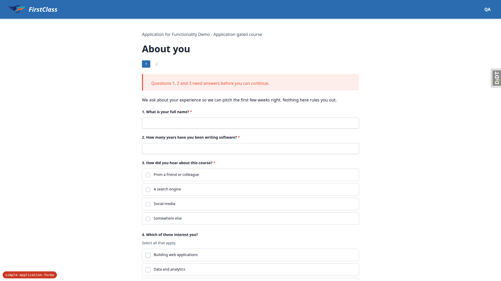
- **2.5** (desktop) — PASS. Only short text filled (client validation bypassed): 422, callout
  "Questions 2 and 3 need answers before you can continue.", typed name retained.
- **2.6** (desktop) — PASS. Page 2: dot 2 highlighted, dot 1 a link, Previous (left arrow) on the
  left, Next (right arrow) on the right of the last page.
  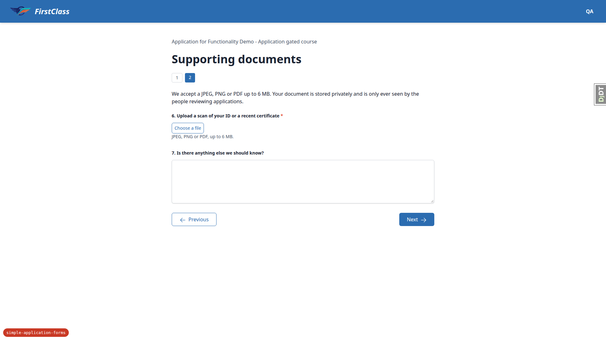
- **2.7** (desktop) — PASS. Dot 1 returns to page 1 with name, number 7 and radio "A search engine"
  retained; Next returns to page 2.
- **2.6** (mobile) — PASS. 375px page 2: Next above Previous, both full width; page dots ~42x46 tap
  targets; file widget's Download/Replace/Remove sit on one row; no horizontal scroll.
  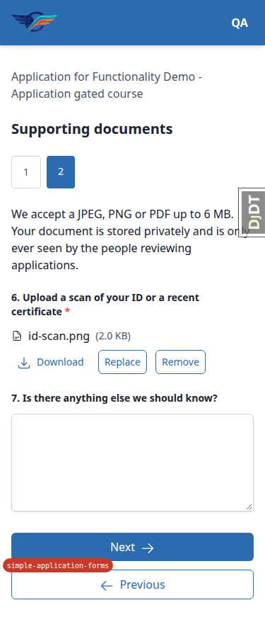
- **2.2** (mobile) — PASS. 375px page 1: all five questions render full width, no horizontal scroll
  (scrollWidth 375).
  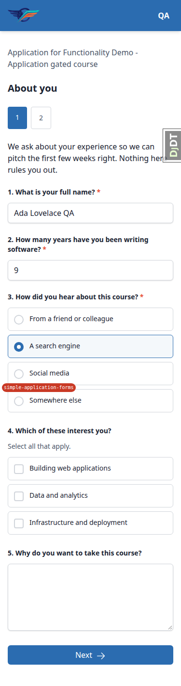
- **2.6** (tablet) — PASS. 768px page 2: Previous left / Next right on one line, form 720px wide, no
  horizontal scroll.
  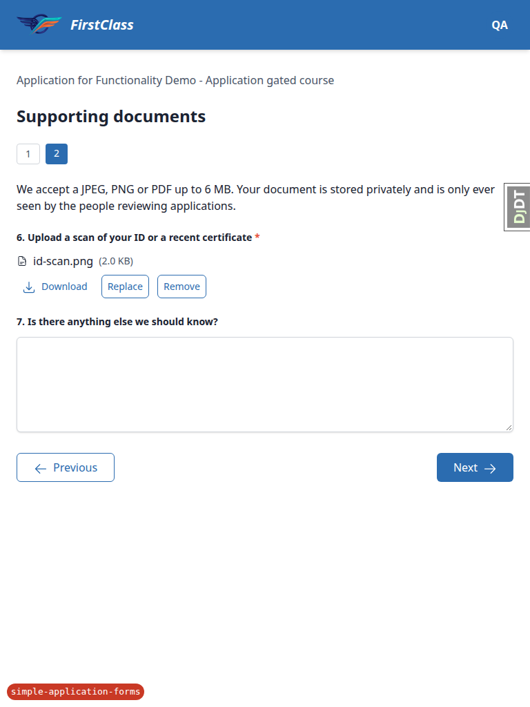

### §3 The file question

- **3.1** (desktop) — PASS. Required file question: "Choose a file" styled as a secondary button,
  pointer cursor, focus ring when tabbed to, hint "JPEG, PNG or PDF, up to 6 MB.",
  `accept=.jpeg,.jpg,.pdf,.png`, no Remove button.
  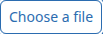
- **3.2** (desktop) — PASS. `too-big.jpg` (7.3 MB): inline "That file is larger than 6 MB. Choose a
  smaller one.", no POST, input emptied.
  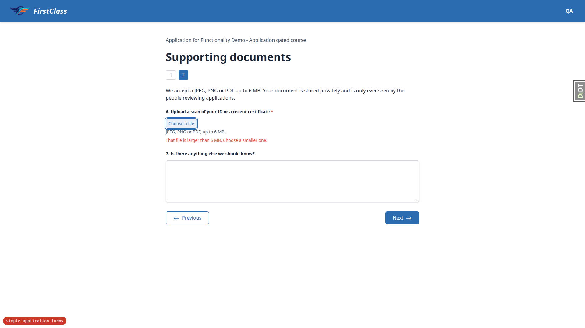
- **3.3** (desktop) — PASS. `not-an-image.png`: POST returns 422, widget re-rendered with "File is
  not a readable image or PDF.", nothing attached.
  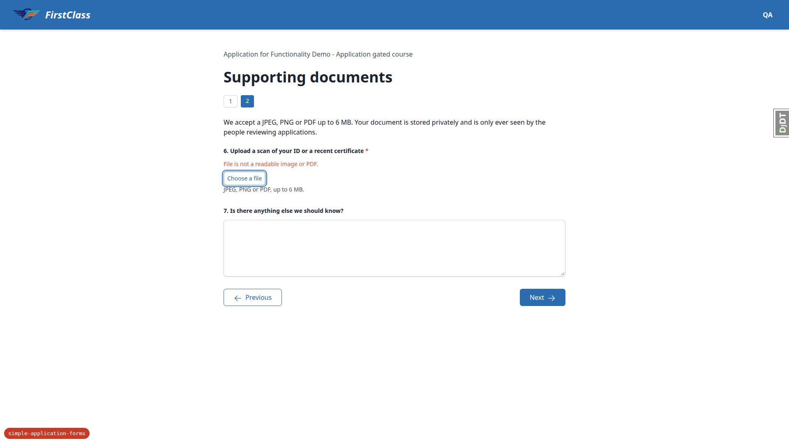
- **3.4** (desktop) — PASS. `id-scan.png`: widget swaps in place (no navigation), shows filename,
  size, Download link, Replace, Remove — Replace and Remove both 34px tall on the same baseline.
  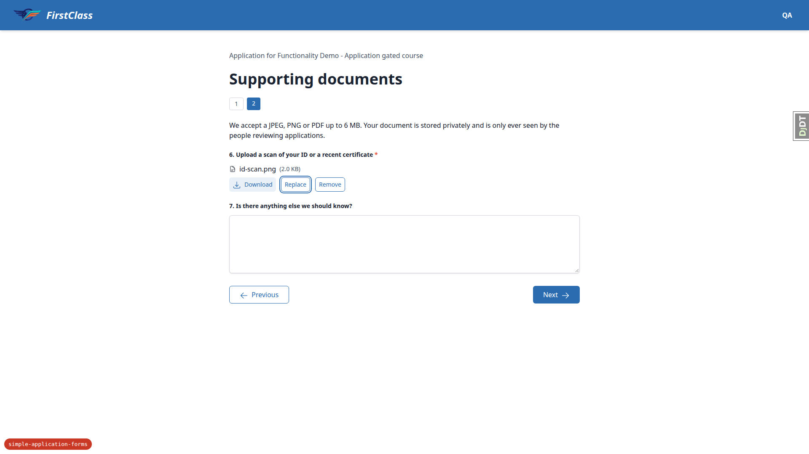
- **3.5** (desktop) — PASS. Download sends `Content-Disposition: attachment; filename="id-scan.png"`,
  `image/png`; downloaded bytes identical to the upload.
- **3.6** (desktop) — PASS. Accessible names carry the question text: "Remove file for Upload a scan
  of your ID or a recent certificate", "Replace for Upload a scan of...", "Download Upload a scan
  of...". No bare "Remove".
- **3.7** (desktop) — PASS. Dashboard shows the gated course row with an "Incomplete" chip, "Finish
  your application to have it reviewed.", and "Continue application" (returns to page 2 with
  `id-scan.png` still attached).
  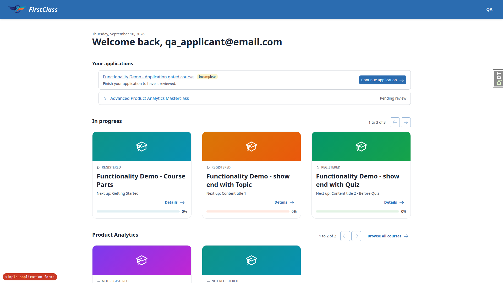
- **3.8** (desktop) — PASS. Replace with `id-scan.pdf`: attached state shows `id-scan.pdf` (7.6 KB);
  Download returns `application/pdf`, `%PDF-` magic bytes, 7733 bytes matching the upload.
- **3.9** (desktop) — PASS. Remove posts to file/remove/ (200), widget returns to the empty picker
  with "File removed. This question needs a file before you can submit."
  
- **3.10** (desktop) — PASS. Next with the file empty: 422, callout "Question 6 needs an answer
  before you can continue." (the file input carries no `required` attribute, so this is the server
  check firing).
  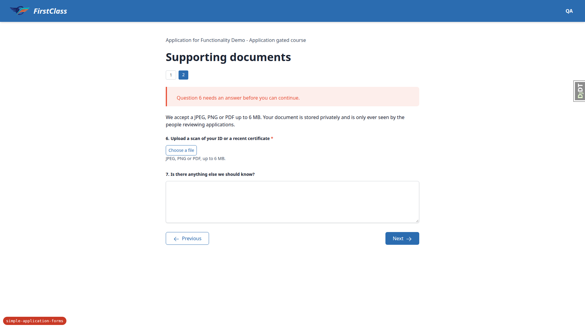
- **3.11** (desktop) — PASS. Re-attached `id-scan.png` (new file id), Next leads to
  check-your-answers.
- **3.7** (mobile) — PASS. 375px dashboard (bystander's draft): Incomplete chip, note, full-width
  "Continue application" button (285x33), no horizontal scroll.
  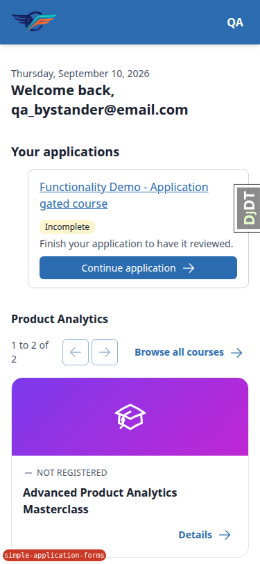

### §4 The check-your-answers page

- **4.1** (desktop) — PASS. Title, "Nothing is sent until you press Submit application." note, cards
  "About you" then "Supporting documents" with tinted header, page title left, pencil "Edit" right;
  full-width label/value rows; skipped optionals read "Not answered"; file row shows
  `id-scan.png` (2.0 KB) + Download, no thumbnail.
  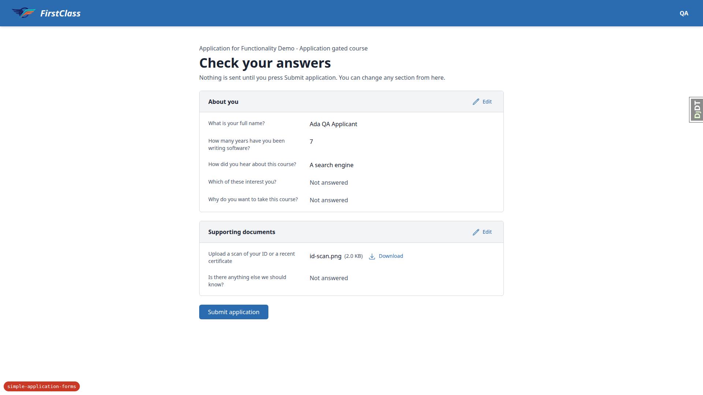
- **4.3** (desktop) — PASS. Edit links' accessible names are exactly "Edit About you" and "Edit
  Supporting documents"; none named bare "Edit". hrefs carry `?return=check`.
- **4.4** (desktop) — PASS. Edit "About you" leads to page 1 pre-filled, "Back to your answers" link
  in place of Previous, button "Save and return to your answers". Changed name, saved, lands
  straight back on the check page showing "Ada Lovelace QA".
  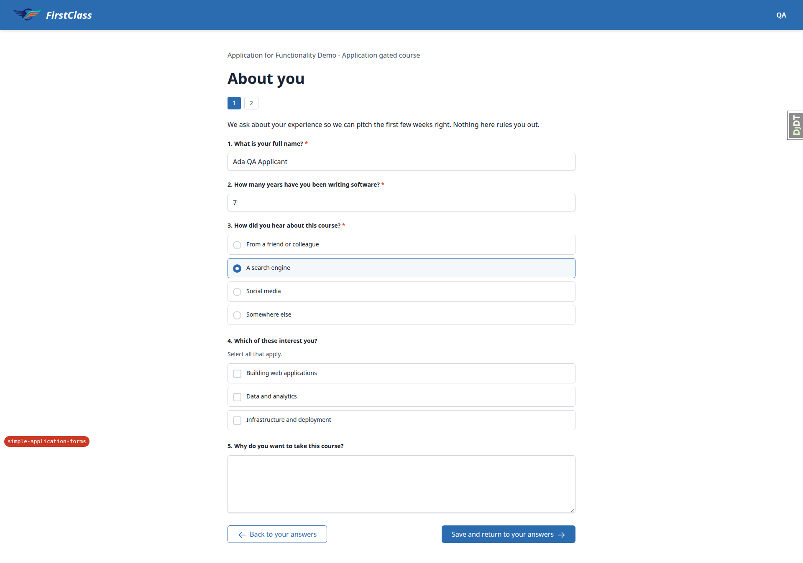
- **4.5** (desktop) — PASS. Edit then "Back to your answers" without changes: check page text
  unchanged.
- **4.6** (desktop) — PASS. Edit "About you", then page-jump dot 2 (plain href, no `?return`): page 2
  shows Previous/Next, not "Save and return".
- **4.1.1** (desktop) — PASS. Cleared number on page 1: browser's native required prompt blocks first
  (same plan-wording note as 2.4); with client validation bypassed, 422 and "Question 2 needs an
  answer before you can continue." Blank answer is saved regardless.
- **4.1.2** (desktop) — PASS. Page 2 opened by URL, Next redirects (302) to check-your-answers; the
  number row reads "Not answered".
- **4.1.3** (desktop) — PASS. "Submit application" returns 422, re-renders the check page with
  callout "Question 2 needs an answer before you can continue." No submission.
  
- **4.1.4** (desktop) — PASS. Edit "About you", number=9, "Save and return": check page number row
  reads 9.
- **4.2** (mobile) — PASS. 375px check page: each row stacks question above answer, cards 343px
  (fill width), Download link 33px tall (>=24), no horizontal scroll.
  
- **4.1** (tablet) — PASS. 768px check page: label/value side by side (question x49, answer x288,
  same row), cards full width, no horizontal scroll.
  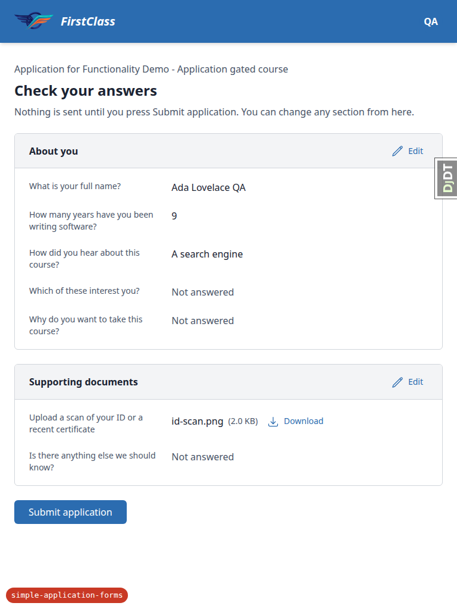

### §5 Submitting, and what read-only means afterwards

- **5.1** (desktop) — PASS. Submit leads to the dashboard with a toast: "Your application for
  Functionality Demo - Application gated course has been submitted and is pending review."; panel
  lists it as Pending review. No status page in between.
  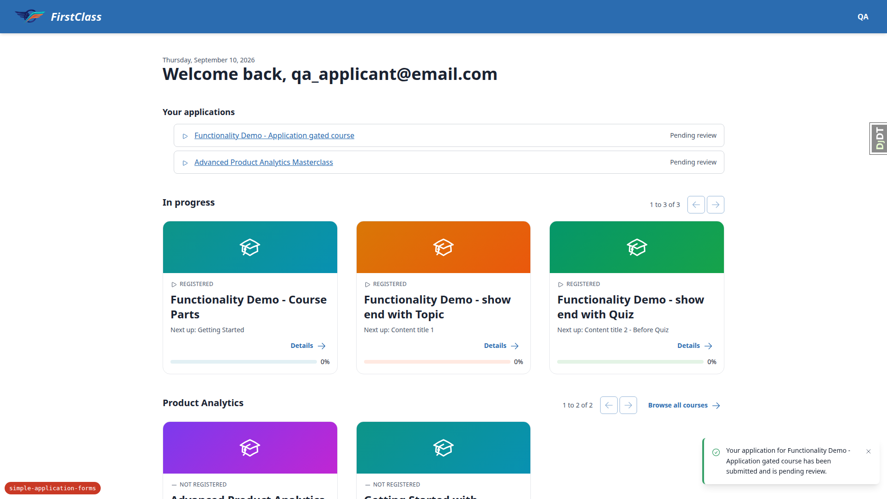
- **5.2** (desktop) — PASS. Page 2 after submit (200): callout "This application has been submitted
  and can no longer be changed.", textarea disabled, no `<input type=file>`, file shown with Download
  only (no Replace/Remove), no Next button (Previous + "Your answers" links). Page 1 inputs all
  disabled.
  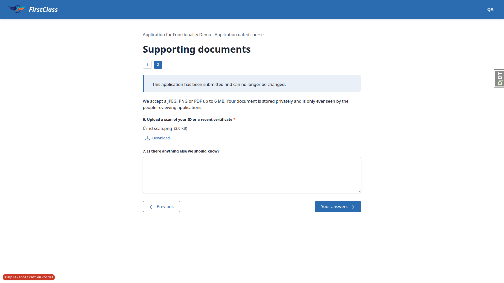
- **5.3** (desktop) — PASS. Check page after submit: no Edit links, no submit button, success callout
  "Your application has been submitted. You will hear back once it has been reviewed." plus a "Your
  application" button.
  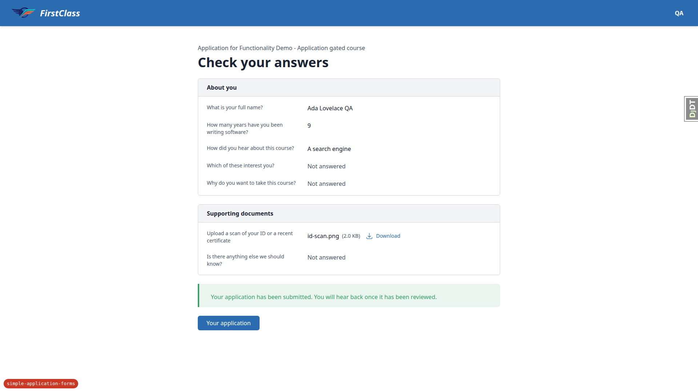
- **5.4** (desktop) — PASS. Submitting from a stale tab opened before submission: POST 302s to the
  status page ("received and is currently pending review"), no error.
- **5.5** (desktop) — PASS. Course detail button reads "View my application" and leads to
  `/applications/status/<uuid>/`, not the form.
- **5.6** (desktop) — PASS. Dashboard shows Pending review, no Incomplete chip, no Continue
  application; link goes to the status page.
- **5.6** (tablet) — PASS. 768px dashboard: "Your applications" rows (Pending review) render cleanly
  above a 2-column course grid; no horizontal scroll.
  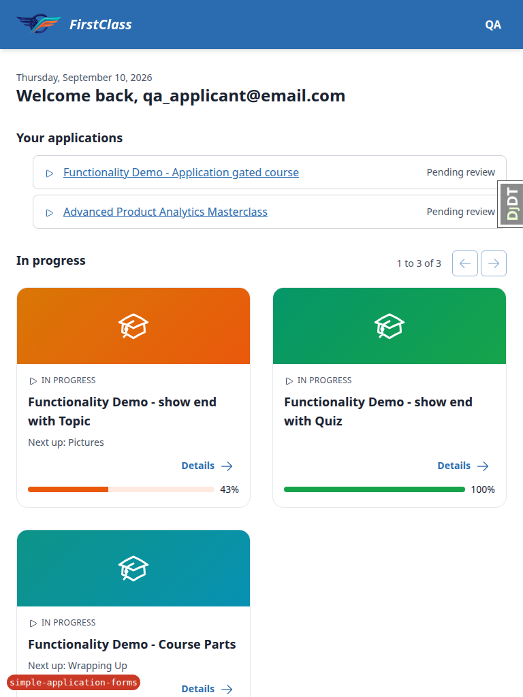

### §6 Other people's applications and files

- **6.2** (desktop) — PASS. Bystander: the applicant's `page/1/`, `check-your-answers/` and status
  URL all 404.
- **6.3** (desktop) — PASS. Bystander: `/forms/answer-file/8774e512.../` (the applicant's current
  file; the §3.5 id was already deleted by the §3.9 Remove) also 404s.
- **6.4** (desktop) — PASS. Anonymous: the same download URL redirects (302) to
  `/accounts/login/?next=...`.
- **6.5** (desktop) — PASS. Bystander's own "Apply now" opens their own application at
  `page/1/` with empty, enabled inputs.

### §7 The admin side of uploaded files

**7.1 Superuser**

- **7.1.1** (desktop) — PASS. Question answer files changelist: columns Applicant, Question,
  Original filename, Created at, Download; the applicant's `id-scan.png` row has a Download link;
  only filter is "By created at"; no scan-status column or filter.
  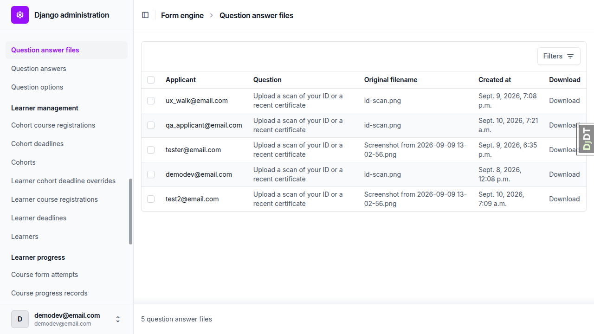
- **7.1.2** (desktop) — PASS. Change page shows Answer link, Original filename, Created at, Updated
  at — all read-only, no raw path or inline file link.
  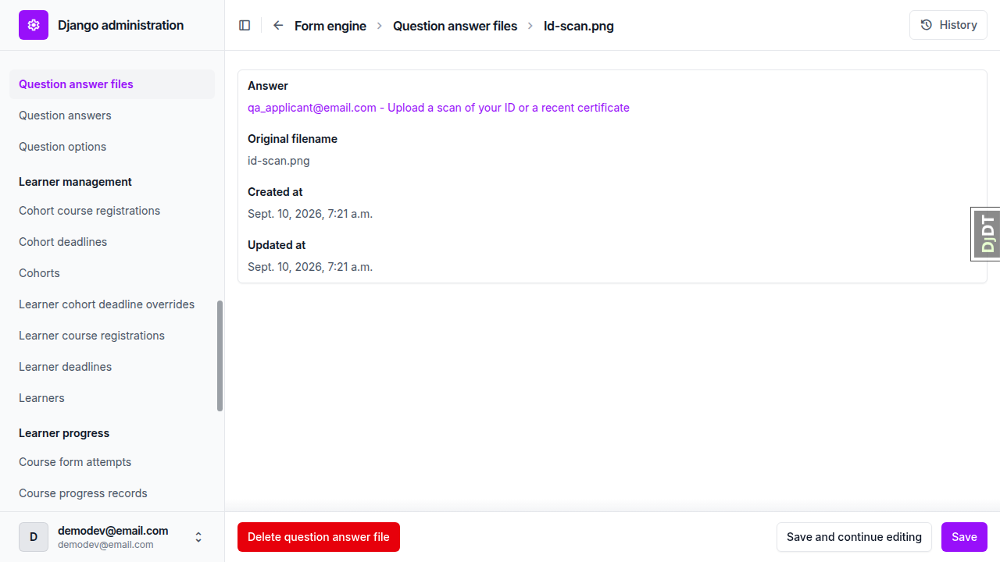
- **7.1.3** (desktop) — PASS. Admin download endpoint returns 200,
  `attachment; filename="id-scan.png"`, `image/png`, 2007 bytes (matches upload).
- **7.1.4** (desktop) — PASS. Actions dropdown only offers "Delete selected question answer files";
  no mark clean/rejected actions.
- **7.1.5** (desktop) — PASS. Question answers: applicant rows visible with previews "A search
  engine", "9", "Ada Lovelace QA"; the file answer's preview reads "-". Form progress records show
  the applicant's Application form row, completed.
  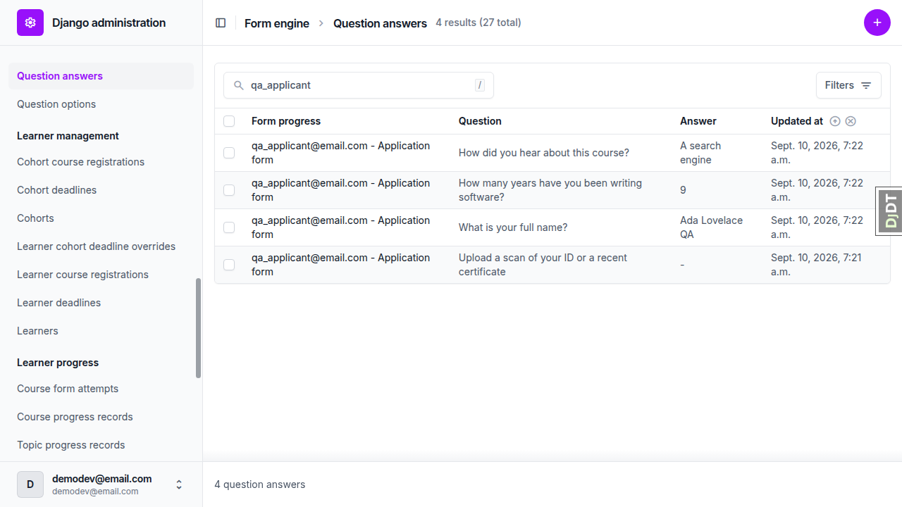
- **7.1.6** (desktop) — PASS. Deleting the selected form progress record is refused: "would require
  deleting the following protected related objects: Course application:
  CourseApplication(73, 271eeb30-...)", no confirm button; the row is still present afterwards.
  

**7.2 Staff non-superuser (reviewer)**

- **7.2.1** (desktop) — PASS. Reviewer's admin index reads "You don't have permission to view or edit
  anything."; the questionanswerfile/, questionanswer/ and formprogress/ changelists and change page
  all return 403 despite the direct view permissions.
  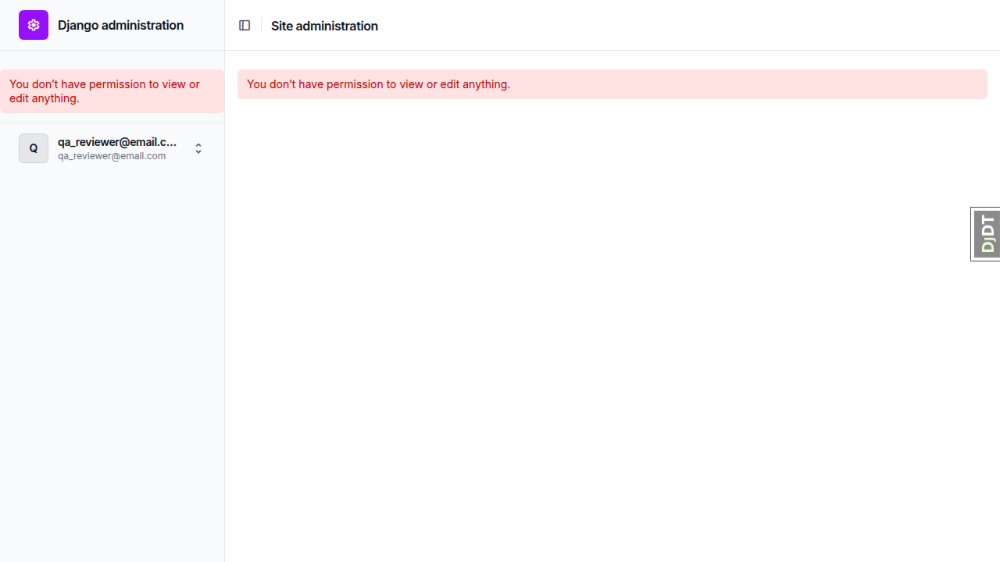
- **7.2.2** (desktop) — PASS. Reviewer's admin file download URL returns 403.

**7.3 A form created in the admin gets a slug**

- **7.3.1** (desktop) — PASS. Add form (title "Admin form one", UNSCORED, no slug input on add):
  saved, change page shows read-only slug "admin-form-one". (Earlier runs' "Admin form one" forms
  were cleared first via qa-data-helper.)
  
- **7.3.2** (desktop) — PASS. A second "Admin form one" saves with slug "admin-form-one-2", no
  uniqueness error.
  

### §8 The course player's own forms are unchanged

**8.1 Multi-page quiz: the runner chrome**

- **8.1.1** (desktop) — PASS. Mid course Quiz start screen sits inside the ordinary player chrome
  (course outline, breadcrumb): "6 questions", "2 pages", single "Start Form".
  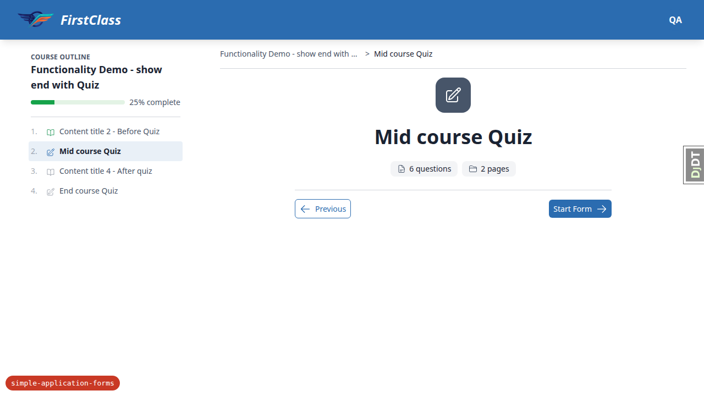
- **8.1.2** (desktop) — PASS. Runner has no site header/sidebar; top bar with exit X left, title
  centred, "0 of 6 answered" right; "Page 1 of 2" with a half-filled bar; dots "Page 1 (current)"
  link and "Page 2 (not yet accessible)" span.
  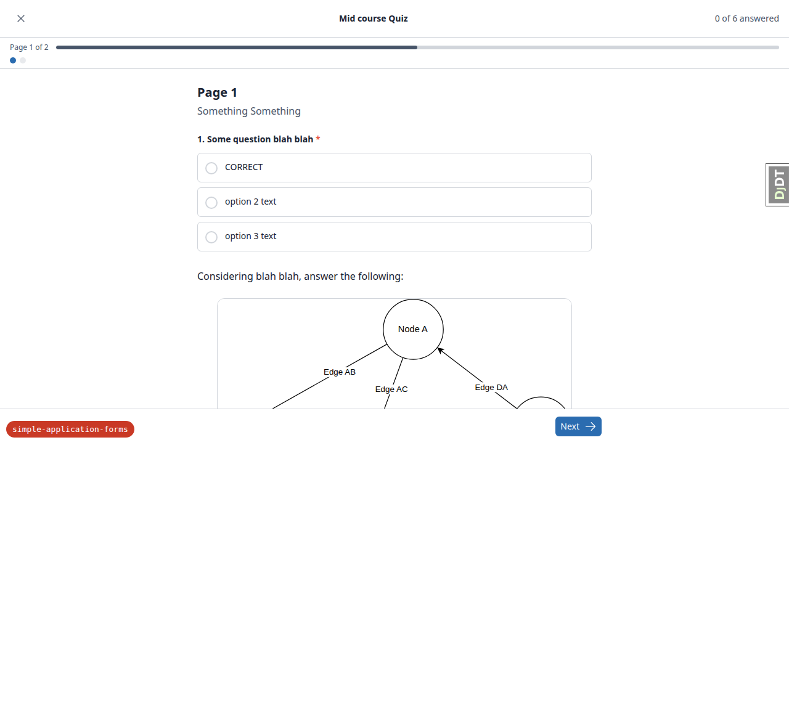
- **8.1.3** (desktop) — PASS. Heading "Page 1", three required radio groups numbered 1.-3.; no
  "Select all that apply.", no number or file input. The content block (diagram) sits between Q1 and
  Q2, matching the authored order in `1. page.yaml` (see General notes: plan wording says content
  before the questions). Screenshot as 8.1.2 above.
- **8.1.4** (desktop) — PASS. Answering Q1 updates the tally to "1 of 6 answered" with no page load.
- **8.1.5** (desktop) — PASS. Next with Q2/Q3 blank: native "Please select one of these options."
  fires on Q2's radio group; stays on `fill_form/1`.
- **8.1.6** (desktop) — PASS. Page 2: "3 of 6 answered", bar full, questions numbered 4.-6., dots
  "Page 1" link and "Page 2 (current)".
  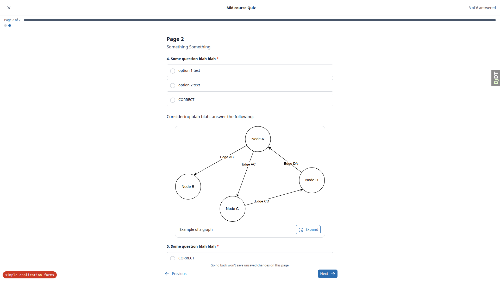

**8.2 The page-jump nav does not re-lock**

- **8.2** (desktop) — PASS. Dot 1 returns to page 1 with all three answers still selected; dot 2
  stays a link ("Page 2"). Next returns to page 2.

**8.3 Leaving a submit-on-exit quiz**

- **8.3.1** (desktop) — PASS. Exit X opens "Leave the test?" — "Leaving now will submit your answers
  and score your attempt. You won't be able to change your answers afterwards." — Keep going / Leave
  and submit.
  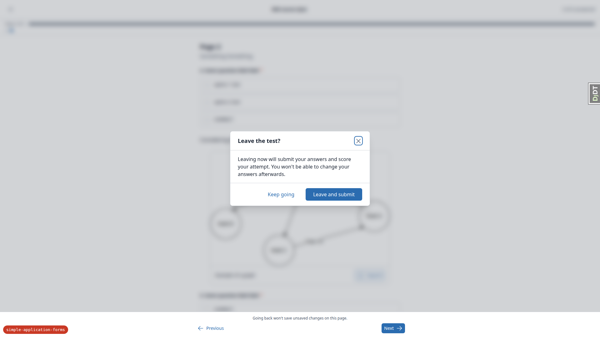
- **8.3.2** (desktop) — PASS. Escape closes the dialog with the runner unchanged (page 2, 3 of 6);
  reopening and clicking Keep going also closes it without changes.
- **8.3.3** (desktop) — PASS. "Leave and submit" with page 2 blank leads to results: "Quiz not
  passed", "You need 80% to pass", ring at 50%, 3/6 correct, "Review incorrect answers" lists Q4-6 as
  not answered.
  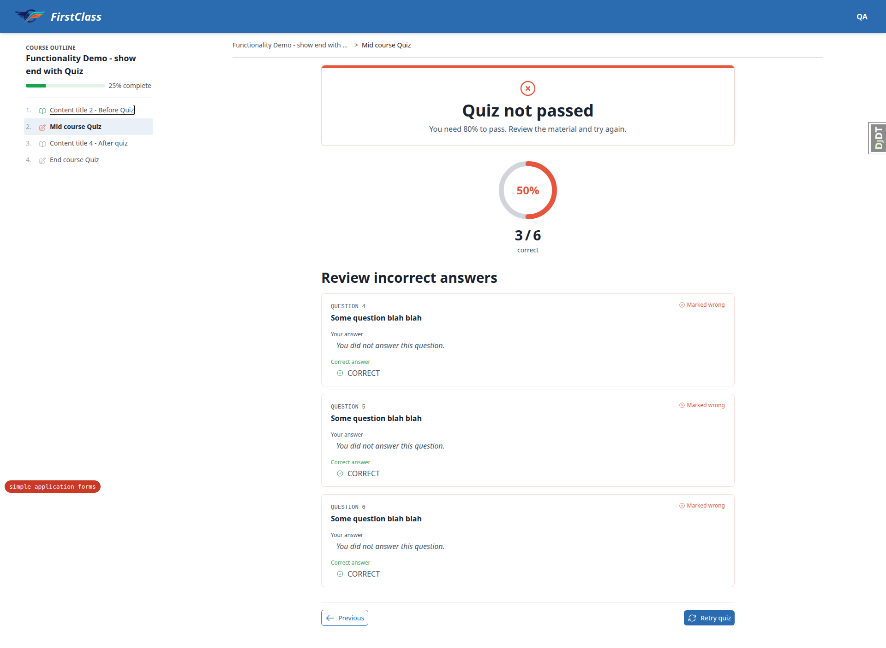
- **8.3.4** (desktop) — PASS. Start screen after failing offers only "Try Again".

**8.4 A clean retake, and the results page**

- **8.4.1** (desktop) — PASS. "Try Again" opens `fill_form/1`, "0 of 6 answered", no radios checked,
  dot 2 "not yet accessible" again.
- **8.4.2** (desktop) — PASS. With all answers correct, Next on page 2 opens "Ready to submit?"
  (6 answered / 6 total, Go back and review / Submit) instead of posting directly.
  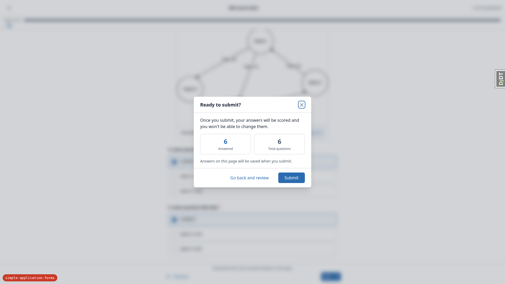
- **8.4.3** (desktop) — PASS. Submit leads to "Quiz passed!", ring at 100%, 6/6, no incorrect-answer
  review.
  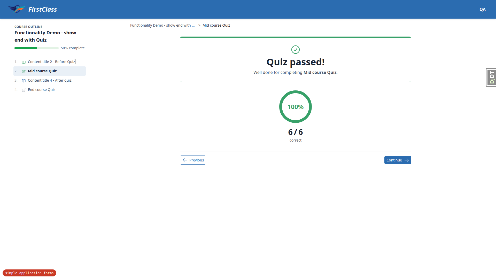
- **8.4.4** (desktop) — PASS. Outline shows Mid course Quiz "Completed"; "Content title 4 - After
  quiz" is now "Not started" (unlocked).

**8.5 Leaving a save-on-exit quiz, and resuming**

- **8.5.1** (desktop) — PASS. End course Quiz started, page 1 answered, Next leads to `fill_form/2`.
- **8.5.2** (desktop) — PASS. Exit X opens the same dialog frame with different copy — "Your progress
  is saved — you can resume later." — and "Leave and save" (a link) instead of "Leave and submit".
  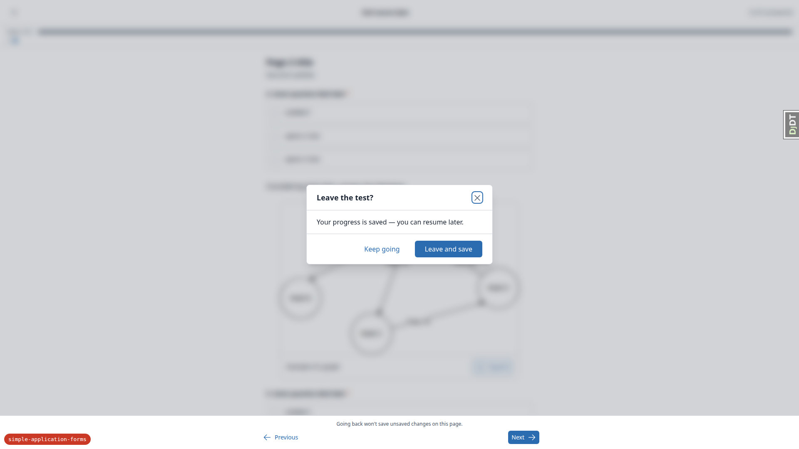
- **8.5.3** (desktop) — PASS. "Leave and save" leads to the item start screen offering only "Continue
  Form".
- **8.5.4** (desktop) — PASS. "Continue Form" opens `fill_form/2` (not 1), "3 of 6 answered", dots
  "Page 1" and "Page 2 (current)" both links.
- **8.5.5** (desktop) — PASS. Submitting page 2 through the dialog leads to "Quiz passed!", ring at
  67%, 4/6, no "Review incorrect answers" (`quiz_show_incorrect` false).
  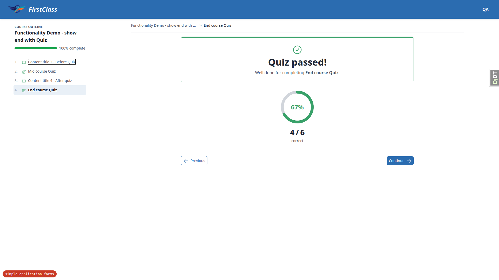

**8.6 A single-page form: the survey**

- **8.6.1** (desktop) — PASS. Course Feedback Survey start screen shows "5 questions", "1 page",
  Start Form.
- **8.6.2** (desktop) — PASS. No "Form pages" nav, "Page 1 of 1", bar full, no Previous, no "Going
  back won't save..." note.
  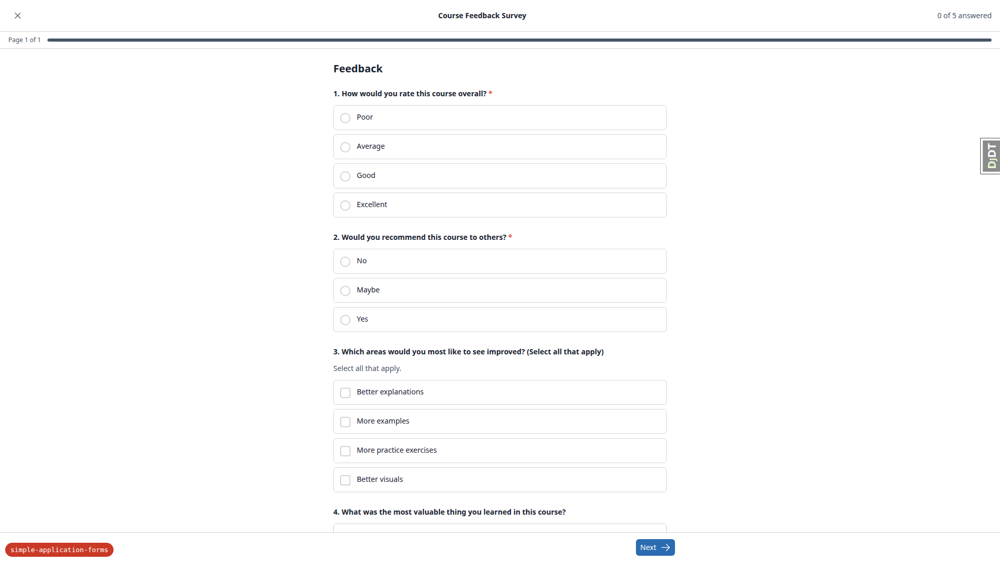
- **8.6.3** (desktop) — PASS. Q1 radio(4) required, Q2 radio(3) required, Q3 checkboxes(4) with
  "Select all that apply." (not required), Q4 text input, Q5 textarea; asterisks only on 1 and 2. The
  optional checkbox group carries no `data-checkbox-required-message` element. Screenshot as 8.6.2
  above.
- **8.6.4** (desktop) — PASS. Answering Q1/Q2 then Next opens "Ready to submit?" (2 answered / 5
  total) without leaving the page; Submit completes the form.
- **8.6.5** (desktop) — PASS. "Form complete!" with Satisfaction 1/7 and Recommendation 0/5 bars, no
  score ring, no pass/fail verdict.
  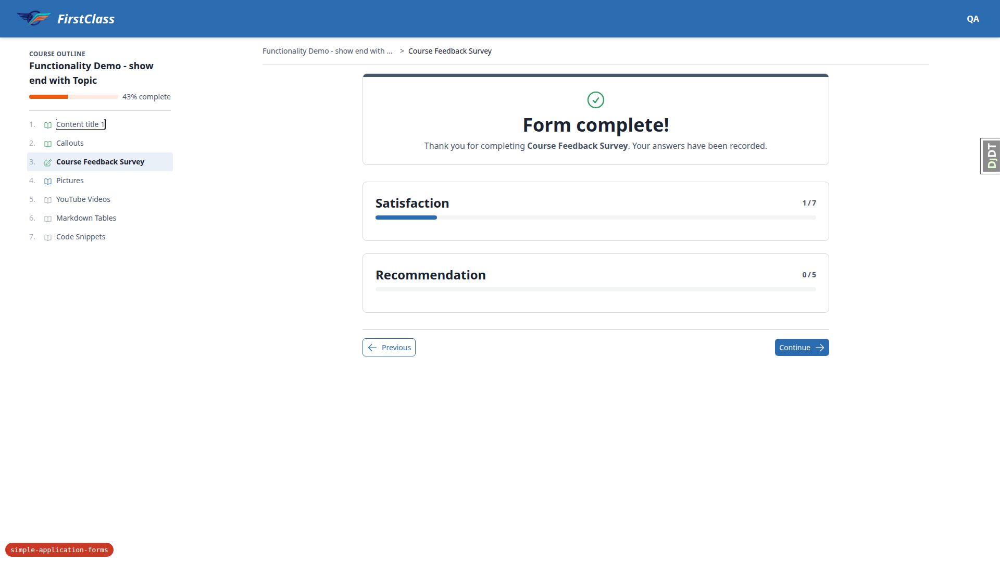

**8.7 A single-page quiz**

- **8.7.1** (desktop) — PASS. Knowledge Check via the outline (after completing the earlier part
  items): "Page 1 of 1", "0 of 3 answered", no dots, no Previous.
- **8.7.2** (desktop) — PASS. Two of three correct leads to "Quiz not passed", 67%, 2/3, review lists
  Q3.
  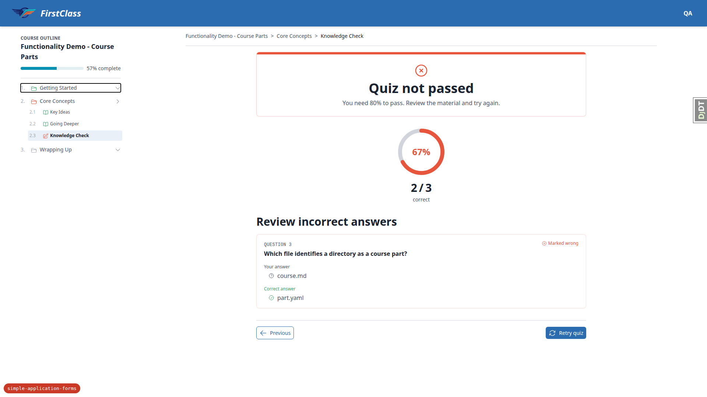
- **8.7.3** (desktop) — PASS. Start screen after failing offers only "Try Again". Retaking all
  correct gives "Quiz passed!" at 100%; the outline marks Knowledge Check Completed and unlocks
  "Wrapping Up".

**8.8 Nothing from the application shell leaks in**

- **8.8** (desktop) — PASS. Start and results pages of all three courses' forms show no "Application
  for", "Back to your answers", "Save and return", or "Check your answers"; no number/file inputs;
  site header and course outline present. Runner pages (mid quiz, survey, knowledge check) show no
  number/file inputs and no site header/sidebar.
- **8.8** (tablet) — PASS. 768px player start/results pages: the course outline collapses behind an
  "Open course outline" button, main content full width, no horizontal scroll. The status page was
  also checked and is clean.
  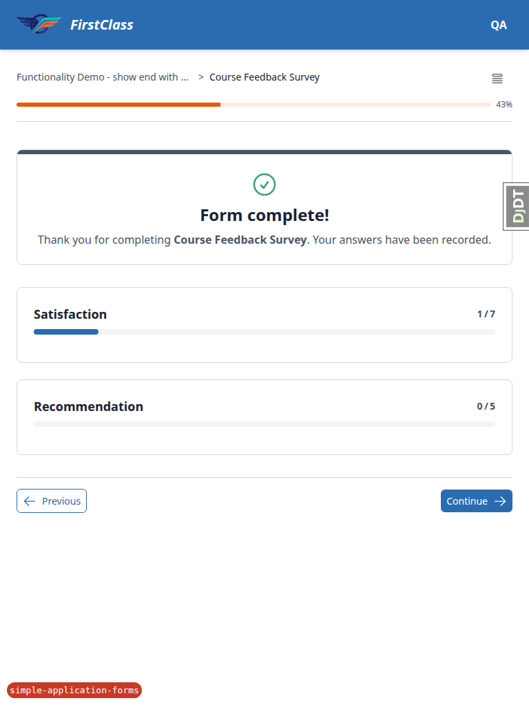
  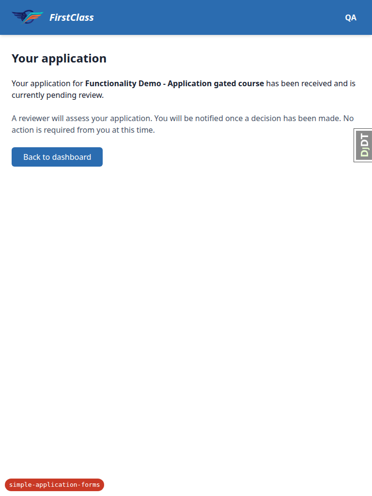

**8.9 The runner at 375px**

- **8.9.1** (mobile) — PASS. Mid course Quiz (sittings reset via qa-data-helper): after a 1500px
  wheel scroll the Exit button and footer Next/Previous stay put (window scrollY 0; questions scroll
  inside the runner). The survey behaves the same.
  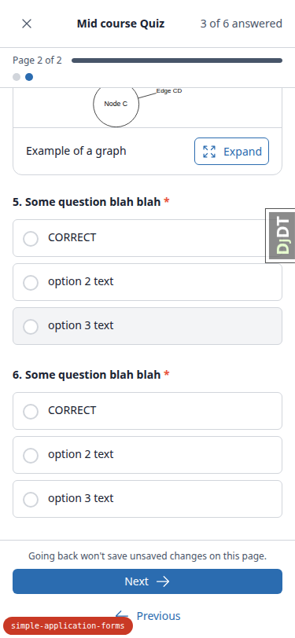
- **8.9.2** (mobile) — PASS. Quiz page 2: Next above Previous, both full width. Survey: one
  full-width Next, no page dots. Page dots render 10x10px — identical markup to `main`, so unchanged;
  recorded as an observation under General notes.
  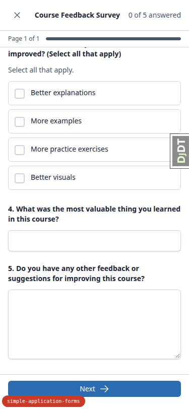
- **8.9.3** (mobile) — PASS. Exit dialog and submit dialog ("Ready to submit?") both fit inside
  375px with full-width Submit/Leave buttons and reachable Keep going/Go back links, no horizontal
  scroll.
  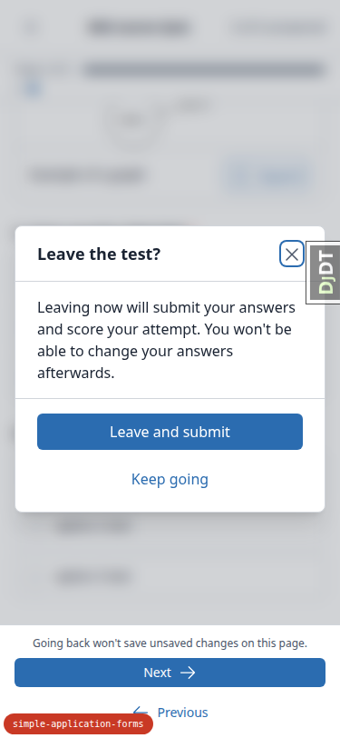
  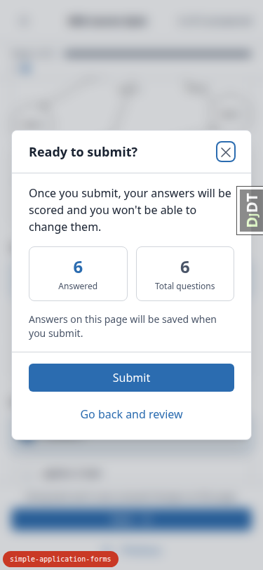
  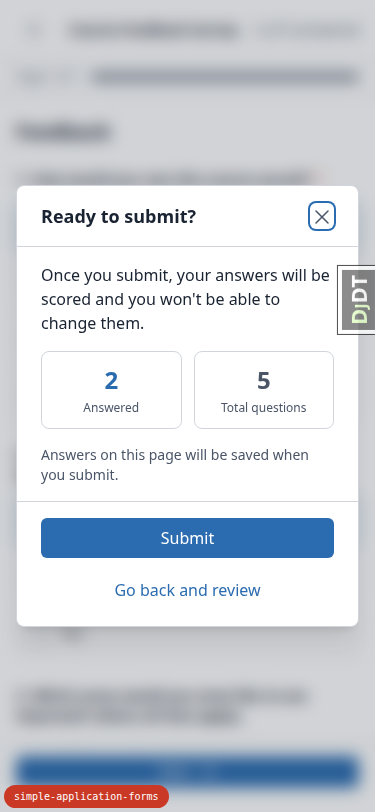

### §9 Loading content twice

- **9.1** (desktop) — PASS. Re-running `content_save` succeeds. Binding was checked through the app,
  not the admin — `CourseAdmin` exposes neither `application_form` nor `access_config` (not
  requested by the spec/plan; recorded as a plan-wording mismatch). The applicant's submitted
  application still opens; the bystander's draft still renders the form's "About you" page.
- **9.2** (desktop) — PASS. Pointing `course.md`'s `application_form` at a non-existent path makes
  `content_save` exit 1 with a `ValueError` naming the course and the missing path (raised as an
  uncaught traceback, not a `CommandError`). The gated course still serves its form while the edit is
  in place. Reverted via `git checkout`; re-run exits 0.

## Bug status

No bugs found this run.

## General notes

**Plan wording to fix**

- §2.4/2.5/§4.1.1 expect a server 422 on an empty "Next", but text/number/radio inputs carry HTML
  `required` (shared question markup, which the spec accepts), so a real browser shows its own
  "Please fill out this field." first and sends nothing. The server 422 path was exercised with
  client-side validation bypassed and works correctly. The file question (no `required` attribute)
  and the whole-form check on submit are the two places where the server check is the only guard,
  and both passed as specified.
- §8.1.3 describes the content block appearing before the questions; the demo form's authoring
  places it between Q1 and Q2, and the runner renders it in authored order. Not a defect — the plan
  should describe the authored order rather than assume a fixed position.
- §9.1/§9.2 ask to confirm the course/form binding "in the admin", but `CourseAdmin` shows neither
  `application_form` nor `access_config` (not requested by the spec or plan). The binding was
  confirmed through the app instead. Suggest rewording the plan on its next revision.

**Coverage gaps**

- Per the plan's own note at §8.6: no demo form ships a required checkbox group, so the client-side
  "Select at least one option." message (`data-checkbox-required-message`) cannot be reached from
  stock content. Confirmed the optional survey checkbox group renders no such element. Not forced,
  per the plan's instruction not to make a checkbox group required just to exercise this.

**Observations (no action filed)**

- The check-your-answers whole-form 422 callout reads "Question 2 needs an answer before you can
  continue." The check page shows no question numbers, so an applicant has to count rows to find
  "Question 2", and "continue" reads slightly oddly on a submit action. Works as specified — the
  message is reused verbatim from the runner.
- The application shell's page-jump dots are bare "1"/"2" spans or links with no `aria-current` or
  "(current)" label, whereas the course runner's dots announce "Page 1 (current)" / "Page 2 (not yet
  accessible)". Screen-reader users on the application form cannot tell which page is current from
  the nav alone.
- Pre-existing, unchanged on this branch: the course runner's page dots are 10x10px (`size-2.5`) with
  6px gaps, below the WCAG 2.2 24x24 target-size minimum at 375px. The markup is identical on `main`.
- Pre-existing: `_exam_runner_base.html` (unchanged on this branch) renders an empty `<title>`, so
  the browser tab is blank during a quiz.
- The file-type icon in the attached-file widget is announced as an image named "notes" (the `c-icon`
  component's documented default `role=img` with a semantic name). It's decorative in context; a
  decorative/`aria-hidden` variant would read better.
- In admin "Question answers", a file answer's Answer preview reads "-" rather than the filename. On
  the FormProgress delete-refusal page, the protected object reads
  "CourseApplication(73, 271eeb30-...)" (user id, course id) rather than a human-readable label.
- `content_save` with a missing `application_form` path fails correctly (exit 1, names the course and
  the path) but surfaces as an uncaught `ValueError` traceback rather than a clean `CommandError`
  message.
- The dashboard's "Your applications" rows are inset roughly 24px from the section heading, while the
  course card grids below sit flush, at every viewport checked.

**Run notes**

- Upload fixtures had to be copied into `.sdd-work/` because that and the project tree are the only
  roots Playwright MCP is allowed to read from. Playwright downloads land in `qa-screenshots/`, and
  one copy was moved out before collection. Accessibility-snapshot `.yml` and console `.log` files
  were deleted from `qa-screenshots/` before collection so only PNGs were committed. Stale scratch
  records from a previous run (29 lines) were stripped from `.sdd-work/qa_scratch.jsonl` at the start
  of this run.
- Rule-2 data fixes this run, all via `fls-dev:qa-data-helper`: reset the applicant/bystander/
  reviewer accounts and removed earlier runs' applications and sittings; deleted 4 stale
  admin-created forms ("Admin form one" x2, "QA slug check" x2) so §7.3 could test a clean slug;
  cleared the applicant's Mid course Quiz and Course Feedback Survey sittings to re-run the runner at
  375px.
- Console output showed only report-only CSP notices for CDN scripts and a YouTube embed frame, plus
  the expected 422 resource errors. None were related to this feature.

---

status: ok
reason: report rendered, 0 bugs documented, 93 test records, screenshots verified
