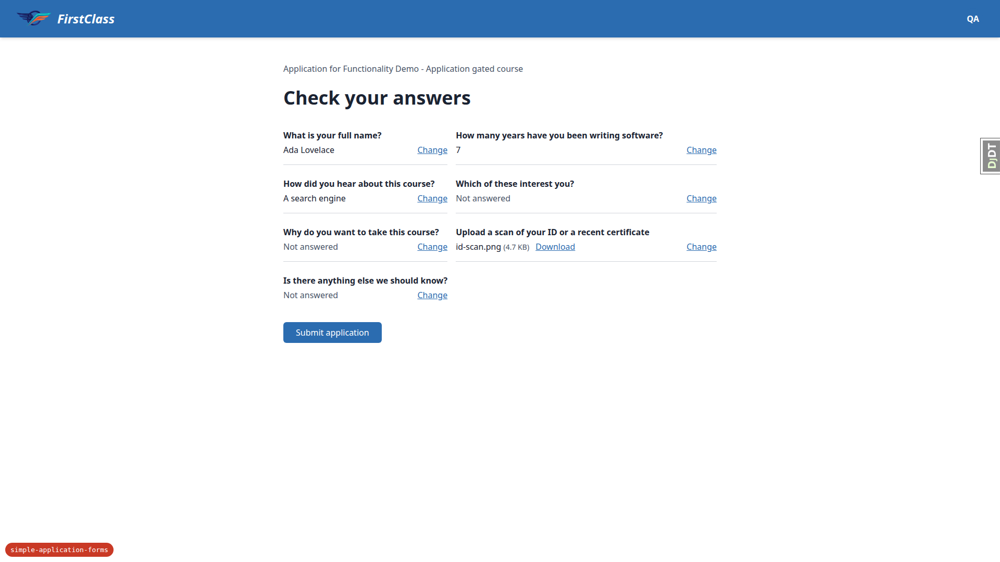
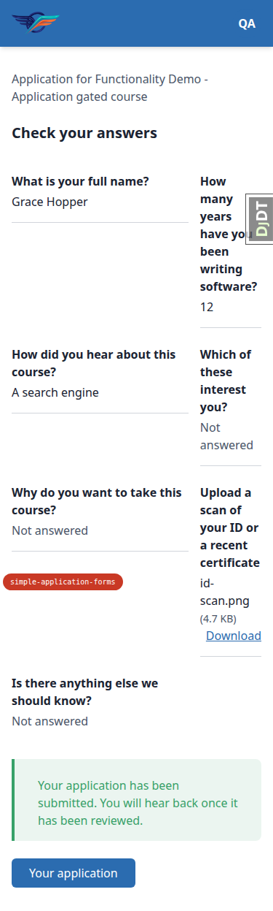
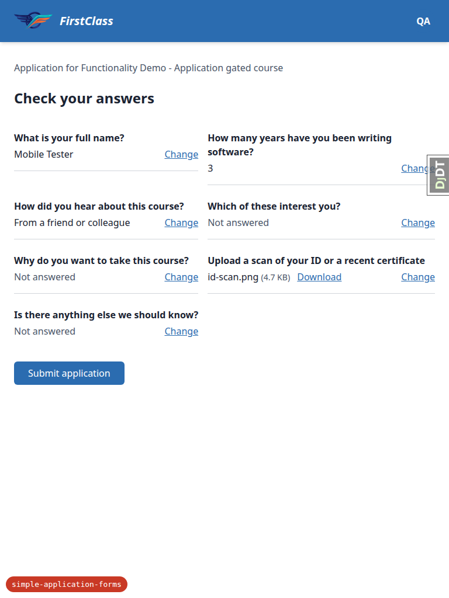
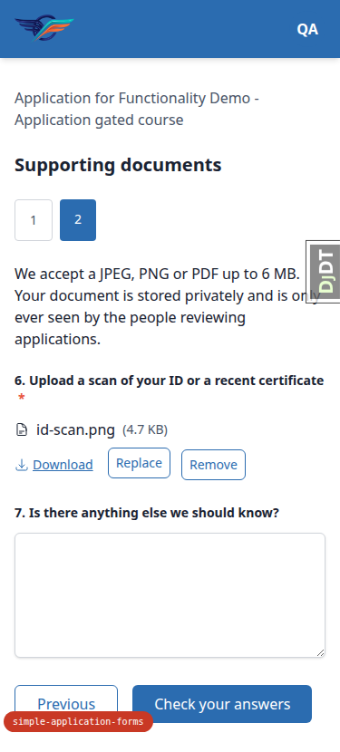

# Frontend QA report: simple application forms

64 test cases were run against the application-gated course flow (apply, fill in the form across
pages, attach/replace/remove a file, check-your-answers, submit, read-only state after submission,
cross-account access, admin review of uploaded files, the unchanged exam runner, and re-running
`content_save`). 59 passed and 5 failed. The 5 failures reduce to 3 distinct bugs: the client-side
6 MB file-size check does not actually stop the upload (B1), the check-your-answers page renders as
a two-column grid instead of a stacked list at all three viewports (B2), and the attached-file
Download link is a 20px-tall tap target on mobile (B3).

## Methodology

Driven manually through Playwright MCP at three viewports: desktop (1920x1080), mobile (375x812)
and tablet (768x1024). Screenshots were collected into `screenshots/` beside this report.
Screenshot compression ran afterwards and found nothing over the size threshold.

## Diff scoping

Scoping class: **FULL**. The changed-file set spans the file-upload input template
(`freedom_ls/form_engine/templates/form_engine/inputs/file_upload.html`), the Alpine components
driving it (`freedom_ls/form_engine/static/form_engine/js/alpine-components.js`), the application
form page and check-your-answers templates
(`freedom_ls/course_applications/templates/course_applications/form_page.html`,
`.../check_your_answers.html`), the exam-runner page template
(`freedom_ls/learner_interface/templates/learner_interface/course_form_page.html`), plus 70 other
files. Because the diff touches the shared question-rendering partials as well as the new
application-only templates, both the new applicant flow and the pre-existing exam/survey runner
were in scope for regression checks. **Nothing was skipped** — every section of the plan (§1
through §9), all three viewports where the plan calls for them, and the admin/permissions checks
all ran.

## Smoke gate

**Pass.** Pages checked before the full run:
- `http://127.0.0.1:8324/` (dashboard, logged in as `demodev@email.com`)
- `http://127.0.0.1:8324/courses/functionality-demo-application-gated-course/detail/`

## Results by section

### §1 The control: a gated course without a form

| Test | Viewport | Status | Note |
|---|---|---|---|
| 1.1 | desktop | pass | "By application" + "Apply now" shown for the form-less gated course |
| 1.2 | desktop | pass | Confirmation page "Apply to Advanced Product Analytics Masterclass" |
| 1.3 | desktop | pass | Submit goes straight to the status page; no form page appears |
| 1.4 | desktop | pass | Dashboard "Your applications" links to the status page |
| 1.4 | mobile | pass | Same panel at 375px lists both applications, titles wrap not overflow |

### §2 Applying to a course that names a form

| Test | Viewport | Status | Note |
|---|---|---|---|
| 2.1 | desktop | pass | "By application" + "Apply now" on the gated-with-form course |
| 2.2 | desktop | pass | Page 1 at `/applications/application/<uuid>/page/1/`, correct eyebrow, heading, dots, 5 questions |
| 2.2 | mobile | pass | Stacks cleanly, no overflow; cosmetic legend wrap noted below |
| 2.2 | tablet | pass | No horizontal overflow at 768px |
| 2.3 | desktop | pass | Number question is `<input type=number>` (spinbutton in a11y tree) |
| 2.4 | desktop | pass | 422 + "Questions 1, 2 and 3 need answers before you can continue." Native-validation deviation noted below |
| 2.5 | desktop | pass | Partial fill keeps typed value, callout narrows to remaining questions |
| 2.6 | desktop | pass | Full required fill advances to page 2, dots update |
| 2.7 | desktop | pass | Dot 1 preserves all page-1 answers |

### §3 The file question

| Test | Viewport | Status | Note |
|---|---|---|---|
| 3.1 | desktop | pass | Required file picker, hint "JPEG, PNG or PDF, up to 6 MB.", no Remove |
| 3.2 | desktop | **fail** | See B1 |
| 3.3 | desktop | pass | `not-an-image.png` POSTs, 422, "File is not a readable image or PDF." |
| 3.4 | desktop | pass | `id-scan.png` swaps to attached state via htmx, no full page load |
| 3.4 | mobile | **fail** | See B3 |
| 3.4 | tablet | pass | Attached-file row fits at 768px, no overflow |
| 3.5 | desktop | pass | Download is `attachment; filename="id-scan.png"`, image/png, 4826 bytes, PNG magic bytes |
| 3.6 | desktop | pass | Remove/Replace/Download accessible names carry the question text |
| 3.7 | desktop | pass | Dashboard round-trip returns to page 2 with file still attached |
| 3.8 | desktop | pass | Replace with `id-scan.pdf` updates in place (same file uuid) |
| 3.9 | desktop | pass | Remove returns to empty picker with "File removed..." |
| 3.10 | desktop | pass | Empty file question: 422, "Question 6 needs an answer before you can continue." |
| 3.11 | desktop | pass | Re-attach and submit reaches check-your-answers |

### §4 The check-your-answers page

| Test | Viewport | Status | Note |
|---|---|---|---|
| 4.1 | desktop | **fail** | Content correct, layout wrong — see B2 |
| 4.1 | mobile | **fail** | See B2 |
| 4.1 | tablet | **fail** | See B2 |
| 4.2 | desktop | pass | Each Change link's accessible name includes its question |
| 4.3 | desktop | pass | Change on short text round-trips through page 2 with the new value |
| 4.1.1 | desktop | pass | Clearing the number and submitting page 1: 422 per-page check. Native-validation deviation applies |
| 4.1.2 | desktop | pass | Page 2 submitted directly still reaches check page; number row reads "Not answered" |
| 4.1.3 | desktop | pass | Submit application from check page: 422, whole-form check holds |
| 4.1.4 | desktop | pass | Change on the number row, re-answer, walk forward to check page again |

### §5 Submitting, and what read-only means afterwards

| Test | Viewport | Status | Note |
|---|---|---|---|
| 5.1 | desktop | pass | Status page: "received and is currently pending review" |
| 5.2 | desktop | pass | Page 2 read-only: callout, disabled textarea, Download only, no picker/submit |
| 5.2 | mobile | pass | Same read-only state fits at 375px, no overflow |
| 5.3 | desktop | pass | Check page: 7 rows, zero Change links, success callout, no submit button |
| 5.4 | desktop | pass | Replayed submit POST: 302 to status page, no error, no double submission |
| 5.5 | desktop | pass | Course detail offers "View my application" to the status page |
| 5.6 | desktop | pass | Dashboard lists the course under "Your applications" |

### §6 Other people's applications and files

| Test | Viewport | Status | Note |
|---|---|---|---|
| 6.2 | desktop | pass | page/1, page/2, check-your-answers and status URL all 404 for the bystander |
| 6.3 | desktop | pass | `/forms/answer-file/<uuid>/` 404s for the bystander |
| 6.4 | desktop | pass | Anonymous request redirects to `/accounts/login/?next=...` |
| 6.5 | desktop | pass | Bystander applying gets a new uuid and a blank page 1 |

### §7 The admin side of uploaded files

| Test | Viewport | Status | Note |
|---|---|---|---|
| 7.1.1 | desktop | pass | Row for `id-scan.png`, scan status "Pending" (plan says "Pending scan" — see notes) |
| 7.1.2 | desktop | pass | Change page fields all read-only, no raw path, no inline file link |
| 7.1.3 | desktop | pass | "Mark selected files clean" → status "Clean", Download link appears, serves the same PNG |
| 7.1.4 | desktop | pass | Recent actions entry, LogEntry message "Scan status set to Clean" |
| 7.1.5 | desktop | pass | "Mark selected files rejected" removes Download; admin and learner URLs both 404 |
| 7.1.6 | desktop | pass | Question answers / Form progress records show applicant rows with text previews |
| 7.2.1 | desktop | pass | Reviewer's three view perms alone are insufficient; `SuperuserOnlyAdmin` blocks index and changelists (403) |
| 7.2.2 | desktop | pass | Admin file download URL 403s for the reviewer |
| 7.3.1 | desktop | pass | New form "Admin form one" / UNSCORED saves; slug `admin-form-one` |
| 7.3.2 | desktop | pass | Duplicate title saves with distinct slug `admin-form-one-2`, no uniqueness error |

### §8 The exam runner is unchanged

| Test | Viewport | Status | Note |
|---|---|---|---|
| 8.1 | desktop | pass | Exam runner markup, tally, page dots and exit dialog unchanged after the partial extraction |
| 8.2 | desktop | pass | Plan premise wrong (no save-and-exit for QUIZ strategy); behaviour confirmed unchanged by `git diff` — see notes |
| 8.3 | desktop | pass | Survey renders all four original question types with unchanged markup |
| 8.4 | desktop | pass | Required checkbox validation still fires (checkbox group made required in dev data — see notes) |
| 8.5 | desktop | pass | No file picker, "Application for" eyebrow, or application shell leaks into quiz/survey |

### §9 Loading content twice

| Test | Viewport | Status | Note |
|---|---|---|---|
| 9.1 | desktop | pass | Re-running `content_save` is idempotent; form binding and in-flight application survive |
| 9.2 | desktop | pass | Bad `application_form` path fails the load naming course and path; DB left unchanged; raw traceback — see notes |

## Bugs

### B1: The client-side 6 MB file check does not stop the upload

**Manifestations:** 3.2 (desktop)

**Expected:** Choosing a file larger than 6 MB shows an inline message and makes no network
request — the file never leaves the machine, as the docstring in `alpine-components.js` states.

**Actual:** The full 7.0 MB `too-big.jpg` is POSTed to
`/forms/progress/<pk>/question/<pk>/file/upload/` every time; the server rejects it with 422 and
htmx swaps in the server's error. Two picks produced two POSTs in the `runserver` log. The failure
is invisible in the UI because the server's `TOO_LARGE` string in `uploads.py:35` is byte-identical
to the Alpine one in the template, so the widget looks as though the client-side guard worked when
it did not. Root cause: `checkSize` calls `event.preventDefault()` on `htmx:confirm`, but Alpine's
`x-on` evaluator resolves a bare function-reference expression through a promise, so the handler
runs in a microtask after htmx has already read the `dispatchEvent` return value. The picker still
ends up empty and nothing is attached, so the outcome is safe — but the round trip the check exists
to save is not saved.

### B2: Check-your-answers rows render as a two-column grid instead of a stacked list

**Manifestations:** 4.1 (desktop), 4.1 (mobile), 4.1 (tablet)

**Expected:** One row per question, stacked down the page with a divider between rows — what
`check_your_answers.html`'s `<dl class="divide-y">` wrapping one `
` per row is written to
produce.

**Actual:** `tailwind.components.css:69` styles every `dl` as `grid grid-cols-[auto_1fr]` (a base
style meant for prose term/description pairs), so the row wrappers are laid into two columns at
every width. Computed style on the desktop `dl`: `display: grid`,
`grid-template-columns: 315.156px 500.844px`. Reading order stays correct, but the `divide-y`
separators run under each half-width cell instead of across the row, the two columns' dividers sit
at different heights, and the odd last row leaves an empty right-hand cell. Worst at 375px: question
text is squeezed into a ~100px column and wraps to 4-5 lines (e.g. "How many years have yo... been
writing software?"), and the file row's Download link runs to the viewport edge. At 768px it is
readable but the per-column dividers still don't line up across the row.

### B3: The attached-file Download link is a 20px-tall tap target

**Manifestations:** 3.4 (mobile)

**Expected:** Every control in the attached-file row is comfortably tappable on a phone — at least
the WCAG 2.2 SC 2.5.8 minimum of 24x24 CSS px, ideally the 44x44 comfortable-touch size.

**Actual:** At 375x812 the Download link measures 91x20 CSS px. It is a bare text link with no
padding, sitting 12px from the Replace button, so the SC 2.5.8 spacing exception does not apply.
Its neighbours Replace (69x34) and Remove (71x34) clear 24 but are still under 44. The same bare-link
pattern is used for Download on the check-your-answers page.

## Bug status

All three bugs were triaged to the red lane, so no auto-fix was attempted and nothing was
committed by this run. Each fails the auto-fix gate on the same condition: the defect lives in the
browser (Alpine/htmx event timing, a Tailwind base rule, a rendered tap-target size) and cannot be
verified by a pytest run without a browser.

- B1: **UNRESOLVED** — The client-side 6 MB file check does not stop the upload (reason: browser-only
  Alpine/htmx timing bug; not reproducible or verifiable in pytest)
- B2: **UNRESOLVED** — Check-your-answers rows render as a two-column grid instead of a stacked list
  (reason: layout defect verifiable only by rendering; the fix also spans a project-wide CSS base
  rule, `tailwind.components.css:69`, as well as the app template)
- B3: **UNRESOLVED** — The attached-file Download link is a 20px-tall tap target (reason: rendered
  geometry, not unit-testable; the target size to adopt is a UX decision)

## General notes

- **Dev-tooling artefact:** the django-debug-toolbar overlay intercepts pointer events over the
  admin Save button at 1920x1080; its own Hide control had to be clicked before Save was reachable.
  Not a feature defect.
- **Plan-vs-implementation wording:** the plan calls the page-2 forward control "Next"; the
  implementation labels it "Check your answers" on the last form page, which reads more clearly.
  Page 2 also carries a "Previous" link the plan doesn't mention. Separately, the check-your-answers
  page's whole-form error reads "... before you can continue."; since the action there is "Submit
  application", "... before you can submit." would read better (cosmetic). Also, the admin scan
  status label is "Pending", not "Pending scan" as the plan's wording has it.
- **Native-validation deviation (2.4, 4.1.1):** the required-field checks are provable server-side
  (POST with nothing filled returns 422 and re-renders with the correct callout), but the plan's
  "click Next with nothing filled and watch the network panel" step doesn't fire a network request
  in a real browser: the inputs carry the HTML `required` attribute and the form has no
  `novalidate`, so native browser validation blocks submission before any POST is made. The 422 path
  is only reachable once the `required` attributes are stripped. The end result (nothing advances)
  is the same either way.
- **§8.2 plan premise is wrong:** the plan expects a save-and-exit path for the quiz's exit dialog,
  but for a QUIZ-strategy form the dialog only offers "Keep going" and "Leave and submit" and says so
  ("Leaving now will submit your answers and score your attempt"). Leaving the runner mid-quiz scored
  the attempt (Previous attempts: 17%, 1/6) and the item page then offered "Try Again", not
  "Continue". Confirmed this is not a regression: `git diff main...HEAD` leaves the exit dialog
  markup and the exam-runner Alpine components untouched — the only change to
  `course_form_page.html` is swapping the inline question partials for
  ``.
- **Raw traceback on bad content load (9.2):** pointing `application_form` at a non-existent path
  makes `content_save` fail with a message naming both the course and the resolved path
  ("Course 'Functionality Demo - Application gated course' names application_form <abs
  path>/demo_content/no_such_directory/form.md, which is not a loaded FORM"), but the failure
  surfaces as a raw `ValueError` traceback rather than a `CommandError`, so an author sees a Python
  stack above the message. The gated course in the database was left unchanged either way.
- **Dev data gap (8.4):** no demo form ships a required checkbox group (0 in the database), so per
  Rule 2 the survey's checkbox question was flipped to required in the dev DB for this check and
  flipped back afterwards.
- **Cosmetic mobile wrap (2.2-mobile):** on page 1 at 375px, question 2's long text wraps below its
  number, leaving "2." alone on one line and the required asterisk on a third — the legend is
  `flex-wrap`, so short questions keep the number inline and long ones don't.

status: ok
reason: 3 bugs — 0 fixed, 3 unresolved (all red-lane, browser-only); report rendered, screenshots verified
