# Frontend QA report: simple application forms

An application-gated course can now name an application form, and applying walks the learner
through that form page by page, lets them attach a file, shows them a check-your-answers page,
and only then records the submission. This run walked that whole flow end to end, tried to break
it the way an applicant plausibly would, checked the admin side of uploaded files, and then walked
the course player's own quiz and survey forms to confirm the shared question markup and page
arithmetic still behave exactly as they did before this branch. The plan ran to completion with no
smoke abort: every one of its nine sections executed. Two bugs came out of it, both red-lane
(neither auto-fixable without a browser or a product decision, so both are documented here
unresolved rather than fixed): a dead client-side file-size guard on the application form's upload
widget, and a page-jump nav on the application shell that re-locks a page the applicant has
already reached, caused by pre-existing page-accessibility arithmetic meeting optional questions
for the first time.

## Methodology

The run drove a real browser through the Playwright MCP tools rather than reading templates. Three
viewports were exercised: desktop at 1920x1080, mobile at 375x812, and tablet at 768x1024.
Screenshots were collected into `screenshots/` beside this report; every image referenced below is
present in that directory alongside a handful more that were captured but not needed for the
narrative. PNG compression ran across the set and reported no file over 1024KB, so nothing needed
shrinking. The smoke gate passed, so the run proceeded past it to the full plan; Steps 7, 8 and 9
(admin, course-player forms, and reload) all executed rather than being skipped for time.

## Diff scoping

Scoping classed this change **FULL**, on the basis of the changed template and static paths. A
representative handful from the `scoping` record's `changed_files`:

- `freedom_ls/course_applications/templates/course_applications/check_your_answers.html`
- `freedom_ls/course_applications/templates/course_applications/form_page.html`
- `freedom_ls/form_engine/templates/form_engine/question.html`
- `freedom_ls/form_engine/templates/form_engine/inputs/*.html`
- `freedom_ls/form_engine/static/form_engine/js/alpine-components.js`
- `freedom_ls/learner_interface/templates/learner_interface/course_form_page.html`
- `freedom_ls/form_engine/views.py`, `freedom_ls/course_applications/views.py`
- `freedom_ls/form_engine/paging.py`, `freedom_ls/form_engine/uploads.py`, `freedom_ls/form_engine/admin.py`
- `demo_content/functionality_demo_application_form/*`

plus ~80 further .py/.md files. Nothing was skipped: the desktop, mobile and tablet passes all ran
in full.

## Smoke gate

The smoke gate passed. It loaded two pages before the full run started: the site root
(`http://127.0.0.1:8324/`) and the application-gated course detail page
(`http://127.0.0.1:8324/courses/functionality-demo-application-gated-course/detail/`). Port 8324
was chosen deliberately to match the `DemoDev` site's configured domain `127.0.0.1:8324`, which the
site-resolution middleware keys on.

## Results by plan section

### §1 The control: a gated course without a form still works as before

Pass. The gated course with no `application_form` still shows "By application" and "Apply now" on
its detail page, "Apply to Advanced Product Analytics Masterclass" on confirmation, and lands
straight on the received/pending-review status page on submit — no form page is interposed at any
point. The dashboard's "Your applications" panel lists it and links to the status page. This test
only became reachable once `OVERRIDE_COURSE_ACCESS_TO_FREE` was turned off; see General notes.

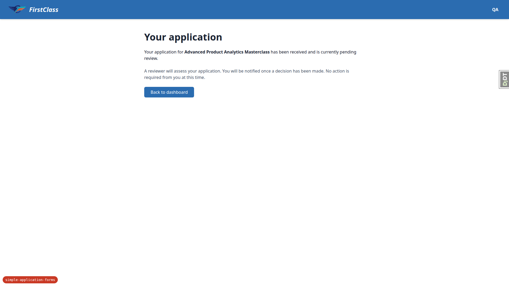

### §2 Applying to a course that names a form

Pass, with one documented deviation from the plan's expectations (not a defect). "Apply now" then
"Submit application" lands on `/applications/application/<uuid>/page/1/`: eyebrow "Application for
<course>", heading "About you", page dots with 1 highlighted and 2 not a link, and the five page-one
questions (short text, number, multiple choice, checkbox group, long text). The number question is
a real `<input type="number">`.

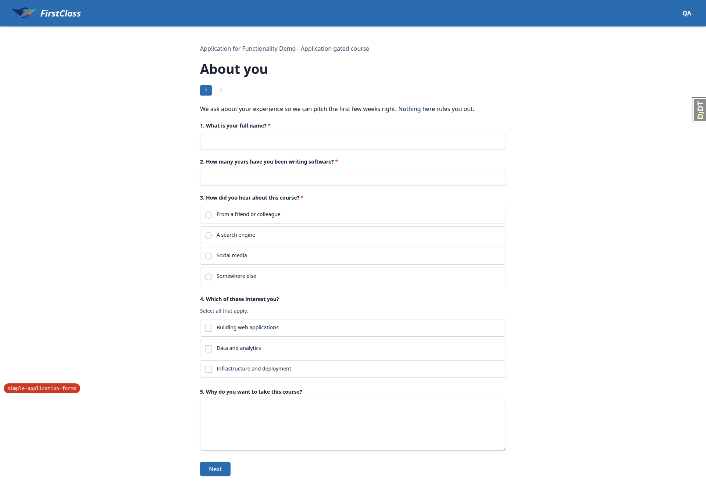

The plan expects clicking "Next" with nothing filled to produce a 422 callout (test 2.4). In
practice it doesn't reach the server at all: the shared question templates put the native HTML
`required` attribute on short-text, number and radio inputs, so the browser blocks the submit
before any request goes out. The server-side check was confirmed correct by stripping the
`required` attributes in devtools and resubmitting — it comes back HTTP 422 with "Questions 1, 2
and 3 need answers before you can continue," exactly as the plan describes. See General notes for
the implication.

With the required attributes stripped and only the short text filled, the 422 re-render named
exactly the remaining required questions ("Questions 2 and 3 need answers before you can
continue"), and the typed short text survived the rejection.

Filling every required question and leaving the optional checkbox group and long text blank
advances to page 2 ("Supporting documents"), dot 2 current, dot 1 a link, with question numbering
continuing at 6 and 7 rather than restarting. Clicking dot 1 returns to page 1 with all three
answers preserved, and Next returns to page 2 — though dot 2 is re-locked on the way back; that's
bug B2, covered below.

### §3 The file question

Mixed: everything passed except the client-side size guard, which is bug B1.

Page 2 shows the required file question with a real file picker and the hint "JPEG, PNG or PDF, up
to 6 MB," no Remove button yet. Picking the 7 MB oversize file does not trigger the expected
inline, request-free rejection — see B1. Picking a mislabelled text file (`not-an-image.png`)
correctly POSTs, comes back 422, and re-renders with "File is not a readable image or PDF," with
nothing attached.

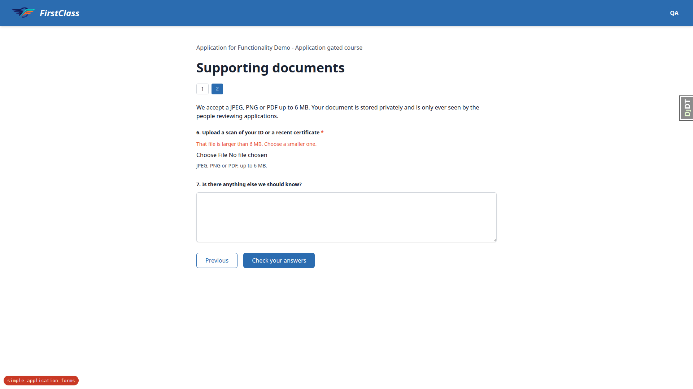

Picking a real PNG swaps the widget to its attached state with no full page load — filename,
"(4.1 KB)", a Download link, Replace and Remove — and downloading it returns the exact bytes
uploaded (PNG magic, correct Content-Disposition). Accessible names on Remove, Replace and
Download all carry the question text rather than being bare labels.

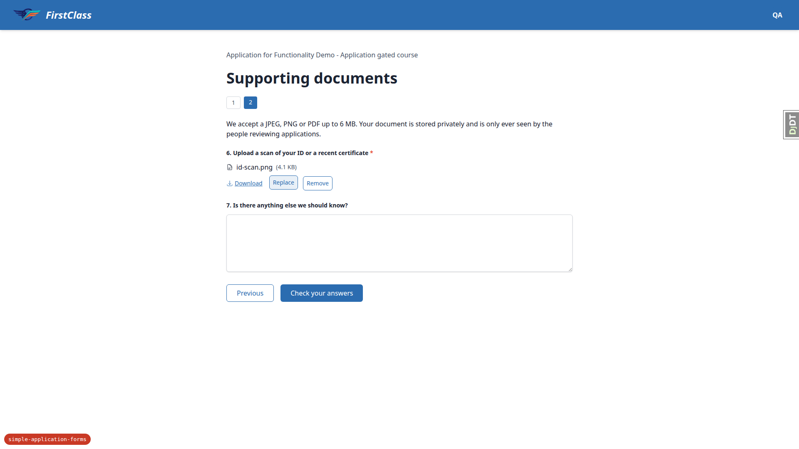

Leaving mid-page for the dashboard and returning lands back on page 2 with the file still attached,
proving the status URL redirects to the resume page rather than the status page while the
application is a draft. Replace swaps the file cleanly (same answer-file UUID, updated in place,
not duplicated), and Remove returns the empty picker with a message that the question needs a
file. Submitting with the file empty re-renders 422 naming that question; re-attaching and
continuing reaches check-your-answers as expected.

At 375px, page 2 lays out cleanly: the eyebrow wraps, the page dots stay tappable, the
attached-file row wraps its Download/Replace/Remove controls onto their own line, and the
Previous/Check-your-answers pair sits at the foot without overflow.

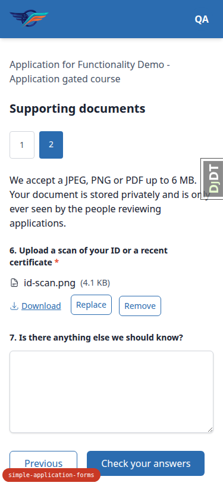

### §4 The check-your-answers page

Pass throughout. The page renders the title, the "Nothing is sent until you press Submit
application" note, and one card per form page in form order (About you, Supporting documents).
Each card has a tinted header with the page title left and a pencil-and-Edit link right; each body
row runs the full card width with the question as a muted label and the answer beside it. Skipped
optional questions read "Not answered." The file row shows the filename, size and a Download
control with no thumbnail — no two-column grid anywhere.

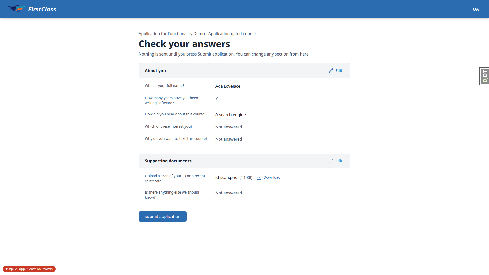

Edit links carry their page title in the accessible name ("Edit About you," "Edit Supporting
documents"). Clicking Edit opens the relevant page at `?return=check` with answers pre-filled,
"Back to your answers" in place of Previous, and a "Save and return to your answers" primary
button; saving lands straight back on the check page with the new value. "Back to your answers"
with no change returns unchanged. Jumping to another page from edit mode drops the `?return=check`
marker and restores the normal Previous/Check-your-answers button pair — jumping elsewhere leaves
edit mode, as intended.

The whole-form check (not per-page) was proven directly (test 4.1): clearing the number on page 1
and posting it gives the per-page 422 as expected, but posting page 2 directly (skipping page 1)
succeeds and reaches the check page with the number reading "Not answered" — page order is not
enforced on POST. Submitting from the check page then re-renders it with HTTP 422 naming the
number question, catching the earlier page's gap. Editing the number back in and saving returns a
filled-in check page.

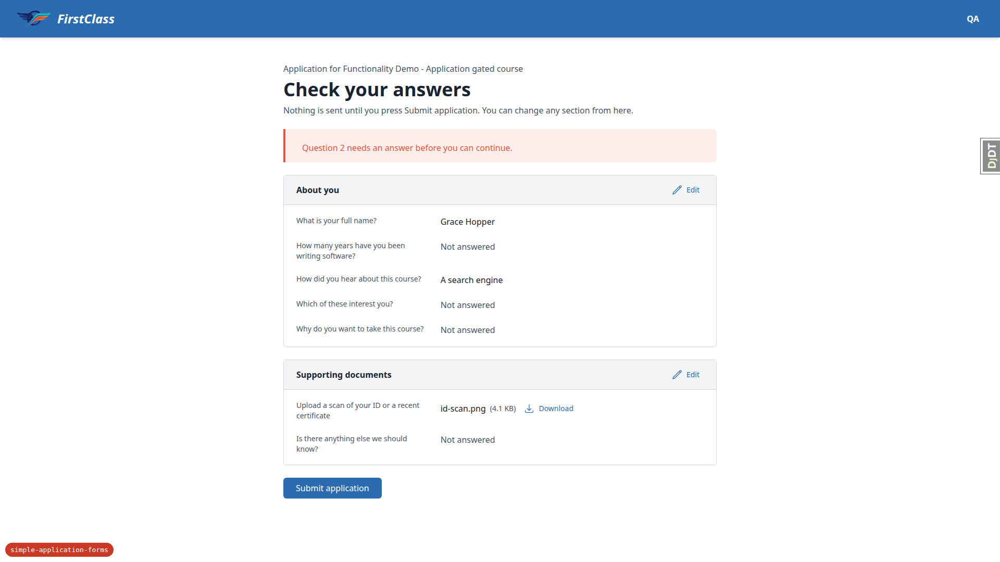

At 375px, each row stacks the question above its answer, cards fill the width, there's no
horizontal overflow, and both the Download control (111x32) and each Edit link (69x32) clear the
24px touch-target floor comfortably.

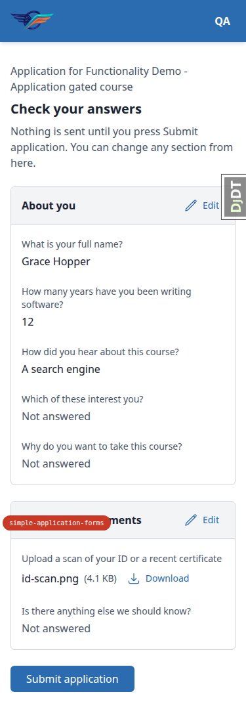

### §5 Submitting, and what read-only means afterwards

Pass. Submitting lands on the status page ("received and is currently pending review"). Re-opening
page 2 afterward renders read-only: the callout that the application has been submitted and can no
longer be changed, the textarea disabled, the file shown with Download only (no Replace, no
Remove), and a "Your answers" link in place of any Next/submit control. The check-your-answers page
shows the same cards with no Edit links, a success callout, and no submit button. Replaying the
submit POST from a stale tab redirects to the status page with HTTP 200 and no error. The course
detail CTA now reads "View my application" pointing at the status URL, and the dashboard entry
leads there too.

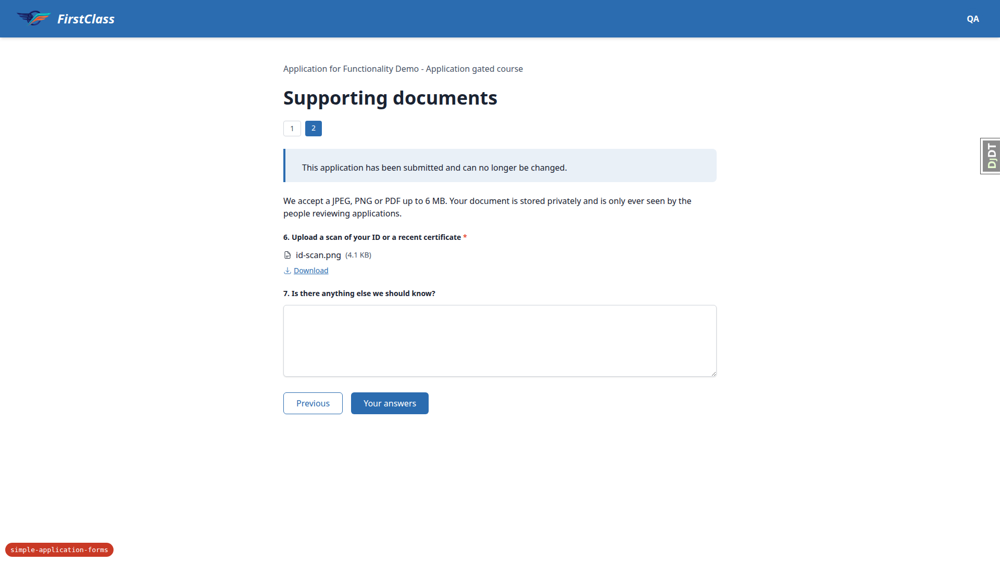

### §6 Other people's applications and files

Pass. As the bystander, the applicant's page/1, check-your-answers and status URLs all 404, as does
the answer-file download URL. Anonymously, the same download URL redirects to login. The bystander
applying to the same gated course gets their own fresh application opening on an empty page 1 —
none of the applicant's answers leak across accounts.

### §7 The admin side of uploaded files

Pass throughout. As the superuser, the "Question answer files" changelist lists the applicant's
file with Applicant / Question / Original filename / Created at / Download columns, a "By created
at" filter, and no scan-status column or filter anywhere — correctly, since FLS does no malware
scanning. The actions dropdown offers only "Delete selected question answer files," no clean/reject
actions. The change page is read-only (filename and timestamps only, no raw path, no inline file
link). The admin download returns the correct bytes as an attachment.

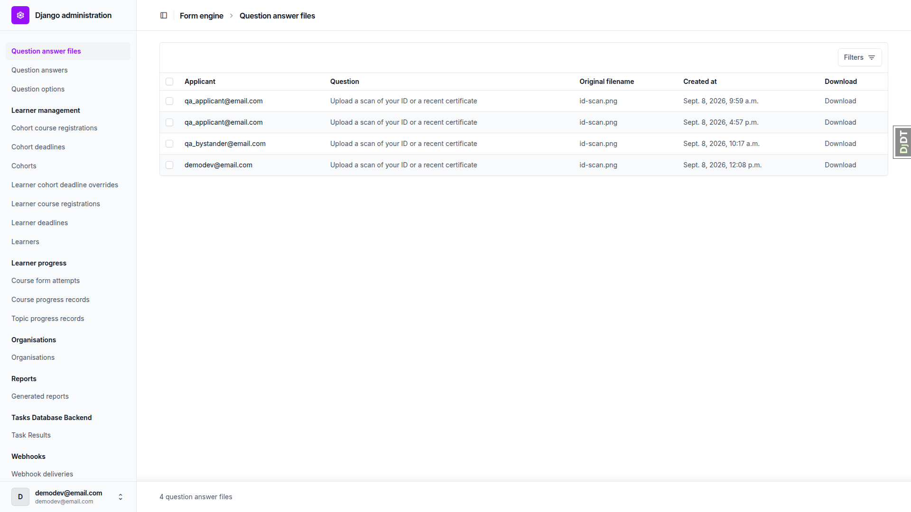

"Question answers" and "Form progress records" both show the applicant's rows with text answers
rendered in the preview column. Attempting to delete the applicant's form progress record via the
admin action is refused: FLS shows the "Cannot delete form progress" page listing the course
application as a protected related object, with no confirmation button, and the row survives.

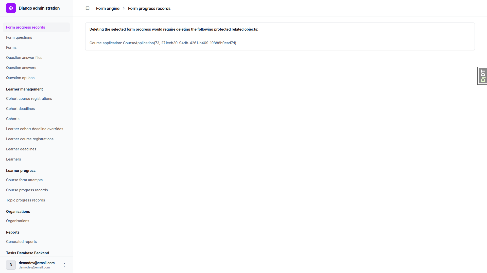

As the reviewer (staff, not superuser, holding the three view permissions directly), none of
"Question answers," "Form progress records" or "Question answer files" appear on the admin index,
and all three changelists plus the file-download URL return 403 by direct URL — the model
permissions buy nothing without superuser status, which is the point of the check.

Adding a form in the admin with only a title and UNSCORED strategy saves and shows a read-only
slug (`admin-form-one`); adding a second form with the identical title also saves, getting a
distinct slug (`admin-form-one-2`) rather than a uniqueness error. Residual rows from an earlier
run were cleared first so the numbering could be observed from a clean start.

### §8 The course player's own forms are unchanged

Pass throughout, across the multi-page quiz, the single-page survey, and the single-page quiz.

The multi-page quiz's start screen sits inside the ordinary player chrome (sidebar, breadcrumb)
with title, "6 questions," "2 pages" and a single "Start Form" button. The runner itself drops the
site header and course sidebar entirely: a sticky top bar (exit X, centred title, "0 of 6
answered"), a "Page 1 of 2" progress bar with two page dots, and three required radio-group
questions numbered 1–3 with no checkbox hint, no number spinner, no file picker. Answering updates
the tally live with no page load.

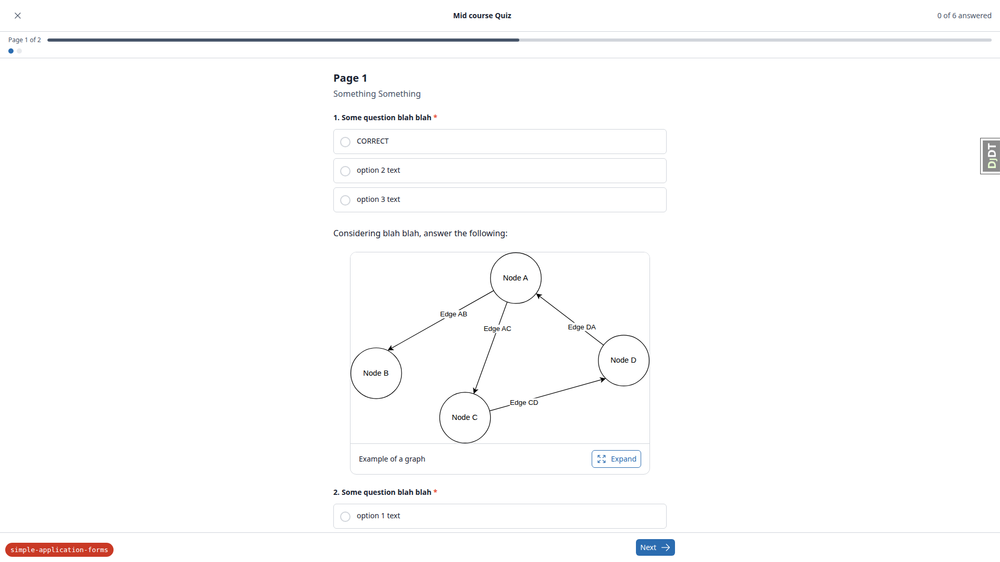

Clicking Next with a question blank is blocked by the browser's own required-field validation.
Answering all three and advancing reaches page 2 with numbering continuing at 4–6, not restarting.
Stepping back to page 1 via dot 1 leaves dot 2 still a link — the course runner does not re-lock a
page already reached, in contrast to the application shell (see B2).

The exit dialog for a `submit_on_exit` quiz reads "Leaving now will submit your answers and score
your attempt... You won't be able to change your answers afterwards," with Escape and "Keep going"
both leaving the runner untouched. "Leave and submit" with page 2 blank produces the results page:
score ring at 50%, "Quiz not passed," and the incorrect answers listed, since
`quiz_show_incorrect: true`.

"Try Again" opens a fresh sitting on page 1 with the tally reset and dot 2 re-locked — a new attempt
does not inherit the previous resume page. A clean retake with all correct answers opens a "Ready
to submit?" confirmation dialog rather than posting straight through, and confirms to a 100%,
"Quiz passed!" results page with no incorrect-answer list; the outline marks the item complete and
unlocks the next one.

The save-on-exit quiz ("End course Quiz," `submit_on_exit` unset, `quiz_show_incorrect: false`)
shows the same dialog frame with different copy — "Your progress is saved — you can resume later"
— and a "Leave and save" control. Leaving mid-quiz returns the start screen offering "Continue
Form," which resumes on page 2 (not page 1) with the prior tally and both dots as links. Submitting
gives a results page scored against the 50% pass mark. Retaking with every answer deliberately
wrong confirmed the suppression: "Quiz not passed," 0%, and no "Review incorrect answers" section
at all — `quiz_show_incorrect: false` is honoured.

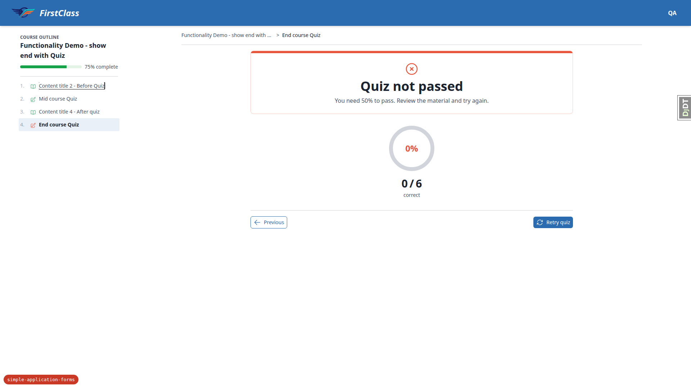

The single-page survey ("Course Feedback Survey") correctly shows none of the multi-page furniture:
no page-jump nav, "Page 1 of 1" at full width, no Previous link, no "going back" note. All four
original question types render as before (two radio groups, a checkbox group with the "Select all
that apply" hint, a text input, and a textarea), with required asterisks only on questions 1 and 2.
Next opens the submit dialog immediately rather than advancing a page.

Submitting gives the non-quiz results page: "Form complete!" with category score bars for
Satisfaction and Recommendation, no score ring, no pass/fail verdict.

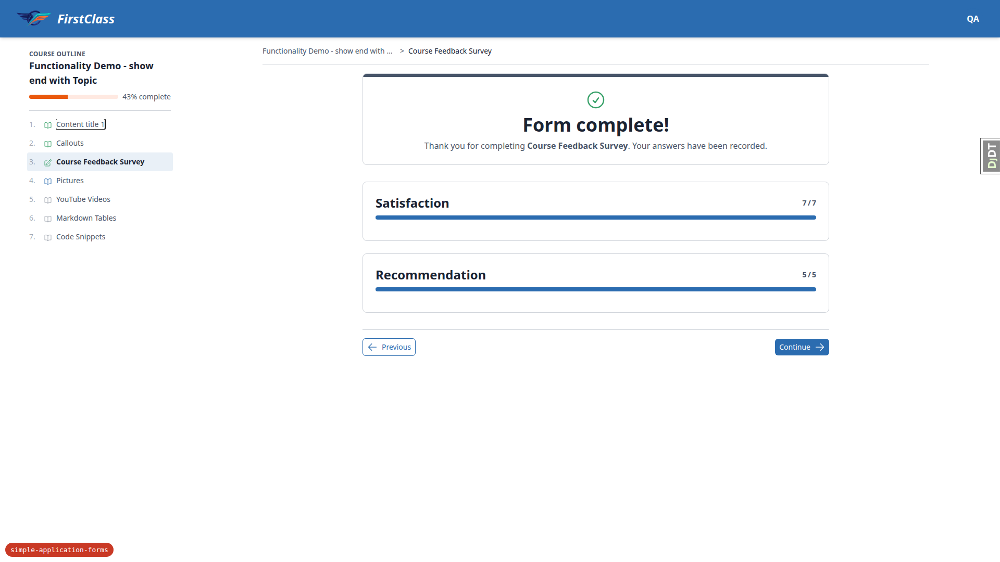

The single-page quiz ("Knowledge Check," inside "Core Concepts") behaves the same way structurally:
one page, no dots, "Page 1 of 1," no Previous link. Getting two of three correct gives a failed
result at 67% against the 80% pass mark with the one wrong answer listed; retaking with all three
correct passes cleanly, marks the outline item and its parent complete, and unlocks the next part.

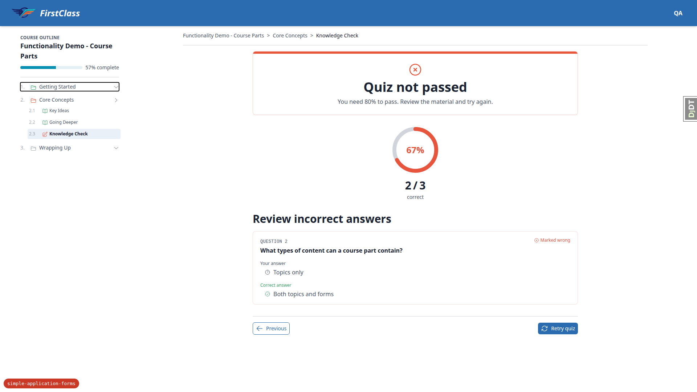

A grep across all 28 runner snapshots captured this run, for application-shell-only strings
("Application for", "Back to your answers", "Save and return to your answers", "spinbutton", the
file-upload control) returned zero hits — nothing from the application shell leaks into the course
player's forms, and the runner correctly hides the site header/sidebar only while itself open.

At 375px, the multi-page quiz keeps its sticky top and footer bars pinned while the questions
region scrolls between them; footer buttons go full width and stack (Next above Previous); the
single-page survey shows one full-width button and no dots. Both the exit and submit dialogs fit
the 375x812 viewport with their buttons reachable and no horizontal scroll.

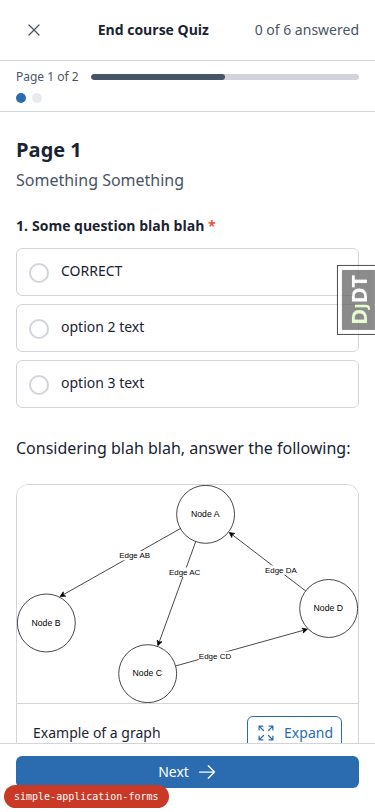
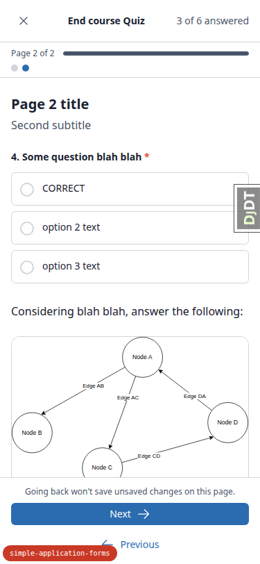
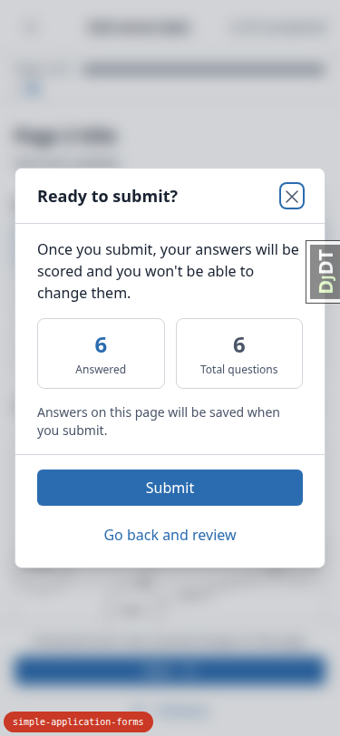

Tablet coverage of the check-your-answers page and the read-only submitted page confirmed both lay
out cleanly at 768x1024 with no horizontal scroll: cards fill the column with rows keeping question
left, answer right; on the submitted page every input renders disabled while still showing stored
answers.

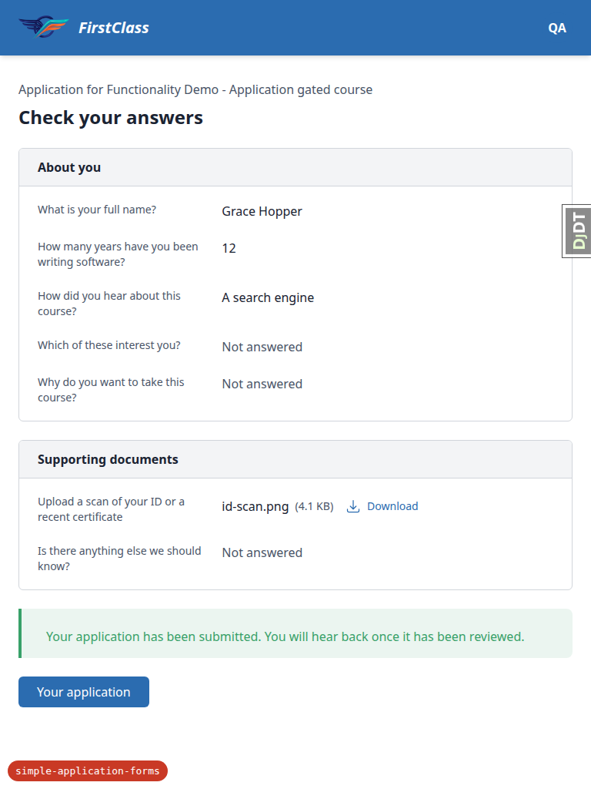
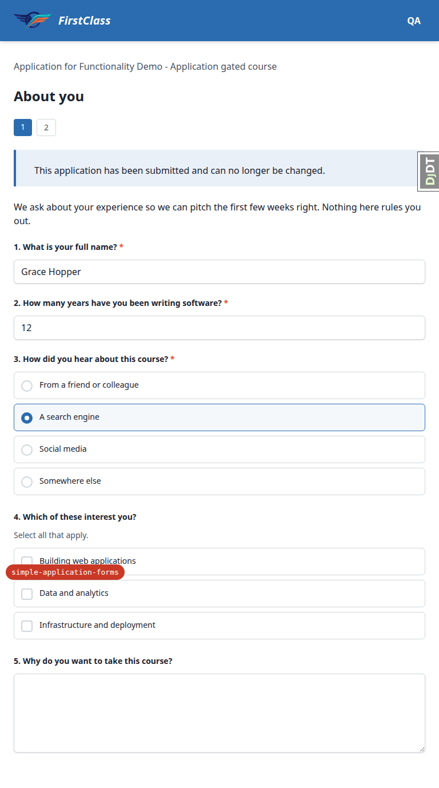

### §9 Loading content twice

Pass. Re-running `content_save demo_content DemoDev` is idempotent: the gated course still binds
the same Form row and the applicant's submitted application still points at the same FormProgress
and opens its status page. Pointing `application_form` at a nonexistent path makes the load fail,
naming both the course and the resolved path, and leaves the gated course unchanged (still bound to
its original Form and access config) — the failure is atomic. Reverting the edit and re-running
loads cleanly again. The failure surfaces as an unhandled `ValueError` with a full traceback rather
than a clean `CommandError`; noted under General notes.

## B1: The file question's client-side size guard never fires, so an oversize file is uploaded in full before the server rejects it

**Manifestation:** test 3.2, desktop viewport.

**Expected:** selecting a file larger than 6 MB shows the inline Alpine message "That file is
larger than 6 MB. Choose a smaller one." and issues no network request; the picker clears.

**Actual:** the full 7 MB file is POSTed to `/forms/progress/<pk>/question/<pk>/file/upload/` and
comes back 422. The message the applicant sees is the server's error paragraph, not the
client-side one — the Alpine paragraph bound with `x-show="oversized"` stays `style="display:
none"`, meaning `questionFileUpload.checkSize` never ran.

Evidence gathered live in the browser: a document-level listener saw `htmx:confirm` fire on the
input with `defaultPrevented=false`, and `htmx:beforeRequest` followed immediately after —
confirming the request proceeds unchecked. Dispatching a synthetic `htmx:confirm` `CustomEvent`
directly at the input left `oversized` still `false`. Alpine itself is demonstrably live on that
element (it stripped `x-cloak` and applied `x-show` correctly elsewhere), so the specific binding
at fault is `x-on:htmx:confirm="checkSize"` — the colon inside the event name is the obvious
suspect under an Alpine CSP build. (This diagnosis turned out to be wrong; the corrected cause is
under "Rerun after the fixes" below.)

Server-side validation still refuses the file correctly, so nothing unsafe is stored. The cost is
purely the wasted upload the client-side guard exists to prevent: on a slow connection, an
applicant now waits out a full 7 MB transfer only to be told afterward that the file was too big.

## B2: The application form's page-jump nav re-locks a page the applicant has already reached

**Manifestation:** test 2.7, desktop viewport.

**Expected:** stepping back to page 1 leaves dot 2 a link, exactly as the course runner does (test
8.2) — a page you have already reached should stay reachable.

**Actual:** after advancing to page 2 and clicking dot 1 to go back, dot 2 renders as a plain span,
not a link. The applicant has to press Next again to re-reach page 2 rather than jumping directly.

**Cause:** `page_accessibility_limit` is computed as `max(resume_page_number,
current_page_number)`, and `resume_page_number` leans on `FormProgress.get_current_page_number()`,
which returns the first page holding any unanswered question. The demo application form's page 1
has two optional questions, and the plan's own step 2.6 has the applicant skip them, so that call
returns 1 and the limit collapses back to 1 once the applicant is viewing page 1. The course runner
never exhibits this because every demo quiz question is required, so its first page is always fully
answered and the limit stays at the page actually reached. The arithmetic itself is a faithful port
of the shipped runner rule — this is not a regression, it's that rule meeting optional questions
for the first time in the new application shell.

## Bug status

- **RESOLVED** — The file question's client-side size guard never fires, so an oversize file is uploaded in full before the server rejects it. See the rerun below.
- **RESOLVED** — The application form's page-jump nav re-locks a page the applicant has already reached. See the rerun below.

## Rerun after the fixes

Both bugs were fixed with a failing test first, and tests 2.6, 2.7, 3.1 and 3.2 were walked again
in a real browser as the applicant, on a fresh application.

**B1, corrected cause.** The `x-on:htmx:confirm="checkSize"` binding was never the problem: an
isolated page with the same Alpine CSP build honours a colon-named event, and instrumenting the live
widget showed `checkSize` running on every pick with the file in hand. What failed was the size
read inside it. Alpine scopes `$el` to the element carrying the directive, so from the input's own
`x-on` handler `this.$el` is the input, which has no `data-max-bytes`; the limit read as `NaN` and
the comparison was never true. The widget now reads the limit from `$root`. A Playwright test
(`test_an_oversize_file_is_refused_in_the_browser_without_being_uploaded`) picks an oversize file and
asserts no upload request leaves the browser. Rerun of 3.2: the 7 MB pick was refused inline,
`htmx:confirm` was cancelled, the network panel showed no upload request, and the picker was empty
again.

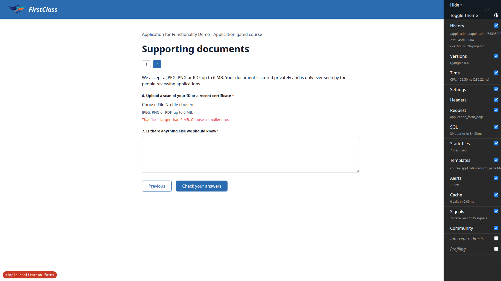

**B2, decision taken.** The page-accessibility limit now tracks the furthest page *reached*, not
the furthest page answered. `FormProgress` gained `furthest_page_reached`, stamped whenever a page
of a sitting is shown (both the application shell and the course runner), and the resume page and
the page-jump limit take it into account alongside the answer-based terms, which still cover
sittings that predate the field. A fresh sitting starts at 0, so a retake still opens with later
pages locked (test 8.4 is unchanged). Rerun of 2.6 and 2.7: advancing to page 2 showed dot 2
current and dot 1 a link; stepping back with dot 1 showed every page-1 answer still present and dot
2 still a link; Next returned to page 2.

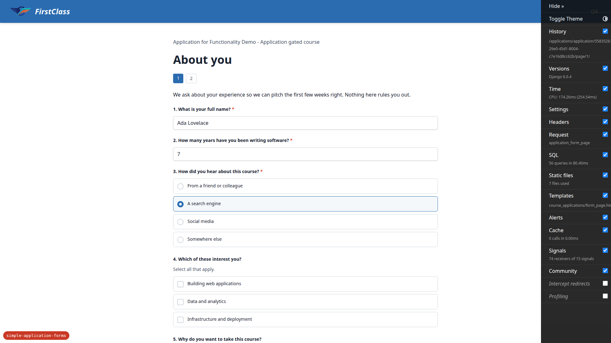

## General notes

`OVERRIDE_COURSE_ACCESS_TO_FREE = True` in `config/settings_dev.py` hides the whole
application-gating feature on a dev server. With it on, `VisibilityEnforcingBackend`
short-circuits to the canonical free decision, so both application-gated demo courses render
"Free · open to everyone" with an "Enrol for free" button and there is no route into an
application at all. This run had to be re-pointed at a temporary `config/settings_qa_local.py`
(dev settings with only that flag flipped off) before §1 could even start. Anyone QA-ing or
demoing application gating needs to know this; it's worth considering whether the shipped dev
settings should leave the flag off.

The plan's expectation of a 422 callout on an empty "Next" click (tests 2.4, 2.5, 4.1.1) is
unreachable through ordinary clicking. The shared question templates put the native HTML
`required` attribute on short-text, number and radio inputs, so the browser blocks the submit
before any request is issued. The server-side check is correct and was verified by stripping the
attributes in devtools — the callout wording is exactly as specified. The user-visible outcome
(nothing advances, the browser explains why) is arguably better than a round trip, but the plan and
the spec's narrative both describe the server-side path as what an applicant actually sees, so one
or the other should be corrected to match reality.

The dashboard's "Your applications" panel labels a draft application "Pending review" even before
it has been submitted. The link behaviour is right — it resumes the form rather than showing the
status page — but the wording overstates what has actually happened.

`content_save` surfaces a bad `application_form` path as an unhandled `ValueError` with a full
Python traceback rather than a clean `CommandError`, so a content author sees a stack trace above
an otherwise clear message.

Coverage gap the plan predicted and this run confirmed: no demo form ships a required checkbox
group, so the hidden `data-checkbox-required-message` paragraph is absent from stock content and
the client-side "Select at least one option." message could not be exercised. No content was
modified to reach it, per the plan's own instruction.

Accessibility observation, pre-existing and outside this branch's diff: the course runner's page
dots measure 10x10 CSS px with no larger hit area, well under a 24px touch target. The application
shell's own page dots are numbered boxes and are comfortably larger, so this doesn't carry over to
the new shell.

Minor: at 375px the runner's outer document is roughly 195px taller than the viewport
(`documentElement.scrollHeight` 1007 against `body.scrollHeight` 812 exactly), so over-scrolling
the outer document can drag the sticky top bar off screen. Scrolling the questions region normally
keeps both bars pinned as intended. This was only reproducible with the dev debug toolbar present;
the runner's own `h-screen`/`overflow-hidden` shell is untouched by this branch.

Test data: the applicant's stale form sittings from an earlier run were cleared and three free-course
registrations created via the `fls-dev:qa-data-helper` agent. Residual admin-created "Admin form
one" rows were cleared so §7.3's slug numbering could be observed from a clean start, and the End
course Quiz sitting was reset once so a deliberate all-wrong attempt could prove
`quiz_show_incorrect: false` suppresses the review list.

status: ok · reason: 2 bugs — 0 fixed, 2 unresolved (both red-lane, no fixer spawned); report rendered, 30 screenshots collected and every referenced image verified present
