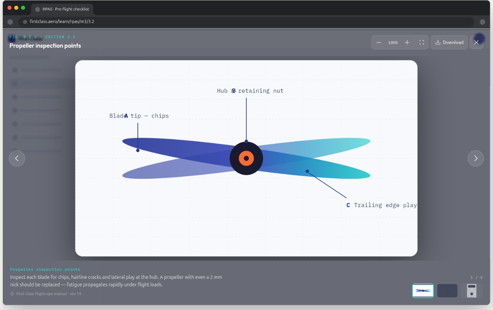

In the course player, we can choose to expand an image. This opens up a modal. Currently it looks pretty ugly.

We need to:
- use the standard backdrop so blur the background in the same way as we do in other places
- use standard ways to close the modal, try to use existing functionality
- the modal needs to look like a good-looking spotlight

This image is a design that came from an extrnal tool. That tool isnot aware of our code. Follow its design, but dont implement new features without asking first. If something seems like a good idea, suggest it.  It is following the first_class theme. We need reasonable defaults for the default theme.

Note the following:
- close button in top tight
- figure number and title top left
- bottom: title and description

Dont add zoom, download or pagination.
