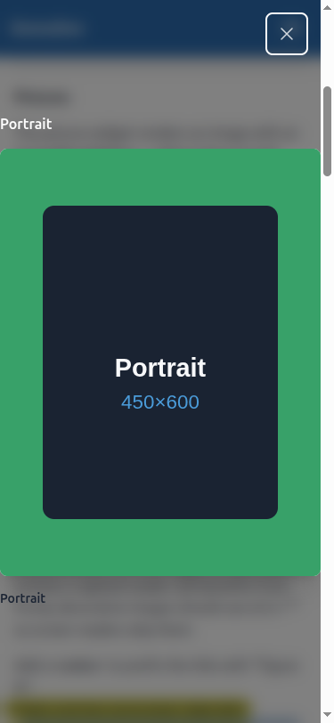
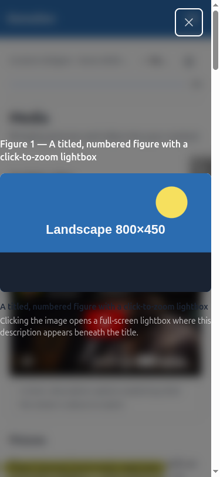
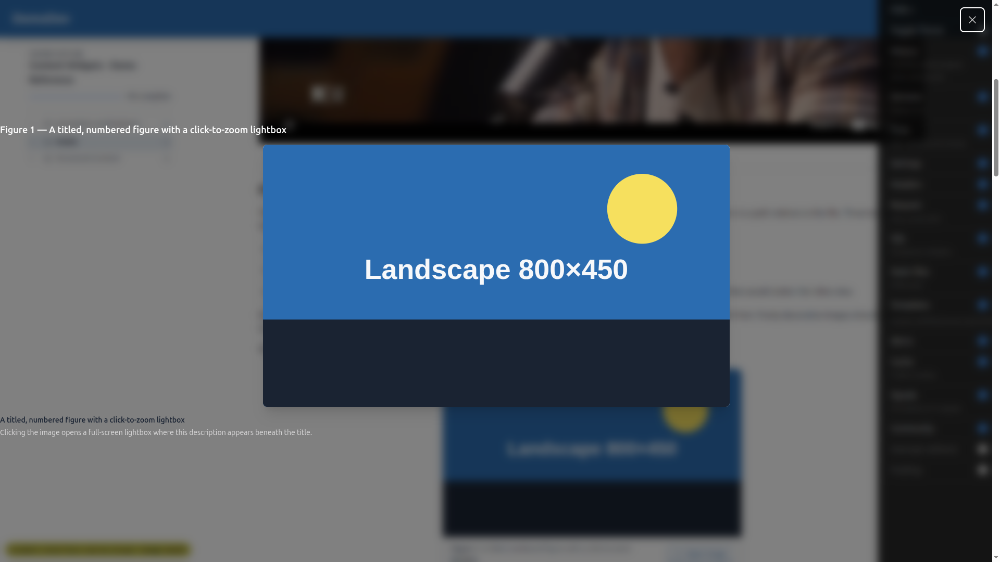
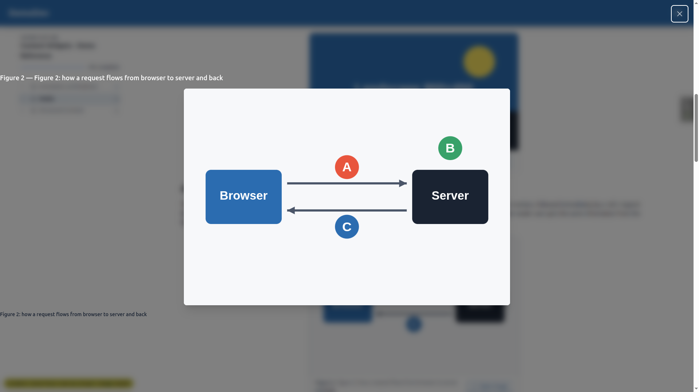
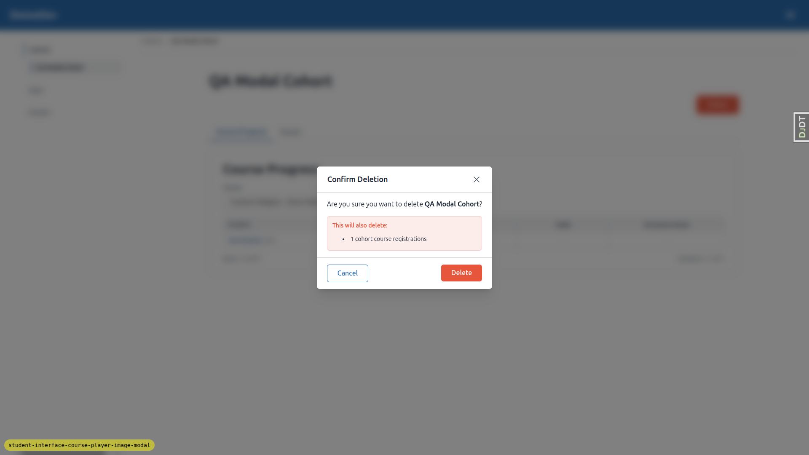
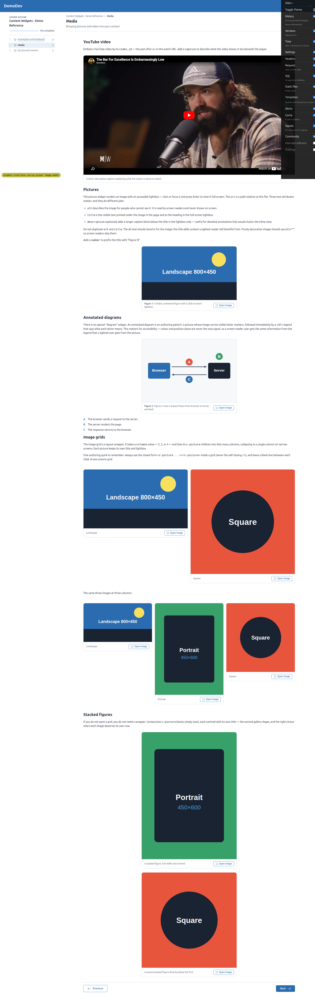

# QA Report — Course-player image spotlight modal

**Date:** 2026-06-05
**Tester:** automated frontend QA (Playwright MCP)
**Build:** branch `student-interface-course-player-image-modal`, DemoDev site, `default` theme
**Surfaces:** Content Widgets → Media topic (student), educator cohort delete-confirmation (`c-modal`)

## Summary

The spotlight's own behaviour is largely correct — dark/blurred scrim, centred
`object-contain` card, top-left heading, top-right 44px labelled close, bottom
title + description, all three close mechanisms, full keyboard focus-trap with
focus restore, correct `aria-labelledby`/`aria-describedby`, clean empty-state
degradation, reduced-motion fade-only, and the shared `bg-black/50 backdrop-blur`
scrim on both the side-panel and `c-modal` surfaces.

**However, one high-severity regression was found:** closed spotlight `<dialog>`
elements are not hidden — they remain `display:flex; position:fixed` and blanket
the viewport with an invisible (`opacity:0`) overlay that **intercepts pointer
events over the page content**. This affects every page that renders a
`c-picture`, not just this feature. Three smaller issues (page-behind scroll,
long-description overflow, a demo-content caption doubling) are also recorded.

A note on screenshots: native `<dialog>::backdrop` + `backdrop-filter` is
under-represented in headless screenshots, so the spotlight scrim looks lighter
in PNGs than it is. The computed `::backdrop` style was verified directly as
`oklab(0 0 0 / 0.5)` (= `bg-black/50`) + `blur(8px)`.

---

## BUG 1 — [HIGH] Closed spotlight dialogs blanket the page and swallow clicks/taps

**Tests affected:** §2, §4 (pointer path), §8a trigger; impacts the whole course
player content area, mobile especially.

**Expected:** A closed spotlight `<dialog>` is inert and occupies no space; only
the open one (top layer) captures input.

**Actual:** Every closed `.spotlight-dialog` computes `display:flex;
position:fixed; inset:0; opacity:0; pointer-events:auto` and covers most of the
viewport. Because the author rule sets `display:flex` on the **base** selector,
it overrides the UA `dialog:not([open]) { display:none }`, so closed dialogs stay
laid out and hit-testable. With 9 pictures on the Media topic, the top-most
invisible dialog intercepts pointer events over the content beneath.

**Evidence (fresh page load, nothing opened):**
- `getComputedStyle(closedDialog).display === "flex"`, `position === "fixed"`,
  `pointerEvents === "auto"`, `opacity === "0"`, rect ≈ full viewport.
- `document.elementFromPoint(center)` over the **breadcrumb link**, **page `<h1>`**,
  **YouTube embed**, and the **"Open image" trigger** all return a closed
  `DIALOG.modal-backdrop-host` (or its ``) instead of the real element —
  i.e. those controls are occluded.
- On mobile (375px) a real Playwright click on the header **"Open course outline"**
  button fails with a pointer-interception error (the spotlight dialog
  "intercepts pointer events"), reproduced after a clean reload.

**Root cause / fix:** The sibling `.side-panel-dialog` (which the spotlight comment
says it "mirrors") documents the correct pattern — *"Closed dialogs are
`display:none`, so the position has no effect until the panel opens"* — and never
sets `display` on its base rule. The spotlight should do the same: move the flex
layout to `.spotlight-dialog[open]` (or add
`.spotlight-dialog:not([open]) { display:none }`). This also makes the existing
`@starting-style` / `transition: display … allow-discrete` enter/leave animation
actually toggle, which it currently cannot. File: `tailwind.components.css`
(`.spotlight-dialog`, ~line 346-371).

---

## BUG 2 — [MEDIUM] Page behind scrolls while the spotlight is open

**Test affected:** §7 ("the page behind does not scroll while the dialog is open").

**Expected:** Background scroll is locked while the spotlight is open.

**Actual:** No scroll-lock is applied on open. With the spotlight open on mobile,
pressing **PageDown scrolled the page behind from `scrollY 0 → 640`** while the
dialog stayed open. There is no `overflow:hidden` on `body`/`html` and
`overscroll-behavior` on the dialog is `auto`.

**Fix:** Lock background scroll while a spotlight is open (e.g. toggle
`overflow:hidden` on `<html>`/`<body>` in the `contentLightbox` open/close, or set
`overscroll-behavior` appropriately on the dialog).

---

## BUG 3 — [LOW–MED] Long descriptions don't scroll inside the card; chrome can be clipped unreachably

**Test affected:** §7 ("long descriptions scroll inside the card … chrome stays
legible and reachable").

**Expected:** A long description scrolls within the card; heading/close/caption
stay reachable.

**Actual:** The description lives in the bottom `.spotlight-caption` block, a
**sibling** of the card — not inside the scrollable card (only the image scrolls,
via the card's `max-height:70dvh; overflow-y:auto`). With demo-length descriptions
everything fits and is legible (verified, see screenshot). But with a long
description on a short viewport the flex column (`justify-content:center`)
overflows, and because centred-flex overflow cannot scroll upward
(`scrollTop` floors at 0), the **top heading becomes permanently clipped and
unreachable** (measured: heading at `top:-464px`, `maxScrollTop:464`, heading not
recoverable). Not triggered by current demo content.

**Fix:** Put the caption inside a scroll container, and/or switch the dialog to
`justify-content:flex-start` with the whole dialog scrollable, so overflowing
chrome stays reachable.

---

## BUG 4 — [LOW–MED] Demo content: doubled "Figure 2: Figure 2:" caption

**Test affected:** §9 (rename sanity) / demo reference quality.

**Expected:** The diagram figure reads "Figure 2: how a request flows…".

**Actual:** It reads **"Figure 2: Figure 2: how a request flows…"** in the inline
figcaption and **"Figure 2 — Figure 2: …"** in the spotlight heading. Cause:
`demo_content/functionality_demo_content_widgets/2. media.md` line 33 sets
`number="2"` **and** a `title` that already begins with "Figure 2:". The `number`
attribute already supplies the "Figure 2" prefix, so the title duplicates it. This
demo edit was introduced by this feature (Task 7 caption→title rename).

**Fix:** Remove the redundant "Figure 2:" from that title (keep `number="2"`), so
the title is just "how a request flows from browser to server and back".

---

## Passing checks

- **§2 Open spotlight:** `::backdrop` = `oklab(0 0 0 / .5)` + `blur(8px)`; card
  `object-fit:contain`; heading top-left, 44px close top-right, bottom title +
  description. 
- **§3 Empty-state (no description):** Figure 2 (diagram) shows title only — no
  empty description line, no `aria-describedby`.
  
- **§4 Close mechanisms:** close button, **Escape**, and **click-outside (scrim)**
  all close; clicking the **image** keeps it open; the card/image are guarded by
  `event.target === dialog`.
- **§5 Keyboard & SR:** keyboard-open (Enter) moves focus to the autofocused close
  button; `Tab`/`Shift+Tab` stay trapped inside the dialog; Escape closes and
  restores focus to the "Open image" trigger; close button is exactly **44×44px**
  with `aria-label="Close image"`; dialog `aria-labelledby` → figure heading,
  image `aria-describedby` → description.
- **§6 Reduced motion:** CSS `@media (prefers-reduced-motion: reduce)` drops the
  scale transition and forces `scale:1` → fade-only, no zoom. (Verified by rule;
  `prefers-reduced-motion` can't be emulated through the MCP.)
- **§7 Mobile (demo content):** card fits the 375px viewport, chrome legible.
  (Scroll-lock and long-description issues recorded as Bug 2 / Bug 3.)
- **§8a Side-panel scrim:** uses the shared `.modal-backdrop-host::backdrop`
  (`bg-black/50 backdrop-blur-sm`); closed-state correctly `display:none` — no
  regression.
- **§8b `c-modal` dark scrim:** the educator "Confirm Deletion" modal now sits on a
  dark blurred scrim and opens/closes correctly.
  
- **§9 Rename sanity:** no literal `caption=` text leaks; all 9 picture spotlights
  render with titles; no broken images; the YouTube embed keeps its caption
  (`c-youtube` untouched). 

---

## Coverage notes / things not fully exercised

- **§3 no-`title` path** was verified from the template conditionals (no `title` →
  no heading box, no bottom block, `aria-label` falls back to `alt`) rather than
  live, because no title-less `c-picture` exists in the demo content. Creating one
  means editing the feature's own demo markdown; the conditional logic is
  unambiguous, so it was not mutated.
- **Tablet (768px)** was not separately walked — the spotlight layout is identical
  to mobile/desktop (single full-viewport flex column, no breakpoint-specific
  rules), so the mobile + desktop passes cover it. Bug 1 affects tablet equally.
- **Environment fix-ups (not feature bugs):** the dev DB needed `migrate`
  (pending `content_engine`/`student_progress` migrations) before pages would
  load, and test data (learner registration, demo-content reload, an educator +
  `c-modal` target) was created via the `fls:qa-data-helper` agent.
