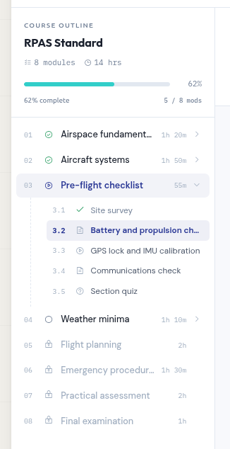
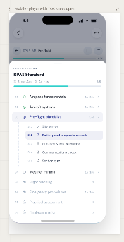
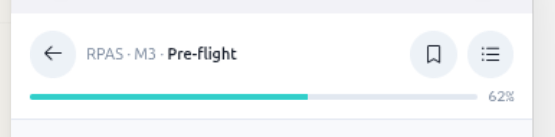

# Remove course start page

When a student starts a course then we need to go straight to the course-player, not the course start page. The course start page should either automatically redirect or get removed.

Eg: http://127.0.0.1:8000/courses/functionality-demo-show-end-with-topic/ should not exist, it should not render a template. Go straight to http://127.0.0.1:8000/courses/functionality-demo-show-end-with-topic/{N}/

# Breadcrumbs

At the top of the actual content area, show breadcrumbs.

{course title} > {course-part if there is one} > {title of current section}


# Left hand panel contents



Header area:
```
course outline
{Course Title}
[####...... progress bar]
Amount complete %
```

Body: show the table of contents. Course-parts should be expandable
Match the style of the image above.
Scrolling should be independant of the content

[left hand panel][main content]

# Left hand panel responsive behavior

In big screens (laptops), the TOC panel should always be open. No option to close it.


## Phones:
- allow the left hand panel to be collapsed
- Dont have it expanded by default.
- Scroll it up from the bottom, dont have it be a slide in from the side. See image here: 

## Expanding the table of contents (phones)

Instead of minimal breadcrumbs, show something like this at the top of the content

It'll have a button on the right that allows the user to expand the table of contents.

# Page title

The page title should reflect the section of the course we are visiting, eg a specific topic
