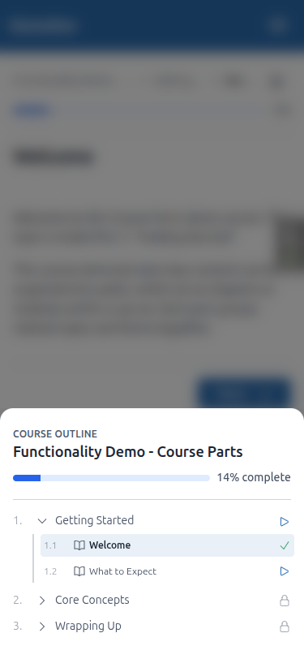
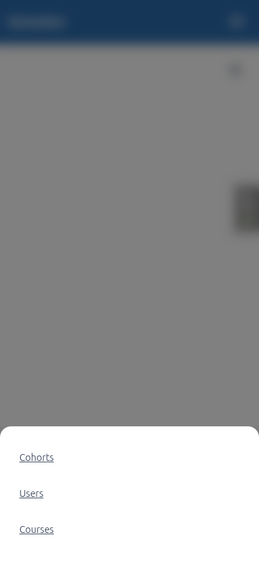
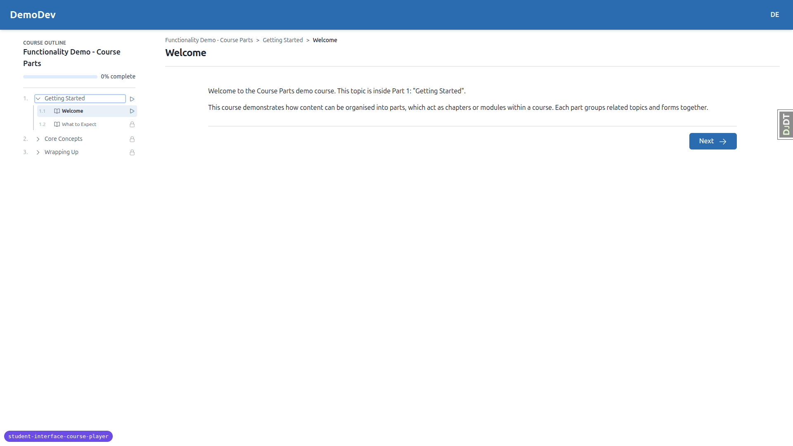
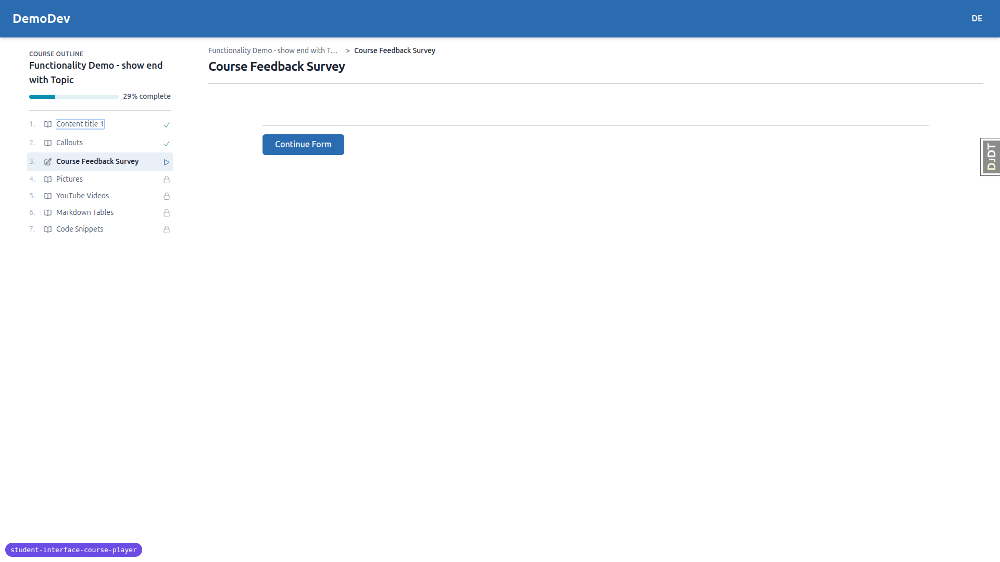
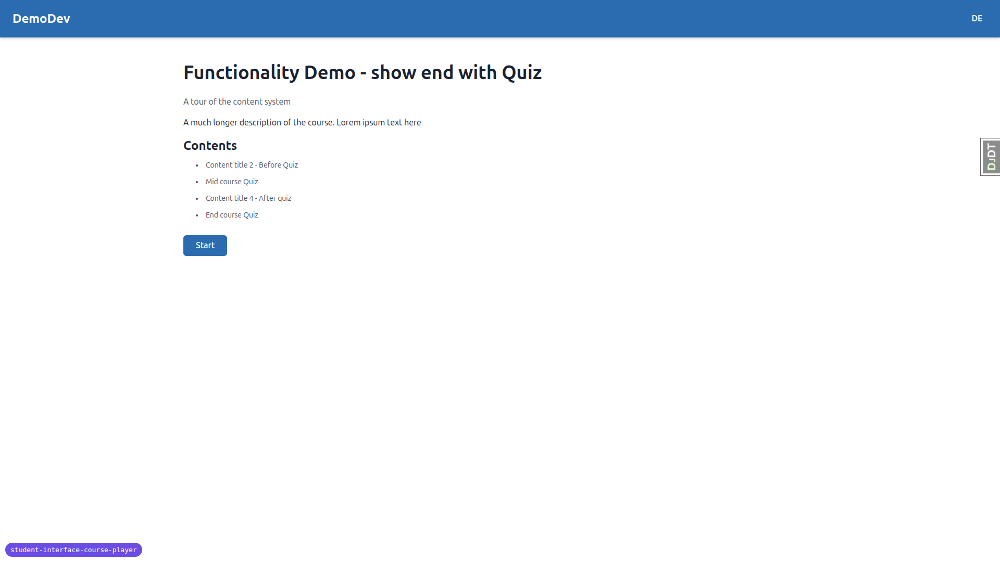
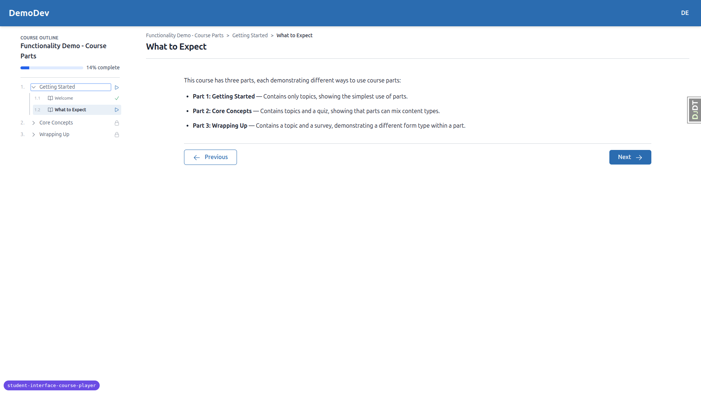
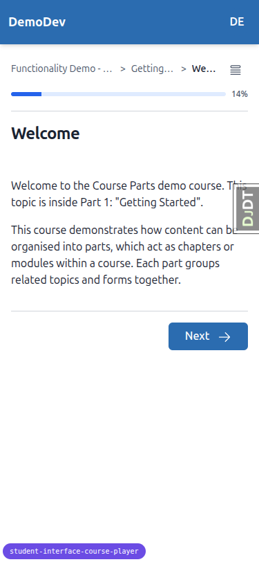
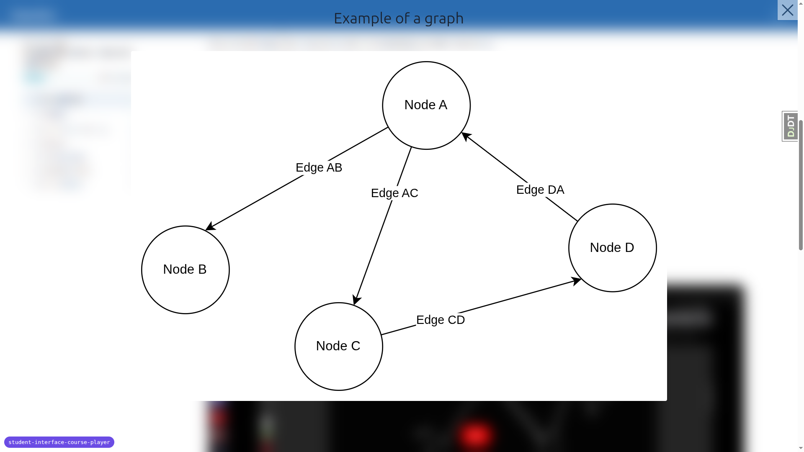
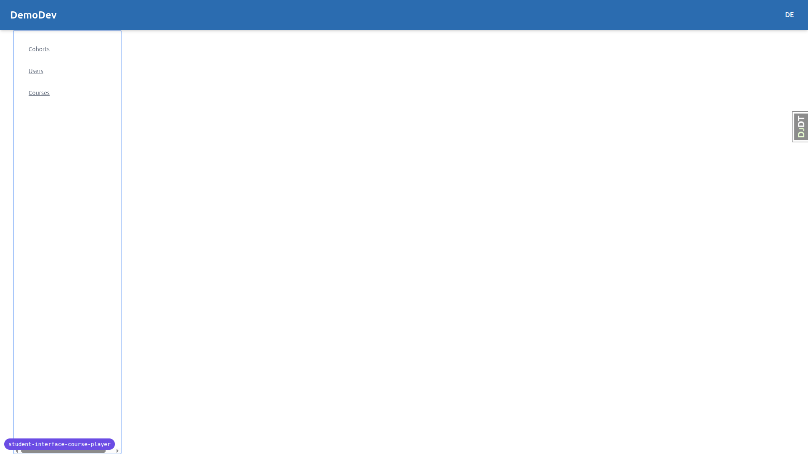
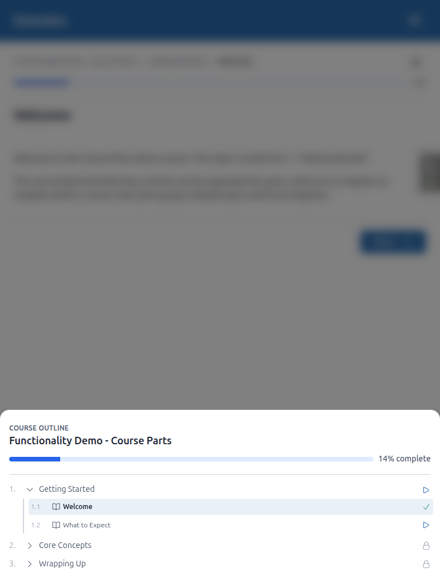

# QA Report — Student Course Player

**Date:** 2026-06-02
**Branch:** `student-interface-course-player` (confirmed via debug-branch-badge)
**Server:** `runserver` on port 8870, DemoDev site
**Tooling:** Playwright MCP (desktop 1920×1080, mobile 375×812, tablet 768×1024)
**Test plan:** `3. frontend_qa.md`

## Test data

The dev DB had no usable student account, so test data was created by the
`fls:qa-data-helper` agent (idempotent command
`qa_create_course_player_student DemoDev`):

- Student `demodev_s1@email.com` / `demodev_s1@email.com` (verified email).
- **Enrolled, no progress, course with parts:** `functionality-demo-course-parts` (resumes to item 1).
- **Enrolled, with progress:** `functionality-demo-show-end-with-topic` (resumes to item 3, 29%).
- **Not enrolled:** `functionality-demo-show-end-with-quiz` (redirects to preview).

Educator-interface checks (Test 10) used the existing admin `demodev@email.com`,
which has educator access.

---

## Summary

| Test | Area | Result |
|------|------|--------|
| 1 | Resume redirect, no progress → item 1 | ✅ Pass |
| 2 | Resume redirect, with progress → last item | ✅ Pass |
| 3.1 | Anonymous → login | ✅ Pass |
| 3.2 | Enrolled-but-not-this-course → preview | ✅ Pass |
| 4 | Back-button safety (no redirect loop) | ✅ Pass |
| 5 | Desktop breadcrumbs | ✅ Pass |
| 6 | Desktop TOC (always-open, progress, a11y) | ✅ Pass |
| 7 | Page title (item-first, updates) | ✅ Pass |
| 8 | Mobile header + bottom sheet | ⚠️ Partial — **Back-button dismiss fails** (Bug 1) |
| 9 | Picture lightbox | ✅ Pass |
| 10 | Unified sidebar (educator / panel_framework) | ⚠️ Partial — same Back bug; panel_framework not reachable on dev server |

**One functional bug found** (Bug 1, below), affecting Test 8.4 and Test 10 — it
is a single shared-component root cause. Everything else passes.

---

## Bug 1 — Browser Back button does not close the bottom sheet (it navigates away)

**Tests failed:** Test 8.4 (mobile bottom sheet dismiss routes) and Test 10
(unified sidebar, mobile). The pass criteria explicitly require the three dismiss
routes — scrim tap, Escape, **Back** — to "all work".

**Expected:** With the bottom sheet open on mobile/tablet, pressing the
device/browser **Back** button closes the sheet and keeps you on the current
page (same outcome as scrim tap and Escape).

**Actual:** Pressing Back while the sheet is open performs a normal browser
navigation to the **previous page**, leaving the current page entirely. The sheet
is never given a chance to "catch" the Back press.

Reproduced consistently:

- **Player:** on `/courses/functionality-demo-course-parts/1/` (previous history
  entry = item 2), opened the outline sheet, pressed Back → landed on
  `/courses/functionality-demo-course-parts/2/` instead of closing the sheet on item 1.
- **Educator:** on `/educator/` (previous entry = dashboard), opened the nav
  sheet, pressed Back → landed on the dashboard `/` instead of closing the sheet.

Scrim tap, Escape, focus-trap, and focus-return all work correctly in both
interfaces — only the Back route is broken.

**Root cause (for the fix):** the shared `sidePanel` Alpine component
(`freedom_ls/base/static/base/js/alpine-components.js`, ~lines 326–438) relies on
a comment-stated assumption that a native `<dialog>.showModal()` makes the
browser Back button dismiss the dialog. That is not true in Chromium —
`showModal()` does not push a history entry, so Back navigates the page. There is
**no** `history.pushState`/`popstate` wiring on the side panel (the only
`popstate` handling in the codebase is the unrelated `tabContainer` component).
A fix would push a history state on open and listen for `popstate` to close.

---

## Passing tests (evidence)

### Test 1 — Resume redirect, no progress
Bare URL `/courses/functionality-demo-course-parts/` 302-redirects into the player
at `/courses/functionality-demo-course-parts/1/`. No start/home page shown.

### Test 2 — Resume redirect, with progress
Bare URL of `functionality-demo-show-end-with-topic` resolves to item 3 (the
last-accessed item); the TOC highlights item 3, items 1–2 show "Completed".

### Test 3 — Access control
- Anonymous visit to a bare course URL → redirected to
  `/accounts/login/?next=…` (never into the player).
- Logged-in but unenrolled student → redirected to
  `/courses/functionality-demo-show-end-with-quiz/preview/` (description,
  contents, register CTA — no per-user player state).

### Test 4 — Back-button safety (player navigation)
From item 3 (reached via the bare-URL 302) → item 1 → item 2, pressing Back went
item 2 → item 1 → item 3 sanely. No redirect loop, no forward bounce, and the
bare URL did **not** reappear in history. (Distinct from Bug 1, which is about the
bottom-sheet overlay, not page navigation.)

### Test 5 — Desktop breadcrumbs
- Course-part item shows `Course > Part > Item`; course and part crumbs are links;
  the course crumb points to `…/1/`; the current item is plain text.
- A no-part course shows only `Course > Item` (no dangling separator).
- All crumbs use `truncate` (ellipsis + nowrap + max-width 16rem/20rem), so long
  titles ellipsis-truncate rather than wrap.

### Test 6 — Desktop TOC panel
- Always visible at ≥ lg, **no close control**.
- Pinned header (`sticky top-0`): eyebrow "COURSE OUTLINE" (uppercased), course
  title, a progress bar, and "{X}% complete". **No N/M counter.**
- Completing item 1 moved both the progress bar (`aria-valuenow=14`) and the label
  ("14% complete") together — single source of truth.
- Current item highlighted with `aria-current="page"`; its part auto-expands.
- Manually expanding/collapsing a non-current part is preserved across navigation
  while the current item's part still auto-expands.
- Panel and content scroll independently (`side-panel-body` has
  `overflow-y-auto overscroll`).
- Status icons all have accessible labels ("In progress", "Completed", "Locked",
  "topic", "form") — not colour-only.

### Test 7 — Page title
Titles are item-first with en-dash separators and update on navigation, e.g.
`Welcome — Getting Started — Functionality Demo - Course Parts — DemoDev`,
`Content title 1 — … — DemoDev`, and the form page
`Course Feedback Survey — Functionality Demo - show end with Topic — DemoDev`.

### Test 8 — Mobile header + bottom sheet (except Bug 1)
- Same breadcrumb trail as desktop; a labelled "Open course outline" toggle sits
  beside the breadcrumbs; a thin progress bar with "%" sits below. No back arrow,
  no bookmark, no condensed/compact trail.
- TOC collapsed by default.
- Tapping the toggle opens a **native modal** bottom sheet rising from the bottom
  (full width, partial height ~309px), with a 50%-black `::backdrop` scrim and an
  inert background (`:modal`).
- Internal scroll only (`overflow-y:auto`); no visible × control.
- Focus moves into the sheet on open and returns to the toggle on close.
- Tapping an item navigates to it and closes the sheet.
- Dismiss via **scrim tap** and **Escape** work and restore focus. **Back fails — see Bug 1.**

### Test 9 — Picture lightbox
"Open image" opens a centred lightbox (native `<dialog>`-based `contentLightbox`)
with a `backdrop-blur-lg` backdrop. Closes via the visible × button, click-outside,
and Escape; focus returns to the "Open image" trigger each time.

### Test 10 — Unified sidebar (other interfaces)
- **Educator, desktop:** nav docked and always open (non-modal), the toggle is
  hidden, no collapse/close control.
- **Educator, mobile:** same modal bottom-sheet mechanism as the player (scrim,
  inert, rises from bottom, focus management); Escape and focus-return work.
  **Back fails identically — see Bug 1.**
- **Player, mobile/tablet:** bottom-sheet confirmed (Test 8); tablet (768, below
  `lg`) correctly uses the mobile bottom sheet.

---

## Not tested / limitations

- **Test 10.2 — panel_framework test interface:** not reachable on the running
  dev server. Its URLs are wired only into a test-only root URLconf
  (`freedom_ls/panel_framework/tests/root_urls.py` → `test-panel/`), not
  `config/urls.py`, so it exists only inside the pytest harness. This is a
  structural fact, not missing data, so the `fls:qa-data-helper` agent cannot
  unblock it. Coverage of the shared panel mechanism is still achieved through the
  educator interface and the player, which use the same `sidePanel` component.
- **Screen-reader pass (Test 6.7):** verified via the accessibility tree
  (`aria-current="page"`, per-status `aria-label`s) rather than a live AT.

## Minor / tangential observations (not test failures)

- **Inverted part-toggle icon naming (a11y nit):** in the TOC, an *expanded* part
  toggle has an icon named "expand" while a *collapsed* one is named "collapse"
  — backwards from the action it implies — and that icon text is folded into the
  button's accessible name (e.g. a screen reader reads "expand Getting Started"
  for an already-expanded section). `aria-expanded` is correct, so AT users still
  get the real state; this is redundant/confusing label text only. Pre-existing,
  outside the listed tests.
- **Mobile TOC toggle touch target:** ~36×40px. Above the WCAG 2.5.8 (AA) 24×24
  minimum but under the 44×44 enhanced target; consider enlarging.
- Pre-existing report-only CSP info logs for CDN scripts (htmx, alpine, chart.js)
  and a `favicon.ico` 404 appear in the console — unrelated to this feature.
