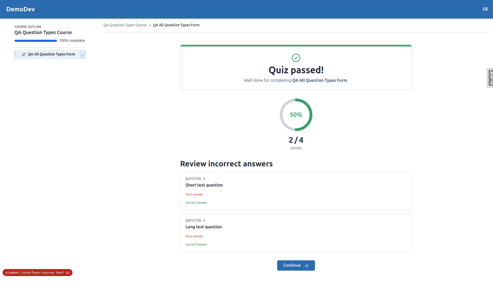
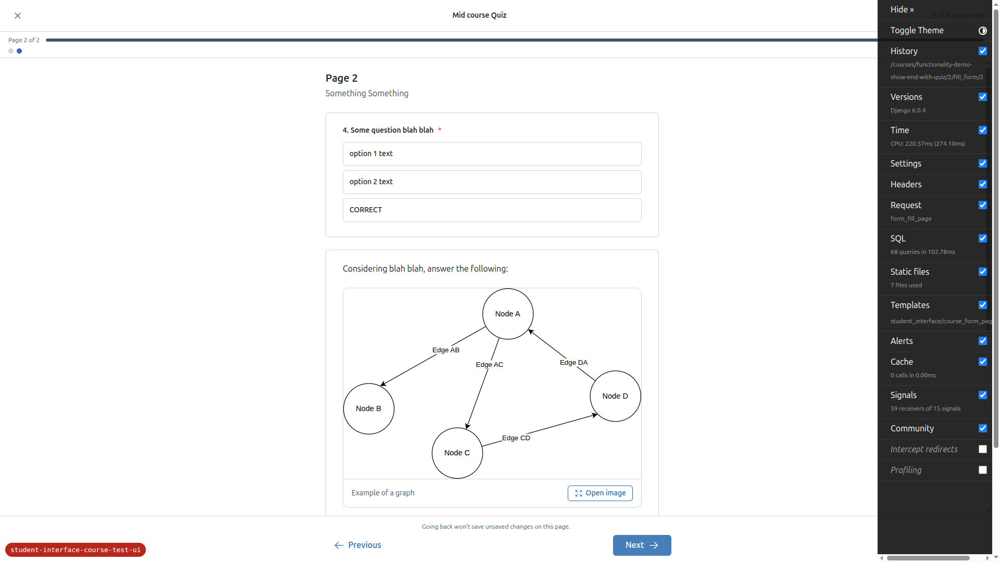
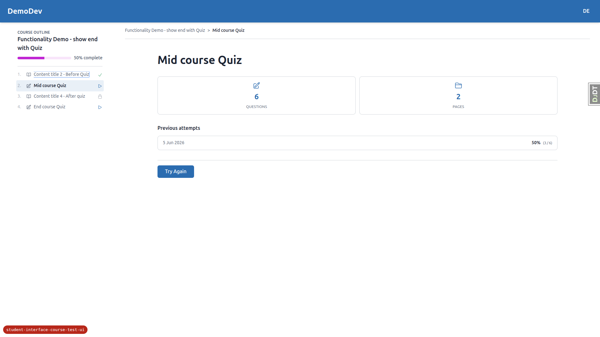
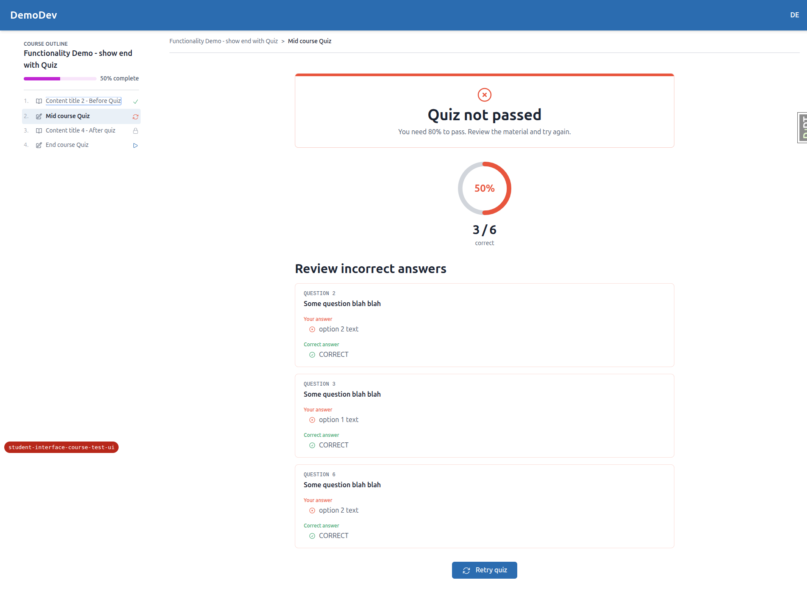
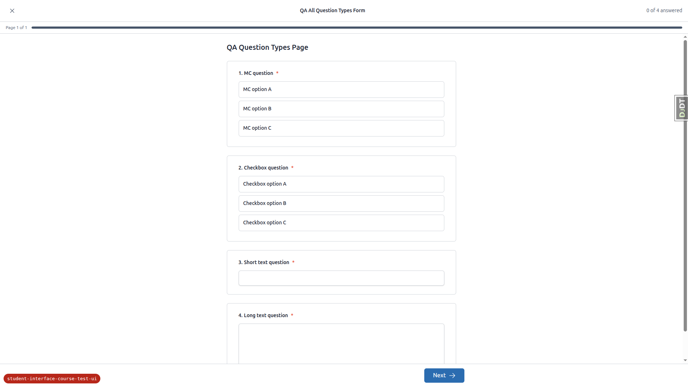
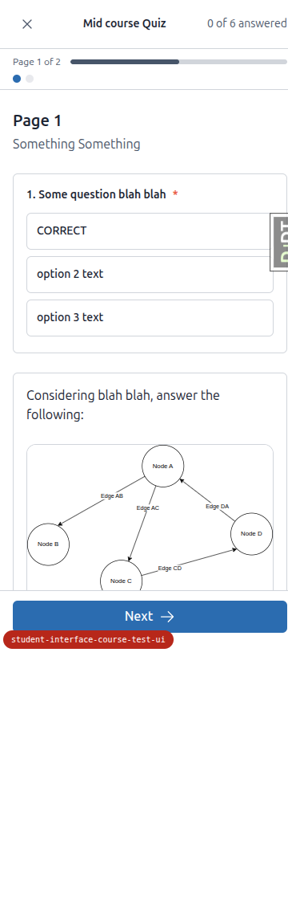
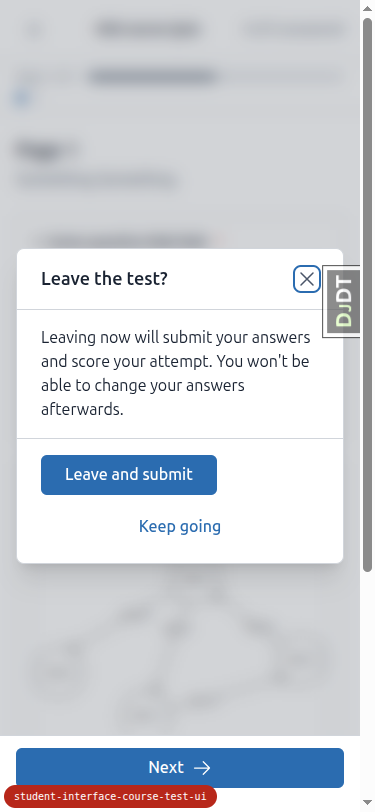
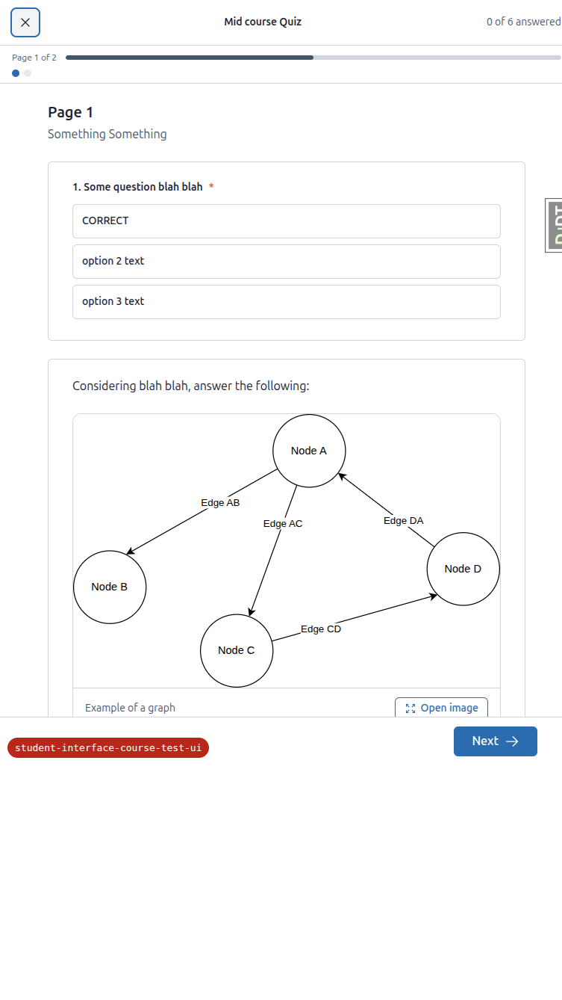

# Frontend QA Report — Student interface: course test/exam UI

**Date:** 2026-06-05
**Branch:** `student-interface-course-test-ui`
**Site:** DemoDev (dev forces `FORCE_SITE_NAME = "DemoDev"`)
**Tooling:** Playwright MCP, default theme, viewports 1920×1080 (desktop), 375×812 (mobile), 768×1024 (tablet)
**Logged in as:** `demodev@email.com`

## Summary

The re-skinned test/exam flow (start → runner → results), the `submit_on_exit` behaviour, the
server-side safety net, the PRG navigation model, and accessibility all work as specified. The runner
owns the full viewport with no global chrome, the answered count is honest, the submit/exit dialogs are
accessible (role, focus management, Escape, focus trap), and results render with a token-coloured score
ring. All three viewports render cleanly with no overflow.

**One functional bug was found** (empty answer rendering for text-type questions in the quiz
incorrect-answers review) and **one implementation gap** (the plan §7 demo content was never extended
with `checkboxes` / `short_text` / `long_text` questions). Question-type coverage (§8) was still
exercised by using the `fls:qa-data-helper` agent to seed a form containing all four types.

---

## Bugs / failures

### 1. Quiz incorrect-answers review shows empty "Your answer" / "Correct answer" for text questions

- **Tests:** §6a (incorrect-answers review) and §8 (question-type coverage → scoring/results).
- **Where:** `freedom_ls/student_interface/templates/student_interface/course_form_complete.html`
  (the "Review incorrect answers" block, lines ~72–98).
- **Expected:** When `quiz_show_incorrect` is on, the review should clearly show what the learner
  answered. For a free-text question there is no "correct option", so the review should either show the
  learner's typed response (and omit / sensibly handle "Correct answer"), or text questions should not
  be presented as auto-graded "incorrect" items at all.
- **Actual:** `short_text` and `long_text` questions are scored as **incorrect** in a QUIZ (the score
  was 2/4 rather than 2/2 for the two auto-gradable questions) and are listed under **Review incorrect
  answers** with **empty** "Your answer" and "Correct answer" sections. The template only iterates
  `item.student_selected` and `item.correct_options` (option objects), so for text questions — which
  have no options — both blocks render nothing. The learner's typed text ("My short answer" /
  "My long answer spanning a sentence.") is never displayed.
- **Repro:** Open `QA All Question Types Form` (seeded form, see notes), answer all four questions
  (MC + checkboxes correct, free text filled in), submit. Results show "Quiz passed! 50% (2/4)" with
  two empty incorrect-review cards for Q3/Q4.

  

> Surfaced via a mixed QUIZ form (auto-graded + free-text questions). Whether free-text questions
> should be auto-scored inside a QUIZ at all is a design decision for the team, but the **empty answer
> rendering is a clear UI defect** regardless.

---

## Implementation gap

### 2. Demo content was not extended with the new question types (plan §7)

- **Tests:** §8 (question-type coverage), and the §0 setup note ("if the new question-type … demo
  content from the plan (§7) is missing … load it").
- **Expected (plan §7):** add at least one `checkboxes`, one `short_text`, and one `long_text`
  question to an existing demo form's page yaml.
- **Actual:** every demo `form.md` page in `demo_content/` still contains **only `multiple_choice`**
  questions (`functionality_demo_end_with_quiz/{3,5}. quiz`, `…course_parts/…/knowledge-check`,
  `…/feedback`, `…end_with_topic/4. survey`). The `submit_on_exit: true` half of §7 *was* done
  (`Mid course Quiz`), but the question-type half was not. Reloading demo content cannot help because
  the source yaml has nothing to load.
- **Workaround used:** per the QA rules, I delegated to the **`fls:qa-data-helper`** agent, which seeded
  `QA All Question Types Form` (QUIZ, one page, one of each of the four types) into a small dedicated
  course `qa-question-types-course` registered to `demodev@email.com` on DemoDev. This let me verify
  §8 rendering, keyboard operation, and scoring persistence. The agent also left an **idempotent
  management command** behind: `freedom_ls/qa_helpers/management/commands/qa_create_form_question_types.py`
  (`uv run python manage.py qa_create_form_question_types DemoDev`).

---

## Sections that passed

### §1 Start screen (normal chrome)
- Global header + course chrome present (not the sidebar-less runner). Title + (where present)
  subtitle render.
- Meta grid shows exactly **two truthful cells** — number of questions and number of pages. No
  "estimated time", no "unlimited tries".
- Previous-attempts summary shows for quizzes (e.g. `5 Jun 2026 — 50% (3/6)`), with **no "View all"
  link** and no placeholder.
- All three CTA states verified: **Start** (`QA All Question Types Form`, unattempted), **Continue**
  (`End course Quiz`, incomplete save-on-exit attempt), **Try Again** (`Mid course Quiz`, failed quiz).

  

### §2 Runner — layout & accessibility
- No course sidebar/TOC and no global site header — the runner owns the viewport with its own top bar,
  progress strip, scrollable body, and footer nav.
- Top bar: exit "X" (left), title (centre), honest "**N of M answered**" (right) — never says "saved".
- Progress strip shows "Page X of Y" with a fill bar (`bg-secondary` token) matching the page fraction.
- Page dots: current/visited pages are links; not-yet-reached pages are non-clickable (`Page 2 (not yet
  accessible)`).
- Each question is a `<fieldset>` with a `<legend>`; multiple-choice = radios, checkboxes = checkboxes,
  with `sr-only` real inputs inside label tiles. Keyboard verified: **ArrowDown** moves/selects within a
  radio group; **Space** toggles a checkbox.
- No console errors on the runner (no Alpine CSP "blocked inline expression" errors; the
  `@alpinejs/csp` build is loaded).
- **Answered-count honesty:** count reflects persisted answers from other pages and updates **live** as
  the current page is filled (incl. text fields → 4 of 4), matching the submit-dialog tally.

  

### §3 Navigation (PRG)
- **Next** saves the current page then advances; answers persist (Back shows them pre-filled).
- **Previous** is a plain GET link and does **not** save in-progress edits — a page-2 selection was
  discarded after Previous → the count dropped back from 4 to 3.
- Locked page dots cannot be clicked to skip ahead.
- Runner GET responses send `Cache-Control: no-store` (verified via fetch on `fill_form/2`).

  

### §4 Final-page submit dialog
- "**Ready to submit?**" opens on last-page Next; it does **not** submit immediately.
- Body explains answers will be scored and can't be changed.
- Shows only **Answered / Total questions** — **no "flagged"** count.
- "Go back and review" / Escape dismiss the dialog; **Submit** finalises → results page.
- **Double-submit guard:** Submit button binds `x-bind:disabled="submitting"`, and `submit()` early-
  returns if already submitting (`course_form_page.html`; runner JS `submit()`).
- Accessibility: `role="dialog"`, focus moves into the dialog, **Escape** closes and returns focus to
  the Next button, **Tab is trapped** inside the dialog.

  

### §5 Exit behaviour (the X control)
- **5a Save-on-exit** (`End course Quiz`, default): X dialog warns "Your progress is saved — you can
  resume later." → "Leave and save" returns to the start screen; attempt stays **incomplete**
  ("Continue Form" still offered) and resumes at the correct page.

  

- **5b Submit-on-exit** (`Mid course Quiz`, `submit_on_exit: true`): X dialog warns "Leaving now will
  submit your answers and score your attempt." → "Leave and submit" finalises → results.

  

- **Server-side safety net:** started a fresh attempt, saved page 1, then navigated away **without**
  the X. The stale attempt was **finalised** (scored 50%, 3/6) — start screen shows no lingering
  "Continue", the finalised attempt appears in previous-attempts, and the CTA is "Try Again".

  

- **5c beforeunload courtesy warning:** a raw browser navigation from the runner triggers the generic
  browser "leave site?" prompt (client-side `beforeunload`); accepting/declining it makes no Django
  request.

### §6 Results screen (normal chrome)
- **6a QUIZ:** normal chrome (header + outline), pass/fail banner ("Quiz not passed — you need 80% to
  pass" / "Quiz passed!"), an SVG **score ring** driven by `stroke-dasharray`, and a real `N / M
  correct` stat. Ring colour is a **token** — `text-error` on fail, `text-success` on pass (background
  `text-border`). With `quiz_show_incorrect`, the incorrect-answers review lists wrong choice-questions
  with the learner's option and the correct option. **No** per-topic breakdown and **no** "Here's the
  idea" explanations. Retry/Continue navigation works.

  

- **6b CATEGORY_VALUE_SUM:** completing the survey shows "Form complete! … Your responses are being
  reviewed — **marking is in progress**." (no fabricated score), and the existing category-display block
  (Satisfaction 3/7, Recommendation 5/5) is preserved.

  

### §7 Theming sanity
- Default theme: all three screens render with no missing styles or broken layout.
- Progress fill uses the **secondary** token (`bg-secondary`).
- **No Phosphor / Google-fonts CDN links** loaded; icons are inline SVG (`c-icon`). The only external
  scripts are htmx, Alpine (incl. `@alpinejs/csp`), and chart.js.
- First-class build: **not tested** (no first-class build was available in this environment; this check
  is explicitly conditional in the plan).

### §8 Question-type coverage (via seeded form)
- All four types render and are correctly labelled in a `<fieldset>`/`<legend>`:
  `multiple_choice` → radios, `checkboxes` → checkboxes, `short_text` → `<input type="text">`,
  `long_text` → `<textarea>`.
- Keyboard-operable (Space toggles a checkbox; text fields accept typing) and all four contribute to
  the live answered count and persist into submission/scoring.
- ⚠️ See **Bug 1** for the text-question display defect in the results incorrect-review.

  

---

## Responsive checks

- **Mobile (375×812):** start-screen meta grid fits as two cells; the runner top bar (X / title /
  count), progress strip + dots, full-width option tiles (large touch targets) and full-width Next all
  render without overflow; dialogs are centred, readable, with stacked buttons.

  
  

- **Tablet (768×1024):** the runner uses a centred max-width content column with comfortable margins;
  normal-chrome screens use a two-column meta grid with the course outline behind the toggle. No
  crowding or overflow.

  
  

---

## Not tested / caveats

- **Two-option multiple-choice** (§2 — "renders like any other multiple-choice, no bespoke True/False
  UI"): no demo or seeded question has exactly two options, so this specific case was not exercised.
  All multiple-choice questions seen rendered as standard radio tiles.
- **Text-field persistence through Next/Back** (§8): the seeded all-types form is a single page, so
  text answers could not be round-tripped across pages. Choice-question persistence through Next/Back
  was verified in §3.
- **First-class theme build** (§7): not available; conditional check skipped.

## Tangential observations (not part of the plan)

- **Course-outline status label inconsistency:** for the same failed-quiz state, the course outline
  labelled `Mid course Quiz` as **"Needs retry"** after a manual dialog submit, but **"In progress"**
  after the safety-net auto-finalisation (both attempts scored 50%). The start-screen behaviour (Try
  Again + finalised previous attempt) was correct in both cases; only the outline badge differs.
- The QA helper left a management command at
  `freedom_ls/qa_helpers/management/commands/qa_create_form_question_types.py` and a seeded course
  (`qa-question-types-course`) on DemoDev. These are dev-only QA artifacts.
