# Frontend QA Report — Student interface: course test/exam UI

**Date:** 2026-06-08
**Branch:** `student-interface-course-test-ui`
**Site:** DemoDev · **Login:** `demodev@email.com`
**Tooling:** Playwright MCP · Desktop 1920×1080, Mobile 375×812, Tablet 768×1024
**Theme:** Default theme ("FirstClass" brand)

Forms exercised:
- **QA All Question Types Form** (`qa-question-types-course`) — single page, all 4 question types (§8).
- **End course Quiz** (`functionality-demo-show-end-with-quiz`, item 4) — 2 pages, save-on-exit default (§1–§4, §5a).
- **Mid course Quiz** (same course, item 2) — 2 pages, `submit_on_exit: true` (§5b, §5c).
- **Course Feedback Survey** (`functionality-demo-show-end-with-topic`, item 3) — CATEGORY_VALUE_SUM (§6b).

---

## Summary

The re-skinned test/exam flow works well across all three viewports. The start screen, sidebar-less
runner, dialogs (submit / save-on-exit / submit-on-exit), the `submit_on_exit` server-side safety net,
the `beforeunload` courtesy warning, PRG navigation, answered-count honesty, the QUIZ results screen, and
the CATEGORY_VALUE_SUM "marking in progress" result all behaved as specified.

**One bug was found:** in the QUIZ incorrect-answers review, `short_text` and `long_text` answers render
with **empty** "Your answer" / "Correct answer" blocks (only option-based questions show values).

Everything else in the plan passed. Two minor, out-of-scope observations are noted at the end.

---

## BUG 1 — Text-question answers are missing from the incorrect-answers review

**Tests:** §6a (QUIZ result — incorrect-answers review), §8 (text types persist into results)
**Severity:** Medium — misleading/broken results display for `short_text` / `long_text` questions.

**Steps:** Complete **QA All Question Types Form** (which has `quiz_show_incorrect: true`), answering the
short-text question with `My short answer` and the long-text question with `My long answer spanning some
words.`, then view the results page.

**Expected:** For each incorrect question the review shows the learner's actual answer and the correct
answer. For text questions, the learner's typed text should appear under "Your answer".

**Actual:** The multiple-choice row (Q1) renders correctly (Your answer: *MC option B*; Correct answer:
*MC option A*). But the **Short text** (Q3) and **Long text** (Q4) rows show the "Your answer" and
"Correct answer" labels with **no values at all** — the typed text is not displayed.

Confirmed via DOM dump of the review section:

```
QUESTION 3 / Short text question / Your answer / Correct answer      <- both empty
QUESTION 4 / Long text question  / Your answer / Correct answer      <- both empty
```

**Root cause:** `freedom_ls/student_interface/templates/student_interface/course_form_complete.html`
(lines ~77–96) only iterates `item.student_selected` and `item.correct_options` (option objects). Free-text
answers have no options, so both loops produce nothing and the blocks render empty. The review path has no
branch for text-type answers.

> Note for the fix: it's also worth deciding whether free-text questions should be auto-scored as
> "incorrect" and listed in this review at all (they currently are, because there is no matching correct
> option) — but at minimum the empty answer blocks are a defect.

Desktop:
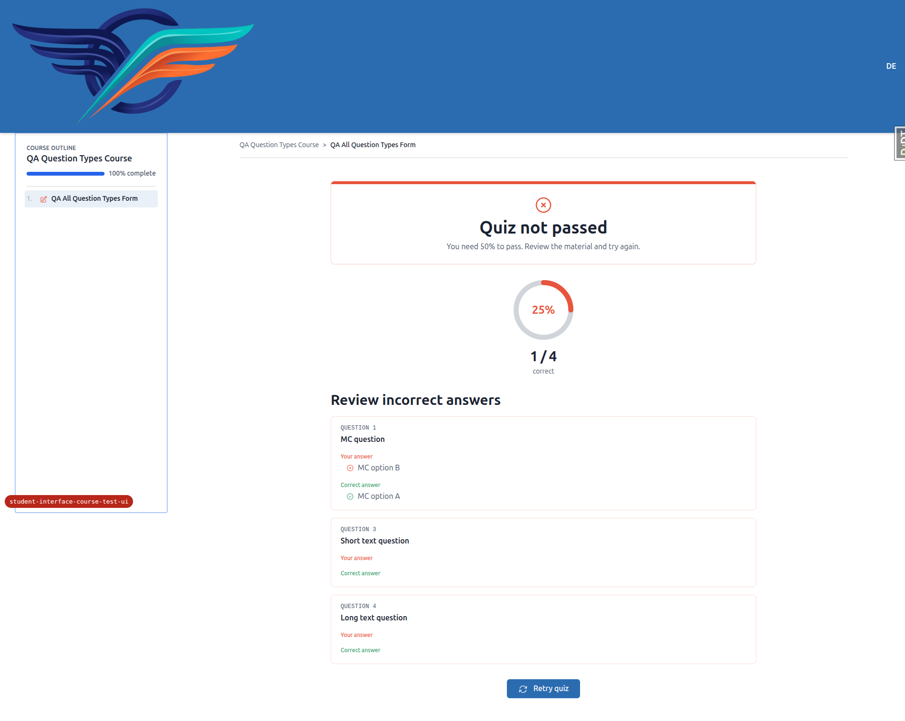

Mobile (same defect — Q3/Q4 blank):
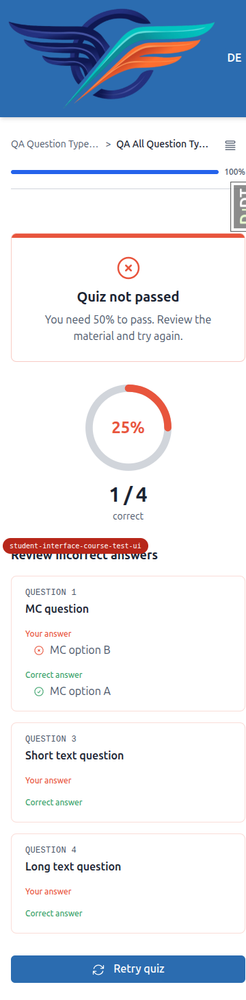

---

## Passing tests (evidence)

### §1 Start screen
- Course chrome present (header, breadcrumb, course outline). Title + intro markdown render
  ("End course Quiz" → "Nice things"). Meta grid shows exactly **two** truthful cells (Questions, Pages) —
  no "estimated time", no "unlimited tries".
- Previous-attempts summary shows best/most-recent score with **no** "View all" link and no disabled
  placeholder.
- CTA reflects state correctly: **Start** equivalent, **Continue** (incomplete save-on-exit attempt),
  **Try Again** (failed quiz).

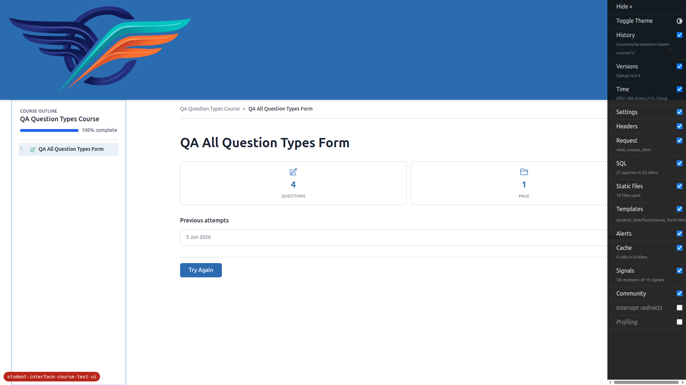
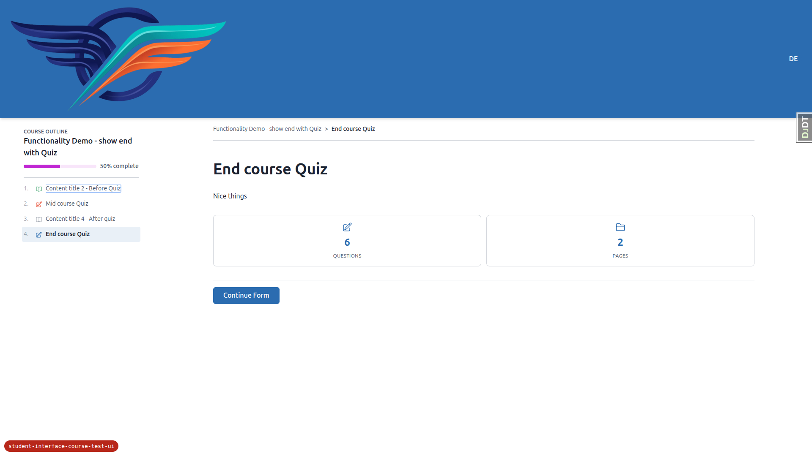

### §2 Runner — layout & accessibility
- Runner owns the full viewport: **no** course sidebar/TOC and **no** global site header; its own top bar,
  progress strip, scrollable body, footer nav.
- Top bar: exit "X" (left), title (centre), honest "**N of M answered**" (right) — never says "saved".
- Progress strip "Page X of Y" + fill bar; page dots are links for visited pages and **non-clickable** for
  locked pages ("Page 2 (not yet accessible)").
- Each question is a `<fieldset>`/group with a `<legend>`: multiple-choice = radios, checkboxes =
  checkboxes, short_text = text input, long_text = textarea. Tile highlight is CSS-driven
  (`has-[:checked]:border-primary`), not script. Keyboard arrow-keys move radio selection (verified
  A→B via ArrowDown).
- **No console errors** — including no Alpine CSP "blocked inline expression" errors (Alpine CSP build is
  loaded).
- **Answered-count honesty:** count reflects persisted answers from other pages and increases **live** as
  the current page is filled (0→1→4 of 4 without advancing; "3 of 6" persisted from page 1 on page 2).

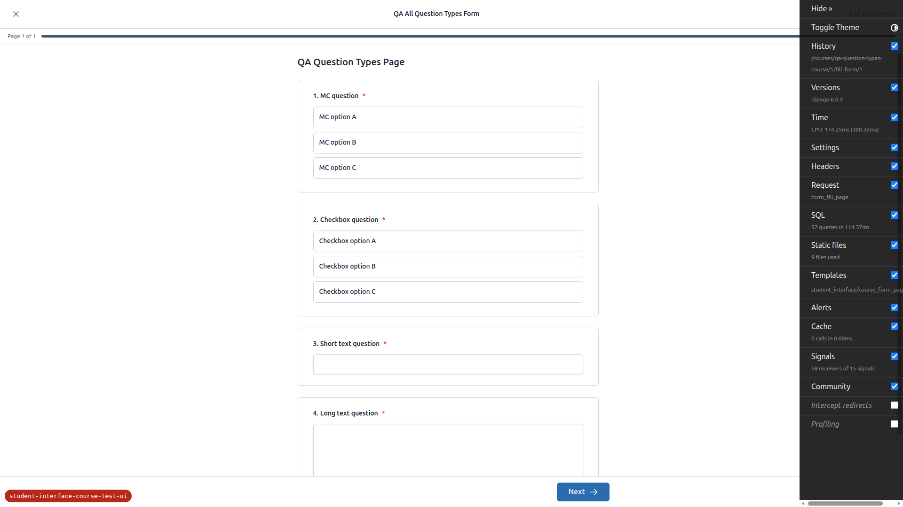
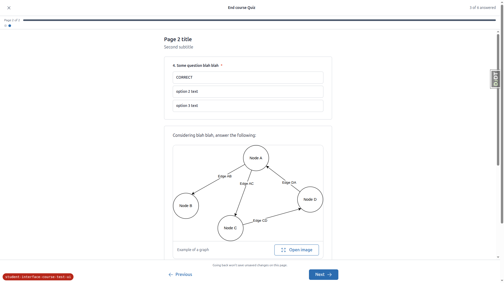

### §3 Navigation (PRG)
- **Next** saves the current page then advances (changed Q3 → persisted on return).
- **Previous** is a plain GET link and does **not** save in-progress edits (unsaved Q4 selection discarded;
  count returned 4→3). Footer note: "Going back won't save unsaved changes on this page."
- Page dots navigate to accessible pages; locked pages can't be clicked to skip ahead.
- Runner GET responds with `Cache-Control: no-store` (verified in response headers).

### §4 Final-page submit dialog
- "Ready to submit?" dialog opens (does **not** submit immediately). Body explains scoring + answers can't
  change. Shows answered/total counts — **no "flagged"** count.
- "Go back and review" dismisses and keeps the learner on the page. "Submit" finalises → results page.
- **Double-submit guard:** `submit()` early-returns if already submitting and sets `submitting = true`; the
  Submit button is `x-bind:disabled="submitting"` (verified in template + `alpine-components.js`).
- Accessibility: `role="dialog"`, focus moves to the dialog (Close button), **Escape** closes it and
  returns focus to the **Next** button.

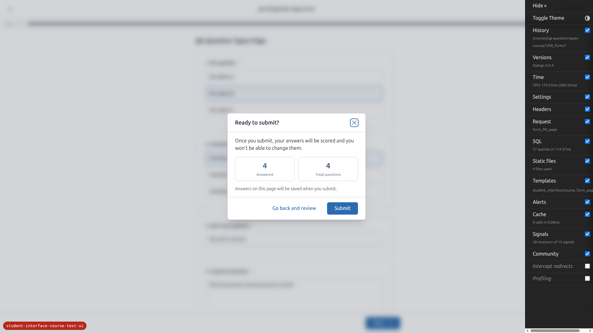

### §5 Exit behaviour (the X control)
- **5a (save-on-exit):** X opens "Leave the test?" → "Your progress is saved — you can resume later." with
  "Keep going" + "Leave and save". Confirming returns to the start screen; attempt stays incomplete and the
  start screen offers **Continue**, resuming at the right page.
- **5b (submit-on-exit):** X opens "Leave the test?" → "Leaving now will submit your answers and score your
  attempt…" with "Leave and submit". Confirming finalises → results page.
- **5b server-side safety net:** started a fresh attempt, answered page 1, then left via raw browser
  navigation (no X). On return the stale attempt was **completed/scored** (Previous attempts: "8 Jun 2026 —
  17% (1/6)"), no lingering "Continue"; "Try Again" starts a new attempt.
- **5c beforeunload:** raw navigation from the runner triggers the generic browser "leave site?" prompt
  (browser-controlled text). It does not POST to any Django endpoint; deliberate submit/exit suppress it via
  `runnerNavigating`.


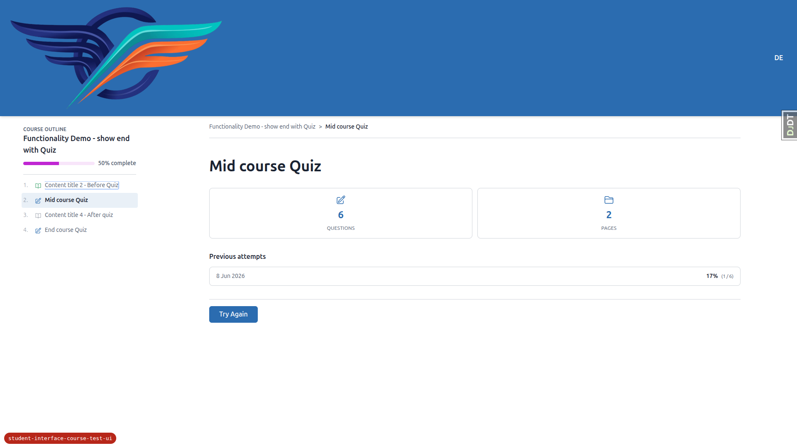

### §6 Results screen
- **6a QUIZ:** normal chrome (not runner layout); pass/fail banner; **SVG score ring** rendering the real
  percentage (25%) in a token colour (`text-primary`/`text-success`/error); real stats ("1 / 4 correct").
  No per-topic breakdown and no "Here's the idea" explanations. Retry link works. *(Incorrect-answers
  review for text types is broken — see BUG 1.)*
- **6b CATEGORY_VALUE_SUM:** "Form complete!" with "Your responses are being reviewed — marking is in
  progress." — no fabricated score. Existing category-display block preserved (Satisfaction 3/7,
  Recommendation 5/5). Continue navigation works.

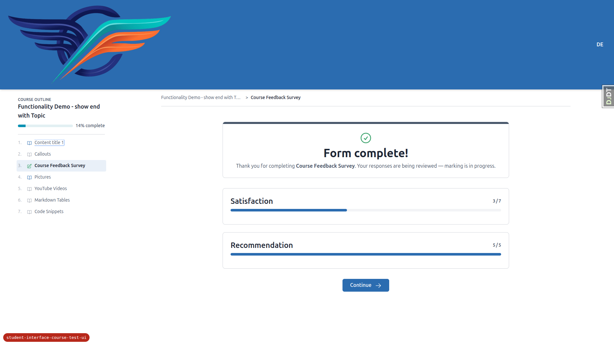

### §7 Theming sanity
- Default theme renders all three screens correctly — no raw/unstyled elements, no broken layout.
- Progress fill uses the **secondary** token (`bg-secondary`).
- **No Phosphor / Google-fonts CDN** links loaded; icons are inline SVG via `c-icon`. (Only pre-existing
  htmx / Alpine-CSP / chart.js deps load from jsdelivr.)
- A separate first-class build was not toggled in this run, so the token-only palette swap was not
  spot-checked (optional per the plan).

### §8 Question-type coverage
- All four types render, are keyboard-operable, correctly labelled, and persist through Next/Back:
  `multiple_choice` (radios), `checkboxes`, `short_text` (`<input type=text>`), `long_text` (`<textarea>`).
- A two-option `multiple_choice` is **not** special-cased: there is **no** `true_false` / bespoke True/False
  component anywhere in the codebase or demo content, so all multiple-choice render uniformly as radio
  tiles. *(No demo question has exactly two options, so a live two-option example could not be observed —
  but the absence of any True/False UI satisfies the requirement.)*
- Text answers persist into scoring; their **display** in the results review is the subject of BUG 1.

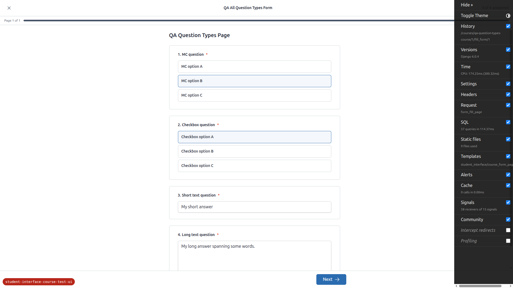

### Responsive (Mobile 375 / Tablet 768)
- **Mobile:** runner top bar, progress strip, and full-width question tiles fit with good touch targets;
  exit/submit dialogs are centred and readable; start screen meta grid stays a tidy 2-up; results banner,
  score ring, and full-width retry stack cleanly.
- **Tablet:** runner uses the same full-viewport chrome (not mobile nav, not the course sidebar); start
  screen meta grid is a balanced 2-column; results render with no overflow.

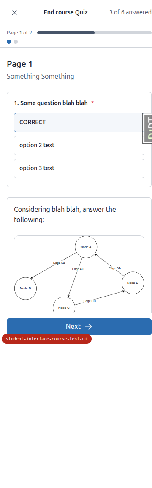
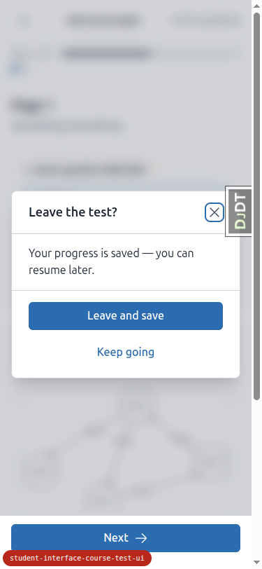
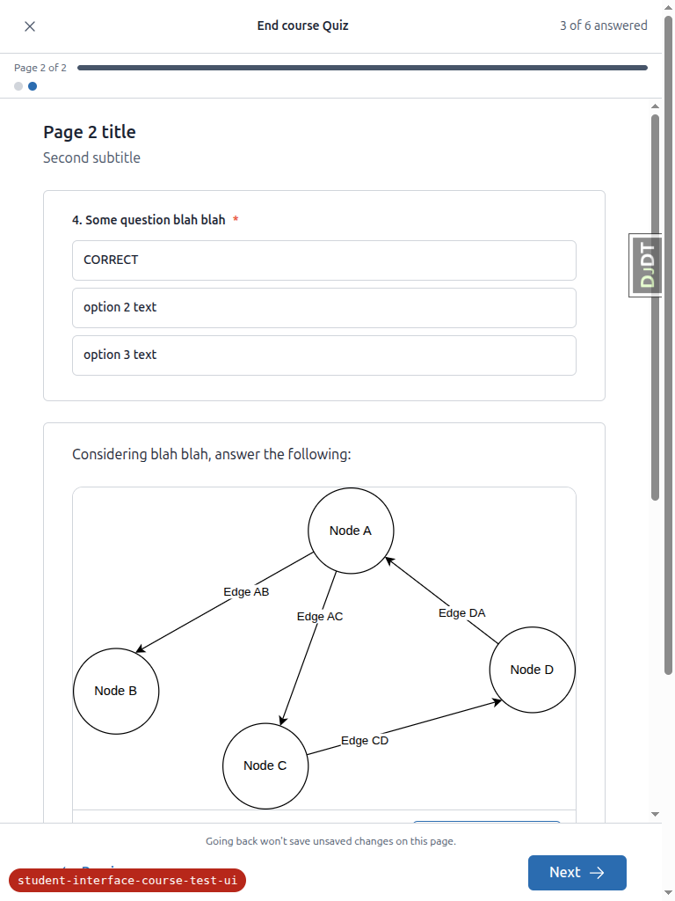
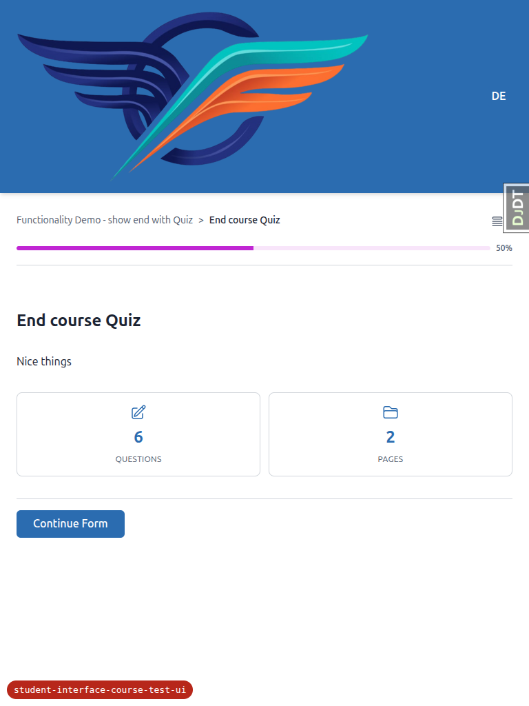

---

## Out-of-scope / tangential observations (not bugs in the feature under test)

1. **`web-share` console warning** — "Unrecognized feature: 'web-share'" appears on a content **topic** page
   (`functionality-demo-show-end-with-topic/1`), not on any test/exam screen. It's a Permissions-Policy
   artifact unrelated to this feature.
2. **Django Debug Toolbar handle** overlaps the right edge of content at mobile/tablet widths. This is the
   dev-only DJDT tab, not part of the shipped UI.
